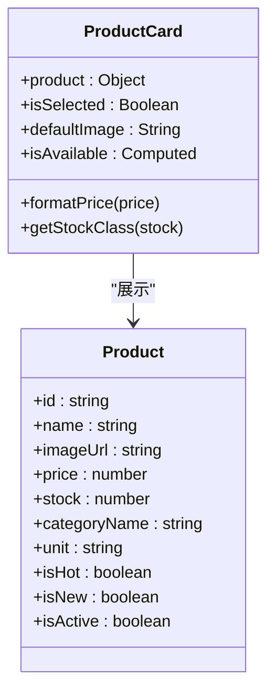
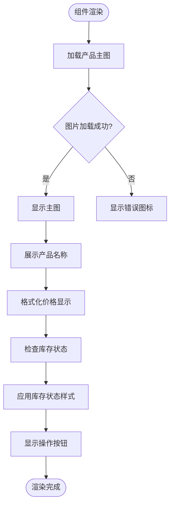
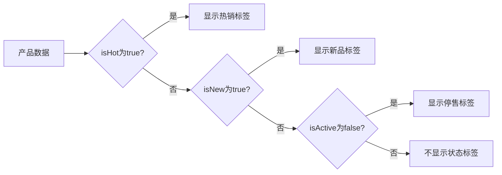
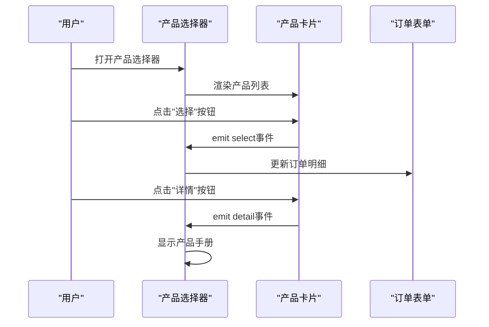
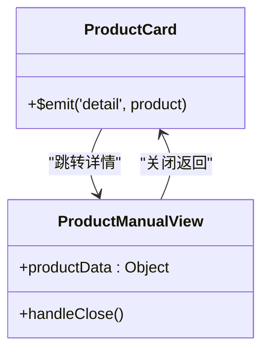
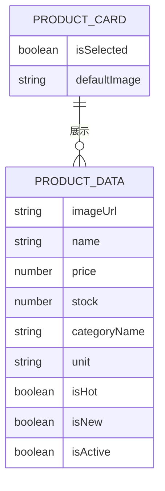
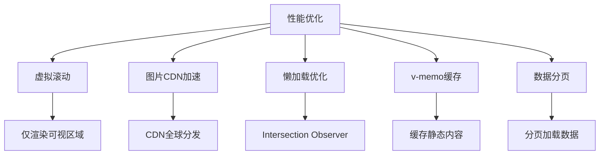

# 产品卡片组件

<cite>
**本文档引用文件**  
- [ProductCard.vue](file://07-frontend/src/components/product/ProductCard.vue)
- [ProductManualView.vue](file://07-frontend/src/pages/product/ProductManualView.vue)
- [ProductManualEdit.vue](file://07-frontend/src/pages/product/ProductManualEdit.vue)
- [ProductSelector.vue](file://07-frontend/src/pages/sales/sales-order/components/ProductSelector.vue)
- [ProductSelector.vue](file://07-frontend/src/pages/quotation/components/ProductSelector.vue)
</cite>

## 目录
1. [组件结构设计](#组件结构设计)
2. [数据展示逻辑](#数据展示逻辑)
3. [响应式布局与交互](#响应式布局与交互)
4. [状态标签动态渲染](#状态标签动态渲染)
5. [应用场景与复用模式](#应用场景与复用模式)
6. [与产品手册的集成](#与产品手册的集成)
7. [插槽扩展与属性控制](#插槽扩展与属性控制)
8. [性能优化建议](#性能优化建议)

## 组件结构设计

产品卡片组件（ProductCard）采用模块化设计，由产品主图、信息区域和操作按钮三大部分构成。组件通过Vue 3的Composition API实现响应式逻辑，使用`<script setup>`语法糖提升开发效率。模板结构清晰，分为图像区域和信息区域，其中图像区域包含主图和状态标签，信息区域包含产品名称、价格、库存和操作按钮。

组件通过props接收`product`对象作为核心数据源，支持自定义默认图片`defaultImage`和选中状态`isSelected`。组件使用Element Plus的`el-image`组件实现图片懒加载和错误处理，当图片加载失败时显示默认的图片图标。



**图示来源**  
- [ProductCard.vue](file://07-frontend/src/components/product/ProductCard.vue#L71-L84)

## 数据展示逻辑

产品卡片组件通过props接收产品数据对象，展示产品主图、名称、规格参数、库存状态等核心信息。主图通过`el-image`组件的`:src`绑定实现，优先使用`product.imageUrl`，若为空则使用`defaultImage`默认图片。产品名称通过`{{ product.name }}`直接展示，并使用CSS的`-webkit-line-clamp`实现最多两行文本溢出省略。

价格信息通过`formatPrice`方法格式化，保留两位小数并添加人民币符号。库存状态通过`getStockClass`计算属性动态绑定CSS类名，实现不同库存状态的视觉区分。组件通过`isAvailable`计算属性判断产品是否可选择，需同时满足`isActive`为true且库存大于0。



**图示来源**  
- [ProductCard.vue](file://07-frontend/src/components/product/ProductCard.vue#L87-L105)

## 响应式布局与交互

产品卡片组件采用响应式设计，适配不同屏幕尺寸。组件基础宽度为固定尺寸，高度为200px的主图区域加固定内边距的信息区域。在移动端，卡片会自动调整为适合移动设备的尺寸。CSS使用`transition`属性实现平滑的悬停动画效果，当用户鼠标悬停时，卡片会上移2px并显示阴影，提升交互体验。

组件通过`cursor: pointer`表明其可点击性，并绑定点击事件。选中状态通过`selected`CSS类实现视觉反馈，选中时边框颜色变为蓝色并添加外发光效果。操作按钮区域使用`display: flex`和`gap`属性实现按钮间距控制，确保在不同分辨率下保持良好的布局。

```mermaid
stateDiagram-v2
[*] --> Normal
Normal --> Hover : "鼠标悬停"
Hover --> Click : "点击"
Click --> Selected : "选中"
Selected --> Normal : "取消选中"
Normal : 正常状态\n边框灰色
Hover : 悬停状态\n上移2px\n显示阴影
Selected : 选中状态\n蓝色边框\n外发光
```

**图示来源**  
- [ProductCard.vue](file://07-frontend/src/components/product/ProductCard.vue#L111-L127)

## 状态标签动态渲染

产品卡片组件通过条件渲染实现状态标签的动态展示。组件使用`v-if`指令根据产品数据中的布尔值字段控制标签显示：当`product.isHot`为true时显示"热销"红色标签，当`product.isNew`为true时显示"新品"绿色标签，当`!product.isActive`为true时显示"停售"灰色标签。

这些标签使用`el-tag`组件实现，定位在主图区域的右上角，采用绝对定位。标签垂直排列，通过`flex-direction: column`和`gap: 4px`实现紧凑布局。这种设计确保了状态信息的醒目展示，同时避免遮挡主图主要内容。



**图示来源**  
- [ProductCard.vue](file://07-frontend/src/components/product/ProductCard.vue#L19-L21)

## 应用场景与复用模式

产品卡片组件在多个业务场景中被复用，主要应用于产品列表页和销售订单创建流程。在销售订单创建场景中，组件被集成到`ProductSelector`中，用户可以通过卡片选择产品并添加到订单明细中。在报价管理场景中，组件同样被用于产品选择器，支持从卡片直接选择产品进行报价。

组件通过`$emit('select', product)`和`$emit('detail', product)`事件与父组件通信，实现选择和查看详情的功能。在销售订单场景中，选中状态通过`isSelected`prop控制，确保用户可以直观地看到已选择的产品。组件的复用性通过props和emits的标准化接口实现，使其能够灵活适应不同业务需求。



**图示来源**  
- [ProductSelector.vue](file://07-frontend/src/pages/sales/sales-order/components/ProductSelector.vue#L72)
- [ProductCard.vue](file://07-frontend/src/components/product/ProductCard.vue#L52)

## 与产品手册的集成

产品卡片组件通过"详情"按钮与产品手册视图（ProductManualView）集成，实现从卡片到详细文档的跳转。当用户点击"详情"按钮时，组件触发`detail`事件，父组件接收到事件后打开产品手册模态框或跳转到详情页面。

产品手册视图采用`el-descriptions`组件以表格形式展示产品的详细信息，包括产品编号、名称、分类、规格型号、单位、状态、材质、颜色、重量、尺寸、价格、库存等20余项属性。主图支持预览功能，点击后可放大查看。这种集成方式实现了从概览到详情的无缝过渡，提升了用户体验。



**图示来源**  
- [ProductCard.vue](file://07-frontend/src/components/product/ProductCard.vue#L45)
- [ProductManualView.vue](file://07-frontend/src/pages/product/ProductManualView.vue#L53-L58)

## 插槽扩展与属性控制

产品卡片组件虽然未直接使用Vue的slot语法，但通过props和事件机制实现了高度的灵活性和可扩展性。通过`product`prop可以控制展示的字段，仅需在传入的产品对象中包含所需属性即可。例如，若不需要显示新品标签，只需确保`isNew`字段为false或不存在。

组件的`defaultImage`prop允许自定义默认图片路径，适应不同部署环境的需求。`isSelected`prop使父组件能够控制卡片的选中状态，支持批量选择等复杂交互。通过`isAvailable`计算属性，组件智能地禁用不可用产品的选择按钮，确保业务规则的一致性。



**图示来源**  
- [ProductCard.vue](file://07-frontend/src/components/product/ProductCard.vue#L71-L84)

## 性能优化建议

为提升产品卡片组件的性能，建议实施以下优化措施：首先，集成虚拟滚动技术，当产品列表较长时，仅渲染可视区域内的卡片，大幅减少DOM节点数量，提升渲染性能。其次，配置图片CDN加速，将产品主图托管到CDN服务，利用CDN的全球分发网络加快图片加载速度。

此外，建议实现图片懒加载优化，使用Intersection Observer API替代传统的滚动事件监听，减少性能开销。对于频繁渲染的列表，可考虑使用`v-memo`指令（Vue 3.2+）缓存静态内容，避免不必要的重新渲染。最后，建议对产品数据进行合理分页，避免一次性加载过多数据导致页面卡顿。



**图示来源**  
- [ProductCard.vue](file://07-frontend/src/components/product/ProductCard.vue)
- [ProductSelector.vue](file://07-frontend/src/pages/sales/sales-order/components/ProductSelector.vue)