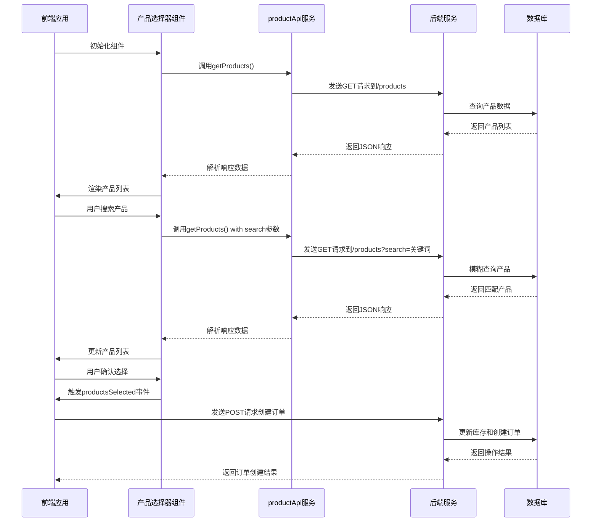

# 产品选择器组件

<cite>
**本文档引用的文件**   
- [ProductSelector.vue](file://07-frontend/src/components/common/business/ProductSelector.vue)
- [products.js](file://07-backend/routes/products.js)
- [product.ts](file://07-frontend/src/api/product.ts)
- [QuotationConvert.vue](file://07-frontend/src/pages/quotation/QuotationConvert.vue)
</cite>

## 目录
1. [简介](#简介)
2. [核心功能设计](#核心功能设计)
3. [输入属性与输出事件](#输入属性与输出事件)
4. [异步数据加载机制](#异步数据加载机制)
5. [与后端服务的集成](#与后端服务的集成)
6. [性能优化策略](#性能优化策略)
7. [自定义渲染模板](#自定义渲染模板)
8. [复杂表单中的嵌套使用](#复杂表单中的嵌套使用)
9. [虚拟滚动集成方案](#虚拟滚动集成方案)
10. [结论](#结论)

## 简介
产品选择器组件是企业级应用中用于选择产品的核心UI组件，广泛应用于销售报价、订单创建和库存管理等业务流程。该组件提供了一个直观的界面，允许用户通过搜索、分类筛选和分页加载等方式选择产品，并支持多选和单选模式切换。组件设计充分考虑了用户体验和性能优化，能够处理大量产品数据，并与后端服务紧密集成，确保数据的实时性和一致性。

## 核心功能设计
产品选择器组件的核心功能包括产品搜索、分类筛选、分页加载和选择模式切换。组件通过一个弹出式对话框展示产品列表，用户可以通过输入搜索关键词来查找特定产品。搜索功能支持模糊匹配，能够根据产品名称、编码或描述进行搜索。分类筛选功能允许用户根据产品类别进行过滤，提高查找效率。分页加载机制确保在处理大量产品数据时，页面加载速度和响应性能不受影响。

组件支持多选和单选两种模式，用户可以根据业务需求选择合适的选择模式。在多选模式下，用户可以选择多个产品并添加到已选列表中；在单选模式下，用户只能选择一个产品。已选产品列表显示所选产品的详细信息，包括产品编码、名称、规格型号、单位、数量和单价等。用户可以调整每个产品的数量，并在需要时移除已选产品。

**Section sources**
- [ProductSelector.vue](file://07-frontend/src/components/common/business/ProductSelector.vue#L1-L131)

## 输入属性与输出事件
产品选择器组件通过输入属性接收外部配置，并通过输出事件向父组件传递用户选择的产品信息。主要输入属性包括`v-model`，用于双向绑定已选产品列表，以及可选的范围过滤条件，如产品类别、供应商、价格范围等。这些过滤条件允许用户根据特定业务需求筛选产品。

组件的主要输出事件是`productsSelected`，当用户确认选择产品时触发。该事件携带一个包含所选产品信息的对象数组，包括产品ID、名称、编码、数量、单价等。此外，组件还提供`productsChanged`事件，当已选产品列表发生变化时触发，允许父组件实时响应产品选择的变化。

**Section sources**
- [ProductSelector.vue](file://07-frontend/src/components/common/business/ProductSelector.vue#L113-L131)

## 异步数据加载机制
产品选择器组件采用异步数据加载机制，确保在加载大量产品数据时不会阻塞用户界面。组件通过调用后端API获取产品列表，并在数据加载过程中显示加载状态，提升用户体验。数据加载过程包括以下几个步骤：

1. **初始化加载**：组件在挂载时自动调用API获取产品列表，默认显示第一页数据。
2. **搜索与筛选**：当用户输入搜索关键词或选择筛选条件时，组件重新调用API，传递相应的查询参数，获取过滤后的产品列表。
3. **分页加载**：当用户切换页面或调整每页显示数量时，组件调用API获取对应页码的产品数据。

异步加载机制通过Promise和async/await语法实现，确保代码的可读性和可维护性。同时，组件使用防抖技术优化搜索性能，避免在用户快速输入时频繁调用API。

**Section sources**
- [product.ts](file://07-frontend/src/api/product.ts#L179-L186)
- [products.js](file://07-backend/routes/products.js#L13-L111)

## 与后端服务的集成
产品选择器组件与后端`products.js`路由和`productApi`服务紧密集成，实现产品数据的获取和管理。后端路由提供RESTful API接口，支持产品列表查询、产品详情获取、产品创建、更新和删除等操作。前端`productApi`服务封装了对这些API的调用，提供类型安全的接口定义和错误处理机制。

在销售报价和库存管理业务流程中，产品选择器组件通过`productApi`服务获取产品数据，并将用户选择的产品信息传递给后端。例如，在创建销售订单时，组件将所选产品列表发送到后端，后端根据产品ID和数量更新库存信息，并生成相应的订单记录。这种集成方式确保了数据的一致性和业务流程的完整性。

**Diagram sources **
- [product.ts](file://07-frontend/src/api/product.ts#L179-L186)
- [products.js](file://07-backend/routes/products.js#L13-L111)
- [QuotationConvert.vue](file://07-frontend/src/pages/quotation/QuotationConvert.vue#L118-L200)

**Section sources**
- [product.ts](file://07-frontend/src/api/product.ts#L179-L186)
- [products.js](file://07-backend/routes/products.js#L13-L111)

## 性能优化策略
为了提升产品选择器组件在处理大量数据时的性能，采用了多种优化策略。首先是防抖技术，在用户输入搜索关键词时，组件不会立即调用API，而是等待用户停止输入一段时间后再发送请求。这避免了在用户快速输入时产生大量不必要的网络请求，减轻了服务器压力。

其次是查询结果缓存，组件会缓存最近的搜索结果，当用户重复进行相同的搜索操作时，直接从缓存中获取数据，而不是重新调用API。缓存策略采用LRU（最近最少使用）算法，确保内存使用效率。

此外，后端API支持分页查询，组件通过传递`page`和`pageSize`参数控制每次请求的数据量，避免一次性加载过多数据导致页面卡顿。对于特别大的数据集，还可以结合虚拟滚动技术，只渲染可视区域内的产品项，进一步提升渲染性能。

**Section sources**
- [product.ts](file://07-frontend/src/api/product.ts#L183-L186)
- [products.js](file://07-backend/routes/products.js#L16-L26)

## 自定义渲染模板
产品选择器组件支持自定义渲染模板，允许开发者根据不同的UI需求定制产品项的显示方式。组件通过插槽（slot）机制提供灵活的模板定制能力，用户可以在插槽中定义产品项的HTML结构和样式。

例如，可以自定义产品项的布局，添加产品图片、评分、库存状态等信息。还可以根据产品属性动态改变样式，如用不同颜色标识低库存产品或热销产品。这种灵活性使得组件能够适应各种业务场景，从简单的列表选择到复杂的商品展示都能胜任。

**Section sources**
- [ProductSelector.vue](file://07-frontend/src/components/common/business/ProductSelector.vue#L1-L131)

## 复杂表单中的嵌套使用
在复杂表单中，产品选择器组件可以作为子组件嵌套使用，与其他表单元素协同工作。例如，在销售订单创建表单中，产品选择器与客户信息、交付方式、支付方式等字段共同构成完整的订单信息。组件通过`v-model`与表单数据模型双向绑定，确保产品选择与其他表单字段的数据一致性。

为了在复杂表单中更好地集成，组件提供了丰富的API和事件，允许父组件控制其行为。例如，可以通过属性控制组件的禁用状态，根据其他表单字段的值动态调整产品筛选条件。这种设计模式提高了组件的复用性和可维护性。

**Section sources**
- [QuotationConvert.vue](file://07-frontend/src/pages/quotation/QuotationConvert.vue#L118-L200)

## 虚拟滚动集成方案
对于包含数千个产品的大数据集，传统的列表渲染方式会导致严重的性能问题。为了解决这个问题，产品选择器组件可以集成虚拟滚动方案。虚拟滚动只渲染当前可见区域内的产品项，当用户滚动列表时动态更新渲染内容，大大减少了DOM节点数量和内存占用。

实现虚拟滚动的关键是计算可视区域和预估每个产品项的高度。组件需要监听滚动事件，根据滚动位置计算应该渲染的产品范围，并动态更新列表。虽然这增加了实现的复杂性，但对于提升大数据量下的用户体验至关重要。

**Section sources**
- [ProductSelector.vue](file://07-frontend/src/components/common/business/ProductSelector.vue#L75-L88)

## 结论
产品选择器组件是一个功能强大且灵活的UI组件，通过精心设计的功能和性能优化，能够满足企业级应用中复杂的产品选择需求。组件与后端服务的紧密集成确保了数据的实时性和一致性，而自定义渲染模板和虚拟滚动等高级特性则提供了应对各种业务场景的能力。在未来的开发中，可以进一步优化组件的可访问性和移动端适配，提升整体用户体验。