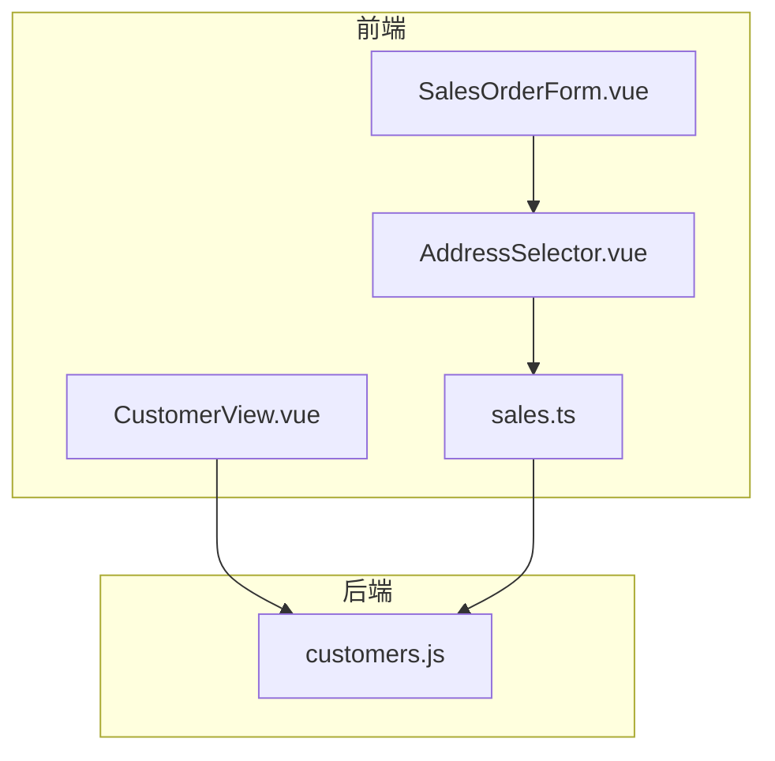
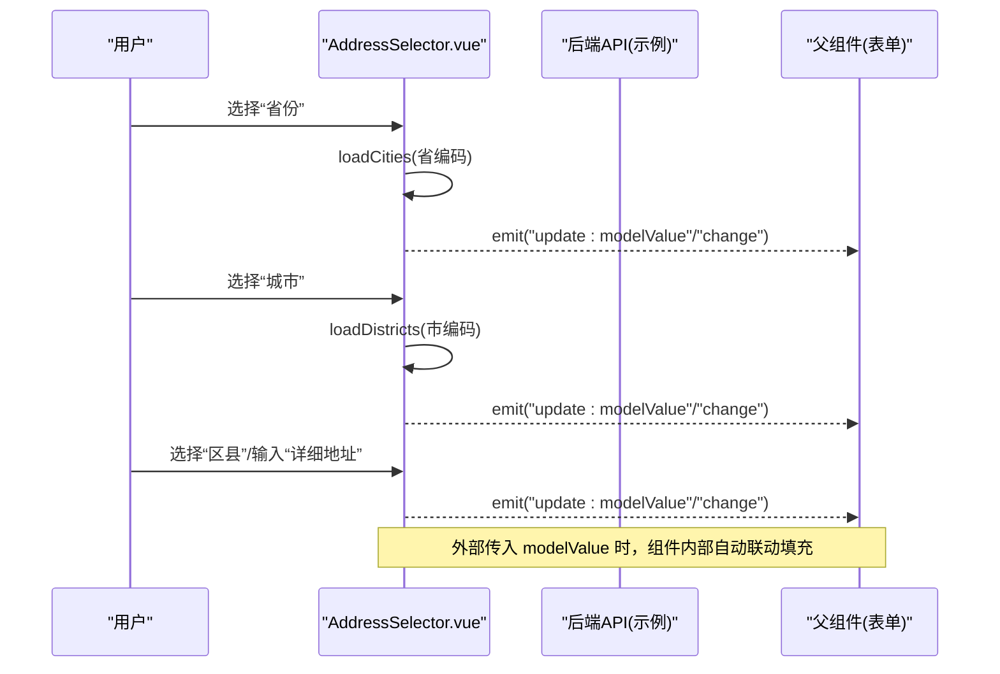
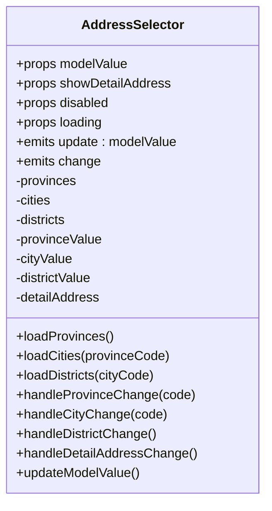
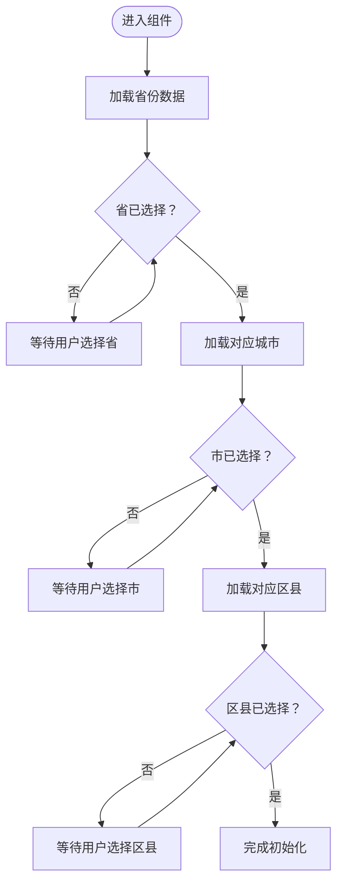
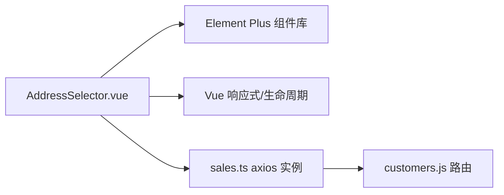

# 地址选择器组件

<cite>
**本文引用的文件**
- [AddressSelector.vue](file://07-frontend/src/components/common/business/AddressSelector.vue)
- [customers.js](file://07-backend/routes/customers.js)
- [SalesOrderForm.vue](file://07-frontend/src/pages/sales/orders/SalesOrderForm.vue)
- [CustomerView.vue](file://07-frontend/src/pages/sales/customers/CustomerView.vue)
- [sales.ts](file://07-frontend/src/api/sales.ts)
</cite>

## 目录
1. [简介](#简介)
2. [项目结构](#项目结构)
3. [核心组件](#核心组件)
4. [架构总览](#架构总览)
5. [详细组件分析](#详细组件分析)
6. [依赖关系分析](#依赖关系分析)
7. [性能考量](#性能考量)
8. [故障排查指南](#故障排查指南)
9. [结论](#结论)
10. [附录](#附录)

## 简介
本文件围绕 AddressSelector 组件进行系统化技术文档梳理，重点说明其如何封装多级地址选择（省/市/区县）的业务逻辑，支持动态数据加载与默认值联动，并给出在销售订单创建与客户信息维护场景中的集成方式、数据校验策略、默认数据源适配方案以及与后端 customers.js 路由的交互流程。同时提供常见问题排查路径，帮助快速定位级联加载失败、默认值不生效等问题。

## 项目结构
AddressSelector 组件位于前端通用业务组件目录，配合后端 customers.js 路由实现客户地址数据的增删改查与统计分析。销售侧的订单与客户视图页面展示了该组件在真实表单中的使用形态。

图表来源
- [AddressSelector.vue](file://07-frontend/src/components/common/business/AddressSelector.vue#L1-L71)
- [SalesOrderForm.vue](file://07-frontend/src/pages/sales/orders/SalesOrderForm.vue#L1-L80)
- [CustomerView.vue](file://07-frontend/src/pages/sales/customers/CustomerView.vue#L1-L64)
- [sales.ts](file://07-frontend/src/api/sales.ts#L1-L71)
- [customers.js](file://07-backend/routes/customers.js#L106-L155)

章节来源
- [AddressSelector.vue](file://07-frontend/src/components/common/business/AddressSelector.vue#L1-L71)
- [SalesOrderForm.vue](file://07-frontend/src/pages/sales/orders/SalesOrderForm.vue#L1-L80)
- [CustomerView.vue](file://07-frontend/src/pages/sales/customers/CustomerView.vue#L1-L64)
- [sales.ts](file://07-frontend/src/api/sales.ts#L1-L71)
- [customers.js](file://07-backend/routes/customers.js#L106-L155)

## 核心组件
AddressSelector 是一个基于 Element Plus 的多级联动地址选择器，提供省/市/区县三级选择与可选的详细地址输入。其核心特性包括：
- v-model 双向绑定：通过 update:modelValue 与 change 事件向上游同步地址数据
- 动态数据加载：挂载时加载省份，省变更时加载对应城市，市变更时加载区县
- 默认值联动：监听外部传入的 modelValue，自动填充省市区与详细地址
- 可选详细地址：通过 showDetailAddress 控制是否渲染详细地址输入框
- 禁用与加载态：disabled 与 loading 属性用于控制交互状态

章节来源
- [AddressSelector.vue](file://07-frontend/src/components/common/business/AddressSelector.vue#L72-L117)
- [AddressSelector.vue](file://07-frontend/src/components/common/business/AddressSelector.vue#L197-L234)
- [AddressSelector.vue](file://07-frontend/src/components/common/business/AddressSelector.vue#L236-L268)
- [AddressSelector.vue](file://07-frontend/src/components/common/business/AddressSelector.vue#L270-L298)

## 架构总览
AddressSelector 的数据流与事件流如下：
- 初始化：组件挂载时加载省份数据
- 省变更：触发加载对应城市的区县数据，并清空后续层级
- 市变更：触发加载对应区县数据，并清空区县层级
- 区县/详细地址变更：向上游发出 update:modelValue 与 change 事件
- 外部默认值：监听外部 modelValue，按省/市/区县顺序联动填充

图表来源
- [AddressSelector.vue](file://07-frontend/src/components/common/business/AddressSelector.vue#L197-L234)
- [AddressSelector.vue](file://07-frontend/src/components/common/business/AddressSelector.vue#L236-L268)
- [AddressSelector.vue](file://07-frontend/src/components/common/business/AddressSelector.vue#L270-L298)

## 详细组件分析

### 组件类图
AddressSelector 采用 Composition API，内部包含响应式状态、计算属性与事件发射，对外暴露 v-model 与 change 事件。

图表来源
- [AddressSelector.vue](file://07-frontend/src/components/common/business/AddressSelector.vue#L72-L117)
- [AddressSelector.vue](file://07-frontend/src/components/common/business/AddressSelector.vue#L197-L234)
- [AddressSelector.vue](file://07-frontend/src/components/common/business/AddressSelector.vue#L236-L268)
- [AddressSelector.vue](file://07-frontend/src/components/common/business/AddressSelector.vue#L270-L298)

### 数据加载与级联流程
- 省份数据：首次挂载时加载；省变更时清空城市与区县并重新加载
- 城市数据：省变更时加载；市变更时清空区县并重新加载
- 区县数据：仅在市变更时加载
- 默认值联动：监听外部 modelValue，按省/市/区县顺序填充，避免异步竞态

图表来源
- [AddressSelector.vue](file://07-frontend/src/components/common/business/AddressSelector.vue#L197-L234)
- [AddressSelector.vue](file://07-frontend/src/components/common/business/AddressSelector.vue#L270-L298)

### 事件与插槽
- 事件
  - update:modelValue：双向绑定更新
  - change：地址变更通知
- 插槽
  - 当前版本未提供具名插槽，可通过外部容器包裹实现布局或样式扩展

章节来源
- [AddressSelector.vue](file://07-frontend/src/components/common/business/AddressSelector.vue#L102-L116)

### Props 配置项
- modelValue：包含 province、city、district、detail 字段的对象
- showDetailAddress：是否显示详细地址输入框
- disabled：整体禁用
- loading：加载中状态（影响交互）

章节来源
- [AddressSelector.vue](file://07-frontend/src/components/common/business/AddressSelector.vue#L82-L100)

### 与后端 customers.js 的交互
- 客户详情接口：GET /:id，包含 addresses 列表，可用于默认地址回显
- 客户创建/更新接口：POST / 与 PUT /:id，支持批量写入 addresses
- 该路由与 AddressSelector 的直接耦合点在于：父组件在加载客户详情时，将 addresses 中的默认地址作为 modelValue 传入 AddressSelector，从而实现默认值联动

章节来源
- [customers.js](file://07-backend/routes/customers.js#L106-L155)
- [customers.js](file://07-backend/routes/customers.js#L158-L241)
- [customers.js](file://07-backend/routes/customers.js#L259-L333)

### 在销售订单与客户视图中的集成
- 销售订单表单（SalesOrderForm.vue）：可在“收货地址”区域引入 AddressSelector，通过 v-model 绑定地址字段，并在表单校验规则中加入必填校验
- 客户视图（CustomerView.vue）：展示客户地址信息，便于核对 AddressSelector 的输出结果

章节来源
- [SalesOrderForm.vue](file://07-frontend/src/pages/sales/orders/SalesOrderForm.vue#L1-L80)
- [CustomerView.vue](file://07-frontend/src/pages/sales/customers/CustomerView.vue#L1-L64)

## 依赖关系分析
- 组件依赖
  - Element Plus 的 el-select、el-option、el-input、el-row、el-col
  - Vue 响应式与生命周期（ref、watch、onMounted、computed）
- 外部接口
  - 前端统一通过 sales.ts 的 axios 实例发起请求，自动注入 Authorization 与错误处理
  - 后端 customers.js 提供客户与地址相关接口

图表来源
- [AddressSelector.vue](file://07-frontend/src/components/common/business/AddressSelector.vue#L1-L71)
- [sales.ts](file://07-frontend/src/api/sales.ts#L1-L71)
- [customers.js](file://07-backend/routes/customers.js#L106-L155)

章节来源
- [AddressSelector.vue](file://07-frontend/src/components/common/business/AddressSelector.vue#L1-L71)
- [sales.ts](file://07-frontend/src/api/sales.ts#L1-L71)
- [customers.js](file://07-backend/routes/customers.js#L106-L155)

## 性能考量
- 异步加载延迟：组件内部对加载过程进行了延迟模拟，建议在接入真实 API 时保持一致的加载反馈，避免用户误以为卡顿
- 级联清空：省/市变更时清空后续层级，减少无效数据渲染
- 默认值联动：使用深监听与分层填充，避免不必要的重渲染
- 建议优化
  - 对 provinces/cities/districts 增加本地缓存，减少重复请求
  - 对外部 modelValue 的监听增加节流/防抖，避免高频更新
  - 在大列表场景下考虑虚拟滚动或分页加载

[本节为通用指导，不直接分析具体文件]

## 故障排查指南
- 级联加载失败
  - 检查省/市变更时是否正确触发 loadCities/loadDistricts
  - 确认外部传入的 modelValue 是否包含合法的 province/city 编码
  - 若使用真实 API，确认接口返回结构与组件期望一致
- 默认值不生效
  - 确保在 provinces 已加载后再填充 city，再填充 district
  - 检查外部传入的 modelValue 类型与字段命名是否匹配
- 详细地址未同步
  - 确认 showDetailAddress 已开启
  - 检查 handleDetailAddressChange 是否被触发
- 交互异常
  - disabled/loading 状态是否正确传递
  - 省/市/区县选择框的禁用条件是否符合预期

章节来源
- [AddressSelector.vue](file://07-frontend/src/components/common/business/AddressSelector.vue#L197-L234)
- [AddressSelector.vue](file://07-frontend/src/components/common/business/AddressSelector.vue#L236-L268)
- [AddressSelector.vue](file://07-frontend/src/components/common/business/AddressSelector.vue#L270-L298)

## 结论
AddressSelector 以清晰的级联逻辑与双向绑定事件，有效支撑销售订单与客户管理中的地址录入需求。通过合理的 props 设计、事件发射与默认值联动，组件在真实业务表单中具备良好的可复用性。建议在接入真实后端 API 时，完善缓存与错误处理，并在表单层面补充必要的校验规则，确保数据一致性与用户体验。

[本节为总结性内容，不直接分析具体文件]

## 附录

### 默认数据源适配方案
- 内置模拟数据：组件内置 mockAddressData，便于演示与开发调试
- 真实 API 对接：建议在 loadProvinces/loadCities/loadDistricts 中替换为真实接口调用，返回与 mock 结构一致的对象数组

章节来源
- [AddressSelector.vue](file://07-frontend/src/components/common/business/AddressSelector.vue#L129-L178)
- [AddressSelector.vue](file://07-frontend/src/components/common/business/AddressSelector.vue#L197-L234)

### 自定义 API 对接方法
- 在 loadProvinces 中调用真实省份接口，返回 provinces 数组
- 在 loadCities 中根据省编码调用城市接口，返回 cities 数组
- 在 loadDistricts 中根据市编码调用区县接口，返回 districts 数组
- 保持与现有数据结构一致（code/name），以便组件内部逻辑无需改动

章节来源
- [AddressSelector.vue](file://07-frontend/src/components/common/business/AddressSelector.vue#L197-L234)

### 与后端 customers.js 的交互要点
- 客户详情 GET /:id 返回 addresses 列表，可用于默认地址回显
- 客户创建/更新 POST / 与 PUT /:id 支持批量写入 addresses
- 建议在父组件加载客户详情时，将 addresses 中的默认地址转换为 AddressSelector 所需的 modelValue 结构

章节来源
- [customers.js](file://07-backend/routes/customers.js#L106-L155)
- [customers.js](file://07-backend/routes/customers.js#L158-L241)
- [customers.js](file://07-backend/routes/customers.js#L259-L333)