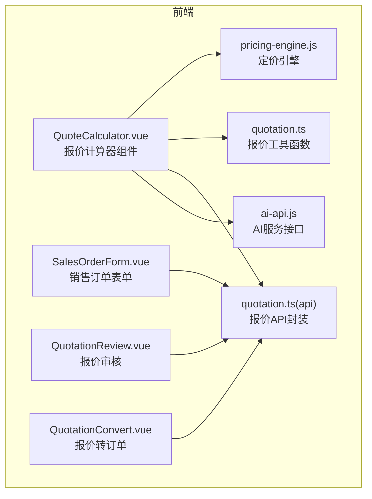
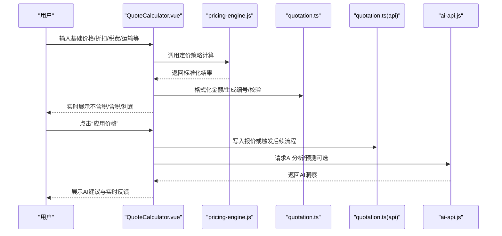
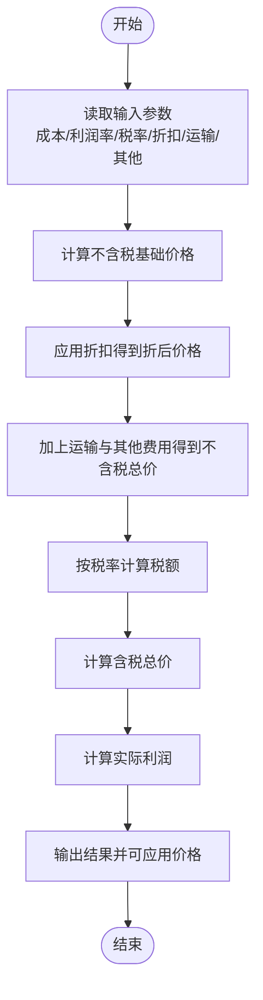
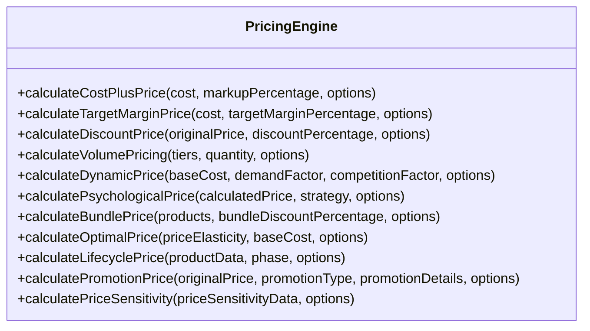
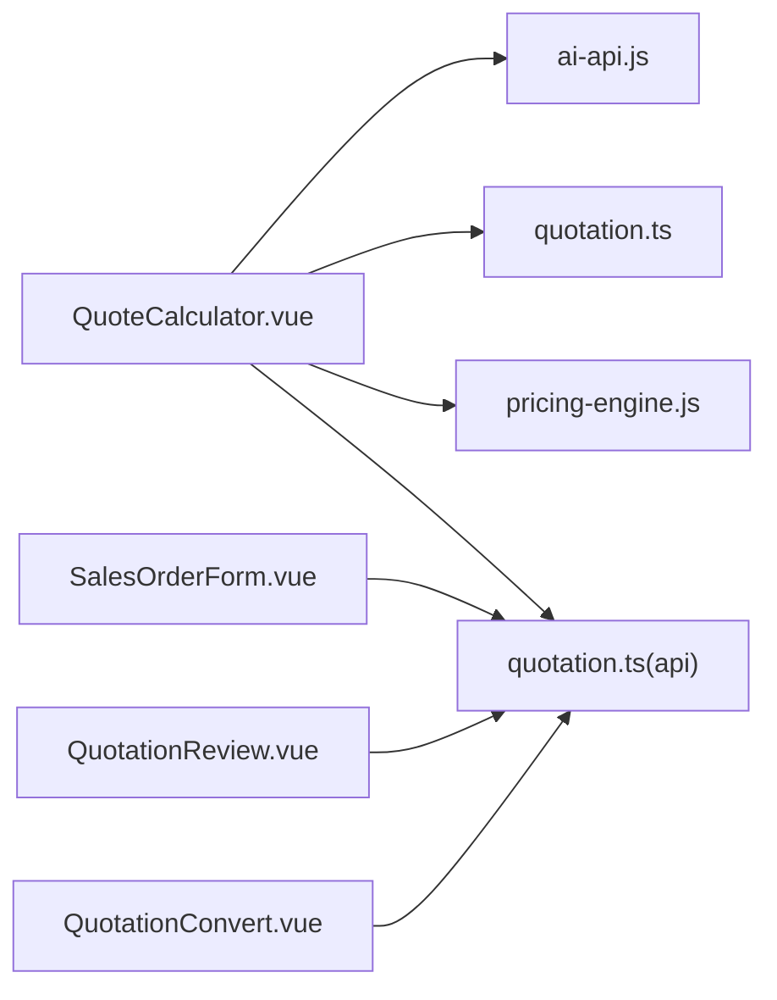

# 报价计算器组件

<cite>
**本文引用的文件**
- [QuoteCalculator.vue](file://07-frontend/src/components/common/business/QuoteCalculator.vue)
- [pricing-engine.js](file://07-frontend/src/utils/business/pricing-engine.js)
- [quotation.ts](file://07-frontend/src/utils/quotation.ts)
- [quotation.ts(api)](file://07-frontend/src/api/quotation.ts)
- [ai-api.js](file://07-frontend/src/services/api/ai-api.js)
- [SalesOrderForm.vue](file://07-frontend/src/pages/sales/orders/SalesOrderForm.vue)
- [QuotationReview.vue](file://07-frontend/src/pages/quotation/QuotationReview.vue)
- [QuotationConvert.vue](file://07-frontend/src/pages/quotation/QuotationConvert.vue)
</cite>

## 目录
1. [引言](#引言)
2. [项目结构](#项目结构)
3. [核心组件](#核心组件)
4. [架构总览](#架构总览)
5. [详细组件分析](#详细组件分析)
6. [依赖分析](#依赖分析)
7. [性能考量](#性能考量)
8. [故障排查指南](#故障排查指南)
9. [结论](#结论)
10. [附录](#附录)

## 引言
本文件围绕报价计算器组件展开，系统性剖析其计算模型、用户交互逻辑与前后端协同机制。重点说明如何整合基础价格、折扣率、税费、运输成本等因子进行动态报价；解释静态配置与远程规则引擎两种计算规则配置方式；梳理前端如何调用AI驱动的定价策略并实时反馈给用户；提供可视化配置界面说明与历史版本对比思路；列举典型使用场景（批量报价、促销活动定价）并给出性能优化建议（避免重复计算、使用Web Worker处理复杂运算）。

## 项目结构
报价计算器相关代码主要分布在以下位置：
- 前端通用业务组件：QuoteCalculator.vue
- 定价引擎工具：pricing-engine.js
- 报价工具函数：quotation.ts
- 报价API封装：quotation.ts(api)
- AI服务接口：ai-api.js
- 销售与报价页面：SalesOrderForm.vue、QuotationReview.vue、QuotationConvert.vue

图示来源
- [QuoteCalculator.vue](file://07-frontend/src/components/common/business/QuoteCalculator.vue#L1-L160)
- [pricing-engine.js](file://07-frontend/src/utils/business/pricing-engine.js#L1-L120)
- [quotation.ts](file://07-frontend/src/utils/quotation.ts#L1-L120)
- [quotation.ts(api)](file://07-frontend/src/api/quotation.ts#L1-L120)
- [ai-api.js](file://07-frontend/src/services/api/ai-api.js#L1-L120)
- [SalesOrderForm.vue](file://07-frontend/src/pages/sales/orders/SalesOrderForm.vue#L1-L80)
- [QuotationReview.vue](file://07-frontend/src/pages/quotation/QuotationReview.vue#L1-L80)
- [QuotationConvert.vue](file://07-frontend/src/pages/quotation/QuotationConvert.vue#L1-L80)

章节来源
- [QuoteCalculator.vue](file://07-frontend/src/components/common/business/QuoteCalculator.vue#L1-L160)
- [pricing-engine.js](file://07-frontend/src/utils/business/pricing-engine.js#L1-L120)
- [quotation.ts](file://07-frontend/src/utils/quotation.ts#L1-L120)
- [quotation.ts(api)](file://07-frontend/src/api/quotation.ts#L1-L120)
- [ai-api.js](file://07-frontend/src/services/api/ai-api.js#L1-L120)
- [SalesOrderForm.vue](file://07-frontend/src/pages/sales/orders/SalesOrderForm.vue#L1-L80)
- [QuotationReview.vue](file://07-frontend/src/pages/quotation/QuotationReview.vue#L1-L80)
- [QuotationConvert.vue](file://07-frontend/src/pages/quotation/QuotationConvert.vue#L1-L80)

## 核心组件
- 报价计算器组件（QuoteCalculator.vue）：提供基础价格、利润率、税率、折扣率、运输费用、其他费用等输入项，实时计算不含税价格、税额、含税总价与利润，并支持“应用价格”事件向父组件传递结果。
- 定价引擎（pricing-engine.js）：提供多种定价策略（成本加成、目标利润率、折扣、批量定价、动态定价、心理定价、捆绑销售、最优定价、生命周期定价、促销定价、价格敏感性分析等），统一输出标准化结果对象。
- 报价工具函数（quotation.ts）：提供报价项目金额计算、报价总金额汇总、报价编号生成、数据校验、下载与复制等辅助能力。
- 报价API封装（quotation.ts(api)）：封装报价的增删改查、导出、转换为订单、状态批量更新等接口。
- AI服务接口（ai-api.js）：提供AI分析、推荐、聊天、图像识别、语音服务、NLP、模型管理、数据管理、监控与配置等接口，可用于驱动定价策略或提供市场洞察。

章节来源
- [QuoteCalculator.vue](file://07-frontend/src/components/common/business/QuoteCalculator.vue#L1-L160)
- [pricing-engine.js](file://07-frontend/src/utils/business/pricing-engine.js#L1-L200)
- [quotation.ts](file://07-frontend/src/utils/quotation.ts#L195-L240)
- [quotation.ts(api)](file://07-frontend/src/api/quotation.ts#L168-L240)
- [ai-api.js](file://07-frontend/src/services/api/ai-api.js#L1-L120)

## 架构总览
报价计算器的前端架构围绕“组件-工具-API-服务”的分层设计展开：
- 组件层：负责用户交互与输入收集，触发计算与事件派发。
- 工具层：提供定价引擎与报价工具函数，支撑复杂计算与格式化。
- API层：封装报价相关REST接口，统一错误处理与响应格式。
- 服务层：对接AI服务，提供数据分析、趋势预测、推荐等能力，辅助定价决策。

图示来源
- [QuoteCalculator.vue](file://07-frontend/src/components/common/business/QuoteCalculator.vue#L120-L160)
- [pricing-engine.js](file://07-frontend/src/utils/business/pricing-engine.js#L1-L120)
- [quotation.ts](file://07-frontend/src/utils/quotation.ts#L1-L120)
- [quotation.ts(api)](file://07-frontend/src/api/quotation.ts#L168-L240)
- [ai-api.js](file://07-frontend/src/services/api/ai-api.js#L1-L120)

## 详细组件分析

### 报价计算器组件（QuoteCalculator.vue）
- 输入参数
  - 基础价格：产品成本
  - 期望利润率：百分比
  - 税率：13%、9%、6%、0%
  - 折扣率：百分比
  - 运输费用：固定金额
  - 其他费用：固定金额
- 计算规则
  - 不含税基础价格 = 成本 × (1 + 利润率/100)
  - 折后价格 = 不含税基础价格 × (1 − 折扣率/100)
  - 不含税总价 = 折后价格 + 运输费用 + 其他费用
  - 税额 = 不含税总价 × 税率
  - 含税总价 = 不含税总价 + 税额
  - 实际利润 = 不含税总价 − 成本 − 运输费用 − 其他费用
- 输出结果
  - 不含税价格、税额、含税总价、利润
  - 支持“应用价格”事件，将计算结果与输入参数一并传递给父组件
- 用户交互
  - 实时计算与结果显示
  - 重置按钮清空输入
  - 模板保存功能预留提示

图示来源
- [QuoteCalculator.vue](file://07-frontend/src/components/common/business/QuoteCalculator.vue#L95-L123)

章节来源
- [QuoteCalculator.vue](file://07-frontend/src/components/common/business/QuoteCalculator.vue#L1-L160)

### 定价引擎（pricing-engine.js）
- 能力范围
  - 成本加成定价、目标利润率定价、折扣定价
  - 批量定价（阶梯价格）
  - 动态定价（基于需求与竞争）
  - 心理定价（99定价法、四舍五入、声望定价）
  - 捆绑销售定价
  - 最优定价（基于价格弹性）
  - 生命周期定价（引入/成长/成熟/衰退）
  - 促销定价（百分比折扣、固定金额折扣、买X送Y、达到阈值折扣）
  - 价格敏感性分析（多情景模拟与最优解）
- 设计要点
  - 统一的输入校验与异常抛出
  - 可配置的精度、舍入与最低价格约束
  - 结果对象标准化，便于前端渲染与后续处理

图示来源
- [pricing-engine.js](file://07-frontend/src/utils/business/pricing-engine.js#L1-L692)

章节来源
- [pricing-engine.js](file://07-frontend/src/utils/business/pricing-engine.js#L1-L692)

### 报价工具函数（quotation.ts）
- 报价项目金额计算：数量 × 单价 − 数量 × 单价 × 折扣率
- 报价总金额汇总：小计、总折扣、合计
- 报价编号生成：基于当前日期与时间戳
- 报价数据校验：客户、联系人、电话、有效期、项目清单与单价/数量/折扣率合法性
- 其他实用函数：金额格式化、日期格式化、确认对话框、文件下载、复制到剪贴板、防抖/节流、深拷贝、文件大小格式化、状态颜色映射、手机号/邮箱校验、金额输入格式化

章节来源
- [quotation.ts](file://07-frontend/src/utils/quotation.ts#L195-L240)
- [quotation.ts](file://07-frontend/src/utils/quotation.ts#L225-L289)
- [quotation.ts](file://07-frontend/src/utils/quotation.ts#L1-L120)

### 报价API封装（quotation.ts(api)）
- 接口职责
  - 获取报价列表、详情、创建、更新、删除
  - 提交审核、审核、审批、取消
  - 转换为订单、上传/删除附件、导出、批量更新状态、统计
- 错误处理
  - 统一拦截器处理401/403/404/500等错误并提示

章节来源
- [quotation.ts(api)](file://07-frontend/src/api/quotation.ts#L168-L331)

### AI服务接口（ai-api.js）
- 能力范围
  - 数据分析、趋势预测、异常检测、关联分析、聚类分析
  - 个性化/相似/热门推荐、模型训练与反馈
  - 聊天机器人、快捷回复、评价回复
  - 图像识别（分类、物体检测、人脸识别、OCR、相似搜索）
  - 语音服务（STT、TTS、情感分析、声纹识别）
  - NLP（文本分析、情感分析、关键词提取、摘要、语言检测、翻译）
  - 模型管理、数据集管理、监控与日志、配置管理
- 使用场景
  - 将AI洞察用于动态定价、促销策略、客户画像与推荐

章节来源
- [ai-api.js](file://07-frontend/src/services/api/ai-api.js#L1-L284)

### 页面集成与工作流
- 销售订单表单（SalesOrderForm.vue）：在创建订单时，可通过报价工具函数计算单项金额与合计，或通过报价API获取报价明细。
- 报价审核（QuotationReview.vue）：展示报价明细与汇总，支持审核通过/拒绝。
- 报价转订单（QuotationConvert.vue）：将报价单转换为订单，复制备注与金额等信息。

章节来源
- [SalesOrderForm.vue](file://07-frontend/src/pages/sales/orders/SalesOrderForm.vue#L1-L151)
- [QuotationReview.vue](file://07-frontend/src/pages/quotation/QuotationReview.vue#L1-L120)
- [QuotationConvert.vue](file://07-frontend/src/pages/quotation/QuotationConvert.vue#L1-L120)

## 依赖分析
- 组件耦合
  - QuoteCalculator.vue 依赖 pricing-engine.js 与 quotation.ts，用于计算与格式化；通过事件向父组件传递结果。
  - 页面组件（QuotationReview.vue、QuotationConvert.vue、SalesOrderForm.vue）依赖 quotation.ts(api) 进行数据持久化与流程控制。
  - AI服务接口（ai-api.js）作为可选依赖，用于增强定价策略与提供市场洞察。
- 外部依赖
  - Element Plus 组件库用于表单、按钮、消息提示等UI。
  - Axios 用于HTTP请求与拦截器。
- 潜在循环依赖
  - 当前文件间无直接循环导入；若在父组件中再次引入QuoteCalculator.vue，需注意事件冒泡与数据流向。

图示来源
- [QuoteCalculator.vue](file://07-frontend/src/components/common/business/QuoteCalculator.vue#L1-L160)
- [pricing-engine.js](file://07-frontend/src/utils/business/pricing-engine.js#L1-L120)
- [quotation.ts](file://07-frontend/src/utils/quotation.ts#L1-L120)
- [quotation.ts(api)](file://07-frontend/src/api/quotation.ts#L168-L240)
- [ai-api.js](file://07-frontend/src/services/api/ai-api.js#L1-L120)
- [SalesOrderForm.vue](file://07-frontend/src/pages/sales/orders/SalesOrderForm.vue#L1-L80)
- [QuotationReview.vue](file://07-frontend/src/pages/quotation/QuotationReview.vue#L1-L80)
- [QuotationConvert.vue](file://07-frontend/src/pages/quotation/QuotationConvert.vue#L1-L80)

## 性能考量
- 避免重复计算
  - 使用响应式计算（computed）缓存中间结果，减少不必要的重复计算。
  - 对高频输入（如折扣率、数量）采用防抖/节流，降低频繁触发计算的开销。
- 并行与异步
  - 将复杂计算（如价格敏感性分析、最优定价）放入后台线程或Web Worker，避免阻塞UI。
- 数据结构与算法
  - 批量定价使用排序与二分查找思想，确保O(n log n)或线性扫描的效率。
  - 金额计算统一使用定点数格式化，避免浮点误差累积。
- 界面渲染
  - 使用虚拟滚动与懒加载表格，减少DOM节点数量。
  - 对大列表采用分页或无限滚动策略。

## 故障排查指南
- 输入校验
  - 使用报价工具函数中的 validateQuotationData 校验客户、联系人、电话、有效期、项目清单与单价/数量/折扣率合法性。
- 错误拦截
  - 报价API封装包含统一的请求/响应拦截器，自动处理401/403/404/500等错误并提示。
- 金额格式化
  - 使用 formatCurrency 与 formatAmountInput，确保金额显示与输入一致。
- 事件与状态
  - QuoteCalculator.vue 通过 priceCalculated 事件向外传递结果，父组件需正确接收与处理。
- AI接口调用
  - 若启用AI洞察，需检查 ai-api.js 的可用性与网络状态，必要时降级为本地计算。

章节来源
- [quotation.ts](file://07-frontend/src/utils/quotation.ts#L225-L289)
- [quotation.ts(api)](file://07-frontend/src/api/quotation.ts#L19-L71)
- [QuoteCalculator.vue](file://07-frontend/src/components/common/business/QuoteCalculator.vue#L137-L144)
- [ai-api.js](file://07-frontend/src/services/api/ai-api.js#L1-L120)

## 结论
报价计算器组件通过清晰的输入-计算-输出闭环，结合定价引擎与报价工具函数，实现了对基础价格、折扣率、税费、运输成本等因子的动态整合。前端可灵活选择静态配置或远程规则引擎，并通过AI服务增强定价策略。页面组件与API封装保证了报价流程的完整性与一致性。建议在高频交互场景中引入防抖/节流与Web Worker，以提升用户体验与系统性能。

## 附录
- 可视化配置界面说明
  - 表单字段：成本、利润率、税率、折扣率、运输费用、其他费用。
  - 实时反馈：在用户输入时即时计算并展示不含税/含税/利润。
  - 历史版本对比：可在报价历史模块中记录每次计算的参数与结果，支持对比与回溯。
- 典型使用场景
  - 批量报价：使用批量定价（阶梯价格）与促销定价（阈值折扣/买X送Y）组合策略。
  - 促销活动定价：结合折扣定价与促销定价，配合AI趋势预测与推荐，制定动态促销方案。
  - 生命周期定价：根据产品所处阶段（引入/成长/成熟/衰退）选择撇脂/渗透/稳定/清仓策略。
- 性能优化建议
  - 使用响应式计算缓存中间结果，减少重复计算。
  - 对复杂算法（最优定价、价格敏感性分析）采用Web Worker或后台线程执行。
  - 对高频输入采用防抖/节流，降低计算频率。
  - 对大列表采用虚拟滚动与分页，减少DOM压力。