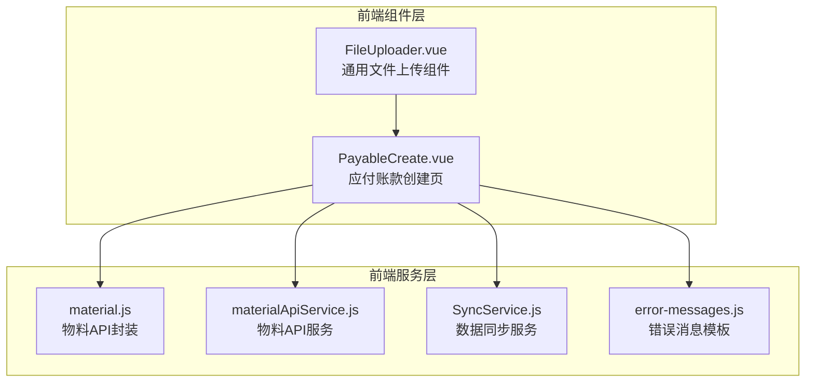
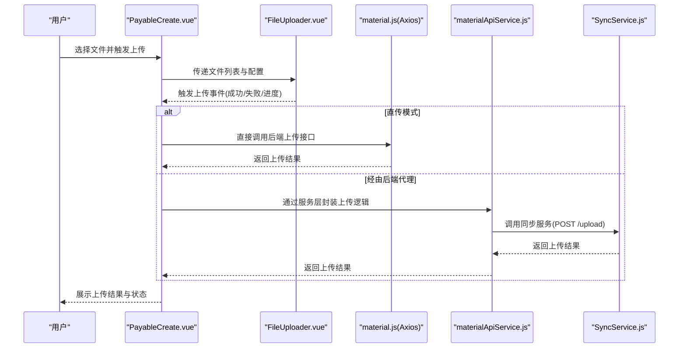
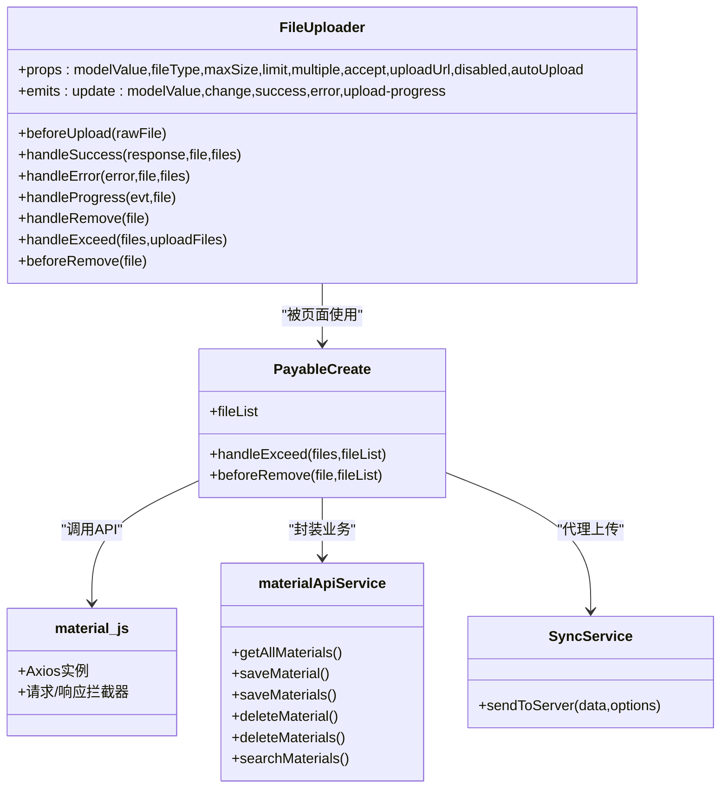
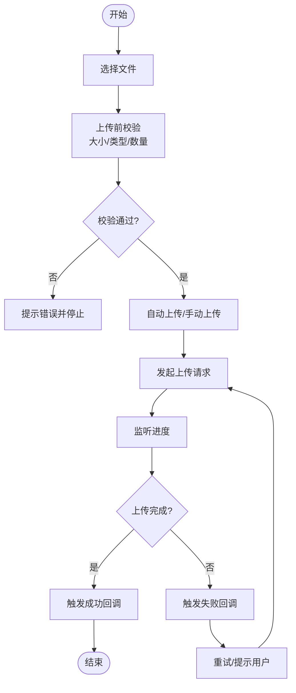

# 文件上传组件

<cite>
**本文引用的文件**
- [FileUploader.vue](file://07-frontend/src/components/common/business/FileUploader.vue)
- [material.js](file://07-frontend/src/api/material.js)
- [materialApiService.js](file://07-frontend/src/services/api/materialApiService.js)
- [PayableCreate.vue](file://07-frontend/src/pages/finance/accounts-payable/PayableCreate.vue)
- [SyncService.js](file://07-frontend/src/services/SyncService.js)
- [error-messages.js](file://07-frontend/src/utils/error-handling/error-messages.js)
</cite>

## 目录
1. [简介](#简介)
2. [项目结构](#项目结构)
3. [核心组件](#核心组件)
4. [架构总览](#架构总览)
5. [详细组件分析](#详细组件分析)
6. [依赖关系分析](#依赖关系分析)
7. [性能考量](#性能考量)
8. [故障排查指南](#故障排查指南)
9. [结论](#结论)
10. [附录](#附录)

## 简介
本文件围绕前端通用业务组件 FileUploader 的实现机制进行系统性说明，覆盖文件选择、预览、上传流程、进度显示、错误重试、上传模式与配置参数、与后端接口协同（以文档管理与工艺工程模块为例），以及上传前校验、状态管理、回调钩子使用示例、断点续传与并发控制原理、跨域与超时异常处理建议等内容。旨在帮助开发者快速理解并正确使用该组件，支撑物料管理、财务审批、文档版本等场景下的附件上传需求。

## 项目结构
FileUploader 组件位于通用业务组件目录，配合 Element Plus 的 el-upload 实现拖拽/点击上传、文件列表渲染、进度与状态展示；同时在多个页面中作为通用上传控件使用，例如应付账款创建页。

图表来源
- [FileUploader.vue](file://07-frontend/src/components/common/business/FileUploader.vue#L1-L84)
- [PayableCreate.vue](file://07-frontend/src/pages/finance/accounts-payable/PayableCreate.vue#L130-L170)
- [material.js](file://07-frontend/src/api/material.js#L1-L81)
- [materialApiService.js](file://07-frontend/src/services/api/materialApiService.js#L1-L211)
- [SyncService.js](file://07-frontend/src/services/SyncService.js#L59-L106)
- [error-messages.js](file://07-frontend/src/utils/error-handling/error-messages.js#L168-L214)

章节来源
- [FileUploader.vue](file://07-frontend/src/components/common/business/FileUploader.vue#L1-L84)
- [PayableCreate.vue](file://07-frontend/src/pages/finance/accounts-payable/PayableCreate.vue#L130-L170)

## 核心组件
- FileUploader.vue：基于 Element Plus 的 el-upload，提供拖拽/点击上传、文件类型与大小限制、数量限制、进度与状态展示、删除确认、自定义文件项渲染等能力。
- material.js：统一的 Axios 实例封装，负责 API 基础地址、超时、拦截器等。
- materialApiService.js：面向物料业务的 API 服务封装，提供增删改查、批量操作、命名转换等。
- PayableCreate.vue：示例页面，演示如何在业务表单中集成上传控件并绑定文件列表。
- SyncService.js：演示了通过 fetch 发送 JSON 数据到服务器的上传路径，可用于理解“经由后端代理”的上传模式。
- error-messages.js：提供文件上传错误的消息模板，便于统一提示与引导。

章节来源
- [FileUploader.vue](file://07-frontend/src/components/common/business/FileUploader.vue#L86-L271)
- [material.js](file://07-frontend/src/api/material.js#L1-L81)
- [materialApiService.js](file://07-frontend/src/services/api/materialApiService.js#L1-L211)
- [PayableCreate.vue](file://07-frontend/src/pages/finance/accounts-payable/PayableCreate.vue#L130-L170)
- [SyncService.js](file://07-frontend/src/services/SyncService.js#L59-L106)
- [error-messages.js](file://07-frontend/src/utils/error-handling/error-messages.js#L168-L214)

## 架构总览
FileUploader 作为通用上传组件，既可直接对接后端上传接口（直传模式），也可通过业务页面或服务层进行二次封装（经由后端代理模式）。在财务审批等页面中，通常采用“经由后端代理”模式，由页面或服务层构造请求体并转发到后端。

图表来源
- [PayableCreate.vue](file://07-frontend/src/pages/finance/accounts-payable/PayableCreate.vue#L130-L170)
- [FileUploader.vue](file://07-frontend/src/components/common/business/FileUploader.vue#L1-L84)
- [material.js](file://07-frontend/src/api/material.js#L1-L81)
- [materialApiService.js](file://07-frontend/src/services/api/materialApiService.js#L1-L211)
- [SyncService.js](file://07-frontend/src/services/SyncService.js#L59-L106)

## 详细组件分析

### 组件结构与职责
- 上传入口：el-upload，绑定文件列表、上传地址、多选、数量限制、拖拽、自动上传等。
- 文件列表渲染：自定义插槽渲染文件项，支持图片缩略图预览、非图片文件图标、文件名截断、大小格式化、进度条与状态图标。
- 上传前校验：大小限制、类型限制（根据 fileType 或 accept 自动推导）。
- 上传状态与进度：监听 on-progress、on-success、on-error、on-remove、on-exceed、before-upload、before-remove 等事件。
- 回调钩子：update:modelValue、change、success、error、upload-progress。
- 预览与删除：图片预览列表、删除确认对话框。

章节来源
- [FileUploader.vue](file://07-frontend/src/components/common/business/FileUploader.vue#L1-L84)
- [FileUploader.vue](file://07-frontend/src/components/common/business/FileUploader.vue#L137-L271)

### 上传模式与配置参数
- 上传模式
  - 直传 OSS/后端直连：组件通过 :action 指向后端上传接口，浏览器直接发起上传请求。
  - 经由后端代理：页面或服务层先收集文件，再通过服务层封装请求体，转发到后端或云存储接口。
- 关键配置
  - fileType：image/document/all，自动推导 accept 类型。
  - accept：显式指定 MIME 类型集合。
  - maxSize：单文件大小上限（KB）。
  - limit：最大上传数量。
  - multiple：是否允许多文件。
  - autoUpload：是否自动上传。
  - disabled：禁用上传。
  - uploadUrl：上传目标地址，默认指向 /api/upload。

章节来源
- [FileUploader.vue](file://07-frontend/src/components/common/business/FileUploader.vue#L104-L126)
- [FileUploader.vue](file://07-frontend/src/components/common/business/FileUploader.vue#L140-L152)

### 上传前校验与状态管理
- 校验逻辑
  - before-upload：检查文件大小与类型，不满足则阻止上传并提示。
- 状态管理
  - ready/uploading/success/error：组件内部维护每个文件的状态与进度百分比。
  - update:modelValue/change：当文件列表变化时，向外发出更新事件，供父组件同步状态。
- 进度与提示
  - on-progress：计算百分比并触发 upload-progress 事件。
  - 成功/失败：分别触发 success/error 事件，同时弹出消息提示。

章节来源
- [FileUploader.vue](file://07-frontend/src/components/common/business/FileUploader.vue#L227-L259)
- [FileUploader.vue](file://07-frontend/src/components/common/business/FileUploader.vue#L201-L219)

### 回调钩子与使用示例
- 事件与回调
  - update:modelValue(files)：文件列表更新。
  - change(files)：文件列表变更。
  - success(file, response)：上传成功。
  - error(error, file)：上传失败。
  - upload-progress(file, percentage)：上传进度。
- 示例页面
  - 应付账款创建页 PayableCreate.vue 中，使用 el-upload 并绑定文件列表与限制，演示了直传模式的典型用法。

章节来源
- [FileUploader.vue](file://07-frontend/src/components/common/business/FileUploader.vue#L128-L135)
- [PayableCreate.vue](file://07-frontend/src/pages/finance/accounts-payable/PayableCreate.vue#L130-L170)

### 断点续传与并发控制
- 断点续传
  - 当前组件未内置断点续传逻辑。若需实现，可在 before-upload 中对大文件进行分片策略（按大小切片），并在 success/error 事件中记录已上传分片索引，再次上传时跳过已成功分片。
- 并发控制
  - 组件未内置并发队列控制。可通过外部状态机或服务层在上传前对文件队列进行限流（如每次仅允许 N 个并发），在每个分片上传完成后释放队列槽位。

说明：以上为基于现有组件能力的扩展建议，非组件内置功能。

### 与后端接口协同（以物料模块为例）
- 接口封装
  - material.js：统一的 Axios 实例，设置 baseURL、超时、拦截器，提供物料相关 API。
  - materialApiService.js：面向业务的服务层，负责命名转换、批量操作、错误处理等。
- 上传协同
  - 在业务页面中，可将 FileUploader 的文件列表与业务数据一起提交到后端，或通过服务层封装后再提交。
  - 若采用“经由后端代理”，可参考 SyncService.js 的 POST /upload 模式，由服务层统一处理上传请求。

章节来源
- [material.js](file://07-frontend/src/api/material.js#L1-L81)
- [materialApiService.js](file://07-frontend/src/services/api/materialApiService.js#L1-L211)
- [SyncService.js](file://07-frontend/src/services/SyncService.js#L59-L106)

### 错误重试与异常处理
- 组件内错误提示
  - onError：弹出错误消息，触发 error 事件。
- 页面级重试
  - 可在业务页面监听 error 事件，提供“重新上传”按钮，让用户选择重试。
- 统一错误模板
  - error-messages.js 提供文件上传错误模板，便于统一提示与引导。

章节来源
- [FileUploader.vue](file://07-frontend/src/components/common/business/FileUploader.vue#L208-L212)
- [error-messages.js](file://07-frontend/src/utils/error-handling/error-messages.js#L168-L214)

## 依赖关系分析

图表来源
- [FileUploader.vue](file://07-frontend/src/components/common/business/FileUploader.vue#L86-L271)
- [PayableCreate.vue](file://07-frontend/src/pages/finance/accounts-payable/PayableCreate.vue#L130-L170)
- [material.js](file://07-frontend/src/api/material.js#L1-L81)
- [materialApiService.js](file://07-frontend/src/services/api/materialApiService.js#L1-L211)
- [SyncService.js](file://07-frontend/src/services/SyncService.js#L59-L106)

章节来源
- [FileUploader.vue](file://07-frontend/src/components/common/business/FileUploader.vue#L86-L271)
- [PayableCreate.vue](file://07-frontend/src/pages/finance/accounts-payable/PayableCreate.vue#L130-L170)
- [material.js](file://07-frontend/src/api/material.js#L1-L81)
- [materialApiService.js](file://07-frontend/src/services/api/materialApiService.js#L1-L211)
- [SyncService.js](file://07-frontend/src/services/SyncService.js#L59-L106)

## 性能考量
- 传输优化
  - 对于大文件，建议采用分片上传与断点续传（见“断点续传与并发控制”建议）。
  - 合理设置 maxSize 与 limit，避免一次性传输过多数据导致内存压力。
- UI体验
  - 使用进度条与状态图标提升反馈速度，减少用户等待焦虑。
  - 图片预览采用缩略图，避免大图加载阻塞。
- 并发与队列
  - 通过外部状态机或服务层控制并发数，避免同时上传过多文件造成网络拥塞。
- 超时与重试
  - 设置合理的超时时间与指数退避重试策略，提升弱网环境下的成功率。

## 故障排查指南
- 常见问题
  - 文件类型不符：检查 fileType 与 accept 是否匹配，必要时显式设置 accept。
  - 文件过大：调整 maxSize 或提示用户压缩文件。
  - 数量超限：调整 limit 或提示用户删除多余文件。
  - 上传失败：查看 onError 事件与 error-messages.js 的错误模板，定位具体原因。
- 跨域与代理
  - 若直传遇到跨域问题，优先采用“经由后端代理”模式，由服务层统一处理 CORS。
  - 代理模式可参考 SyncService.js 的 POST /upload 方式，统一转发请求。
- 超时处理
  - material.js 已设置超时，若仍出现超时，可在页面层增加重试按钮与提示。

章节来源
- [FileUploader.vue](file://07-frontend/src/components/common/business/FileUploader.vue#L208-L212)
- [material.js](file://07-frontend/src/api/material.js#L1-L81)
- [SyncService.js](file://07-frontend/src/services/SyncService.js#L59-L106)
- [error-messages.js](file://07-frontend/src/utils/error-handling/error-messages.js#L168-L214)

## 结论
FileUploader 组件提供了完整的上传前校验、进度与状态展示、回调钩子与删除确认等能力，适用于多种业务场景。对于需要更高可控性的场景（如断点续传、并发控制、跨域代理），可在组件基础上通过服务层或页面层进行扩展与封装，从而更好地适配物料管理、财务审批、文档版本等模块的附件上传需求。

## 附录
- 上传流程示意（概念）

[此图为概念流程图，不对应具体源码文件，故无图表来源]