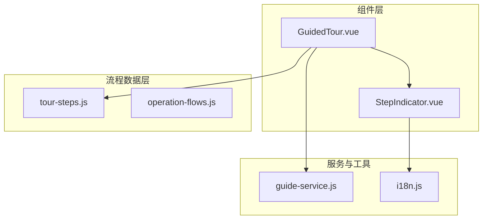
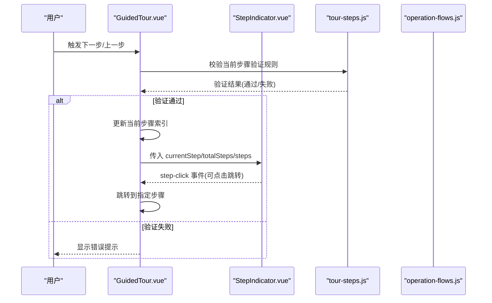
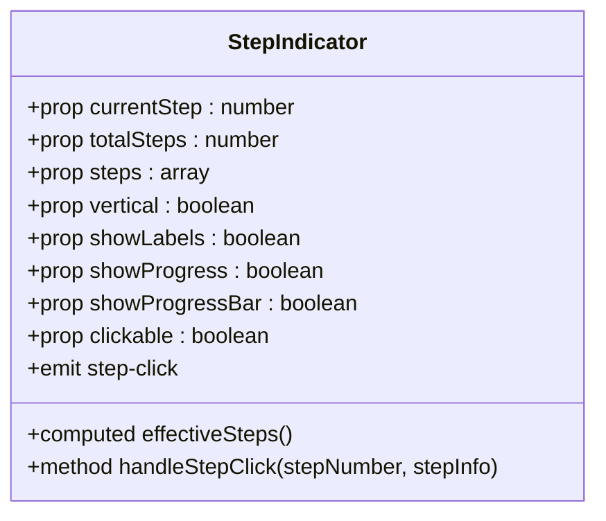
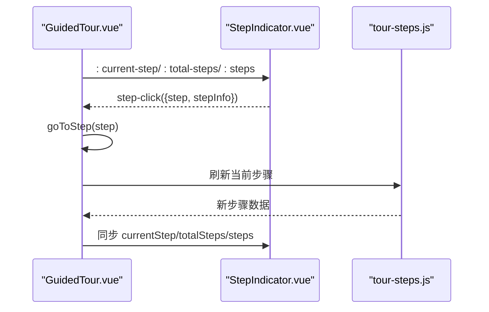
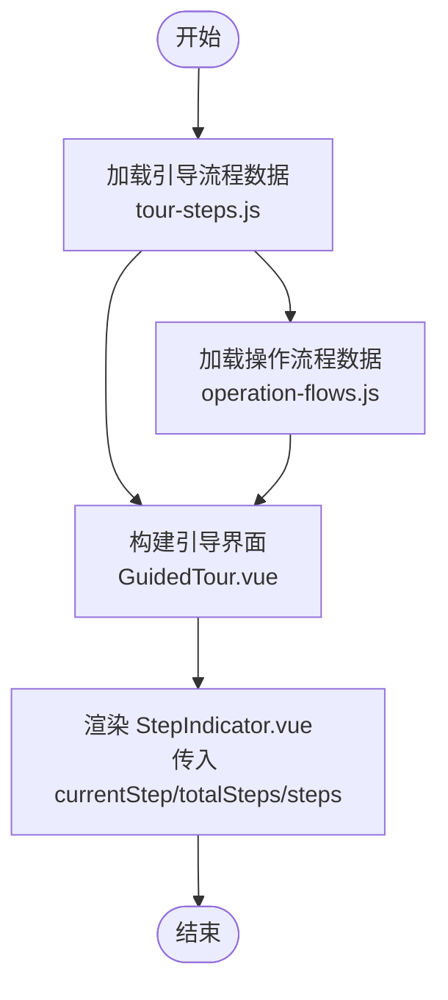
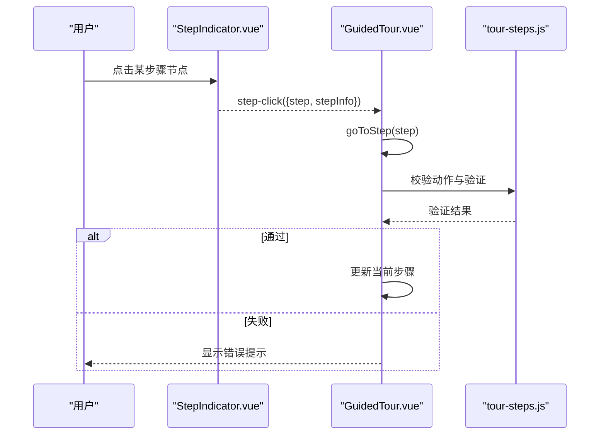
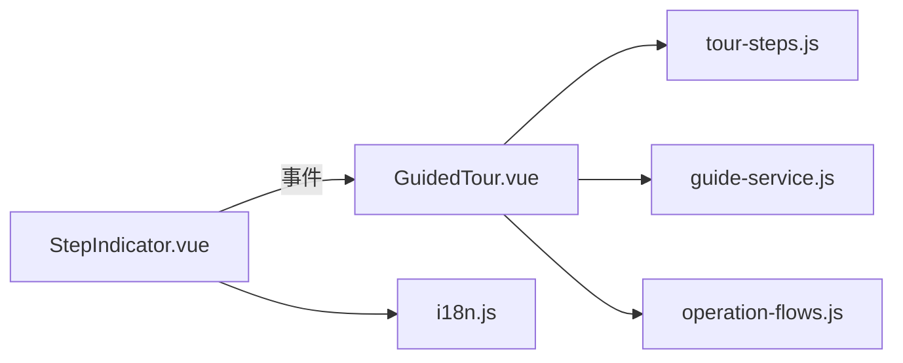

# 步骤指示器组件

<cite>
**本文引用的文件**
- [StepIndicator.vue](file://07-frontend/src/components/guide/StepIndicator.vue)
- [GuidedTour.vue](file://07-frontend/src/components/guide/GuidedTour.vue)
- [tour-steps.js](file://07-frontend/src/utils/guide/tour-steps.js)
- [operation-flows.js](file://07-frontend/src/utils/guide/operation-flows.js)
- [guide-service.js](file://07-frontend/src/services/guide-service.js)
- [i18n.js](file://07-frontend/src/utils/i18n.js)
</cite>

## 目录
1. [简介](#简介)
2. [项目结构](#项目结构)
3. [核心组件](#核心组件)
4. [架构总览](#架构总览)
5. [详细组件分析](#详细组件分析)
6. [依赖关系分析](#依赖关系分析)
7. [性能考量](#性能考量)
8. [故障排查指南](#故障排查指南)
9. [结论](#结论)
10. [附录](#附录)

## 简介
StepIndicator 是一个用于引导式操作流程的可视化步骤指示器组件，能够直观地展示多步骤任务的当前进度，例如项目创建、工艺设定、系统初始化等。它支持水平/垂直布局、可点击跳转、进度信息与进度条显示，并内置无障碍访问支持。在实际应用中，StepIndicator 通常与引导流程（GuidedTour）配合使用，通过事件驱动实现步骤切换与条件校验。

## 项目结构
StepIndicator 组件位于前端组件目录下，配合引导组件 GuidedTour 使用；同时，系统提供了两类流程数据来源：
- 引导步骤定义：tour-steps.js
- 操作流程定义：operation-flows.js

图示来源
- [StepIndicator.vue](file://07-frontend/src/components/guide/StepIndicator.vue#L1-L171)
- [GuidedTour.vue](file://07-frontend/src/components/guide/GuidedTour.vue#L120-L140)
- [tour-steps.js](file://07-frontend/src/utils/guide/tour-steps.js#L1-L120)
- [operation-flows.js](file://07-frontend/src/utils/guide/operation-flows.js#L1-L120)
- [guide-service.js](file://07-frontend/src/services/guide-service.js#L1-L120)
- [i18n.js](file://07-frontend/src/utils/i18n.js#L1-L120)

章节来源
- [StepIndicator.vue](file://07-frontend/src/components/guide/StepIndicator.vue#L1-L171)
- [GuidedTour.vue](file://07-frontend/src/components/guide/GuidedTour.vue#L120-L140)
- [tour-steps.js](file://07-frontend/src/utils/guide/tour-steps.js#L1-L120)
- [operation-flows.js](file://07-frontend/src/utils/guide/operation-flows.js#L1-L120)
- [guide-service.js](file://07-frontend/src/services/guide-service.js#L1-L120)
- [i18n.js](file://07-frontend/src/utils/i18n.js#L1-L120)

## 核心组件
- StepIndicator：负责渲染步骤节点、连接线、进度信息与进度条，支持点击跳转与只读模式。
- GuidedTour：承载引导流程的遮罩、高亮、提示框与步骤导航，内部集成 StepIndicator 并通过事件与流程数据联动。
- tour-steps.js：定义“引导步骤”流程，包含每步的目标元素、位置、动作与验证规则。
- operation-flows.js：定义“操作流程”，包含每步的组件、动作、验证与错误处理策略。
- guide-service.js：提供传统引导服务（非Vue组件化），用于演示步骤指示器的通用用法与键盘导航。
- i18n.js：提供国际化能力，便于在多语言环境下展示步骤标题与描述。

章节来源
- [StepIndicator.vue](file://07-frontend/src/components/guide/StepIndicator.vue#L1-L171)
- [GuidedTour.vue](file://07-frontend/src/components/guide/GuidedTour.vue#L120-L140)
- [tour-steps.js](file://07-frontend/src/utils/guide/tour-steps.js#L1-L120)
- [operation-flows.js](file://07-frontend/src/utils/guide/operation-flows.js#L1-L120)
- [guide-service.js](file://07-frontend/src/services/guide-service.js#L1-L120)
- [i18n.js](file://07-frontend/src/utils/i18n.js#L1-L120)

## 架构总览
StepIndicator 通过事件与流程数据解耦，既可独立使用，也可与 GuidedTour 协作。流程数据（tour-steps.js 或 operation-flows.js）决定步骤标题、描述与动作，StepIndicator 负责呈现与交互。

图示来源
- [GuidedTour.vue](file://07-frontend/src/components/guide/GuidedTour.vue#L120-L140)
- [StepIndicator.vue](file://07-frontend/src/components/guide/StepIndicator.vue#L133-L171)
- [tour-steps.js](file://07-frontend/src/utils/guide/tour-steps.js#L417-L463)

章节来源
- [GuidedTour.vue](file://07-frontend/src/components/guide/GuidedTour.vue#L120-L140)
- [StepIndicator.vue](file://07-frontend/src/components/guide/StepIndicator.vue#L133-L171)
- [tour-steps.js](file://07-frontend/src/utils/guide/tour-steps.js#L417-L463)

## 详细组件分析

### StepIndicator 组件
- 作用：以可视化方式展示多步骤任务的当前进度，支持点击跳转与只读模式。
- 关键属性
  - currentStep：当前步骤（数值，必填）
  - totalSteps：总步骤数（数值，必填）
  - steps：步骤数组（可选，若为空则自动生成默认步骤）
  - vertical：垂直布局（布尔）
  - showLabels：是否显示标签（标题/描述）
  - showProgress：是否显示进度文本（当前/总数）
  - showProgressBar：是否显示进度条
  - clickable：是否允许点击跳转（布尔）
- 事件
  - step-click：当用户点击某步骤节点时触发，携带 step 与 stepInfo
- 样式与交互
  - 活动步骤、已完成步骤、待完成步骤分别有不同视觉状态
  - 支持 hover 缩放与脉冲动画
  - 垂直布局下连接线与内容间距调整
  - 无障碍支持：聚焦轮廓样式
- 默认步骤生成
  - 若未提供 steps，则根据 totalSteps 自动生成默认步骤（含 id、title、description）

图示来源
- [StepIndicator.vue](file://07-frontend/src/components/guide/StepIndicator.vue#L75-L171)

章节来源
- [StepIndicator.vue](file://07-frontend/src/components/guide/StepIndicator.vue#L75-L171)

### GuidedTour 与 StepIndicator 的协作
- GuidedTour 将当前步骤索引、总步骤数与步骤数组传递给 StepIndicator
- StepIndicator 的 step-click 事件由 GuidedTour 监听，实现点击跳转
- GuidedTour 内部维护遮罩、高亮与提示框，StepIndicator 专注于步骤导航

图示来源
- [GuidedTour.vue](file://07-frontend/src/components/guide/GuidedTour.vue#L120-L140)
- [StepIndicator.vue](file://07-frontend/src/components/guide/StepIndicator.vue#L133-L171)
- [tour-steps.js](file://07-frontend/src/utils/guide/tour-steps.js#L492-L520)

章节来源
- [GuidedTour.vue](file://07-frontend/src/components/guide/GuidedTour.vue#L120-L140)
- [StepIndicator.vue](file://07-frontend/src/components/guide/StepIndicator.vue#L133-L171)
- [tour-steps.js](file://07-frontend/src/utils/guide/tour-steps.js#L492-L520)

### 动态生成步骤导航（基于配置数据）
- tour-steps.js：定义引导流程的步骤数组，包含每步的标题、描述、目标元素、位置与动作。GuidedTour 读取该数据并将其传递给 StepIndicator。
- operation-flows.js：定义“操作流程”的步骤数组，包含每步的组件、动作、验证与错误处理。在需要以步骤指示器展示复杂业务流程时，可将该流程的 steps 与 currentStep/totalSteps 传入 StepIndicator。

图示来源
- [tour-steps.js](file://07-frontend/src/utils/guide/tour-steps.js#L1-L120)
- [operation-flows.js](file://07-frontend/src/utils/guide/operation-flows.js#L1-L120)
- [GuidedTour.vue](file://07-frontend/src/components/guide/GuidedTour.vue#L120-L140)
- [StepIndicator.vue](file://07-frontend/src/components/guide/StepIndicator.vue#L133-L171)

章节来源
- [tour-steps.js](file://07-frontend/src/utils/guide/tour-steps.js#L1-L120)
- [operation-flows.js](file://07-frontend/src/utils/guide/operation-flows.js#L1-L120)
- [GuidedTour.vue](file://07-frontend/src/components/guide/GuidedTour.vue#L120-L140)
- [StepIndicator.vue](file://07-frontend/src/components/guide/StepIndicator.vue#L133-L171)

### 交互行为与事件监听
- 可点击跳转：StepIndicator 在 clickable=true 且非当前步骤时，允许点击跳转；点击事件通过 step-click 传出，GuidedTour 监听并调用 goToStep 实现跳转。
- 只读模式：将 clickable=false 即可禁用点击跳转，仅用于展示进度。
- 条件校验：在引导流程中，nextStep 会根据当前步骤的动作配置进行验证，验证失败时返回错误信息，阻止前进。

图示来源
- [StepIndicator.vue](file://07-frontend/src/components/guide/StepIndicator.vue#L133-L171)
- [GuidedTour.vue](file://07-frontend/src/components/guide/GuidedTour.vue#L120-L140)
- [tour-steps.js](file://07-frontend/src/utils/guide/tour-steps.js#L417-L463)

章节来源
- [StepIndicator.vue](file://07-frontend/src/components/guide/StepIndicator.vue#L133-L171)
- [GuidedTour.vue](file://07-frontend/src/components/guide/GuidedTour.vue#L120-L140)
- [tour-steps.js](file://07-frontend/src/utils/guide/tour-steps.js#L417-L463)

### 样式定制与主题
- 主题色：通过 CSS 变量或覆盖类名的方式，可定制活动/完成/待完成状态的颜色与阴影。
- 图标：支持自定义每个步骤的图标（通过 steps 中的 icon 字段）。
- 方向布局：vertical=true 时采用垂直布局，适用于长流程或移动端场景。
- 进度信息与进度条：可选择显示百分比、当前/总数与渐变进度条。

章节来源
- [StepIndicator.vue](file://07-frontend/src/components/guide/StepIndicator.vue#L173-L445)

### 无障碍访问（a11y）支持
- 焦点管理：为步骤项与图标提供焦点样式，保证键盘可达性。
- 语义化：步骤节点使用语义化的结构，便于屏幕阅读器识别。
- 建议：在具体页面中为步骤标题与描述提供更丰富的 aria-label 与 role，提升可访问性。

章节来源
- [StepIndicator.vue](file://07-frontend/src/components/guide/StepIndicator.vue#L436-L445)

### 国际化适配方案
- 全局国际化：i18n.js 提供语言切换、命名空间与格式化能力。
- 步骤标题与描述：在使用 GuidedTour 时，可将步骤标题与描述通过翻译函数进行国际化处理，再传入 StepIndicator。
- 语言回退：利用 i18n 的回退链，确保在缺失翻译时仍能正常显示。

章节来源
- [i18n.js](file://07-frontend/src/utils/i18n.js#L1-L120)
- [GuidedTour.vue](file://07-frontend/src/components/guide/GuidedTour.vue#L120-L140)

## 依赖关系分析
- StepIndicator 依赖 Vue 的响应式与事件机制，不直接依赖业务流程数据。
- GuidedTour 依赖 tour-steps.js 的步骤数据，并通过事件与 StepIndicator 协作。
- operation-flows.js 与 tour-steps.js 分别服务于“操作流程”和“引导流程”，两者均可作为 StepIndicator 的数据来源。
- guide-service.js 提供传统引导服务，演示了步骤指示器的通用用法与键盘导航。

图示来源
- [StepIndicator.vue](file://07-frontend/src/components/guide/StepIndicator.vue#L133-L171)
- [GuidedTour.vue](file://07-frontend/src/components/guide/GuidedTour.vue#L120-L140)
- [tour-steps.js](file://07-frontend/src/utils/guide/tour-steps.js#L1-L120)
- [operation-flows.js](file://07-frontend/src/utils/guide/operation-flows.js#L1-L120)
- [guide-service.js](file://07-frontend/src/services/guide-service.js#L1-L120)
- [i18n.js](file://07-frontend/src/utils/i18n.js#L1-L120)

章节来源
- [StepIndicator.vue](file://07-frontend/src/components/guide/StepIndicator.vue#L133-L171)
- [GuidedTour.vue](file://07-frontend/src/components/guide/GuidedTour.vue#L120-L140)
- [tour-steps.js](file://07-frontend/src/utils/guide/tour-steps.js#L1-L120)
- [operation-flows.js](file://07-frontend/src/utils/guide/operation-flows.js#L1-L120)
- [guide-service.js](file://07-frontend/src/services/guide-service.js#L1-L120)
- [i18n.js](file://07-frontend/src/utils/i18n.js#L1-L120)

## 性能考量
- 渲染优化：StepIndicator 使用 v-for 渲染步骤节点，建议在 steps 较大时保持 key 的稳定性，避免不必要的重排。
- 事件开销：clickable=true 时，每个步骤节点都会绑定点击事件；在大量步骤场景下，可考虑将 clickable 设为 false 以减少事件监听数量。
- 样式与动画：脉冲动画与进度条过渡在低端设备上可能带来轻微开销，可根据设备性能调整动画时长或禁用。
- 响应式：组件内置响应式样式，建议在移动端测试时关注字体缩放与连接线长度的适配。

## 故障排查指南
- 点击无反应
  - 检查 clickable 是否为 true
  - 确认点击的不是当前步骤（currentStep）
- 步骤标题/描述不显示
  - 检查 showLabels 是否为 true
  - 确认 steps 数组中是否提供 title/description
- 垂直布局错位
  - 检查 vertical 参数与容器高度
  - 确认连接线与内容间距在垂直模式下的样式生效
- 无障碍问题
  - 确保步骤节点具备可聚焦状态
  - 在需要时为步骤标题与描述添加 aria-label

章节来源
- [StepIndicator.vue](file://07-frontend/src/components/guide/StepIndicator.vue#L133-L171)
- [StepIndicator.vue](file://07-frontend/src/components/guide/StepIndicator.vue#L436-L445)

## 结论
StepIndicator 通过简洁的属性与事件接口，实现了对多步骤任务的清晰可视化与交互控制。结合 GuidedTour 与流程数据（tour-steps.js/operation-flows.js），可在向导式表单、系统配置向导等场景中高效落地。通过合理的样式定制、无障碍支持与国际化适配，StepIndicator 能够满足多样化的用户体验需求。

## 附录
- 集成示例路径
  - 在 GuidedTour 中使用 StepIndicator：[GuidedTour.vue](file://07-frontend/src/components/guide/GuidedTour.vue#L120-L140)
  - StepIndicator 事件监听与点击跳转：[StepIndicator.vue](file://07-frontend/src/components/guide/StepIndicator.vue#L133-L171)
  - 引导步骤数据结构：[tour-steps.js](file://07-frontend/src/utils/guide/tour-steps.js#L1-L120)
  - 操作流程数据结构：[operation-flows.js](file://07-frontend/src/utils/guide/operation-flows.js#L1-L120)
  - 传统引导服务（键盘导航与遮罩）：[guide-service.js](file://07-frontend/src/services/guide-service.js#L1-L120)
  - 国际化能力：[i18n.js](file://07-frontend/src/utils/i18n.js#L1-L120)