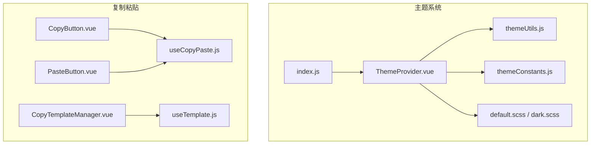
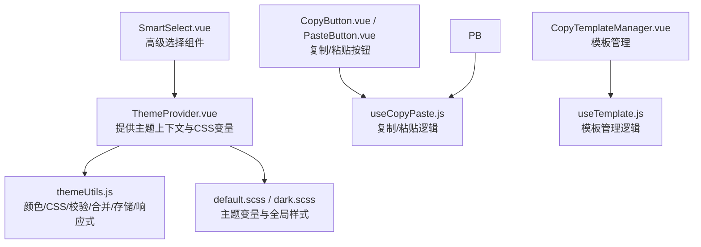
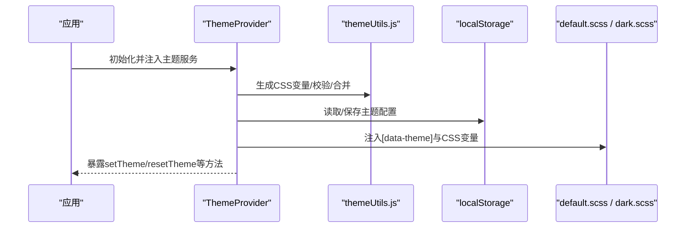
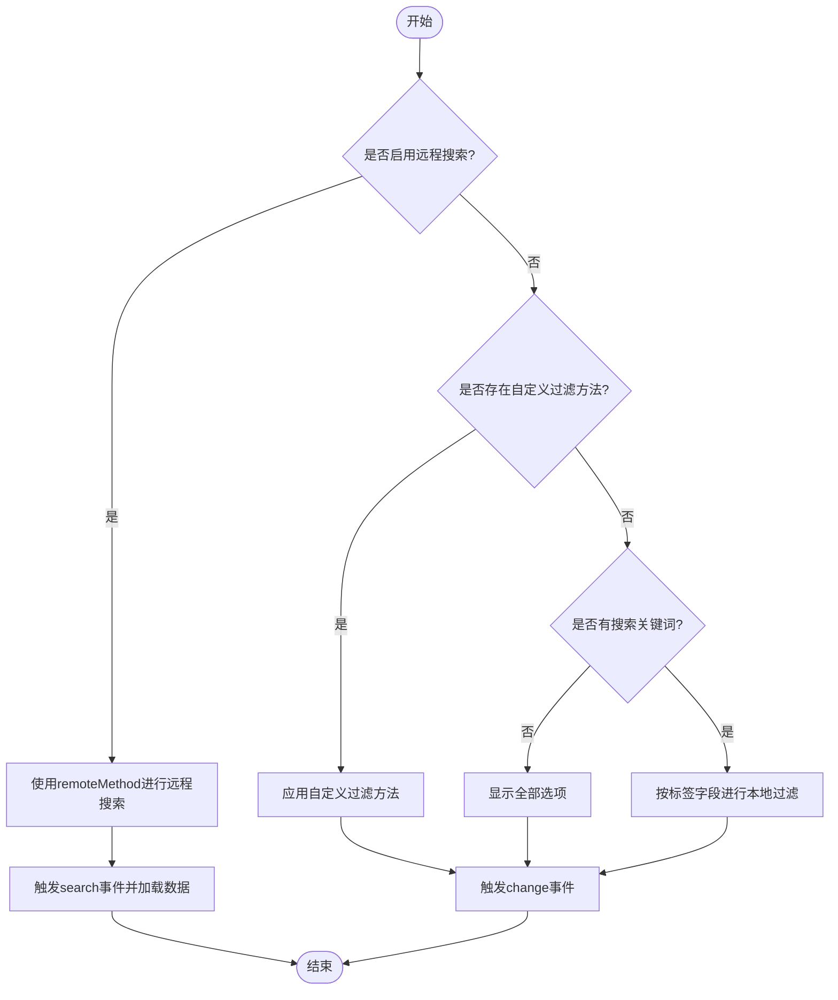
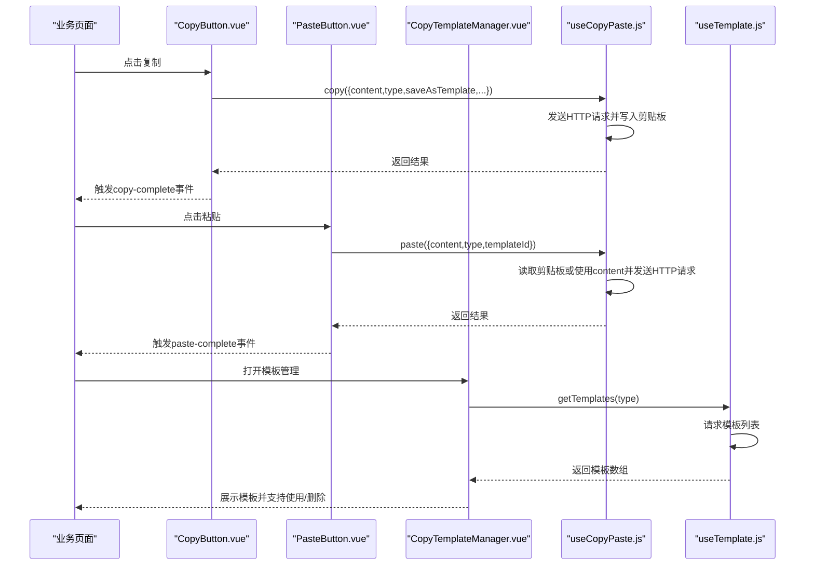
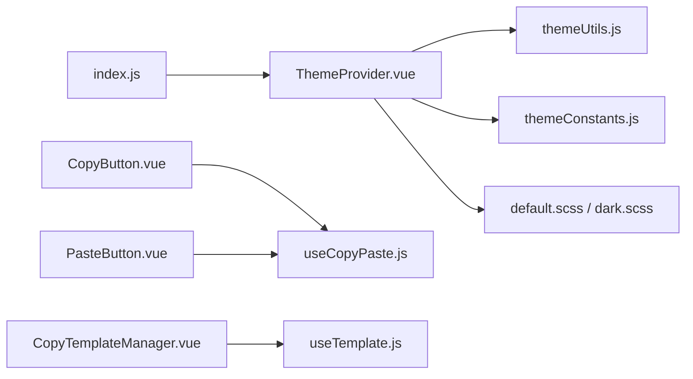

# 主题与高级组件

<cite>
**本文引用的文件**
- [themeConstants.js](file://07-frontend/src/components/theme/constants/themeConstants.js)
- [themeUtils.js](file://07-frontend/src/components/theme/utils/themeUtils.js)
- [ThemeProvider.vue](file://07-frontend/src/components/theme/ThemeProvider.vue)
- [index.js](file://07-frontend/src/components/theme/index.js)
- [default.scss](file://07-frontend/src/assets/styles/themes/default.scss)
- [dark.scss](file://07-frontend/src/assets/styles/themes/dark.scss)
- [SmartSelect.vue](file://07-frontend/src/components/SmartSelect.vue)
- [SmartSelectUsage.md](file://07-frontend/src/docs/SmartSelectUsage.md)
- [CopyButton.vue](file://07-frontend/src/components/common/copy-paste/CopyButton.vue)
- [PasteButton.vue](file://07-frontend/src/components/common/copy-paste/PasteButton.vue)
- [CopyTemplateManager.vue](file://07-frontend/src/components/common/copy-paste/CopyTemplateManager.vue)
- [useCopyPaste.js](file://07-frontend/src/components/common/copy-paste/hooks/useCopyPaste.js)
- [useTemplate.js](file://07-frontend/src/components/common/copy-paste/hooks/useTemplate.js)
</cite>

## 目录
1. [引言](#引言)
2. [项目结构](#项目结构)
3. [核心组件](#核心组件)
4. [架构总览](#架构总览)
5. [详细组件分析](#详细组件分析)
6. [依赖关系分析](#依赖关系分析)
7. [性能考虑](#性能考虑)
8. [故障排查指南](#故障排查指南)
9. [结论](#结论)
10. [附录](#附录)

## 引言
本文件围绕主题管理系统（ThemeProvider）与高级组件（SmartSelect）展开，系统性阐述主题变量定义、主题切换逻辑与全局主题应用；同时深入解析复制粘贴功能组件（CopyButton、PasteButton、CopyTemplateManager）及其组合式API（useCopyPaste、useTemplate）如何实现跨模块数据复用。文档提供主题定制、组件扩展与功能集成的完整指南，帮助开发者在不破坏现有架构的前提下进行二次开发与扩展。

## 项目结构
主题系统与复制粘贴功能均位于前端工程的组件层与样式层，采用“组件 + 工具 + 样式”的分层组织方式：
- 主题系统：组件层提供 ThemeProvider 与配置组件，工具层提供常量与工具函数，样式层提供主题变量与全局样式。
- 复制粘贴：组件层提供按钮与模板管理组件，工具层提供组合式API钩子，通过HTTP接口与后端交互。

图表来源
- [ThemeProvider.vue](file://07-frontend/src/components/theme/ThemeProvider.vue#L1-L326)
- [themeConstants.js](file://07-frontend/src/components/theme/constants/themeConstants.js#L1-L211)
- [themeUtils.js](file://07-frontend/src/components/theme/utils/themeUtils.js#L1-L355)
- [default.scss](file://07-frontend/src/assets/styles/themes/default.scss#L1-L315)
- [dark.scss](file://07-frontend/src/assets/styles/themes/dark.scss#L1-L420)
- [index.js](file://07-frontend/src/components/theme/index.js#L1-L52)
- [CopyButton.vue](file://07-frontend/src/components/common/copy-paste/CopyButton.vue#L1-L78)
- [PasteButton.vue](file://07-frontend/src/components/common/copy-paste/PasteButton.vue#L1-L77)
- [CopyTemplateManager.vue](file://07-frontend/src/components/common/copy-paste/CopyTemplateManager.vue#L1-L143)
- [useCopyPaste.js](file://07-frontend/src/components/common/copy-paste/hooks/useCopyPaste.js#L1-L89)
- [useTemplate.js](file://07-frontend/src/components/common/copy-paste/hooks/useTemplate.js#L1-L62)

章节来源
- [ThemeProvider.vue](file://07-frontend/src/components/theme/ThemeProvider.vue#L1-L326)
- [index.js](file://07-frontend/src/components/theme/index.js#L1-L52)

## 核心组件
- 主题系统
  - ThemeProvider：提供主题上下文、CSS变量注入、主题切换与持久化、系统主题监听与导出导入能力。
  - 主题常量与工具：集中定义主题预设、布局与组件尺寸、动画与字体、阴影与边框、断点与Z-index等，并提供颜色、CSS变量、校验、合并、存储、响应式与动画工具。
  - 主题样式：通过[data-theme]选择器与CSS变量驱动全局UI风格。
- 高级选择组件
  - SmartSelect：基于 Element Plus 的下拉组件封装，支持本地/远程过滤、多字段显示、折叠标签、描述信息展示、事件透传与可扩展配置。
- 复制粘贴功能
  - CopyButton/PasteButton：封装复制/粘贴流程，统一事件与状态管理。
  - CopyTemplateManager：模板列表展示、使用与删除。
  - useCopyPaste/useTemplate：封装HTTP请求、消息提示、剪贴板读写与模板管理逻辑。

章节来源
- [themeConstants.js](file://07-frontend/src/components/theme/constants/themeConstants.js#L1-L211)
- [themeUtils.js](file://07-frontend/src/components/theme/utils/themeUtils.js#L1-L355)
- [ThemeProvider.vue](file://07-frontend/src/components/theme/ThemeProvider.vue#L1-L326)
- [SmartSelect.vue](file://07-frontend/src/components/SmartSelect.vue#L1-L268)
- [CopyButton.vue](file://07-frontend/src/components/common/copy-paste/CopyButton.vue#L1-L78)
- [PasteButton.vue](file://07-frontend/src/components/common/copy-paste/PasteButton.vue#L1-L77)
- [CopyTemplateManager.vue](file://07-frontend/src/components/common/copy-paste/CopyTemplateManager.vue#L1-L143)
- [useCopyPaste.js](file://07-frontend/src/components/common/copy-paste/hooks/useCopyPaste.js#L1-L89)
- [useTemplate.js](file://07-frontend/src/components/common/copy-paste/hooks/useTemplate.js#L1-L62)

## 架构总览
主题系统采用“组件提供者 + 工具函数 + 样式变量”的三层架构：
- 组件提供者：ThemeProvider 通过 provide/inject 向子树暴露主题服务，自动注入 CSS 变量，监听系统主题并支持导出/导入。
- 工具函数：themeUtils 提供颜色计算、CSS变量生成、主题合并、本地存储与响应式能力，支撑主题切换与定制。
- 样式变量：default.scss/dark.scss 以[data-theme]为根，将CSS变量映射到具体UI组件，实现全局风格切换。

复制粘贴功能采用“组件 + 组合式API”的解耦模式：
- 组件负责UI与交互，组合式API负责业务逻辑与网络请求，二者通过事件与状态解耦，便于跨模块复用。

图表来源
- [ThemeProvider.vue](file://07-frontend/src/components/theme/ThemeProvider.vue#L1-L326)
- [themeUtils.js](file://07-frontend/src/components/theme/utils/themeUtils.js#L1-L355)
- [default.scss](file://07-frontend/src/assets/styles/themes/default.scss#L1-L315)
- [dark.scss](file://07-frontend/src/assets/styles/themes/dark.scss#L1-L420)
- [SmartSelect.vue](file://07-frontend/src/components/SmartSelect.vue#L1-L268)
- [CopyButton.vue](file://07-frontend/src/components/common/copy-paste/CopyButton.vue#L1-L78)
- [PasteButton.vue](file://07-frontend/src/components/common/copy-paste/PasteButton.vue#L1-L77)
- [CopyTemplateManager.vue](file://07-frontend/src/components/common/copy-paste/CopyTemplateManager.vue#L1-L143)
- [useCopyPaste.js](file://07-frontend/src/components/common/copy-paste/hooks/useCopyPaste.js#L1-L89)
- [useTemplate.js](file://07-frontend/src/components/common/copy-paste/hooks/useTemplate.js#L1-L62)

## 详细组件分析

### 主题系统（ThemeProvider）实现机制
- 主题变量定义
  - 常量层：预设主题、布局选项、组件尺寸、动画与字体、阴影与边框、间距、断点与Z-index、默认主题配置与存储键名。
  - 工具层：颜色工具（十六进制/RGB互转、亮度判断、变体生成、渐变生成）、CSS变量工具（设置/获取/批量设置、生成主题变量）、校验工具（颜色与配置校验）、主题转换（配置与CSS变量互转、合并）、存储工具（本地存储）、响应式工具（断点与设备检测）、动画工具（过渡与关键帧）。
- 主题切换逻辑
  - 通过 provide/inject 暴露 setTheme、updateThemeProperty、resetTheme、exportTheme、importTheme 等方法，子组件可直接消费主题服务。
  - 支持系统主题监听（根据 prefers-color-scheme 自动切换），并持久化到本地存储。
  - 通过 computed 将主题映射为 CSS 变量，注入到根元素，样式层以[data-theme]与CSS变量驱动UI。
- 全局主题应用
  - 样式层以[data-theme]为根，将CSS变量映射到Element Plus与自定义组件，实现全局风格切换。
  - 提供 ThemePlugin 安装器，注册全局组件与混入，便于在应用层面快速接入主题系统。

图表来源
- [ThemeProvider.vue](file://07-frontend/src/components/theme/ThemeProvider.vue#L1-L326)
- [themeUtils.js](file://07-frontend/src/components/theme/utils/themeUtils.js#L1-L355)
- [default.scss](file://07-frontend/src/assets/styles/themes/default.scss#L1-L315)
- [dark.scss](file://07-frontend/src/assets/styles/themes/dark.scss#L1-L420)

章节来源
- [themeConstants.js](file://07-frontend/src/components/theme/constants/themeConstants.js#L1-L211)
- [themeUtils.js](file://07-frontend/src/components/theme/utils/themeUtils.js#L1-L355)
- [ThemeProvider.vue](file://07-frontend/src/components/theme/ThemeProvider.vue#L1-L326)
- [index.js](file://07-frontend/src/components/theme/index.js#L1-L52)
- [default.scss](file://07-frontend/src/assets/styles/themes/default.scss#L1-L315)
- [dark.scss](file://07-frontend/src/assets/styles/themes/dark.scss#L1-L420)

### SmartSelect 组件的高级选择功能与可扩展性设计
- 高级选择能力
  - 本地/远程过滤：支持本地关键词过滤与远程搜索回调；自定义过滤方法优先级最高。
  - 多字段显示：labelField/valueField/descriptionField 支持标签、值与描述信息组合展示。
  - 多选与折叠标签：支持多选、折叠标签数量与Tooltip控制。
  - 事件透传：完整透传 Element Plus 的 focus/blur/change/clear 等事件，便于上层处理。
- 可扩展性设计
  - 插槽扩展：提供 option 插槽，允许自定义渲染项内容。
  - 属性解耦：通过 props 映射与默认值，降低使用成本；remoteMethod 与 customFilter 为复杂场景留白。
  - 性能优化：大列表建议结合远程搜索与虚拟滚动策略（文档建议）。

图表来源
- [SmartSelect.vue](file://07-frontend/src/components/SmartSelect.vue#L1-L268)
- [SmartSelectUsage.md](file://07-frontend/src/docs/SmartSelectUsage.md#L1-L307)

章节来源
- [SmartSelect.vue](file://07-frontend/src/components/SmartSelect.vue#L1-L268)
- [SmartSelectUsage.md](file://07-frontend/src/docs/SmartSelectUsage.md#L1-L307)

### 复制粘贴功能组件与组合式API
- 组件职责
  - CopyButton：封装复制流程，支持保存为模板（可选），触发 copy-complete 事件。
  - PasteButton：封装粘贴流程，支持指定模板ID或预设内容，触发 paste-complete 事件。
  - CopyTemplateManager：模板列表展示、使用与删除，格式化类型显示。
- 组合式API
  - useCopyPaste：封装复制/粘贴HTTP请求、剪贴板读写、消息提示与状态管理。
  - useTemplate：封装模板列表获取与删除，支持筛选类型与加载状态。
- 数据流
  - 组件通过 props 接收配置，调用钩子执行业务逻辑，通过事件向父组件回传结果。

图表来源
- [CopyButton.vue](file://07-frontend/src/components/common/copy-paste/CopyButton.vue#L1-L78)
- [PasteButton.vue](file://07-frontend/src/components/common/copy-paste/PasteButton.vue#L1-L77)
- [CopyTemplateManager.vue](file://07-frontend/src/components/common/copy-paste/CopyTemplateManager.vue#L1-L143)
- [useCopyPaste.js](file://07-frontend/src/components/common/copy-paste/hooks/useCopyPaste.js#L1-L89)
- [useTemplate.js](file://07-frontend/src/components/common/copy-paste/hooks/useTemplate.js#L1-L62)

章节来源
- [CopyButton.vue](file://07-frontend/src/components/common/copy-paste/CopyButton.vue#L1-L78)
- [PasteButton.vue](file://07-frontend/src/components/common/copy-paste/PasteButton.vue#L1-L77)
- [CopyTemplateManager.vue](file://07-frontend/src/components/common/copy-paste/CopyTemplateManager.vue#L1-L143)
- [useCopyPaste.js](file://07-frontend/src/components/common/copy-paste/hooks/useCopyPaste.js#L1-L89)
- [useTemplate.js](file://07-frontend/src/components/common/copy-paste/hooks/useTemplate.js#L1-L62)

## 依赖关系分析
- 主题系统内部依赖
  - ThemeProvider 依赖 themeUtils 与 themeConstants，样式层依赖 CSS 变量与[data-theme]。
  - index.js 暴露 ThemeProvider 与工具函数，作为主题系统的入口。
- 复制粘贴功能依赖
  - 组件依赖组合式API，组合式API依赖 HTTP 与剪贴板接口，消息提示依赖 Element Plus。
- 组件间耦合
  - SmartSelect 与 ThemeProvider 解耦，通过 props 与事件与主题系统无关。
  - 复制粘贴组件与主题系统无直接耦合，可通过事件与状态在主题上下文中使用。

图表来源
- [ThemeProvider.vue](file://07-frontend/src/components/theme/ThemeProvider.vue#L1-L326)
- [themeUtils.js](file://07-frontend/src/components/theme/utils/themeUtils.js#L1-L355)
- [themeConstants.js](file://07-frontend/src/components/theme/constants/themeConstants.js#L1-L211)
- [default.scss](file://07-frontend/src/assets/styles/themes/default.scss#L1-L315)
- [dark.scss](file://07-frontend/src/assets/styles/themes/dark.scss#L1-L420)
- [index.js](file://07-frontend/src/components/theme/index.js#L1-L52)
- [CopyButton.vue](file://07-frontend/src/components/common/copy-paste/CopyButton.vue#L1-L78)
- [PasteButton.vue](file://07-frontend/src/components/common/copy-paste/PasteButton.vue#L1-L77)
- [CopyTemplateManager.vue](file://07-frontend/src/components/common/copy-paste/CopyTemplateManager.vue#L1-L143)
- [useCopyPaste.js](file://07-frontend/src/components/common/copy-paste/hooks/useCopyPaste.js#L1-L89)
- [useTemplate.js](file://07-frontend/src/components/common/copy-paste/hooks/useTemplate.js#L1-L62)

章节来源
- [index.js](file://07-frontend/src/components/theme/index.js#L1-L52)

## 性能考虑
- 主题系统
  - CSS变量注入与[data-theme]切换为轻量级DOM操作，避免全量重绘；建议在主题切换时尽量减少不必要的DOM变更。
  - 存储与合并策略：合理使用合并工具函数，避免深层对象频繁重建。
- SmartSelect
  - 大数据量场景建议启用远程搜索与虚拟滚动（文档建议），减少渲染压力。
  - 自定义过滤方法需注意复杂度，避免在高频输入时造成卡顿。
- 复制粘贴
  - 复制/粘贴请求与剪贴板读写为异步操作，注意并发与错误处理，避免阻塞UI线程。

[本节为通用指导，无需特定文件引用]

## 故障排查指南
- 主题切换无效
  - 检查 ThemeProvider 是否正确注入与暴露主题服务；确认[data-theme]与CSS变量是否生效。
  - 校验本地存储键名与主题配置格式，必要时清理缓存后重试。
- 样式未随主题变化
  - 确认样式层以[data-theme]为根，且CSS变量命名与主题常量一致。
  - 检查浏览器是否支持CSS变量与[data-theme]属性。
- SmartSelect 无法过滤
  - 确认 filterable 与 remote 的使用场景；若启用远程搜索，需提供 remoteMethod 并正确处理 loading 状态。
  - 自定义过滤方法需返回数组且不抛错。
- 复制/粘贴失败
  - 检查浏览器剪贴板权限与HTTPS环境；确认HTTP接口可用与返回结构符合预期。
  - 查看消息提示与控制台错误日志，定位请求失败原因。

章节来源
- [ThemeProvider.vue](file://07-frontend/src/components/theme/ThemeProvider.vue#L1-L326)
- [themeUtils.js](file://07-frontend/src/components/theme/utils/themeUtils.js#L1-L355)
- [SmartSelect.vue](file://07-frontend/src/components/SmartSelect.vue#L1-L268)
- [useCopyPaste.js](file://07-frontend/src/components/common/copy-paste/hooks/useCopyPaste.js#L1-L89)

## 结论
该主题系统以组件提供者为核心，结合工具函数与样式变量，实现了灵活、可扩展的主题定制与全局应用；SmartSelect 通过属性解耦与事件透传，提供了强大的可扩展性；复制粘贴功能以组件与组合式API分离的方式，实现了跨模块的数据复用与一致的用户体验。三者共同构成了一套低耦合、高内聚的前端主题与高级组件体系。

[本节为总结性内容，无需特定文件引用]

## 附录
- 主题定制指南
  - 使用 ThemeProvider 暴露的方法 setTheme/updateThemeProperty/resetTheme 导入/编辑/删除自定义主题。
  - 通过 ThemeConfig 组件可视化编辑基础颜色、布局与组件设置，支持导出/导入主题文件。
  - 在样式层以[data-theme]与CSS变量覆盖UI细节，保持一致性。
- 组件扩展指南
  - SmartSelect 可通过插槽与自定义过滤方法扩展展示与行为；如需虚拟滚动，结合大数据场景进行优化。
  - 复制粘贴组件可在业务页面中组合使用，通过事件与状态实现流程编排。
- 功能集成指南
  - 在应用入口引入 ThemePlugin，注册全局组件与混入，快速启用主题系统。
  - 复制粘贴功能通过组合式API在多个模块中复用，统一错误处理与消息提示。

章节来源
- [index.js](file://07-frontend/src/components/theme/index.js#L1-L52)
- [ThemeProvider.vue](file://07-frontend/src/components/theme/ThemeProvider.vue#L1-L326)
- [SmartSelectUsage.md](file://07-frontend/src/docs/SmartSelectUsage.md#L1-L307)