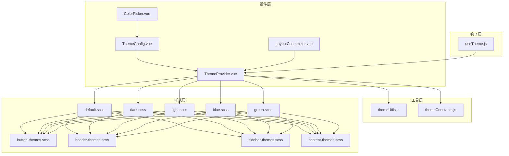
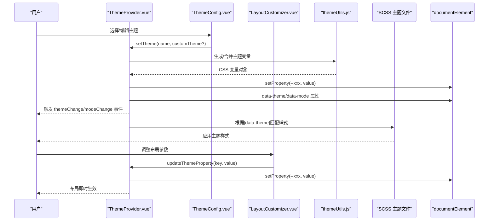
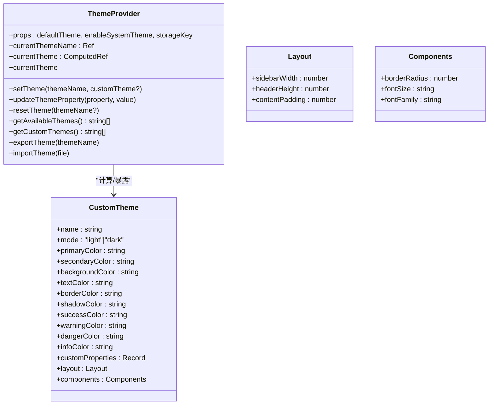
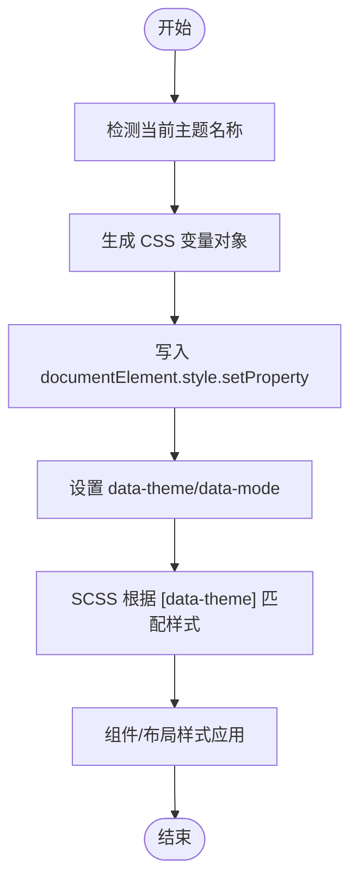
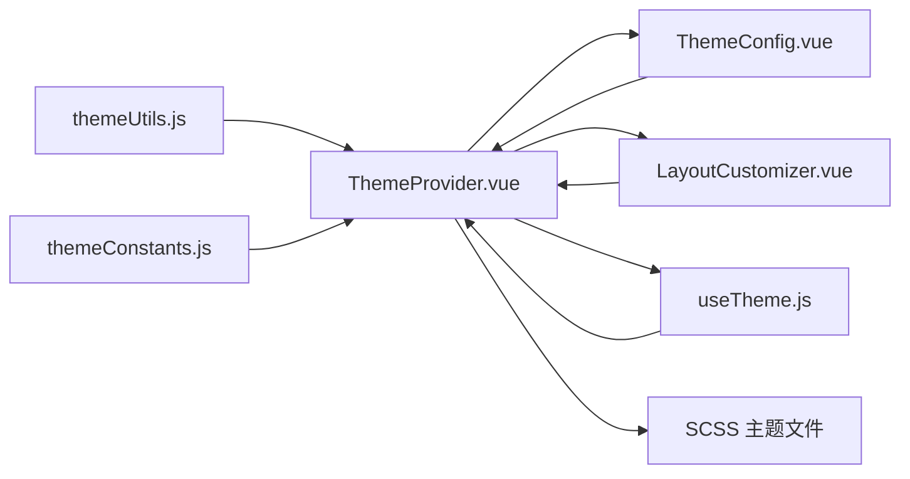

# 主题管理系统

<cite>
**本文引用的文件**
- [ThemeProvider.vue](file://07-frontend/src/components/theme/ThemeProvider.vue)
- [themeConstants.js](file://07-frontend/src/components/theme/constants/themeConstants.js)
- [themeUtils.js](file://07-frontend/src/components/theme/utils/themeUtils.js)
- [index.js](file://07-frontend/src/components/theme/index.js)
- [useTheme.js](file://07-frontend/src/components/theme/hooks/useTheme.js)
- [ColorPicker.vue](file://07-frontend/src/components/theme/ColorPicker.vue)
- [ThemeConfig.vue](file://07-frontend/src/components/theme/ThemeConfig.vue)
- [LayoutCustomizer.vue](file://07-frontend/src/components/theme/LayoutCustomizer.vue)
- [default.scss](file://07-frontend/src/assets/styles/themes/default.scss)
- [dark.scss](file://07-frontend/src/assets/styles/themes/dark.scss)
- [light.scss](file://07-frontend/src/assets/styles/themes/light.scss)
- [blue.scss](file://07-frontend/src/assets/styles/themes/blue.scss)
- [green.scss](file://07-frontend/src/assets/styles/themes/green.scss)
- [button-themes.scss](file://07-frontend/src/assets/styles/components/button-themes.scss)
- [content-themes.scss](file://07-frontend/src/assets/styles/layout/content-themes.scss)
- [header-themes.scss](file://07-frontend/src/assets/styles/layout/header-themes.scss)
- [sidebar-themes.scss](file://07-frontend/src/assets/styles/layout/sidebar-themes.scss)
</cite>

## 目录
1. [引言](#引言)
2. [项目结构](#项目结构)
3. [核心组件](#核心组件)
4. [架构总览](#架构总览)
5. [详细组件分析](#详细组件分析)
6. [依赖关系分析](#依赖关系分析)
7. [性能考虑](#性能考虑)
8. [故障排查指南](#故障排查指南)
9. [结论](#结论)
10. [附录](#附录)

## 引言
本文件系统性阐述主题管理系统（ThemeProvider）的实现机制，覆盖主题变量定义、主题切换逻辑、全局主题应用与运行时切换流程；解析 SCSS 主题文件的结构设计与 CSS 变量注入机制；提供主题扩展、自定义主题开发、运行时主题切换与业务组件集成的完整指南，并给出性能优化建议与常见问题排查方法。

## 项目结构
主题系统由 Vue 组件、工具函数、常量定义与 SCSS 主题样式共同构成：
- 组件层：ThemeProvider、ThemeConfig、LayoutCustomizer、ColorPicker
- 工具层：themeUtils（颜色、CSS 变量、校验、存储、响应式、动画）
- 常量层：themeConstants（预设主题、布局、尺寸、动画、字体、阴影、边框、间距、断点、z-index、默认配置、版本与存储键）
- 钩子层：useTheme（主题切换、自定义主题、导入导出、系统主题跟随）
- 样式层：各主题 SCSS 文件与通用组件/布局样式

图表来源
- [ThemeProvider.vue](file://07-frontend/src/components/theme/ThemeProvider.vue#L1-L326)
- [ThemeConfig.vue](file://07-frontend/src/components/theme/ThemeConfig.vue#L1-L836)
- [LayoutCustomizer.vue](file://07-frontend/src/components/theme/LayoutCustomizer.vue#L1-L672)
- [ColorPicker.vue](file://07-frontend/src/components/theme/ColorPicker.vue#L1-L882)
- [themeUtils.js](file://07-frontend/src/components/theme/utils/themeUtils.js#L1-L355)
- [themeConstants.js](file://07-frontend/src/components/theme/constants/themeConstants.js#L1-L211)
- [useTheme.js](file://07-frontend/src/components/theme/hooks/useTheme.js#L1-L610)
- [default.scss](file://07-frontend/src/assets/styles/themes/default.scss#L1-L315)
- [dark.scss](file://07-frontend/src/assets/styles/themes/dark.scss#L1-L420)
- [light.scss](file://07-frontend/src/assets/styles/themes/light.scss#L1-L421)
- [blue.scss](file://07-frontend/src/assets/styles/themes/blue.scss#L1-L501)
- [green.scss](file://07-frontend/src/assets/styles/themes/green.scss#L1-L604)
- [button-themes.scss](file://07-frontend/src/assets/styles/components/button-themes.scss#L1-L478)
- [header-themes.scss](file://07-frontend/src/assets/styles/layout/header-themes.scss#L1-L653)
- [sidebar-themes.scss](file://07-frontend/src/assets/styles/layout/sidebar-themes.scss#L1-L458)
- [content-themes.scss](file://07-frontend/src/assets/styles/layout/content-themes.scss#L1-L481)

章节来源
- [ThemeProvider.vue](file://07-frontend/src/components/theme/ThemeProvider.vue#L1-L326)
- [index.js](file://07-frontend/src/components/theme/index.js#L1-L52)

## 核心组件
- ThemeProvider：提供主题上下文、动态注入 CSS 变量、系统主题监听、主题切换与导出导入能力
- ThemeConfig：主题配置面板，支持预设主题选择、自定义主题编辑、导出/导入、实时预览
- LayoutCustomizer：布局定制面板，支持侧边栏/头部/内容/导航等布局参数调整与预览
- ColorPicker：颜色选择器，支持多种输入格式与透明度
- useTheme：组合式主题钩子，封装主题切换、自定义主题、系统主题跟随、导入导出等

章节来源
- [ThemeProvider.vue](file://07-frontend/src/components/theme/ThemeProvider.vue#L1-L326)
- [ThemeConfig.vue](file://07-frontend/src/components/theme/ThemeConfig.vue#L1-L836)
- [LayoutCustomizer.vue](file://07-frontend/src/components/theme/LayoutCustomizer.vue#L1-L672)
- [ColorPicker.vue](file://07-frontend/src/components/theme/ColorPicker.vue#L1-L882)
- [useTheme.js](file://07-frontend/src/components/theme/hooks/useTheme.js#L1-L610)

## 架构总览
主题系统采用“组件提供者 + 工具函数 + SCSS 变量注入”的分层架构：
- 组件层通过 provide/inject 提供主题服务，子组件可直接使用
- 工具层负责颜色计算、CSS 变量生成与校验、本地存储、响应式与动画
- 样式层以 SCSS 主题文件定义 CSS 变量与组件/布局样式，ThemeProvider 在运行时将主题映射为 CSS 变量并注入根元素

图表来源
- [ThemeProvider.vue](file://07-frontend/src/components/theme/ThemeProvider.vue#L1-L326)
- [ThemeConfig.vue](file://07-frontend/src/components/theme/ThemeConfig.vue#L1-L836)
- [LayoutCustomizer.vue](file://07-frontend/src/components/theme/LayoutCustomizer.vue#L1-L672)
- [themeUtils.js](file://07-frontend/src/components/theme/utils/themeUtils.js#L1-L355)
- [default.scss](file://07-frontend/src/assets/styles/themes/default.scss#L1-L315)

## 详细组件分析

### ThemeProvider 组件
- 提供主题上下文：通过 provide 暴露 setTheme、updateThemeProperty、resetTheme、getAvailableThemes、getCustomThemes、exportTheme、importTheme、currentThemeName 等方法与当前主题引用
- 动态注入 CSS 变量：基于当前主题生成 CSS 变量（颜色、布局、组件、自定义属性），写入 documentElement.style
- 系统主题监听：监听 prefers-color-scheme，按需自动切换至 dark 或 default
- 数据绑定：computed 计算 themeClasses 与 customStyles，用于类名与内联样式
- 事件发射：themeChange 与 modeChange 事件，便于外部订阅

图表来源
- [ThemeProvider.vue](file://07-frontend/src/components/theme/ThemeProvider.vue#L1-L326)

章节来源
- [ThemeProvider.vue](file://07-frontend/src/components/theme/ThemeProvider.vue#L1-L326)

### 主题常量与工具
- 常量定义：THEME_PRESETS、LAYOUT_OPTIONS、COMPONENT_SIZES、ANIMATION_CONFIG、FONT_CONFIG、SHADOW_CONFIG、BORDER_CONFIG、SPACING_CONFIG、BREAKPOINTS、Z_INDEX、DEFAULT_THEME_CONFIG、THEME_VERSION、STORAGE_KEYS
- 工具函数：
  - colorUtils：十六进制/RGB/HSL 转换、亮度判断、变体生成、渐变生成
  - cssUtils：设置/读取 CSS 变量、批量设置、主题变量生成
  - validationUtils：颜色与主题配置校验
  - transformUtils：主题与 CSS 变量互转、主题合并
  - storageUtils：主题配置本地存储读写与清理
  - responsiveUtils：断点检测与窗口监听
  - animationUtils：过渡与关键帧动画

章节来源
- [themeConstants.js](file://07-frontend/src/components/theme/constants/themeConstants.js#L1-L211)
- [themeUtils.js](file://07-frontend/src/components/theme/utils/themeUtils.js#L1-L355)

### useTheme 钩子
- 注入主题服务：优先使用 ThemeProvider 提供的服务，否则回退到本地变量与 CSS 变量更新
- 主题切换：setTheme 支持远程/本地切换，触发监听器
- 自定义主题：create/update/delete，支持校验与默认值推导
- 导入导出：支持单主题与多主题 JSON 文件
- 系统主题跟随：detectSystemTheme 与 enableSystemThemeFollow
- 计算属性：isDarkMode、themeColors、themeConfig

章节来源
- [useTheme.js](file://07-frontend/src/components/theme/hooks/useTheme.js#L1-L610)

### 主题配置与布局定制
- ThemeConfig：预设主题卡片、自定义主题列表、编辑器（颜色、布局、组件、自定义属性）、预览与导入导出
- LayoutCustomizer：侧边栏/头部/内容/导航参数调整，支持预览与一键重置

章节来源
- [ThemeConfig.vue](file://07-frontend/src/components/theme/ThemeConfig.vue#L1-L836)
- [LayoutCustomizer.vue](file://07-frontend/src/components/theme/LayoutCustomizer.vue#L1-L672)

### SCSS 主题文件与 CSS 变量注入机制
- 主题文件：default.scss、dark.scss、light.scss、blue.scss、green.scss，分别定义 [data-theme="..."] 下的 CSS 变量与组件/布局样式
- 注入机制：ThemeProvider 在 mounted 时根据当前主题生成 CSS 变量并写入 documentElement；同时设置 data-theme 与 data-mode 属性，供 SCSS 条件选择
- 通用样式：button-themes.scss、header-themes.scss、sidebar-themes.scss、content-themes.scss 使用 CSS 变量驱动颜色与布局，确保主题切换即时生效

图表来源
- [ThemeProvider.vue](file://07-frontend/src/components/theme/ThemeProvider.vue#L1-L326)
- [default.scss](file://07-frontend/src/assets/styles/themes/default.scss#L1-L315)
- [dark.scss](file://07-frontend/src/assets/styles/themes/dark.scss#L1-L420)
- [light.scss](file://07-frontend/src/assets/styles/themes/light.scss#L1-L421)
- [blue.scss](file://07-frontend/src/assets/styles/themes/blue.scss#L1-L501)
- [green.scss](file://07-frontend/src/assets/styles/themes/green.scss#L1-L604)

章节来源
- [default.scss](file://07-frontend/src/assets/styles/themes/default.scss#L1-L315)
- [dark.scss](file://07-frontend/src/assets/styles/themes/dark.scss#L1-L420)
- [light.scss](file://07-frontend/src/assets/styles/themes/light.scss#L1-L421)
- [blue.scss](file://07-frontend/src/assets/styles/themes/blue.scss#L1-L501)
- [green.scss](file://07-frontend/src/assets/styles/themes/green.scss#L1-L604)
- [button-themes.scss](file://07-frontend/src/assets/styles/components/button-themes.scss#L1-L478)
- [header-themes.scss](file://07-frontend/src/assets/styles/layout/header-themes.scss#L1-L653)
- [sidebar-themes.scss](file://07-frontend/src/assets/styles/layout/sidebar-themes.scss#L1-L458)
- [content-themes.scss](file://07-frontend/src/assets/styles/layout/content-themes.scss#L1-L481)

## 依赖关系分析
- ThemeProvider 依赖 themeUtils 与 themeConstants，向子组件提供主题服务
- ThemeConfig 依赖 ThemeProvider 的主题服务进行主题切换与预览
- LayoutCustomizer 依赖 ThemeProvider 的 updateThemeProperty 实时更新布局变量
- useTheme 可独立工作，也可与 ThemeProvider 协作
- SCSS 主题文件依赖 documentElement 上的 CSS 变量与 data-* 属性

图表来源
- [ThemeProvider.vue](file://07-frontend/src/components/theme/ThemeProvider.vue#L1-L326)
- [ThemeConfig.vue](file://07-frontend/src/components/theme/ThemeConfig.vue#L1-L836)
- [LayoutCustomizer.vue](file://07-frontend/src/components/theme/LayoutCustomizer.vue#L1-L672)
- [useTheme.js](file://07-frontend/src/components/theme/hooks/useTheme.js#L1-L610)
- [themeUtils.js](file://07-frontend/src/components/theme/utils/themeUtils.js#L1-L355)
- [themeConstants.js](file://07-frontend/src/components/theme/constants/themeConstants.js#L1-L211)

章节来源
- [index.js](file://07-frontend/src/components/theme/index.js#L1-L52)

## 性能考虑
- CSS 变量写入：集中于 documentElement，避免逐元素更新，减少重排重绘
- 主题切换：使用 computed 与 watchEffect，仅在变更时更新
- 本地存储：useStorage 与 localStorage，注意异常捕获与体积控制
- 动画与过渡：统一使用 CSS 过渡与 transform，避免复杂 JS 动画
- SCSS 变量：尽量复用变量，减少重复计算与冗余规则
- 响应式断点：responsiveUtils 提供断点检测，避免频繁监听导致性能问题

[本节为通用指导，不直接分析具体文件]

## 故障排查指南
- 主题未生效
  - 检查 documentElement 是否存在 data-theme 与 data-mode 属性
  - 确认 SCSS 主题文件是否正确引入且 [data-theme] 匹配
- 颜色不正确
  - 使用 colorUtils 校验颜色格式，检查 hex/rgb/hsl 转换
  - 确认 customProperties 中的自定义变量命名与 SCSS 变量一致
- 主题切换无反应
  - 检查 ThemeProvider 的 setTheme 是否被调用
  - 若使用 useTheme，请确认是否注入了 themeService
- 导入/导出失败
  - 检查 JSON 结构是否符合预期
  - 确认文件读取与解析错误处理
- 布局参数不生效
  - 确认 updateThemeProperty 写入的 CSS 变量名与 SCSS 使用变量一致
  - 检查 SCSS 中是否使用 var(--xxx) 并正确作用于目标元素

章节来源
- [ThemeProvider.vue](file://07-frontend/src/components/theme/ThemeProvider.vue#L1-L326)
- [ThemeConfig.vue](file://07-frontend/src/components/theme/ThemeConfig.vue#L1-L836)
- [LayoutCustomizer.vue](file://07-frontend/src/components/theme/LayoutCustomizer.vue#L1-L672)
- [themeUtils.js](file://07-frontend/src/components/theme/utils/themeUtils.js#L1-L355)

## 结论
该主题系统通过组件提供者、工具函数与 SCSS 变量的协同，实现了灵活、可扩展、可运行时切换的主题管理。开发者可通过 ThemeProvider 与 useTheme 快速接入，结合 ThemeConfig 与 LayoutCustomizer 完成主题与布局的定制化，最终通过 SCSS 主题文件实现全局样式的一致性与可维护性。

[本节为总结性内容，不直接分析具体文件]

## 附录

### 主题扩展与自定义主题开发步骤
- 定义自定义主题：在 ThemeConfig 编辑器中设置颜色、布局与组件参数，或通过 useTheme.createCustomTheme 创建
- 导出自定义主题：使用 exportTheme 导出 JSON，便于团队共享
- 导入自定义主题：通过 ThemeConfig 导入或 useTheme.importTheme 批量导入
- 扩展 SCSS 变量：在对应主题 SCSS 中新增变量并在组件样式中使用
- 运行时切换：通过 ThemeProvider.setTheme 或 useTheme.setTheme 切换主题

章节来源
- [ThemeConfig.vue](file://07-frontend/src/components/theme/ThemeConfig.vue#L1-L836)
- [useTheme.js](file://07-frontend/src/components/theme/hooks/useTheme.js#L1-L610)
- [default.scss](file://07-frontend/src/assets/styles/themes/default.scss#L1-L315)

### 与业务组件集成指南
- 组件样式使用 CSS 变量：如按钮、卡片、表格等组件样式统一使用 var(--primary-color) 等变量
- 布局组件：侧边栏、头部、内容区使用 var(--sidebar-width)、--header-height、--content-padding 等变量
- 主题切换监听：在业务组件中订阅 themeChange/modeChange 事件，必要时执行额外逻辑（如刷新图表主题）

章节来源
- [button-themes.scss](file://07-frontend/src/assets/styles/components/button-themes.scss#L1-L478)
- [header-themes.scss](file://07-frontend/src/assets/styles/layout/header-themes.scss#L1-L653)
- [sidebar-themes.scss](file://07-frontend/src/assets/styles/layout/sidebar-themes.scss#L1-L458)
- [content-themes.scss](file://07-frontend/src/assets/styles/layout/content-themes.scss#L1-L481)
- [ThemeProvider.vue](file://07-frontend/src/components/theme/ThemeProvider.vue#L1-L326)