# 复制粘贴功能体系

<cite>
**本文档引用文件**  
- [CopyButton.vue](file://07-frontend/src/components/common/copy-paste/CopyButton.vue)
- [PasteButton.vue](file://07-frontend/src/components/common/copy-paste/PasteButton.vue)
- [CopyTemplateManager.vue](file://07-frontend/src/components/common/copy-paste/CopyTemplateManager.vue)
- [useCopyPaste.js](file://07-frontend/src/components/common/copy-paste/hooks/useCopyPaste.js)
- [useTemplate.js](file://07-frontend/src/components/common/copy-paste/hooks/useTemplate.js)
- [CopyPasteController.java](file://08-backend/src/main/java/com/enterprise/brain/modules/common/copy/controller/CopyPasteController.java)
- [CopyPasteService.java](file://08-backend/src/main/java/com/enterprise/brain/modules/common/copy/service/CopyPasteService.java)
- [CopyPasteServiceImpl.java](file://08-backend/src/main/java/com/enterprise/brain/modules/common/copy/service/impl/CopyPasteServiceImpl.java)
- [CopyTemplate.java](file://08-backend/src/main/java/com/enterprise/brain/modules/common/copy/entity/CopyTemplate.java)
- [PasteHistory.java](file://08-backend/src/main/java/com/enterprise/brain/modules/common/copy/entity/PasteHistory.java)
- [quotation.ts](file://07-frontend/src/api/quotation.ts)
- [QuotationConvert.vue](file://07-frontend/src/pages/quotation/QuotationConvert.vue)
</cite>

## 目录
1. [简介](#简介)
2. [架构概览](#架构概览)
3. [核心组件分析](#核心组件分析)
4. [组合式API实现](#组合式api实现)
5. [后端服务实现](#后端服务实现)
6. [数据模型设计](#数据模型设计)
7. [业务场景集成](#业务场景集成)
8. [错误处理与安全策略](#错误处理与安全策略)
9. [使用流程](#使用流程)
10. [总结](#总结)

## 简介
复制粘贴功能体系为系统提供了一套完整的数据复用解决方案，支持跨页面、跨模块的数据复制与粘贴操作。该体系不仅实现了基础的复制粘贴功能，还通过模板管理机制支持结构化数据模板的持久化与版本管理。系统采用前后端分离架构，前端通过Vue 3组合式API封装业务逻辑，后端通过Spring Boot提供RESTful API服务，实现了高效、安全的数据交互。

**Section sources**
- [CopyButton.vue](file://07-frontend/src/components/common/copy-paste/CopyButton.vue#L1-L78)
- [PasteButton.vue](file://07-frontend/src/components/common/copy-paste/PasteButton.vue#L1-L77)

## 架构概览
复制粘贴功能体系采用分层架构设计，分为前端组件层、组合式API层、后端服务层和数据存储层。前端组件层提供CopyButton和PasteButton两个可复用的UI组件；组合式API层封装了useCopyPaste和useTemplate两个组合式API，负责处理业务逻辑和API调用；后端服务层通过CopyPasteController提供RESTful API接口，由CopyPasteService实现具体的业务逻辑；数据存储层使用关系型数据库存储复制模板和粘贴历史。

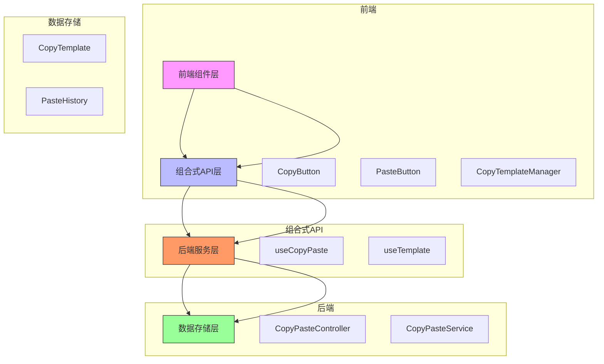

**Diagram sources**
- [CopyButton.vue](file://07-frontend/src/components/common/copy-paste/CopyButton.vue#L1-L78)
- [PasteButton.vue](file://07-frontend/src/components/common/copy-paste/PasteButton.vue#L1-L77)
- [useCopyPaste.js](file://07-frontend/src/components/common/copy-paste/hooks/useCopyPaste.js#L1-L89)
- [CopyPasteController.java](file://08-backend/src/main/java/com/enterprise/brain/modules/common/copy/controller/CopyPasteController.java#L1-L52)

## 核心组件分析

### CopyButton组件
CopyButton组件是复制功能的UI入口，提供了一个可配置的按钮，用户点击后触发复制操作。组件支持多种配置选项，包括复制内容、复制类型、是否保存为模板等。当用户点击复制按钮时，组件会调用useCopyPaste组合式API的copy方法，将指定内容复制到系统剪贴板，并根据配置决定是否将内容保存为模板。

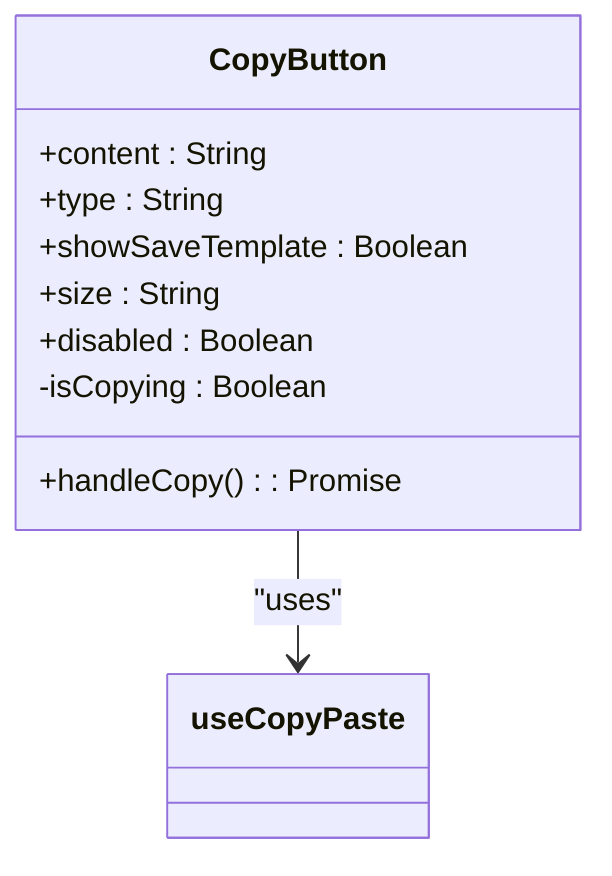

**Diagram sources**
- [CopyButton.vue](file://07-frontend/src/components/common/copy-paste/CopyButton.vue#L1-L78)

**Section sources**
- [CopyButton.vue](file://07-frontend/src/components/common/copy-paste/CopyButton.vue#L1-L78)

### PasteButton组件
PasteButton组件是粘贴功能的UI入口，提供了一个可配置的按钮，用户点击后触发粘贴操作。组件支持多种配置选项，包括粘贴类型、预定义粘贴内容、关联模板ID等。当用户点击粘贴按钮时，组件会调用useCopyPaste组合式API的paste方法，从系统剪贴板或指定模板获取内容，并执行粘贴操作。

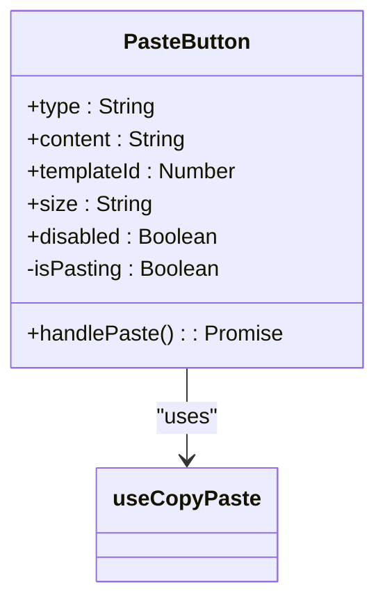

**Diagram sources**
- [PasteButton.vue](file://07-frontend/src/components/common/copy-paste/PasteButton.vue#L1-L77)

**Section sources**
- [PasteButton.vue](file://07-frontend/src/components/common/copy-paste/PasteButton.vue#L1-L77)

### CopyTemplateManager组件
CopyTemplateManager组件是模板管理的UI入口，提供了一个弹窗界面，用于展示、使用和删除复制模板。组件通过useTemplate组合式API获取模板列表，并支持按类型筛选。用户可以在界面中查看模板名称、类型和创建时间，并执行使用或删除操作。

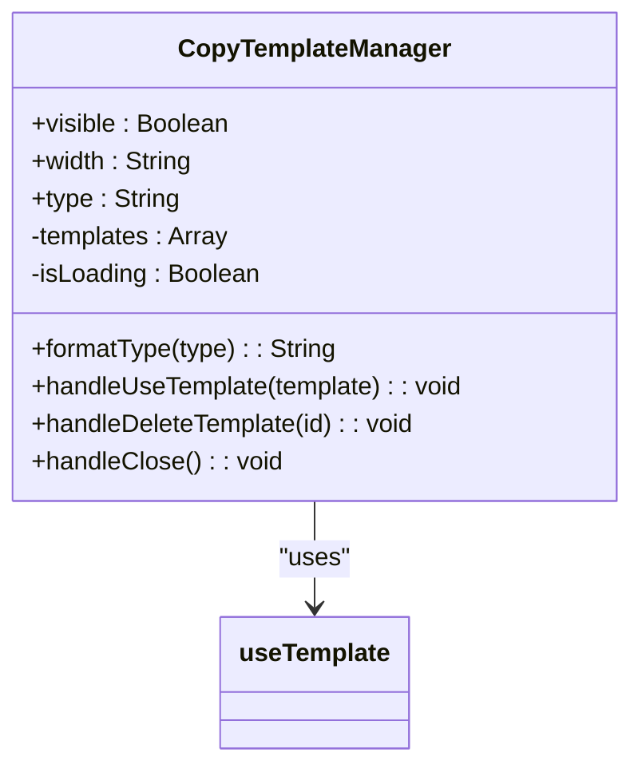

**Diagram sources**
- [CopyTemplateManager.vue](file://07-frontend/src/components/common/copy-paste/CopyTemplateManager.vue#L1-L143)

**Section sources**
- [CopyTemplateManager.vue](file://07-frontend/src/components/common/copy-paste/CopyTemplateManager.vue#L1-L143)

## 组合式API实现

### useCopyPaste组合式API
useCopyPaste是复制粘贴功能的核心组合式API，封装了复制和粘贴操作的业务逻辑。API提供了copy和paste两个主要方法，分别处理复制和粘贴请求。在执行操作时，API会显示加载状态，调用后端API接口，并处理响应结果。成功时显示成功消息，失败时显示错误消息。此外，API还集成了浏览器原生剪贴板API，确保数据能够正确复制到系统剪贴板。

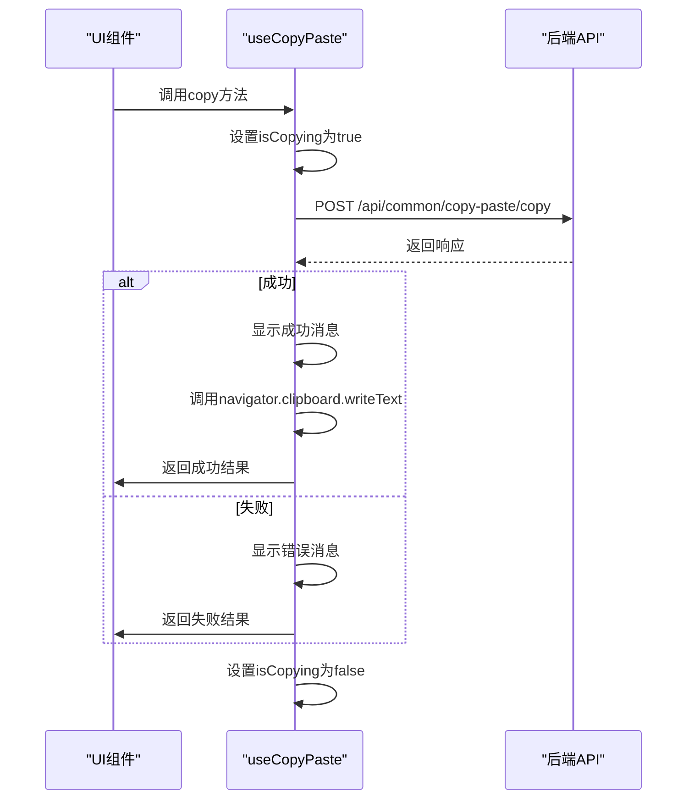

**Diagram sources**
- [useCopyPaste.js](file://07-frontend/src/components/common/copy-paste/hooks/useCopyPaste.js#L1-L89)

**Section sources**
- [useCopyPaste.js](file://07-frontend/src/components/common/copy-paste/hooks/useCopyPaste.js#L1-L89)

### useTemplate组合式API
useTemplate是模板管理的组合式API，封装了模板的增删改查逻辑。API提供了getTemplates和deleteTemplate两个主要方法，分别用于获取模板列表和删除模板。组件挂载时会自动调用getTemplates方法获取模板列表。当用户删除模板时，API会调用后端删除接口，并在成功后重新获取模板列表以更新界面。

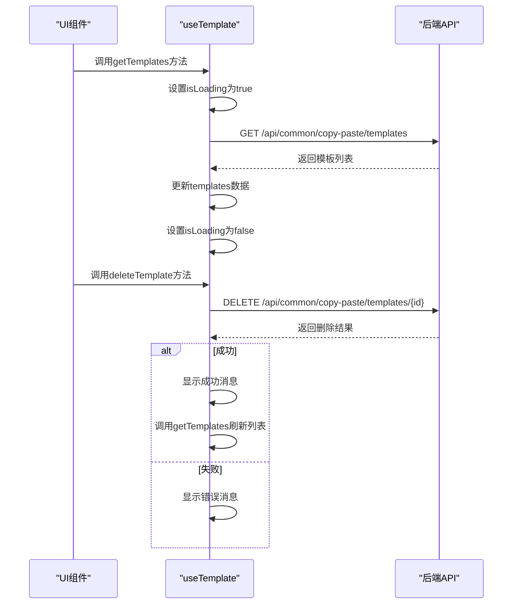

**Diagram sources**
- [useTemplate.js](file://07-frontend/src/components/common/copy-paste/hooks/useTemplate.js#L1-L62)

**Section sources**
- [useTemplate.js](file://07-frontend/src/components/common/copy-paste/hooks/useTemplate.js#L1-L62)

## 后端服务实现
后端服务层由CopyPasteController和CopyPasteService组成，提供RESTful API接口和业务逻辑实现。CopyPasteController作为API入口，定义了复制和粘贴两个POST接口，分别映射到handleCopy和handlePaste方法。CopyPasteService作为服务接口，定义了处理复制和粘贴操作的契约。具体的业务逻辑由CopyPasteServiceImpl实现，包括数据验证、模板存储、粘贴历史记录等。

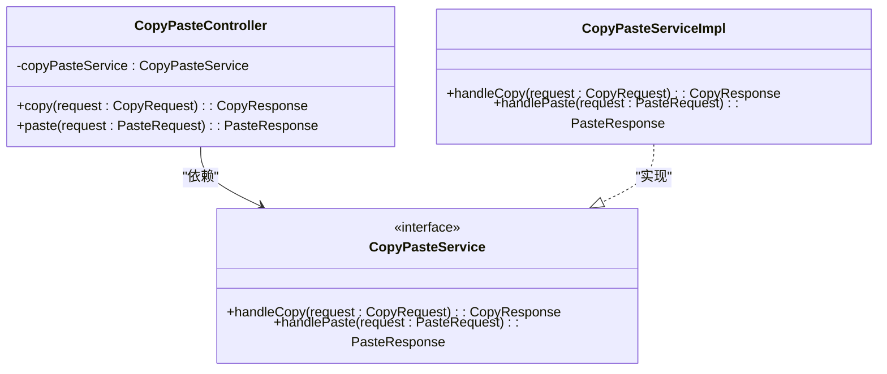

**Diagram sources**
- [CopyPasteController.java](file://08-backend/src/main/java/com/enterprise/brain/modules/common/copy/controller/CopyPasteController.java#L1-L52)
- [CopyPasteService.java](file://08-backend/src/main/java/com/enterprise/brain/modules/common/copy/service/CopyPasteService.java#L1-L29)
- [CopyPasteServiceImpl.java](file://08-backend/src/main/java/com/enterprise/brain/modules/common/copy/service/impl/CopyPasteServiceImpl.java)

**Section sources**
- [CopyPasteController.java](file://08-backend/src/main/java/com/enterprise/brain/modules/common/copy/controller/CopyPasteController.java#L1-L52)
- [CopyPasteService.java](file://08-backend/src/main/java/com/enterprise/brain/modules/common/copy/service/CopyPasteService.java#L1-L29)

## 数据模型设计
系统设计了两个核心数据模型：CopyTemplate和PasteHistory。CopyTemplate用于存储复制模板，包含模板ID、名称、类型、内容、创建人、创建时间等字段。PasteHistory用于记录粘贴操作历史，包含操作ID、模板ID、粘贴内容、粘贴类型、操作人、操作时间、操作结果等字段。这两个模型通过关系型数据库持久化存储，支持模板的长期保存和操作历史的追溯。

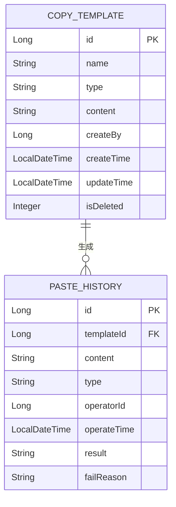

**Diagram sources**
- [CopyTemplate.java](file://08-backend/src/main/java/com/enterprise/brain/modules/common/copy/entity/CopyTemplate.java#L1-L60)
- [PasteHistory.java](file://08-backend/src/main/java/com/enterprise/brain/modules/common/copy/entity/PasteHistory.java#L1-L59)

**Section sources**
- [CopyTemplate.java](file://08-backend/src/main/java/com/enterprise/brain/modules/common/copy/entity/CopyTemplate.java#L1-L60)
- [PasteHistory.java](file://08-backend/src/main/java/com/enterprise/brain/modules/common/copy/entity/PasteHistory.java#L1-L59)

## 业务场景集成
复制粘贴功能体系在多个业务场景中得到应用，其中最具代表性的是报价单复制和工单模板复用场景。在报价单管理页面，用户可以通过CopyButton复制报价单内容，并选择保存为模板。在创建新报价单时，用户可以通过CopyTemplateManager选择已有模板进行复用。在报价转订单场景中，系统支持将报价单内容复制到订单中，提高数据录入效率。

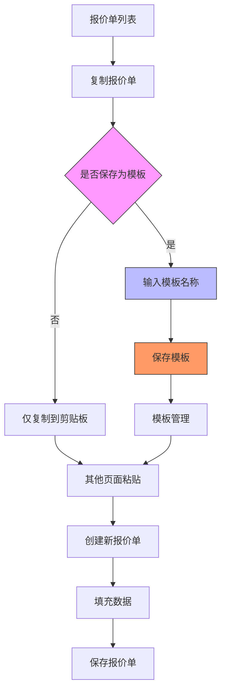

**Diagram sources**
- [quotation.ts](file://07-frontend/src/api/quotation.ts#L73-L331)
- [QuotationConvert.vue](file://07-frontend/src/pages/quotation/QuotationConvert.vue#L1-L332)

**Section sources**
- [quotation.ts](file://07-frontend/src/api/quotation.ts#L73-L331)
- [QuotationConvert.vue](file://07-frontend/src/pages/quotation/QuotationConvert.vue#L1-L332)

## 错误处理与安全策略
系统实现了完善的错误处理和安全策略。在前端，所有API调用都包含try-catch异常处理，确保异常不会导致应用崩溃，并通过ElMessage组件向用户显示友好的错误提示。在后端，通过全局异常处理器捕获和处理业务异常，返回标准化的错误响应。安全方面，系统通过权限验证确保用户只能访问和操作自己有权限的数据，复制模板和粘贴历史都与用户ID关联，防止数据越权访问。

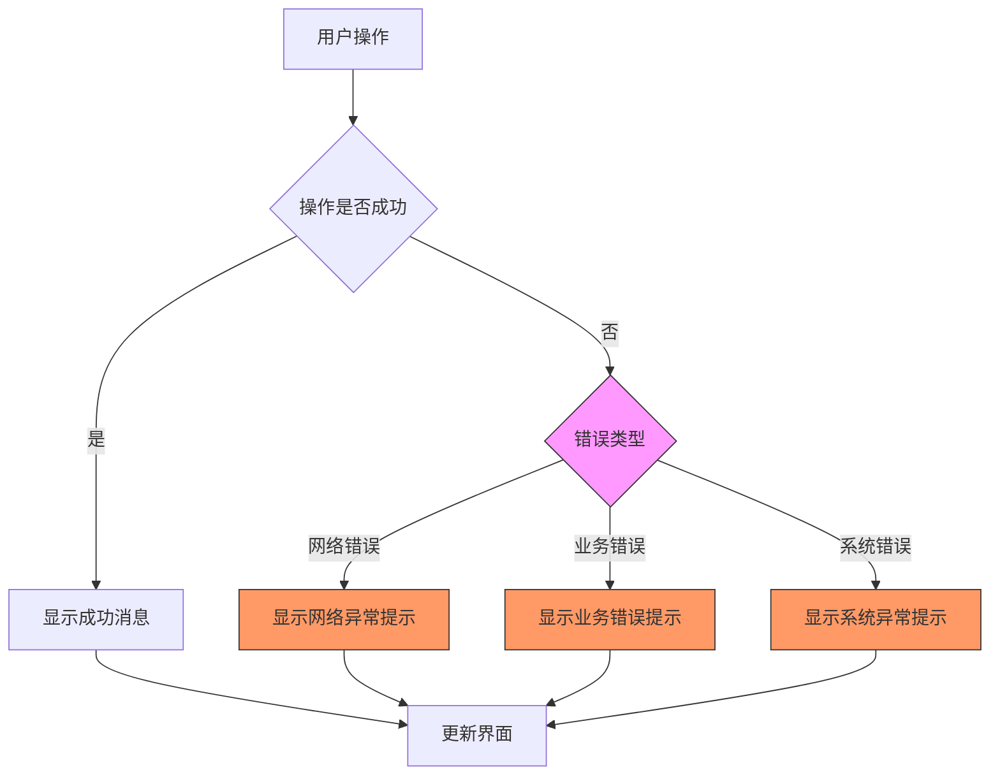

**Diagram sources**
- [useCopyPaste.js](file://07-frontend/src/components/common/copy-paste/hooks/useCopyPaste.js#L1-L89)
- [CopyPasteController.java](file://08-backend/src/main/java/com/enterprise/brain/modules/common/copy/controller/CopyPasteController.java#L1-L52)

**Section sources**
- [useCopyPaste.js](file://07-frontend/src/components/common/copy-paste/hooks/useCopyPaste.js#L1-L89)
- [CopyPasteController.java](file://08-backend/src/main/java/com/enterprise/brain/modules/common/copy/controller/CopyPasteController.java#L1-L52)

## 使用流程
使用复制粘贴功能体系的完整流程如下：首先，在需要复制数据的页面使用CopyButton组件，配置复制内容和类型，可选择是否保存为模板；其次，在需要粘贴数据的页面使用PasteButton组件，配置粘贴类型，可选择从剪贴板粘贴或使用模板粘贴；最后，通过CopyTemplateManager组件管理模板，包括查看、使用和删除模板。整个流程支持跨页面、跨模块的数据复用，提高了工作效率。

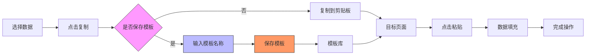

**Diagram sources**
- [CopyButton.vue](file://07-frontend/src/components/common/copy-paste/CopyButton.vue#L1-L78)
- [PasteButton.vue](file://07-frontend/src/components/common/copy-paste/PasteButton.vue#L1-L77)
- [CopyTemplateManager.vue](file://07-frontend/src/components/common/copy-paste/CopyTemplateManager.vue#L1-L143)

**Section sources**
- [CopyButton.vue](file://07-frontend/src/components/common/copy-paste/CopyButton.vue#L1-L78)
- [PasteButton.vue](file://07-frontend/src/components/common/copy-paste/PasteButton.vue#L1-L77)
- [CopyTemplateManager.vue](file://07-frontend/src/components/common/copy-paste/CopyTemplateManager.vue#L1-L143)

## 总结
复制粘贴功能体系通过前后端协同设计，实现了一套完整、高效、安全的数据复用解决方案。前端通过可复用的UI组件和组合式API降低了使用复杂度，后端通过RESTful API和数据模型设计确保了功能的稳定性和可扩展性。系统支持基础复制粘贴到复杂模板复用的完整使用流程，结合错误处理和安全策略，为用户提供了一流的使用体验。在实际业务场景中，该体系显著提高了数据录入效率，减少了重复劳动，是企业级应用中不可或缺的功能模块。