# 智能选择组件

<cite>
**本文引用的文件**
- [SmartSelect.vue](file://07-frontend/src/components/SmartSelect.vue)
- [SmartSelectUsage.md](file://07-frontend/src/docs/SmartSelectUsage.md)
- [SmartSelectDemo.vue](file://07-frontend/src/pages/demo/SmartSelectDemo.vue)
- [ProductSelector.vue](file://07-frontend/src/components/common/business/ProductSelector.vue)
- [sales-api.js](file://07-frontend/src/services/api/sales-api.js)
- [sales.ts](file://07-frontend/src/api/sales.ts)
- [customers.js](file://07-backend/routes/customers.js)
</cite>

## 目录
1. [简介](#简介)
2. [项目结构](#项目结构)
3. [核心组件](#核心组件)
4. [架构总览](#架构总览)
5. [详细组件分析](#详细组件分析)
6. [依赖分析](#依赖分析)
7. [性能考虑](#性能考虑)
8. [故障排查指南](#故障排查指南)
9. [结论](#结论)
10. [附录](#附录)

## 简介
本文件系统性解析 SmartSelect 组件的设计理念与高级能力，覆盖异步数据加载、搜索过滤、标签模式、多选优化与可扩展插槽设计，并结合仓库中的使用示例与业务场景（产品选择、客户选择）给出最佳实践与性能调优策略。文档同时提供详细的 API 说明（props、events、slots），并展示如何通过自定义渲染函数与远程数据源集成实现高度定制化。

## 项目结构
SmartSelect 组件位于前端组件目录，配套使用文档与演示页面，便于快速上手与迁移。业务侧的“产品选择器”组件展示了多选与复杂交互的典型用法；后端路由为“客户管理”模块提供数据接口，可用于远程搜索与数据联动。

**图示来源**
- [SmartSelect.vue](file://07-frontend/src/components/SmartSelect.vue#L1-L41)
- [SmartSelectUsage.md](file://07-frontend/src/docs/SmartSelectUsage.md#L1-L307)
- [SmartSelectDemo.vue](file://07-frontend/src/pages/demo/SmartSelectDemo.vue#L1-L164)
- [ProductSelector.vue](file://07-frontend/src/components/common/business/ProductSelector.vue#L1-L131)
- [sales-api.js](file://07-frontend/src/services/api/sales-api.js#L1-L46)
- [sales.ts](file://07-frontend/src/api/sales.ts#L146-L522)
- [customers.js](file://07-backend/routes/customers.js#L106-L178)

**章节来源**
- [SmartSelect.vue](file://07-frontend/src/components/SmartSelect.vue#L1-L41)
- [SmartSelectUsage.md](file://07-frontend/src/docs/SmartSelectUsage.md#L1-L307)

## 核心组件
SmartSelect 是基于 Element Plus 的 el-select/el-option 封装的通用智能下拉组件，具备以下关键能力：
- 数据源与字段映射：通过 labelField/valueField/descriptionField 映射任意数据结构
- 本地/远程搜索：filterable 与 remote 双通道，remoteMethod 配合 loading 控制
- 自定义过滤：customFilter 支持完全自定义筛选逻辑
- 插槽扩展：默认插槽可自定义选项渲染，支持描述信息展示
- 多选优化：multiple/collapseTags/collapseTagsTooltip/maxCollapseTags 提供标签模式与 Tooltip
- 事件体系：update:modelValue/change/focus/blur/clear/search 全覆盖

**章节来源**
- [SmartSelect.vue](file://07-frontend/src/components/SmartSelect.vue#L43-L159)
- [SmartSelectUsage.md](file://07-frontend/src/docs/SmartSelectUsage.md#L15-L33)

## 架构总览
SmartSelect 的运行时控制流如下：用户输入触发 remoteMethod 或本地过滤，组件内部计算 filteredOptions 并渲染选项；值变化通过双向绑定与事件通知父组件。

**图示来源**
- [SmartSelect.vue](file://07-frontend/src/components/SmartSelect.vue#L211-L249)
- [SmartSelectUsage.md](file://07-frontend/src/docs/SmartSelectUsage.md#L35-L45)

## 详细组件分析

### 设计理念与扩展点
- 字段映射与通用性：通过 labelField/valueField/descriptionField 解耦数据结构，适配不同业务模型（产品、物料、客户等）
- 事件驱动：统一的 change/update:modelValue/focus/blur/clear/search 事件，便于上层业务解耦
- 插槽渲染：默认插槽可自定义渲染，支持描述信息与图标等扩展
- 多选标签模式：collapseTags/collapseTagsTooltip/maxCollapseTags 优化长列表展示体验

**章节来源**
- [SmartSelect.vue](file://07-frontend/src/components/SmartSelect.vue#L1-L41)
- [SmartSelect.vue](file://07-frontend/src/components/SmartSelect.vue#L151-L159)

### 异步数据加载与远程搜索
- 远程开关：remote=true 启用远程搜索
- 方法回调：remoteMethod 接收 query 参数，负责拉取数据并更新 options
- 加载状态：loading 由父组件控制，避免闪烁与并发问题
- 搜索事件：search 事件可用于埋点或日志记录

**图示来源**
- [SmartSelect.vue](file://07-frontend/src/components/SmartSelect.vue#L211-L249)
- [SmartSelectDemo.vue](file://07-frontend/src/pages/demo/SmartSelectDemo.vue#L196-L222)

**章节来源**
- [SmartSelect.vue](file://07-frontend/src/components/SmartSelect.vue#L211-L249)
- [SmartSelectDemo.vue](file://07-frontend/src/pages/demo/SmartSelectDemo.vue#L196-L222)

### 搜索过滤与自定义过滤
- 默认过滤：当未提供 customFilter 时，按 labelField 字段进行大小写不敏感包含匹配
- 自定义过滤：传入 customFilter 可完全接管过滤逻辑，适合复杂条件组合
- 本地/远程分支：remote=true 时跳过本地过滤，直接使用 options

```mermaid
flowchart TD
Enter(["进入 filteredOptions 计算"]) --> IsRemote{"remote 开启？"}
IsRemote --> |是| ReturnOptions["返回原 options"]
IsRemote --> |否| HasCustom{"存在 customFilter？"}
HasCustom --> |是| ApplyCustom["执行 customFilter(options, query)"]
HasCustom --> |否| HasQuery{"是否有查询词？"}
HasQuery --> |否| ReturnAll["返回全部 options"]
HasQuery --> |是| DefaultFilter["按 labelField 包含匹配"]
ApplyCustom --> End(["结束"])
ReturnAll --> End
DefaultFilter --> End
ReturnOptions --> End
```

**图示来源**
- [SmartSelect.vue](file://07-frontend/src/components/SmartSelect.vue#L166-L188)

**章节来源**
- [SmartSelect.vue](file://07-frontend/src/components/SmartSelect.vue#L166-L188)

### 标签模式与多选优化
- 多选开关：multiple=true 开启多选
- 折叠标签：collapseTags=true 时将多余标签折叠为 +N
- Tooltip：collapseTagsTooltip=true 时对折叠标签显示 Tooltip
- 最大折叠数：maxCollapseTags 控制折叠阈值
- 适用场景：产品选择器（多选）、批量选择物料等

**图示来源**
- [SmartSelect.vue](file://07-frontend/src/components/SmartSelect.vue#L94-L113)
- [ProductSelector.vue](file://07-frontend/src/components/common/business/ProductSelector.vue#L1-L131)

**章节来源**
- [SmartSelect.vue](file://07-frontend/src/components/SmartSelect.vue#L94-L113)
- [ProductSelector.vue](file://07-frontend/src/components/common/business/ProductSelector.vue#L1-L131)

### 可扩展插槽设计
- 默认插槽：name="option"，可自定义渲染每个选项，支持描述信息与图标
- 插槽上下文：提供 item，便于在父组件中做二次渲染
- 适用场景：产品卡片、客户头像+名称、物料规格等

**章节来源**
- [SmartSelect.vue](file://07-frontend/src/components/SmartSelect.vue#L23-L40)

### API 说明（props/events/slots）

- props
  - modelValue：绑定值（字符串/数字/布尔/对象/数组）
  - options：选项数组
  - labelField/valueField/descriptionField：字段映射
  - placeholder/filterable/remote/clearable/multiple/disabled/size/popperClass/style：UI 行为与外观
  - showDescription：是否显示描述信息
  - customFilter：自定义过滤函数
  - remoteMethod：远程搜索回调

- events
  - update:modelValue：值变更
  - change：值变更
  - focus：获得焦点
  - blur：失去焦点
  - clear：清空
  - search：搜索触发

- slots
  - option：自定义选项渲染插槽

**章节来源**
- [SmartSelect.vue](file://07-frontend/src/components/SmartSelect.vue#L48-L159)
- [SmartSelectUsage.md](file://07-frontend/src/docs/SmartSelectUsage.md#L15-L45)

### 业务场景应用模式

#### 产品选择（BOM 场景）
- 场景特征：产品编码/名称互填、子件选择排除当前产品、大量数据本地筛选
- 实践要点：
  - 使用 descriptionField 展示规格/名称，提升辨识度
  - filterable 本地筛选，largeOptions 模拟大数据集
  - change 事件联动填充另一字段，提升用户体验

**章节来源**
- [SmartSelectDemo.vue](file://07-frontend/src/pages/demo/SmartSelectDemo.vue#L100-L162)
- [SmartSelectUsage.md](file://07-frontend/src/docs/SmartSelectUsage.md#L169-L293)

#### 客户选择（销售管理）
- 场景特征：远程搜索客户列表、分页与筛选、与订单历史联动
- 实践要点：
  - 远程搜索通过 remoteMethod 拉取客户列表
  - 使用 sales-api.js 中 customer 接口封装，统一请求与响应
  - 与后端 customers.js 路由对接，获取客户详情与统计信息

**章节来源**
- [sales-api.js](file://07-frontend/src/services/api/sales-api.js#L1-L46)
- [sales.ts](file://07-frontend/src/api/sales.ts#L146-L522)
- [customers.js](file://07-backend/routes/customers.js#L106-L178)

### 最佳实践与性能调优
- 性能优化
  - 大数据本地筛选：优先使用 filterable 与默认过滤，避免一次性渲染过多节点
  - 远程搜索：合理设置 loading，避免频繁请求；必要时加入防抖
  - 多选标签：启用 collapseTags 与 maxCollapseTags，减少 DOM 节点数量
- 可靠性
  - 事件链路清晰：change 与 update:modelValue 保持一致语义
  - 插槽自定义：尽量在插槽内做轻量渲染，避免重计算
- 可维护性
  - 字段映射集中配置，避免散落的硬编码
  - remoteMethod 与 loading 状态在父组件统一管理

**章节来源**
- [SmartSelectUsage.md](file://07-frontend/src/docs/SmartSelectUsage.md#L294-L307)
- [SmartSelectDemo.vue](file://07-frontend/src/pages/demo/SmartSelectDemo.vue#L196-L222)

### 自定义渲染与远程数据源集成
- 自定义渲染函数
  - 通过插槽 name="option" 传入 item，实现复杂项渲染（如图标、颜色标签、描述信息）
- 远程数据源集成
  - remoteMethod 接收 query，调用 sales-api.js 中 customer 接口，返回标准化 options
  - 与后端 customers.js 路由协作，支持分页、排序与统计字段

**章节来源**
- [SmartSelect.vue](file://07-frontend/src/components/SmartSelect.vue#L23-L40)
- [sales-api.js](file://07-frontend/src/services/api/sales-api.js#L1-L46)
- [customers.js](file://07-backend/routes/customers.js#L106-L178)

## 依赖分析
- 组件依赖
  - Element Plus：el-select/el-option 提供基础 UI 能力
  - Vue：ref/computed/watch/onMounted 等响应式与生命周期
- 外部接口
  - sales-api.js：封装客户管理 API
  - customers.js：后端路由，提供客户详情与统计

**图示来源**
- [SmartSelect.vue](file://07-frontend/src/components/SmartSelect.vue#L43-L50)
- [SmartSelectDemo.vue](file://07-frontend/src/pages/demo/SmartSelectDemo.vue#L166-L170)
- [ProductSelector.vue](file://07-frontend/src/components/common/business/ProductSelector.vue#L1-L131)
- [sales-api.js](file://07-frontend/src/services/api/sales-api.js#L1-L46)
- [customers.js](file://07-backend/routes/customers.js#L106-L178)

**章节来源**
- [SmartSelect.vue](file://07-frontend/src/components/SmartSelect.vue#L43-L50)
- [sales-api.js](file://07-frontend/src/services/api/sales-api.js#L1-L46)
- [customers.js](file://07-backend/routes/customers.js#L106-L178)

## 性能考虑
- 本地筛选：默认按 labelField 包含匹配，时间复杂度 O(n)，适合中小规模数据
- 远程搜索：通过 remoteMethod 与 loading 控制请求频率，避免频繁网络开销
- 多选标签：collapseTags 与 maxCollapseTags 减少 DOM 节点，提升渲染性能
- 插槽渲染：避免在插槽内做重计算，必要时使用 computed 缓存

[本节为通用指导，无需特定文件引用]

## 故障排查指南
- 无法显示描述信息
  - 检查 showDescription 是否为 true，descriptionField 是否与数据字段一致
- 远程搜索无效
  - 确认 remote=true 且 remoteMethod 已传入，父组件正确设置 loading
- 本地筛选不生效
  - 检查是否传入 customFilter；若未传入，确认 labelField 与数据结构一致
- 多选标签未折叠
  - 确认 multiple=true，collapseTags=true，maxCollapseTags 设置合理

**章节来源**
- [SmartSelect.vue](file://07-frontend/src/components/SmartSelect.vue#L94-L113)
- [SmartSelect.vue](file://07-frontend/src/components/SmartSelect.vue#L166-L188)
- [SmartSelectUsage.md](file://07-frontend/src/docs/SmartSelectUsage.md#L15-L33)

## 结论
SmartSelect 通过字段映射、事件体系、插槽扩展与多选标签模式，实现了跨业务场景的通用智能下拉能力。结合远程搜索与自定义过滤，既能满足产品选择、客户选择等典型业务需求，又能在大数据量与复杂交互场景中保持良好性能与可维护性。建议在实际项目中统一使用该组件，减少重复实现，提升一致性与开发效率。

[本节为总结，无需特定文件引用]

## 附录
- 使用示例参考
  - 基础使用、带描述信息、本地筛选、远程搜索
- 业务迁移参考
  - 生产 BOM 页面替换旧实现，统一字段映射与事件处理

**章节来源**
- [SmartSelectUsage.md](file://07-frontend/src/docs/SmartSelectUsage.md#L46-L307)
- [SmartSelectDemo.vue](file://07-frontend/src/pages/demo/SmartSelectDemo.vue#L1-L164)