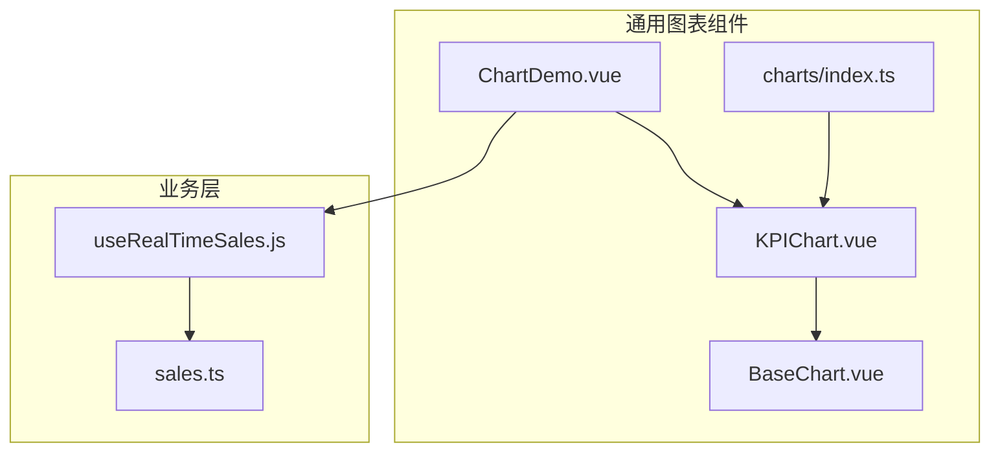
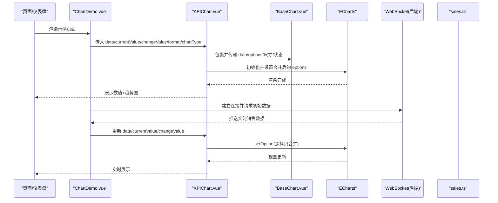
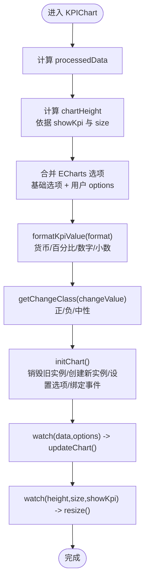
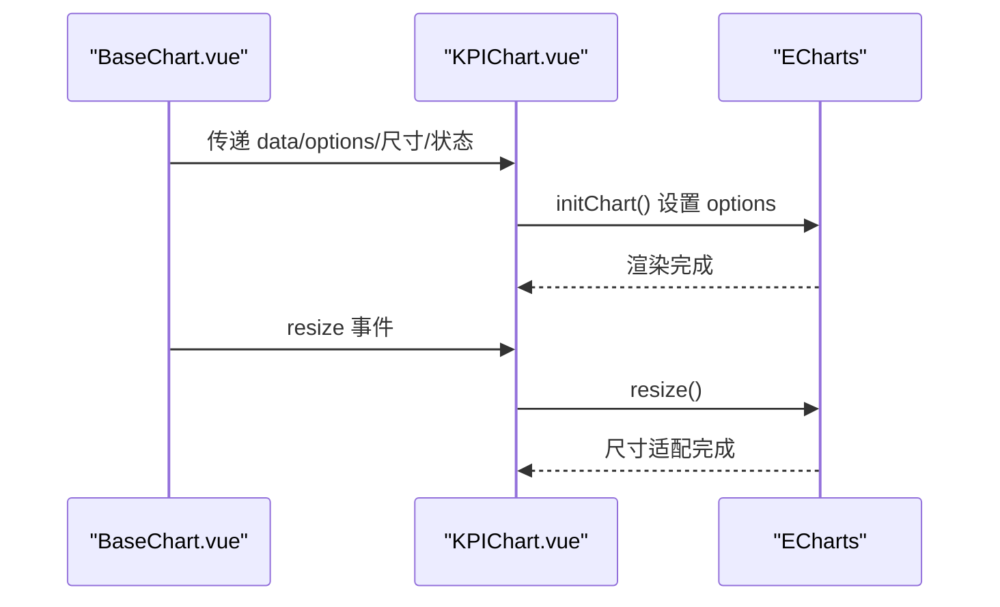
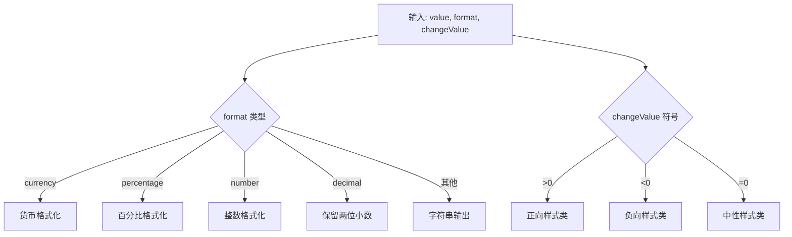
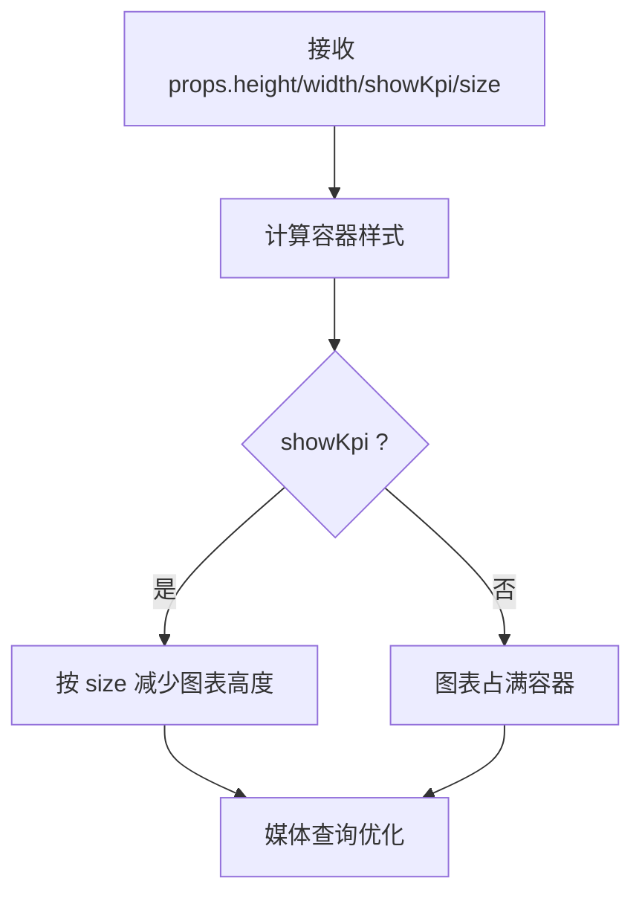
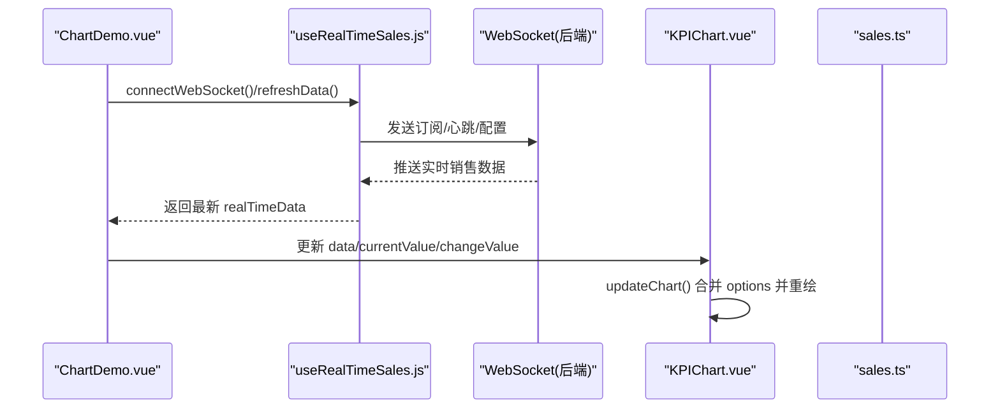
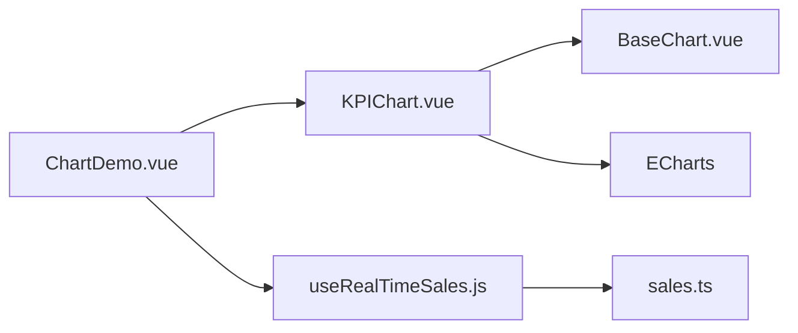

# KPI指标卡组件

<cite>
**本文引用的文件列表**
- [KPIChart.vue](file://07-frontend/src/components/common/charts/KPIChart.vue)
- [BaseChart.vue](file://07-frontend/src/components/common/charts/BaseChart.vue)
- [ChartDemo.vue](file://07-frontend/src/components/common/charts/ChartDemo.vue)
- [index.ts](file://07-frontend/src/components/common/charts/index.ts)
- [useRealTimeSales.js](file://07-frontend/src/composables/useRealTimeSales.js)
- [sales.ts](file://07-frontend/src/api/sales.ts)
</cite>

## 目录
1. [简介](#简介)
2. [项目结构](#项目结构)
3. [核心组件](#核心组件)
4. [架构总览](#架构总览)
5. [详细组件分析](#详细组件分析)
6. [依赖关系分析](#依赖关系分析)
7. [性能考量](#性能考量)
8. [故障排查指南](#故障排查指南)
9. [结论](#结论)
10. [附录](#附录)

## 简介
本文件系统性解析 KPIChart 组件的设计与实现，聚焦于关键绩效指标的可视化展示能力：数值呈现、同比/环比变化、趋势箭头与迷你图表集成。文档同时阐述其与 ECharts 的集成方式、数字格式化策略、状态颜色映射（正向/负向/中性）、条件样式与响应式布局，并给出与后端 API 的实时数据更新集成示例，帮助读者在仪表盘场景中高效落地。

## 项目结构
KPIChart 位于前端通用图表组件目录下，采用“组合式 API + Vue 单文件组件”的现代开发模式；其依赖统一的基础图表容器 BaseChart，负责加载/错误/空状态等通用交互；并通过 ECharts 实现趋势图渲染。

**图表来源**
- [KPIChart.vue](file://07-frontend/src/components/common/charts/KPIChart.vue#L1-L40)
- [BaseChart.vue](file://07-frontend/src/components/common/charts/BaseChart.vue#L1-L40)
- [ChartDemo.vue](file://07-frontend/src/components/common/charts/ChartDemo.vue#L58-L71)
- [index.ts](file://07-frontend/src/components/common/charts/index.ts#L1-L20)
- [useRealTimeSales.js](file://07-frontend/src/composables/useRealTimeSales.js#L1-L40)
- [sales.ts](file://07-frontend/src/api/sales.ts#L470-L522)

**章节来源**
- [KPIChart.vue](file://07-frontend/src/components/common/charts/KPIChart.vue#L1-L40)
- [BaseChart.vue](file://07-frontend/src/components/common/charts/BaseChart.vue#L1-L40)
- [ChartDemo.vue](file://07-frontend/src/components/common/charts/ChartDemo.vue#L58-L71)
- [index.ts](file://07-frontend/src/components/common/charts/index.ts#L1-L20)

## 核心组件
- KPIChart：提供 KPI 数值、标签、变化率与趋势图一体化展示，支持多种格式化、尺寸与图表类型。
- BaseChart：统一的图表容器，封装加载、错误、空状态与响应式尺寸适配。
- ChartDemo：演示 KPIChart 的典型用法与数据刷新流程。
- charts/index.ts：导出图表组件集合，便于按需引入或批量导入。
- useRealTimeSales：提供实时销售数据的 WebSocket 连接、心跳、重连与数据更新逻辑。
- sales.ts：封装销售相关 API，包括实时销售数据与对比分析接口。

**章节来源**
- [KPIChart.vue](file://07-frontend/src/components/common/charts/KPIChart.vue#L46-L143)
- [BaseChart.vue](file://07-frontend/src/components/common/charts/BaseChart.vue#L19-L64)
- [ChartDemo.vue](file://07-frontend/src/components/common/charts/ChartDemo.vue#L58-L71)
- [index.ts](file://07-frontend/src/components/common/charts/index.ts#L1-L20)
- [useRealTimeSales.js](file://07-frontend/src/composables/useRealTimeSales.js#L1-L40)
- [sales.ts](file://07-frontend/src/api/sales.ts#L470-L522)

## 架构总览
KPIChart 通过 ECharts 渲染趋势图，同时在组件顶部展示当前值与变化率；BaseChart 提供统一的加载/错误/空状态与响应式容器；ChartDemo 展示如何将 KPIChart 与业务数据联动；useRealTimeSales 通过 WebSocket 推送实时数据，sales.ts 提供后端接口。

**图表来源**
- [ChartDemo.vue](file://07-frontend/src/components/common/charts/ChartDemo.vue#L58-L71)
- [KPIChart.vue](file://07-frontend/src/components/common/charts/KPIChart.vue#L286-L320)
- [BaseChart.vue](file://07-frontend/src/components/common/charts/BaseChart.vue#L85-L121)
- [useRealTimeSales.js](file://07-frontend/src/composables/useRealTimeSales.js#L31-L81)
- [sales.ts](file://07-frontend/src/api/sales.ts#L470-L522)

## 详细组件分析

### KPIChart 组件设计与实现
- 输入属性（props）
  - 标题与数据：title、data、xField、yField
  - KPI 数值与变化：currentValue、changeValue、compareText、format
  - 图表配置：options、height、width、loading、error、emptyText、responsive、showKpi、size、chartType、chartColor
- 内置计算逻辑
  - 数据预处理：processedData 直接透传 props.data
  - 图表高度：根据是否显示 KPI 与 size 动态计算
  - ECharts 选项合并：基于 chartType、chartColor、面积填充、网格与坐标轴样式生成基础选项，并与用户 options 深合并
  - 数字格式化：format 支持 currency、percentage、number、decimal
  - 状态颜色映射：changeValue 正/负/零分别映射为正向/负向/中性样式类
- 响应式与生命周期
  - 监听 data 与 options 变化，触发 updateChart
  - 监听 height、showKpi、size 变化，触发 resize
  - onMounted 中初始化 ECharts 实例，绑定 click/hover 事件
- 事件与暴露方法
  - 事件：reload、click、hover、dataChange
  - 暴露：init、update、resize、chartInstance

**图表来源**
- [KPIChart.vue](file://07-frontend/src/components/common/charts/KPIChart.vue#L154-L261)
- [KPIChart.vue](file://07-frontend/src/components/common/charts/KPIChart.vue#L263-L356)

**章节来源**
- [KPIChart.vue](file://07-frontend/src/components/common/charts/KPIChart.vue#L46-L143)
- [KPIChart.vue](file://07-frontend/src/components/common/charts/KPIChart.vue#L154-L261)
- [KPIChart.vue](file://07-frontend/src/components/common/charts/KPIChart.vue#L263-L356)

### BaseChart 组件与 KPIChart 的协作
- BaseChart 提供统一容器与状态管理：loading、error、emptyText、responsive
- KPIChart 通过 BaseChart 的 slot 插槽注入 KPI 主要指标与趋势图容器
- BaseChart 在响应式场景下通过 ResizeObserver 触发 resize 事件，KPIChart 再调用 ECharts 实例 resize

**图表来源**
- [BaseChart.vue](file://07-frontend/src/components/common/charts/BaseChart.vue#L19-L64)
- [BaseChart.vue](file://07-frontend/src/components/common/charts/BaseChart.vue#L85-L121)
- [KPIChart.vue](file://07-frontend/src/components/common/charts/KPIChart.vue#L286-L320)

**章节来源**
- [BaseChart.vue](file://07-frontend/src/components/common/charts/BaseChart.vue#L19-L64)
- [BaseChart.vue](file://07-frontend/src/components/common/charts/BaseChart.vue#L85-L121)
- [KPIChart.vue](file://07-frontend/src/components/common/charts/KPIChart.vue#L286-L320)

### 数字格式化与状态颜色映射
- 数字格式化：根据 format 类型对 currentValue 进行货币、百分比、整数或两位小数格式化
- 状态颜色映射：changeValue > 0 使用正向样式，changeValue < 0 使用负向样式，changeValue = 0 使用中性样式
- 条件样式：根据 size 控制主值字体大小；根据 showKpi 控制图表高度

**图表来源**
- [KPIChart.vue](file://07-frontend/src/components/common/charts/KPIChart.vue#L263-L284)

**章节来源**
- [KPIChart.vue](file://07-frontend/src/components/common/charts/KPIChart.vue#L263-L284)

### 响应式布局策略
- 容器尺寸：height/width 支持字符串与数值，computed 计算最终容器样式
- 图表高度：showKpi 为 true 时，根据 size（small/medium/large）动态减少图表高度，保证 KPI 区域与趋势图协调
- 媒体查询：在小屏设备上减小 KPI 字体与趋势图最小高度，提升可读性

**图表来源**
- [KPIChart.vue](file://07-frontend/src/components/common/charts/KPIChart.vue#L158-L172)
- [KPIChart.vue](file://07-frontend/src/components/common/charts/KPIChart.vue#L422-L441)

**章节来源**
- [KPIChart.vue](file://07-frontend/src/components/common/charts/KPIChart.vue#L158-L172)
- [KPIChart.vue](file://07-frontend/src/components/common/charts/KPIChart.vue#L422-L441)

### 与后端 API 的实时集成示例
- WebSocket 实时数据流：useRealTimeSales.js 管理连接、心跳、重连与订阅，按配置推送实时销售数据
- API 接口：sales.ts 提供实时销售数据与对比分析接口，便于前端拉取或订阅
- 示例联动：ChartDemo.vue 展示如何在刷新按钮触发时，更新 KPIChart 的 data/currentValue/changeValue，从而驱动 ECharts 重绘

**图表来源**
- [useRealTimeSales.js](file://07-frontend/src/composables/useRealTimeSales.js#L31-L81)
- [useRealTimeSales.js](file://07-frontend/src/composables/useRealTimeSales.js#L134-L153)
- [useRealTimeSales.js](file://07-frontend/src/composables/useRealTimeSales.js#L222-L247)
- [sales.ts](file://07-frontend/src/api/sales.ts#L470-L522)
- [ChartDemo.vue](file://07-frontend/src/components/common/charts/ChartDemo.vue#L217-L235)
- [KPIChart.vue](file://07-frontend/src/components/common/charts/KPIChart.vue#L309-L335)

**章节来源**
- [useRealTimeSales.js](file://07-frontend/src/composables/useRealTimeSales.js#L31-L81)
- [useRealTimeSales.js](file://07-frontend/src/composables/useRealTimeSales.js#L134-L153)
- [useRealTimeSales.js](file://07-frontend/src/composables/useRealTimeSales.js#L222-L247)
- [sales.ts](file://07-frontend/src/api/sales.ts#L470-L522)
- [ChartDemo.vue](file://07-frontend/src/components/common/charts/ChartDemo.vue#L217-L235)
- [KPIChart.vue](file://07-frontend/src/components/common/charts/KPIChart.vue#L309-L335)

## 依赖关系分析
- 组件耦合
  - KPIChart 强依赖 BaseChart（容器与状态），弱依赖 ECharts（渲染）
  - ChartDemo 作为演示入口，依赖 KPIChart 与 useRealTimeSales
- 外部依赖
  - Element Plus 图标（ArrowUp/ArrowDown/Minus）用于变化箭头
  - ECharts 作为趋势图渲染引擎
- 潜在风险
  - ECharts 实例销毁与重建需谨慎，避免内存泄漏
  - 选项合并策略需注意深浅拷贝，防止外部 options 被污染

**图表来源**
- [ChartDemo.vue](file://07-frontend/src/components/common/charts/ChartDemo.vue#L58-L71)
- [KPIChart.vue](file://07-frontend/src/components/common/charts/KPIChart.vue#L286-L320)
- [BaseChart.vue](file://07-frontend/src/components/common/charts/BaseChart.vue#L85-L121)
- [useRealTimeSales.js](file://07-frontend/src/composables/useRealTimeSales.js#L1-L40)
- [sales.ts](file://07-frontend/src/api/sales.ts#L470-L522)

**章节来源**
- [ChartDemo.vue](file://07-frontend/src/components/common/charts/ChartDemo.vue#L58-L71)
- [KPIChart.vue](file://07-frontend/src/components/common/charts/KPIChart.vue#L286-L320)
- [BaseChart.vue](file://07-frontend/src/components/common/charts/BaseChart.vue#L85-L121)
- [useRealTimeSales.js](file://07-frontend/src/composables/useRealTimeSales.js#L1-L40)
- [sales.ts](file://07-frontend/src/api/sales.ts#L470-L522)

## 性能考量
- 渲染优化
  - 使用 computed 缓存 processedData、chartHeight、mergedOptions，减少重复计算
  - updateChart 采用 setOption(true) 的增量更新，避免全量重建
- 内存与实例管理
  - initChart 中先 dispose 旧实例再创建新实例，避免多实例叠加
  - onUnmounted 清理 ResizeObserver，防止内存泄漏
- 响应式与重绘
  - 监听尺寸变化仅触发 resize，不重建实例
  - 媒体查询在小屏设备上降低最小高度，减少重排成本

[本节为通用建议，无需具体文件引用]

## 故障排查指南
- 图表不显示或空白
  - 检查 data 是否为空，BaseChart 会显示空状态；确认 height/width 设置合理
  - 确认 ECharts 已初始化且容器存在
- 图表尺寸异常
  - 确认 showKpi 与 size 的组合是否正确；检查媒体查询下的最小高度
- 事件未触发
  - 确认 BaseChart 的 reload/resize/dataChange 事件是否被正确转发至 KPIChart
- 实时数据不同步
  - 检查 useRealTimeSales 的连接状态与重连逻辑；确认 WebSocket 地址与后端一致
  - 确认 ChartDemo 中是否正确更新 KPIChart 的 data/currentValue/changeValue

**章节来源**
- [BaseChart.vue](file://07-frontend/src/components/common/charts/BaseChart.vue#L1-L18)
- [KPIChart.vue](file://07-frontend/src/components/common/charts/KPIChart.vue#L309-L335)
- [useRealTimeSales.js](file://07-frontend/src/composables/useRealTimeSales.js#L31-L81)

## 结论
KPIChart 通过清晰的职责划分与统一的容器抽象，实现了 KPI 数值、变化率与趋势图的一体化展示；借助 ECharts 的强大渲染能力与 BaseChart 的通用状态管理，组件具备良好的可扩展性与可维护性。配合 useRealTimeSales 的 WebSocket 实时数据流与 sales.ts 的后端接口，可在仪表盘场景中快速构建高可用的 KPI 可视化方案。

[本节为总结性内容，无需具体文件引用]

## 附录
- 组件导出与引入
  - charts/index.ts 提供单个与默认导出，便于按需引入或批量导入
- 最佳实践
  - 在仪表盘中优先使用 showKpi=true 与合适的 size，确保 KPI 与趋势图平衡
  - 使用 format 与 changeValue 明确表达业务含义，结合颜色映射提升可读性
  - 对于高频更新场景，优先采用增量 setOption 并控制重绘频率

**章节来源**
- [index.ts](file://07-frontend/src/components/common/charts/index.ts#L1-L20)