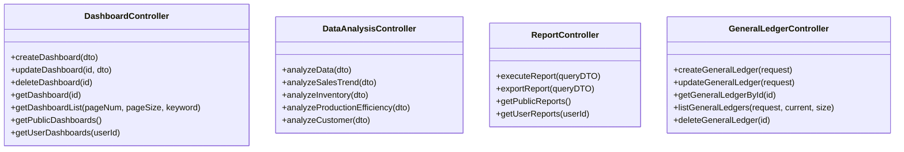

# 仪表盘API集成

<cite>
**本文引用的文件**
- [dashboard-api.js](file://07-frontend/src/services/api/dashboard-api.js)
- [request.js](file://07-frontend/src/services/utils/request.js)
- [DashboardController.java](file://08-backend/src/main/java/com/enterprise/brain/modules/analytics/controller/DashboardController.java)
- [DataAnalysisController.java](file://08-backend/src/main/java/com/enterprise/brain/modules/analytics/controller/DataAnalysisController.java)
- [ReportController.java](file://08-backend/src/main/java/com/enterprise/brain/modules/analytics/controller/ReportController.java)
- [GeneralLedgerController.java](file://08-backend/src/main/java/com/enterprise/brain/modules/finance/controller/GeneralLedgerController.java)
- [GeneralLedgerService.java](file://08-backend/src/main/java/com/enterprise/brain/modules/finance/service/GeneralLedgerService.java)
- [GeneralLedgerServiceImpl.java](file://08-backend/src/main/java/com/enterprise/brain/modules/finance/service/impl/GeneralLedgerServiceImpl.java)
- [GeneralLedgerResponse.java](file://08-backend/src/main/java/com/enterprise/brain/modules/finance/dto/response/GeneralLedgerResponse.java)
- [GeneralLedgerListResponse.java](file://08-backend/src/main/java/com/enterprise/brain/modules/finance/dto/response/GeneralLedgerListResponse.java)
- [BaseChart.vue](file://07-frontend/src/components/common/charts/BaseChart.vue)
- [LineChart.vue](file://07-frontend/src/components/common/charts/LineChart.vue)
- [ChartDemo.vue](file://07-frontend/src/components/common/charts/ChartDemo.vue)
</cite>

## 目录
1. [简介](#简介)
2. [项目结构](#项目结构)
3. [核心组件](#核心组件)
4. [架构总览](#架构总览)
5. [详细组件分析](#详细组件分析)
6. [依赖分析](#依赖分析)
7. [性能考虑](#性能考虑)
8. [故障排查指南](#故障排查指南)
9. [结论](#结论)
10. [附录](#附录)

## 简介
本文件面向前端工程师与后端开发者，系统化梳理前端仪表盘API模块与后端Spring Boot控制器之间的REST映射关系，覆盖仪表盘配置、图表数据与配置、首页聚合数据、实时数据、报表数据、导出、个性化布局、权限与共享、模板与数据源管理等能力。同时说明前端通过统一的请求封装实现拦截、认证注入、错误处理、重试与缓存策略，并给出离线可用性与用户体验一致性的实践建议。

## 项目结构
- 前端API层：位于 07-frontend/src/services/api/dashboard-api.js，封装了仪表盘相关REST调用。
- 前端请求封装：位于 07-frontend/src/services/utils/request.js，提供统一的请求、拦截、错误处理、重试与缓存。
- 后端控制器：
  - 仪表盘管理：08-backend/src/main/java/com/enterprise/brain/modules/analytics/controller/DashboardController.java
  - 数据分析：08-backend/src/main/java/com/enterprise/brain/modules/analytics/controller/DataAnalysisController.java
  - 报表：08-backend/src/main/java/com/enterprise/brain/modules/analytics/controller/ReportController.java
  - 总账（财务）：08-backend/src/main/java/com/enterprise/brain/modules/finance/controller/GeneralLedgerController.java
- 前端图表组件：07-frontend/src/components/common/charts/ 下的 BaseChart、LineChart、ChartDemo 等，负责数据加载、错误与空状态处理。

**图表来源**
- [dashboard-api.js](file://07-frontend/src/services/api/dashboard-api.js#L1-L259)
- [request.js](file://07-frontend/src/services/utils/request.js#L1-L798)
- [DashboardController.java](file://08-backend/src/main/java/com/enterprise/brain/modules/analytics/controller/DashboardController.java#L1-L84)
- [DataAnalysisController.java](file://08-backend/src/main/java/com/enterprise/brain/modules/analytics/controller/DataAnalysisController.java#L1-L62)
- [ReportController.java](file://08-backend/src/main/java/com/enterprise/brain/modules/analytics/controller/ReportController.java#L73-L100)
- [GeneralLedgerController.java](file://08-backend/src/main/java/com/enterprise/brain/modules/finance/controller/GeneralLedgerController.java#L1-L58)

**章节来源**
- [dashboard-api.js](file://07-frontend/src/services/api/dashboard-api.js#L1-L259)
- [request.js](file://07-frontend/src/services/utils/request.js#L1-L798)
- [DashboardController.java](file://08-backend/src/main/java/com/enterprise/brain/modules/analytics/controller/DashboardController.java#L1-L84)
- [DataAnalysisController.java](file://08-backend/src/main/java/com/enterprise/brain/modules/analytics/controller/DataAnalysisController.java#L1-L62)
- [ReportController.java](file://08-backend/src/main/java/com/enterprise/brain/modules/analytics/controller/ReportController.java#L73-L100)
- [GeneralLedgerController.java](file://08-backend/src/main/java/com/enterprise/brain/modules/finance/controller/GeneralLedgerController.java#L1-L58)

## 核心组件
- 前端仪表盘API封装：提供仪表盘配置、图表、首页、实时、报表、导出、个性化、权限、模板、数据源等子域的REST调用方法。
- 统一请求封装：提供请求/响应/错误拦截器、超时、重试、缓存、取消、批量与链式请求等能力。
- 后端控制器：提供仪表盘管理、数据分析、报表、总账等REST接口，返回统一响应包装。

**章节来源**
- [dashboard-api.js](file://07-frontend/src/services/api/dashboard-api.js#L1-L259)
- [request.js](file://07-frontend/src/services/utils/request.js#L1-L798)
- [DashboardController.java](file://08-backend/src/main/java/com/enterprise/brain/modules/analytics/controller/DashboardController.java#L1-L84)
- [DataAnalysisController.java](file://08-backend/src/main/java/com/enterprise/brain/modules/analytics/controller/DataAnalysisController.java#L1-L62)
- [ReportController.java](file://08-backend/src/main/java/com/enterprise/brain/modules/analytics/controller/ReportController.java#L73-L100)
- [GeneralLedgerController.java](file://08-backend/src/main/java/com/enterprise/brain/modules/finance/controller/GeneralLedgerController.java#L1-L58)

## 架构总览
前端通过 dashboard-api.js 调用后端REST接口，请求经 request.js 统一封装，包含拦截、认证注入、错误处理、重试与缓存；后端控制器按模块划分，仪表盘管理、数据分析、报表与总账分别由不同控制器处理。

**图表来源**
- [dashboard-api.js](file://07-frontend/src/services/api/dashboard-api.js#L1-L259)
- [request.js](file://07-frontend/src/services/utils/request.js#L1-L798)
- [DashboardController.java](file://08-backend/src/main/java/com/enterprise/brain/modules/analytics/controller/DashboardController.java#L1-L84)
- [DataAnalysisController.java](file://08-backend/src/main/java/com/enterprise/brain/modules/analytics/controller/DataAnalysisController.java#L1-L62)
- [ReportController.java](file://08-backend/src/main/java/com/enterprise/brain/modules/analytics/controller/ReportController.java#L73-L100)
- [GeneralLedgerController.java](file://08-backend/src/main/java/com/enterprise/brain/modules/finance/controller/GeneralLedgerController.java#L1-L58)

## 详细组件分析

### 仪表盘配置API（dashboard-api.config.*）
- 功能：获取仪表盘列表、详情、创建、更新、删除、复制。
- 对应后端控制器：DashboardController.java
- 关键接口映射：
  - GET /analytics/dashboard/{id} -> 获取仪表盘详情
  - GET /analytics/dashboard/list -> 获取仪表盘列表（分页、关键词）
  - POST /analytics/dashboard -> 创建仪表盘
  - PUT /analytics/dashboard/{id} -> 更新仪表盘
  - DELETE /analytics/dashboard/{id} -> 删除仪表盘
  - GET /analytics/dashboard/public -> 获取公开仪表盘
  - GET /analytics/dashboard/user/{userId} -> 获取用户可见仪表盘

**章节来源**
- [dashboard-api.js](file://07-frontend/src/services/api/dashboard-api.js#L6-L36)
- [DashboardController.java](file://08-backend/src/main/java/com/enterprise/brain/modules/analytics/controller/DashboardController.java#L30-L83)

### 图表API（dashboard-api.chart.*）
- 功能：获取图表数据、图表配置、更新配置、刷新图表。
- 前端调用：
  - GET /dashboard/charts/{chartId}/data
  - GET /dashboard/charts/{chartId}/config
  - PUT /dashboard/charts/{chartId}/config
  - POST /dashboard/charts/{chartId}/refresh
- 前端图表组件：
  - BaseChart.vue 提供统一的加载、错误、空状态与重载事件。
  - LineChart.vue 展示折线图，内部使用 ECharts 渲染。
  - ChartDemo.vue 展示多种图表组件的使用方式。

**图表来源**
- [ChartDemo.vue](file://07-frontend/src/components/common/charts/ChartDemo.vue#L1-L335)
- [BaseChart.vue](file://07-frontend/src/components/common/charts/BaseChart.vue#L1-L67)
- [LineChart.vue](file://07-frontend/src/components/common/charts/LineChart.vue#L1-L200)
- [dashboard-api.js](file://07-frontend/src/services/api/dashboard-api.js#L39-L59)
- [DataAnalysisController.java](file://08-backend/src/main/java/com/enterprise/brain/modules/analytics/controller/DataAnalysisController.java#L1-L62)

**章节来源**
- [dashboard-api.js](file://07-frontend/src/services/api/dashboard-api.js#L39-L59)
- [BaseChart.vue](file://07-frontend/src/components/common/charts/BaseChart.vue#L1-L67)
- [LineChart.vue](file://07-frontend/src/components/common/charts/LineChart.vue#L1-L200)
- [ChartDemo.vue](file://07-frontend/src/components/common/charts/ChartDemo.vue#L1-L335)
- [DataAnalysisController.java](file://08-backend/src/main/java/com/enterprise/brain/modules/analytics/controller/DataAnalysisController.java#L1-L62)

### 首页数据API（dashboard-api.home.*）
- 功能：首页概览、快捷入口、待办、活动、通知。
- 前端调用：
  - GET /dashboard/home/overview
  - GET /dashboard/home/quick-links
  - GET /dashboard/home/todos
  - GET /dashboard/home/activities
  - GET /dashboard/home/notices

**章节来源**
- [dashboard-api.js](file://07-frontend/src/services/api/dashboard-api.js#L61-L87)

### 实时数据API（dashboard-api.realtime.*）
- 功能：获取实时指标、实时图表数据、系统状态、订阅实时数据。
- 前端调用：
  - GET /dashboard/realtime/metrics?keys=...
  - GET /dashboard/realtime/charts/{chartId}
  - GET /dashboard/realtime/system-status
  - POST /dashboard/realtime/subscribe

**章节来源**
- [dashboard-api.js](file://07-frontend/src/services/api/dashboard-api.js#L89-L110)

### 报表数据API（dashboard-api.report.*）
- 功能：业务统计、销售趋势、用户分析、产品分析、财务分析。
- 前端调用：
  - GET /dashboard/reports/business
  - GET /dashboard/reports/sales-trend
  - GET /dashboard/reports/user-analysis
  - GET /dashboard/reports/product-analysis
  - GET /dashboard/reports/finance-analysis
- 对应后端控制器：ReportController.java

**章节来源**
- [dashboard-api.js](file://07-frontend/src/services/api/dashboard-api.js#L112-L138)
- [ReportController.java](file://08-backend/src/main/java/com/enterprise/brain/modules/analytics/controller/ReportController.java#L73-L100)

### 数据导出API（dashboard-api.export.*）
- 功能：导出仪表盘、图表、报表数据。
- 前端调用：
  - GET /dashboard/export/dashboard/{id}?format=pdf
  - GET /dashboard/export/chart/{chartId}?format=png
  - GET /dashboard/export/data/{reportType}?...

**章节来源**
- [dashboard-api.js](file://07-frontend/src/services/api/dashboard-api.js#L140-L156)

### 个性化设置API（dashboard-api.personalization.*）
- 功能：获取/更新用户偏好、获取/保存/重置自定义布局。
- 前端调用：
  - GET /dashboard/personalization/preferences
  - PUT /dashboard/personalization/preferences
  - GET /dashboard/personalization/layout/{dashboardId}
  - PUT /dashboard/personalization/layout/{dashboardId}
  - DELETE /dashboard/personalization/layout/{dashboardId}

**章节来源**
- [dashboard-api.js](file://07-frontend/src/services/api/dashboard-api.js#L158-L184)

### 权限与共享API（dashboard-api.permission.*）
- 功能：获取/设置仪表盘权限，获取/设置共享。
- 前端调用：
  - GET /dashboard/permissions/{dashboardId}
  - PUT /dashboard/permissions/{dashboardId}
  - GET /dashboard/sharing/{dashboardId}
  - PUT /dashboard/sharing/{dashboardId}

**章节来源**
- [dashboard-api.js](file://07-frontend/src/services/api/dashboard-api.js#L186-L207)

### 模板管理API（dashboard-api.template.*）
- 功能：模板列表、详情、创建、应用、删除。
- 前端调用：
  - GET /dashboard/templates
  - GET /dashboard/templates/{id}
  - POST /dashboard/templates
  - POST /dashboard/templates/{templateId}/apply
  - DELETE /dashboard/templates/{id}

**章节来源**
- [dashboard-api.js](file://07-frontend/src/services/api/dashboard-api.js#L209-L235)

### 数据源管理API（dashboard-api.dataSource.*）
- 功能：数据源列表、测试连接、字段、执行查询。
- 前端调用：
  - GET /dashboard/data-sources
  - POST /dashboard/data-sources/test
  - GET /dashboard/data-sources/{sourceId}/fields
  - POST /dashboard/data-sources/query

**章节来源**
- [dashboard-api.js](file://07-frontend/src/services/api/dashboard-api.js#L237-L259)

### 前端请求封装与拦截（request.js）
- 统一配置：baseURL、timeout、headers、responseType、withCredentials、retryCount、retryDelay、retryableStatuses、cache、mode。
- 拦截器：请求拦截器、响应拦截器、错误拦截器。
- 缓存策略：GET请求强制缓存键生成与复用。
- 重试机制：指数退避重试，支持可重试状态码。
- 取消请求：AbortController映射与清理。
- 批量与链式请求：Promise.all、Promise.allSettled、串行链式。
- 下载：Blob下载与自动触发。

**图表来源**
- [request.js](file://07-frontend/src/services/utils/request.js#L1-L798)

**章节来源**
- [request.js](file://07-frontend/src/services/utils/request.js#L1-L798)

### 后端控制器与Spring Boot映射
- 仪表盘管理：DashboardController.java
  - POST /analytics/dashboard
  - PUT /analytics/dashboard/{id}
  - DELETE /analytics/dashboard/{id}
  - GET /analytics/dashboard/{id}
  - GET /analytics/dashboard/list
  - GET /analytics/dashboard/public
  - GET /analytics/dashboard/user/{userId}
- 数据分析：DataAnalysisController.java
  - POST /analytics/analysis/execute
  - POST /analytics/analysis/sales-trend
  - POST /analytics/analysis/inventory
  - POST /analytics/analysis/production-efficiency
  - POST /analytics/analysis/customer
- 报表：ReportController.java
  - POST /analytics/report/execute
  - POST /analytics/report/export
  - GET /analytics/report/public
  - GET /analytics/report/user/{userId}
- 总账（财务）：GeneralLedgerController.java
  - POST /api/finance/general-ledger
  - PUT /api/finance/general-ledger
  - GET /api/finance/general-ledger/{id}
  - GET /api/finance/general-ledger
  - DELETE /api/finance/general-ledger/{id}

**图表来源**
- [DashboardController.java](file://08-backend/src/main/java/com/enterprise/brain/modules/analytics/controller/DashboardController.java#L1-L84)
- [DataAnalysisController.java](file://08-backend/src/main/java/com/enterprise/brain/modules/analytics/controller/DataAnalysisController.java#L1-L62)
- [ReportController.java](file://08-backend/src/main/java/com/enterprise/brain/modules/analytics/controller/ReportController.java#L73-L100)
- [GeneralLedgerController.java](file://08-backend/src/main/java/com/enterprise/brain/modules/finance/controller/GeneralLedgerController.java#L1-L58)

**章节来源**
- [DashboardController.java](file://08-backend/src/main/java/com/enterprise/brain/modules/analytics/controller/DashboardController.java#L1-L84)
- [DataAnalysisController.java](file://08-backend/src/main/java/com/enterprise/brain/modules/analytics/controller/DataAnalysisController.java#L1-L62)
- [ReportController.java](file://08-backend/src/main/java/com/enterprise/brain/modules/analytics/controller/ReportController.java#L73-L100)
- [GeneralLedgerController.java](file://08-backend/src/main/java/com/enterprise/brain/modules/finance/controller/GeneralLedgerController.java#L1-L58)

### 前端图表组件与数据流
- BaseChart.vue：统一的加载、错误、空状态与重载事件，供各图表组件复用。
- LineChart.vue：基于 ECharts 的折线图组件，接收数据、配置、尺寸等属性，渲染并绑定交互事件。
- ChartDemo.vue：演示多种图表组件的使用方式，包含刷新、点击、悬停等事件处理。

**图表来源**
- [ChartDemo.vue](file://07-frontend/src/components/common/charts/ChartDemo.vue#L1-L335)
- [BaseChart.vue](file://07-frontend/src/components/common/charts/BaseChart.vue#L1-L67)
- [LineChart.vue](file://07-frontend/src/components/common/charts/LineChart.vue#L1-L200)
- [dashboard-api.js](file://07-frontend/src/services/api/dashboard-api.js#L39-L59)
- [request.js](file://07-frontend/src/services/utils/request.js#L1-L798)

**章节来源**
- [BaseChart.vue](file://07-frontend/src/components/common/charts/BaseChart.vue#L1-L67)
- [LineChart.vue](file://07-frontend/src/components/common/charts/LineChart.vue#L1-L200)
- [ChartDemo.vue](file://07-frontend/src/components/common/charts/ChartDemo.vue#L1-L335)
- [dashboard-api.js](file://07-frontend/src/services/api/dashboard-api.js#L39-L59)
- [request.js](file://07-frontend/src/services/utils/request.js#L1-L798)

## 依赖分析
- 前端API对请求封装的依赖：dashboard-api.js 仅依赖 request.js 的 get/post/put/delete/download 等方法。
- 前端图表组件对API与请求封装的依赖：BaseChart/LineChart/ChartDemo 依赖 dashboard-api.js 与 request.js。
- 后端控制器对服务层的依赖：DashboardController/DataAnalysisController/ReportController/GeneralLedgerController 依赖各自的服务接口与实体。

**图表来源**
- [dashboard-api.js](file://07-frontend/src/services/api/dashboard-api.js#L1-L259)
- [request.js](file://07-frontend/src/services/utils/request.js#L1-L798)
- [DashboardController.java](file://08-backend/src/main/java/com/enterprise/brain/modules/analytics/controller/DashboardController.java#L1-L84)
- [DataAnalysisController.java](file://08-backend/src/main/java/com/enterprise/brain/modules/analytics/controller/DataAnalysisController.java#L1-L62)
- [ReportController.java](file://08-backend/src/main/java/com/enterprise/brain/modules/analytics/controller/ReportController.java#L73-L100)
- [GeneralLedgerController.java](file://08-backend/src/main/java/com/enterprise/brain/modules/finance/controller/GeneralLedgerController.java#L1-L58)

**章节来源**
- [dashboard-api.js](file://07-frontend/src/services/api/dashboard-api.js#L1-L259)
- [request.js](file://07-frontend/src/services/utils/request.js#L1-L798)
- [DashboardController.java](file://08-backend/src/main/java/com/enterprise/brain/modules/analytics/controller/DashboardController.java#L1-L84)
- [DataAnalysisController.java](file://08-backend/src/main/java/com/enterprise/brain/modules/analytics/controller/DataAnalysisController.java#L1-L62)
- [ReportController.java](file://08-backend/src/main/java/com/enterprise/brain/modules/analytics/controller/ReportController.java#L73-L100)
- [GeneralLedgerController.java](file://08-backend/src/main/java/com/enterprise/brain/modules/finance/controller/GeneralLedgerController.java#L1-L58)

## 性能考虑
- 请求缓存：GET请求在 request.js 中启用强制缓存，减少重复网络请求。
- 超时与重试：统一超时与指数退避重试，提升弱网环境下的稳定性。
- 批量与链式：支持批量请求与串行链式，优化复杂场景的数据加载顺序与并发控制。
- 取消请求：支持按URL取消，避免路由切换或组件卸载导致的资源浪费。
- 下载优化：Blob下载与自动触发，避免内存泄漏。

**章节来源**
- [request.js](file://07-frontend/src/services/utils/request.js#L1-L798)

## 故障排查指南
- 统一错误处理：request.js 在响应失败时构造错误对象，包含状态码、状态文本与响应体，便于前端捕获与提示。
- 错误拦截器：可在全局注册错误拦截器，统一处理鉴权失败、网络异常、业务错误等。
- 重试策略：针对可重试状态码（如超时、502/503/504），自动指数退避重试，降低瞬时故障影响。
- 取消请求：在组件销毁或路由切换时调用取消，避免后续回调造成副作用。
- 图表错误状态：BaseChart.vue 提供错误与空状态占位，配合 reload 事件进行手动重试。

**章节来源**
- [request.js](file://07-frontend/src/services/utils/request.js#L1-L798)
- [BaseChart.vue](file://07-frontend/src/components/common/charts/BaseChart.vue#L1-L67)

## 结论
本文系统梳理了前端仪表盘API与后端控制器的REST映射关系，明确了各模块的HTTP动词、URL路径、参数与返回结构，并解释了前端通过 request.js 实现的统一拦截、认证注入、错误处理、重试与缓存策略。结合图表组件的数据流，可确保在弱网与离线场景下仍具备良好的用户体验与一致性。

## 附录

### API清单与映射（前端调用到后端控制器）
- 仪表盘配置
  - GET /analytics/dashboard/{id} -> DashboardController.getDashboard
  - GET /analytics/dashboard/list -> DashboardController.getDashboardList
  - POST /analytics/dashboard -> DashboardController.createDashboard
  - PUT /analytics/dashboard/{id} -> DashboardController.updateDashboard
  - DELETE /analytics/dashboard/{id} -> DashboardController.deleteDashboard
  - GET /analytics/dashboard/public -> DashboardController.getPublicDashboards
  - GET /analytics/dashboard/user/{userId} -> DashboardController.getUserDashboards
- 图表数据
  - GET /analytics/analysis/sales-trend -> DataAnalysisController.analyzeSalesTrend
  - GET /analytics/analysis/execute -> DataAnalysisController.analyzeData
  - GET /analytics/analysis/inventory -> DataAnalysisController.analyzeInventory
  - GET /analytics/analysis/production-efficiency -> DataAnalysisController.analyzeProductionEfficiency
  - GET /analytics/analysis/customer -> DataAnalysisController.analyzeCustomer
- 报表
  - POST /analytics/report/execute -> ReportController.executeReport
  - POST /analytics/report/export -> ReportController.exportReport
  - GET /analytics/report/public -> ReportController.getPublicReports
  - GET /analytics/report/user/{userId} -> ReportController.getUserReports
- 总账（财务）
  - POST /api/finance/general-ledger -> GeneralLedgerController.createGeneralLedger
  - PUT /api/finance/general-ledger -> GeneralLedgerController.updateGeneralLedger
  - GET /api/finance/general-ledger/{id} -> GeneralLedgerController.getGeneralLedgerById
  - GET /api/finance/general-ledger -> GeneralLedgerController.listGeneralLedgers
  - DELETE /api/finance/general-ledger/{id} -> GeneralLedgerController.deleteGeneralLedger

**章节来源**
- [DashboardController.java](file://08-backend/src/main/java/com/enterprise/brain/modules/analytics/controller/DashboardController.java#L1-L84)
- [DataAnalysisController.java](file://08-backend/src/main/java/com/enterprise/brain/modules/analytics/controller/DataAnalysisController.java#L1-L62)
- [ReportController.java](file://08-backend/src/main/java/com/enterprise/brain/modules/analytics/controller/ReportController.java#L73-L100)
- [GeneralLedgerController.java](file://08-backend/src/main/java/com/enterprise/brain/modules/finance/controller/GeneralLedgerController.java#L1-L58)

### 前端图表组件与数据流（代码级）
- BaseChart.vue：提供统一的加载、错误、空状态与重载事件，供各图表组件复用。
- LineChart.vue：基于 ECharts 的折线图组件，接收数据、配置、尺寸等属性，渲染并绑定交互事件。
- ChartDemo.vue：演示多种图表组件的使用方式，包含刷新、点击、悬停等事件处理。

**章节来源**
- [BaseChart.vue](file://07-frontend/src/components/common/charts/BaseChart.vue#L1-L67)
- [LineChart.vue](file://07-frontend/src/components/common/charts/LineChart.vue#L1-L200)
- [ChartDemo.vue](file://07-frontend/src/components/common/charts/ChartDemo.vue#L1-L335)

### 后端服务与数据模型（财务总账）
- GeneralLedgerService 接口与 GeneralLedgerServiceImpl 实现：提供创建、更新、查询、分页查询、删除等能力。
- GeneralLedgerResponse/GeneralLedgerListResponse：定义响应数据结构，包含凭证编号、会计科目、金额、摘要、业务日期、记账日期、会计期间、时间戳等字段。

**章节来源**
- [GeneralLedgerService.java](file://08-backend/src/main/java/com/enterprise/brain/modules/finance/service/GeneralLedgerService.java#L1-L60)
- [GeneralLedgerServiceImpl.java](file://08-backend/src/main/java/com/enterprise/brain/modules/finance/service/impl/GeneralLedgerServiceImpl.java#L1-L64)
- [GeneralLedgerResponse.java](file://08-backend/src/main/java/com/enterprise/brain/modules/finance/dto/response/GeneralLedgerResponse.java#L1-L58)
- [GeneralLedgerListResponse.java](file://08-backend/src/main/java/com/enterprise/brain/modules/finance/dto/response/GeneralLedgerListResponse.java#L1-L29)