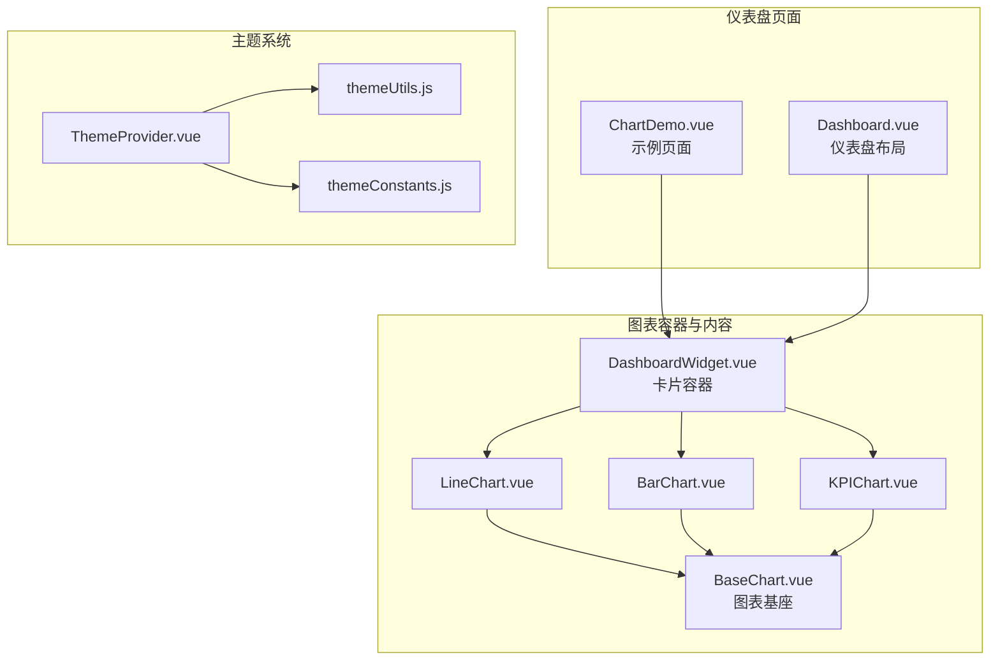
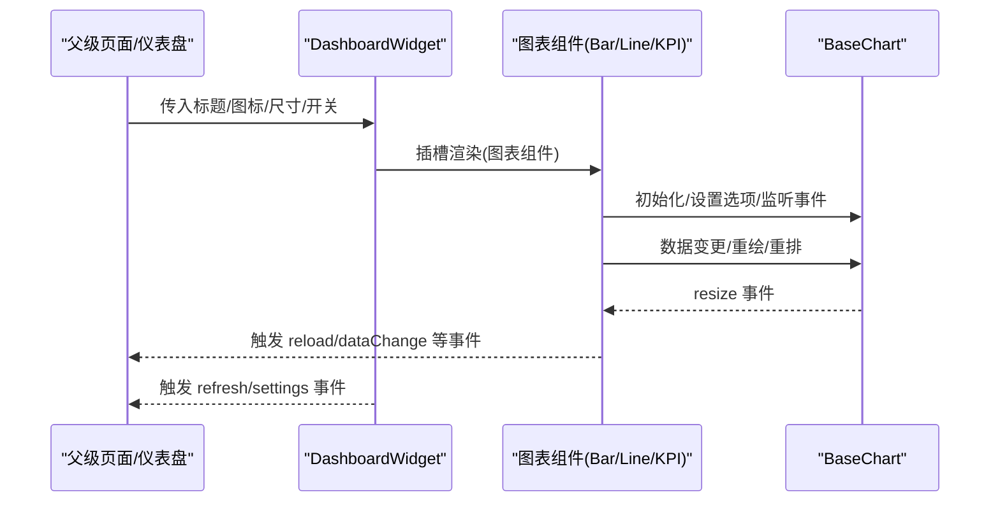
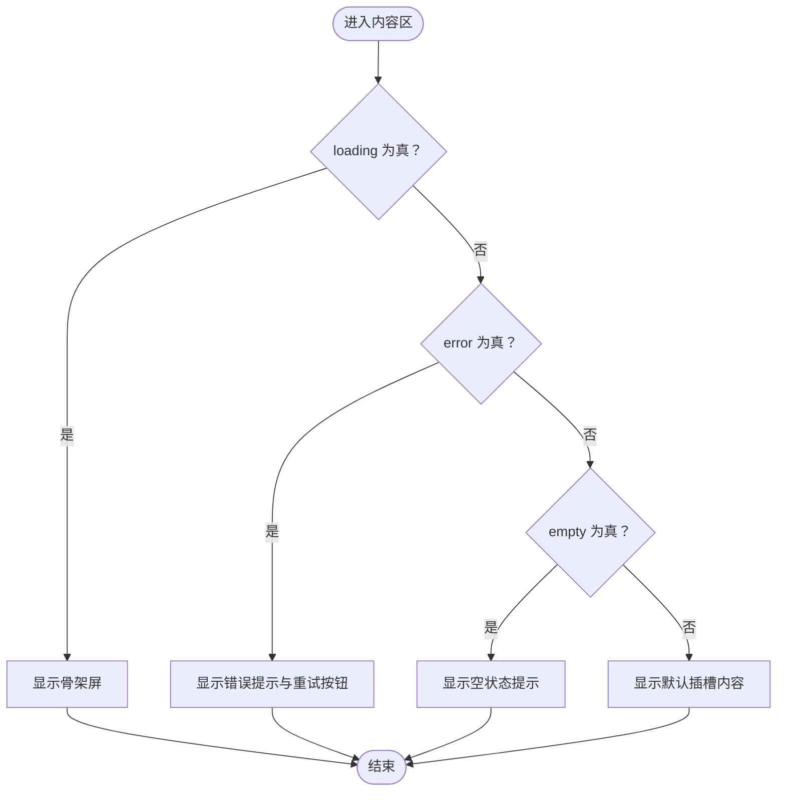
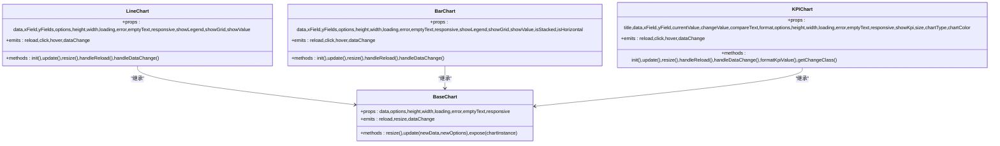
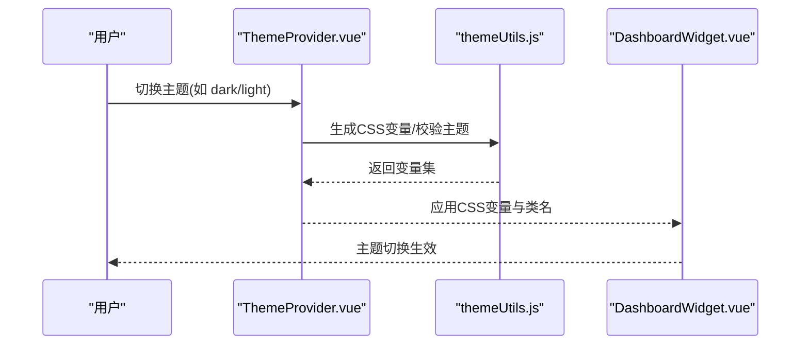
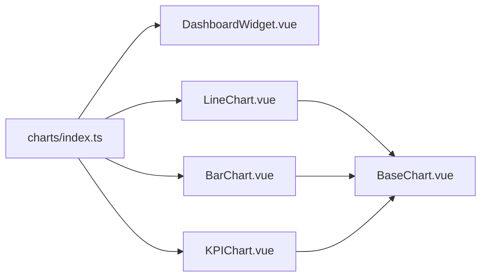

# 仪表盘卡片组件

<cite>
**本文引用的文件**
- [DashboardWidget.vue](file://07-frontend/src/components/common/charts/DashboardWidget.vue)
- [BaseChart.vue](file://07-frontend/src/components/common/charts/BaseChart.vue)
- [BarChart.vue](file://07-frontend/src/components/common/charts/BarChart.vue)
- [LineChart.vue](file://07-frontend/src/components/common/charts/LineChart.vue)
- [KPIChart.vue](file://07-frontend/src/components/common/charts/KPIChart.vue)
- [Dashboard.vue](file://07-frontend/src/components/common/charts/Dashboard.vue)
- [ChartDemo.vue](file://07-frontend/src/components/common/charts/ChartDemo.vue)
- [index.ts](file://07-frontend/src/components/common/charts/index.ts)
- [themeUtils.js](file://07-frontend/src/components/theme/utils/themeUtils.js)
- [themeConstants.js](file://07-frontend/src/components/theme/constants/themeConstants.js)
- [ThemeProvider.vue](file://07-frontend/src/components/theme/ThemeProvider.vue)
</cite>

## 目录
1. [简介](#简介)
2. [项目结构](#项目结构)
3. [核心组件](#核心组件)
4. [架构总览](#架构总览)
5. [详细组件分析](#详细组件分析)
6. [依赖关系分析](#依赖关系分析)
7. [性能考量](#性能考量)
8. [故障排查指南](#故障排查指南)
9. [结论](#结论)
10. [附录](#附录)

## 简介
本文件围绕 DashboardWidget.vue 作为“可复用卡片容器”的设计与实现进行深入解析，覆盖标题栏、刷新按钮、动作区插槽、加载/错误/空状态、底部插槽、尺寸与样式变体、响应式适配等通用UI能力；重点阐述插槽机制如何支撑 BarChart、LineChart、KPIChart 等多样化内容组件的灵活嵌入，实现“容器与内容分离”。同时分析与父级 Dashboard 的事件通信机制（如 resize 重绘、数据刷新触发），并提供基于 theme-utils.js 的主题扩展与深色/浅色模式切换方案，最后给出 loading、错误 fallback、权限可见性控制的实际使用示例路径。

## 项目结构
该组件位于前端通用图表模块下，与 BaseChart、具体图表组件（BarChart、LineChart、KPIChart）及 Dashboard 页面共同构成可视化仪表盘体系。

**图表来源**
- [DashboardWidget.vue](file://07-frontend/src/components/common/charts/DashboardWidget.vue#L1-L284)
- [BaseChart.vue](file://07-frontend/src/components/common/charts/BaseChart.vue#L1-L153)
- [LineChart.vue](file://07-frontend/src/components/common/charts/LineChart.vue#L1-L249)
- [BarChart.vue](file://07-frontend/src/components/common/charts/BarChart.vue#L1-L256)
- [KPIChart.vue](file://07-frontend/src/components/common/charts/KPIChart.vue#L1-L441)
- [Dashboard.vue](file://07-frontend/src/components/common/charts/Dashboard.vue#L1-L268)
- [ChartDemo.vue](file://07-frontend/src/components/common/charts/ChartDemo.vue#L1-L77)
- [ThemeProvider.vue](file://07-frontend/src/components/theme/ThemeProvider.vue#L1-L326)
- [themeUtils.js](file://07-frontend/src/components/theme/utils/themeUtils.js#L1-L355)
- [themeConstants.js](file://07-frontend/src/components/theme/constants/themeConstants.js#L1-L211)

**章节来源**
- [DashboardWidget.vue](file://07-frontend/src/components/common/charts/DashboardWidget.vue#L1-L284)
- [index.ts](file://07-frontend/src/components/common/charts/index.ts#L1-L34)

## 核心组件
- DashboardWidget.vue：卡片容器，提供标题、动作区（刷新/设置）、内容区（加载/错误/空/主体）、底部插槽、尺寸与样式变体、响应式适配。
- BaseChart.vue：图表基座，统一封装加载、错误、空状态、响应式 resize 通知、数据变更事件。
- LineChart.vue / BarChart.vue / KPIChart.vue：具体图表组件，基于 BaseChart，注入数据、配置、交互事件，并暴露 resize/update 等方法。
- Dashboard.vue：仪表盘页面容器，提供 KPI 区域与图表网格布局，便于在页面层面组织多个卡片。
- ChartDemo.vue：示例页面，演示如何在卡片中嵌入不同图表组件，并绑定刷新事件。

**章节来源**
- [DashboardWidget.vue](file://07-frontend/src/components/common/charts/DashboardWidget.vue#L1-L284)
- [BaseChart.vue](file://07-frontend/src/components/common/charts/BaseChart.vue#L1-L153)
- [LineChart.vue](file://07-frontend/src/components/common/charts/LineChart.vue#L1-L249)
- [BarChart.vue](file://07-frontend/src/components/common/charts/BarChart.vue#L1-L256)
- [KPIChart.vue](file://07-frontend/src/components/common/charts/KPIChart.vue#L1-L441)
- [Dashboard.vue](file://07-frontend/src/components/common/charts/Dashboard.vue#L1-L268)
- [ChartDemo.vue](file://07-frontend/src/components/common/charts/ChartDemo.vue#L1-L77)

## 架构总览
DashboardWidget 作为“容器”，通过具名插槽与默认插槽将任意内容组件（如 LineChart、BarChart、KPIChart）注入到卡片内容区；内容组件基于 BaseChart 提供统一的状态与事件协议，实现“容器与内容分离”的设计原则。父级 Dashboard 或示例页面负责调度数据与交互，卡片仅承担 UI 容器职责。

**图表来源**
- [DashboardWidget.vue](file://07-frontend/src/components/common/charts/DashboardWidget.vue#L1-L155)
- [BaseChart.vue](file://07-frontend/src/components/common/charts/BaseChart.vue#L1-L123)
- [BarChart.vue](file://07-frontend/src/components/common/charts/BarChart.vue#L1-L256)
- [LineChart.vue](file://07-frontend/src/components/common/charts/LineChart.vue#L1-L249)
- [KPIChart.vue](file://07-frontend/src/components/common/charts/KPIChart.vue#L1-L441)

## 详细组件分析

### DashboardWidget 卡片容器
- 标题栏与动作区
  - 支持显示/隐藏头部、显示/隐藏动作区、显示/隐藏刷新/设置按钮、自定义图标与标题文本。
  - 动作区优先使用具名插槽 actions，若未提供则回退到内置按钮（刷新/设置）。
- 内容区状态
  - loading/error/empty/正常内容四态：分别渲染骨架屏、错误提示与重试、空状态提示。
  - 正文区域通过默认插槽承载任意内容组件。
- 底部插槽
  - 支持具名 footer 插槽，默认文本可通过 footerText 传入。
- 尺寸与样式
  - size 支持 small/medium/large，对应内边距差异；bordered/hoverable 控制边框与悬停阴影。
- 响应式
  - 在小屏下自动调整标题方向、动作区对齐方式与字体大小，保证移动端体验。
- 事件
  - 暴露 refresh/settings/click 事件，父级可监听以执行刷新或打开设置。

**图表来源**
- [DashboardWidget.vue](file://07-frontend/src/components/common/charts/DashboardWidget.vue#L1-L155)

**章节来源**
- [DashboardWidget.vue](file://07-frontend/src/components/common/charts/DashboardWidget.vue#L1-L284)

### BaseChart 图表基座
- 统一状态
  - loading/error/empty 三态由 BaseChart 内部处理，图表组件只需传入 data/options/尺寸等即可。
- 响应式
  - 使用 ResizeObserver 监听容器尺寸变化，向外部发出 resize 事件，图表组件据此调用内部实例 resize。
- 事件
  - 暴露 reload/dataChange/resize 事件，供图表组件与父级通信。
- 方法暴露
  - 暴露 resize/update/chartInstance，供父级或图表组件自身调用。

**章节来源**
- [BaseChart.vue](file://07-frontend/src/components/common/charts/BaseChart.vue#L1-L153)

### 具体图表组件（Line/Bar/KPI）
- LineChart/BarChart
  - 基于 ECharts，接收 data/yFields/options/尺寸等参数，计算合并后的 options 并初始化实例。
  - 监听数据变化，动态更新图表；对外暴露 init/update/resize 方法。
  - 通过 BaseChart 的 reload/resize/dataChange 事件与父级联动。
- KPIChart
  - 在折线趋势之上叠加 KPI 主指标展示（当前值、变化率、对比文案），并根据 size 调整图表高度。
  - 同样基于 BaseChart，具备统一的加载/错误/空状态与事件协议。

**图表来源**
- [BaseChart.vue](file://07-frontend/src/components/common/charts/BaseChart.vue#L1-L153)
- [LineChart.vue](file://07-frontend/src/components/common/charts/LineChart.vue#L1-L249)
- [BarChart.vue](file://07-frontend/src/components/common/charts/BarChart.vue#L1-L256)
- [KPIChart.vue](file://07-frontend/src/components/common/charts/KPIChart.vue#L1-L441)

**章节来源**
- [LineChart.vue](file://07-frontend/src/components/common/charts/LineChart.vue#L1-L249)
- [BarChart.vue](file://07-frontend/src/components/common/charts/BarChart.vue#L1-L256)
- [KPIChart.vue](file://07-frontend/src/components/common/charts/KPIChart.vue#L1-L441)

### 与父级 Dashboard 的事件通信
- 父级 Dashboard（Dashboard.vue）提供 KPI 区域与图表网格布局，卡片容器本身不直接管理布局，但通过事件与内容组件协作完成刷新与重绘。
- 事件链路
  - 父级页面监听卡片的 refresh/settings 事件，发起数据拉取或配置弹窗。
  - 图表组件通过 BaseChart 的 reload/resize/dataChange 事件向上游传递，父级可据此触发刷新或重排。
- 示例参考
  - ChartDemo.vue 中通过 @refresh 绑定刷新回调，将卡片与具体图表组件串联起来。

**章节来源**
- [Dashboard.vue](file://07-frontend/src/components/common/charts/Dashboard.vue#L1-L268)
- [ChartDemo.vue](file://07-frontend/src/components/common/charts/ChartDemo.vue#L1-L77)
- [BaseChart.vue](file://07-frontend/src/components/common/charts/BaseChart.vue#L1-L123)
- [DashboardWidget.vue](file://07-frontend/src/components/common/charts/DashboardWidget.vue#L144-L155)

### 插槽机制与“容器与内容分离”
- 标题与动作区
  - 通过具名插槽 actions，父级可完全自定义操作区（如自定义按钮、下拉菜单、权限控制按钮等）。
- 内容区
  - 默认插槽承载任意内容组件，实现“容器与内容分离”。
- 底部区
  - 通过具名插槽 footer，父级可插入说明、统计、分页等辅助信息。
- 权限可见性控制
  - 可在父级通过条件渲染或权限指令控制卡片是否渲染，从而实现按角色/部门显示不同卡片。

**章节来源**
- [DashboardWidget.vue](file://07-frontend/src/components/common/charts/DashboardWidget.vue#L1-L155)

### 主题扩展与深色/浅色模式切换
- 主题常量与预设
  - themeConstants.js 提供 THEME_PRESETS、布局/组件/动画/字体/阴影/断点等配置常量。
- 主题工具
  - themeUtils.js 提供颜色工具、CSS变量操作、主题验证与转换、本地存储、响应式与动画工具等。
- 主题提供者
  - ThemeProvider.vue 通过 CSS 变量与类名切换实现主题切换，支持系统深色模式检测与自定义主题导入导出。
- 与卡片的结合
  - DashboardWidget 的样式采用固定背景色，建议在 ThemeProvider 的 CSS 变量体系下，将卡片背景、边框、文字色等映射到 --background-color、--text-color、--border-color 等变量，实现深色/浅色自动适配。

**图表来源**
- [ThemeProvider.vue](file://07-frontend/src/components/theme/ThemeProvider.vue#L1-L326)
- [themeUtils.js](file://07-frontend/src/components/theme/utils/themeUtils.js#L1-L355)
- [themeConstants.js](file://07-frontend/src/components/theme/constants/themeConstants.js#L1-L211)
- [DashboardWidget.vue](file://07-frontend/src/components/common/charts/DashboardWidget.vue#L157-L284)

**章节来源**
- [themeConstants.js](file://07-frontend/src/components/theme/constants/themeConstants.js#L1-L211)
- [themeUtils.js](file://07-frontend/src/components/theme/utils/themeUtils.js#L1-L355)
- [ThemeProvider.vue](file://07-frontend/src/components/theme/ThemeProvider.vue#L1-L326)
- [DashboardWidget.vue](file://07-frontend/src/components/common/charts/DashboardWidget.vue#L157-L284)

### 实际使用示例与最佳实践
- 配置 loading 状态
  - 在父级页面或业务逻辑中，将图表组件的 loading 属性绑定到卡片的 loading，实现统一加载态。
  - 参考路径：[ChartDemo.vue](file://07-frontend/src/components/common/charts/ChartDemo.vue#L1-L77)
- 错误 fallback
  - 当图表组件抛出错误或数据为空时，BaseChart 会自动进入错误/空状态；父级可监听 reload 事件重新拉取数据。
  - 参考路径：[BaseChart.vue](file://07-frontend/src/components/common/charts/BaseChart.vue#L1-L123)
- 权限可见性控制
  - 在父级通过条件渲染或权限指令决定是否渲染卡片，避免无权限用户看到空白卡片。
  - 参考路径：[ChartDemo.vue](file://07-frontend/src/components/common/charts/ChartDemo.vue#L1-L77)
- 刷新与重绘
  - 父级监听卡片 refresh 事件后，调用图表组件的 update/resize 方法或重新请求数据。
  - 参考路径：[DashboardWidget.vue](file://07-frontend/src/components/common/charts/DashboardWidget.vue#L144-L155)，[BaseChart.vue](file://07-frontend/src/components/common/charts/BaseChart.vue#L84-L123)

**章节来源**
- [ChartDemo.vue](file://07-frontend/src/components/common/charts/ChartDemo.vue#L1-L77)
- [BaseChart.vue](file://07-frontend/src/components/common/charts/BaseChart.vue#L1-L153)
- [DashboardWidget.vue](file://07-frontend/src/components/common/charts/DashboardWidget.vue#L144-L155)

## 依赖关系分析
- 组件导出
  - charts/index.ts 将 DashboardWidget 与其他图表组件统一导出，便于集中引入与按需使用。
- 组件间耦合
  - DashboardWidget 与具体图表组件通过插槽解耦；图表组件与 BaseChart 强耦合（继承/复用），实现统一状态与事件协议。
- 外部依赖
  - Element Plus 图标与组件用于按钮、骨架屏、空状态等 UI 基元。
  - ECharts 用于图表渲染与交互。

**图表来源**
- [index.ts](file://07-frontend/src/components/common/charts/index.ts#L1-L34)
- [DashboardWidget.vue](file://07-frontend/src/components/common/charts/DashboardWidget.vue#L1-L284)
- [BaseChart.vue](file://07-frontend/src/components/common/charts/BaseChart.vue#L1-L153)
- [LineChart.vue](file://07-frontend/src/components/common/charts/LineChart.vue#L1-L249)
- [BarChart.vue](file://07-frontend/src/components/common/charts/BarChart.vue#L1-L256)
- [KPIChart.vue](file://07-frontend/src/components/common/charts/KPIChart.vue#L1-L441)

**章节来源**
- [index.ts](file://07-frontend/src/components/common/charts/index.ts#L1-L34)

## 性能考量
- 渲染优化
  - 通过 props 控制 loading/error/empty，避免不必要的 DOM 渲染；在小屏下减少复杂布局。
- 事件节流
  - BaseChart 使用 ResizeObserver 监听尺寸变化，建议在图表组件内部对 resize 事件做防抖/节流，避免频繁重绘。
- 数据更新
  - 图表组件监听 data/options 变化，使用深度比较与增量更新策略，减少 setOption 的开销。
- 主题切换
  - 通过 CSS 变量切换主题，避免全量重绘；在 ThemeProvider 中批量设置变量，减少样式抖动。

[本节为通用指导，无需特定文件引用]

## 故障排查指南
- 刷新按钮无效
  - 确认父级是否监听卡片 refresh 事件并执行数据刷新或图表 update/resize。
  - 参考路径：[DashboardWidget.vue](file://07-frontend/src/components/common/charts/DashboardWidget.vue#L144-L155)
- 图表不随容器变化重绘
  - 确保 BaseChart 的 resize 事件被正确监听，图表组件内部调用实例 resize。
  - 参考路径：[BaseChart.vue](file://07-frontend/src/components/common/charts/BaseChart.vue#L84-L123)，[LineChart.vue](file://07-frontend/src/components/common/charts/LineChart.vue#L208-L221)
- 错误态无法恢复
  - 父级需在监听 reload 事件后重新拉取数据；确保 error/loading 状态及时清零。
  - 参考路径：[BaseChart.vue](file://07-frontend/src/components/common/charts/BaseChart.vue#L1-L123)
- 主题切换不生效
  - 检查 ThemeProvider 是否正确设置 CSS 变量，卡片样式是否从变量读取。
  - 参考路径：[ThemeProvider.vue](file://07-frontend/src/components/theme/ThemeProvider.vue#L142-L174)，[DashboardWidget.vue](file://07-frontend/src/components/common/charts/DashboardWidget.vue#L157-L284)

**章节来源**
- [DashboardWidget.vue](file://07-frontend/src/components/common/charts/DashboardWidget.vue#L144-L155)
- [BaseChart.vue](file://07-frontend/src/components/common/charts/BaseChart.vue#L1-L123)
- [LineChart.vue](file://07-frontend/src/components/common/charts/LineChart.vue#L208-L221)
- [ThemeProvider.vue](file://07-frontend/src/components/theme/ThemeProvider.vue#L142-L174)

## 结论
DashboardWidget 通过插槽与事件机制实现了“容器与内容分离”的高内聚低耦合设计，配合 BaseChart 的统一状态与事件协议，使 BarChart、LineChart、KPIChart 等内容组件能够无缝嵌入卡片。结合 ThemeProvider 与 themeUtils.js，可轻松实现深色/浅色模式切换与主题扩展。在父级 Dashboard 或示例页面中，通过监听 refresh/resize/reload 等事件，可实现数据刷新与图表重绘的闭环，满足仪表盘场景下的灵活性与一致性需求。

[本节为总结，无需特定文件引用]

## 附录
- 导出清单
  - charts/index.ts 统一导出 DashboardWidget 与其他图表组件，便于集中引入。
- 使用建议
  - 在父级页面中，优先使用具名插槽 actions/footer 进行定制化扩展。
  - 对于需要权限控制的卡片，建议在父级进行条件渲染。
  - 图表组件的数据更新与重绘应遵循 BaseChart 的事件协议，保持一致的交互体验。

**章节来源**
- [index.ts](file://07-frontend/src/components/common/charts/index.ts#L1-L34)