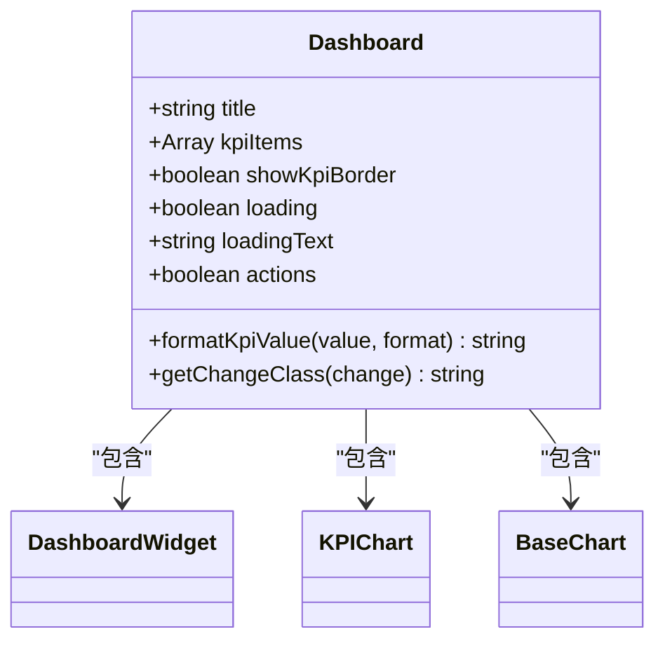
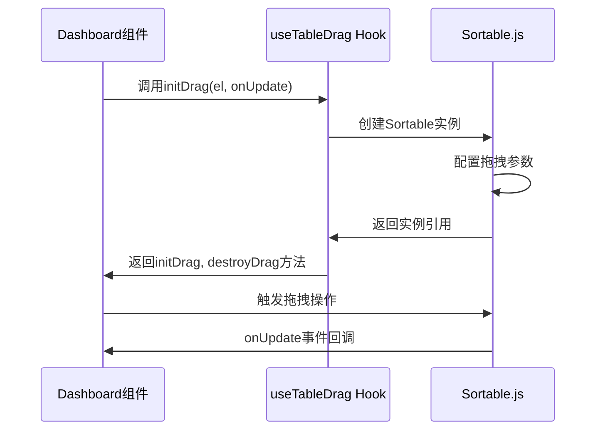
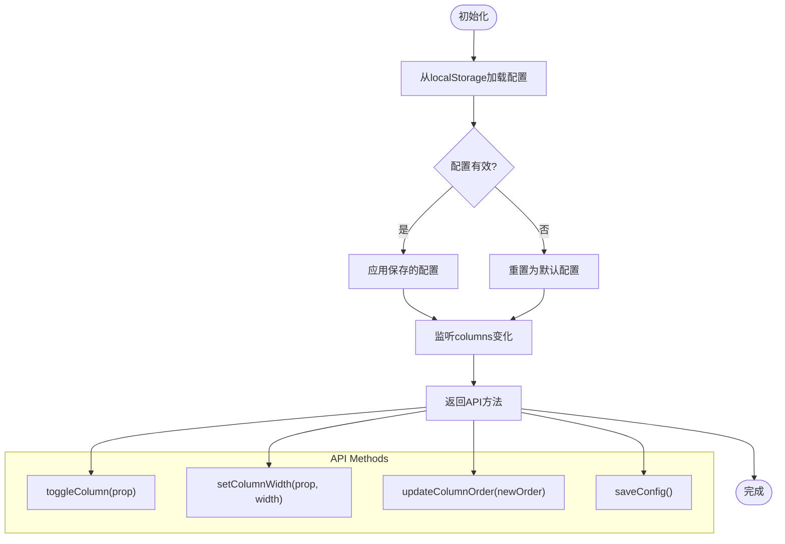
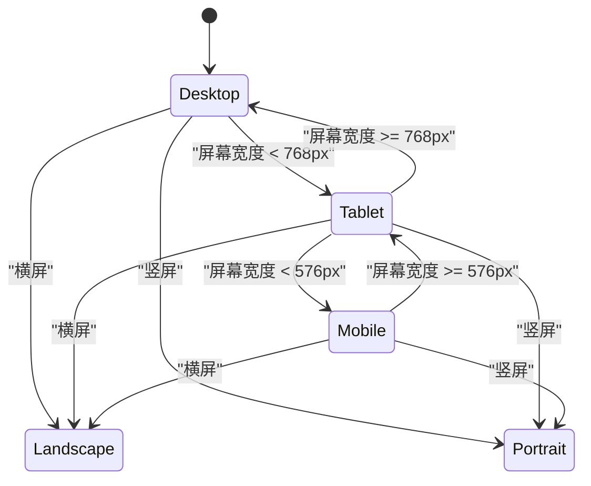
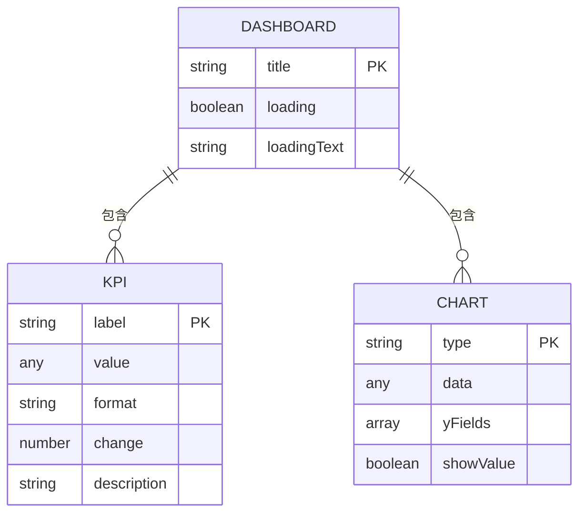
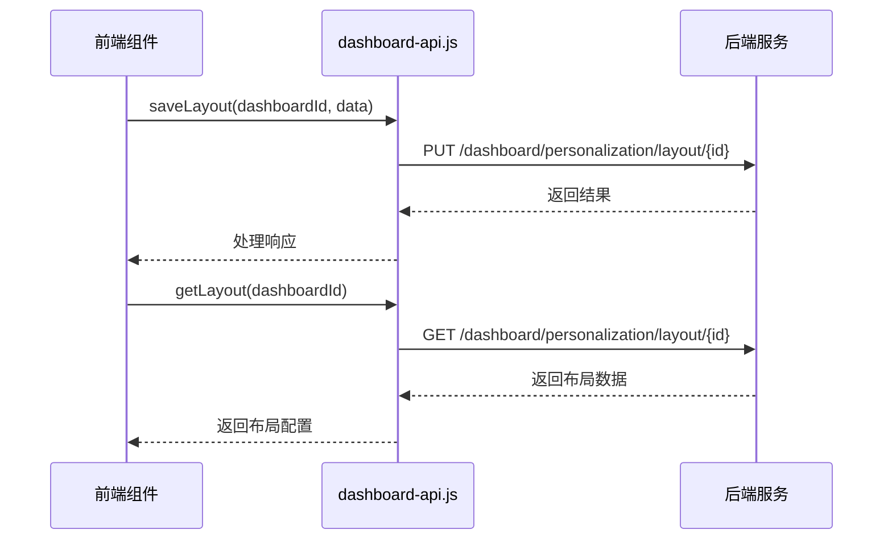

# 仪表盘容器组件

<cite>
**本文档引用的文件**   
- [Dashboard.vue](file://07-frontend/src/components/common/charts/Dashboard.vue)
- [DashboardWidget.vue](file://07-frontend/src/components/common/charts/DashboardWidget.vue)
- [useTableDrag.js](file://07-frontend/src/components/common/tables/enhanced/hooks/useTableDrag.js)
- [useColumnConfig.js](file://07-frontend/src/components/common/tables/enhanced/hooks/useColumnConfig.js)
- [dashboard-api.js](file://07-frontend/src/services/api/dashboard-api.js)
- [device-detector.js](file://07-frontend/src/utils/device-detector.js)
- [KPIDashboard.vue](file://07-frontend/src/pages/dashboard/KPIDashboard.vue)
- [SalesDashboard.vue](file://07-frontend/src/pages/dashboard/SalesDashboard.vue)
- [AIDashboard.vue](file://07-frontend/src/pages/dashboard/AIDashboard.vue)
- [HRDashboard.vue](file://07-frontend/src/pages/dashboard/HRDashboard.vue)
</cite>

## 目录
1. [简介](#简介)
2. [核心架构分析](#核心架构分析)
3. [布局管理机制](#布局管理机制)
4. [响应式断点适配策略](#响应式断点适配策略)
5. [组件通信机制](#组件通信机制)
6. [持久化存储实现](#持久化存储实现)
7. [性能优化建议](#性能优化建议)
8. [实际应用示例](#实际应用示例)
9. [结论](#结论)

## 简介
仪表盘容器组件是企业级应用中的核心可视化组件，基于Vue 3组合式API构建，提供灵活的布局编排和数据展示能力。该组件通过集成多种hooks实现动态布局管理，支持拖拽排序、列配置管理等高级功能，并通过localStorage或后端接口实现布局配置的持久化存储。组件具备响应式设计，能够适配桌面端、平板等多种设备显示需求。

**Section sources**
- [Dashboard.vue](file://07-frontend/src/components/common/charts/Dashboard.vue#L1-L268)

## 核心架构分析
仪表盘容器组件采用Vue 3组合式API架构，通过setup语法糖实现响应式数据管理和逻辑封装。组件主要由标题区域、KPI指标区域和图表区域三部分构成，通过props接收外部配置，实现高度可配置化。

组件使用TypeScript进行类型定义，确保类型安全。通过defineProps定义组件属性，包括标题、KPI指标项、加载状态等。同时，组件内部实现了KPI值格式化方法，支持货币、百分比、数字等多种格式的自动转换。

**Diagram sources **
- [Dashboard.vue](file://07-frontend/src/components/common/charts/Dashboard.vue#L50-L108)

**Section sources**
- [Dashboard.vue](file://07-frontend/src/components/common/charts/Dashboard.vue#L49-L109)

## 布局管理机制
### 拖拽排序实现
仪表盘容器组件通过useTableDrag.js hook实现拖拽排序功能。该hook封装了Sortable.js库，提供初始化拖拽、销毁拖拽实例等方法。通过initDrag方法创建Sortable实例，配置动画效果、手柄元素、样式类等参数。

**Diagram sources **
- [useTableDrag.js](file://07-frontend/src/components/common/tables/enhanced/hooks/useTableDrag.js#L5-L38)

### 列配置管理
组件通过useColumnConfig.js hook实现列配置管理，支持列可见性切换、列宽设置和列顺序更新。该hook使用localStorage进行配置持久化，通过storageKey参数指定存储键名。

**Diagram sources **
- [useColumnConfig.js](file://07-frontend/src/components/common/tables/enhanced/hooks/useColumnConfig.js#L4-L78)

**Section sources**
- [useTableDrag.js](file://07-frontend/src/components/common/tables/enhanced/hooks/useTableDrag.js#L5-L38)
- [useColumnConfig.js](file://07-frontend/src/components/common/tables/enhanced/hooks/useColumnConfig.js#L4-L78)

## 响应式断点适配策略
组件采用基于CSS Grid的响应式布局，通过媒体查询实现多设备适配。在桌面端使用多列布局，在移动设备上自动切换为单列布局。

设备检测通过device-detector.js工具类实现，该类提供设备类型、浏览器信息、操作系统、屏幕信息等检测功能。通过getDeviceType方法判断设备类型，结合屏幕尺寸和触摸特性进行精确识别。

**Diagram sources **
- [device-detector.js](file://07-frontend/src/utils/device-detector.js#L36-L58)
- [Dashboard.vue](file://07-frontend/src/components/common/charts/Dashboard.vue#L240-L267)

**Section sources**
- [device-detector.js](file://07-frontend/src/utils/device-detector.js#L36-L58)
- [Dashboard.vue](file://07-frontend/src/components/common/charts/Dashboard.vue#L240-L267)

## 组件通信机制
### Props通信
组件通过props与父组件通信，定义了title、kpiItems、loading等属性。KPI指标数据结构包含label、value、format、change等字段，支持多种数据格式展示。

**Diagram sources **
- [Dashboard.vue](file://07-frontend/src/components/common/charts/Dashboard.vue#L53-L84)

### 事件总线设计
组件通过defineEmits定义事件接口，支持refresh、settings等事件的触发。子组件通过emit方法向父组件传递事件，实现双向通信。

**Section sources**
- [Dashboard.vue](file://07-frontend/src/components/common/charts/Dashboard.vue#L53-L84)
- [DashboardWidget.vue](file://07-frontend/src/components/common/charts/DashboardWidget.vue#L145-L154)

## 持久化存储实现
### 本地存储
组件通过localStorage实现配置持久化，使用useColumnConfig.js中的saveConfig方法将可见列、列宽、列顺序等配置保存到本地存储。

### 后端存储
通过dashboard-api.js提供后端存储接口，支持仪表盘配置的增删改查操作。个性化设置模块提供getLayout和saveLayout方法，实现布局配置的云端存储。

**Diagram sources **
- [dashboard-api.js](file://07-frontend/src/services/api/dashboard-api.js#L175-L178)
- [useColumnConfig.js](file://07-frontend/src/components/common/tables/enhanced/hooks/useColumnConfig.js#L34-L41)

**Section sources**
- [dashboard-api.js](file://07-frontend/src/services/api/dashboard-api.js#L175-L178)
- [useColumnConfig.js](file://07-frontend/src/components/common/tables/enhanced/hooks/useColumnConfig.js#L34-L41)

## 性能优化建议
### 虚拟滚动
对于大数据量的表格展示，建议使用VirtualTable组件实现虚拟滚动，仅渲染可视区域的行，大幅提升渲染性能。

### 组件懒加载
通过Vue的异步组件和路由懒加载，将仪表盘组件按需加载，减少首屏加载时间。

### 缓存策略
合理使用computed和watch的缓存机制，避免重复计算。对于API请求，实现请求缓存，减少不必要的网络请求。

**Section sources**
- [VirtualTable.vue](file://07-frontend/src/components/common/tables/VirtualTable.vue#L1-L272)
- [BaseTable.vue](file://07-frontend/src/components/common/tables/BaseTable.vue#L1-L422)

## 实际应用示例
### KPI工作台
KPIDashboard.vue展示了KPI指标的典型应用，通过统计卡片展示关键绩效指标，采用响应式布局适配不同屏幕尺寸。

### 销售工作台
SalesDashboard.vue展示了销售数据的可视化展示，通过统计卡片展示销售额、订单数量等关键指标，提供直观的业务洞察。

### 人事工作台
HRDashboard.vue展示了人事管理功能，包含员工统计、入职离职数据、待办事项等功能模块，体现仪表盘的多功能集成能力。

**Section sources**
- [KPIDashboard.vue](file://07-frontend/src/pages/dashboard/KPIDashboard.vue#L1-L185)
- [SalesDashboard.vue](file://07-frontend/src/pages/dashboard/SalesDashboard.vue#L1-L185)
- [HRDashboard.vue](file://07-frontend/src/pages/dashboard/HRDashboard.vue#L1-L257)

## 结论
仪表盘容器组件通过Vue 3组合式API实现了灵活的布局管理和数据展示能力。组件采用模块化设计，通过hooks机制集成拖拽排序、列配置管理等功能，支持本地和云端的配置持久化。响应式设计确保了在不同设备上的良好用户体验。通过合理的性能优化策略，能够高效处理大数据量的展示需求，是企业级应用中理想的可视化解决方案。