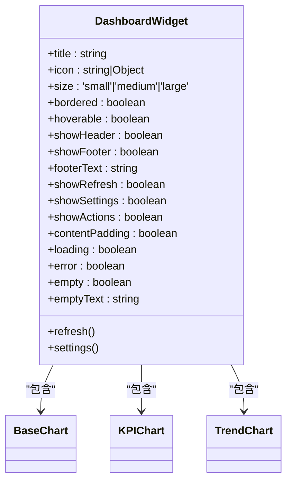
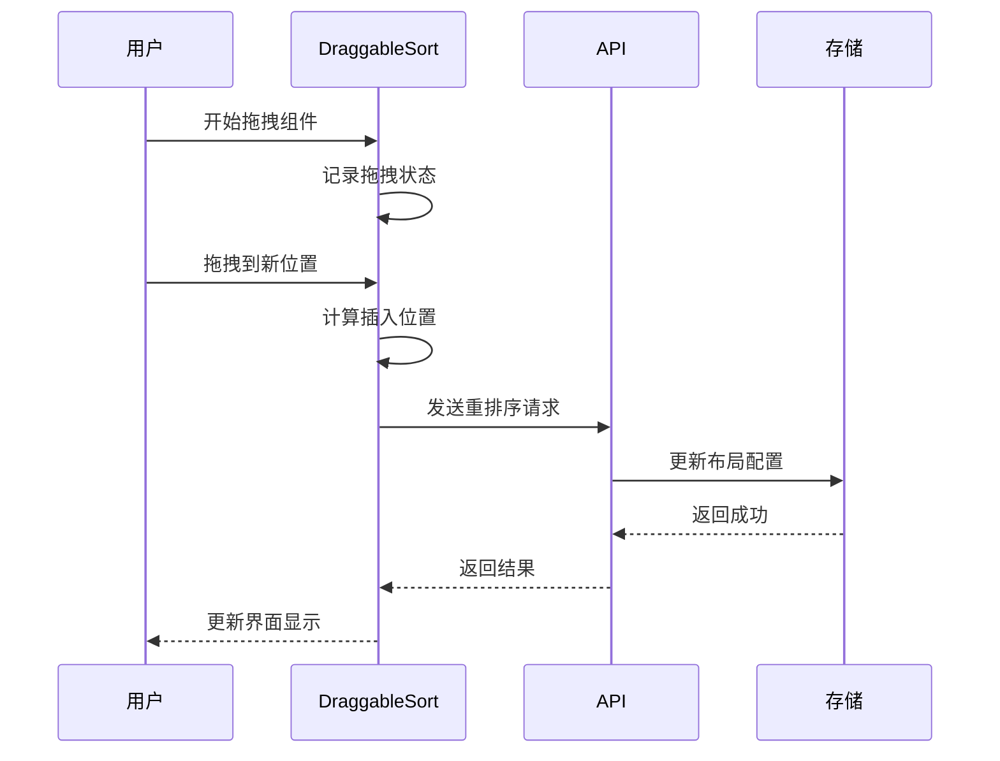
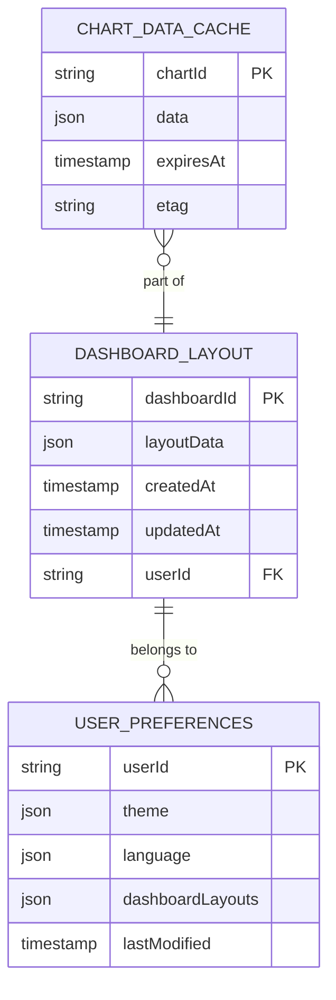
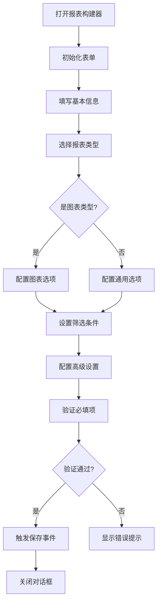
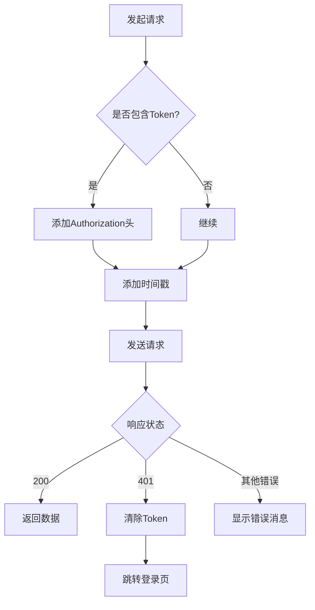

# 仪表盘组件

<cite>
**本文档引用文件**   
- [Dashboard.vue](file://07-frontend/src/components/common/charts/Dashboard.vue)
- [DashboardWidget.vue](file://07-frontend/src/components/common/charts/DashboardWidget.vue)
- [dashboard-api.js](file://07-frontend/src/services/api/dashboard-api.js)
- [ReportBuilder.vue](file://07-frontend/src/pages/analytics/components/ReportBuilder.vue)
- [KPIChart.vue](file://07-frontend/src/components/common/charts/KPIChart.vue)
- [TrendChart.vue](file://07-frontend/src/components/common/charts/TrendChart.vue)
- [BaseChart.vue](file://07-frontend/src/components/common/charts/BaseChart.vue)
- [DraggableSort.vue](file://07-frontend/src/components/common/DraggableSort.vue)
- [useTableDrag.js](file://07-frontend/src/components/common/tables/enhanced/hooks/useTableDrag.js)
- [storage.js](file://07-frontend/src/services/utils/storage.js)
- [request.js](file://07-frontend/src/utils/request.js)
</cite>

## 目录
1. [引言](#引言)
2. [核心组件体系](#核心组件体系)
3. [布局配置与组件编排](#布局配置与组件编排)
4. [数据管理与API集成](#数据管理与api集成)
5. [可视化构建界面](#可视化构建界面)
6. [响应式布局与性能优化](#响应式布局与性能优化)
7. [权限控制与安全策略](#权限控制与安全策略)
8. [最佳实践与使用指南](#最佳实践与使用指南)

## 引言

仪表盘组件体系是企业级应用中用于数据可视化和业务监控的核心功能模块。该体系由`Dashboard`容器组件和`DashboardWidget`卡片组件构成，提供了一套完整的解决方案，用于创建、管理和展示各种业务数据。通过灵活的布局配置、丰富的图表类型和强大的数据管理能力，用户可以轻松构建个性化的仪表盘，实现对关键业务指标的实时监控和分析。

**本文档引用文件**   
- [Dashboard.vue](file://07-frontend/src/components/common/charts/Dashboard.vue)
- [DashboardWidget.vue](file://07-frontend/src/components/common/charts/DashboardWidget.vue)

## 核心组件体系

### Dashboard容器组件

`Dashboard`容器组件是整个仪表盘系统的骨架，负责组织和管理仪表盘的整体布局和内容。该组件提供了以下核心功能：

- **标题管理**：支持设置仪表盘标题，并通过插槽提供操作区域，允许用户自定义操作按钮。
- **KPI指标展示**：内置KPI指标区域，可配置多个KPI指标项，每个指标包含标签、数值、变化率和描述等信息。
- **响应式布局**：采用CSS Grid布局，自动适应不同屏幕尺寸，在移动设备上自动调整为单列布局。
- **加载状态**：提供加载遮罩功能，在数据加载时显示加载动画和提示文本。

该组件通过`kpiItems`属性接收KPI指标数据，并支持多种数值格式化，包括货币、百分比、数字和小数等。同时，组件提供了`loading`属性来控制加载状态的显示。

**组件源码路径**
- [Dashboard.vue](file://07-frontend/src/components/common/charts/Dashboard.vue#L1-L268)

### DashboardWidget卡片组件

`DashboardWidget`卡片组件是仪表盘中的基本展示单元，用于封装各种图表和内容。该组件提供了丰富的装饰功能和灵活的配置选项：

- **标题与图标**：支持设置卡片标题和图标，增强视觉识别度。
- **操作按钮**：内置刷新和设置按钮，可通过`showRefresh`和`showSettings`属性控制显示。
- **多种状态**：支持加载、错误和空状态的展示，提供友好的用户体验。
- **尺寸配置**：支持`small`、`medium`和`large`三种尺寸，满足不同场景需求。
- **内容插槽**：通过默认插槽支持灵活的内容集成，可嵌入各种图表组件。

卡片组件通过`loading`、`error`和`empty`属性控制不同状态的显示，并通过事件机制与父组件通信，如`refresh`事件用于触发数据刷新。

**组件源码路径**
- [DashboardWidget.vue](file://07-frontend/src/components/common/charts/DashboardWidget.vue#L1-L284)

## 布局配置与组件编排

### 布局管理机制

仪表盘系统采用灵活的布局管理机制，支持用户自定义布局配置。通过`dashboard-api.js`中的个性化设置API，系统实现了布局的持久化存储：

- **获取布局**：`personalization.getLayout(dashboardId)`用于获取指定仪表盘的自定义布局。
- **保存布局**：`personalization.saveLayout(dashboardId, data)`用于保存用户的布局配置。
- **重置布局**：`personalization.resetLayout(dashboardId)`用于将布局重置为默认状态。

布局数据通常包含组件的位置、大小和排序信息，通过后端API进行持久化存储，确保用户在不同设备和会话间保持一致的体验。

### 组件编排与拖拽功能

系统提供了强大的组件编排能力，支持通过拖拽方式重新排列仪表盘中的组件。主要依赖以下技术实现：

- **DraggableSort组件**：通用的拖拽排序组件，支持多种拖拽模式（手柄拖拽、直接拖拽）和方向（垂直、水平）。
- **useTableDrag Hook**：基于Sortable.js的Vue组合式函数，为表格和其他列表提供拖拽排序功能。

`DraggableSort`组件通过原生HTML5拖拽API和触摸事件支持，实现了跨设备的拖拽体验。组件支持克隆模式，在拖拽过程中创建元素副本，提供更好的视觉反馈。

**组件源码路径**
- [DraggableSort.vue](file://07-frontend/src/components/common/DraggableSort.vue#L1-L800)
- [useTableDrag.js](file://07-frontend/src/components/common/tables/enhanced/hooks/useTableDrag.js#L1-L38)

## 数据管理与API集成

### 仪表盘配置API

`dashboard-api.js`文件定义了完整的仪表盘管理API，涵盖了配置的增删改查操作：

- **获取列表**：`config.getList(params)`获取仪表盘列表，支持分页和过滤。
- **获取详情**：`config.getDetail(id)`获取指定仪表盘的详细配置。
- **创建仪表盘**：`config.create(data)`创建新的仪表盘。
- **更新仪表盘**：`config.update(id, data)`更新现有仪表盘配置。
- **删除仪表盘**：`config.delete(id)`删除指定的仪表盘。
- **复制仪表盘**：`config.copy(id, data)`复制现有仪表盘作为模板。

这些API基于统一的请求封装，确保了请求的一致性和错误处理的标准化。

### 图表数据动态加载

系统提供了灵活的图表数据加载机制，支持实时数据和批量数据的获取：

- **获取图表数据**：`chart.getData(chartId, params)`根据图表ID和参数获取数据。
- **获取图表配置**：`chart.getConfig(chartId)`获取图表的配置信息。
- **刷新图表数据**：`chart.refresh(chartId)`触发图表数据的刷新。

数据加载过程通过`BaseChart`基类组件进行统一管理，该组件封装了加载、错误和空状态的处理逻辑，并提供了响应式的数据更新机制。

### 缓存与持久化策略

系统采用多层缓存策略优化性能和用户体验：

- **本地存储**：通过`storage.js`工具类，支持localStorage、sessionStorage等多种存储方式。
- **请求缓存**：在`request.js`中实现请求级别的缓存，避免重复请求。
- **数据同步**：通过`data-sync.js`实现本地数据与服务器的同步，支持离线操作。

`storage.js`提供了驱动切换机制，当主要存储方式不可用时，可自动回退到备用驱动，确保数据存储的可靠性。

**API源码路径**
- [dashboard-api.js](file://07-frontend/src/services/api/dashboard-api.js#L1-L259)
- [request.js](file://07-frontend/src/utils/request.js#L1-L191)
- [storage.js](file://07-frontend/src/services/utils/storage.js#L1-L277)

## 可视化构建界面

### ReportBuilder配置界面

`ReportBuilder.vue`组件提供了可视化的仪表盘构建界面，允许用户通过表单配置创建和编辑报表：

- **基本信息**：包括报表名称、编码、类型（表格、图表、仪表板）等。
- **数据源配置**：选择数据源并编写SQL查询语句。
- **图表配置**：针对图表类型，配置图表样式和维度。
- **筛选配置**：定义数据筛选条件和参数。
- **高级设置**：包括公开性、刷新间隔等。

该组件采用对话框形式展示，通过`v-model`实现双向绑定，确保配置数据的实时同步。

### 配置流程与数据流

报表构建的完整流程如下：

1. 用户打开报表构建器，初始化表单数据。
2. 填写基本信息，选择报表类型。
3. 配置数据源和查询SQL。
4. 根据报表类型配置相应选项。
5. 设置筛选条件和高级选项。
6. 保存配置，触发保存事件。

数据流通过`emit('save', formData)`将配置数据传递给父组件，由父组件负责调用API进行持久化存储。

**组件源码路径**
- [ReportBuilder.vue](file://07-frontend/src/pages/analytics/components/ReportBuilder.vue#L1-L165)

## 响应式布局与性能优化

### 响应式设计实现

仪表盘组件体系全面支持响应式设计，确保在不同设备上提供良好的用户体验：

- **断点设置**：在768px处设置主要断点，区分桌面和移动设备。
- **网格布局**：使用CSS Grid的`auto-fit`和`minmax`函数，实现自适应列数。
- **字体调整**：在移动设备上适当减小字体大小，优化空间利用。
- **操作区域**：在移动设备上将操作按钮垂直排列，便于触摸操作。

`Dashboard`和`DashboardWidget`组件均包含媒体查询，针对移动设备优化布局和样式。

### 懒加载与缓存策略

系统采用多种性能优化技术，提升加载速度和运行效率：

- **组件懒加载**：通过Vue的异步组件和路由懒加载，减少初始加载时间。
- **数据懒加载**：图表数据在组件可见时才进行加载，避免不必要的网络请求。
- **内存缓存**：使用Map对象缓存已加载的数据，避免重复请求。
- **HTTP缓存**：在请求头中添加时间戳防止缓存，同时利用ETag实现条件请求。

`BaseChart`组件实现了智能加载机制，只有在组件挂载且数据为空时才触发数据加载。

### 图表性能优化

针对复杂图表的性能问题，系统采取了以下优化措施：

- **虚拟滚动**：对于大型数据集，采用虚拟滚动技术，只渲染可见区域的数据。
- **数据采样**：对于时间序列数据，根据显示范围自动进行数据采样，减少渲染节点。
- **防抖处理**：对频繁触发的事件（如窗口大小变化）进行防抖处理，避免过度重绘。
- **资源清理**：在组件销毁时及时清理图表实例和事件监听器，防止内存泄漏。

`KPIChart`和`TrendChart`等复杂图表组件均实现了`resize`方法，支持响应式重绘。

**组件源码路径**
- [Dashboard.vue](file://07-frontend/src/components/common/charts/Dashboard.vue#L240-L267)
- [DashboardWidget.vue](file://07-frontend/src/components/common/charts/DashboardWidget.vue#L255-L283)
- [BaseChart.vue](file://07-frontend/src/components/common/charts/BaseChart.vue#L97-L104)

## 权限控制与安全策略

### 仪表盘权限管理

系统提供了完善的权限控制机制，确保数据安全和访问控制：

- **权限获取**：`permission.getPermissions(dashboardId)`获取指定仪表盘的访问权限。
- **权限设置**：`permission.setPermissions(dashboardId, data)`设置仪表盘的访问权限。
- **共享设置**：`permission.getSharing(dashboardId)`和`setSharing(dashboardId, data)`管理仪表盘的共享配置。

权限数据通常包含用户、角色和部门的访问控制列表（ACL），支持精细的权限粒度。

### 安全请求处理

前端通过`request.js`实现了全面的安全请求处理：

- **身份验证**：自动在请求头中添加Bearer Token，实现身份验证。
- **错误处理**：统一处理401（未授权）等状态码，自动跳转登录页。
- **请求防重放**：添加时间戳参数，防止请求缓存和重放攻击。
- **输入验证**：对请求参数进行基本验证，防止XSS等攻击。

拦截器机制确保了所有请求都经过统一的安全检查，提高了系统的整体安全性。

**组件源码路径**
- [dashboard-api.js](file://07-frontend/src/services/api/dashboard-api.js#L186-L207)
- [request.js](file://07-frontend/src/utils/request.js#L15-L70)

## 最佳实践与使用指南

### 组件使用建议

在使用仪表盘组件时，建议遵循以下最佳实践：

1. **合理使用KPI指标**：避免在单个仪表盘中展示过多KPI指标，建议控制在4-6个以内，确保信息清晰可读。
2. **优化图表性能**：对于大数据集，建议启用数据采样或分页加载，避免页面卡顿。
3. **统一设计语言**：保持图表颜色、字体和间距的一致性，提升整体视觉体验。
4. **提供加载反馈**：对于异步加载的数据，始终提供加载状态和错误处理，改善用户体验。

### 性能优化建议

为确保仪表盘系统的高性能运行，建议采取以下措施：

1. **启用懒加载**：对于非首屏内容，使用懒加载技术延迟加载，减少初始加载时间。
2. **合理设置刷新间隔**：根据数据更新频率设置合理的自动刷新间隔，避免过度请求。
3. **使用CDN加速**：将静态资源部署到CDN，提高资源加载速度。
4. **压缩资源文件**：启用Gzip压缩，减少网络传输数据量。

### 故障排除指南

常见问题及解决方案：

- **图表不显示**：检查数据源配置和API返回，确保数据格式正确。
- **布局错乱**：检查CSS冲突，确保没有外部样式影响仪表盘组件。
- **性能低下**：使用浏览器开发者工具分析性能瓶颈，检查是否有内存泄漏。
- **权限问题**：验证用户角色和权限配置，确保有足够的访问权限。

通过遵循这些最佳实践和使用指南，可以充分发挥仪表盘组件体系的潜力，构建高效、美观且用户友好的数据可视化应用。

**组件源码路径**
- [Dashboard.vue](file://07-frontend/src/components/common/charts/Dashboard.vue)
- [DashboardWidget.vue](file://07-frontend/src/components/common/charts/DashboardWidget.vue)
- [dashboard-api.js](file://07-frontend/src/services/api/dashboard-api.js)
- [ReportBuilder.vue](file://07-frontend/src/pages/analytics/components/ReportBuilder.vue)