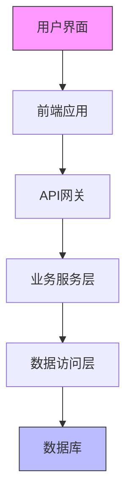
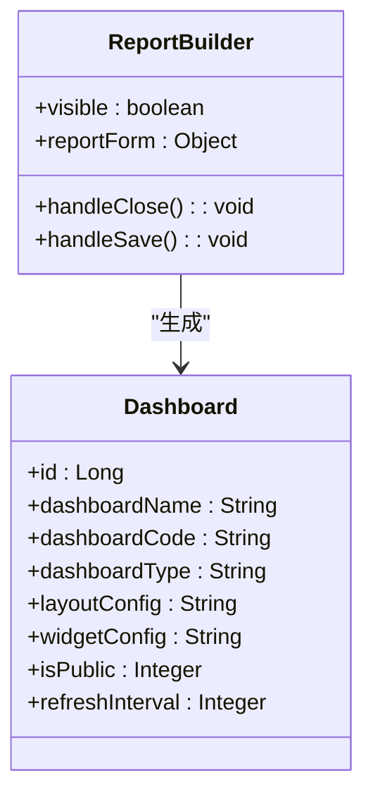
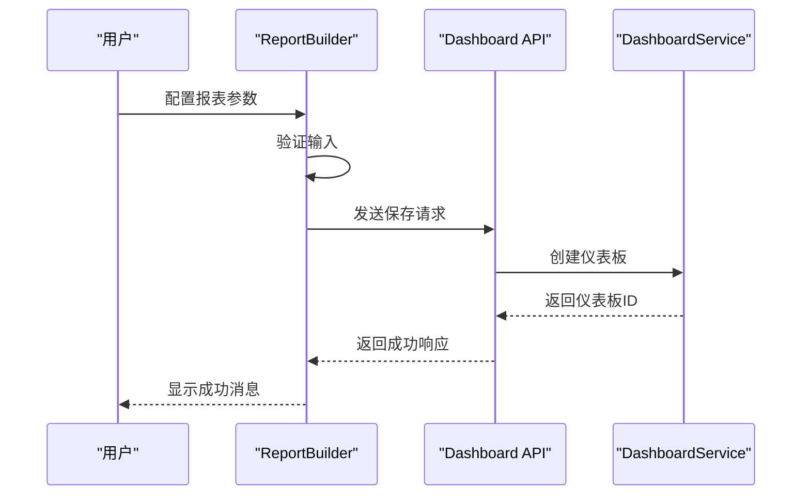
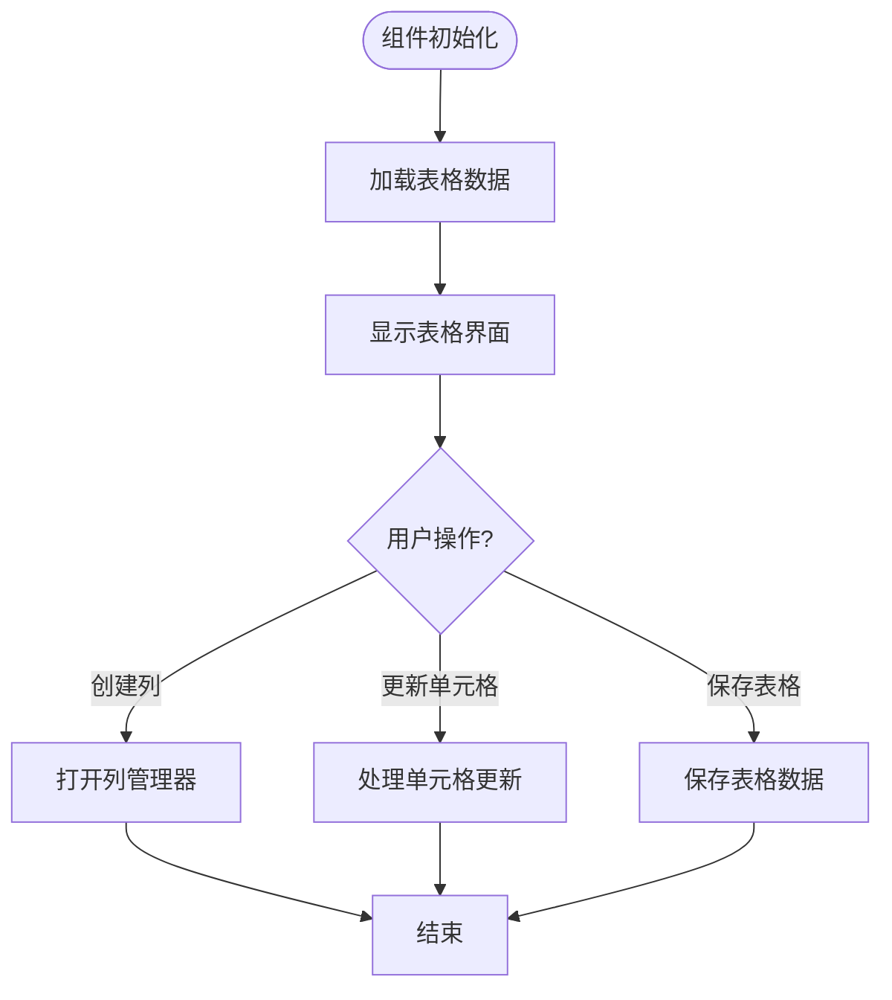
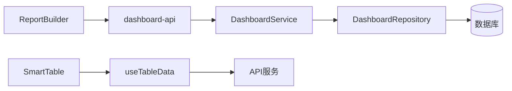

# 仪表盘配置构建器

<cite>
**本文档引用的文件**   
- [ReportBuilder.vue](file://07-frontend/src/pages/analytics/components/ReportBuilder.vue)
- [quotation.ts](file://07-frontend/src/api/quotation.ts)
- [sales.ts](file://07-frontend/src/api/sales.ts)
- [Dashboard.java](file://08-backend/src/main/java/com/enterprise/brain/modules/analytics/entity/Dashboard.java)
- [DashboardDTO.java](file://08-backend/src/main/java/com/enterprise/brain/modules/analytics/dto/DashboardDTO.java)
- [dashboard-api.js](file://07-frontend/src/services/api/dashboard-api.js)
- [SmartTable.vue](file://07-frontend/src/components/smart-table/SmartTable.vue)
- [BackupService.js](file://07-frontend/src/services/BackupService.js)
- [permission.js](file://07-frontend/src/permission.js)
</cite>

## 目录
1. [引言](#引言)
2. [项目结构](#项目结构)
3. [核心组件](#核心组件)
4. [架构概述](#架构概述)
5. [详细组件分析](#详细组件分析)
6. [依赖分析](#依赖分析)
7. [性能考虑](#性能考虑)
8. [故障排除指南](#故障排除指南)
9. [结论](#结论)

## 引言
本项目是一个企业级智能系统，旨在提供全面的业务管理功能。系统通过可视化仪表盘构建工具（ReportBuilder.vue）为用户提供拖拽式组件选择、图表类型预览、数据源绑定和样式配置面板等功能，支持非技术人员快速搭建个性化仪表盘。系统集成了销售、报价、库存等多个业务模块，并通过完善的权限控制系统确保数据安全。

## 项目结构
项目采用前后端分离架构，前端基于Vue.js框架构建，后端使用Java Spring Boot技术栈。前端代码位于`07-frontend`目录，包含组件、页面、API服务等模块；后端代码位于`08-backend`目录，采用模块化设计，包含分析、财务、系统管理等功能模块。

```mermaid
graph TB
subgraph "前端"
A[07-frontend]
A --> B[src]
B --> C[components]
B --> D[pages]
B --> E[api]
B --> F[services]
end
subgraph "后端"
G[08-backend]
G --> H[src/main/java]
H --> I[modules]
I --> J[analytics]
I --> K[finance]
I --> L[system]
end
A < --> G
```

**图表来源**
- [ReportBuilder.vue](file://07-frontend/src/pages/analytics/components/ReportBuilder.vue)
- [Dashboard.java](file://08-backend/src/main/java/com/enterprise/brain/modules/analytics/entity/Dashboard.java)

**章节来源**
- [ReportBuilder.vue](file://07-frontend/src/pages/analytics/components/ReportBuilder.vue)
- [Dashboard.java](file://08-backend/src/main/java/com/enterprise/brain/modules/analytics/entity/Dashboard.java)

## 核心组件
系统的核心组件包括可视化仪表盘构建器（ReportBuilder.vue）、智能表格（SmartTable.vue）和数据备份服务（BackupService.js）。这些组件共同构成了系统的数据可视化和管理基础。

**章节来源**
- [ReportBuilder.vue](file://07-frontend/src/pages/analytics/components/ReportBuilder.vue)
- [SmartTable.vue](file://07-frontend/src/components/smart-table/SmartTable.vue)
- [BackupService.js](file://07-frontend/src/services/BackupService.js)

## 架构概述
系统采用分层架构设计，从前端用户界面到后端数据存储，各层职责分明。前端负责用户交互和数据展示，后端提供业务逻辑处理和数据访问服务。



**图表来源**
- [ReportBuilder.vue](file://07-frontend/src/pages/analytics/components/ReportBuilder.vue)
- [DashboardDTO.java](file://08-backend/src/main/java/com/enterprise/brain/modules/analytics/dto/DashboardDTO.java)

## 详细组件分析

### 报表构建器分析
报表构建器（ReportBuilder.vue）是系统的核心功能之一，提供直观的表单界面让用户配置报表的各项参数。

#### 对象导向组件：


**图表来源**
- [ReportBuilder.vue](file://07-frontend/src/pages/analytics/components/ReportBuilder.vue)
- [Dashboard.java](file://08-backend/src/main/java/com/enterprise/brain/modules/analytics/entity/Dashboard.java)

#### API/服务组件：


**图表来源**
- [ReportBuilder.vue](file://07-frontend/src/pages/analytics/components/ReportBuilder.vue)
- [dashboard-api.js](file://07-frontend/src/services/api/dashboard-api.js)

### 智能表格分析
智能表格组件提供灵活的数据展示和编辑功能，支持列管理、数据保存等操作。



**图表来源**
- [SmartTable.vue](file://07-frontend/src/components/smart-table/SmartTable.vue)

**章节来源**
- [SmartTable.vue](file://07-frontend/src/components/smart-table/SmartTable.vue)

## 依赖分析
系统各组件之间存在明确的依赖关系，前端组件依赖API服务，API服务依赖后端业务逻辑。



**图表来源**
- [ReportBuilder.vue](file://07-frontend/src/pages/analytics/components/ReportBuilder.vue)
- [dashboard-api.js](file://07-frontend/src/services/api/dashboard-api.js)

**章节来源**
- [ReportBuilder.vue](file://07-frontend/src/pages/analytics/components/ReportBuilder.vue)
- [dashboard-api.js](file://07-frontend/src/services/api/dashboard-api.js)

## 性能考虑
系统在设计时充分考虑了性能因素，通过合理的数据缓存、异步处理和分页加载等机制确保用户体验。

## 故障排除指南
当遇到问题时，可以检查以下方面：
- 确认用户权限是否足够
- 检查网络连接是否正常
- 验证数据源配置是否正确
- 查看浏览器控制台是否有错误信息

**章节来源**
- [permission.js](file://07-frontend/src/permission.js)
- [dashboard-api.js](file://07-frontend/src/services/api/dashboard-api.js)

## 结论
本系统通过现代化的技术架构和用户友好的设计，为用户提供强大的数据可视化和分析能力。报表构建器作为核心功能，使得非技术人员也能轻松创建个性化的仪表盘，大大提升了工作效率。