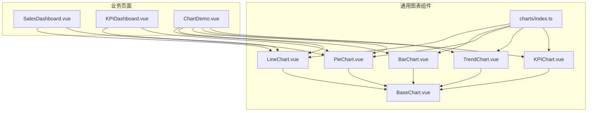
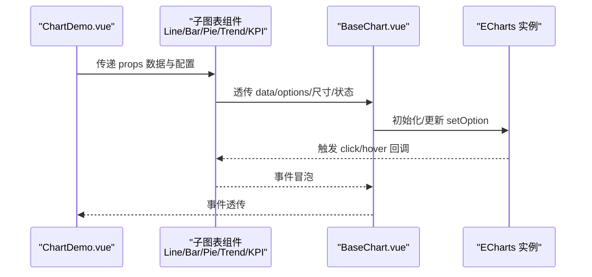
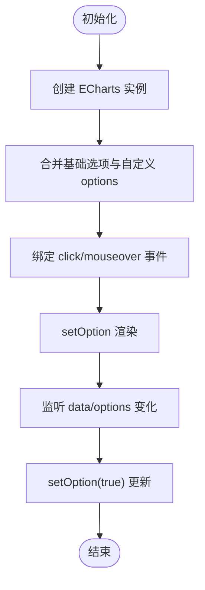
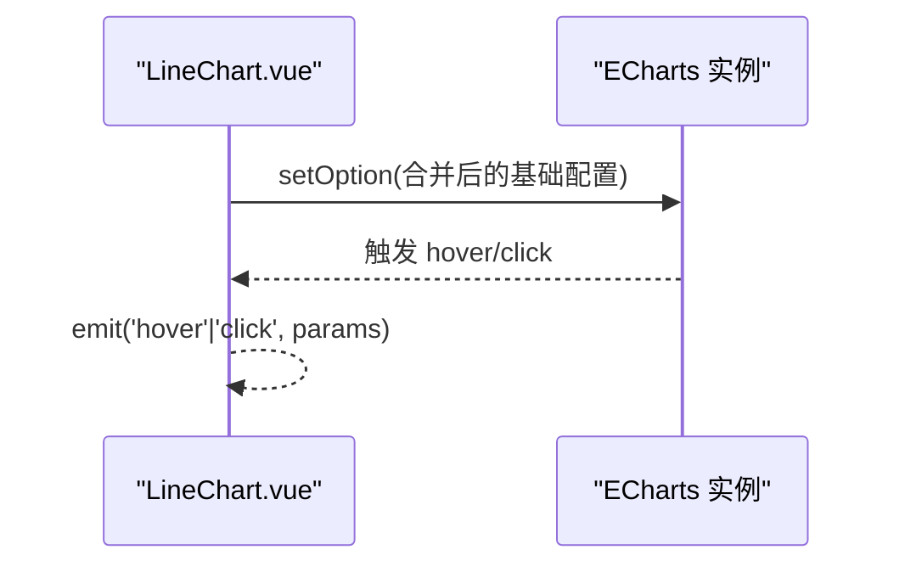
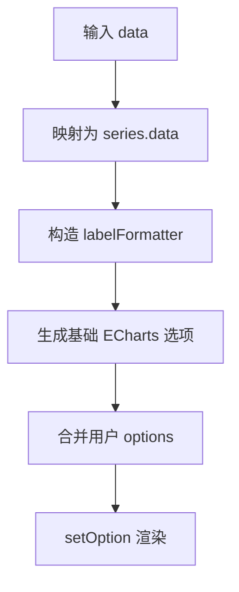
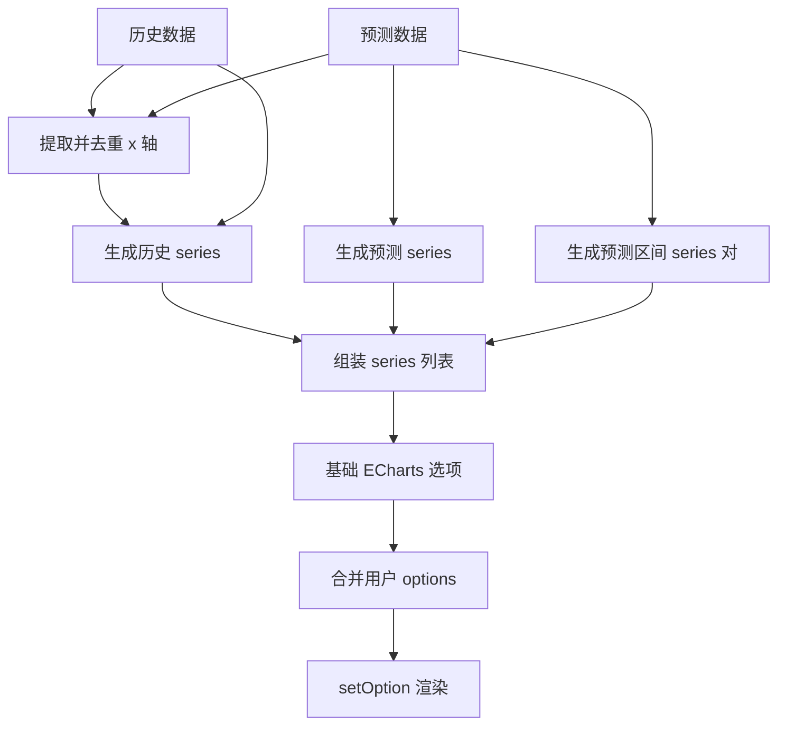
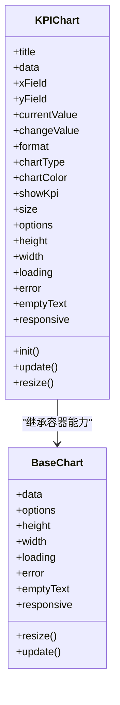
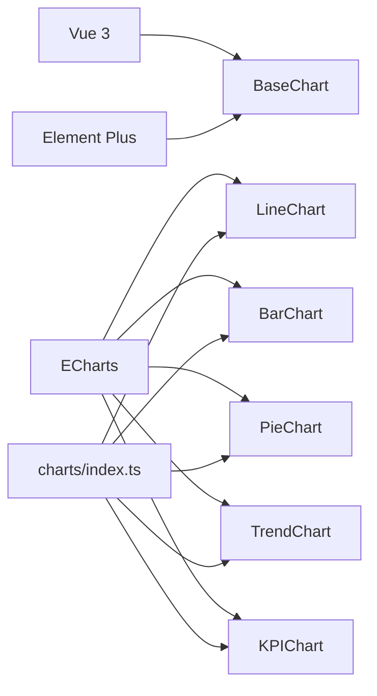

# 具体图表类型

<cite>
**本文档引用的文件**
- [BarChart.vue](file://07-frontend/src/components/common/charts/BarChart.vue)
- [LineChart.vue](file://07-frontend/src/components/common/charts/LineChart.vue)
- [PieChart.vue](file://07-frontend/src/components/common/charts/PieChart.vue)
- [TrendChart.vue](file://07-frontend/src/components/common/charts/TrendChart.vue)
- [KPIChart.vue](file://07-frontend/src/components/common/charts/KPIChart.vue)
- [BaseChart.vue](file://07-frontend/src/components/common/charts/BaseChart.vue)
- [index.ts](file://07-frontend/src/components/common/charts/index.ts)
- [ChartDemo.vue](file://07-frontend/src/components/common/charts/ChartDemo.vue)
- [SalesDashboard.vue](file://07-frontend/src/pages/dashboard/SalesDashboard.vue)
- [KPIDashboard.vue](file://07-frontend/src/pages/dashboard/KPIDashboard.vue)
- [package.json](file://07-frontend/package.json)
- [vite.config.js](file://07-frontend/vite.config.js)
</cite>

## 目录
1. [简介](#简介)
2. [项目结构](#项目结构)
3. [核心组件](#核心组件)
4. [架构总览](#架构总览)
5. [详细组件分析](#详细组件分析)
6. [依赖关系分析](#依赖关系分析)
7. [性能考量](#性能考量)
8. [故障排查指南](#故障排查指南)
9. [结论](#结论)
10. [附录](#附录)

## 简介
本文件聚焦于前端通用图表组件库中四类具体图表：柱状图（BarChart）、折线图（LineChart）、饼图（PieChart）与趋势图（TrendChart）。文档从系统架构、组件职责、数据流与处理逻辑、事件回调与样式定制、到业务场景应用（销售、库存等）进行深入解析，并提供可视化图示帮助理解。

## 项目结构
图表组件位于前端工程的通用组件目录下，采用“基座组件 + 业务子组件”的分层设计：
- 基座组件 BaseChart 提供统一的加载、错误、空状态与响应式处理；
- 业务子组件分别封装 ECharts 的不同图表类型与业务特性；
- ChartDemo.vue 展示各组件的典型用法与参数组合；
- Dashboard 相关页面演示图表在仪表盘中的集成方式。

**图表来源**
- [BaseChart.vue](file://07-frontend/src/components/common/charts/BaseChart.vue#L1-L153)
- [LineChart.vue](file://07-frontend/src/components/common/charts/LineChart.vue#L1-L249)
- [BarChart.vue](file://07-frontend/src/components/common/charts/BarChart.vue#L1-L256)
- [PieChart.vue](file://07-frontend/src/components/common/charts/PieChart.vue#L1-L263)
- [TrendChart.vue](file://07-frontend/src/components/common/charts/TrendChart.vue#L1-L407)
- [KPIChart.vue](file://07-frontend/src/components/common/charts/KPIChart.vue#L1-L441)
- [index.ts](file://07-frontend/src/components/common/charts/index.ts#L1-L34)
- [ChartDemo.vue](file://07-frontend/src/components/common/charts/ChartDemo.vue#L1-L335)
- [SalesDashboard.vue](file://07-frontend/src/pages/dashboard/SalesDashboard.vue#L1-L185)
- [KPIDashboard.vue](file://07-frontend/src/pages/dashboard/KPIDashboard.vue#L1-L185)

**章节来源**
- [index.ts](file://07-frontend/src/components/common/charts/index.ts#L1-L34)
- [BaseChart.vue](file://07-frontend/src/components/common/charts/BaseChart.vue#L1-L153)
- [ChartDemo.vue](file://07-frontend/src/components/common/charts/ChartDemo.vue#L1-L335)

## 核心组件
- BaseChart：负责容器渲染、状态管理（加载/错误/空）、响应式监听与事件透传，子组件通过 ref 与 slot 注入图表实例。
- LineChart：面向时间序列趋势分析，支持平滑曲线、多系列、数值标签、多轴扩展点位。
- BarChart：面向分类数据对比，支持堆叠、分组、横向布局、数值标签。
- PieChart：面向比例分析，支持环形图、内外半径控制、百分比与数值标签、图例位置。
- TrendChart：面向指标变化趋势展示，内置预测区间与预测线，支持同比/环比计算扩展点位。
- KPIChart：在折线/面积图基础上叠加主指标与变化率展示，适合关键指标看板。

**章节来源**
- [BaseChart.vue](file://07-frontend/src/components/common/charts/BaseChart.vue#L1-L153)
- [LineChart.vue](file://07-frontend/src/components/common/charts/LineChart.vue#L1-L249)
- [BarChart.vue](file://07-frontend/src/components/common/charts/BarChart.vue#L1-L256)
- [PieChart.vue](file://07-frontend/src/components/common/charts/PieChart.vue#L1-L263)
- [TrendChart.vue](file://07-frontend/src/components/common/charts/TrendChart.vue#L1-L407)
- [KPIChart.vue](file://07-frontend/src/components/common/charts/KPIChart.vue#L1-L441)

## 架构总览
图表组件基于 Vue 3 Composition API 与 ECharts 实现，统一由 BaseChart 承载生命周期与事件，子组件仅关注自身配置与数据映射。

**图表来源**
- [ChartDemo.vue](file://07-frontend/src/components/common/charts/ChartDemo.vue#L1-L335)
- [BaseChart.vue](file://07-frontend/src/components/common/charts/BaseChart.vue#L1-L153)
- [LineChart.vue](file://07-frontend/src/components/common/charts/LineChart.vue#L1-L249)
- [BarChart.vue](file://07-frontend/src/components/common/charts/BarChart.vue#L1-L256)
- [PieChart.vue](file://07-frontend/src/components/common/charts/PieChart.vue#L1-L263)
- [TrendChart.vue](file://07-frontend/src/components/common/charts/TrendChart.vue#L1-L407)
- [KPIChart.vue](file://07-frontend/src/components/common/charts/KPIChart.vue#L1-L441)

## 详细组件分析

### BarChart（柱状图）
- 功能定位：分类数据对比，支持堆叠、分组、横向布局、数值标签。
- 关键 props
  - data：数组，每项包含 xField 字段与多个 yFields 中的 field 字段
  - xField：字符串，默认 “name”，用于分类轴
  - yFields：数组，元素含 field、name、color
  - isStacked：布尔，是否堆叠
  - isHorizontal：布尔，是否横向
  - showValue/showLegend/showGrid：显示控制
  - options：透传给 ECharts 的自定义配置
- 事件回调：click、hover、reload、dataChange
- 样式定制：通过 yFields.color 控制系列颜色；isHorizontal 控制条形宽度与标签位置；grid/legend/tooltip 等由 options 覆盖
- 数据处理：根据 xField 提取分类轴数据；按 yFields 映射 series 数据；支持横向模式下的坐标轴互换
- 性能要点：watch 深比较 data 与 options，按需 setOption；销毁旧实例避免内存泄漏

**图表来源**
- [BarChart.vue](file://07-frontend/src/components/common/charts/BarChart.vue#L1-L256)

**章节来源**
- [BarChart.vue](file://07-frontend/src/components/common/charts/BarChart.vue#L1-L256)

### LineChart（折线图）
- 功能定位：时间序列趋势分析，支持平滑曲线、多系列、数值标签
- 关键 props
  - data：数组，每项包含 xField（默认 “date”）与多个 yFields.field
  - yFields：数组，元素含 field、name、color
  - showValue/showLegend/showGrid：显示控制
  - options：透传 ECharts 配置
- 事件回调：click、hover、reload、dataChange
- 数据处理：xAxis 使用类别轴，yAxis 数值轴；series 默认平滑曲线；可按 yFields 生成多条折线
- 样式定制：series.itemStyle/lineStyle/color；label 显示位置；tooltip 样式

**图表来源**
- [LineChart.vue](file://07-frontend/src/components/common/charts/LineChart.vue#L1-L249)

**章节来源**
- [LineChart.vue](file://07-frontend/src/components/common/charts/LineChart.vue#L1-L249)

### PieChart（饼图）
- 功能定位：比例分析，支持环形图、内外半径、百分比与数值标签、图例位置
- 关键 props
  - data：数组，每项包含 nameField（默认 “name”）与 valueField（默认 “value”）
  - nameField/valueField：名称与数值字段
  - type：'pie' 或 'ring'（环形）
  - innerRadius/outerRadius：环形内外半径
  - showValue/showPercent/showLegend：显示控制
  - legendPosition：'top'/'bottom'/'left'/'right'
  - options：透传 ECharts 配置
- 事件回调：click、hover、reload、dataChange
- 数据处理：将原始数据映射为 series.data；labelFormatter 支持同时显示数值与百分比
- 样式定制：radius 根据 type 决定；label/labelLine 控制标签显示；emphasis focus 效果

**图表来源**
- [PieChart.vue](file://07-frontend/src/components/common/charts/PieChart.vue#L1-L263)

**章节来源**
- [PieChart.vue](file://07-frontend/src/components/common/charts/PieChart.vue#L1-L263)

### TrendChart（趋势图）
- 功能定位：指标变化趋势展示，内置预测区间与预测线，适合销售/库存预测场景
- 关键 props
  - data：历史数据（包含 xField 与 yFields.field）
  - forecastData：预测数据（包含 xField、forecastField、upper/lower 区间字段）
  - showForecastRange：是否显示预测区间
  - forecastField/forecastName/forecastColor：预测系列字段与样式
  - smooth：是否平滑曲线
  - 其他：yFields、showValue、showLegend、showGrid、options 等
- 事件回调：click、hover、reload、dataChange
- 数据处理：合并历史与预测的 x 轴去重并排序；series 生成历史线与预测线；预测区间通过两个堆叠 series 实现渐变填充
- 样式定制：预测线虚线样式；区间透明度与渐变色；tooltip 与 legend

**图表来源**
- [TrendChart.vue](file://07-frontend/src/components/common/charts/TrendChart.vue#L1-L407)

**章节来源**
- [TrendChart.vue](file://07-frontend/src/components/common/charts/TrendChart.vue#L1-L407)

### KPIChart（关键指标图）
- 功能定位：在折线/面积图上方叠加主指标与变化率，适合仪表盘关键指标展示
- 关键 props
  - title/currentValue/changeValue/format：标题、当前值、变化率、格式化类型
  - data/xField/yField：趋势数据源
  - chartType：'line' 或 'area'
  - chartColor：图表颜色
  - showKpi/size：是否显示 KPI 主指标与尺寸（small/medium/large）
  - options/height/width/loading/error/emptyText/responsive：同 BaseChart
- 事件回调：click、hover、reload、dataChange
- 数据处理：根据 size 与 showKpi 动态计算图表高度；series 类型与面积填充由 chartType 控制
- 样式定制：主指标字号随 size 变化；正负变化颜色区分；tooltip 与 grid 样式

**图表来源**
- [KPIChart.vue](file://07-frontend/src/components/common/charts/KPIChart.vue#L1-L441)
- [BaseChart.vue](file://07-frontend/src/components/common/charts/BaseChart.vue#L1-L153)

**章节来源**
- [KPIChart.vue](file://07-frontend/src/components/common/charts/KPIChart.vue#L1-L441)

## 依赖关系分析
- 运行时依赖：Vue 3、Element Plus、ECharts（通过 npm 安装）
- 构建工具：Vite，配置了别名与本地代理
- 组件导出：通过 charts/index.ts 统一导出，便于按需引入或批量导入

**图表来源**
- [package.json](file://07-frontend/package.json#L1-L34)
- [vite.config.js](file://07-frontend/vite.config.js#L1-L27)
- [index.ts](file://07-frontend/src/components/common/charts/index.ts#L1-L34)

**章节来源**
- [package.json](file://07-frontend/package.json#L1-L34)
- [vite.config.js](file://07-frontend/vite.config.js#L1-L27)
- [index.ts](file://07-frontend/src/components/common/charts/index.ts#L1-L34)

## 性能考量
- 数据更新策略：子组件对 data 与 options 进行深监听，仅在变更时调用 setOption(true) 进行增量更新，避免全量重建
- 实例生命周期：每次初始化前销毁旧实例，防止内存泄漏；BaseChart 在卸载时清理 ResizeObserver
- 响应式适配：BaseChart 监听容器尺寸变化，触发 resize 以保证图表自适应
- 渲染优化：BaseChart 在 loading/error/empty 三种状态下采用骨架屏/空状态/内容区三态渲染，减少无效 DOM 操作

[本节为通用性能建议，不直接分析具体文件]

## 故障排查指南
- 加载/错误/空状态
  - BaseChart 提供 loading、error、emptyText 三态，错误时提供“重新加载”按钮；空数据时显示空状态
- 事件调试
  - 子组件通过 ECharts 实例绑定 click/hover，再向上冒泡；可在父组件监听并打印参数确认交互是否生效
- 尺寸问题
  - 若图表不随容器变化，请检查 BaseChart 的响应式开关与容器高度设置；必要时手动调用 resize
- 数据格式
  - 确保 data 结构与 props 中的 xField/yFields.field/valueField/nameField 对齐；TrendChart 需要 forecastData 的 upper/lower 字段以启用预测区间
- 颜色与样式
  - 通过 yFields[].color 或 options.itemStyle/lineStyle/areaStyle 自定义；PieChart 的 ring 类型需正确设置内外半径

**章节来源**
- [BaseChart.vue](file://07-frontend/src/components/common/charts/BaseChart.vue#L1-L153)
- [LineChart.vue](file://07-frontend/src/components/common/charts/LineChart.vue#L1-L249)
- [BarChart.vue](file://07-frontend/src/components/common/charts/BarChart.vue#L1-L256)
- [PieChart.vue](file://07-frontend/src/components/common/charts/PieChart.vue#L1-L263)
- [TrendChart.vue](file://07-frontend/src/components/common/charts/TrendChart.vue#L1-L407)
- [KPIChart.vue](file://07-frontend/src/components/common/charts/KPIChart.vue#L1-L441)

## 结论
该图表体系以 BaseChart 为统一容器，子组件围绕各自业务场景封装 ECharts 配置与数据映射，形成高内聚、低耦合的组件生态。通过统一的事件与状态管理，能够快速在销售、库存等业务场景中落地可视化看板与趋势分析。

[本节为总结性内容，不直接分析具体文件]

## 附录

### 业务场景与使用建议
- 销售场景
  - 时间趋势：使用 LineChart 展示月度/季度销售额、利润走势
  - 分类对比：使用 BarChart 展示不同渠道/产品类别的销量对比，支持堆叠与横向布局
  - 结构占比：使用 PieChart 展示渠道/地区销售占比，环形图提升信息密度
  - 指标看板：使用 KPIChart 展示当月销售额与同比变化，搭配折线/面积图趋势
  - 预测分析：使用 TrendChart 展示历史与预测区间，辅助库存与销售计划
- 库存场景
  - 用 BarChart 展示不同仓库/品类的库存水平，支持横向布局便于阅读长名称
  - 用 PieChart 展示库存结构（在途/可用/冻结），结合百分比与数值标签
  - 用 TrendChart 展示库存周转率或缺货率趋势，预测区间辅助安全库存设定

### 示例页面参考
- ChartDemo.vue：集中展示了各组件的典型用法与参数组合，可直接参考其 props 与事件绑定方式
- SalesDashboard.vue 与 KPIDashboard.vue：演示图表在仪表盘中的布局与集成思路

**章节来源**
- [ChartDemo.vue](file://07-frontend/src/components/common/charts/ChartDemo.vue#L1-L335)
- [SalesDashboard.vue](file://07-frontend/src/pages/dashboard/SalesDashboard.vue#L1-L185)
- [KPIDashboard.vue](file://07-frontend/src/pages/dashboard/KPIDashboard.vue#L1-L185)