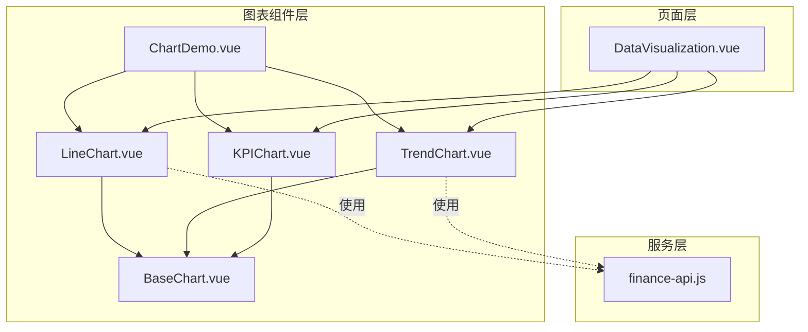
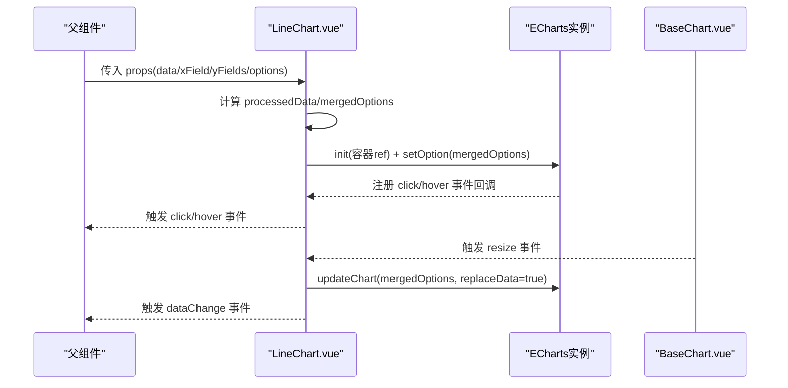
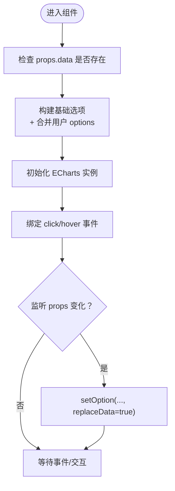
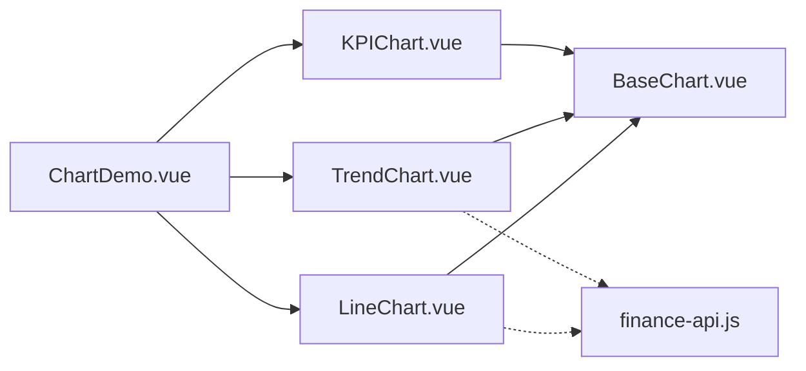

# 折线图 (LineChart)

<cite>
**本文引用的文件**
- [LineChart.vue](file://07-frontend/src/components/common/charts/LineChart.vue)
- [BaseChart.vue](file://07-frontend/src/components/common/charts/BaseChart.vue)
- [index.ts](file://07-frontend/src/components/common/charts/index.ts)
- [ChartDemo.vue](file://07-frontend/src/components/common/charts/ChartDemo.vue)
- [TrendChart.vue](file://07-frontend/src/components/common/charts/TrendChart.vue)
- [KPIChart.vue](file://07-frontend/src/components/common/charts/KPIChart.vue)
- [finance-api.js](file://07-frontend/src/services/api/finance-api.js)
- [DataVisualization.vue](file://07-frontend/src/pages/analytics/components/DataVisualization.vue)
</cite>

## 目录
1. [简介](#简介)
2. [项目结构](#项目结构)
3. [核心组件](#核心组件)
4. [架构总览](#架构总览)
5. [详细组件分析](#详细组件分析)
6. [依赖关系分析](#依赖关系分析)
7. [性能考量](#性能考量)
8. [故障排查指南](#故障排查指南)
9. [结论](#结论)
10. [附录](#附录)

## 简介
本技术文档围绕前端通用图表库中的折线图组件（LineChart）展开，重点阐述其在时间序列趋势分析中的应用，包括：
- 区域填充（area fill）：通过面积样式实现趋势区域可视化
- 平滑曲线（smooth curve）：启用曲线平滑以提升视觉连续性
- 多Y轴（dual/multiple axes）：当前实现为多系列（多条折线），未直接使用ECharts双Y轴配置；可通过扩展实现
- 时间轴数据处理机制：基于xField字段进行时间序列映射
- 与后端数据接口（finance-api.js）的集成方式：通过API服务封装与组件解耦
- 组件配置项（data、xField、yFields、smooth等）与事件（click、hover、reload、dataChange）的使用方法
- 业务场景示例：订单量趋势、财务指标变化等
- 性能调优（数据采样）、异常处理（空数据、时间格式错误）、响应式设计最佳实践

## 项目结构
LineChart位于通用图表组件目录，采用“容器组件 + 基础容器”的分层设计：
- LineChart.vue：折线图容器，负责数据处理、ECharts初始化与事件绑定
- BaseChart.vue：基础容器，统一处理加载、错误、空数据状态与响应式尺寸
- index.ts：图表组件导出入口
- ChartDemo.vue：示例页面，演示多系列折线图、点击事件等
- TrendChart.vue：趋势图（含预测区间），展示面积样式与多系列组合
- KPIChart.vue：KPI趋势图，展示面积样式与平滑曲线
- finance-api.js：财务相关API封装，用于时间序列数据拉取
- DataVisualization.vue：通用数据可视化页面，展示ECharts选项合并与多系列配置

**图表来源**
- [LineChart.vue](file://07-frontend/src/components/common/charts/LineChart.vue#L1-L249)
- [BaseChart.vue](file://07-frontend/src/components/common/charts/BaseChart.vue#L1-L153)
- [index.ts](file://07-frontend/src/components/common/charts/index.ts#L1-L34)
- [ChartDemo.vue](file://07-frontend/src/components/common/charts/ChartDemo.vue#L1-L335)
- [TrendChart.vue](file://07-frontend/src/components/common/charts/TrendChart.vue#L1-L407)
- [KPIChart.vue](file://07-frontend/src/components/common/charts/KPIChart.vue#L1-L260)
- [finance-api.js](file://07-frontend/src/services/api/finance-api.js#L1-L296)
- [DataVisualization.vue](file://07-frontend/src/pages/analytics/components/DataVisualization.vue#L50-L182)

**章节来源**
- [index.ts](file://07-frontend/src/components/common/charts/index.ts#L1-L34)

## 核心组件
- LineChart：基于ECharts的折线图容器，支持多系列、平滑曲线、标签显示、点击与悬停事件、响应式与尺寸更新
- BaseChart：统一的图表容器，提供加载、错误、空数据状态，以及ResizeObserver响应式监听与事件透传
- TrendChart：在LineChart基础上扩展预测区间（面积样式）与预测线（虚线）
- KPIChart：展示面积样式与平滑曲线的KPI趋势图
- ChartDemo：示例页面，演示多系列折线图、点击事件、刷新逻辑

**章节来源**
- [LineChart.vue](file://07-frontend/src/components/common/charts/LineChart.vue#L1-L249)
- [BaseChart.vue](file://07-frontend/src/components/common/charts/BaseChart.vue#L1-L153)
- [TrendChart.vue](file://07-frontend/src/components/common/charts/TrendChart.vue#L1-L407)
- [KPIChart.vue](file://07-frontend/src/components/common/charts/KPIChart.vue#L1-L260)
- [ChartDemo.vue](file://07-frontend/src/components/common/charts/ChartDemo.vue#L1-L335)

## 架构总览
LineChart的运行时架构如下：
- 数据输入：props.data（数组）、xField（时间字段名）、yFields（系列配置数组）
- 计算选项：mergedOptions（合并基础选项与用户自定义options）
- ECharts实例：通过ref初始化，设置选项并绑定事件
- 事件流：click、hover、reload、resize、dataChange
- 响应式：BaseChart监听容器尺寸变化，触发resize事件

**图表来源**
- [LineChart.vue](file://07-frontend/src/components/common/charts/LineChart.vue#L110-L206)
- [BaseChart.vue](file://07-frontend/src/components/common/charts/BaseChart.vue#L66-L123)

## 详细组件分析

### 折线图（LineChart）实现要点
- 数据处理
  - processedData：直接使用props.data，确保非空安全
  - xField：用于xAxis的数据映射
  - yFields：数组，每项包含field、name、color，生成多系列
- 选项合并
  - 默认基础选项：tooltip、legend、grid、xAxis（category）、yAxis（value）、series（line，smooth=true，带圆点标记）
  - 用户自定义options通过浅合并覆盖默认值
- 事件绑定
  - click：透传ECharts参数
  - hover：透传ECharts参数
  - reload：由BaseChart触发，用于重新加载数据
  - dataChange：由BaseChart触发，传递最新data与options
- 响应式与更新
  - 监听props.data与props.options深变化，调用setOption(replaceData=true)更新
  - onMounted后初始化实例，nextTick保证DOM就绪
- 暴露方法
  - init、update、resize供父组件调用

**图表来源**
- [LineChart.vue](file://07-frontend/src/components/common/charts/LineChart.vue#L110-L206)

**章节来源**
- [LineChart.vue](file://07-frontend/src/components/common/charts/LineChart.vue#L1-L249)

### 区域填充（Area Fill）与平滑曲线（Smooth Curve）
- 平滑曲线：series配置中启用smooth，使折线更平滑连续
- 区域填充：参考KPIChart的areaStyle实现，可在LineChart的series中添加areaStyle以实现区域填充
- 示例路径
  - KPIChart的areaStyle配置位置：[KPIChart.vue](file://07-frontend/src/components/common/charts/KPIChart.vue#L232-L250)
  - LineChart的series配置位置：[LineChart.vue](file://07-frontend/src/components/common/charts/LineChart.vue#L147-L165)

**章节来源**
- [KPIChart.vue](file://07-frontend/src/components/common/charts/KPIChart.vue#L174-L260)
- [LineChart.vue](file://07-frontend/src/components/common/charts/LineChart.vue#L115-L170)

### 多Y轴（Dual/Multiple Axes）
- 当前实现：LineChart通过yFields生成多系列（多条折线），共享同一yAxis
- 多Y轴扩展建议：在mergedOptions中增加yAxis数组，并为series指定yAxisIndex
- 参考实现
  - TrendChart的多系列与面积样式：[TrendChart.vue](file://07-frontend/src/components/common/charts/TrendChart.vue#L159-L208)
  - DataVisualization的多系列配置：[DataVisualization.vue](file://07-frontend/src/pages/analytics/components/DataVisualization.vue#L50-L105)

**章节来源**
- [TrendChart.vue](file://07-frontend/src/components/common/charts/TrendChart.vue#L159-L208)
- [DataVisualization.vue](file://07-frontend/src/pages/analytics/components/DataVisualization.vue#L50-L105)

### 时间轴数据处理机制
- xField：指定时间字段名，默认为date
- processedData：直接使用props.data
- mergedOptions中xAxis.type为category，data来自processedData[xField]
- 建议：后端返回的时间字段需与xField一致，前端无需额外转换

**章节来源**
- [LineChart.vue](file://07-frontend/src/components/common/charts/LineChart.vue#L110-L146)

### 与后端数据接口（finance-api.js）的集成
- 通过finance-api.js封装的接口获取财务时间序列数据
- 典型流程：父组件发起API请求 -> 接收数据 -> 传入LineChart.data
- 示例接口（节选）
  - 获取财务报表数据：[finance-api.js](file://07-frontend/src/services/api/finance-api.js#L110-L140)
  - 获取收支明细：[finance-api.js](file://07-frontend/src/services/api/finance-api.js#L143-L173)
- 在ChartDemo中演示了数据刷新与事件处理：
  - 刷新方法：[ChartDemo.vue](file://07-frontend/src/components/common/charts/ChartDemo.vue#L218-L241)
  - 点击事件处理：[ChartDemo.vue](file://07-frontend/src/components/common/charts/ChartDemo.vue#L259-L263)

**章节来源**
- [finance-api.js](file://07-frontend/src/services/api/finance-api.js#L110-L140)
- [ChartDemo.vue](file://07-frontend/src/components/common/charts/ChartDemo.vue#L218-L263)

### 组件配置项与事件
- 配置项（props）
  - data：数组，时间序列数据
  - xField：字符串，时间字段名，默认date
  - yFields：数组，每项包含field、name、color
  - options：对象，ECharts选项合并
  - height/width/responsive：尺寸与响应式
  - showLegend/showGrid/showValue：显示控制
- 事件（emits）
  - reload：触发重新加载
  - click/hover：点击与悬停事件
  - dataChange：数据变化事件
- 参考路径
  - 配置项定义：[LineChart.vue](file://07-frontend/src/components/common/charts/LineChart.vue#L27-L100)
  - 事件定义：[LineChart.vue](file://07-frontend/src/components/common/charts/LineChart.vue#L102-L104)
  - BaseChart事件透传：[BaseChart.vue](file://07-frontend/src/components/common/charts/BaseChart.vue#L66-L68)

**章节来源**
- [LineChart.vue](file://07-frontend/src/components/common/charts/LineChart.vue#L27-L104)
- [BaseChart.vue](file://07-frontend/src/components/common/charts/BaseChart.vue#L66-L68)

### 业务场景示例
- 订单量趋势
  - 使用多系列yFields展示不同维度（如销售额、利润）
  - 示例路径：[ChartDemo.vue](file://07-frontend/src/components/common/charts/ChartDemo.vue#L12-L25)
- 财务指标变化
  - 结合finance-api.js获取报表数据，传入LineChart
  - 示例路径：[finance-api.js](file://07-frontend/src/services/api/finance-api.js#L110-L140)
- 趋势预测（结合TrendChart）
  - 历史数据与预测区间（面积样式）组合
  - 示例路径：[TrendChart.vue](file://07-frontend/src/components/common/charts/TrendChart.vue#L159-L208)

**章节来源**
- [ChartDemo.vue](file://07-frontend/src/components/common/charts/ChartDemo.vue#L12-L25)
- [finance-api.js](file://07-frontend/src/services/api/finance-api.js#L110-L140)
- [TrendChart.vue](file://07-frontend/src/components/common/charts/TrendChart.vue#L159-L208)

## 依赖关系分析
- 组件依赖
  - LineChart依赖BaseChart（容器与响应式）
  - ChartDemo依赖LineChart、TrendChart、KPIChart
  - TrendChart与KPIChart均依赖BaseChart
- 外部依赖
  - ECharts：用于渲染图表
  - Element Plus：用于加载骨架屏、空状态与按钮
- 服务依赖
  - finance-api.js：提供财务相关接口

**图表来源**
- [LineChart.vue](file://07-frontend/src/components/common/charts/LineChart.vue#L1-L249)
- [BaseChart.vue](file://07-frontend/src/components/common/charts/BaseChart.vue#L1-L153)
- [ChartDemo.vue](file://07-frontend/src/components/common/charts/ChartDemo.vue#L1-L120)
- [TrendChart.vue](file://07-frontend/src/components/common/charts/TrendChart.vue#L1-L120)
- [KPIChart.vue](file://07-frontend/src/components/common/charts/KPIChart.vue#L1-L120)
- [finance-api.js](file://07-frontend/src/services/api/finance-api.js#L1-L296)

**章节来源**
- [index.ts](file://07-frontend/src/components/common/charts/index.ts#L1-L34)

## 性能考量
- 数据采样（时间序列大数据集）
  - 建议：按可视窗口或固定周期对历史数据进行降采样，减少series.data长度
  - 参考思路：在父组件或工具函数中对data按xField进行聚合（如按周/月聚合）
- 选项更新策略
  - 使用setOption(..., replaceData=true)仅替换数据，避免重建实例
  - 监听props深变化，减少不必要的重绘
- 渲染优化
  - 关闭不必要的标签与阴影效果
  - 控制series数量与标记大小
- 响应式与重绘
  - 使用BaseChart的ResizeObserver，避免频繁手动resize
- 参考实现
  - 数据可视化页面的多系列配置与更新：[DataVisualization.vue](file://07-frontend/src/pages/analytics/components/DataVisualization.vue#L50-L105)

**章节来源**
- [LineChart.vue](file://07-frontend/src/components/common/charts/LineChart.vue#L202-L206)
- [DataVisualization.vue](file://07-frontend/src/pages/analytics/components/DataVisualization.vue#L50-L105)

## 故障排查指南
- 空数据
  - BaseChart会根据data长度判断是否显示空状态，父组件可设置emptyText
  - 参考：[BaseChart.vue](file://07-frontend/src/components/common/charts/BaseChart.vue#L1-L20)
- 时间格式错误
  - 确保后端返回的xField对应字段为可排序的时间字符串或数字
  - 若出现乱序，可在父组件预处理data再传入
- 图表不显示或空白
  - 检查height/width与容器尺寸，确保BaseChart容器有明确尺寸
  - 确认initChart在onMounted后执行且容器ref已挂载
- 事件未触发
  - 确认父组件正确绑定click/hover事件
  - 确认ECharts实例已初始化并setOption
- 颜色与样式问题
  - yFields中未提供color时使用默认色板，可自定义options覆盖

**章节来源**
- [BaseChart.vue](file://07-frontend/src/components/common/charts/BaseChart.vue#L1-L153)
- [LineChart.vue](file://07-frontend/src/components/common/charts/LineChart.vue#L178-L206)

## 结论
LineChart在时间序列趋势分析中具备良好的扩展性与复用性：
- 多系列与平滑曲线满足常见趋势展示需求
- 区域填充可通过series.areaStyle实现
- 多Y轴可通过series.yAxisIndex扩展
- 与finance-api.js的集成清晰，便于接入财务类时间序列数据
- 建议在大数据场景下引入数据采样与选项更新策略，以提升性能与用户体验

## 附录
- 快速上手
  - 引入组件：[index.ts](file://07-frontend/src/components/common/charts/index.ts#L1-L34)
  - 示例页面：[ChartDemo.vue](file://07-frontend/src/components/common/charts/ChartDemo.vue#L1-L120)
- 相关组件参考
  - 趋势图（含预测区间）：[TrendChart.vue](file://07-frontend/src/components/common/charts/TrendChart.vue#L1-L208)
  - KPI图（面积样式）：[KPIChart.vue](file://07-frontend/src/components/common/charts/KPIChart.vue#L174-L260)
  - 通用数据可视化页面：[DataVisualization.vue](file://07-frontend/src/pages/analytics/components/DataVisualization.vue#L50-L105)