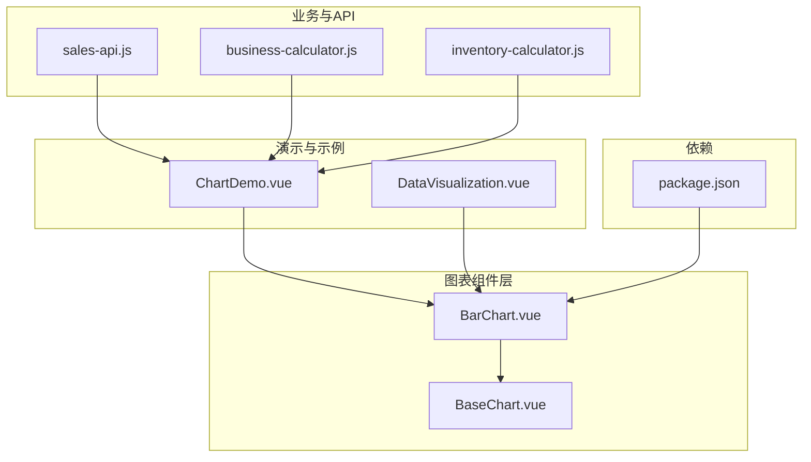
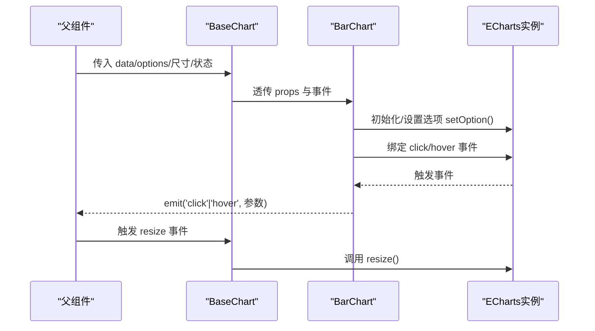
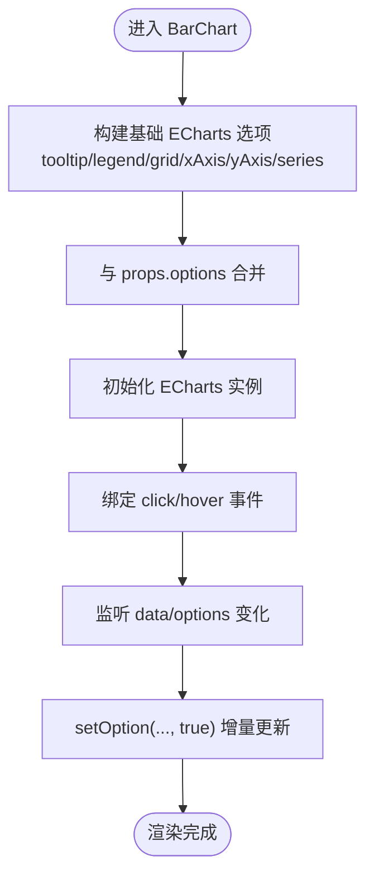
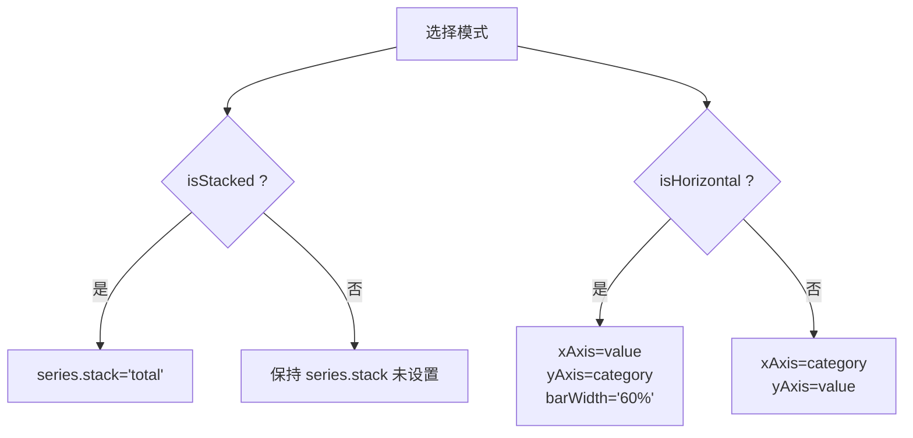
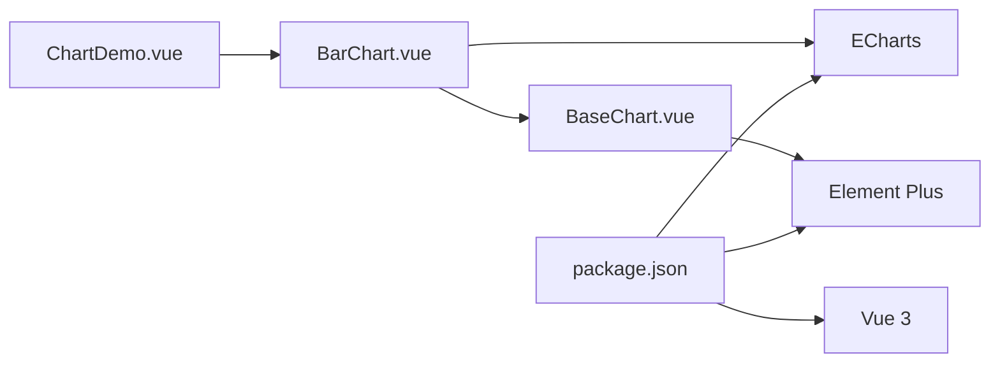

# 柱状图 (BarChart)

<cite>
**本文引用的文件**
- [BarChart.vue](file://07-frontend/src/components/common/charts/BarChart.vue)
- [BaseChart.vue](file://07-frontend/src/components/common/charts/BaseChart.vue)
- [index.ts](file://07-frontend/src/components/common/charts/index.ts)
- [ChartDemo.vue](file://07-frontend/src/components/common/charts/ChartDemo.vue)
- [sales-api.js](file://07-frontend/src/services/api/sales-api.js)
- [DataVisualization.vue](file://07-frontend/src/pages/analytics/components/DataVisualization.vue)
- [business-calculator.js](file://07-frontend/src/utils/business/business-calculator.js)
- [inventory-calculator.js](file://07-frontend/src/utils/business/inventory-calculator.js)
- [package.json](file://07-frontend/package.json)
</cite>

## 目录
1. [简介](#简介)
2. [项目结构](#项目结构)
3. [核心组件](#核心组件)
4. [架构总览](#架构总览)
5. [详细组件分析](#详细组件分析)
6. [依赖关系分析](#依赖关系分析)
7. [性能考虑](#性能考虑)
8. [故障排查指南](#故障排查指南)
9. [结论](#结论)
10. [附录：使用示例与最佳实践](#附录使用示例与最佳实践)

## 简介
本技术文档围绕前端通用图表库中的 BarChart 组件展开，系统阐述其在“分类数据对比”场景下的实现机制与业务应用。重点覆盖以下方面：
- 三种模式：堆叠（stacked）、分组（grouped）、横向布局（horizontal）的实现原理与适用场景
- 核心 props 的数据结构与配置方式：data、y-fields、colors 等
- 事件回调参数格式：click、hover
- 与后端 API 的对接模式：以 sales-api.js 为例
- 实际业务场景：销售业绩对比、库存分布分析
- 性能优化建议（大数据量渲染）
- 常见问题排查（标签重叠、坐标轴错位）

## 项目结构
BarChart 位于通用图表组件目录，采用“容器组件 + 基础容器”的分层设计：
- BarChart.vue：具体柱状图实现，基于 ECharts 进行渲染与交互
- BaseChart.vue：通用图表容器，负责加载/错误/空状态、响应式尺寸与事件透传
- index.ts：图表组件导出入口
- ChartDemo.vue：演示组件，展示 BarChart 的典型用法
- DataVisualization.vue：通用可视化组件，用于理解 ECharts 选项合并与更新策略
- sales-api.js：销售相关 API 示例，展示如何从后端获取数据并喂给 BarChart
- business-calculator.js、inventory-calculator.js：业务计算工具，可辅助生成或转换数据
- package.json：依赖声明，确认 ECharts 的使用

**图表来源**
- [BarChart.vue](file://07-frontend/src/components/common/charts/BarChart.vue#L1-L256)
- [BaseChart.vue](file://07-frontend/src/components/common/charts/BaseChart.vue#L1-L153)
- [index.ts](file://07-frontend/src/components/common/charts/index.ts#L1-L34)
- [ChartDemo.vue](file://07-frontend/src/components/common/charts/ChartDemo.vue#L1-L335)
- [DataVisualization.vue](file://07-frontend/src/pages/analytics/components/DataVisualization.vue#L1-L222)
- [sales-api.js](file://07-frontend/src/services/api/sales-api.js#L1-L346)
- [business-calculator.js](file://07-frontend/src/utils/business/business-calculator.js#L1-L575)
- [inventory-calculator.js](file://07-frontend/src/utils/business/inventory-calculator.js#L184-L636)
- [package.json](file://07-frontend/package.json#L1-L34)

**章节来源**
- [BarChart.vue](file://07-frontend/src/components/common/charts/BarChart.vue#L1-L256)
- [BaseChart.vue](file://07-frontend/src/components/common/charts/BaseChart.vue#L1-L153)
- [index.ts](file://07-frontend/src/components/common/charts/index.ts#L1-L34)

## 核心组件
- BarChart.vue
  - 负责将 props 转换为 ECharts 选项，初始化/更新图表实例，并绑定 click/hover 事件
  - 支持堆叠、分组、横向布局三种模式
  - 通过 BaseChart 容器实现统一的加载/错误/空状态与响应式行为
- BaseChart.vue
  - 提供容器样式与状态管理，监听容器尺寸变化并通过 ResizeObserver 自适应
  - 透传 reload、resize、dataChange 事件，便于上层控制
- index.ts
  - 统一导出图表组件，便于按需引入或批量导入

**章节来源**
- [BarChart.vue](file://07-frontend/src/components/common/charts/BarChart.vue#L1-L256)
- [BaseChart.vue](file://07-frontend/src/components/common/charts/BaseChart.vue#L1-L153)
- [index.ts](file://07-frontend/src/components/common/charts/index.ts#L1-L34)

## 架构总览
下面的序列图展示了 BarChart 的渲染与交互流程，以及与 BaseChart 的协作关系。

**图表来源**
- [BarChart.vue](file://07-frontend/src/components/common/charts/BarChart.vue#L180-L249)
- [BaseChart.vue](file://07-frontend/src/components/common/charts/BaseChart.vue#L66-L123)

## 详细组件分析

### BarChart 组件实现机制
- 数据输入与预处理
  - data：数组，每项为一个分类对象；默认为空数组
  - xField：字符串，指定分类字段名，默认为 'name'
  - yFields：数组，每项包含 field、name、color；默认包含一个基础字段
- 模式开关
  - isStacked：布尔，开启堆叠模式，series 的 stack 属性设为 'total'
  - isHorizontal：布尔，开启横向布局，x/y 轴互换，barWidth 调整
- 选项合并
  - mergedOptions：先构建基础 ECharts 选项，再与 props.options 深度合并
  - tooltip、legend、grid、xAxis、yAxis、series 等均在此处生成
- 事件绑定
  - click：透传 ECharts 的 params（包含 name、value、seriesName 等）
  - hover：透传 ECharts 的 params
- 生命周期与更新
  - onMounted：初始化 ECharts 实例并 setOption
  - watch([data,options])：深度监听，调用 setOption(true) 进行增量更新
  - expose：暴露 init/update/resize 方法供父组件调用

**图表来源**
- [BarChart.vue](file://07-frontend/src/components/common/charts/BarChart.vue#L120-L177)
- [BarChart.vue](file://07-frontend/src/components/common/charts/BarChart.vue#L185-L213)

**章节来源**
- [BarChart.vue](file://07-frontend/src/components/common/charts/BarChart.vue#L27-L110)
- [BarChart.vue](file://07-frontend/src/components/common/charts/BarChart.vue#L120-L177)
- [BarChart.vue](file://07-frontend/src/components/common/charts/BarChart.vue#L185-L249)

### 三种模式的实现原理
- 堆叠（stacked）
  - 通过 series.stack 设为 'total' 实现多系列在同一分类上的堆叠
  - 适合“总量构成”分析，例如不同渠道/产品的累计贡献
- 分组（grouped）
  - 默认不设置 stack，多个 series 并排显示
  - 适合“多维度对比”，例如不同月份各产品销量对比
- 横向布局（horizontal）
  - xAxis.type='value'，yAxis.type='category'，并交换数据映射
  - 适合类别较多、标签较长的场景，减少旋转角度与重叠

**图表来源**
- [BarChart.vue](file://07-frontend/src/components/common/charts/BarChart.vue#L144-L172)

**章节来源**
- [BarChart.vue](file://07-frontend/src/components/common/charts/BarChart.vue#L144-L172)

### 核心 props 数据结构与配置
- data
  - 类型：Array
  - 结构：数组项为对象，键由 xField 指定作为分类名，yFields[].field 对应数值
  - 示例路径：[ChartDemo.vue](file://07-frontend/src/components/common/charts/ChartDemo.vue#L176-L183)
- yFields
  - 类型：Array
  - 结构：每项包含 field（数据字段）、name（系列名称）、color（颜色）
  - 默认值：包含一个基础字段
  - 示例路径：[ChartDemo.vue](file://07-frontend/src/components/common/charts/ChartDemo.vue#L33-L39)
- colors
  - 通过 yFields[].color 指定；若未提供则使用默认色板
  - 默认色板：数组循环取值
  - 示例路径：[BarChart.vue](file://07-frontend/src/components/common/charts/BarChart.vue#L180-L183)
- options
  - 类型：Object
  - 作用：与基础选项深度合并，覆盖默认行为
  - 示例路径：[BarChart.vue](file://07-frontend/src/components/common/charts/BarChart.vue#L175-L177)

**章节来源**
- [BarChart.vue](file://07-frontend/src/components/common/charts/BarChart.vue#L27-L110)
- [BarChart.vue](file://07-frontend/src/components/common/charts/BarChart.vue#L180-L183)
- [ChartDemo.vue](file://07-frontend/src/components/common/charts/ChartDemo.vue#L33-L39)
- [ChartDemo.vue](file://07-frontend/src/components/common/charts/ChartDemo.vue#L176-L183)

### 事件回调参数格式
- click
  - 参数：ECharts 事件参数对象，包含 name、value、seriesName 等
  - 触发时机：鼠标点击柱子
  - 示例路径：[BarChart.vue](file://07-frontend/src/components/common/charts/BarChart.vue#L200-L206)
- hover
  - 参数：ECharts 事件参数对象，包含 name、value、seriesName 等
  - 触发时机：鼠标悬停
  - 示例路径：[BarChart.vue](file://07-frontend/src/components/common/charts/BarChart.vue#L204-L206)
- dataChange
  - 参数：{ data, options }，用于 BaseChart 内部更新
  - 触发时机：BaseChart 监听容器尺寸变化时触发
  - 示例路径：[BaseChart.vue](file://07-frontend/src/components/common/charts/BaseChart.vue#L91-L93)

**章节来源**
- [BarChart.vue](file://07-frontend/src/components/common/charts/BarChart.vue#L200-L206)
- [BaseChart.vue](file://07-frontend/src/components/common/charts/BaseChart.vue#L66-L93)

### 与后端 API 的对接模式
- 数据来源
  - 通过 sales-api.js 的接口获取销售相关统计数据（如趋势、排行、客户/产品分析）
  - 将返回数据转换为 BarChart 所需的 data 结构（分类字段 + 数值字段）
- 典型流程
  - 调用 salesApi.statistics.getTrend/getRanking/getCustomerAnalysis 等接口
  - 将返回的列表映射为 data 数组，其中分类字段由 xField 指定，数值字段由 yFields[].field 指定
  - 将 data 与 yFields 传入 BarChart
- 示例参考
  - ChartDemo 中的 refreshBarChart 生成模拟数据，可类比真实 API 返回数据的结构
  - 示例路径：[sales-api.js](file://07-frontend/src/services/api/sales-api.js#L253-L284)，[ChartDemo.vue](file://07-frontend/src/components/common/charts/ChartDemo.vue#L223-L226)

**章节来源**
- [sales-api.js](file://07-frontend/src/services/api/sales-api.js#L253-L284)
- [ChartDemo.vue](file://07-frontend/src/components/common/charts/ChartDemo.vue#L223-L226)

### 业务应用场景与示例思路
- 销售业绩对比
  - 场景：按月/季度对比实际销量与目标销量
  - 数据结构：data 为月份列表，yFields 包含 actual/target 两个系列
  - 参考路径：[ChartDemo.vue](file://07-frontend/src/components/common/charts/ChartDemo.vue#L176-L183)
- 库存分布分析
  - 场景：按老化区间或 ABC 分类展示库存价值分布
  - 数据结构：data 为区间/分类名称列表，yFields 为对应数值
  - 可借助 inventory-calculator.js 的分析结果进行数据准备
  - 参考路径：[inventory-calculator.js](file://07-frontend/src/utils/business/inventory-calculator.js#L184-L636)

**章节来源**
- [ChartDemo.vue](file://07-frontend/src/components/common/charts/ChartDemo.vue#L176-L183)
- [inventory-calculator.js](file://07-frontend/src/utils/business/inventory-calculator.js#L184-L636)

## 依赖关系分析
- 外部依赖
  - ECharts：用于渲染与交互
  - Element Plus：提供 UI 组件（如按钮、空状态、骨架屏）
  - Vue 3：组合式 API、响应式系统
- 内部依赖
  - BarChart 依赖 BaseChart 提供统一容器能力
  - index.ts 汇总导出，便于按需引入

**图表来源**
- [package.json](file://07-frontend/package.json#L1-L34)
- [BarChart.vue](file://07-frontend/src/components/common/charts/BarChart.vue#L1-L256)
- [BaseChart.vue](file://07-frontend/src/components/common/charts/BaseChart.vue#L1-L153)
- [ChartDemo.vue](file://07-frontend/src/components/common/charts/ChartDemo.vue#L1-L335)

**章节来源**
- [package.json](file://07-frontend/package.json#L1-L34)
- [index.ts](file://07-frontend/src/components/common/charts/index.ts#L1-L34)

## 性能考虑
- 大数据量渲染
  - 使用 setOption(true) 进行增量更新，避免销毁重建实例
  - 合理设置 barWidth/auto 或 '60%'，减少密集柱子的绘制开销
  - 控制标签显示数量（showValue），避免过多 label 引起重绘
  - 对于超长分类列表，优先考虑横向布局（isHorizontal）以减少旋转与重叠
- 事件绑定
  - click/hover 事件仅在必要时绑定，避免重复绑定
  - 在高频交互场景下，可对回调函数做节流/防抖处理（可在父组件实现）
- 响应式与尺寸
  - BaseChart 通过 ResizeObserver 监听容器尺寸变化，减少手动 resize 调用次数
  - 在大量图表同时渲染时，建议延迟初始化或懒加载

[本节为通用性能建议，无需特定文件引用]

## 故障排查指南
- 标签重叠
  - 现象：x 轴标签旋转后仍重叠
  - 解决：适当增大容器宽度、启用横向布局（isHorizontal）、减少分类数量或缩短标签长度
  - 参考路径：[BarChart.vue](file://07-frontend/src/components/common/charts/BarChart.vue#L149-L151)
- 坐标轴错位
  - 现象：数值轴与柱子不对齐
  - 解决：检查 series.data 与 xAxis.data 的长度与顺序是否一致；确保 data 为非空且结构正确
  - 参考路径：[BarChart.vue](file://07-frontend/src/components/common/charts/BarChart.vue#L144-L172)
- 事件无效
  - 现象：click/hover 不触发
  - 解决：确认已正确绑定事件；检查 ECharts 实例是否已初始化；确保未被外部遮挡
  - 参考路径：[BarChart.vue](file://07-frontend/src/components/common/charts/BarChart.vue#L196-L206)
- 加载/错误/空状态异常
  - 现象：加载中、错误、空数据状态不显示
  - 解决：检查 BaseChart 的 props（loading/error/emptyText）与 data 长度；确认 hasData 计算逻辑
  - 参考路径：[BaseChart.vue](file://07-frontend/src/components/common/charts/BaseChart.vue#L75-L77)

**章节来源**
- [BarChart.vue](file://07-frontend/src/components/common/charts/BarChart.vue#L144-L172)
- [BarChart.vue](file://07-frontend/src/components/common/charts/BarChart.vue#L196-L206)
- [BaseChart.vue](file://07-frontend/src/components/common/charts/BaseChart.vue#L75-L77)

## 结论
BarChart 通过“容器组件 + 基础容器”的架构，实现了对 ECharts 的轻量封装与统一管理。其三大模式（堆叠、分组、横向）覆盖了常见的分类数据对比需求；通过 yFields 与 options 的灵活配置，能够快速适配多种业务场景。配合 BaseChart 的加载/错误/空状态与响应式能力，以及与 sales-api.js 的对接模式，可高效构建销售与库存分析类图表。

[本节为总结性内容，无需特定文件引用]

## 附录：使用示例与最佳实践

### 使用示例（销售业绩对比）
- 数据准备
  - 从 salesApi.statistics.getTrend/getRanking 获取数据
  - 将返回列表映射为 data，yFields 包含 actual/target
- 组件使用
  - 在页面中引入 BarChart，并传入 data、yFields、isStacked/isHorizontal、showValue 等
  - 监听 click/hover 事件，进行钻取或提示
- 参考路径
  - [sales-api.js](file://07-frontend/src/services/api/sales-api.js#L253-L284)
  - [ChartDemo.vue](file://07-frontend/src/components/common/charts/ChartDemo.vue#L223-L226)
  - [BarChart.vue](file://07-frontend/src/components/common/charts/BarChart.vue#L27-L110)

### 使用示例（库存分布分析）
- 数据准备
  - 使用 inventory-calculator.js 的分析结果（如 ABC 分类、老化区间）
  - 将分类名称与对应价值/数量映射为 data
- 组件使用
  - 选择横向布局（isHorizontal）以提升可读性
  - 通过 yFields[].color 为不同类别设置颜色
- 参考路径
  - [inventory-calculator.js](file://07-frontend/src/utils/business/inventory-calculator.js#L184-L636)
  - [BarChart.vue](file://07-frontend/src/components/common/charts/BarChart.vue#L144-L172)

### 最佳实践
- 数据结构一致性：确保 data 中每项包含 xField 与 yFields[].field
- 颜色与系列命名：yFields[].name 用于图例与 tooltip，建议语义化
- 选项合并：优先通过 options 覆盖默认行为，避免直接修改基础选项
- 性能优化：大数据量时启用横向布局、减少标签、使用增量更新
- 事件处理：在父组件中根据 params 进行二次处理（如跳转、弹窗）

[本节为实践建议，无需特定文件引用]