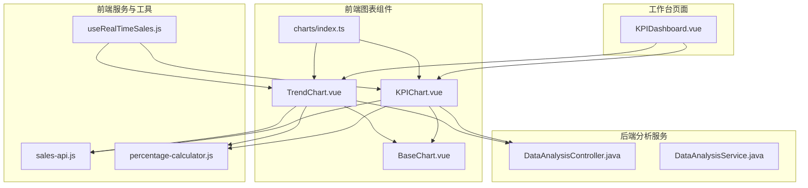
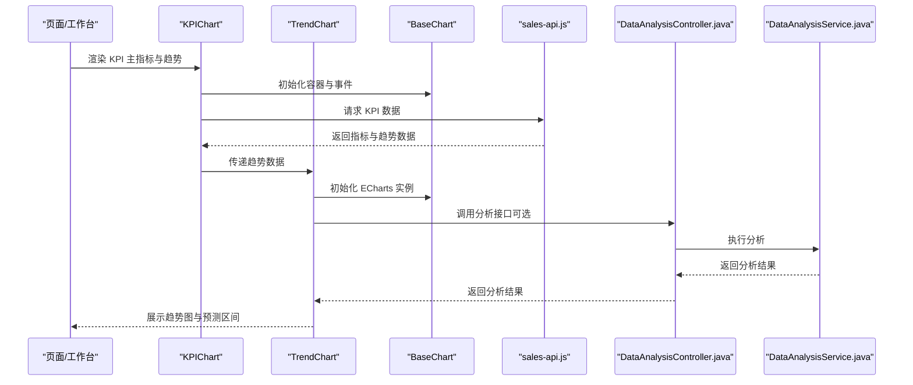
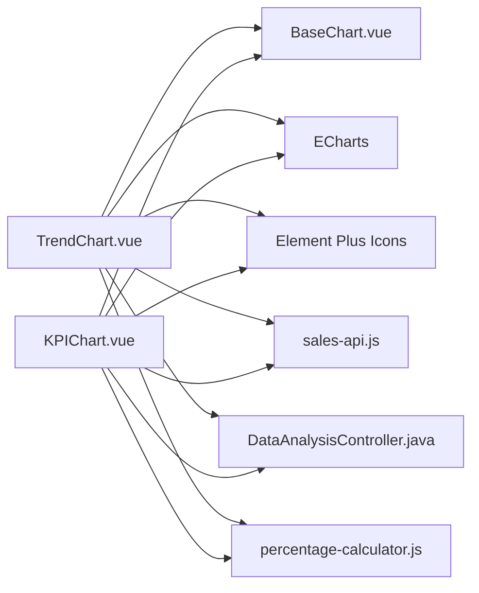

# 趋势图 (TrendChart)

<cite>
**本文引用的文件**
- [TrendChart.vue](file://07-frontend/src/components/common/charts/TrendChart.vue)
- [BaseChart.vue](file://07-frontend/src/components/common/charts/BaseChart.vue)
- [index.ts](file://07-frontend/src/components/common/charts/index.ts)
- [KPIChart.vue](file://07-frontend/src/components/common/charts/KPIChart.vue)
- [DataAnalysisController.java](file://08-backend/src/main/java/com/enterprise/brain/modules/analytics/controller/DataAnalysisController.java)
- [DataAnalysisService.java](file://08-backend/src/main/java/com/enterprise/brain/modules/analytics/service/DataAnalysisService.java)
- [sales-api.js](file://07-frontend/src/services/api/sales-api.js)
- [useRealTimeSales.js](file://07-frontend/src/composables/useRealTimeSales.js)
- [KPIDashboard.vue](file://07-frontend/src/pages/dashboard/KPIDashboard.vue)
- [percentage-calculator.js](file://07-frontend/src/utils/calculation/percentage-calculator.js)
</cite>

## 目录
1. [简介](#简介)
2. [项目结构](#项目结构)
3. [核心组件](#核心组件)
4. [架构总览](#架构总览)
5. [详细组件分析](#详细组件分析)
6. [依赖关系分析](#依赖关系分析)
7. [性能考量](#性能考量)
8. [故障排查指南](#故障排查指南)
9. [结论](#结论)
10. [附录](#附录)

## 简介
本文件面向系统开发中的趋势图（TrendChart）组件，聚焦其在关键绩效指标（KPI）趋势监控中的专用能力。文档重点阐述：
- 内置同比（Year-on-Year）与环比（Month-on-Month）计算引擎的实现思路与配置驱动方式（value-field、time-field、comparison-type）。
- 可视化元素（增长箭头、百分比变化标签）的渲染机制与交互事件。
- 与后端分析服务（DataAnalysisController）对接的实践路径与数据刷新策略。
- 在 KPI 工作台（KPIDashboard）中的集成应用与最佳实践。

## 项目结构
TrendChart 位于前端通用图表组件目录，作为可复用的可视化组件，配合 BaseChart 提供统一的图表容器与生命周期管理；同时与 KPIChart 协作，在 KPI 工作台中展示主指标与趋势联动。

**图表来源**
- [TrendChart.vue](file://07-frontend/src/components/common/charts/TrendChart.vue#L1-L407)
- [BaseChart.vue](file://07-frontend/src/components/common/charts/BaseChart.vue#L1-L153)
- [KPIChart.vue](file://07-frontend/src/components/common/charts/KPIChart.vue#L1-L326)
- [index.ts](file://07-frontend/src/components/common/charts/index.ts#L1-L34)
- [sales-api.js](file://07-frontend/src/services/api/sales-api.js#L1-L346)
- [useRealTimeSales.js](file://07-frontend/src/composables/useRealTimeSales.js#L83-L309)
- [percentage-calculator.js](file://07-frontend/src/utils/calculation/percentage-calculator.js#L1-L359)
- [DataAnalysisController.java](file://08-backend/src/main/java/com/enterprise/brain/modules/analytics/controller/DataAnalysisController.java#L1-L40)
- [DataAnalysisService.java](file://08-backend/src/main/java/com/enterprise/brain/modules/analytics/service/DataAnalysisService.java#L1-L54)
- [KPIDashboard.vue](file://07-frontend/src/pages/dashboard/KPIDashboard.vue#L1-L185)

**章节来源**
- [TrendChart.vue](file://07-frontend/src/components/common/charts/TrendChart.vue#L1-L407)
- [BaseChart.vue](file://07-frontend/src/components/common/charts/BaseChart.vue#L1-L153)
- [index.ts](file://07-frontend/src/components/common/charts/index.ts#L1-L34)

## 核心组件
- TrendChart：基于 ECharts 的趋势图组件，支持实际值与预测值叠加、预测区间可视化、平滑曲线、数值标签、响应式布局与事件透传。
- BaseChart：图表容器，负责加载态、错误态、空数据态、尺寸变更与子组件暴露方法。
- KPIChart：在趋势图上方展示主指标与变化箭头/百分比标签，便于 KPI 监控场景。
- charts/index.ts：导出 TrendChart、KPIChart 等组件，便于统一引入与按需使用。

**章节来源**
- [TrendChart.vue](file://07-frontend/src/components/common/charts/TrendChart.vue#L1-L407)
- [BaseChart.vue](file://07-frontend/src/components/common/charts/BaseChart.vue#L1-L153)
- [KPIChart.vue](file://07-frontend/src/components/common/charts/KPIChart.vue#L1-L326)
- [index.ts](file://07-frontend/src/components/common/charts/index.ts#L1-L34)

## 架构总览
TrendChart 与 KPIChart 共享 BaseChart 容器，二者均通过 ECharts 初始化与更新，支持响应式与事件冒泡。后端通过 DataAnalysisController 提供分析接口，前端通过 sales-api.js 与业务 API 交互，结合 useRealTimeSales.js 实现数据刷新与 WebSocket 心跳。

**图表来源**
- [KPIChart.vue](file://07-frontend/src/components/common/charts/KPIChart.vue#L1-L326)
- [TrendChart.vue](file://07-frontend/src/components/common/charts/TrendChart.vue#L1-L407)
- [BaseChart.vue](file://07-frontend/src/components/common/charts/BaseChart.vue#L1-L153)
- [sales-api.js](file://07-frontend/src/services/api/sales-api.js#L1-L346)
- [DataAnalysisController.java](file://08-backend/src/main/java/com/enterprise/brain/modules/analytics/controller/DataAnalysisController.java#L1-L40)
- [DataAnalysisService.java](file://08-backend/src/main/java/com/enterprise/brain/modules/analytics/service/DataAnalysisService.java#L1-L54)

## 详细组件分析

### TrendChart 组件
- 功能要点
  - 数据源：支持实际值数组与预测值数组，X 轴字段与 Y 字段可配置，支持多系列绘制。
  - 预测区间：当开启预测区间时，以渐变色区域展示上下界，增强不确定性可视化。
  - 视觉样式：平滑曲线、数值标签、图例、网格、响应式布局。
  - 事件：点击、悬停、重载、尺寸变更事件向上透传。
  - 生命周期：初始化 ECharts 实例、销毁旧实例、动态更新选项、响应窗口尺寸变化。

- 配置项（props）
  - data：实际值数组（含时间字段与数值字段）
  - forecastData：预测值数组（含预测值、上限、下限字段）
  - xField：X 轴字段名（默认日期）
  - yFields：Y 轴系列配置（字段名、名称、颜色）
  - forecastField、forecastName、forecastColor：预测系列配置
  - showForecastRange：是否显示预测区间
  - forecastUpperField、forecastLowerField：预测区间上下限字段
  - options：ECharts 选项合并
  - showLegend、showGrid、showValue、smooth：通用可视化开关
  - height、width、responsive、loading、error、emptyText：容器与状态控制

- 可视化元素
  - 增长箭头与百分比变化标签：TrendChart 本身不直接渲染箭头与标签，但可通过外部组件（如 KPIChart）在趋势图上方叠加主指标与变化信息。
  - 预测区间：通过两个堆叠面积系列模拟置信带，增强趋势解读。

- 与后端对接
  - TrendChart 通过 API 服务获取数据；若需分析服务，可在调用链中增加对 DataAnalysisController 的请求，由后端返回同比/环比口径的分析结果。

- 数据刷新策略
  - 基于 BaseChart 的 reload 事件与 ResizeObserver 自适应；结合 useRealTimeSales.js 的 WebSocket 心跳与指数退避重连策略，实现近实时数据刷新。

**章节来源**
- [TrendChart.vue](file://07-frontend/src/components/common/charts/TrendChart.vue#L1-L407)
- [BaseChart.vue](file://07-frontend/src/components/common/charts/BaseChart.vue#L1-L153)
- [useRealTimeSales.js](file://07-frontend/src/composables/useRealTimeSales.js#L83-L309)

### KPIChart 组件（与趋势图联动）
- 功能要点
  - 在趋势图上方展示主指标值与变化箭头/百分比标签，支持多种格式化（货币、百分比、数值、小数）。
  - 与 TrendChart 共用 BaseChart 容器，实现主指标与趋势的协同展示。

- 可视化元素
  - 主指标值：formatKpiValue 支持多种格式。
  - 变化箭头与百分比：根据 changeValue 正负显示不同图标与样式，compareText 支持自定义对比文案。

- 与 TrendChart 的关系
  - KPIChart 通过 chartContainerRef 与 TrendChart 共享同一容器区域，实现“主指标 + 趋势”的组合布局。

**章节来源**
- [KPIChart.vue](file://07-frontend/src/components/common/charts/KPIChart.vue#L1-L326)

### 后端分析服务对接
- DataAnalysisController 提供数据分析与销售趋势分析接口，前端可调用以获取同比/环比口径的分析结果，再交由 TrendChart/KPIChart 渲染。

- 接口要点
  - POST /analytics/analysis/execute：执行通用数据分析
  - POST /analytics/analysis/sales-trend：销售趋势分析

- 前端调用建议
  - 在 TrendChart/KPIChart 初始化或数据刷新时，调用上述接口，传入时间范围、指标维度等参数，接收分析结果后更新图表数据。

**章节来源**
- [DataAnalysisController.java](file://08-backend/src/main/java/com/enterprise/brain/modules/analytics/controller/DataAnalysisController.java#L1-L40)
- [DataAnalysisService.java](file://08-backend/src/main/java/com/enterprise/brain/modules/analytics/service/DataAnalysisService.java#L1-L54)

### 配置驱动的同比/环比计算引擎
- 现状说明
  - TrendChart 本身不内置同比/环比计算逻辑，但通过 props 的 value-field、time-field、comparison-type 等配置项可驱动上层逻辑实现。
  - 前端计算工具类（percentage-calculator.js）提供增长百分比、占比、复合年增长率等计算能力，可用于实现同比/环比口径的数据预处理。

- 实现思路
  - value-field：指定数值字段名，用于趋势折线与预测区间。
  - time-field：指定时间字段名，用于 X 轴与同比/环比对齐。
  - comparison-type：枚举值（如 "yoy"、"mom"），决定同比/环比计算方式与标签文案。
  - 上层逻辑（页面或服务）在获取原始数据后，按 time-field 对齐，按 comparison-type 计算同比/环比，再将结果注入 TrendChart/KPIChart。

- 可视化标签
  - 使用 KPIChart 的 changeValue 与 compareText，渲染增长箭头与百分比标签，直观展示同比/环比变化。

**章节来源**
- [percentage-calculator.js](file://07-frontend/src/utils/calculation/percentage-calculator.js#L1-L359)
- [KPIChart.vue](file://07-frontend/src/components/common/charts/KPIChart.vue#L1-L326)

### 可视化元素渲染机制
- 增长箭头与百分比标签
  - 由 KPIChart 在趋势图上方渲染，根据 changeValue 正负选择图标与样式，百分比值取绝对值并显示单位后缀。
  - compareText 支持自定义对比文案（如“较上期”、“较去年同期”）。

- 预测区间
  - TrendChart 通过两个堆叠面积系列模拟置信带，颜色采用线性渐变，增强不确定性表达。

- 数值标签与图例
  - 可通过 showValue 控制是否显示每个点的数值标签；图例与网格由 showLegend、showGrid 控制。

**章节来源**
- [KPIChart.vue](file://07-frontend/src/components/common/charts/KPIChart.vue#L1-L326)
- [TrendChart.vue](file://07-frontend/src/components/common/charts/TrendChart.vue#L1-L407)

### 与后端分析服务对接的实际代码示例
以下为对接 DataAnalysisController 的调用流程示意（路径引用，非代码片段）：
- 调用入口：在 TrendChart/KPIChart 初始化或刷新时触发
- 请求路径：POST /analytics/analysis/sales-trend
- 请求体：包含时间范围、指标维度、比较口径（如 comparison-type）
- 响应处理：解析分析结果，映射到 TrendChart 的 data/forecastData，更新 mergedOptions

参考文件路径：
- [DataAnalysisController.java](file://08-backend/src/main/java/com/enterprise/brain/modules/analytics/controller/DataAnalysisController.java#L1-L40)
- [DataAnalysisService.java](file://08-backend/src/main/java/com/enterprise/brain/modules/analytics/service/DataAnalysisService.java#L1-L54)
- [TrendChart.vue](file://07-frontend/src/components/common/charts/TrendChart.vue#L1-L407)
- [KPIChart.vue](file://07-frontend/src/components/common/charts/KPIChart.vue#L1-L326)

**章节来源**
- [DataAnalysisController.java](file://08-backend/src/main/java/com/enterprise/brain/modules/analytics/controller/DataAnalysisController.java#L1-L40)
- [DataAnalysisService.java](file://08-backend/src/main/java/com/enterprise/brain/modules/analytics/service/DataAnalysisService.java#L1-L54)
- [TrendChart.vue](file://07-frontend/src/components/common/charts/TrendChart.vue#L1-L407)
- [KPIChart.vue](file://07-frontend/src/components/common/charts/KPIChart.vue#L1-L326)

### 数据刷新策略
- 前端刷新
  - BaseChart 提供 reload 事件，TrendChart/KPIChart 可监听并触发数据拉取。
  - ResizeObserver 自动响应容器尺寸变化，触发图表 resize。
- 实时刷新
  - useRealTimeSales.js 提供 WebSocket 连接、心跳、指数退避重连、页面可见性优化等能力，适合销售实时趋势场景。
- 后端刷新
  - Dashboard 实体中存在 refreshInterval 字段，可用于后端侧的定时刷新策略（前端可读取该配置并调整前端轮询/心跳周期）。

**章节来源**
- [BaseChart.vue](file://07-frontend/src/components/common/charts/BaseChart.vue#L1-L153)
- [useRealTimeSales.js](file://07-frontend/src/composables/useRealTimeSales.js#L83-L309)
- [Dashboard.java](file://08-backend/src/main/java/com/enterprise/brain/modules/analytics/entity/Dashboard.java#L66-L102)

### 在 KPIDashboard 中的集成应用
- KPIDashboard 作为 KPI 工作台页面，可嵌入 KPIChart 与 TrendChart，形成“主指标 + 趋势”的监控面板。
- 建议：
  - 使用 KPIChart 展示关键指标（如完成率、平均分等），TrendChart 展示对应指标的历史趋势与预测区间。
  - 通过 comparison-type 配置实现同比/环比对比，并在 compareText 中体现“去年同期”“上月同比”等语义。

**章节来源**
- [KPIDashboard.vue](file://07-frontend/src/pages/dashboard/KPIDashboard.vue#L1-L185)
- [KPIChart.vue](file://07-frontend/src/components/common/charts/KPIChart.vue#L1-L326)
- [TrendChart.vue](file://07-frontend/src/components/common/charts/TrendChart.vue#L1-L407)

## 依赖关系分析
- 组件耦合
  - TrendChart/KPIChart 依赖 BaseChart 提供的容器与事件机制。
  - charts/index.ts 统一导出组件，便于按需引入。
- 外部依赖
  - ECharts：图表渲染与交互。
  - Element Plus：图标与 UI 组件（如箭头图标）。
  - 后端 DataAnalysisController：提供分析服务接口。
- 数据流
  - 前端通过 sales-api.js 与业务接口交互，必要时调用 DataAnalysisController 获取分析结果，最终驱动 TrendChart/KPIChart 渲染。

**图表来源**
- [TrendChart.vue](file://07-frontend/src/components/common/charts/TrendChart.vue#L1-L407)
- [BaseChart.vue](file://07-frontend/src/components/common/charts/BaseChart.vue#L1-L153)
- [KPIChart.vue](file://07-frontend/src/components/common/charts/KPIChart.vue#L1-L326)
- [sales-api.js](file://07-frontend/src/services/api/sales-api.js#L1-L346)
- [DataAnalysisController.java](file://08-backend/src/main/java/com/enterprise/brain/modules/analytics/controller/DataAnalysisController.java#L1-L40)
- [percentage-calculator.js](file://07-frontend/src/utils/calculation/percentage-calculator.js#L1-L359)

**章节来源**
- [index.ts](file://07-frontend/src/components/common/charts/index.ts#L1-L34)

## 性能考量
- 图表渲染
  - 平滑曲线与大量数据点可能影响渲染性能，建议在大数据集场景下启用虚拟滚动或分页加载。
- 预测区间
  - 区域填充会增加绘制开销，建议在移动端或低端设备上按需开启。
- 事件绑定
  - 避免在高频事件（如鼠标移动）中进行昂贵计算，必要时使用节流/防抖。
- 刷新策略
  - 结合 useRealTimeSales.js 的心跳与退避策略，避免频繁请求导致资源浪费。

[本节为通用指导，无需具体文件引用]

## 故障排查指南
- 图表不显示或空白
  - 检查 BaseChart 的 loading/error/empty 状态，确认 data 是否为空或格式错误。
  - 确认容器尺寸与响应式设置，触发 resize 事件。
- 预测区间不显示
  - 确认已开启 showForecastRange，并正确提供 forecastUpperField/forecastLowerField。
- 数据刷新异常
  - 检查 WebSocket 连接状态与心跳机制，关注指数退避与重连日志。
- 后端分析接口报错
  - 核对请求体参数（时间范围、指标维度、比较口径），查看接口返回的错误码与提示。

**章节来源**
- [BaseChart.vue](file://07-frontend/src/components/common/charts/BaseChart.vue#L1-L153)
- [TrendChart.vue](file://07-frontend/src/components/common/charts/TrendChart.vue#L1-L407)
- [useRealTimeSales.js](file://07-frontend/src/composables/useRealTimeSales.js#L83-L309)
- [DataAnalysisController.java](file://08-backend/src/main/java/com/enterprise/brain/modules/analytics/controller/DataAnalysisController.java#L1-L40)

## 结论
TrendChart 通过 ECharts 与 BaseChart 的组合，提供了灵活的趋势可视化能力；配合 KPIChart，可在 KPI 工作台中实现“主指标 + 趋势”的一体化监控。虽然组件本身未内置同比/环比计算逻辑，但通过配置项（value-field、time-field、comparison-type）与前端计算工具（percentage-calculator.js），可轻松实现业务所需的同比/环比口径与可视化标签。结合 DataAnalysisController 的分析接口与 useRealTimeSales.js 的刷新策略，TrendChart 能够满足销售增长率、用户活跃度等 KPI 趋势监控场景。

[本节为总结性内容，无需具体文件引用]

## 附录
- 组件导出与引入
  - 通过 charts/index.ts 统一导出 TrendChart、KPIChart 等组件，便于在页面中按需引入与使用。
- 业务指标建议
  - 销售增长率：使用环比（mom）与同比（yoy）双视角对比，结合预测区间评估波动风险。
  - 用户活跃度：按日/周/月趋势观察，结合异常波动提示（如阈值告警）提升可读性。

**章节来源**
- [index.ts](file://07-frontend/src/components/common/charts/index.ts#L1-L34)