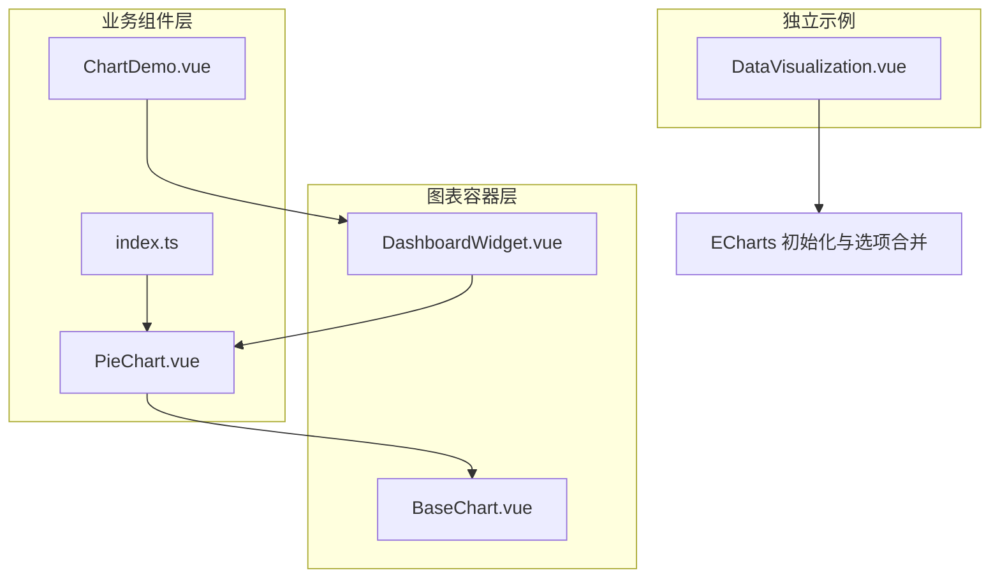
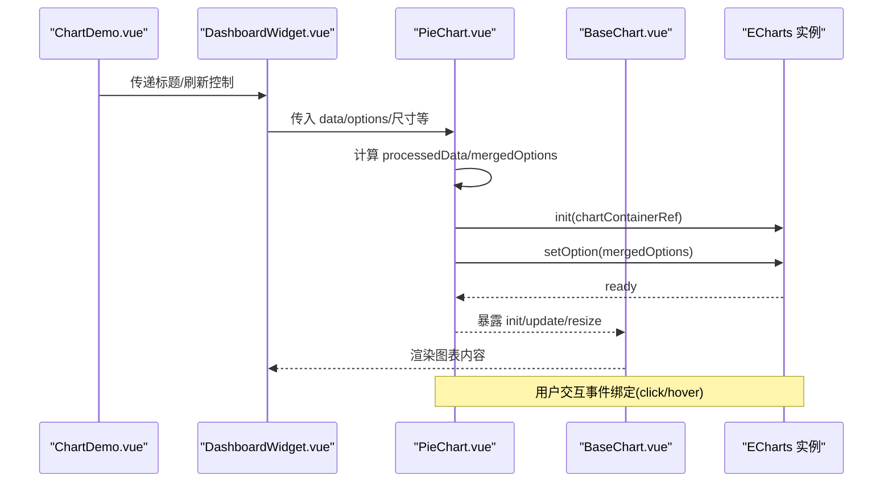
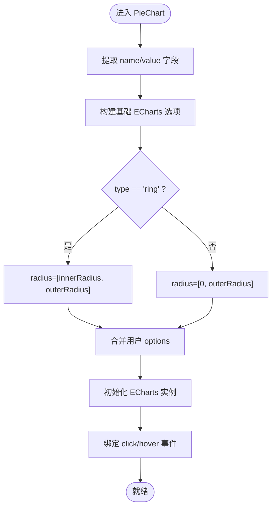
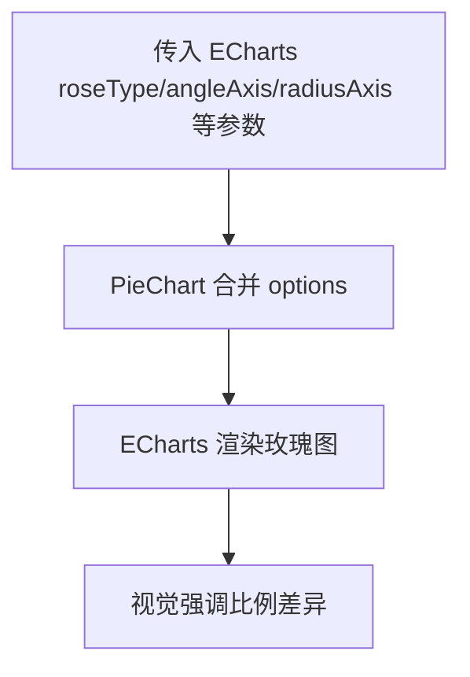
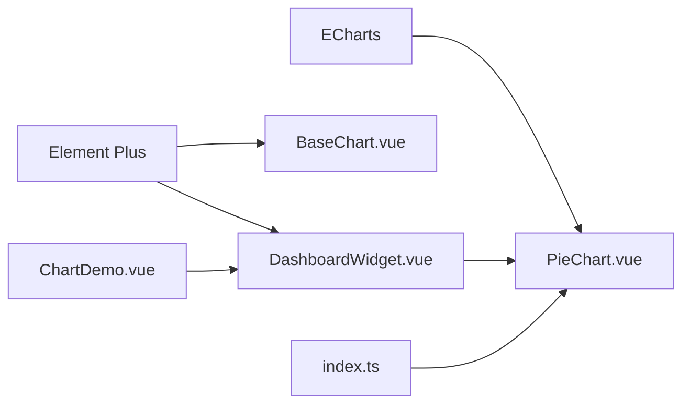

# 饼图 (PieChart)

<cite>
**本文引用的文件**
- [PieChart.vue](file://07-frontend/src/components/common/charts/PieChart.vue)
- [BaseChart.vue](file://07-frontend/src/components/common/charts/BaseChart.vue)
- [ChartDemo.vue](file://07-frontend/src/components/common/charts/ChartDemo.vue)
- [DashboardWidget.vue](file://07-frontend/src/components/common/charts/DashboardWidget.vue)
- [index.ts](file://07-frontend/src/components/common/charts/index.ts)
- [DataVisualization.vue](file://07-frontend/src/pages/analytics/components/DataVisualization.vue)
- [package.json](file://07-frontend/package.json)
</cite>

## 目录
1. [简介](#简介)
2. [项目结构](#项目结构)
3. [核心组件](#核心组件)
4. [架构总览](#架构总览)
5. [详细组件分析](#详细组件分析)
6. [依赖关系分析](#依赖关系分析)
7. [性能与可访问性](#性能与可访问性)
8. [故障排查指南](#故障排查指南)
9. [结论](#结论)
10. [附录：集成与用例](#附录：集成与用例)

## 简介
本技术文档围绕前端通用图表库中的 PieChart 组件展开，系统阐述其在比例分析场景下的多种可视化形态，重点覆盖：
- 饼图（pie）与环形图（doughnut ring）的实现原理与参数配置
- 南丁格尔玫瑰图（Nightingale rose）的实现思路与适用场景
- 数据标签格式化与“自动避让”策略（基于 ECharts 的 label 自动布局）
- 数据格式要求、颜色映射、内外半径设置等关键参数
- 交互行为（扇区点击高亮、悬停反馈）
- 可访问性支持建议
- 与 DashboardWidget 的集成模式与最佳实践
- 市场份额分析、费用构成统计等业务用例的完整集成示例路径

## 项目结构
PieChart 位于通用图表组件目录下，采用“容器组件 + 基础容器”的分层设计：
- PieChart.vue：面向业务的饼图封装，负责数据预处理、选项合并、事件绑定与生命周期管理
- BaseChart.vue：通用图表容器，统一处理加载、错误、空状态与响应式尺寸
- ChartDemo.vue：演示页面，展示 PieChart 在仪表板中的典型用法
- DashboardWidget.vue：仪表板小部件容器，提供标题、动作区、加载/错误/空状态等统一 UI
- index.ts：图表组件导出入口
- DataVisualization.vue：独立 ECharts 使用示例，便于理解 ECharts 选项合并与初始化流程

**图表来源**
- [PieChart.vue](file://07-frontend/src/components/common/charts/PieChart.vue#L1-L189)
- [BaseChart.vue](file://07-frontend/src/components/common/charts/BaseChart.vue#L1-L153)
- [ChartDemo.vue](file://07-frontend/src/components/common/charts/ChartDemo.vue#L1-L115)
- [DashboardWidget.vue](file://07-frontend/src/components/common/charts/DashboardWidget.vue#L1-L284)
- [index.ts](file://07-frontend/src/components/common/charts/index.ts#L1-L34)
- [DataVisualization.vue](file://07-frontend/src/pages/analytics/components/DataVisualization.vue#L1-L105)

**章节来源**
- [PieChart.vue](file://07-frontend/src/components/common/charts/PieChart.vue#L1-L189)
- [BaseChart.vue](file://07-frontend/src/components/common/charts/BaseChart.vue#L1-L153)
- [ChartDemo.vue](file://07-frontend/src/components/common/charts/ChartDemo.vue#L1-L115)
- [DashboardWidget.vue](file://07-frontend/src/components/common/charts/DashboardWidget.vue#L1-L284)
- [index.ts](file://07-frontend/src/components/common/charts/index.ts#L1-L34)
- [DataVisualization.vue](file://07-frontend/src/pages/analytics/components/DataVisualization.vue#L1-L105)

## 核心组件
- PieChart.vue
  - 输入参数：data、nameField、valueField、options、height、width、loading、error、emptyText、responsive、showLegend、showValue、showPercent、type、innerRadius、outerRadius、legendPosition
  - 输出事件：reload、click、hover、dataChange
  - 关键能力：
    - 数据预处理：从原始数组提取 name/value 字段
    - 选项合并：构建基础 ECharts 选项（tooltip、legend、series），并合并用户传入的 options
    - 类型切换：通过 type 控制饼图或环形图；通过 innerRadius/outerRadius 控制环宽
    - 交互：绑定 click/mouseover 事件并向上抛出
    - 响应式：监听容器尺寸变化并调用 resize
- BaseChart.vue
  - 提供统一的加载、错误、空状态 UI，以及响应式容器与更新接口
- DashboardWidget.vue
  - 仪表板小部件容器，支持标题、图标、操作区、加载/错误/空状态、尺寸变体等
- ChartDemo.vue
  - 展示 PieChart 在 DashboardWidget 中的典型用法，包含刷新、点击事件处理等

**章节来源**
- [PieChart.vue](file://07-frontend/src/components/common/charts/PieChart.vue#L27-L115)
- [PieChart.vue](file://07-frontend/src/components/common/charts/PieChart.vue#L129-L189)
- [BaseChart.vue](file://07-frontend/src/components/common/charts/BaseChart.vue#L23-L64)
- [BaseChart.vue](file://07-frontend/src/components/common/charts/BaseChart.vue#L79-L123)
- [DashboardWidget.vue](file://07-frontend/src/components/common/charts/DashboardWidget.vue#L61-L142)
- [ChartDemo.vue](file://07-frontend/src/components/common/charts/ChartDemo.vue#L43-L56)

## 架构总览
PieChart 的运行时架构如下：
- 容器层：BaseChart 负责渲染与生命周期管理
- 业务层：PieChart 负责数据与选项处理，并与 ECharts 交互
- 集成层：ChartDemo 与 DashboardWidget 将 PieChart 组合到仪表板中

**图表来源**
- [PieChart.vue](file://07-frontend/src/components/common/charts/PieChart.vue#L191-L256)
- [BaseChart.vue](file://07-frontend/src/components/common/charts/BaseChart.vue#L85-L123)
- [ChartDemo.vue](file://07-frontend/src/components/common/charts/ChartDemo.vue#L43-L56)

**章节来源**
- [PieChart.vue](file://07-frontend/src/components/common/charts/PieChart.vue#L191-L256)
- [BaseChart.vue](file://07-frontend/src/components/common/charts/BaseChart.vue#L85-L123)
- [ChartDemo.vue](file://07-frontend/src/components/common/charts/ChartDemo.vue#L43-L56)

## 详细组件分析

### 饼图（Pie）与环形图（Doughnut Ring）
- 数据格式
  - 原始数据为数组，每个元素包含 nameField 与 valueField 对应的字段名
  - 示例路径：[PieChart 数据预处理](file://07-frontend/src/components/common/charts/PieChart.vue#L125-L134)
- 选项生成
  - 基础选项包含 tooltip、legend、series（type='pie'）、label/labelLine
  - 环形图通过 radius=[innerRadius, outerRadius] 实现
  - 示例路径：[PieChart 选项合并](file://07-frontend/src/components/common/charts/PieChart.vue#L148-L189)
- 交互
  - 绑定 click/mouseover 事件并通过 emit 上抛
  - 示例路径：[PieChart 事件绑定](file://07-frontend/src/components/common/charts/PieChart.vue#L207-L214)
- 标签格式化
  - 支持按需显示数值与百分比，formatter 拼接 name/value/percent
  - 示例路径：[PieChart 标签格式化](file://07-frontend/src/components/common/charts/PieChart.vue#L137-L146)

**图表来源**
- [PieChart.vue](file://07-frontend/src/components/common/charts/PieChart.vue#L125-L189)

**章节来源**
- [PieChart.vue](file://07-frontend/src/components/common/charts/PieChart.vue#L125-L189)

### 南丁格尔玫瑰图（Nightingale Rose）
- 实现思路
  - ECharts 中可通过设置 series 的 roseType 或 angleAxis/radiusAxis 来实现玫瑰图效果
  - 在 PieChart 的 options 中可直接传入 ECharts 的 roseType、startAngle、minAngle 等参数以达到南丁格尔风格
  - 示例路径：[DataVisualization 选项合并参考](file://07-frontend/src/pages/analytics/components/DataVisualization.vue#L41-L51)
- 适用场景
  - 强调各分类占比差异，突出最大/最小值
  - 分类数量适中（过多会导致视觉拥挤）

**图表来源**
- [DataVisualization.vue](file://07-frontend/src/pages/analytics/components/DataVisualization.vue#L41-L51)
- [PieChart.vue](file://07-frontend/src/components/common/charts/PieChart.vue#L187-L189)

**章节来源**
- [DataVisualization.vue](file://07-frontend/src/pages/analytics/components/DataVisualization.vue#L41-L51)
- [PieChart.vue](file://07-frontend/src/components/common/charts/PieChart.vue#L187-L189)

### 数据标签自动避让与优化策略
- 自动避让
  - ECharts 提供 label 自动布局与碰撞检测，可在 series.label 中启用并配合 formatter 控制显示内容
  - 可通过调整 labelLine、label 的 show 与 formatter，减少重叠
- 优化策略
  - 控制显示百分比/数值开关，避免标签过长
  - 合理设置 outerRadius 与 legend 位置，留出标签空间
  - 对于类别较多的情况，优先显示主要类别，次要类别汇总为“其他”
- 示例路径：[PieChart 标签与连线控制](file://07-frontend/src/components/common/charts/PieChart.vue#L177-L183)

**章节来源**
- [PieChart.vue](file://07-frontend/src/components/common/charts/PieChart.vue#L177-L183)

### 颜色映射与主题
- 颜色映射
  - PieChart 本身不强制颜色数组，但可将颜色通过 options 透传给 ECharts series.itemStyle.color
  - 若未指定，ECharts 会使用默认主题色
- 主题与样式
  - 项目提供主题系统与颜色工具，可参考主题常量与工具函数进行颜色管理
  - 示例路径：[主题常量](file://07-frontend/src/components/theme/constants/themeConstants.js#L1-L55)、[颜色工具](file://07-frontend/src/components/theme/utils/themeUtils.js#L1-L120)
- ECharts 依赖
  - 项目依赖中包含 ECharts（通过包管理器安装），PieChart 直接引入 ECharts 并初始化实例
  - 示例路径：[PieChart 引入 ECharts](file://07-frontend/src/components/common/charts/PieChart.vue#L24-L26)、[package.json 依赖](file://07-frontend/package.json#L12-L33)

**章节来源**
- [PieChart.vue](file://07-frontend/src/components/common/charts/PieChart.vue#L24-L26)
- [package.json](file://07-frontend/package.json#L12-L33)
- [themeConstants.js](file://07-frontend/src/components/theme/constants/themeConstants.js#L1-L55)
- [themeUtils.js](file://07-frontend/src/components/theme/utils/themeUtils.js#L1-L120)

### 交互行为（点击高亮与悬停）
- 点击高亮
  - 通过 series.emphasis.focus='self' 实现点击聚焦高亮
  - 示例路径：[PieChart emphasis 配置](file://07-frontend/src/components/common/charts/PieChart.vue#L169-L176)
- 悬停反馈
  - 绑定 mouseover 事件并上抛 hover 事件
  - 示例路径：[PieChart 事件绑定](file://07-frontend/src/components/common/charts/PieChart.vue#L211-L213)
- 与父组件协作
  - ChartDemo 中演示了点击事件处理与刷新逻辑
  - 示例路径：[ChartDemo 事件处理](file://07-frontend/src/components/common/charts/ChartDemo.vue#L259-L263)

**章节来源**
- [PieChart.vue](file://07-frontend/src/components/common/charts/PieChart.vue#L169-L176)
- [PieChart.vue](file://07-frontend/src/components/common/charts/PieChart.vue#L211-L213)
- [ChartDemo.vue](file://07-frontend/src/components/common/charts/ChartDemo.vue#L259-L263)

### 可访问性支持建议
- 文本替代
  - 为 tooltip 提供清晰的 formatter 文本，确保读屏软件可读
- 对比度
  - 使用主题工具生成颜色变体，保证文本与背景对比度满足可读性
- 键盘与焦点
  - ECharts 交互以鼠标为主，建议在容器上添加 aria-label 与 role，提升可访问性
- 屏幕阅读器
  - 在图表容器外提供摘要信息与数据表格链接，辅助视障用户理解数据

[本节为通用建议，不直接分析具体文件]

## 依赖关系分析
- 组件耦合
  - PieChart 依赖 BaseChart 进行容器与状态管理
  - ChartDemo 依赖 DashboardWidget 与 PieChart
- 外部依赖
  - ECharts 用于渲染与交互
  - Element Plus 用于 UI 组件与图标
- 导出与导入
  - index.ts 统一导出图表组件，便于集中引入

**图表来源**
- [PieChart.vue](file://07-frontend/src/components/common/charts/PieChart.vue#L24-L26)
- [BaseChart.vue](file://07-frontend/src/components/common/charts/BaseChart.vue#L1-L153)
- [DashboardWidget.vue](file://07-frontend/src/components/common/charts/DashboardWidget.vue#L1-L284)
- [index.ts](file://07-frontend/src/components/common/charts/index.ts#L1-L34)
- [package.json](file://07-frontend/package.json#L12-L33)

**章节来源**
- [PieChart.vue](file://07-frontend/src/components/common/charts/PieChart.vue#L24-L26)
- [BaseChart.vue](file://07-frontend/src/components/common/charts/BaseChart.vue#L1-L153)
- [DashboardWidget.vue](file://07-frontend/src/components/common/charts/DashboardWidget.vue#L1-L284)
- [index.ts](file://07-frontend/src/components/common/charts/index.ts#L1-L34)
- [package.json](file://07-frontend/package.json#L12-L33)

## 性能与可访问性
- 性能
  - 使用 computed 缓存 mergedOptions，避免不必要的 setOption 调用
  - 监听 props 变化后仅在必要时调用 updateChart
  - 响应式容器使用 ResizeObserver，避免频繁重绘
- 可访问性
  - 为图表容器提供语义化属性
  - 提供数据表格与摘要信息，辅助读屏
  - 控制标签长度与显示密度，避免视觉拥挤

[本节为通用指导，不直接分析具体文件]

## 故障排查指南
- 图表不显示
  - 检查 data 是否为空，确认 BaseChart 的 hasData 判定
  - 确认容器尺寸与响应式设置
  - 示例路径：[BaseChart hasData](file://07-frontend/src/components/common/charts/BaseChart.vue#L75-L77)
- 点击/悬停无响应
  - 确认事件绑定是否成功，检查 emit 事件名
  - 示例路径：[PieChart 事件绑定](file://07-frontend/src/components/common/charts/PieChart.vue#L207-L214)
- 环形图半径无效
  - 确认 type 是否为 'ring'，innerRadius/outerRadius 是否为有效字符串/数字
  - 示例路径：[PieChart radius 切换](file://07-frontend/src/components/common/charts/PieChart.vue#L164-L166)
- 标签重叠
  - 调整 outerRadius、legendPosition，或关闭部分标签显示
  - 示例路径：[PieChart label 控制](file://07-frontend/src/components/common/charts/PieChart.vue#L177-L183)

**章节来源**
- [BaseChart.vue](file://07-frontend/src/components/common/charts/BaseChart.vue#L75-L77)
- [PieChart.vue](file://07-frontend/src/components/common/charts/PieChart.vue#L164-L166)
- [PieChart.vue](file://07-frontend/src/components/common/charts/PieChart.vue#L177-L183)
- [PieChart.vue](file://07-frontend/src/components/common/charts/PieChart.vue#L207-L214)

## 结论
PieChart 在本项目中通过“容器组件 + 基础容器”的分层设计实现了高度可复用的比例分析组件。其核心优势在于：
- 易于扩展：通过 options 透传 ECharts 选项，灵活支持饼图、环形图与南丁格尔玫瑰图
- 交互友好：内置点击高亮与悬停反馈，便于用户探索数据
- 集成便捷：与 DashboardWidget、ChartDemo 等组件无缝组合，快速搭建仪表板
- 可维护性强：统一的数据预处理与选项合并逻辑，降低重复开发成本

[本节为总结，不直接分析具体文件]

## 附录：集成与用例

### 数据格式要求
- 原始数据为数组，每个元素包含 nameField 与 valueField 字段
- 示例路径：[PieChart 数据预处理](file://07-frontend/src/components/common/charts/PieChart.vue#L125-L134)

### 关键参数说明
- data：原始数据数组
- nameField/valueField：名称与数值字段名
- options：透传给 ECharts 的选项对象
- showLegend/showValue/showPercent：控制图例与标签显示
- type：'pie' 或 'ring'
- innerRadius/outerRadius：环形图内外半径
- legendPosition：'top'/'bottom'/'left'/'right'
- 示例路径：[PieChart Props](file://07-frontend/src/components/common/charts/PieChart.vue#L27-L115)

### 颜色映射配置（colors）
- 通过 options.itemStyle.color 或 series.itemStyle.color 传入颜色
- 可结合主题工具生成颜色变体
- 示例路径：[主题常量](file://07-frontend/src/components/theme/constants/themeConstants.js#L1-L55)、[颜色工具](file://07-frontend/src/components/theme/utils/themeUtils.js#L1-L120)

### 交互行为
- 点击高亮：series.emphasis.focus='self'
- 悬停事件：mouseover 事件上抛
- 示例路径：[PieChart emphasis](file://07-frontend/src/components/common/charts/PieChart.vue#L169-L176)、[PieChart 事件绑定](file://07-frontend/src/components/common/charts/PieChart.vue#L211-L213)

### 可访问性支持
- 为图表容器提供 aria-label 与 role
- 提供数据表格与摘要信息
- 控制标签密度与对比度

### 与其他组件的集成模式
- 与 DashboardWidget 集成
  - 使用 DashboardWidget 包裹 PieChart，提供标题、刷新与空状态
  - 示例路径：[ChartDemo 集成](file://07-frontend/src/components/common/charts/ChartDemo.vue#L43-L56)
- 与 ChartDemo 集成
  - 演示刷新、点击事件处理与数据生成
  - 示例路径：[ChartDemo 刷新与事件](file://07-frontend/src/components/common/charts/ChartDemo.vue#L217-L263)

### 业务用例示例路径
- 市场份额分析
  - 使用 PieChart 展示不同渠道/品牌的占比
  - 示例路径：[ChartDemo 销售渠道分布](file://07-frontend/src/components/common/charts/ChartDemo.vue#L43-L56)
- 费用构成统计
  - 使用环形图（type='ring'）展示预算与实际支出占比
  - 示例路径：[PieChart 环形图用法](file://07-frontend/src/components/common/charts/PieChart.vue#L164-L166)

**章节来源**
- [PieChart.vue](file://07-frontend/src/components/common/charts/PieChart.vue#L27-L115)
- [PieChart.vue](file://07-frontend/src/components/common/charts/PieChart.vue#L125-L189)
- [ChartDemo.vue](file://07-frontend/src/components/common/charts/ChartDemo.vue#L43-L56)
- [ChartDemo.vue](file://07-frontend/src/components/common/charts/ChartDemo.vue#L217-L263)
- [DashboardWidget.vue](file://07-frontend/src/components/common/charts/DashboardWidget.vue#L61-L142)
- [themeConstants.js](file://07-frontend/src/components/theme/constants/themeConstants.js#L1-L55)
- [themeUtils.js](file://07-frontend/src/components/theme/utils/themeUtils.js#L1-L120)