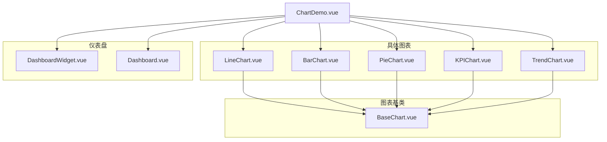
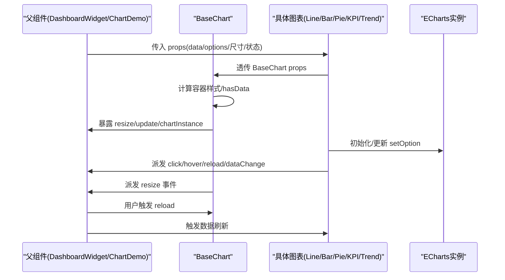
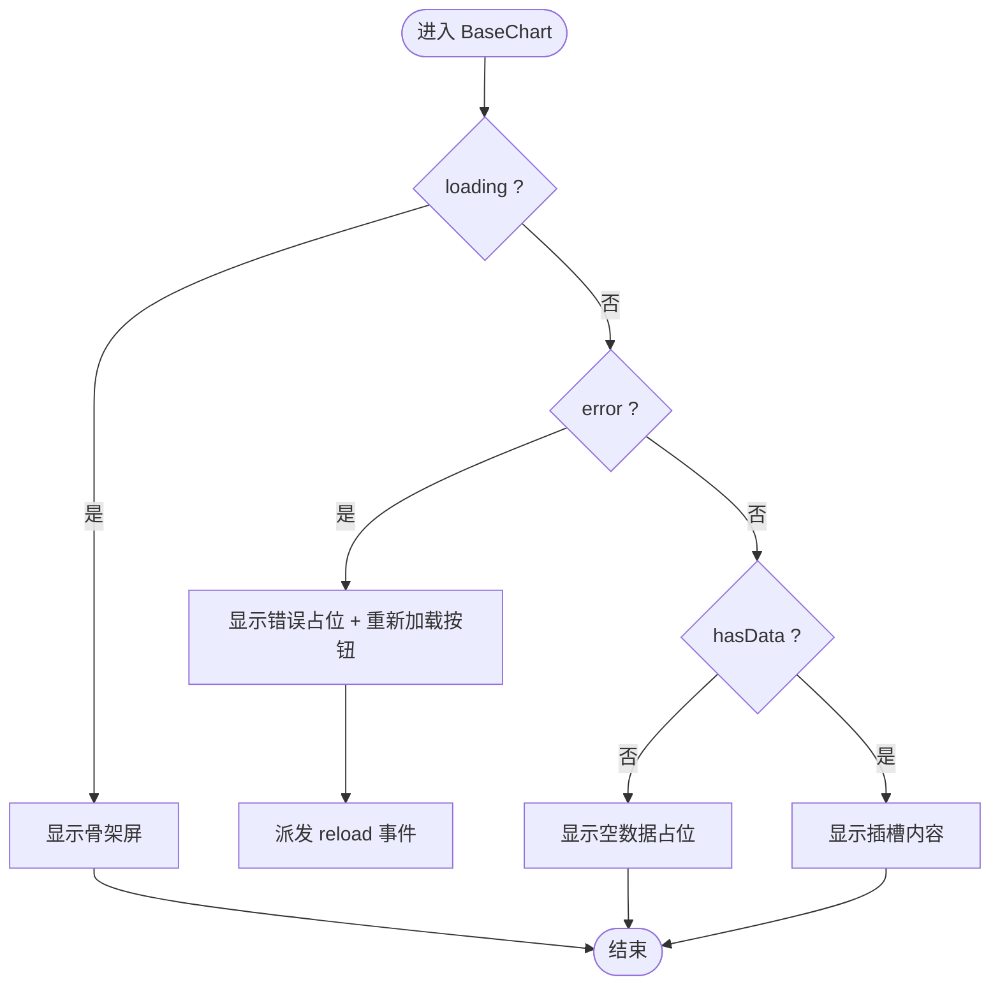
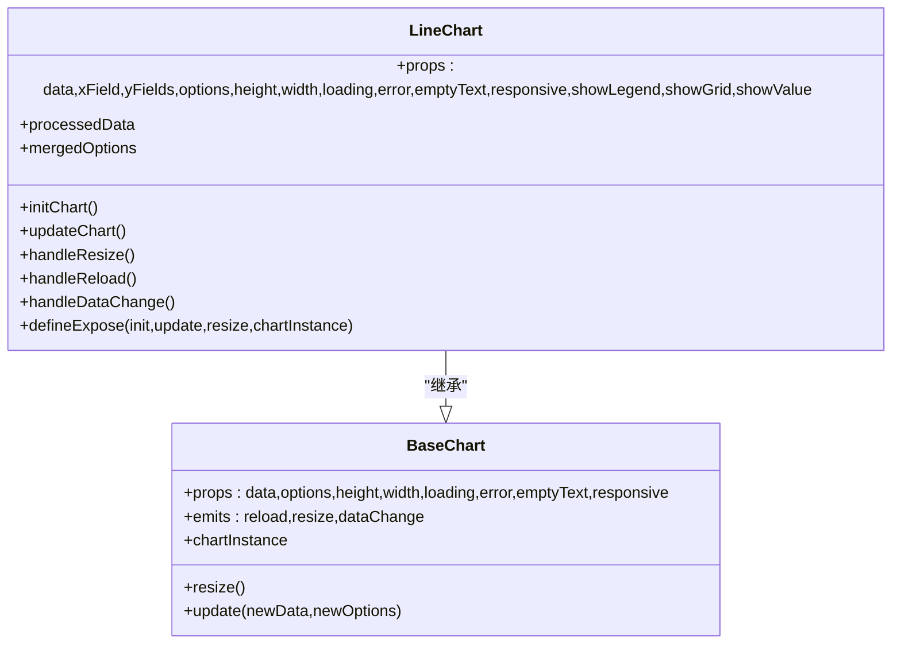
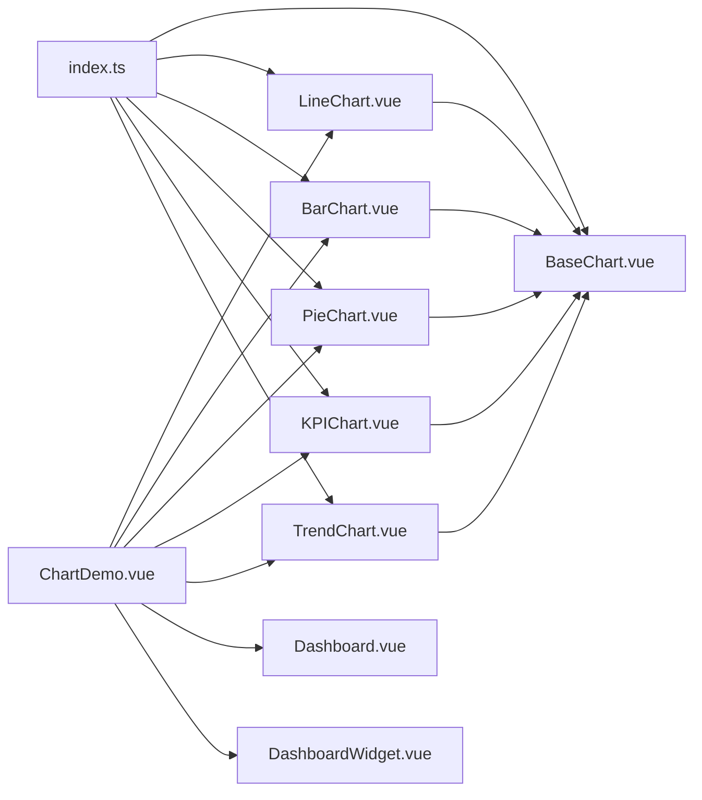

# 基础图表组件

<cite>
**本文引用的文件列表**
- [BaseChart.vue](file://07-frontend/src/components/common/charts/BaseChart.vue)
- [LineChart.vue](file://07-frontend/src/components/common/charts/LineChart.vue)
- [BarChart.vue](file://07-frontend/src/components/common/charts/BarChart.vue)
- [PieChart.vue](file://07-frontend/src/components/common/charts/PieChart.vue)
- [KPIChart.vue](file://07-frontend/src/components/common/charts/KPIChart.vue)
- [TrendChart.vue](file://07-frontend/src/components/common/charts/TrendChart.vue)
- [Dashboard.vue](file://07-frontend/src/components/common/charts/Dashboard.vue)
- [DashboardWidget.vue](file://07-frontend/src/components/common/charts/DashboardWidget.vue)
- [ChartDemo.vue](file://07-frontend/src/components/common/charts/ChartDemo.vue)
- [index.ts](file://07-frontend/src/components/common/charts/index.ts)
</cite>

## 目录
1. [引言](#引言)
2. [项目结构](#项目结构)
3. [核心组件](#核心组件)
4. [架构总览](#架构总览)
5. [详细组件分析](#详细组件分析)
6. [依赖关系分析](#依赖关系分析)
7. [性能考量](#性能考量)
8. [故障排查指南](#故障排查指南)
9. [结论](#结论)
10. [附录：自定义图表开发指南](#附录自定义图表开发指南)

## 引言
本文件系统性阐述 BaseChart 作为所有图表组件基类的设计理念与实现机制，覆盖统一的状态管理（加载/错误/空数据）、响应式适配、事件总线、ECharts 初始化封装、动态主题与屏幕自适应支持，并提供基于 BaseChart 的完整自定义图表开发示例，包括生命周期钩子、props 规范、事件派发与与父级 DashboardWidget 的通信方式，以及性能优化策略（防抖重绘、懒加载、资源释放）。

## 项目结构
图表相关组件集中于前端工程的通用组件目录，采用“基类 + 具体图表类型”的分层组织：
- 基类：BaseChart.vue
- 具体图表：LineChart.vue、BarChart.vue、PieChart.vue、KPIChart.vue、TrendChart.vue
- 仪表盘容器：Dashboard.vue、DashboardWidget.vue
- 示例入口：ChartDemo.vue
- 统一导出：index.ts

**图表来源**
- [BaseChart.vue](file://07-frontend/src/components/common/charts/BaseChart.vue#L1-L153)
- [LineChart.vue](file://07-frontend/src/components/common/charts/LineChart.vue#L1-L249)
- [BarChart.vue](file://07-frontend/src/components/common/charts/BarChart.vue#L1-L256)
- [PieChart.vue](file://07-frontend/src/components/common/charts/PieChart.vue#L1-L263)
- [KPIChart.vue](file://07-frontend/src/components/common/charts/KPIChart.vue#L1-L441)
- [TrendChart.vue](file://07-frontend/src/components/common/charts/TrendChart.vue#L1-L407)
- [Dashboard.vue](file://07-frontend/src/components/common/charts/Dashboard.vue#L1-L268)
- [DashboardWidget.vue](file://07-frontend/src/components/common/charts/DashboardWidget.vue#L1-L284)
- [ChartDemo.vue](file://07-frontend/src/components/common/charts/ChartDemo.vue#L1-L335)
- [index.ts](file://07-frontend/src/components/common/charts/index.ts#L1-L34)

**章节来源**
- [index.ts](file://07-frontend/src/components/common/charts/index.ts#L1-L34)

## 核心组件
- BaseChart：提供统一的加载、错误、空数据占位渲染；响应式容器与 ResizeObserver 自适应；暴露 resize/update/chartInstance 给父组件；定义 reload/resize/dataChange 事件。
- 具体图表：LineChart、BarChart、PieChart、KPIChart、TrendChart 均通过 BaseChart 的 props/options/data/响应式能力，完成 ECharts 实例化、更新与事件绑定。
- Dashboard/DashboardWidget：提供仪表盘布局、KPI 展示与小部件容器，便于组合图表组件。

**章节来源**
- [BaseChart.vue](file://07-frontend/src/components/common/charts/BaseChart.vue#L1-L153)
- [Dashboard.vue](file://07-frontend/src/components/common/charts/Dashboard.vue#L1-L268)
- [DashboardWidget.vue](file://07-frontend/src/components/common/charts/DashboardWidget.vue#L1-L284)

## 架构总览
BaseChart 作为“外观壳”，负责：
- 状态渲染：loading/error/empty/data 四态切换
- 容器与尺寸：height/width 计算样式
- 响应式：ResizeObserver 监听容器尺寸变化并触发 resize 事件
- 事件桥接：向父组件派发 reload/resize/dataChange
- 生命周期：挂载时开启监听，卸载时清理实例与观察者

具体图表通过 BaseChart 的 props/options/data 与事件，完成 ECharts 初始化、更新与交互事件转发。

**图表来源**
- [BaseChart.vue](file://07-frontend/src/components/common/charts/BaseChart.vue#L1-L153)
- [LineChart.vue](file://07-frontend/src/components/common/charts/LineChart.vue#L1-L249)
- [BarChart.vue](file://07-frontend/src/components/common/charts/BarChart.vue#L1-L256)
- [PieChart.vue](file://07-frontend/src/components/common/charts/PieChart.vue#L1-L263)
- [KPIChart.vue](file://07-frontend/src/components/common/charts/KPIChart.vue#L1-L441)
- [TrendChart.vue](file://07-frontend/src/components/common/charts/TrendChart.vue#L1-L407)

## 详细组件分析

### BaseChart 设计与实现
- 状态渲染
  - loading：骨架屏占位
  - error：空状态 + 重新加载按钮，点击触发 reload 事件
  - empty：空状态 + 可定制 emptyText
  - data：正常渲染插槽内容
- 尺寸与样式
  - height/width 支持字符串或数字，计算容器内联样式
  - hasData 基于 data 数组长度判断
- 响应式
  - onMounted 开启 ResizeObserver 监听容器尺寸变化
  - 触发 resize 事件，供子组件调用 chartInstance.resize
- 生命周期与资源释放
  - onUnmounted 清理 ResizeObserver 与 chartInstance 引用
- 事件与暴露
  - 事件：reload/resize/dataChange
  - 暴露：resize/update/chartInstance 供父组件调用

**图表来源**
- [BaseChart.vue](file://07-frontend/src/components/common/charts/BaseChart.vue#L1-L153)

**章节来源**
- [BaseChart.vue](file://07-frontend/src/components/common/charts/BaseChart.vue#L1-L153)

### 具体图表（以 LineChart 为例）
- 继承 BaseChart
  - 透传 data/options/尺寸/状态到 BaseChart
  - 通过 ref 获取 BaseChart 暴露的方法与实例
- 数据与配置
  - processedData：标准化输入数据
  - mergedOptions：构建 ECharts 选项（tooltip/legend/grid/xAxis/yAxis/series），支持 props.options 合并
- 初始化与更新
  - initChart：销毁旧实例、创建新实例、setOption、绑定 click/mouseover
  - updateChart：深度更新 setOption(true)
- 事件与响应式
  - handleResize：nextTick 后调用 chartInstance.resize
  - handleReload/handleDataChange：转发 reload/dataChange
  - watch([data,options])：深监听并更新
- 生命周期
  - onMounted：nextTick 初始化
  - defineExpose：init/update/resize/chartInstance

**图表来源**
- [BaseChart.vue](file://07-frontend/src/components/common/charts/BaseChart.vue#L1-L153)
- [LineChart.vue](file://07-frontend/src/components/common/charts/LineChart.vue#L1-L249)

**章节来源**
- [LineChart.vue](file://07-frontend/src/components/common/charts/LineChart.vue#L1-L249)

### 其他图表类型（BarChart/PieChart/KPIChart/TrendChart）
- BarChart：支持堆叠/横向柱状图，xAxis/yAxis 根据 isHorizontal 动态切换，series 类型为 bar。
- PieChart：支持饼图/环形图，legend 位置可配置，label 显示值/百分比。
- KPIChart：在折线趋势图上方叠加 KPI 主指标与变化率，支持不同尺寸与格式化。
- TrendChart：同时渲染历史与预测数据，支持预测区间阴影带，系列类型为 line。

上述组件均遵循相同模式：继承 BaseChart，内部维护 chartInstance，通过 mergedOptions 与 ECharts 交互，暴露 init/update/resize/chartInstance，转发 click/hover/reload/dataChange 事件。

**章节来源**
- [BarChart.vue](file://07-frontend/src/components/common/charts/BarChart.vue#L1-L256)
- [PieChart.vue](file://07-frontend/src/components/common/charts/PieChart.vue#L1-L263)
- [KPIChart.vue](file://07-frontend/src/components/common/charts/KPIChart.vue#L1-L441)
- [TrendChart.vue](file://07-frontend/src/components/common/charts/TrendChart.vue#L1-L407)

### Dashboard 与 DashboardWidget
- DashboardWidget：提供标题、图标、动作区（刷新/设置）、加载/错误/空状态占位、边框/悬停等样式与交互。
- Dashboard：提供仪表盘标题、KPI 区域（支持边框与格式化）、图表网格布局、全局加载遮罩。

两者常用于包裹具体图表组件，形成仪表盘页面。

**章节来源**
- [DashboardWidget.vue](file://07-frontend/src/components/common/charts/DashboardWidget.vue#L1-L284)
- [Dashboard.vue](file://07-frontend/src/components/common/charts/Dashboard.vue#L1-L268)

## 依赖关系分析
- 组件导出：index.ts 统一导出 BaseChart 与其他图表组件，便于按需引入或批量导入。
- 组件间依赖：具体图表均依赖 BaseChart；ChartDemo 作为示例演示各组件组合使用。
- 外部依赖：ECharts 初始化与更新由各图表内部完成，BaseChart 不直接依赖 ECharts。

**图表来源**
- [index.ts](file://07-frontend/src/components/common/charts/index.ts#L1-L34)
- [ChartDemo.vue](file://07-frontend/src/components/common/charts/ChartDemo.vue#L1-L335)

**章节来源**
- [index.ts](file://07-frontend/src/components/common/charts/index.ts#L1-L34)

## 性能考量
- 防抖重绘
  - BaseChart 在容器尺寸变化时仅派发 resize 事件，具体图表在 handleResize 中调用 chartInstance.resize，避免频繁 setOption。
  - 建议父组件在窗口 resize 或布局变化时，对触发频率进行节流/防抖，减少 BaseChart 的 resize 事件风暴。
- 懒加载
  - BaseChart 默认不强制初始化 ECharts 实例，具体图表在 onMounted 后 nextTick 初始化，避免首屏阻塞。
- 资源释放
  - BaseChart 在 onUnmounted 中断开 ResizeObserver 并置空 chartInstance，防止内存泄漏。
  - 具体图表在 initChart 前先 dispose 旧实例，避免重复实例导致的资源占用。
- 更新策略
  - 使用 setOption(..., true) 进行增量更新，减少全量重建成本。
  - watch 深监听 props.data/props.options，确保配置变更及时生效。

[本节为通用性能建议，无需特定文件引用]

## 故障排查指南
- 图表不显示或空白
  - 检查 data 是否为空数组或未正确传入
  - 确认容器尺寸是否有效（height/width），BaseChart 会根据 props 计算容器样式
- 无法响应窗口变化
  - 确认 BaseChart 的 responsive 为 true，且容器元素可被 ResizeObserver 观察
  - 子组件需在 handleResize 中调用 chartInstance.resize
- 事件未触发
  - 确认父组件是否监听了 reload/resize/dataChange
  - 子组件是否正确转发 click/hover/reload/dataChange
- 内存泄漏
  - 确保组件卸载时 BaseChart 的 onUnmounted 已执行
  - 子组件在重新初始化前 dispose 旧实例

**章节来源**
- [BaseChart.vue](file://07-frontend/src/components/common/charts/BaseChart.vue#L1-L153)
- [LineChart.vue](file://07-frontend/src/components/common/charts/LineChart.vue#L1-L249)
- [BarChart.vue](file://07-frontend/src/components/common/charts/BarChart.vue#L1-L256)
- [PieChart.vue](file://07-frontend/src/components/common/charts/PieChart.vue#L1-L263)
- [KPIChart.vue](file://07-frontend/src/components/common/charts/KPIChart.vue#L1-L441)
- [TrendChart.vue](file://07-frontend/src/components/common/charts/TrendChart.vue#L1-L407)

## 结论
BaseChart 通过统一的状态渲染、响应式适配与事件桥接，为所有图表组件提供一致的使用体验与生命周期管理。具体图表在继承 BaseChart 的基础上，专注于 ECharts 的初始化、配置合并与交互事件转发，形成清晰的职责分离。配合 Dashboard/DashboardWidget，可快速搭建仪表盘页面。建议在实际项目中遵循本文档的 props 规范、生命周期与事件约定，结合性能优化策略，获得稳定高效的可视化体验。

[本节为总结性内容，无需特定文件引用]

## 附录：自定义图表开发指南

### 1. 继承 BaseChart 的步骤
- 在模板中包裹 BaseChart，并透传 data/options/尺寸/状态与事件
- 在脚本中引入 BaseChart，声明 props 与 emits
- 内部维护 chartInstance 与容器 ref
- 在 onMounted 中初始化 ECharts 实例，setOption 并绑定交互事件
- 在 watch 中监听数据与配置变化，调用 updateChart
- 在 onUnmounted 中 dispose 实例
- 通过 defineExpose 暴露 init/update/resize/chartInstance

参考路径
- [BaseChart.vue](file://07-frontend/src/components/common/charts/BaseChart.vue#L1-L153)
- [LineChart.vue](file://07-frontend/src/components/common/charts/LineChart.vue#L1-L249)

### 2. 生命周期钩子使用
- onMounted：延迟初始化 ECharts 实例（nextTick）
- onUnmounted：清理 ResizeObserver 与 chartInstance
- watch：监听 props.data/props.options（或 props.data/props.forecastData 等）进行增量更新

参考路径
- [LineChart.vue](file://07-frontend/src/components/common/charts/LineChart.vue#L225-L234)
- [BarChart.vue](file://07-frontend/src/components/common/charts/BarChart.vue#L231-L234)
- [PieChart.vue](file://07-frontend/src/components/common/charts/PieChart.vue#L238-L241)
- [KPIChart.vue](file://07-frontend/src/components/common/charts/KPIChart.vue#L332-L341)
- [TrendChart.vue](file://07-frontend/src/components/common/charts/TrendChart.vue#L382-L385)

### 3. props 定义规范
- 必传/常用 props
  - data：图表数据数组
  - options：ECharts 选项对象
  - height/width：容器尺寸
  - loading/error/emptyText/responsive：状态与响应式开关
- 具体图表扩展
  - LineChart：xField、yFields、showLegend、showGrid、showValue
  - BarChart：xField、yFields、isStacked、isHorizontal、showLegend、showGrid、showValue
  - PieChart：nameField、valueField、showLegend、showValue、showPercent、type、innerRadius、outerRadius、legendPosition
  - KPIChart：title、xField、yField、currentValue、changeValue、compareText、format、showKpi、size、chartType、chartColor
  - TrendChart：forecastData、forecastField、forecastName、forecastColor、showForecastRange、forecastUpperField、forecastLowerField、smooth、showLegend、showGrid、showValue

参考路径
- [LineChart.vue](file://07-frontend/src/components/common/charts/LineChart.vue#L27-L100)
- [BarChart.vue](file://07-frontend/src/components/common/charts/BarChart.vue#L27-L110)
- [PieChart.vue](file://07-frontend/src/components/common/charts/PieChart.vue#L27-L114)
- [KPIChart.vue](file://07-frontend/src/components/common/charts/KPIChart.vue#L47-L143)
- [TrendChart.vue](file://07-frontend/src/components/common/charts/TrendChart.vue#L27-L140)

### 4. 事件派发机制
- BaseChart 暴露事件
  - reload：用户点击错误占位的“重新加载”按钮时触发
  - resize：容器尺寸变化时触发
  - dataChange：父组件需要主动更新数据时触发
- 子组件转发事件
  - click/hover：来自 ECharts 事件
  - reload/dataChange：子组件内部触发，向上冒泡至父组件

参考路径
- [BaseChart.vue](file://07-frontend/src/components/common/charts/BaseChart.vue#L66-L68)
- [LineChart.vue](file://07-frontend/src/components/common/charts/LineChart.vue#L102-L104)
- [BarChart.vue](file://07-frontend/src/components/common/charts/BarChart.vue#L112-L114)
- [PieChart.vue](file://07-frontend/src/components/common/charts/PieChart.vue#L116-L118)
- [KPIChart.vue](file://07-frontend/src/components/common/charts/KPIChart.vue#L145-L147)
- [TrendChart.vue](file://07-frontend/src/components/common/charts/TrendChart.vue#L142-L144)

### 5. 与父级 DashboardWidget 的通信方式
- 父组件通过 props 控制 loading/error/empty 状态与标题、图标、动作按钮
- 父组件监听 refresh/settings/click 等事件，执行数据刷新或设置弹窗
- 子组件通过 BaseChart 的 reload/resize/dataChange 与父组件协作

参考路径
- [DashboardWidget.vue](file://07-frontend/src/components/common/charts/DashboardWidget.vue#L60-L142)
- [ChartDemo.vue](file://07-frontend/src/components/common/charts/ChartDemo.vue#L11-L25)

### 6. 动态主题与屏幕自适应
- 主题：通过 props.options 合并 ECharts 主题配置，或在外部切换主题后触发 updateChart
- 自适应：BaseChart 的 ResizeObserver + 子组件 handleResize -> chartInstance.resize
- 建议：在父级监听 window resize，对触发频率进行节流/防抖，减少 BaseChart 的 resize 事件风暴

参考路径
- [BaseChart.vue](file://07-frontend/src/components/common/charts/BaseChart.vue#L95-L115)
- [LineChart.vue](file://07-frontend/src/components/common/charts/LineChart.vue#L208-L214)
- [BarChart.vue](file://07-frontend/src/components/common/charts/BarChart.vue#L215-L221)
- [PieChart.vue](file://07-frontend/src/components/common/charts/PieChart.vue#L222-L228)
- [KPIChart.vue](file://07-frontend/src/components/common/charts/KPIChart.vue#L316-L322)
- [TrendChart.vue](file://07-frontend/src/components/common/charts/TrendChart.vue#L366-L372)

### 7. 完整示例：ChartDemo 中的使用
- 折线图、柱状图、饼图、KPI 图、趋势图均通过 DashboardWidget 包裹，支持刷新与点击事件处理
- 仪表盘 Dashboard 提供标题、KPI 区域与网格布局

参考路径
- [ChartDemo.vue](file://07-frontend/src/components/common/charts/ChartDemo.vue#L1-L114)
- [Dashboard.vue](file://07-frontend/src/components/common/charts/Dashboard.vue#L1-L110)