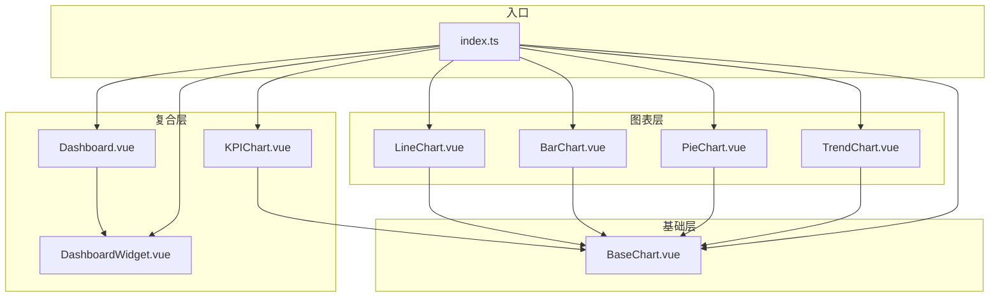
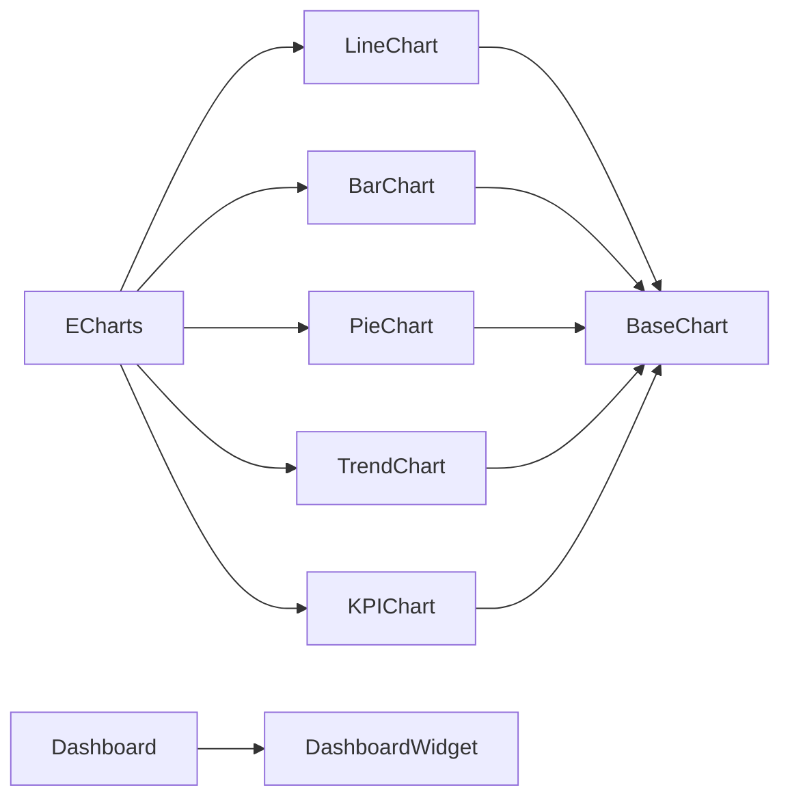

# 数据可视化组件

<cite>
**本文引用的文件**
- [BaseChart.vue](file://07-frontend/src/components/common/charts/BaseChart.vue)
- [LineChart.vue](file://07-frontend/src/components/common/charts/LineChart.vue)
- [BarChart.vue](file://07-frontend/src/components/common/charts/BarChart.vue)
- [PieChart.vue](file://07-frontend/src/components/common/charts/PieChart.vue)
- [TrendChart.vue](file://07-frontend/src/components/common/charts/TrendChart.vue)
- [KPIChart.vue](file://07-frontend/src/components/common/charts/KPIChart.vue)
- [Dashboard.vue](file://07-frontend/src/components/common/charts/Dashboard.vue)
- [DashboardWidget.vue](file://07-frontend/src/components/common/charts/DashboardWidget.vue)
- [ChartDemo.vue](file://07-frontend/src/components/common/charts/ChartDemo.vue)
- [index.ts](file://07-frontend/src/components/common/charts/index.ts)
- [KPIDashboard.vue](file://07-frontend/src/pages/analytics/KPIDashboard.vue)
</cite>

## 目录
1. [简介](#简介)
2. [项目结构](#项目结构)
3. [核心组件](#核心组件)
4. [架构总览](#架构总览)
5. [组件详解](#组件详解)
6. [依赖关系分析](#依赖关系分析)
7. [性能与响应式特性](#性能与响应式特性)
8. [使用示例与最佳实践](#使用示例与最佳实践)
9. [故障排查指南](#故障排查指南)
10. [结论](#结论)

## 简介
本文件系统性梳理前端数据可视化组件体系，覆盖从基础图表组件（BaseChart）到具体图表类型（BarChart、LineChart、PieChart、TrendChart），再到复合型组件（KPIChart、Dashboard、DashboardWidget）。文档重点说明基于 ECharts 的封装策略、响应式设计、动态数据更新与交互事件处理机制，并提供多业务场景的使用示例与扩展建议，帮助开发者快速集成与定制可视化能力。

## 项目结构
图表组件位于前端工程的通用组件目录中，采用“基础组件 + 具体图表 + 复合组件”的分层组织方式：
- 基础层：BaseChart 提供统一的容器、状态管理、尺寸与响应式处理
- 图表层：LineChart、BarChart、PieChart、TrendChart 封装具体图表类型
- 复合层：KPIChart、Dashboard、DashboardWidget 提供业务组合与仪表盘能力
- 导出入口：index.ts 统一导出所有组件，便于按需引入

图表来源
- [BaseChart.vue](file://07-frontend/src/components/common/charts/BaseChart.vue#L1-L153)
- [LineChart.vue](file://07-frontend/src/components/common/charts/LineChart.vue#L1-L249)
- [BarChart.vue](file://07-frontend/src/components/common/charts/BarChart.vue#L1-L256)
- [PieChart.vue](file://07-frontend/src/components/common/charts/PieChart.vue#L1-L263)
- [TrendChart.vue](file://07-frontend/src/components/common/charts/TrendChart.vue#L1-L407)
- [KPIChart.vue](file://07-frontend/src/components/common/charts/KPIChart.vue#L1-L441)
- [Dashboard.vue](file://07-frontend/src/components/common/charts/Dashboard.vue#L1-L268)
- [DashboardWidget.vue](file://07-frontend/src/components/common/charts/DashboardWidget.vue#L1-L284)
- [index.ts](file://07-frontend/src/components/common/charts/index.ts#L1-L34)

章节来源
- [index.ts](file://07-frontend/src/components/common/charts/index.ts#L1-L34)

## 核心组件
- BaseChart：提供统一的容器、加载/错误/空状态、尺寸控制、响应式监听与生命周期清理；暴露 resize/update/chartInstance 给子组件调用。
- LineChart/BarChart/PieChart/TrendChart：在 BaseChart 基础上，分别封装折线、柱状、饼图、趋势（含预测区间）等 ECharts 配置与事件绑定。
- KPIChart：在 BaseChart 基础上，叠加 KPI 主指标展示与趋势图，支持面积/折线两种形态。
- Dashboard/DashboardWidget：提供仪表盘容器、KPI 区域与网格布局，以及小部件的加载/错误/空状态与操作区。

章节来源
- [BaseChart.vue](file://07-frontend/src/components/common/charts/BaseChart.vue#L1-L153)
- [LineChart.vue](file://07-frontend/src/components/common/charts/LineChart.vue#L1-L249)
- [BarChart.vue](file://07-frontend/src/components/common/charts/BarChart.vue#L1-L256)
- [PieChart.vue](file://07-frontend/src/components/common/charts/PieChart.vue#L1-L263)
- [TrendChart.vue](file://07-frontend/src/components/common/charts/TrendChart.vue#L1-L407)
- [KPIChart.vue](file://07-frontend/src/components/common/charts/KPIChart.vue#L1-L441)
- [Dashboard.vue](file://07-frontend/src/components/common/charts/Dashboard.vue#L1-L268)
- [DashboardWidget.vue](file://07-frontend/src/components/common/charts/DashboardWidget.vue#L1-L284)

## 架构总览
组件间继承与依赖关系如下：

```mermaid
classDiagram
class BaseChart {
+props : data,options,height,width,loading,error,emptyText,responsive
+emits : reload,resize,dataChange
+resize()
+update(newData,newOptions)
+chartInstance
}
class LineChart {
+props : data,xField,yFields,options,height,width,loading,error,emptyText,responsive,showLegend,showGrid,showValue
+init()
+update()
+resize()
+events : click,hover
}
class BarChart {
+props : data,xField,yFields,options,height,width,loading,error,emptyText,responsive,showLegend,showGrid,showValue,isStacked,isHorizontal
+init()
+update()
+resize()
+events : click,hover
}
class PieChart {
+props : data,nameField,valueField,options,height,width,loading,error,emptyText,responsive,showLegend,showValue,showPercent,type,innerRadius,outerRadius,legendPosition
+init()
+update()
+resize()
+events : click,hover
}
class TrendChart {
+props : data,forecastData,xField,yFields,forecastField,forecastName,forecastColor,showForecastRange,forecastUpperField,forecastLowerField,options,height,width,loading,error,emptyText,responsive,showLegend,showGrid,showValue,smooth
+init()
+update()
+resize()
+events : click,hover
}
class KPIChart {
+props : title,data,xField,yField,currentValue,changeValue,compareText,format,options,height,width,loading,error,emptyText,responsive,showKpi,size,chartType,chartColor
+init()
+update()
+resize()
+events : click,hover
}
class Dashboard {
+props : title,kpiItems,showKpiBorder,loading,loadingText,actions
+formatKpiValue()
+getChangeClass()
}
class DashboardWidget {
+props : title,icon,size,bordered,hoverable,showHeader,showFooter,footerText,showRefresh,showSettings,showActions,contentPadding,loading,error,empty,emptyText
+emit : refresh,settings,click
}
LineChart --|> BaseChart
BarChart --|> BaseChart
PieChart --|> BaseChart
TrendChart --|> BaseChart
KPIChart --|> BaseChart
Dashboard --> DashboardWidget : "组合"
```

图表来源
- [BaseChart.vue](file://07-frontend/src/components/common/charts/BaseChart.vue#L1-L153)
- [LineChart.vue](file://07-frontend/src/components/common/charts/LineChart.vue#L1-L249)
- [BarChart.vue](file://07-frontend/src/components/common/charts/BarChart.vue#L1-L256)
- [PieChart.vue](file://07-frontend/src/components/common/charts/PieChart.vue#L1-L263)
- [TrendChart.vue](file://07-frontend/src/components/common/charts/TrendChart.vue#L1-L407)
- [KPIChart.vue](file://07-frontend/src/components/common/charts/KPIChart.vue#L1-L441)
- [Dashboard.vue](file://07-frontend/src/components/common/charts/Dashboard.vue#L1-L268)
- [DashboardWidget.vue](file://07-frontend/src/components/common/charts/DashboardWidget.vue#L1-L284)

## 组件详解

### BaseChart（基础容器）
- 职责
  - 统一容器与样式，支持 loading/error/empty 三种状态占位
  - 尺寸控制：height/width 支持字符串与数字
  - 响应式：通过 ResizeObserver 监听容器尺寸变化，触发 resize 事件
  - 生命周期：挂载时开启观察，卸载时断开并清理实例
  - 动态更新：通过 update(newData, newOptions) 触发 dataChange 事件
- 关键点
  - hasData 计算属性用于判断是否渲染图表内容
  - expose 暴露 resize/update/chartInstance 供子组件调用
  - 事件：reload、resize、dataChange

章节来源
- [BaseChart.vue](file://07-frontend/src/components/common/charts/BaseChart.vue#L1-L153)

### LineChart（折线图）
- 特性
  - 默认平滑折线，支持多系列、图例、网格、数值标签
  - 通过 yFields 配置多个系列，自动分配颜色
  - 事件：click、hover
  - 动态更新：watch 深度监听 data/options，setOption(true) 精准更新
- 使用要点
  - xField 指定横轴字段名
  - yFields 数组中每个元素包含 field/name/color
  - showValue 控制系列数值标签显隐

章节来源
- [LineChart.vue](file://07-frontend/src/components/common/charts/LineChart.vue#L1-L249)

### BarChart（柱状图）
- 特性
  - 支持堆叠、横向、图例、网格、数值标签
  - 通过 isStacked/isHorizontal 控制堆叠与方向
  - 事件：click、hover
  - 动态更新：watch 深度监听 data/options
- 使用要点
  - xField 指定分类字段
  - yFields 定义系列字段与颜色

章节来源
- [BarChart.vue](file://07-frontend/src/components/common/charts/BarChart.vue#L1-L256)

### PieChart（饼图）
- 特性
  - 支持普通饼图与环形图（ring），可配置内外半径
  - 支持图例位置、数值与百分比标签
  - 事件：click、hover
  - 动态更新：watch 深度监听 data/options
- 使用要点
  - nameField/valueField 指定名称与数值字段
  - showPercent/showValue 控制标签格式

章节来源
- [PieChart.vue](file://07-frontend/src/components/common/charts/PieChart.vue#L1-L263)

### TrendChart（趋势图，含预测）
- 特性
  - 合并实际与预测数据的 X 轴，去重并保持顺序
  - 可选预测区间（上下界）以渐变色带形式呈现
  - 支持平滑曲线、图例、网格、数值标签
  - 事件：click、hover
  - 动态更新：watch 深度监听 data/forecastData/options
- 使用要点
  - forecastData 为空时仅绘制实际序列
  - forecastField/forecastName/forecastColor 配置预测系列
  - showForecastRange 控制是否绘制预测区间

章节来源
- [TrendChart.vue](file://07-frontend/src/components/common/charts/TrendChart.vue#L1-L407)

### KPIChart（KPI 图表）
- 特性
  - 上方展示 KPI 主指标（值、变化率、比较文案），下方为趋势图
  - 支持 line/area 两种趋势图形态，可配置颜色与透明度渐变
  - 支持多种数值格式化（货币、百分比、数字、小数）
  - 事件：click、hover
  - 动态更新：watch 深度监听 data/options
- 使用要点
  - title/currentValue/changeValue/format 控制主指标展示
  - chartType/chartColor 控制趋势图样式
  - showKpi/size 控制主指标区域与图表高度分配

章节来源
- [KPIChart.vue](file://07-frontend/src/components/common/charts/KPIChart.vue#L1-L441)

### Dashboard（仪表盘）
- 特性
  - 支持标题、操作区、KPI 指标网格、图表区域
  - 加载遮罩、响应式网格布局
  - KPI 指标格式化与变化状态样式
- 使用要点
  - kpiItems 为数组，每项包含 label/value/format/change/description
  - actions 插槽用于放置刷新/导出等操作按钮

章节来源
- [Dashboard.vue](file://07-frontend/src/components/common/charts/Dashboard.vue#L1-L268)

### DashboardWidget（仪表盘小部件）
- 特性
  - 标题、图标、尺寸变体、边框、悬停效果
  - 加载/错误/空状态统一处理
  - 支持刷新、设置、底部插槽
- 使用要点
  - 通过 showRefresh/showSettings 控制操作按钮显隐
  - contentPadding 控制内容内边距

章节来源
- [DashboardWidget.vue](file://07-frontend/src/components/common/charts/DashboardWidget.vue#L1-L284)

## 依赖关系分析
- 运行时依赖
  - Vue 3 Composition API（ref/computed/watch/onMounted/onUnmounted/nextTick）
  - Element Plus（图标、按钮、空状态、骨架屏、表格、进度条等）
  - ECharts（通过 import * as echarts 引入）
- 组件耦合
  - 所有具体图表均依赖 BaseChart，形成清晰的继承关系
  - Dashboard 组合 DashboardWidget，形成复合视图
- 外部接口
  - ECharts 实例通过 setOption(true) 进行增量更新
  - 事件通过 emit 暴露给父组件，便于上层处理点击/悬停等交互

图表来源
- [LineChart.vue](file://07-frontend/src/components/common/charts/LineChart.vue#L1-L249)
- [BarChart.vue](file://07-frontend/src/components/common/charts/BarChart.vue#L1-L256)
- [PieChart.vue](file://07-frontend/src/components/common/charts/PieChart.vue#L1-L263)
- [TrendChart.vue](file://07-frontend/src/components/common/charts/TrendChart.vue#L1-L407)
- [KPIChart.vue](file://07-frontend/src/components/common/charts/KPIChart.vue#L1-L441)
- [BaseChart.vue](file://07-frontend/src/components/common/charts/BaseChart.vue#L1-L153)
- [Dashboard.vue](file://07-frontend/src/components/common/charts/Dashboard.vue#L1-L268)
- [DashboardWidget.vue](file://07-frontend/src/components/common/charts/DashboardWidget.vue#L1-L284)

## 性能与响应式特性
- 响应式设计
  - BaseChart 使用 ResizeObserver 监听容器尺寸变化，触发 resize 事件，子组件在 nextTick 中调用 chartInstance.resize() 以适配容器大小
  - Dashboard/DashboardWidget/KPIChart 均内置媒体查询与网格布局，确保移动端友好
- 动态更新
  - 所有具体图表通过 watch 深度监听 props.data 与 props.options，setOption(true) 进行精准更新，避免重建实例带来的性能损耗
- 生命周期与资源清理
  - onUnmounted 中断 ResizeObserver 并释放 chartInstance，防止内存泄漏
- 事件处理
  - 子组件在初始化时绑定 click/mouseover 事件，通过 emit 将参数上抛，父组件可据此实现钻取、筛选等交互

章节来源
- [BaseChart.vue](file://07-frontend/src/components/common/charts/BaseChart.vue#L1-L153)
- [LineChart.vue](file://07-frontend/src/components/common/charts/LineChart.vue#L1-L249)
- [BarChart.vue](file://07-frontend/src/components/common/charts/BarChart.vue#L1-L256)
- [PieChart.vue](file://07-frontend/src/components/common/charts/PieChart.vue#L1-L263)
- [TrendChart.vue](file://07-frontend/src/components/common/charts/TrendChart.vue#L1-L407)
- [KPIChart.vue](file://07-frontend/src/components/common/charts/KPIChart.vue#L1-L441)
- [Dashboard.vue](file://07-frontend/src/components/common/charts/Dashboard.vue#L1-L268)
- [DashboardWidget.vue](file://07-frontend/src/components/common/charts/DashboardWidget.vue#L1-L284)

## 使用示例与最佳实践

### 示例一：折线图趋势（ChartDemo）
- 场景：展示销售额与利润双序列趋势
- 关键配置
  - y-fields 定义两个系列（销售额/利润）
  - show-value 开启数值标签
  - @click 处理点击事件
- 数据绑定
  - 通过 ref 生成模拟数据，刷新时更新 data
- 代码片段路径
  - [ChartDemo.vue](file://07-frontend/src/components/common/charts/ChartDemo.vue#L1-L335)

章节来源
- [ChartDemo.vue](file://07-frontend/src/components/common/charts/ChartDemo.vue#L1-L335)

### 示例二：柱状图对比（ChartDemo）
- 场景：月度实际销量 vs 目标销量对比
- 关键配置
  - is-stacked=false 表示非堆叠
  - show-value 显示数值
- 代码片段路径
  - [ChartDemo.vue](file://07-frontend/src/components/common/charts/ChartDemo.vue#L1-L335)

章节来源
- [ChartDemo.vue](file://07-frontend/src/components/common/charts/ChartDemo.vue#L1-L335)

### 示例三：环形饼图（ChartDemo）
- 场景：销售渠道占比（环形图）
- 关键配置
  - type='ring'，outer-radius='70%'
  - show-percent=true
- 代码片段路径
  - [ChartDemo.vue](file://07-frontend/src/components/common/charts/ChartDemo.vue#L1-L335)

章节来源
- [ChartDemo.vue](file://07-frontend/src/components/common/charts/ChartDemo.vue#L1-L335)

### 示例四：KPI 图表（ChartDemo）
- 场景：展示当月销售额 KPI 与趋势
- 关键配置
  - title/current-value/change-value/format
  - chart-type='area'，chart-color 自定义
- 代码片段路径
  - [ChartDemo.vue](file://07-frontend/src/components/common/charts/ChartDemo.vue#L1-L335)

章节来源
- [ChartDemo.vue](file://07-frontend/src/components/common/charts/ChartDemo.vue#L1-L335)

### 示例五：趋势图（含预测区间）
- 场景：历史与预测数据合并展示，带预测区间
- 关键配置
  - forecast-data 与预测字段映射
  - show-forecast-range=true
- 代码片段路径
  - [ChartDemo.vue](file://07-frontend/src/components/common/charts/ChartDemo.vue#L1-L335)

章节来源
- [ChartDemo.vue](file://07-frontend/src/components/common/charts/ChartDemo.vue#L1-L335)

### 示例六：仪表盘组合（ChartDemo）
- 场景：销售概览仪表盘，包含 KPI 区域与图表网格
- 关键配置
  - Dashboard + DashboardWidget 组合
  - actions 插槽放置刷新/导出按钮
- 代码片段路径
  - [ChartDemo.vue](file://07-frontend/src/components/common/charts/ChartDemo.vue#L1-L335)

章节来源
- [ChartDemo.vue](file://07-frontend/src/components/common/charts/ChartDemo.vue#L1-L335)

### 示例七：KPI 仪表板（KPIDashboard）
- 场景：KPI 指标卡片 + 趋势图 + 分布图 + 详细列表
- 关键配置
  - 时间范围选择、自动刷新、全屏切换
  - DataVisualization 组件（非本仓库组件，但演示了图表组合思路）
- 代码片段路径
  - [KPIDashboard.vue](file://07-frontend/src/pages/analytics/KPIDashboard.vue#L1-L726)

章节来源
- [KPIDashboard.vue](file://07-frontend/src/pages/analytics/KPIDashboard.vue#L1-L726)

### 扩展自定义图表类型
- 步骤
  - 新建组件继承 BaseChart，如 MyChart.vue
  - 在 setup 中创建 chartInstance，初始化时 setOption(baseOptions)
  - 在 watch 中监听 data/options，setOption(true) 更新
  - 绑定 click/mouseover 等事件并通过 emit 上抛
  - 在 index.ts 中导出并统一命名
- 注意事项
  - 保持与现有 props/emit 的兼容性，便于上层统一处理
  - 合理使用 showLegend/showGrid/showValue 等通用开关
  - 在 onUnmounted 中 dispose 实例，避免内存泄漏

章节来源
- [BaseChart.vue](file://07-frontend/src/components/common/charts/BaseChart.vue#L1-L153)
- [index.ts](file://07-frontend/src/components/common/charts/index.ts#L1-L34)

## 故障排查指南
- 图表不显示或空白
  - 检查 data 是否为空，BaseChart 会根据 hasData 决定是否渲染内容
  - 确认容器尺寸是否正确（height/width），BaseChart 会在 mounted 后计算 containerStyle
- 图表未随容器变化而缩放
  - 确认 BaseChart 的 responsive=true 且容器具备 ResizeObserver 支持
  - 子组件应在 @resize 回调中调用 chartInstance.resize()
- 数据更新后图表未刷新
  - 确认 props.data 或 props.options 已变更，watch 会触发 setOption(true)
  - 若使用外部数据源，请确保通过 update(newData, newOptions) 或直接修改 data
- 事件无法捕获
  - 子组件已绑定 click/mouseover 并通过 emit 上抛
  - 父组件需监听对应事件并处理参数
- 内存泄漏
  - 确保在 onUnmounted 中断 ResizeObserver 并 dispose chartInstance

章节来源
- [BaseChart.vue](file://07-frontend/src/components/common/charts/BaseChart.vue#L1-L153)
- [LineChart.vue](file://07-frontend/src/components/common/charts/LineChart.vue#L1-L249)
- [BarChart.vue](file://07-frontend/src/components/common/charts/BarChart.vue#L1-L256)
- [PieChart.vue](file://07-frontend/src/components/common/charts/PieChart.vue#L1-L263)
- [TrendChart.vue](file://07-frontend/src/components/common/charts/TrendChart.vue#L1-L407)
- [KPIChart.vue](file://07-frontend/src/components/common/charts/KPIChart.vue#L1-L441)

## 结论
该可视化组件体系以 BaseChart 为核心，围绕 ECharts 封装了折线、柱状、饼图、趋势图等常用图表，并通过 KPIChart、Dashboard、DashboardWidget 提供业务级组合能力。其设计强调：
- 统一的状态与生命周期管理
- 响应式与动态更新的性能优化
- 事件透传与可扩展的架构
- 丰富的业务场景示例与最佳实践

开发者可基于此体系快速构建各类数据可视化需求，并通过统一的 props/emit 与 ECharts 配置扩展更多图表类型与交互能力。