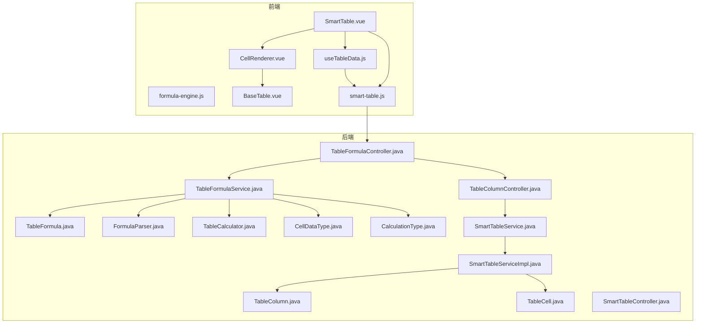
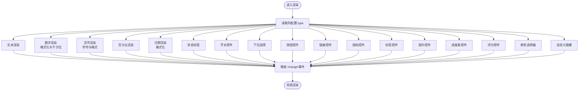
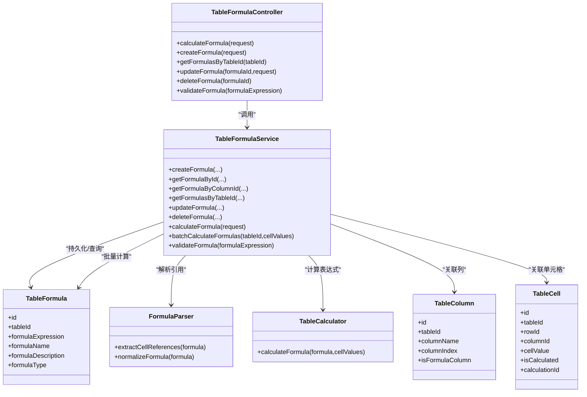
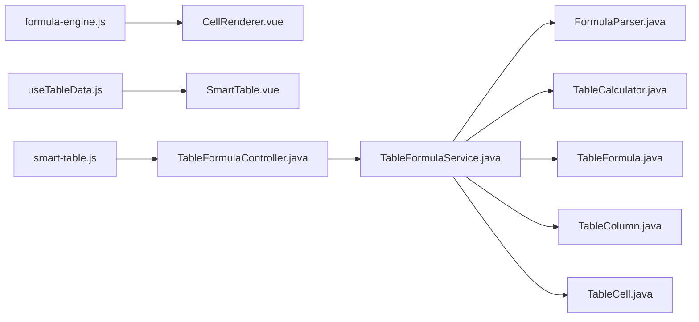

# 智能表格组件

<cite>
**本文引用的文件**
- [SmartTable.vue](file://07-frontend/src/components/smart-table/SmartTable.vue)
- [CellRenderer.vue](file://07-frontend/src/components/smart-table/CellRenderer.vue)
- [useTableData.js](file://07-frontend/src/components/smart-table/hooks/useTableData.js)
- [formula-engine.js](file://07-frontend/src/utils/calculation/formula-engine.js)
- [smart-table.js](file://07-frontend/src/api/smart-table.js)
- [BaseTable.vue](file://07-frontend/src/components/common/tables/BaseTable.vue)
- [TableFormulaController.java](file://08-backend/src/main/java/com/enterprise/brain/modules/smart-table/controller/TableFormulaController.java)
- [FormulaCalculateRequest.java](file://08-backend/src/main/java/com/enterprise/brain/modules/smart-table/dto/request/FormulaCalculateRequest.java)
- [FormulaResultResponse.java](file://08-backend/src/main/java/com/enterprise/brain/modules/smart-table/dto/response/FormulaResultResponse.java)
- [FormulaParser.java](file://08-backend/src/main/java/com/enterprise/brain/modules/smart-table/util/FormulaParser.java)
- [TableCalculator.java](file://08-backend/src/main/java/com/enterprise/brain/modules/smart-table/util/TableCalculator.java)
- [TableFormula.java](file://08-backend/src/main/java/com/enterprise/brain/modules/smarttable/entity/TableFormula.java)
- [TableColumn.java](file://08-backend/src/main/java/com/enterprise/brain/modules/smarttable/entity/TableColumn.java)
- [TableCell.java](file://08-backend/src/main/java/com/enterprise/brain/modules/smarttable/entity/TableCell.java)
- [TableFormulaService.java](file://08-backend/src/main/java/com/enterprise/brain/modules/smart-table/service/TableFormulaService.java)
- [TableColumnService.java](file://08-backend/src/main/java/com/enterprise/brain/modules/smart-table/service/TableColumnService.java)
- [TableColumnController.java](file://08-backend/src/main/java/com/enterprise/brain/modules/smart-table/controller/TableColumnController.java)
- [SmartTableController.java](file://08-backend/src/main/java/com/enterprise/brain/modules/smart-table/controller/SmartTableController.java)
- [SmartTableService.java](file://08-backend/src/main/java/com/enterprise/brain/modules/smart-table/service/SmartTableService.java)
- [SmartTableServiceImpl.java](file://08-backend/src/main/java/com/enterprise/brain/modules/smart-table/service/impl/SmartTableServiceImpl.java)
- [CellDataType.java](file://08-backend/src/main/java/com/enterprise/brain/modules/smart-table/enums/CellDataType.java)
- [CalculationType.java](file://08-backend/src/main/java/com/enterprise/brain/modules/smart-table/enums/CalculationType.java)
</cite>

## 目录
1. [引言](#引言)
2. [项目结构](#项目结构)
3. [核心组件](#核心组件)
4. [架构总览](#架构总览)
5. [详细组件分析](#详细组件分析)
6. [依赖关系分析](#依赖关系分析)
7. [性能考量](#性能考量)
8. [故障排查指南](#故障排查指南)
9. [结论](#结论)
10. [附录](#附录)

## 引言
本文件深入剖析智能表格组件（SmartTable）的设计理念与核心技术，重点解释其与普通表格组件的差异，以及单元格渲染器（CellRenderer）的动态渲染机制。同时，文档详细说明 useTableData 等组合式 API 如何实现复杂数据处理与状态管理，并阐述智能表格支持的公式计算、跨单元格引用、数据联动等高级功能的实现原理。最后，提供典型业务场景的应用示例，如财务报表、预算编制等。

## 项目结构
智能表格相关代码主要分布在前端组件与后端服务两部分：
- 前端：SmartTable 主组件、CellRenderer 渲染器、useTableData 组合式 API、公式引擎与通用表格基座组件
- 后端：公式计算接口、公式实体与仓库、列与单元格实体、服务层与控制器



图示来源
- [SmartTable.vue](file://07-frontend/src/components/smart-table/SmartTable.vue#L1-L46)
- [CellRenderer.vue](file://07-frontend/src/components/smart-table/CellRenderer.vue#L1-L136)
- [useTableData.js](file://07-frontend/src/components/smart-table/hooks/useTableData.js#L1-L33)
- [formula-engine.js](file://07-frontend/src/utils/calculation/formula-engine.js#L1-L212)
- [BaseTable.vue](file://07-frontend/src/components/common/tables/BaseTable.vue#L1-L124)
- [smart-table.js](file://07-frontend/src/api/smart-table.js#L1-L49)
- [TableFormulaController.java](file://08-backend/src/main/java/com/enterprise/brain/modules/smart-table/controller/TableFormulaController.java#L1-L44)
- [TableFormulaService.java](file://08-backend/src/main/java/com/enterprise/brain/modules/smart-table/service/TableFormulaService.java#L1-L29)
- [TableFormula.java](file://08-backend/src/main/java/com/enterprise/brain/modules/smarttable/entity/TableFormula.java#L1-L23)
- [TableColumn.java](file://08-backend/src/main/java/com/enterprise/brain/modules/smarttable/entity/TableColumn.java)
- [TableCell.java](file://08-backend/src/main/java/com/enterprise/brain/modules/smarttable/entity/TableCell.java#L1-L28)
- [TableColumnController.java](file://08-backend/src/main/java/com/enterprise/brain/modules/smart-table/controller/TableColumnController.java#L1-L46)
- [SmartTableService.java](file://08-backend/src/main/java/com/enterprise/brain/modules/smart-table/service/SmartTableService.java#L1-L29)
- [SmartTableServiceImpl.java](file://08-backend/src/main/java/com/enterprise/brain/modules/smart-table/service/impl/SmartTableServiceImpl.java#L14-L54)
- [FormulaParser.java](file://08-backend/src/main/java/com/enterprise/brain/modules/smart-table/util/FormulaParser.java#L1-L44)
- [TableCalculator.java](file://08-backend/src/main/java/com/enterprise/brain/modules/smart-table/util/TableCalculator.java#L1-L40)
- [CellDataType.java](file://08-backend/src/main/java/com/enterprise/brain/modules/smart-table/enums/CellDataType.java#L1-L61)
- [CalculationType.java](file://08-backend/src/main/java/com/enterprise/brain/modules/smart-table/enums/CalculationType.java#L1-L31)

章节来源
- [SmartTable.vue](file://07-frontend/src/components/smart-table/SmartTable.vue#L1-L46)
- [CellRenderer.vue](file://07-frontend/src/components/smart-table/CellRenderer.vue#L1-L136)
- [useTableData.js](file://07-frontend/src/components/smart-table/hooks/useTableData.js#L1-L33)
- [formula-engine.js](file://07-frontend/src/utils/calculation/formula-engine.js#L1-L212)
- [BaseTable.vue](file://07-frontend/src/components/common/tables/BaseTable.vue#L1-L124)
- [smart-table.js](file://07-frontend/src/api/smart-table.js#L1-L49)
- [TableFormulaController.java](file://08-backend/src/main/java/com/enterprise/brain/modules/smart-table/controller/TableFormulaController.java#L1-L44)
- [TableFormulaService.java](file://08-backend/src/main/java/com/enterprise/brain/modules/smart-table/service/TableFormulaService.java#L1-L29)
- [TableFormula.java](file://08-backend/src/main/java/com/enterprise/brain/modules/smarttable/entity/TableFormula.java#L1-L23)
- [TableColumn.java](file://08-backend/src/main/java/com/enterprise/brain/modules/smarttable/entity/TableColumn.java)
- [TableCell.java](file://08-backend/src/main/java/com/enterprise/brain/modules/smarttable/entity/TableCell.java#L1-L28)
- [TableColumnController.java](file://08-backend/src/main/java/com/enterprise/brain/modules/smart-table/controller/TableColumnController.java#L1-L46)
- [SmartTableService.java](file://08-backend/src/main/java/com/enterprise/brain/modules/smart-table/service/SmartTableService.java#L1-L29)
- [SmartTableServiceImpl.java](file://08-backend/src/main/java/com/enterprise/brain/modules/smart-table/service/impl/SmartTableServiceImpl.java#L14-L54)
- [FormulaParser.java](file://08-backend/src/main/java/com/enterprise/brain/modules/smart-table/util/FormulaParser.java#L1-L44)
- [TableCalculator.java](file://08-backend/src/main/java/com/enterprise/brain/modules/smart-table/util/TableCalculator.java#L1-L40)
- [CellDataType.java](file://08-backend/src/main/java/com/enterprise/brain/modules/smart-table/enums/CellDataType.java#L1-L61)
- [CalculationType.java](file://08-backend/src/main/java/com/enterprise/brain/modules/smart-table/enums/CalculationType.java#L1-L31)

## 核心组件
- SmartTable 主组件：负责组织工具栏、编辑器、列管理器，协调数据加载与保存流程，并通过 useTableData 提供统一的数据状态管理。
- CellRenderer 渲染器：根据列配置的类型动态渲染不同 UI 控件（文本、数字、货币、百分比、日期、状态标签、开关、下拉、按钮、链接、图标、标签、图片、进度条、评分、颜色选择器等），并发出变更事件以驱动上层联动。
- useTableData 组合式 API：封装表格数据与列的加载、状态与错误处理，提供可复用的数据访问能力。
- 前端公式引擎：提供基础数学、逻辑、文本、日期函数与表达式安全计算能力，支持变量替换与函数解析。
- 后端公式服务与控制器：提供公式校验、计算、查询与持久化能力，支持跨单元格引用与批量计算。

章节来源
- [SmartTable.vue](file://07-frontend/src/components/smart-table/SmartTable.vue#L1-L46)
- [CellRenderer.vue](file://07-frontend/src/components/smart-table/CellRenderer.vue#L1-L136)
- [useTableData.js](file://07-frontend/src/components/smart-table/hooks/useTableData.js#L1-L33)
- [formula-engine.js](file://07-frontend/src/utils/calculation/formula-engine.js#L1-L212)
- [TableFormulaController.java](file://08-backend/src/main/java/com/enterprise/brain/modules/smart-table/controller/TableFormulaController.java#L1-L44)

## 架构总览
智能表格采用“前端渲染 + 后端计算”的分层架构：
- 前端负责 UI 展示、交互与本地公式计算，通过 API 与后端通信
- 后端负责公式解析、跨单元格引用提取、表达式安全计算与持久化

```mermaid
sequenceDiagram
participant UI as "SmartTable.vue"
participant API as "smart-table.js"
participant BE as "TableFormulaController.java"
participant SVC as "TableFormulaService.java"
participant PAR as "FormulaParser.java"
participant CAL as "TableCalculator.java"
UI->>API : 请求表格数据/列配置
API-->>UI : 返回 rows/columns
UI->>BE : 发送公式计算请求(含单元格值映射)
BE->>SVC : 调用服务层计算
SVC->>PAR : 提取单元格引用
SVC->>CAL : 执行表达式替换与计算
CAL-->>SVC : 返回计算结果
SVC-->>BE : 返回结果响应
BE-->>UI : 返回计算结果
```

图示来源
- [SmartTable.vue](file://07-frontend/src/components/smart-table/SmartTable.vue#L1-L46)
- [smart-table.js](file://07-frontend/src/api/smart-table.js#L1-L49)
- [TableFormulaController.java](file://08-backend/src/main/java/com/enterprise/brain/modules/smart-table/controller/TableFormulaController.java#L1-L44)
- [TableFormulaService.java](file://08-backend/src/main/java/com/enterprise/brain/modules/smart-table/service/TableFormulaService.java#L1-L29)
- [FormulaParser.java](file://08-backend/src/main/java/com/enterprise/brain/modules/smart-table/util/FormulaParser.java#L1-L44)
- [TableCalculator.java](file://08-backend/src/main/java/com/enterprise/brain/modules/smart-table/util/TableCalculator.java#L1-L40)

## 详细组件分析

### SmartTable 主组件
- 职责：承载工具栏、编辑器、列管理器；通过 useTableData 获取数据与列；在挂载时加载表格数据；暴露保存与创建列等事件处理。
- 关键点：使用组合式 API 管理状态，简化生命周期与数据流；通过事件向上抛出单元格更新，便于上层联动。

章节来源
- [SmartTable.vue](file://07-frontend/src/components/smart-table/SmartTable.vue#L1-L46)
- [useTableData.js](file://07-frontend/src/components/smart-table/hooks/useTableData.js#L1-L33)

### CellRenderer 单元格渲染器
- 动态渲染机制：根据列配置的 type 字段选择对应渲染模板，支持多种控件与格式化输出；通过 emits 事件向父组件传递变更，实现双向联动。
- 格式化与样式：提供数字、货币、百分比、日期等格式化方法；根据列配置生成样式（如对齐、字体、颜色）。
- 交互事件：针对不同控件发出 switch-change、select-change、color-change、button-click、link-click 等事件，便于上层处理业务逻辑。



图示来源
- [CellRenderer.vue](file://07-frontend/src/components/smart-table/CellRenderer.vue#L1-L136)

章节来源
- [CellRenderer.vue](file://07-frontend/src/components/smart-table/CellRenderer.vue#L1-L136)

### useTableData 组合式 API
- 数据加载：封装请求工具，异步获取表格数据与列配置，设置 loading 状态与错误处理。
- 状态暴露：返回 tableData、columns、loading 与 fetchTableData 方法，便于在组件中直接使用。
- 与后端对接：通过 API 层访问后端接口，支持后续扩展（如分页、过滤、排序）。

章节来源
- [useTableData.js](file://07-frontend/src/components/smart-table/hooks/useTableData.js#L1-L33)
- [smart-table.js](file://07-frontend/src/api/smart-table.js#L1-L49)

### 前端公式引擎（FormulaEngine）
- 函数库：内置 SUM、AVG、MAX、MIN、ROUND、ABS、SQRT、POW、IF、AND、OR、NOT、CONCAT、LENGTH、SUBSTRING、TODAY、DATEDIF 等常用函数。
- 变量替换：支持将变量映射到表达式中，再进行函数解析与表达式安全计算。
- 安全评估：通过正则与白名单限制表达式字符，避免注入风险；提供 validate 与 extractVariables 辅助校验与变量提取。
- 计算表达式：提供 calculateExpression 的简单安全计算入口。

章节来源
- [formula-engine.js](file://07-frontend/src/utils/calculation/formula-engine.js#L1-L212)

### 后端公式计算链路
- 控制器：提供公式计算、保存、查询、更新、删除与校验接口，统一对外暴露。
- 服务层：封装公式实体、列与单元格实体的关系，提供批量计算与校验能力。
- 解析与计算：利用 FormulaParser 提取单元格引用，使用 TableCalculator 标准化公式并替换引用值后计算，返回结果与错误信息。
- 实体与枚举：定义表格、列、单元格、公式、数据类型与计算类型的实体与枚举，支撑业务模型。



图示来源
- [TableFormulaController.java](file://08-backend/src/main/java/com/enterprise/brain/modules/smart-table/controller/TableFormulaController.java#L1-L44)
- [TableFormulaService.java](file://08-backend/src/main/java/com/enterprise/brain/modules/smart-table/service/TableFormulaService.java#L1-L29)
- [FormulaParser.java](file://08-backend/src/main/java/com/enterprise/brain/modules/smart-table/util/FormulaParser.java#L1-L44)
- [TableCalculator.java](file://08-backend/src/main/java/com/enterprise/brain/modules/smart-table/util/TableCalculator.java#L1-L40)
- [TableFormula.java](file://08-backend/src/main/java/com/enterprise/brain/modules/smarttable/entity/TableFormula.java#L1-L23)
- [TableColumn.java](file://08-backend/src/main/java/com/enterprise/brain/modules/smarttable/entity/TableColumn.java)
- [TableCell.java](file://08-backend/src/main/java/com/enterprise/brain/modules/smarttable/entity/TableCell.java#L1-L28)

章节来源
- [TableFormulaController.java](file://08-backend/src/main/java/com/enterprise/brain/modules/smart-table/controller/TableFormulaController.java#L1-L44)
- [TableFormulaService.java](file://08-backend/src/main/java/com/enterprise/brain/modules/smart-table/service/TableFormulaService.java#L1-L29)
- [FormulaParser.java](file://08-backend/src/main/java/com/enterprise/brain/modules/smart-table/util/FormulaParser.java#L1-L44)
- [TableCalculator.java](file://08-backend/src/main/java/com/enterprise/brain/modules/smart-table/util/TableCalculator.java#L1-L40)
- [TableFormula.java](file://08-backend/src/main/java/com/enterprise/brain/modules/smarttable/entity/TableFormula.java#L1-L23)
- [TableColumn.java](file://08-backend/src/main/java/com/enterprise/brain/modules/smarttable/entity/TableColumn.java)
- [TableCell.java](file://08-backend/src/main/java/com/enterprise/brain/modules/smarttable/entity/TableCell.java#L1-L28)

### 与通用表格组件的差异
- 渲染能力：SmartTable 的 CellRenderer 支持多种控件与格式化，而通用 BaseTable 侧重列配置与事件透传。
- 交互联动：SmartTable 通过 CellRenderer 的事件与 useTableData 的状态管理，实现更丰富的数据联动与公式计算。
- 业务扩展：SmartTable 集成公式引擎与后端计算服务，满足财务报表、预算编制等复杂场景。

章节来源
- [CellRenderer.vue](file://07-frontend/src/components/smart-table/CellRenderer.vue#L1-L136)
- [BaseTable.vue](file://07-frontend/src/components/common/tables/BaseTable.vue#L1-L124)

## 依赖关系分析
- 前端依赖：SmartTable 依赖 CellRenderer、useTableData 与 API；CellRenderer 依赖 Element Plus 组件与 dayjs；FormulaEngine 为纯前端计算工具。
- 后端依赖：TableFormulaController 依赖 TableFormulaService；服务层依赖 FormulaParser、TableCalculator、实体与仓库；控制器与服务层分别对应前端 API 与渲染器。



图示来源
- [formula-engine.js](file://07-frontend/src/utils/calculation/formula-engine.js#L1-L212)
- [CellRenderer.vue](file://07-frontend/src/components/smart-table/CellRenderer.vue#L1-L136)
- [useTableData.js](file://07-frontend/src/components/smart-table/hooks/useTableData.js#L1-L33)
- [SmartTable.vue](file://07-frontend/src/components/smart-table/SmartTable.vue#L1-L46)
- [smart-table.js](file://07-frontend/src/api/smart-table.js#L1-L49)
- [TableFormulaController.java](file://08-backend/src/main/java/com/enterprise/brain/modules/smart-table/controller/TableFormulaController.java#L1-L44)
- [TableFormulaService.java](file://08-backend/src/main/java/com/enterprise/brain/modules/smart-table/service/TableFormulaService.java#L1-L29)
- [FormulaParser.java](file://08-backend/src/main/java/com/enterprise/brain/modules/smart-table/util/FormulaParser.java#L1-L44)
- [TableCalculator.java](file://08-backend/src/main/java/com/enterprise/brain/modules/smart-table/util/TableCalculator.java#L1-L40)
- [TableFormula.java](file://08-backend/src/main/java/com/enterprise/brain/modules/smarttable/entity/TableFormula.java#L1-L23)
- [TableColumn.java](file://08-backend/src/main/java/com/enterprise/brain/modules/smarttable/entity/TableColumn.java)
- [TableCell.java](file://08-backend/src/main/java/com/enterprise/brain/modules/smarttable/entity/TableCell.java#L1-L28)

章节来源
- [formula-engine.js](file://07-frontend/src/utils/calculation/formula-engine.js#L1-L212)
- [CellRenderer.vue](file://07-frontend/src/components/smart-table/CellRenderer.vue#L1-L136)
- [useTableData.js](file://07-frontend/src/components/smart-table/hooks/useTableData.js#L1-L33)
- [SmartTable.vue](file://07-frontend/src/components/smart-table/SmartTable.vue#L1-L46)
- [smart-table.js](file://07-frontend/src/api/smart-table.js#L1-L49)
- [TableFormulaController.java](file://08-backend/src/main/java/com/enterprise/brain/modules/smart-table/controller/TableFormulaController.java#L1-L44)
- [TableFormulaService.java](file://08-backend/src/main/java/com/enterprise/brain/modules/smart-table/service/TableFormulaService.java#L1-L29)
- [FormulaParser.java](file://08-backend/src/main/java/com/enterprise/brain/modules/smart-table/util/FormulaParser.java#L1-L44)
- [TableCalculator.java](file://08-backend/src/main/java/com/enterprise/brain/modules/smart-table/util/TableCalculator.java#L1-L40)
- [TableFormula.java](file://08-backend/src/main/java/com/enterprise/brain/modules/smarttable/entity/TableFormula.java#L1-L23)
- [TableColumn.java](file://08-backend/src/main/java/com/enterprise/brain/modules/smarttable/entity/TableColumn.java)
- [TableCell.java](file://08-backend/src/main/java/com/enterprise/brain/modules/smarttable/entity/TableCell.java#L1-L28)

## 性能考量
- 前端渲染优化：CellRenderer 通过 computed 生成样式与预览列表，减少重复计算；BaseTable 仅渲染可见列，降低 DOM 压力。
- 公式计算安全：前端 FormulaEngine 对表达式进行白名单校验与安全计算；后端 FormulaParser 与 TableCalculator 在解析与替换阶段严格处理异常，避免阻塞。
- 数据加载：useTableData 使用 loading 状态与 try/catch 错误捕获，避免 UI 卡顿；建议结合分页与懒加载策略进一步优化大数据集性能。

[本节为通用指导，无需列出具体文件来源]

## 故障排查指南
- 公式计算失败：检查 FormulaEngine.validate 与后端 FormulaParser 的合法性校验；确认表达式字符是否符合白名单；核对单元格引用是否存在于 cellValues 映射。
- 数据加载异常：确认 API 层请求路径与返回结构；检查 useTableData 的 loading 与错误日志；核对后端控制器返回值与服务层异常处理。
- 渲染异常：检查 CellRenderer 的列配置 type 与 options；确认事件发射与父组件监听是否正确；核对 Element Plus 组件属性与样式覆盖。

章节来源
- [formula-engine.js](file://07-frontend/src/utils/calculation/formula-engine.js#L1-L212)
- [TableFormulaController.java](file://08-backend/src/main/java/com/enterprise/brain/modules/smart-table/controller/TableFormulaController.java#L1-L44)
- [FormulaParser.java](file://08-backend/src/main/java/com/enterprise/brain/modules/smart-table/util/FormulaParser.java#L1-L44)
- [CellRenderer.vue](file://07-frontend/src/components/smart-table/CellRenderer.vue#L1-L136)
- [useTableData.js](file://07-frontend/src/components/smart-table/hooks/useTableData.js#L1-L33)

## 结论
智能表格组件通过“前端渲染 + 后端计算”的协同设计，实现了强大的动态渲染、公式计算与跨单元格引用能力。CellRenderer 的多类型控件与格式化输出，配合 useTableData 的状态管理与 FormulaEngine 的安全计算，使得财务报表、预算编制等复杂业务场景得以高效落地。后端通过 FormulaParser 与 TableCalculator 提供稳健的公式解析与计算保障，确保系统在安全性与性能之间取得平衡。

[本节为总结性内容，无需列出具体文件来源]

## 附录
- 典型业务场景示例
  - 财务报表：利用 CellRenderer 的货币与百分比格式化，结合后端公式计算实现资产负债表、利润表等自动汇总。
  - 预算编制：通过列配置与公式字段，实现预算与执行差异的自动计算与预警提示。
  - 数据联动：CellRenderer 的事件发射与 useTableData 的状态管理，支持跨行/跨列联动更新与实时反馈。

[本节为概念性内容，无需列出具体文件来源]