# 组件架构

<cite>
**本文档引用的文件**
- [Breadcrumb.vue](file://07-frontend/src/components/common/Breadcrumb.vue)
- [Navbar.vue](file://07-frontend/src/components/common/Navbar.vue)
- [Sidebar.vue](file://07-frontend/src/components/common/Sidebar.vue)
- [Pagination.vue](file://07-frontend/src/components/common/Pagination.vue)
- [AddressSelector.vue](file://07-frontend/src/components/common/business/AddressSelector.vue)
- [FileUploader.vue](file://07-frontend/src/components/common/business/FileUploader.vue)
- [ProductSelector.vue](file://07-frontend/src/components/common/business/ProductSelector.vue)
- [BaseTable.vue](file://07-frontend/src/components/common/tables/BaseTable.vue)
- [EditableTable.vue](file://07-frontend/src/components/common/tables/EditableTable.vue)
- [VirtualTable.vue](file://07-frontend/src/components/common/tables/VirtualTable.vue)
- [BaseChart.vue](file://07-frontend/src/components/common/charts/BaseChart.vue)
- [KPIChart.vue](file://07-frontend/src/components/common/charts/KPIChart.vue)
- [Dashboard.vue](file://07-frontend/src/components/common/charts/Dashboard.vue)
- [ThemeProvider.vue](file://07-frontend/src/components/theme/ThemeProvider.vue)
- [SmartSelect.vue](file://07-frontend/src/components/SmartSelect.vue)
</cite>

## 目录
1. [通用组件架构](#通用组件架构)
2. [业务组件设计](#业务组件设计)
3. [表格组件体系](#表格组件体系)
4. [图表组件能力](#图表组件能力)
5. [主题与高级组件](#主题与高级组件)
6. [组件通信与组合](#组件通信与组合)

## 通用组件架构

通用组件是系统的基础构建块，为整个应用提供一致的UI风格和交互体验。这些组件遵循高内聚、低耦合的设计原则，通过props和emits实现灵活的配置和通信。

### 面包屑组件 (Breadcrumb)

面包屑组件用于展示当前页面在应用导航结构中的位置，帮助用户理解当前所处的层级并提供快速导航功能。该组件通过Vue Router的`useRoute`钩子获取当前路由信息，动态生成路径导航。

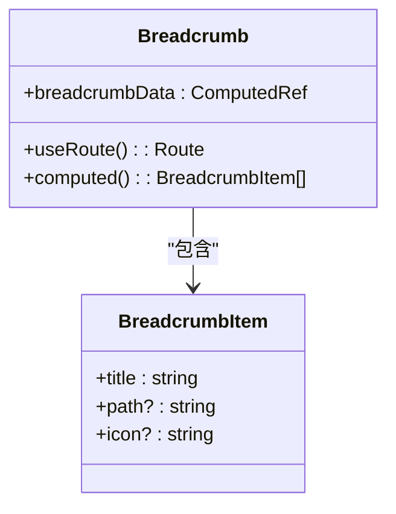
```mermaid
classDiagram
class Breadcrumb {
+breadcrumbData : ComputedRef<BreadcrumbItem[]>
+useRoute() : Route
+computed() : BreadcrumbItem[]
}
class BreadcrumbItem {
+title : string
+path? : string
+icon? : string
}
Breadcrumb --> BreadcrumbItem : "包含"
```

**组件来源**
- [Breadcrumb.vue](file://07-frontend/src/components/common/Breadcrumb.vue#L1-L70)

### 导航栏组件 (Navbar)

导航栏组件提供应用的主要导航功能，包含品牌标识、主导航菜单和用户信息区域。组件使用Element Plus的el-menu组件实现水平导航菜单，并通过el-dropdown组件实现用户下拉菜单。

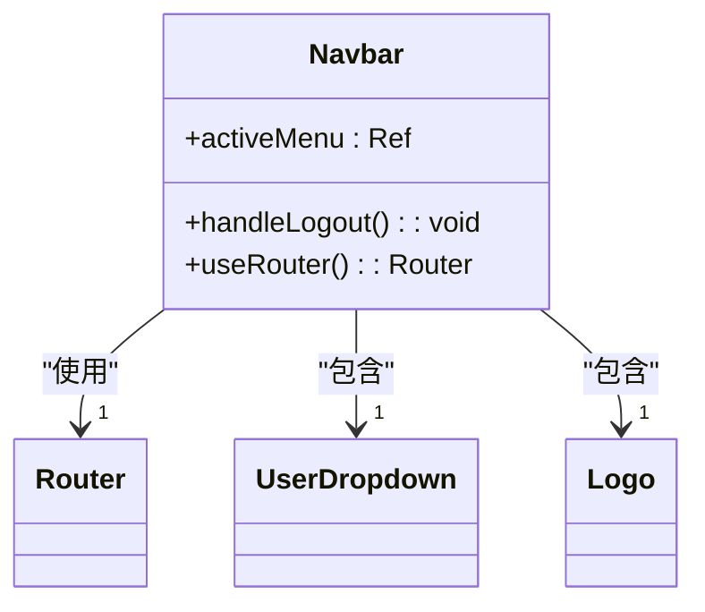
```mermaid
classDiagram
class Navbar {
+activeMenu : Ref<string>
+handleLogout() : void
+useRouter() : Router
}
Navbar --> "1" Router : "使用"
Navbar --> "1" UserDropdown : "包含"
Navbar --> "1" Logo : "包含"
```

**组件来源**
- [Navbar.vue](file://07-frontend/src/components/common/Navbar.vue#L1-L94)

### 侧边栏组件 (Sidebar)

侧边栏组件实现应用的垂直导航功能，支持菜单折叠/展开和权限过滤。组件通过计算属性`filteredMenuList`对菜单进行权限过滤，确保用户只能看到其有权限访问的菜单项。

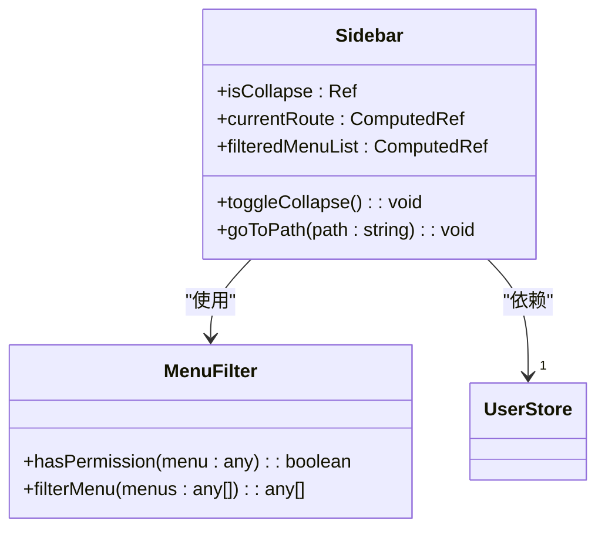
```mermaid
classDiagram
class Sidebar {
+isCollapse : Ref<boolean>
+currentRoute : ComputedRef<string>
+filteredMenuList : ComputedRef<any[]>
+toggleCollapse() : void
+goToPath(path : string) : void
}
class MenuFilter {
+hasPermission(menu : any) : boolean
+filterMenu(menus : any[]) : any[]
}
Sidebar --> MenuFilter : "使用"
Sidebar --> "1" UserStore : "依赖"
```

**组件来源**
- [Sidebar.vue](file://07-frontend/src/components/common/Sidebar.vue#L1-L136)

### 分页组件 (Pagination)

分页组件封装了分页逻辑，提供灵活的分页配置选项。组件通过计算属性`totalPages`计算总页数，并通过`v-model`双向绑定实现页码和每页条数的同步。

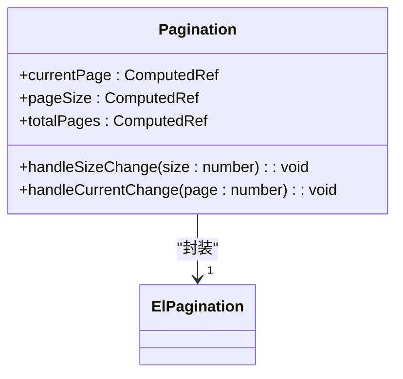
```mermaid
classDiagram
class Pagination {
+currentPage : ComputedRef<number>
+pageSize : ComputedRef<number>
+totalPages : ComputedRef<number>
+handleSizeChange(size : number) : void
+handleCurrentChange(page : number) : void
}
Pagination --> "1" ElPagination : "封装"
```

**组件来源**
- [Pagination.vue](file://07-frontend/src/components/common/Pagination.vue#L1-L110)

## 业务组件设计

业务组件是针对特定业务场景设计的复合组件，封装了复杂的业务逻辑和交互流程。

### 地址选择器 (AddressSelector)

地址选择器组件提供省市区三级联动选择功能，支持禁用、加载状态和详细地址输入。组件通过模拟数据实现三级联动，实际项目中应从API获取真实地址数据。

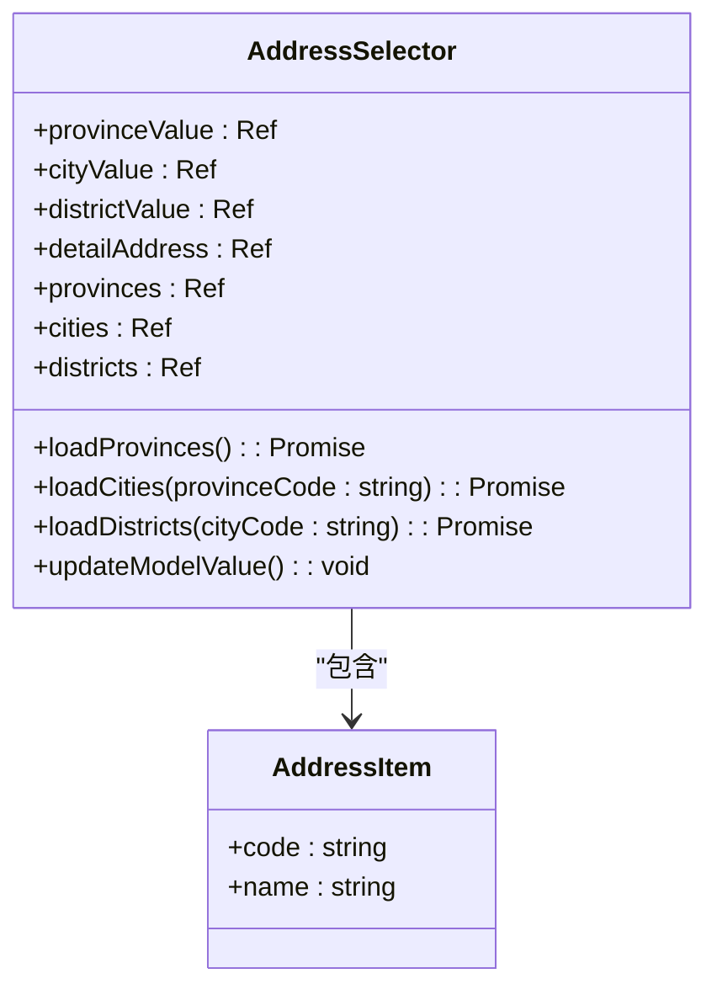
```mermaid
classDiagram
class AddressSelector {
+provinceValue : Ref<string>
+cityValue : Ref<string>
+districtValue : Ref<string>
+detailAddress : Ref<string>
+provinces : Ref<AddressItem[]>
+cities : Ref<AddressItem[]>
+districts : Ref<AddressItem[]>
+loadProvinces() : Promise<void>
+loadCities(provinceCode : string) : Promise<void>
+loadDistricts(cityCode : string) : Promise<void>
+updateModelValue() : void
}
class AddressItem {
+code : string
+name : string
}
AddressSelector --> AddressItem : "包含"
```

**组件来源**
- [AddressSelector.vue](file://07-frontend/src/components/common/business/AddressSelector.vue#L1-L338)

### 文件上传器 (FileUploader)

文件上传器组件提供拖拽上传、多文件上传和文件预览功能。组件支持图片和文档两种文件类型，并提供详细的上传状态反馈。

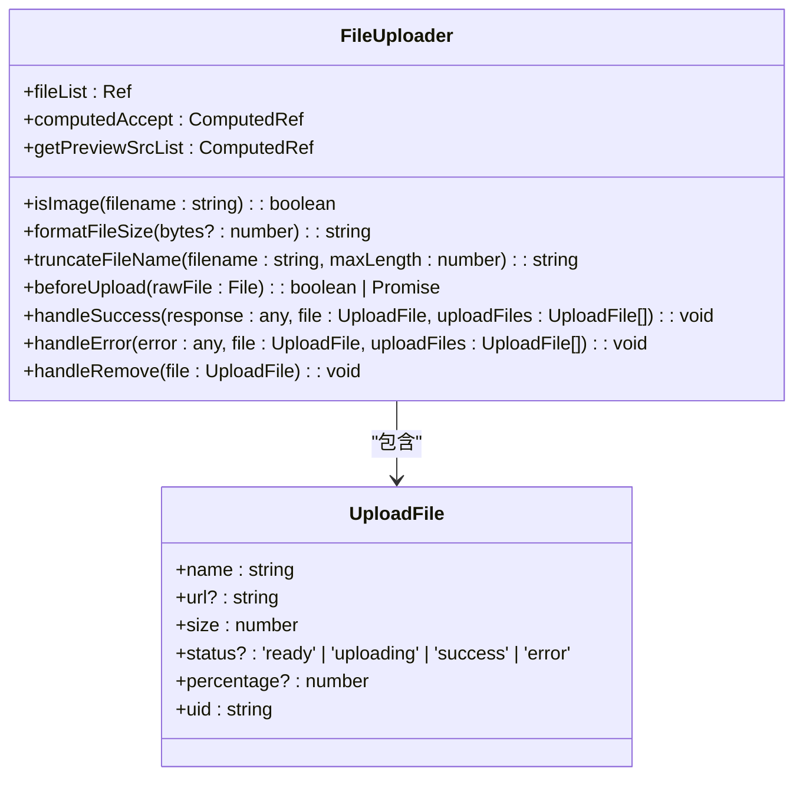
```mermaid
classDiagram
class FileUploader {
+fileList : Ref<UploadFile[]>
+computedAccept : ComputedRef<string>
+getPreviewSrcList : ComputedRef<string[]>
+isImage(filename : string) : boolean
+formatFileSize(bytes? : number) : string
+truncateFileName(filename : string, maxLength : number) : string
+beforeUpload(rawFile : File) : boolean | Promise<boolean>
+handleSuccess(response : any, file : UploadFile, uploadFiles : UploadFile[]) : void
+handleError(error : any, file : UploadFile, uploadFiles : UploadFile[]) : void
+handleRemove(file : UploadFile) : void
}
class UploadFile {
+name : string
+url? : string
+size : number
+status? : 'ready' | 'uploading' | 'success' | 'error'
+percentage? : number
+uid : string
}
FileUploader --> UploadFile : "包含"
```

**组件来源**
- [FileUploader.vue](file://07-frontend/src/components/common/business/FileUploader.vue#L1-L398)

### 产品选择器 (ProductSelector)

产品选择器组件提供产品选择功能，包含已选产品列表和产品选择弹窗。组件支持搜索、分页和批量操作，是典型的业务复合组件。

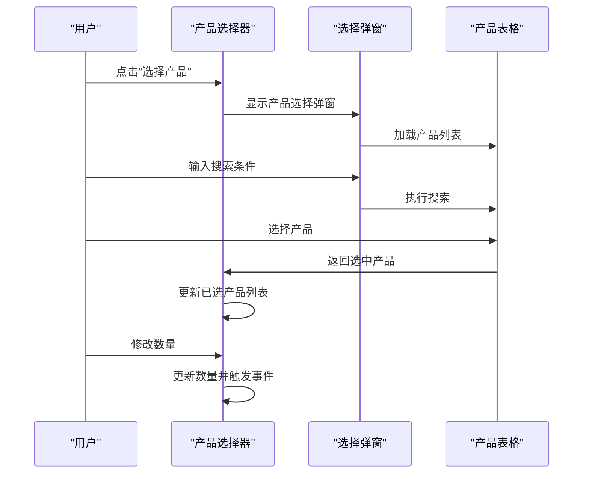
```mermaid
sequenceDiagram
participant User as "用户"
participant ProductSelector as "产品选择器"
participant Dialog as "选择弹窗"
participant Table as "产品表格"
User->>ProductSelector : 点击"选择产品"
ProductSelector->>Dialog : 显示产品选择弹窗
Dialog->>Table : 加载产品列表
User->>Dialog : 输入搜索条件
Dialog->>Table : 执行搜索
User->>Table : 选择产品
Table->>ProductSelector : 返回选中产品
ProductSelector->>ProductSelector : 更新已选产品列表
User->>ProductSelector : 修改数量
ProductSelector->>ProductSelector : 更新数量并触发事件
```

**组件来源**
- [ProductSelector.vue](file://07-frontend/src/components/common/business/ProductSelector.vue#L1-L131)

## 表格组件体系

表格组件体系采用分层设计，从基础表格到高级表格，逐层封装和扩展功能。

### 基础表格 (BaseTable)

基础表格组件封装了Element Plus的el-table组件，提供统一的配置接口和事件处理。组件支持选择列、序号列、操作列和分页功能。

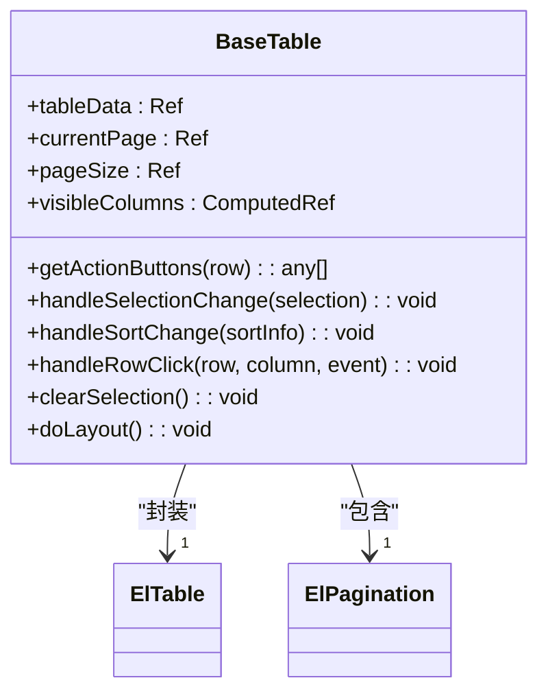
```mermaid
classDiagram
class BaseTable {
+tableData : Ref<any[]>
+currentPage : Ref<number>
+pageSize : Ref<number>
+visibleColumns : ComputedRef<any[]>
+getActionButtons(row) : any[]
+handleSelectionChange(selection) : void
+handleSortChange(sortInfo) : void
+handleRowClick(row, column, event) : void
+clearSelection() : void
+doLayout() : void
}
BaseTable --> "1" ElTable : "封装"
BaseTable --> "1" ElPagination : "包含"
```

**组件来源**
- [BaseTable.vue](file://07-frontend/src/components/common/tables/BaseTable.vue#L1-L422)

### 可编辑表格 (EditableTable)

可编辑表格组件基于基础表格构建，提供单元格编辑功能。组件支持多种编辑类型（输入框、数字输入、下拉选择等）和行操作（添加、删除）。

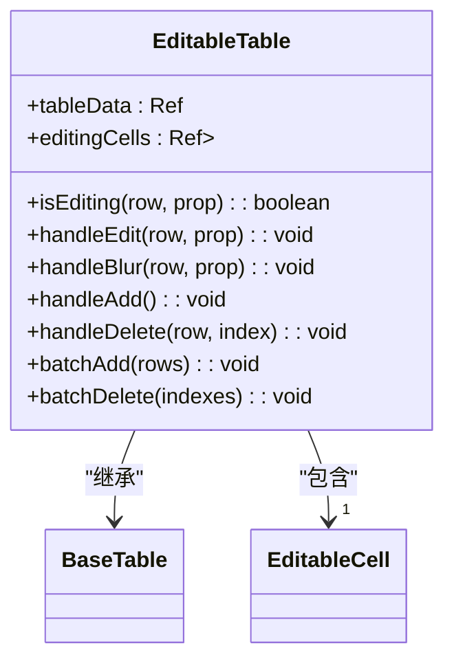
```mermaid
classDiagram
class EditableTable {
+tableData : Ref<any[]>
+editingCells : Ref<Set<string>>
+isEditing(row, prop) : boolean
+handleEdit(row, prop) : void
+handleBlur(row, prop) : void
+handleAdd() : void
+handleDelete(row, index) : void
+batchAdd(rows) : void
+batchDelete(indexes) : void
}
EditableTable --> BaseTable : "继承"
EditableTable --> "1" EditableCell : "包含"
```

**组件来源**
- [EditableTable.vue](file://07-frontend/src/components/common/tables/EditableTable.vue#L1-L348)

### 虚拟表格 (VirtualTable)

虚拟表格组件实现大数据量的高效渲染，通过虚拟滚动技术只渲染可视区域的行，显著提升性能。组件计算可见行数和偏移量，实现流畅的滚动体验。

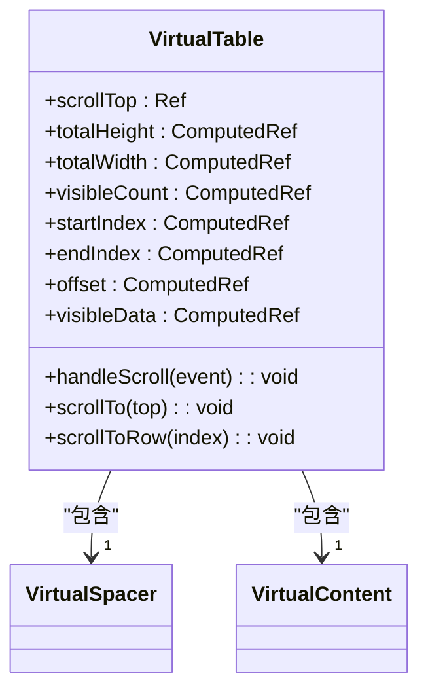
```mermaid
classDiagram
class VirtualTable {
+scrollTop : Ref<number>
+totalHeight : ComputedRef<number>
+totalWidth : ComputedRef<number>
+visibleCount : ComputedRef<number>
+startIndex : ComputedRef<number>
+endIndex : ComputedRef<number>
+offset : ComputedRef<number>
+visibleData : ComputedRef<any[]>
+handleScroll(event) : void
+scrollTo(top) : void
+scrollToRow(index) : void
}
VirtualTable --> "1" VirtualSpacer : "包含"
VirtualTable --> "1" VirtualContent : "包含"
```

**组件来源**
- [VirtualTable.vue](file://07-frontend/src/components/common/tables/VirtualTable.vue#L1-L272)

## 图表组件能力

图表组件提供数据可视化能力，支持KPI指标展示和趋势分析。

### 基础图表 (BaseChart)

基础图表组件提供统一的图表容器，处理加载、错误和空数据状态。组件支持响应式设计和图表实例管理。

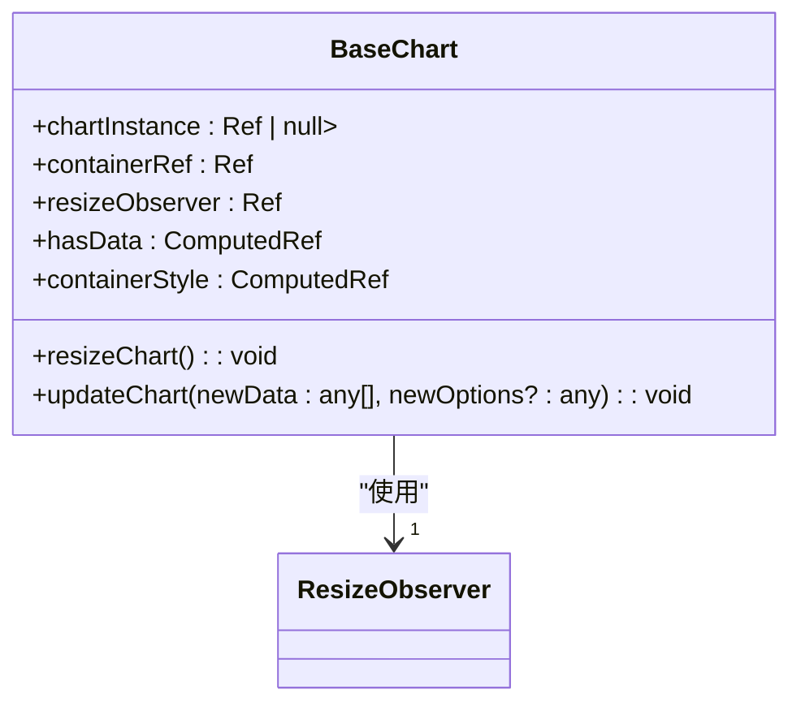
```mermaid
classDiagram
class BaseChart {
+chartInstance : Ref<InstanceType<any> | null>
+containerRef : Ref<HTMLElement | null>
+resizeObserver : Ref<ResizeObserver | null>
+hasData : ComputedRef<boolean>
+containerStyle : ComputedRef<object>
+resizeChart() : void
+updateChart(newData : any[], newOptions? : any) : void
}
BaseChart --> "1" ResizeObserver : "使用"
```

**组件来源**
- [BaseChart.vue](file://07-frontend/src/components/common/charts/BaseChart.vue#L1-L153)

### KPI图表 (KPIChart)

KPI图表组件结合数值指标和趋势图表，提供全面的数据洞察。组件支持多种格式化类型和图表类型（折线图、面积图）。

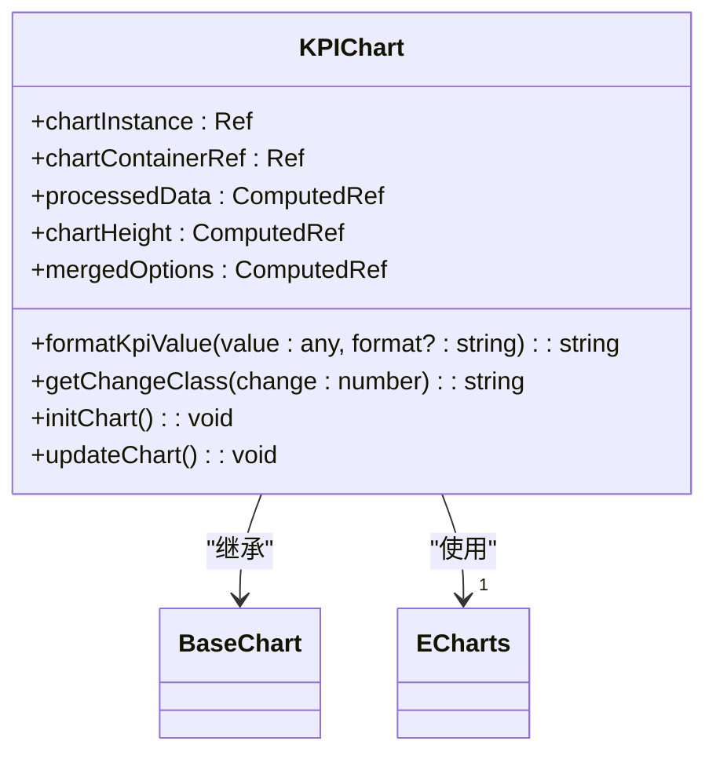
```mermaid
classDiagram
class KPIChart {
+chartInstance : Ref<echarts.ECharts | null>
+chartContainerRef : Ref<HTMLElement | null>
+processedData : ComputedRef<any[]>
+chartHeight : ComputedRef<string>
+mergedOptions : ComputedRef<echarts.EChartsOption>
+formatKpiValue(value : any, format? : string) : string
+getChangeClass(change : number) : string
+initChart() : void
+updateChart() : void
}
KPIChart --> BaseChart : "继承"
KPIChart --> "1" ECharts : "使用"
```

**组件来源**
- [KPIChart.vue](file://07-frontend/src/components/common/charts/KPIChart.vue#L1-L441)

### 仪表盘 (Dashboard)

仪表盘组件提供KPI指标和图表的布局容器，支持响应式网格布局和加载状态。组件通过CSS Grid实现灵活的布局。

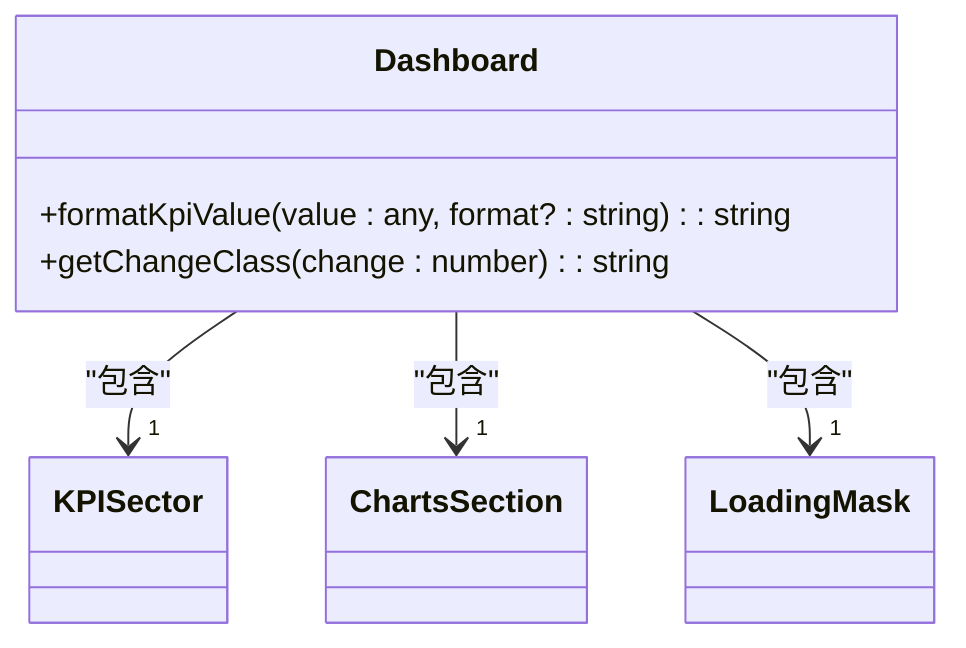
```mermaid
classDiagram
class Dashboard {
+formatKpiValue(value : any, format? : string) : string
+getChangeClass(change : number) : string
}
Dashboard --> "1" KPISector : "包含"
Dashboard --> "1" ChartsSection : "包含"
Dashboard --> "1" LoadingMask : "包含"
```

**组件来源**
- [Dashboard.vue](file://07-frontend/src/components/common/charts/Dashboard.vue#L1-L268)

## 主题与高级组件

### 主题提供者 (ThemeProvider)

主题提供者组件实现应用的主题管理功能，支持多种预设主题和自定义主题。组件使用CSS变量和Vue的provide/inject机制实现主题的全局应用。

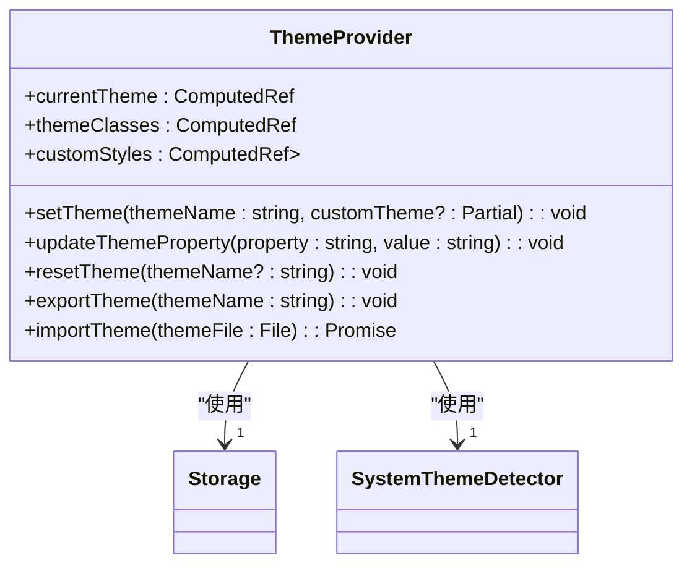
```mermaid
classDiagram
class ThemeProvider {
+currentTheme : ComputedRef<CustomTheme>
+themeClasses : ComputedRef<string[]>
+customStyles : ComputedRef<Record<string, string>>
+setTheme(themeName : string, customTheme? : Partial<CustomTheme>) : void
+updateThemeProperty(property : string, value : string) : void
+resetTheme(themeName? : string) : void
+exportTheme(themeName : string) : void
+importTheme(themeFile : File) : Promise<any>
}
ThemeProvider --> "1" Storage : "使用"
ThemeProvider --> "1" SystemThemeDetector : "使用"
```

**组件来源**
- [ThemeProvider.vue](file://07-frontend/src/components/theme/ThemeProvider.vue#L1-L326)

### 智能选择器 (SmartSelect)

智能选择器组件扩展了Element Plus的el-select组件，提供更灵活的配置选项和远程搜索功能。组件支持自定义过滤方法和选项渲染。

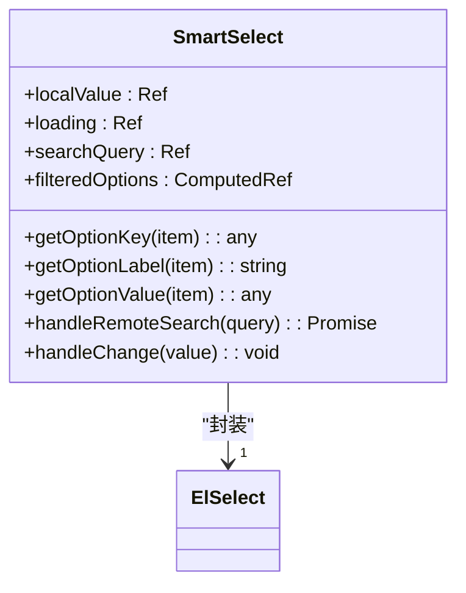
```mermaid
classDiagram
class SmartSelect {
+localValue : Ref<any>
+loading : Ref<boolean>
+searchQuery : Ref<string>
+filteredOptions : ComputedRef<any[]>
+getOptionKey(item) : any
+getOptionLabel(item) : string
+getOptionValue(item) : any
+handleRemoteSearch(query) : Promise<void>
+handleChange(value) : void
}
SmartSelect --> "1" ElSelect : "封装"
```

**组件来源**
- [SmartSelect.vue](file://07-frontend/src/components/SmartSelect.vue#L1-L268)

## 组件通信与组合

组件间的通信主要通过props和emits实现，遵循单向数据流原则。父组件通过props向子组件传递数据，子组件通过emits向父组件发送事件。

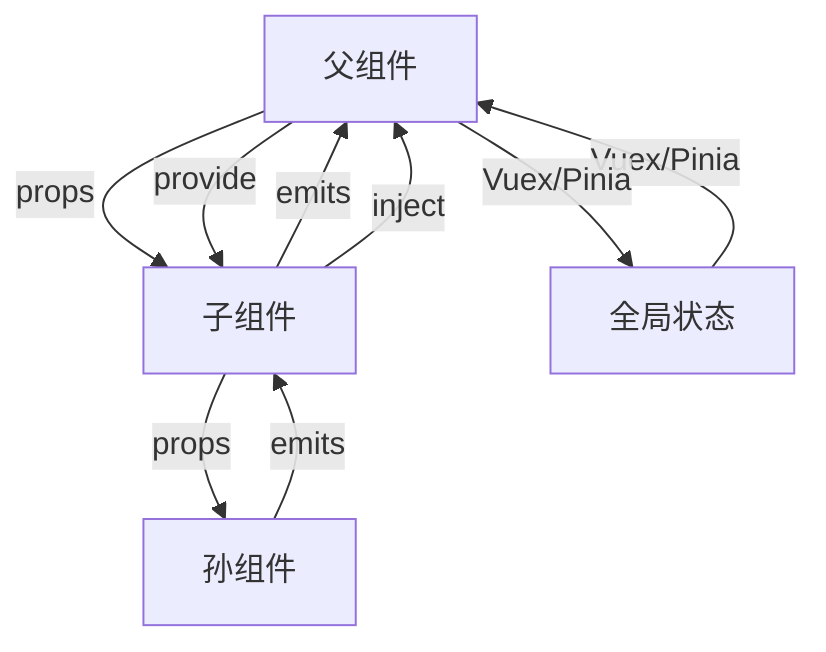
```mermaid
flowchart TD
A[父组件] --> |props| B[子组件]
B --> |emits| A
B --> |props| C[孙组件]
C --> |emits| B
A --> |provide| B
B --> |inject| A
D[全局状态] --> |Vuex/Pinia| A
A --> |Vuex/Pinia| D
```

组件组合通过slot机制实现，允许父组件向子组件注入自定义内容。这种设计模式提高了组件的灵活性和复用性。

**组件来源**
- [PageLayout.vue](file://07-frontend/src/components/common/layout/PageLayout.vue#L1-L194)