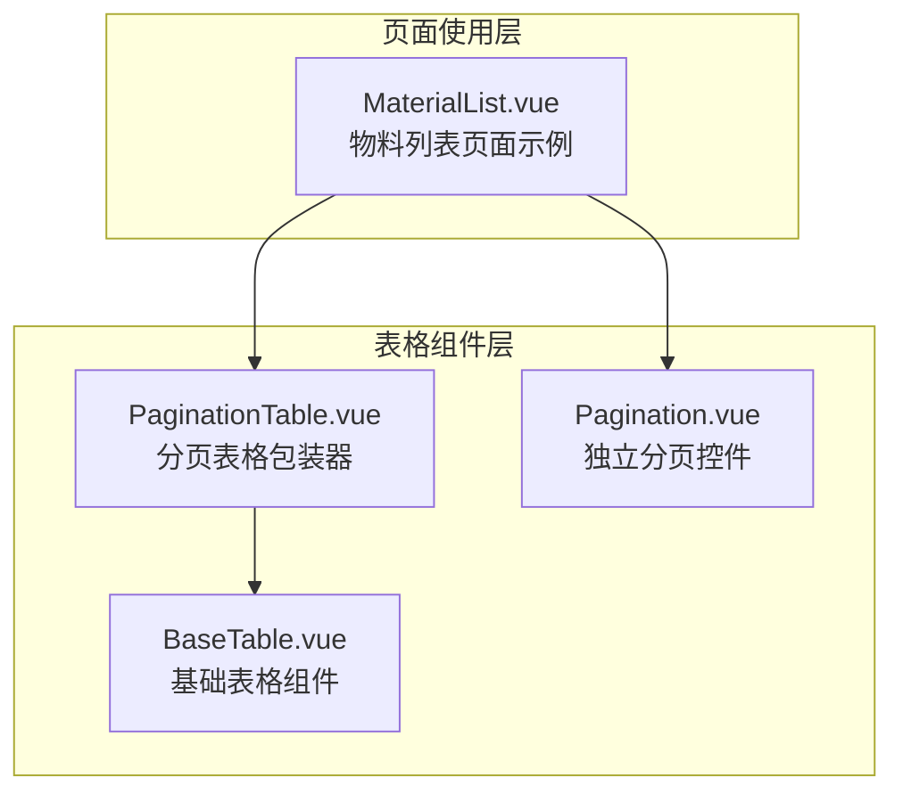
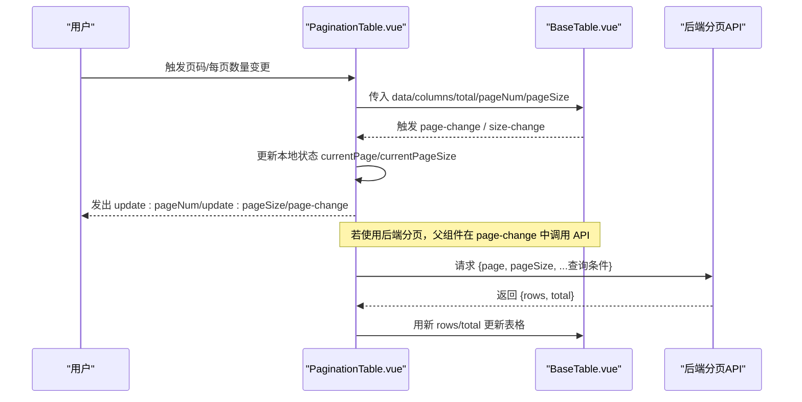
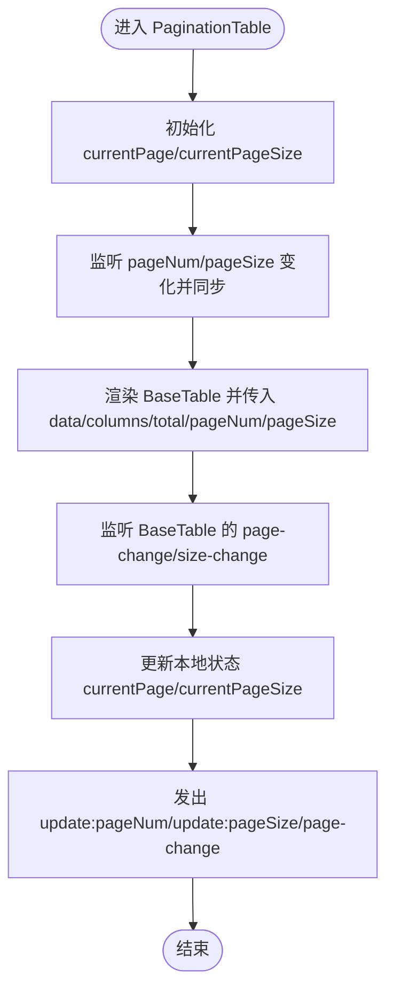
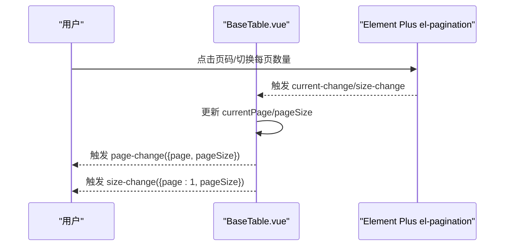
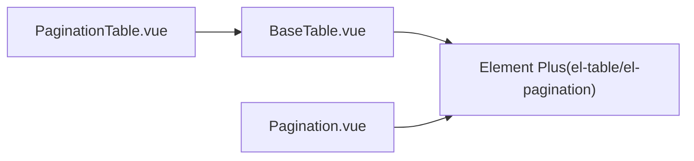
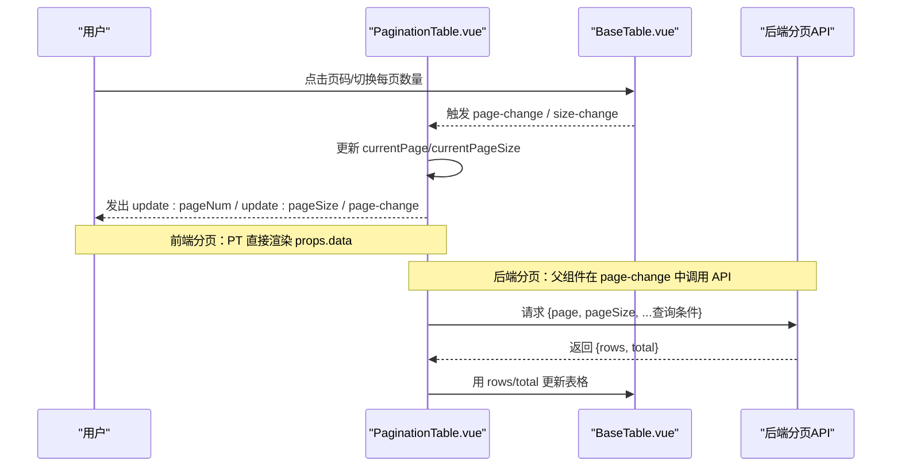

# 分页表格

<cite>
**本文引用的文件**
- [PaginationTable.vue](file://07-frontend/src/components/common/tables/PaginationTable.vue)
- [BaseTable.vue](file://07-frontend/src/components/common/tables/BaseTable.vue)
- [Pagination.vue](file://07-frontend/src/components/common/Pagination.vue)
- [README.md（表格组件系统）](file://07-frontend/src/components/common/tables/README.md)
- [MaterialList.vue](file://07-frontend/src/pages/material/MaterialList.vue)
- [i18n.js](file://07-frontend/src/utils/i18n.js)
</cite>

## 目录
1. [简介](#简介)
2. [项目结构](#项目结构)
3. [核心组件](#核心组件)
4. [架构总览](#架构总览)
5. [详细组件分析](#详细组件分析)
6. [依赖关系分析](#依赖关系分析)
7. [性能考量](#性能考量)
8. [故障排查指南](#故障排查指南)
9. [结论](#结论)
10. [附录](#附录)

## 简介
本文件围绕 PaginationTable 组件的分页逻辑实现进行深入解析，涵盖以下主题：
- 当前页码、每页数量、总条目数的状态管理
- 与后端分页 API 的交互模式
- 如何处理页码切换、每页显示数量变更等用户操作
- 前端分页与后端分页两种模式的适用场景与性能差异
- 分页控件的样式定制与国际化配置方法

## 项目结构
PaginationTable 是表格组件体系中的一个“分页增强型”表格包装器，它通过组合基础表格组件 BaseTable 实现分页能力，并对外暴露统一的分页事件与属性。

图示来源
- [PaginationTable.vue](file://07-frontend/src/components/common/tables/PaginationTable.vue#L1-L59)
- [BaseTable.vue](file://07-frontend/src/components/common/tables/BaseTable.vue#L1-L124)
- [Pagination.vue](file://07-frontend/src/components/common/Pagination.vue#L1-L110)
- [MaterialList.vue](file://07-frontend/src/pages/material/MaterialList.vue#L80-L156)

章节来源
- [PaginationTable.vue](file://07-frontend/src/components/common/tables/PaginationTable.vue#L1-L59)
- [BaseTable.vue](file://07-frontend/src/components/common/tables/BaseTable.vue#L1-L124)
- [Pagination.vue](file://07-frontend/src/components/common/Pagination.vue#L1-L110)
- [MaterialList.vue](file://07-frontend/src/pages/material/MaterialList.vue#L80-L156)

## 核心组件
- PaginationTable：对外提供分页能力的表格包装器，内部使用 BaseTable 渲染数据与分页控件；负责维护当前页码与每页数量，并向上游发出更新事件。
- BaseTable：基础表格组件，内置 Element Plus 表格与分页控件，支持选择、序号、操作列、排序、树形数据等特性；提供 page-change 与 size-change 事件。
- Pagination：独立分页控件，基于 Element Plus el-pagination，提供页码与每页数量双向绑定及布局配置。

章节来源
- [PaginationTable.vue](file://07-frontend/src/components/common/tables/PaginationTable.vue#L1-L59)
- [BaseTable.vue](file://07-frontend/src/components/common/tables/BaseTable.vue#L1-L124)
- [Pagination.vue](file://07-frontend/src/components/common/Pagination.vue#L1-L110)

## 架构总览
PaginationTable 作为“前端分页”的典型实现，将数据与分页状态直接传递给 BaseTable，由 BaseTable 内部的分页控件触发 page-change 与 size-change 事件，再由 PaginationTable 将状态同步到父组件。

图示来源
- [PaginationTable.vue](file://07-frontend/src/components/common/tables/PaginationTable.vue#L1-L59)
- [BaseTable.vue](file://07-frontend/src/components/common/tables/BaseTable.vue#L349-L360)

## 详细组件分析

### PaginationTable 组件
- 状态管理
  - 本地状态：currentPage、currentPageSize
  - 属性输入：data、columns、pageNum、pageSize、total
  - 输出事件：update:pageNum、update:pageSize、page-change
- 数据流
  - 通过 props 接收外部数据与分页参数
  - 使用 watch 同步外部传入的 pageNum/pageSize 到本地状态
  - 通过 BaseTable 的分页事件回调，更新本地状态并向父组件发出更新事件
- 与 BaseTable 的关系
  - 透传 data、columns、total、pageNum、pageSize 至 BaseTable
  - 监听 BaseTable 的 page-change 与 size-change 并转发

图示来源
- [PaginationTable.vue](file://07-frontend/src/components/common/tables/PaginationTable.vue#L1-L59)

章节来源
- [PaginationTable.vue](file://07-frontend/src/components/common/tables/PaginationTable.vue#L1-L59)

### BaseTable 组件（分页相关）
- 分页控件内联在 BaseTable 中，使用 Element Plus el-pagination
- 事件
  - page-change：页码变更时触发
  - size-change：每页数量变更时触发（会重置页码为 1）
- 属性
  - showPagination、total、pageNum、pageSize、pageSizes、paginationLayout、paginationBackground 等

图示来源
- [BaseTable.vue](file://07-frontend/src/components/common/tables/BaseTable.vue#L110-L123)
- [BaseTable.vue](file://07-frontend/src/components/common/tables/BaseTable.vue#L349-L360)

章节来源
- [BaseTable.vue](file://07-frontend/src/components/common/tables/BaseTable.vue#L110-L123)
- [BaseTable.vue](file://07-frontend/src/components/common/tables/BaseTable.vue#L236-L269)
- [BaseTable.vue](file://07-frontend/src/components/common/tables/BaseTable.vue#L349-L360)

### Pagination 独立分页控件
- 该组件提供更通用的分页能力，适合非表格场景或需要自定义布局的分页
- 支持 v-model:current-page 与 v-model:page-size 的双向绑定
- 支持布局、尺寸、背景等配置项

章节来源
- [Pagination.vue](file://07-frontend/src/components/common/Pagination.vue#L1-L110)

### 页面使用示例（物料列表）
- 在页面中，通常使用 FilterTable 或 BaseTable 显示表格与分页
- 通过 :total、:page-num、:page-size 与 @page-change/@size-change 事件完成分页交互
- 该示例展示了后端分页的常见模式：父组件在 page-change 中发起 API 请求，拿到 rows 与 total 后更新表格

章节来源
- [MaterialList.vue](file://07-frontend/src/pages/material/MaterialList.vue#L80-L156)

## 依赖关系分析
- PaginationTable 依赖 BaseTable
- BaseTable 内部依赖 Element Plus 的 el-table 与 el-pagination
- PaginationTable 与 Pagination 为互补方案：前者用于表格场景，后者用于通用分页

图示来源
- [PaginationTable.vue](file://07-frontend/src/components/common/tables/PaginationTable.vue#L1-L59)
- [BaseTable.vue](file://07-frontend/src/components/common/tables/BaseTable.vue#L1-L124)
- [Pagination.vue](file://07-frontend/src/components/common/Pagination.vue#L1-L110)

章节来源
- [PaginationTable.vue](file://07-frontend/src/components/common/tables/PaginationTable.vue#L1-L59)
- [BaseTable.vue](file://07-frontend/src/components/common/tables/BaseTable.vue#L1-L124)
- [Pagination.vue](file://07-frontend/src/components/common/Pagination.vue#L1-L110)

## 性能考量
- 前端分页（PaginationTable + BaseTable）
  - 优点：实现简单，无需额外后端接口；适合中小规模数据
  - 缺点：一次性加载全部数据，内存占用高；大数据量下渲染卡顿
- 后端分页（页面中使用 BaseTable/FilterTable + API）
  - 优点：仅加载当前页数据，内存占用低；适合大规模数据
  - 缺点：需要后端提供分页接口；网络请求次数增加
- 选择建议
  - 数据量小于阈值（如几千条）时优先前端分页
  - 数据量较大或实时性要求高时采用后端分页
  - 可结合虚拟滚动（VirtualTable）进一步优化超大数据量场景

章节来源
- [PaginationTable.vue](file://07-frontend/src/components/common/tables/PaginationTable.vue#L1-L59)
- [BaseTable.vue](file://07-frontend/src/components/common/tables/BaseTable.vue#L1-L124)
- [README.md（表格组件系统）](file://07-frontend/src/components/common/tables/README.md#L351-L366)

## 故障排查指南
- 问题：切换每页数量后页码未重置为 1
  - 检查 BaseTable 的 size-change 逻辑是否将页码重置为 1
  - 章节来源
    - [BaseTable.vue](file://07-frontend/src/components/common/tables/BaseTable.vue#L355-L360)
- 问题：页码/每页数量不生效
  - 确认父组件是否正确接收 update:pageNum/update:pageSize 事件并更新本地状态
  - 章节来源
    - [PaginationTable.vue](file://07-frontend/src/components/common/tables/PaginationTable.vue#L45-L55)
- 问题：total 未更新导致分页控件不可用
  - 确保向 BaseTable 传入 total，并在后端分页时随数据一起更新
  - 章节来源
    - [BaseTable.vue](file://07-frontend/src/components/common/tables/BaseTable.vue#L240-L244)
- 问题：国际化文案缺失
  - 若需自定义分页文案，可在页面中使用 Pagination 控件并传入布局与文案
  - 章节来源
    - [Pagination.vue](file://07-frontend/src/components/common/Pagination.vue#L1-L110)

## 结论
PaginationTable 通过与 BaseTable 的紧密协作，提供了简洁一致的分页体验。对于中小规模数据，前端分页即可满足需求；对于大规模数据，推荐采用后端分页模式，并在页面中根据 page-change 事件拉取数据。通过合理选择分页策略与样式配置，可以在保证用户体验的同时兼顾性能。

## 附录

### 分页逻辑与交互流程（代码级）

图示来源
- [PaginationTable.vue](file://07-frontend/src/components/common/tables/PaginationTable.vue#L1-L59)
- [BaseTable.vue](file://07-frontend/src/components/common/tables/BaseTable.vue#L349-L360)

### 样式定制与国际化配置
- 样式定制
  - PaginationTable 与 BaseTable 均基于 Element Plus，可通过 Element Plus 的主题变量与样式覆盖实现定制
  - Pagination 独立控件提供布局、尺寸、背景等配置，便于灵活布局
  - 章节来源
    - [Pagination.vue](file://07-frontend/src/components/common/Pagination.vue#L1-L110)
    - [BaseTable.vue](file://07-frontend/src/components/common/tables/BaseTable.vue#L1-L124)
- 国际化配置
  - 项目提供国际化管理工具，支持动态语言切换、命名空间、格式化等
  - 若需在分页控件中显示国际化文案，可在页面层使用 i18n 工具生成文案并传入 Pagination 控件
  - 章节来源
    - [i18n.js](file://07-frontend/src/utils/i18n.js#L1-L710)