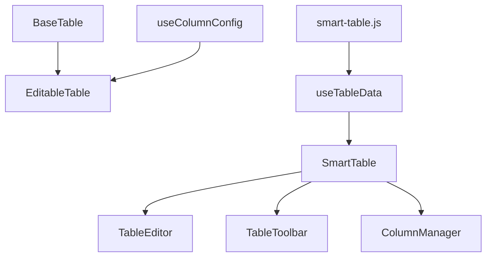
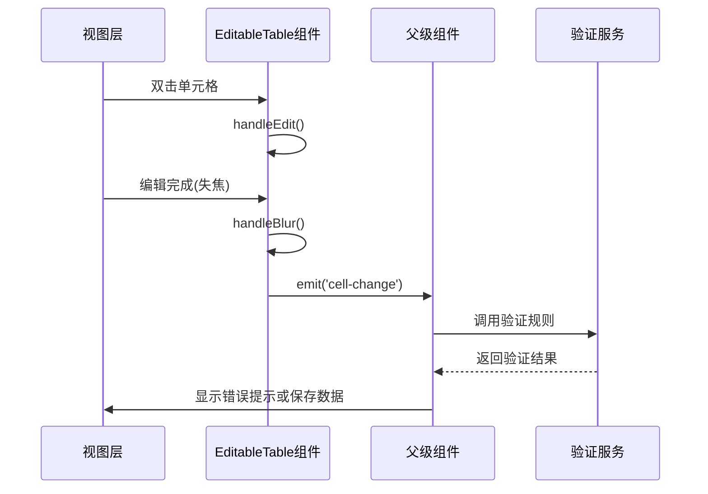
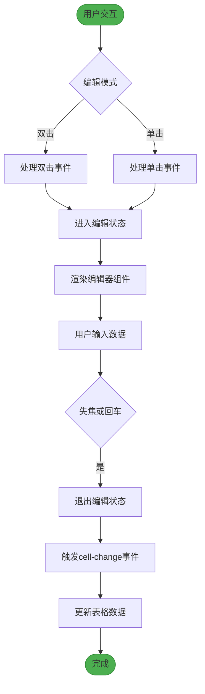
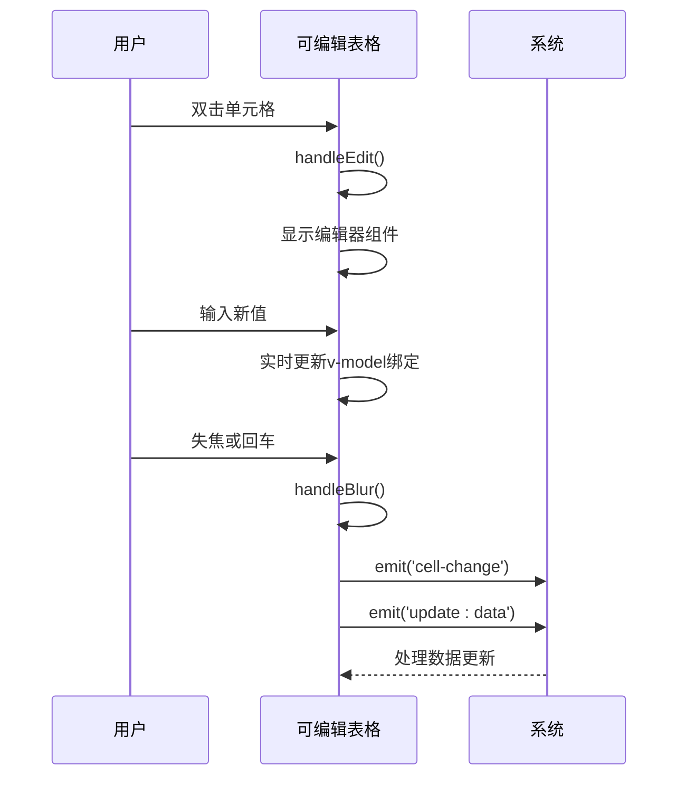
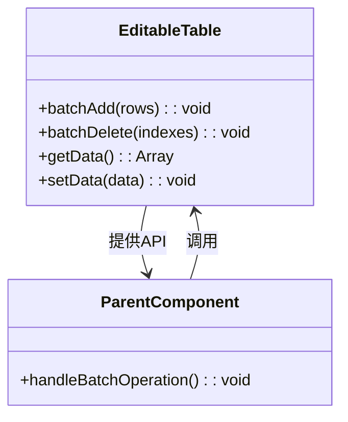
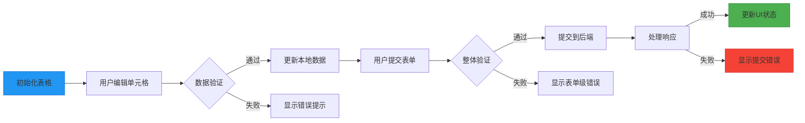
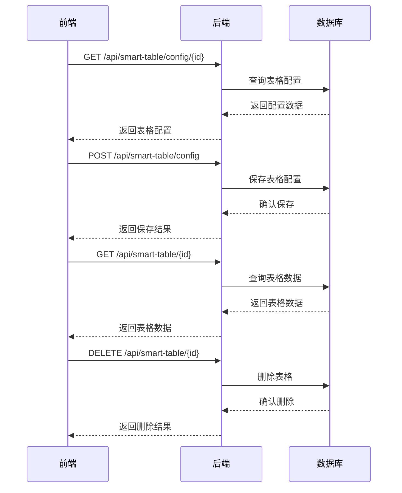

# 可编辑表格

<cite>
**本文档引用的文件**
- [EditableTable.vue](file://07-frontend/src/components/common/tables/EditableTable.vue)
- [useColumnConfig.js](file://07-frontend/src/components/common/tables/enhanced/hooks/useColumnConfig.js)
- [SmartTable.vue](file://07-frontend/src/components/smart-table/SmartTable.vue)
- [ColumnManager.vue](file://07-frontend/src/components/smart-table/ColumnManager.vue)
- [useTableData.js](file://07-frontend/src/components/smart-table/hooks/useTableData.js)
- [smart-table.js](file://07-frontend/src/api/smart-table.js)
</cite>

## 目录
1. [简介](#简介)
2. [核心组件架构](#核心组件架构)
3. [单元格编辑状态管理](#单元格编辑状态管理)
4. [数据验证规则集成](#数据验证规则集成)
5. [编辑事件触发与处理流程](#编辑事件触发与处理流程)
6. [动态列配置与编辑器绑定](#动态列配置与编辑器绑定)
7. [编辑模式使用方法](#编辑模式使用方法)
8. [完整编辑流程案例](#完整编辑流程案例)
9. [与SmartTable服务的数据同步策略](#与smarttable服务的数据同步策略)
10. [总结](#总结)

## 简介
可编辑表格组件提供了一套完整的表格数据编辑解决方案，支持单元格级编辑、数据验证、动态列配置等功能。该组件基于Element Plus构建，通过组合式API实现了灵活的配置能力和良好的用户体验。

## 核心组件架构
可编辑表格系统由多个核心组件构成，形成了分层的架构体系。主要包含基础表格组件、可编辑表格组件、智能表格组件以及相关的Hook函数。



**图表来源**
- [EditableTable.vue](file://07-frontend/src/components/common/tables/EditableTable.vue)
- [SmartTable.vue](file://07-frontend/src/components/smart-table/SmartTable.vue)
- [useColumnConfig.js](file://07-frontend/src/components/common/tables/enhanced/hooks/useColumnConfig.js)

**本节来源**
- [EditableTable.vue](file://07-frontend/src/components/common/tables/EditableTable.vue)
- [SmartTable.vue](file://07-frontend/src/components/smart-table/SmartTable.vue)

## 单元格编辑状态管理
可编辑表格组件通过Set数据结构来管理单元格的编辑状态，实现了高效的编辑状态跟踪和更新机制。

```mermaid
classDiagram
class EditableTable {
-tableData : Ref<Array>
-editingCells : Ref<Set>
+isEditing(row, prop) : Boolean
+handleEdit(row, prop) : void
+handleBlur(row, prop) : void
}
EditableTable --> "1" "0..*" Set : 管理
Set --> "1" "0..*" CellKey : 包含
class CellKey {
+rowKey : String
+prop : String
}
```

编辑状态管理的核心机制是通过唯一的单元格键值（由行标识和列属性组成）来标识每个可编辑单元格的状态。当用户双击或点击单元格时，系统会生成对应的键值并添加到editingCells集合中，触发视图更新进入编辑模式。

**图表来源**
- [EditableTable.vue](file://07-frontend/src/components/common/tables/EditableTable.vue#L182-L227)

**本节来源**
- [EditableTable.vue](file://07-frontend/src/components/common/tables/EditableTable.vue#L182-L227)

## 数据验证规则集成
虽然当前实现中未直接展示验证逻辑，但通过事件机制为数据验证提供了扩展点。组件通过emit触发cell-change事件，允许父级组件或组合式函数进行数据验证。



数据验证可以通过监听cell-change事件来实现，结合项目中的validation-service进行完整的验证流程。

**图表来源**
- [EditableTable.vue](file://07-frontend/src/components/common/tables/EditableTable.vue#L223-L226)

**本节来源**
- [EditableTable.vue](file://07-frontend/src/components/common/tables/EditableTable.vue#L223-L226)

## 编辑事件触发与处理流程
可编辑表格定义了清晰的事件处理流程，从用户交互到数据更新形成了完整的闭环。



事件处理流程的关键在于通过v-model实现数据的双向绑定，并在失焦时触发相应的处理函数，确保数据的一致性和完整性。

**图表来源**
- [EditableTable.vue](file://07-frontend/src/components/common/tables/EditableTable.vue#L209-L227)

**本节来源**
- [EditableTable.vue](file://07-frontend/src/components/common/tables/EditableTable.vue#L209-L227)

## 动态列配置与编辑器绑定
通过useColumnConfig组合式API，实现了动态列配置和编辑器绑定的功能，提供了高度可定制的表格配置能力。

```mermaid
classDiagram
class useColumnConfig {
+visibleColumns : Ref<Array>
+columnWidths : Ref<Object>
+columnOrder : Ref<Array>
+initColumns() : void
+resetColumns() : void
+toggleColumn(prop) : void
+setColumnWidth(prop, width) : void
+updateColumnOrder(newOrder) : void
+saveConfig() : void
}
class EditableTable {
+columns : Array
}
useColumnConfig --> EditableTable : 使用
useColumnConfig --> "localStorage" : 持久化
```

useColumnConfig Hook提供了列可见性、列宽、列顺序的管理功能，并通过localStorage实现配置的持久化存储，确保用户配置在页面刷新后仍然保留。

**图表来源**
- [useColumnConfig.js](file://07-frontend/src/components/common/tables/enhanced/hooks/useColumnConfig.js)

**本节来源**
- [useColumnConfig.js](file://07-frontend/src/components/common/tables/enhanced/hooks/useColumnConfig.js)

## 编辑模式使用方法
可编辑表格支持多种编辑模式，包括内联编辑和批量编辑，满足不同的业务场景需求。

### 内联编辑模式
内联编辑模式允许用户直接在表格单元格中进行编辑操作，提供即时的编辑体验。



### 批量编辑模式
批量编辑模式通过暴露的API方法，支持程序化地进行多行数据的添加和删除操作。



批量编辑模式适用于需要一次性处理多条数据的场景，如导入数据、批量删除等操作。

**图表来源**
- [EditableTable.vue](file://07-frontend/src/components/common/tables/EditableTable.vue#L269-L308)

**本节来源**
- [EditableTable.vue](file://07-frontend/src/components/common/tables/EditableTable.vue#L269-L308)

## 完整编辑流程案例
以下是一个完整的可编辑表格使用案例，展示了表单验证、错误提示和数据提交的全流程。



在实际应用中，可以通过监听cell-change事件进行实时验证，或在提交时调用getData获取完整数据进行整体验证。

**图表来源**
- [EditableTable.vue](file://07-frontend/src/components/common/tables/EditableTable.vue)
- [smart-table.js](file://07-frontend/src/api/smart-table.js)

**本节来源**
- [EditableTable.vue](file://07-frontend/src/components/common/tables/EditableTable.vue)
- [smart-table.js](file://07-frontend/src/api/smart-table.js)

## 与SmartTable服务的数据同步策略
可编辑表格组件与后端SmartTable服务通过定义良好的API接口进行数据同步，实现了前后端的数据一致性。



数据同步策略采用请求-响应模式，通过RESTful API进行通信。配置信息和表格数据分别管理，支持独立的读写操作，确保了数据操作的灵活性和安全性。

**图表来源**
- [SmartTable.vue](file://07-frontend/src/components/smart-table/SmartTable.vue)
- [useTableData.js](file://07-frontend/src/components/smart-table/hooks/useTableData.js)
- [smart-table.js](file://07-frontend/src/api/smart-table.js)

**本节来源**
- [SmartTable.vue](file://07-frontend/src/components/smart-table/SmartTable.vue)
- [useTableData.js](file://07-frontend/src/components/smart-table/hooks/useTableData.js)
- [smart-table.js](file://07-frontend/src/api/smart-table.js)

## 总结
可编辑表格组件通过精心设计的架构和清晰的API，提供了一套完整的表格编辑解决方案。组件采用组合式API的设计思想，将状态管理、事件处理、数据同步等关注点分离，提高了代码的可维护性和可扩展性。通过与SmartTable服务的集成，实现了前后端数据的一致性，为复杂的企业级应用提供了可靠的数据编辑能力。