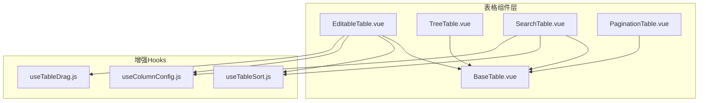
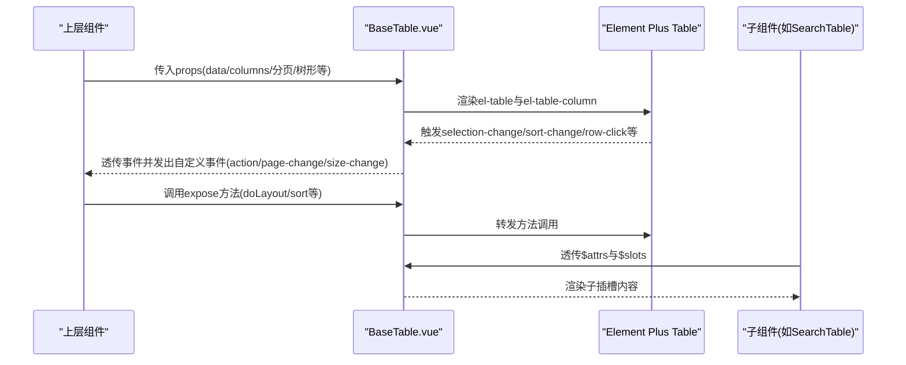
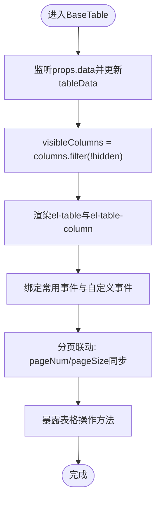
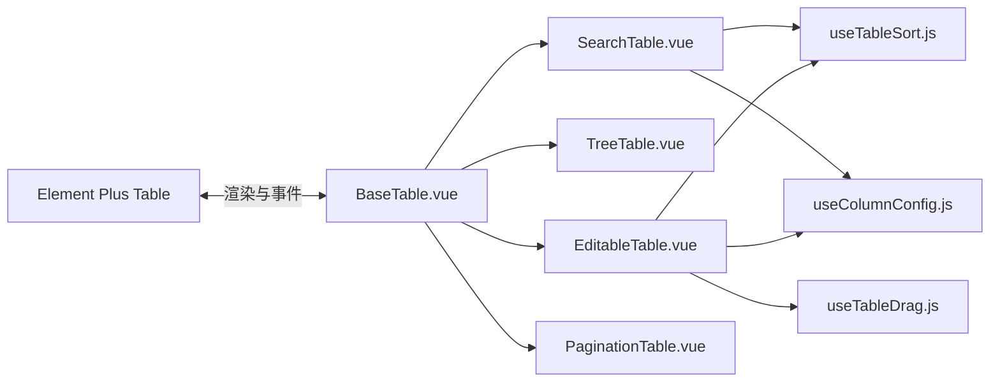

# 基础表格

<cite>
**本文引用的文件**
- [BaseTable.vue](file://07-frontend/src/components/common/tables/BaseTable.vue)
- [README.md](file://07-frontend/src/components/common/tables/README.md)
- [PaginationTable.vue](file://07-frontend/src/components/common/tables/PaginationTable.vue)
- [EditableTable.vue](file://07-frontend/src/components/common/tables/EditableTable.vue)
- [SearchTable.vue](file://07-frontend/src/components/common/tables/SearchTable.vue)
- [TreeTable.vue](file://07-frontend/src/components/common/tables/TreeTable.vue)
- [useTableSort.js](file://07-frontend/src/components/common/tables/enhanced/hooks/useTableSort.js)
- [useColumnConfig.js](file://07-frontend/src/components/common/tables/enhanced/hooks/useColumnConfig.js)
- [useTableDrag.js](file://07-frontend/src/components/common/tables/enhanced/hooks/useTableDrag.js)
</cite>

## 目录
1. [简介](#简介)
2. [项目结构](#项目结构)
3. [核心组件](#核心组件)
4. [架构总览](#架构总览)
5. [详细组件分析](#详细组件分析)
6. [依赖关系分析](#依赖关系分析)
7. [性能考量](#性能考量)
8. [故障排查指南](#故障排查指南)
9. [结论](#结论)
10. [附录](#附录)

## 简介
本文件围绕“基础表格”组件（BaseTable）进行系统化技术文档梳理，重点阐述其作为所有表格组件基类的设计与实现，覆盖数据绑定、列定义、行渲染、插槽与事件系统、继承与扩展机制、以及在响应式数据更新时的性能表现。同时结合仓库中的高级表格组件（如可编辑表格、树形表格、带搜索表格、分页表格）与增强Hooks（排序、列配置、拖拽），帮助读者理解从基础到进阶的完整表格体系。

## 项目结构
BaseTable位于前端通用表格组件目录下，是多个高级表格组件的共同父类，提供统一的数据绑定、列渲染、事件透传、分页与树形数据支持等能力。相关文件组织如下：
- 基础表格：BaseTable.vue
- 高级表格：EditableTable.vue、TreeTable.vue、SearchTable.vue、PaginationTable.vue
- 增强Hooks：useTableSort.js、useColumnConfig.js、useTableDrag.js
- 使用说明与列配置：README.md

图示来源
- [BaseTable.vue](file://07-frontend/src/components/common/tables/BaseTable.vue#L1-L124)
- [EditableTable.vue](file://07-frontend/src/components/common/tables/EditableTable.vue#L1-L132)
- [TreeTable.vue](file://07-frontend/src/components/common/tables/TreeTable.vue#L1-L53)
- [SearchTable.vue](file://07-frontend/src/components/common/tables/SearchTable.vue#L176-L196)
- [PaginationTable.vue](file://07-frontend/src/components/common/tables/PaginationTable.vue#L1-L20)
- [useTableSort.js](file://07-frontend/src/components/common/tables/enhanced/hooks/useTableSort.js#L1-L42)
- [useColumnConfig.js](file://07-frontend/src/components/common/tables/enhanced/hooks/useColumnConfig.js#L1-L80)
- [useTableDrag.js](file://07-frontend/src/components/common/tables/enhanced/hooks/useTableDrag.js#L1-L39)

章节来源
- [BaseTable.vue](file://07-frontend/src/components/common/tables/BaseTable.vue#L1-L124)
- [README.md](file://07-frontend/src/components/common/tables/README.md#L1-L382)

## 核心组件
BaseTable作为所有表格组件的基类，提供以下关键能力：
- 数据绑定：接收外部data数组，内部维护tableData以驱动Element Plus Table渲染。
- 列定义：通过columns数组动态生成el-table-column，支持prop、label、width、minWidth、fixed、sortable、align、headerAlign、showOverflowTooltip、resizable、hidden、slot、formatter、render等配置。
- 行渲染：内置选择列、序号列、操作列；支持空数据插槽；支持树形数据（treeProps）与行键（rowKey）。
- 事件系统：透传Element Plus Table的常用事件（selection-change、sort-change、row-click、row-dblclick、current-change），并发出自定义事件（action、page-change、size-change）。
- 分页支持：可选显示分页器，双向绑定pageNum/pageSize，监听total变化，支持页码与每页大小变更。
- 方法暴露：clearSelection、toggleAllSelection、toggleRowSelection、setCurrentRow、doLayout、sort等，便于上层组件调用。

章节来源
- [BaseTable.vue](file://07-frontend/src/components/common/tables/BaseTable.vue#L1-L124)
- [BaseTable.vue](file://07-frontend/src/components/common/tables/BaseTable.vue#L126-L409)
- [README.md](file://07-frontend/src/components/common/tables/README.md#L21-L86)

## 架构总览
BaseTable通过组合Element Plus Table实现统一的表格渲染与交互，向上提供统一的props、events与expose方法，向下为高级表格组件提供可复用的基础能力。

图示来源
- [BaseTable.vue](file://07-frontend/src/components/common/tables/BaseTable.vue#L1-L124)
- [BaseTable.vue](file://07-frontend/src/components/common/tables/BaseTable.vue#L126-L409)
- [SearchTable.vue](file://07-frontend/src/components/common/tables/SearchTable.vue#L176-L196)

## 详细组件分析

### BaseTable 类与渲染流程
- 列渲染策略：根据visibleColumns过滤hidden列，逐列生成el-table-column，优先级为slot > formatter > render > 默认值。
- 行渲染策略：支持选择列、序号列、操作列；序号列通过indexMethod计算当前页的序号；操作列支持动态按钮集（支持函数或数组）。
- 事件桥接：将Element Plus Table的事件透传给父组件，并发出自定义事件（如action、page-change、size-change）。
- 分页联动：watch外部pageNum/pageSize，同步到内部currentPage/pageSize；当每页大小变化时重置到第1页。
- 方法暴露：通过defineExpose暴露常用表格操作方法，便于上层直接调用。

图示来源
- [BaseTable.vue](file://07-frontend/src/components/common/tables/BaseTable.vue#L126-L409)

章节来源
- [BaseTable.vue](file://07-frontend/src/components/common/tables/BaseTable.vue#L1-L124)
- [BaseTable.vue](file://07-frontend/src/components/common/tables/BaseTable.vue#L126-L409)

### Props 接口设计
- 数据与列
  - data: Array，表格数据源
  - columns: Array，列配置数组，支持prop、label、width、minWidth、fixed、sortable、align、headerAlign、showOverflowTooltip、resizable、hidden、slot、formatter、render等
- 视觉与行为
  - border、stripe、size、loading、highlightCurrentRow、emptyText
- 选择与序号
  - showSelection、reserveSelection、selectOnIndeterminate、showIndex
- 操作列
  - showAction、actionWidth、actionFixed、actionButtons（数组或函数）
- 树形数据
  - rowKey、treeProps(children、hasChildren)
- 排序
  - defaultSort
- 分页
  - showPagination、total、pageNum、pageSize、pageSizes、paginationLayout、paginationBackground

章节来源
- [BaseTable.vue](file://07-frontend/src/components/common/tables/BaseTable.vue#L129-L270)
- [README.md](file://07-frontend/src/components/common/tables/README.md#L263-L304)

### 插槽（Slots）使用方式
- 列插槽：通过column.slot将模板作用域传递给子组件，实现列级别的自定义渲染。
- 操作列插槽：通过#action插槽自定义操作按钮集合，支持默认按钮与自定义按钮。
- 空数据插槽：通过#empty插槽自定义空数据展示。
- 透传插槽：高级表格组件可将自身所有$slots透传给BaseTable，确保子组件的插槽生效。

章节来源
- [BaseTable.vue](file://07-frontend/src/components/common/tables/BaseTable.vue#L44-L108)
- [SearchTable.vue](file://07-frontend/src/components/common/tables/SearchTable.vue#L191-L195)
- [TreeTable.vue](file://07-frontend/src/components/common/tables/TreeTable.vue#L13-L17)

### 事件系统
- Element Plus Table事件透传：selection-change、sort-change、row-click、row-dblclick、current-change
- 自定义事件：action（携带{action,row,index}）、page-change（携带{page,pageSize}）、size-change（携带{page,pageSize}）

章节来源
- [BaseTable.vue](file://07-frontend/src/components/common/tables/BaseTable.vue#L272-L281)
- [BaseTable.vue](file://07-frontend/src/components/common/tables/BaseTable.vue#L319-L360)

### 继承机制与扩展点
- 子组件继承：EditableTable、TreeTable、SearchTable、PaginationTable均以BaseTable为基础，复用其列渲染、事件透传、分页与树形能力。
- 扩展点：
  - 列渲染扩展：通过column.render或column.formatter实现复杂列渲染。
  - 交互扩展：通过actionButtons与#action插槽扩展操作按钮。
  - 数据扩展：通过watch props.data与props.pageNum/pageSize实现数据与分页联动。
  - 增强能力：结合useTableSort、useColumnConfig、useTableDrag等Hooks实现排序、列配置与拖拽。

章节来源
- [EditableTable.vue](file://07-frontend/src/components/common/tables/EditableTable.vue#L1-L132)
- [TreeTable.vue](file://07-frontend/src/components/common/tables/TreeTable.vue#L1-L53)
- [SearchTable.vue](file://07-frontend/src/components/common/tables/SearchTable.vue#L176-L196)
- [PaginationTable.vue](file://07-frontend/src/components/common/tables/PaginationTable.vue#L1-L20)
- [useTableSort.js](file://07-frontend/src/components/common/tables/enhanced/hooks/useTableSort.js#L1-L42)
- [useColumnConfig.js](file://07-frontend/src/components/common/tables/enhanced/hooks/useColumnConfig.js#L1-L80)
- [useTableDrag.js](file://07-frontend/src/components/common/tables/enhanced/hooks/useTableDrag.js#L1-L39)

### 响应式数据更新与性能表现
- 数据绑定：watch props.data深拷贝到tableData，保证响应式更新与渲染一致性。
- 分页联动：watch外部pageNum/pageSize同步到内部currentPage/pageSize，避免重复请求；每页大小变化时重置页码，减少无效渲染。
- 列渲染优化：visibleColumns仅包含未隐藏列，减少不必要的el-table-column创建；列插槽按需渲染，避免不必要计算。
- 事件透传：通过defineEmits声明事件，减少无关事件冒泡与处理成本。
- 布局刷新：onMounted后延迟执行doLayout，确保DOM稳定后再计算布局，提升首屏渲染稳定性。

章节来源
- [BaseTable.vue](file://07-frontend/src/components/common/tables/BaseTable.vue#L293-L304)
- [BaseTable.vue](file://07-frontend/src/components/common/tables/BaseTable.vue#L306-L310)
- [BaseTable.vue](file://07-frontend/src/components/common/tables/BaseTable.vue#L392-L409)

## 依赖关系分析
- 与Element Plus的关系：BaseTable完全基于Element Plus Table组件，复用其事件、样式与交互能力。
- 与上层组件的关系：SearchTable、TreeTable、EditableTable、PaginationTable等通过BaseTable实现统一的表格能力，形成“基类+子类”的继承关系。
- 与增强Hooks的关系：SearchTable与EditableTable结合useTableSort、useColumnConfig、useTableDrag实现排序、列配置与拖拽等增强功能。

图示来源
- [BaseTable.vue](file://07-frontend/src/components/common/tables/BaseTable.vue#L1-L124)
- [EditableTable.vue](file://07-frontend/src/components/common/tables/EditableTable.vue#L1-L132)
- [TreeTable.vue](file://07-frontend/src/components/common/tables/TreeTable.vue#L1-L53)
- [SearchTable.vue](file://07-frontend/src/components/common/tables/SearchTable.vue#L176-L196)
- [PaginationTable.vue](file://07-frontend/src/components/common/tables/PaginationTable.vue#L1-L20)
- [useTableSort.js](file://07-frontend/src/components/common/tables/enhanced/hooks/useTableSort.js#L1-L42)
- [useColumnConfig.js](file://07-frontend/src/components/common/tables/enhanced/hooks/useColumnConfig.js#L1-L80)
- [useTableDrag.js](file://07-frontend/src/components/common/tables/enhanced/hooks/useTableDrag.js#L1-L39)

章节来源
- [BaseTable.vue](file://07-frontend/src/components/common/tables/BaseTable.vue#L1-L124)
- [README.md](file://07-frontend/src/components/common/tables/README.md#L1-L382)

## 性能考量
- 大数据量场景：建议配合VirtualTable或分页表格（PaginationTable）使用，避免一次性渲染过多DOM节点。
- 列渲染优化：尽量使用formatter而非复杂组件渲染；避免在formatter中进行昂贵计算；合理设置列宽，减少布局抖动。
- 事件处理：仅绑定必要的事件；对高频事件（如排序、分页）采用节流/防抖策略。
- 布局刷新：首次渲染后延迟执行doLayout，减少布局计算次数。
- 插槽渲染：按需使用插槽，避免在插槽中进行重型DOM操作。

章节来源
- [README.md](file://07-frontend/src/components/common/tables/README.md#L351-L366)

## 故障排查指南
- 无法显示数据：检查props.data是否为数组且非空；确认columns中prop与数据字段一致。
- 列不显示：检查column.hidden是否为true；确认visibleColumns过滤逻辑。
- 分页异常：检查pageNum/pageSize与total是否正确传入；确认@page-change/@size-change事件处理逻辑。
- 排序无效：确认column.sortable为true；检查defaultSort配置；关注sort-change事件返回的排序信息。
- 操作按钮不生效：检查actionButtons类型（数组或函数）；确认#action插槽绑定正确。
- 树形数据异常：检查rowKey与treeProps配置；确认children/hasChildren字段存在且正确。

章节来源
- [BaseTable.vue](file://07-frontend/src/components/common/tables/BaseTable.vue#L129-L270)
- [BaseTable.vue](file://07-frontend/src/components/common/tables/BaseTable.vue#L272-L281)
- [TreeTable.vue](file://07-frontend/src/components/common/tables/TreeTable.vue#L61-L122)
- [SearchTable.vue](file://07-frontend/src/components/common/tables/SearchTable.vue#L214-L299)

## 结论
BaseTable以简洁而强大的设计，为整个表格体系提供了统一的数据绑定、列渲染、事件系统与扩展点。通过与高级表格组件及增强Hooks的协作，能够满足从基础展示到复杂交互的多样化需求。在性能方面，通过合理的列过滤、事件透传与布局刷新策略，能够在保证易用性的同时兼顾渲染效率。建议在实际项目中遵循列配置规范、事件透传约定与性能优化建议，以获得最佳的开发体验与运行性能。

## 附录
- 使用示例参考：README.md中的BaseTable使用示例与列配置说明，涵盖插槽、formatter、render三种列渲染方式。
- 高级表格组件：SearchTable、TreeTable、EditableTable、PaginationTable展示了BaseTable在不同业务场景下的应用与扩展。

章节来源
- [README.md](file://07-frontend/src/components/common/tables/README.md#L21-L86)
- [README.md](file://07-frontend/src/components/common/tables/README.md#L263-L304)