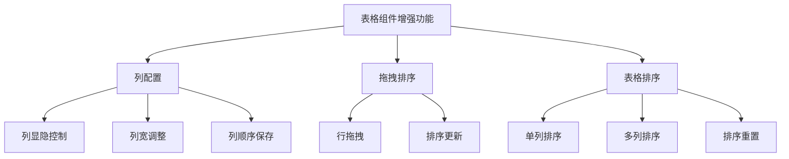
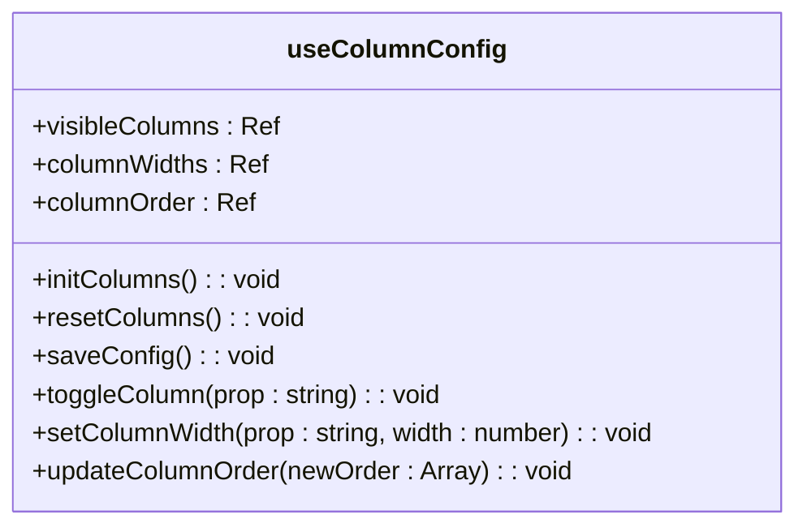
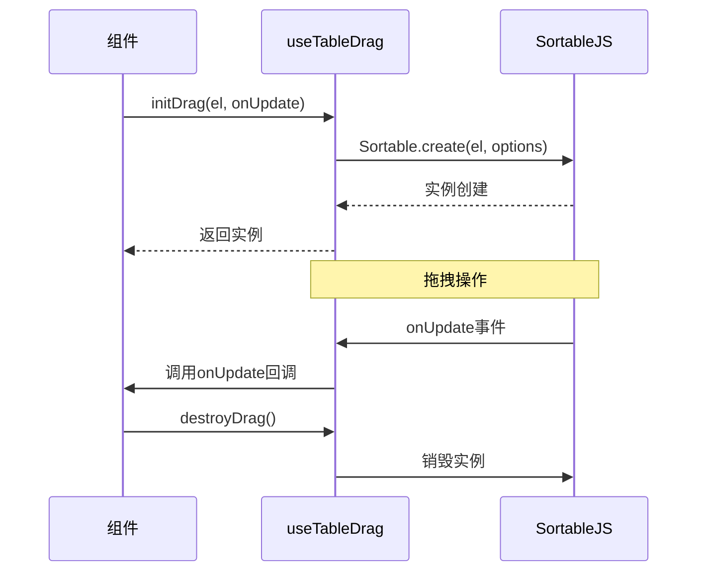
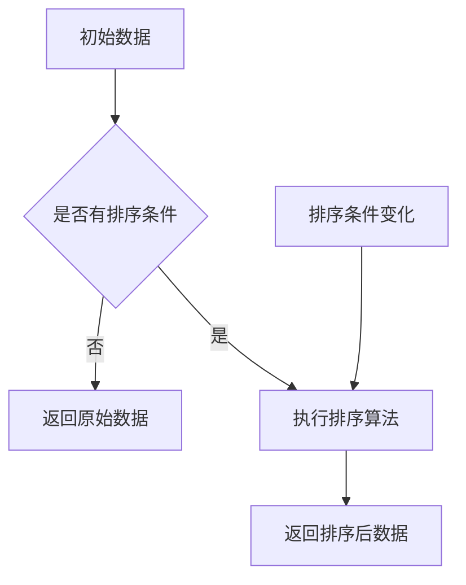
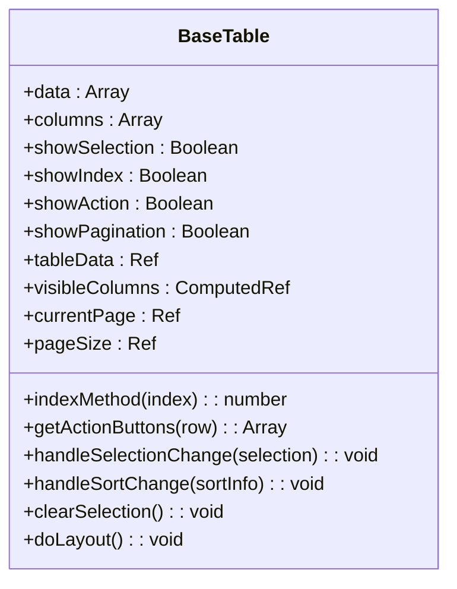
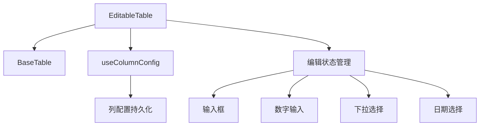
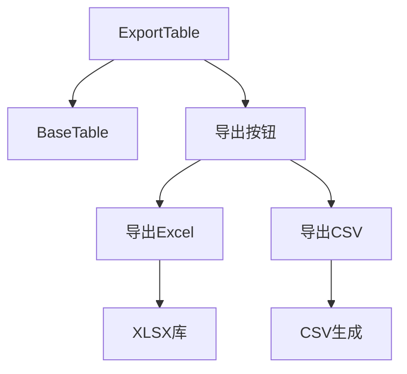
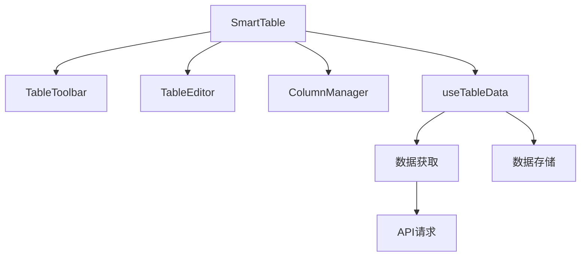
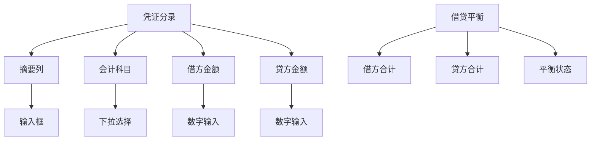

# 增强功能

<cite>
**本文档引用文件**  
- [useColumnConfig.js](file://07-frontend/src/components/common/tables/enhanced/hooks/useColumnConfig.js)
- [useTableDrag.js](file://07-frontend/src/components/common/tables/enhanced/hooks/useTableDrag.js)
- [useTableSort.js](file://07-frontend/src/components/common/tables/enhanced/hooks/useTableSort.js)
- [BaseTable.vue](file://07-frontend/src/components/common/tables/BaseTable.vue)
- [EditableTable.vue](file://07-frontend/src/components/common/tables/EditableTable.vue)
- [ExportTable.vue](file://07-frontend/src/components/common/tables/ExportTable.vue)
- [SmartTable.vue](file://07-frontend/src/components/smart-table/SmartTable.vue)
- [VoucherTable.vue](file://07-frontend/src/pages/finance/general-ledger/components/VoucherTable.vue)
- [README.md](file://07-frontend/src/components/common/tables/README.md)
</cite>

## 目录
1. [引言](#引言)
2. [核心增强功能概述](#核心增强功能概述)
3. [列配置功能详解](#列配置功能详解)
4. [拖拽排序功能详解](#拖拽排序功能详解)
5. [表格排序功能详解](#表格排序功能详解)
6. [组合式API集成应用](#组合式api集成应用)
7. [实际应用案例](#实际应用案例)
8. [最佳实践与性能优化](#最佳实践与性能优化)
9. [总结](#总结)

## 引言

本文档深入讲解表格组件的增强功能，重点分析列配置（useColumnConfig）、拖拽排序（useTableDrag）和表格排序（useTableSort）等组合式API的实现原理。这些功能通过封装通用逻辑，为表格组件提供了灵活的API调用方式，实现了列显隐控制、列宽调整、行拖拽排序等丰富的交互特性。

通过本文档，开发者将了解如何利用这些组合式API构建高度可配置和交互性强的表格组件，满足复杂业务场景下的个性化需求。

## 核心增强功能概述

表格组件系统提供了一套完整的增强功能，主要由三个核心组合式API构成：

- **useColumnConfig**: 负责列的可见性、宽度和顺序配置
- **useTableDrag**: 实现表格行的拖拽排序功能
- **useTableSort**: 提供表格数据的排序能力

这些组合式API遵循Vue 3的Composition API设计模式，通过返回响应式数据和操作方法，使表格组件能够轻松集成各种增强功能。



**图表来源**  
- [useColumnConfig.js](file://07-frontend/src/components/common/tables/enhanced/hooks/useColumnConfig.js)
- [useTableDrag.js](file://07-frontend/src/components/common/tables/enhanced/hooks/useTableDrag.js)
- [useTableSort.js](file://07-frontend/src/components/common/tables/enhanced/hooks/useTableSort.js)

## 列配置功能详解

### 实现原理

`useColumnConfig` Hook通过`localStorage`持久化存储列配置信息，包括可见列、列宽和列顺序。它利用Vue的响应式系统，当配置发生变化时自动保存到本地存储。



**图表来源**  
- [useColumnConfig.js](file://07-frontend/src/components/common/tables/enhanced/hooks/useColumnConfig.js)

### 核心方法

| 方法 | 参数 | 说明 |
|------|------|------|
| `toggleColumn` | prop: 列属性名 | 切换指定列的可见性 |
| `setColumnWidth` | prop: 列属性名, width: 宽度值 | 设置指定列的宽度 |
| `updateColumnOrder` | newOrder: 新的列顺序数组 | 更新列的显示顺序 |
| `resetColumns` | 无 | 重置列配置为默认状态 |
| `saveConfig` | 无 | 保存当前配置到localStorage |

### 配置持久化

列配置信息以JSON格式存储在localStorage中，包含三个主要部分：

```json
{
  "visible": ["name", "status", "date"],
  "widths": {
    "name": 150,
    "status": 100
  },
  "order": ["name", "date", "status"]
}
```

这种设计使得用户自定义的表格配置能够在页面刷新后保持不变，提升了用户体验。

**本节来源**  
- [useColumnConfig.js](file://07-frontend/src/components/common/tables/enhanced/hooks/useColumnConfig.js)
- [README.md](file://07-frontend/src/components/common/tables/README.md)

## 拖拽排序功能详解

### 实现原理

`useTableDrag` Hook基于`SortableJS`库实现拖拽功能，通过封装初始化和销毁方法，提供了简洁的API接口。



**图表来源**  
- [useTableDrag.js](file://07-frontend/src/components/common/tables/enhanced/hooks/useTableDrag.js)

### 核心特性

- **动画效果**: 设置150ms的动画时长，提供流畅的拖拽体验
- **手柄控制**: 可通过`handle`选项指定拖拽手柄
- **样式类**: 定义了ghost、chosen、drag等状态样式类
- **事件回调**: 支持`onUpdate`等事件的回调处理

### 配置选项

`useTableDrag`支持所有`SortableJS`的配置选项，同时提供了默认配置：

```javascript
{
  animation: 150,
  handle: '.drag-handle',
  ghostClass: 'sortable-ghost',
  chosenClass: 'sortable-chosen',
  dragClass: 'sortable-drag'
}
```

这些配置确保了拖拽功能的一致性和可定制性。

**本节来源**  
- [useTableDrag.js](file://07-frontend/src/components/common/tables/enhanced/hooks/useTableDrag.js)

## 表格排序功能详解

### 实现原理

`useTableSort` Hook利用Vue的`computed`特性实现响应式排序，当排序条件变化时自动重新计算排序结果。



**图表来源**  
- [useTableSort.js](file://07-frontend/src/components/common/tables/enhanced/hooks/useTableSort.js)

### 排序算法

排序算法采用标准的比较函数，支持升序和降序：

```javascript
(a, b) => {
  const aVal = a[sortProp.value]
  const bVal = b[sortProp.value]
  
  if (aVal === bVal) return 0
  
  const result = aVal > bVal ? 1 : -1
  return sortOrder.value === 'ascending' ? result : -result
}
```

算法特点：
- 处理相等值的情况
- 支持字符串、数字等基本类型的比较
- 通过`-result`实现降序排列

### 核心接口

| 属性/方法 | 类型 | 说明 |
|----------|------|------|
| `sortProp` | Ref<string> | 当前排序字段 |
| `sortOrder` | Ref<string> | 当前排序顺序 |
| `sortedData` | ComputedRef | 排序后的数据 |
| `handleSort` | Function | 处理排序事件 |
| `resetSort` | Function | 重置排序状态 |

**本节来源**  
- [useTableSort.js](file://07-frontend/src/components/common/tables/enhanced/hooks/useTableSort.js)

## 组合式API集成应用

### 基础表格组件

`BaseTable.vue`作为所有表格组件的基础，提供了核心的表格功能和结构。



**图表来源**  
- [BaseTable.vue](file://07-frontend/src/components/common/tables/BaseTable.vue)

### 可编辑表格

`EditableTable.vue`在基础表格上扩展了编辑功能，支持单元格的实时编辑。



**图表来源**  
- [EditableTable.vue](file://07-frontend/src/components/common/tables/EditableTable.vue)

### 导出表格

`ExportTable.vue`集成了数据导出功能，支持Excel和CSV格式导出。



**图表来源**  
- [ExportTable.vue](file://07-frontend/src/components/common/tables/ExportTable.vue)

## 实际应用案例

### 智能表格组件

`SmartTable.vue`展示了如何将多个增强功能组合使用：



该组件通过`useTableData` Hook管理表格数据和列配置，实现了动态表格的创建和管理。

**图表来源**  
- [SmartTable.vue](file://07-frontend/src/components/smart-table/SmartTable.vue)
- [useTableData.js](file://07-frontend/src/components/smart-table/hooks/useTableData.js)

### 凭证分录表格

财务系统中的凭证分录表格展示了复杂业务场景的应用：



该表格实现了：
- 实时金额计算
- 借贷平衡校验
- 分录添加和删除
- 数据变更通知

**图表来源**  
- [VoucherTable.vue](file://07-frontend/src/pages/finance/general-ledger/components/VoucherTable.vue)

## 最佳实践与性能优化

### 使用建议

1. **合理选择组件**：
   - 简单展示使用`BaseTable`
   - 表单页面使用`EditableTable`
   - 列表页面使用`SearchTable`
   - 大数据量使用`VirtualTable`

2. **性能优化**：
   - 避免在`formatter`中进行复杂计算
   - 合理设置列宽，减少重绘
   - 使用虚拟滚动处理大数据
   - 合理使用分页

3. **配置管理**：
   - 为不同表格设置不同的`storageKey`
   - 定期清理过期的本地存储
   - 提供配置重置功能

### 依赖管理

```json
{
  "必需依赖": {
    "vue": "^3.3.0",
    "element-plus": "^2.4.0",
    "@element-plus/icons-vue": "^2.1.0"
  },
  "可选依赖": {
    "xlsx": "^0.18.5",
    "sortablejs": "^1.15.0"
  }
}
```

安装可选依赖：
```bash
npm install xlsx sortablejs
```

**本节来源**  
- [README.md](file://07-frontend/src/components/common/tables/README.md)

## 总结

表格组件的增强功能通过组合式API的设计模式，实现了功能的模块化和可复用性。`useColumnConfig`、`useTableDrag`和`useTableSort`三个核心Hook分别解决了列配置、拖拽排序和表格排序的需求，为构建复杂的表格应用提供了坚实的基础。

通过合理组合这些功能，开发者可以快速构建出满足各种业务需求的表格组件，同时保持代码的清晰和可维护性。持久化配置、响应式更新和灵活的API设计，使得这些增强功能在实际项目中具有很高的实用价值。