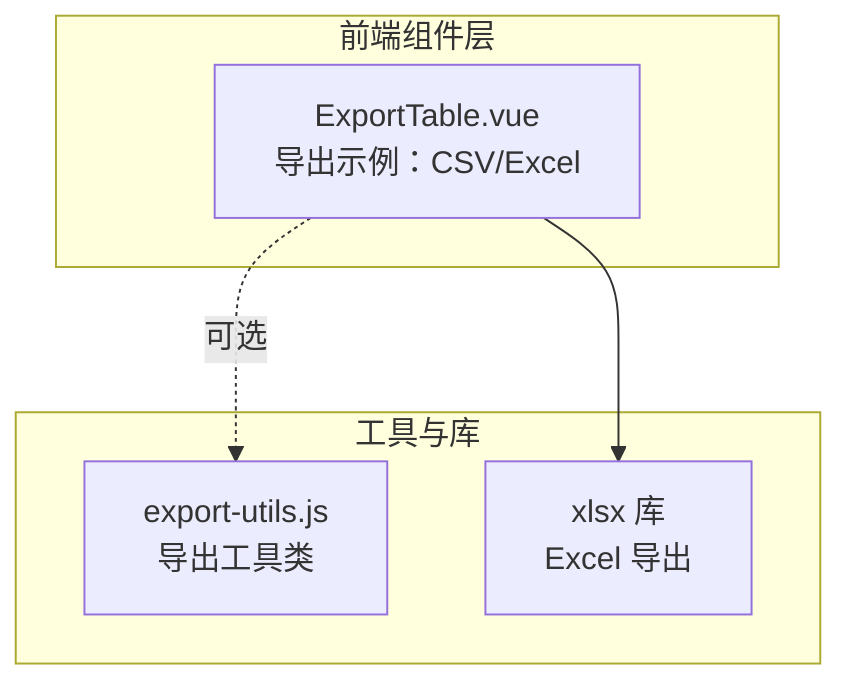
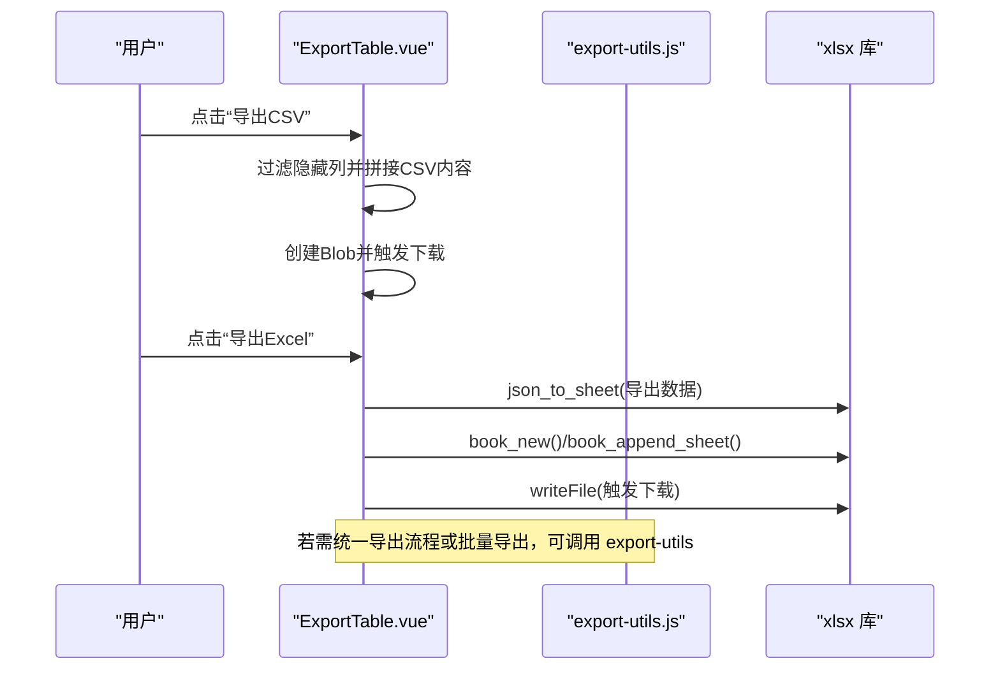
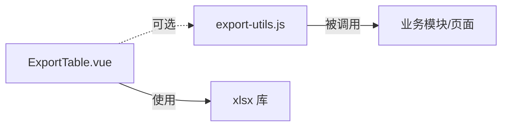

# 导出表格

<cite>
**本文引用的文件列表**
- [ExportTable.vue](file://07-frontend/src/components/common/tables/ExportTable.vue)
- [export-utils.js](file://07-frontend/src/services/utils/export-utils.js)
- [package.json](file://07-frontend/package.json)
- [package-lock.json](file://07-frontend/package-lock.json)
- [CellRenderer.vue](file://07-frontend/src/components/smart-table/CellRenderer.vue)
</cite>

## 目录
1. [简介](#简介)
2. [项目结构](#项目结构)
3. [核心组件](#核心组件)
4. [架构总览](#架构总览)
5. [组件详解](#组件详解)
6. [依赖关系分析](#依赖关系分析)
7. [性能与优化](#性能与优化)
8. [故障排查指南](#故障排查指南)
9. [结论](#结论)
10. [附录](#附录)

## 简介
本文件系统性介绍前端 ExportTable 组件的数据导出能力，覆盖 CSV、Excel 等常见格式；说明其与 export-utils 工具类的协作方式；分析大数据量导出时的性能优化策略（如分块导出、Web Worker 异步处理）；提供自定义导出列、格式化导出内容、添加表头样式等高级配置方法；并讨论浏览器兼容性问题与最佳实践。

## 项目结构
ExportTable 组件位于前端工程的通用表格组件目录下，导出逻辑通过内置的 xlsx 库实现 Excel 导出，同时可结合 export-utils 工具类统一管理 CSV/JSON/XML/TXT/PDF 等多格式导出。

图表来源
- [ExportTable.vue](file://07-frontend/src/components/common/tables/ExportTable.vue#L1-L99)
- [export-utils.js](file://07-frontend/src/services/utils/export-utils.js#L1-L315)

章节来源
- [ExportTable.vue](file://07-frontend/src/components/common/tables/ExportTable.vue#L1-L99)
- [export-utils.js](file://07-frontend/src/services/utils/export-utils.js#L1-L315)

## 核心组件
- ExportTable 组件
  - 提供 CSV 和 Excel 两种导出入口，基于列配置过滤隐藏列，按 label 作为表头导出。
  - 使用 xlsx 库将 JSON 数据写入工作簿并触发下载。
- export-utils 工具类
  - 支持 CSV、JSON、TXT、XML、PDF、XLSX 等格式导出。
  - 内置批量导出、表格解析导出、格式校验、CSV 转义与下载链接创建等能力。
  - 提供 exportToExcel 的“简单实现”：以 CSV 内容但 .xls 扩展名保存，便于兼容旧版 Excel。

章节来源
- [ExportTable.vue](file://07-frontend/src/components/common/tables/ExportTable.vue#L1-L99)
- [export-utils.js](file://07-frontend/src/services/utils/export-utils.js#L1-L315)

## 架构总览
ExportTable 与 export-utils 的交互关系如下：

图表来源
- [ExportTable.vue](file://07-frontend/src/components/common/tables/ExportTable.vue#L41-L86)
- [export-utils.js](file://07-frontend/src/services/utils/export-utils.js#L1-L315)

## 组件详解

### ExportTable 组件
- 功能要点
  - 基于 props.data 与 props.columns 生成导出数据，自动过滤 hidden 列。
  - CSV 导出：逐行拼接字段值并转义双引号，使用 BOM 与 UTF-8 编码，触发下载。
  - Excel 导出：使用 xlsx 将 JSON 数据写入工作簿并下载 .xlsx。
  - 暴露导出方法与 ref，便于外部调用。
- 高级配置
  - 自定义导出列：通过 columns 的 hidden 字段控制导出列集合。
  - 格式化导出内容：可在导出前对 props.data 进行预处理（例如替换货币、日期格式），再交由组件导出。
  - 表头样式：当前组件未直接设置样式，建议在父组件或业务侧通过列渲染器或表格主题控制展示样式；若需 PDF 导出样式，可参考 export-utils 的 PDF 导出选项。

章节来源
- [ExportTable.vue](file://07-frontend/src/components/common/tables/ExportTable.vue#L1-L99)

### export-utils 工具类
- 支持格式
  - CSV、JSON、TXT、XML、PDF、XLSX（部分格式依赖外部库）。
- 关键能力
  - exportToCSV/exportToJSON/exportToText/exportToExcel：分别输出对应格式文件。
  - exportTable：从 DOM 表格元素解析表头与数据，支持 CSV/JSON 导出。
  - batchExport：批量导出多个数据集，返回 Promise.all 结果。
  - isFormatSupported：检查格式是否受支持。
  - createDownloadLink/_downloadFile：封装 Blob 与下载链接创建及资源清理。
- 性能与兼容
  - 对 CSV 内容进行转义，避免逗号、引号、换行导致的解析问题。
  - PDF 导出采用打印对话框方式，依赖浏览器打印能力。

章节来源
- [export-utils.js](file://07-frontend/src/services/utils/export-utils.js#L1-L315)

### 与列渲染器的配合
- 在 SmartTable/CellRenderer 中可对数值、货币、百分比、日期等进行格式化显示，导出时可先将数据格式化为期望字符串，再交给导出组件或工具类，确保导出内容与展示一致。

章节来源
- [CellRenderer.vue](file://07-frontend/src/components/smart-table/CellRenderer.vue#L195-L247)

## 依赖关系分析
- ExportTable 依赖 xlsx 库进行 Excel 导出。
- export-utils 为独立工具类，可被任意模块复用，也可与 ExportTable 协同使用。

图表来源
- [ExportTable.vue](file://07-frontend/src/components/common/tables/ExportTable.vue#L1-L99)
- [export-utils.js](file://07-frontend/src/services/utils/export-utils.js#L1-L315)

章节来源
- [ExportTable.vue](file://07-frontend/src/components/common/tables/ExportTable.vue#L1-L99)
- [export-utils.js](file://07-frontend/src/services/utils/export-utils.js#L1-L315)

## 性能与优化

### 大数据量导出策略
- 分块导出
  - 将超大数据集按页或固定大小切分为多个块，逐块生成 CSV/JSON 片段，最后合并为单一文件（可参考文件处理器中的分片/合并思路）。
  - 或者使用 export-utils 的批量导出能力，将多个小任务并发执行，减少单次内存峰值。
- Web Worker 异步处理
  - 将数据序列化与 Blob 创建放入 Worker 中执行，主线程仅负责调度与下载触发，避免阻塞 UI。
- 浏览器内存与下载限制
  - 大文件下载会占用较多内存，建议：
    - 优先使用流式或分块生成，避免一次性拼接超大字符串。
    - 对 CSV 内容进行必要的转义与压缩（如启用 gzip 传输，但导出文件本身仍为明文 CSV）。
    - 控制导出字段数量与长度，必要时在导出前裁剪或聚合数据。

### 与现有实现的衔接
- ExportTable 当前 CSV 导出在主线程中拼接字符串并触发下载，适合中小规模数据。
- 对于大规模数据，建议：
  - 使用 export-utils 的 exportToCSV 并结合分块/Worker 方案。
  - 或将导出流程委托给后端接口，前端仅发起下载请求，避免前端内存压力。

章节来源
- [ExportTable.vue](file://07-frontend/src/components/common/tables/ExportTable.vue#L64-L86)
- [export-utils.js](file://07-frontend/src/services/utils/export-utils.js#L1-L315)

## 故障排查指南
- 常见问题
  - 导出为空或报错：检查传入 data 是否为非空数组；确认 columns 定义正确且包含 label。
  - Excel 打不开或乱码：确认文件扩展名为 .xlsx；若使用 export-utils 的 exportToExcel“简单实现”，实际为 CSV 内容但扩展名为 .xls，部分旧版 Excel 可打开。
  - CSV 中出现乱码：确保使用 UTF-8 编码并在文件开头加入 BOM。
  - PDF 导出无法直接生成 PDF：export-utils 的 PDF 导出依赖打印对话框，需在打印时选择“另存为 PDF”。
- 排查步骤
  - 在导出前打印 data 与 columns，核对字段与顺序。
  - 对于 CSV，检查是否存在逗号、引号、换行等特殊字符，export-utils 已内置转义逻辑。
  - 对于 Excel，确认已安装并引入 xlsx 库。

章节来源
- [ExportTable.vue](file://07-frontend/src/components/common/tables/ExportTable.vue#L1-L99)
- [export-utils.js](file://07-frontend/src/services/utils/export-utils.js#L1-L315)

## 结论
ExportTable 提供了开箱即用的 CSV/Excel 导出能力，结合 xlsx 库实现高质量 Excel 输出；export-utils 则提供了统一的多格式导出工具，便于在复杂场景中进行批量导出与格式标准化。对于大数据量导出，建议采用分块与 Web Worker 异步处理策略，以提升性能与稳定性；同时注意浏览器兼容性与编码问题，确保导出文件可用。

## 附录

### 高级配置与使用示例（路径指引）
- 自定义导出列
  - 在 columns 中设置 hidden 控制导出列集合，参考导出方法中的过滤逻辑。
  - 参考路径：[ExportTable.vue](file://07-frontend/src/components/common/tables/ExportTable.vue#L41-L62)
- 格式化导出内容
  - 在导出前对 props.data 进行格式化（如货币、日期），再调用导出方法。
  - 参考路径：[CellRenderer.vue](file://07-frontend/src/components/smart-table/CellRenderer.vue#L195-L247)
- 添加表头样式
  - 组件未直接设置样式，可在父组件或表格主题中配置样式；PDF 导出可通过 export-utils 的 PDF 导出选项注入样式。
  - 参考路径：[export-utils.js](file://07-frontend/src/services/utils/export-utils.js#L92-L140)
- 批量导出与统一导出流程
  - 使用 export-utils 的 batchExport 或 exportToCSV/exportToJSON 等方法，实现统一导出流程。
  - 参考路径：[export-utils.js](file://07-frontend/src/services/utils/export-utils.js#L209-L230)

### 浏览器兼容性
- CSV/JSON/TXT 导出：现代浏览器普遍支持 Blob 与下载 API。
- Excel 导出：xlsx 库依赖现代浏览器的 ArrayBuffer/Blob 能力；.xlsx 文件在主流浏览器中可正常打开。
- PDF 导出：依赖打印对话框，不同浏览器行为略有差异，需引导用户选择“另存为 PDF”。

章节来源
- [ExportTable.vue](file://07-frontend/src/components/common/tables/ExportTable.vue#L1-L99)
- [export-utils.js](file://07-frontend/src/services/utils/export-utils.js#L1-L315)