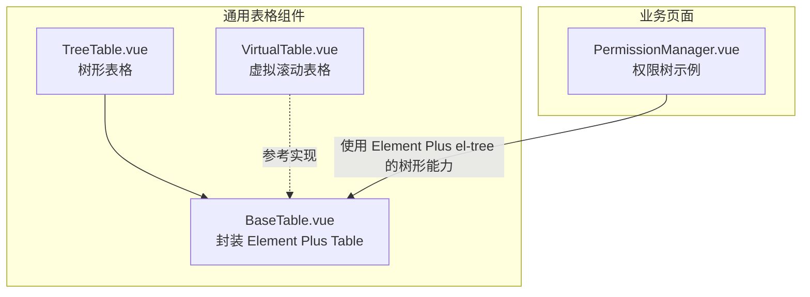
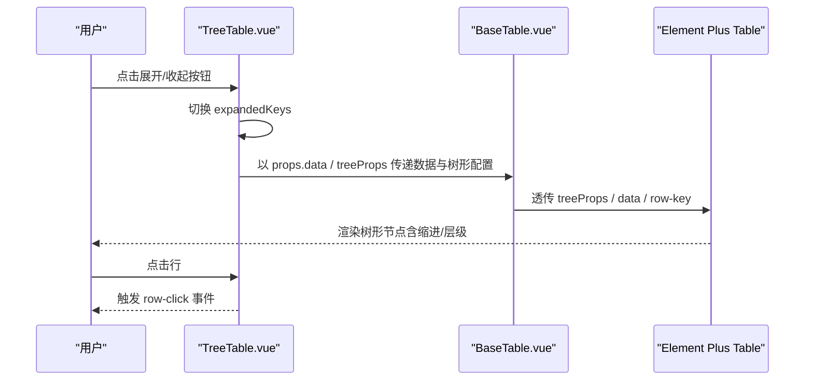
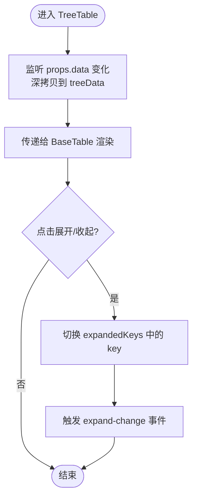
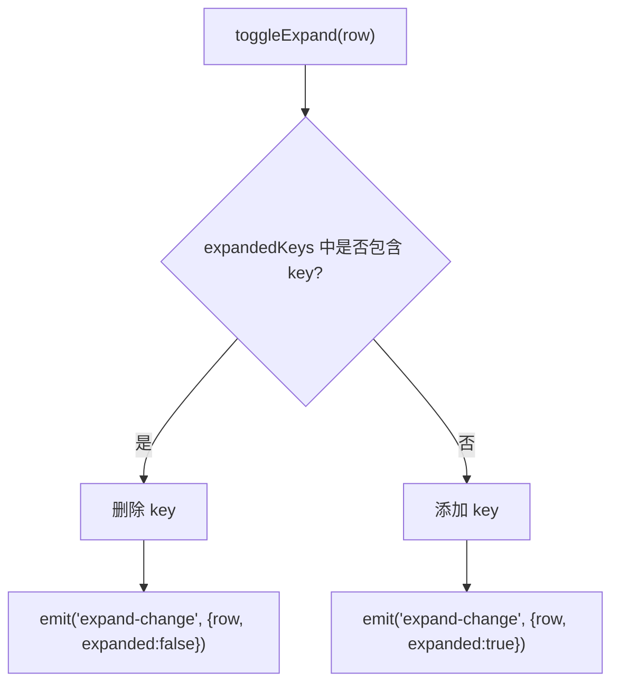
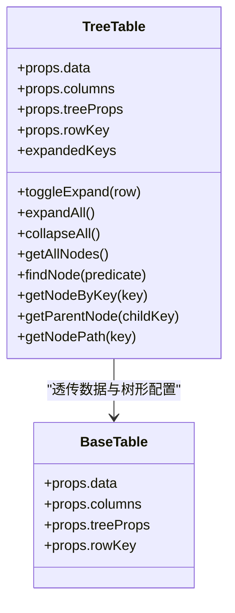
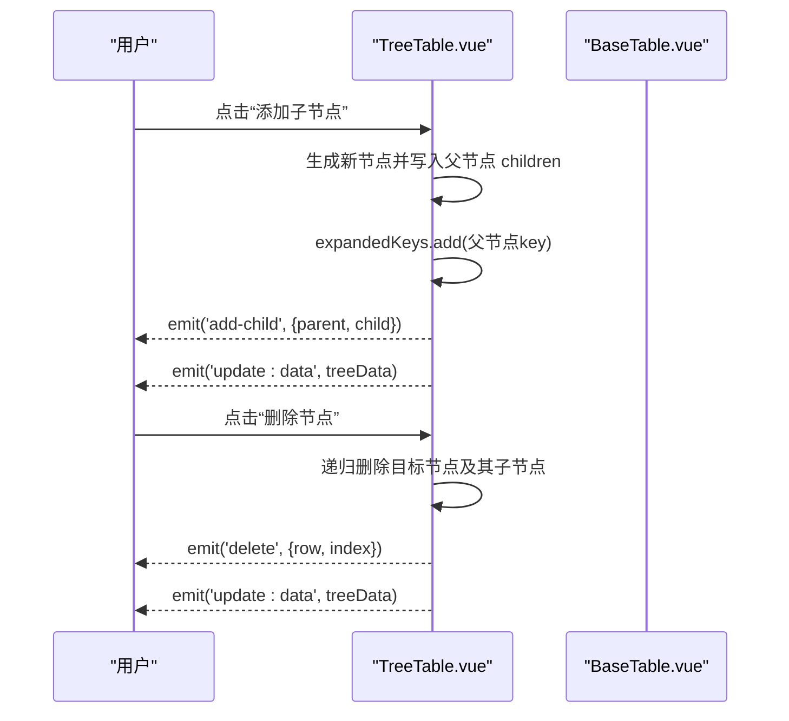
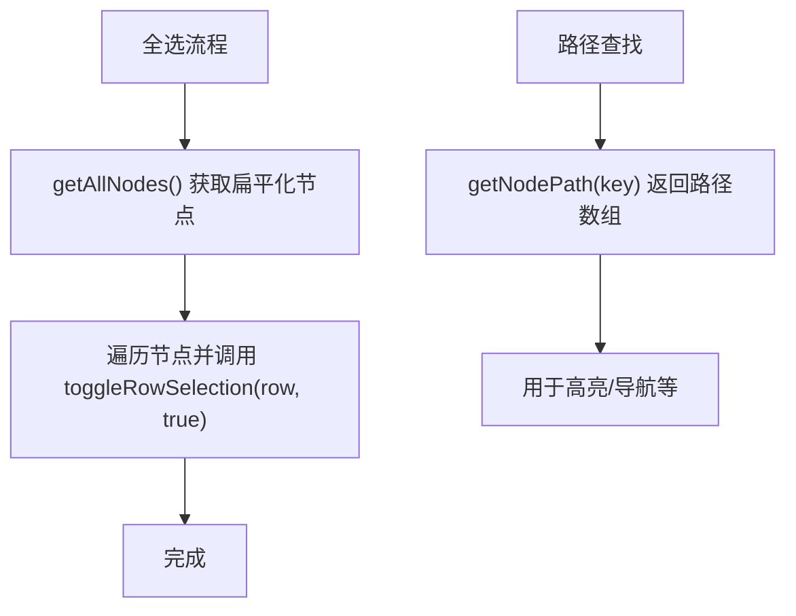

# 树形表格

<cite>
**本文引用的文件**
- [TreeTable.vue](file://07-frontend/src/components/common/tables/TreeTable.vue)
- [BaseTable.vue](file://07-frontend/src/components/common/tables/BaseTable.vue)
- [README.md](file://07-frontend/src/components/common/tables/README.md)
- [VirtualTable.vue](file://07-frontend/src/components/common/tables/VirtualTable.vue)
- [VirtualScroll.vue](file://07-frontend/src/components/common/VirtualScroll.vue)
- [PermissionManager.vue](file://07-frontend/src/pages/system/user-management/components/PermissionManager.vue)
</cite>

## 目录
1. [简介](#简介)
2. [项目结构](#项目结构)
3. [核心组件](#核心组件)
4. [架构总览](#架构总览)
5. [详细组件分析](#详细组件分析)
6. [依赖关系分析](#依赖关系分析)
7. [性能考量](#性能考量)
8. [故障排查指南](#故障排查指南)
9. [结论](#结论)
10. [附录](#附录)

## 简介
本文件面向TreeTable组件的递归渲染机制进行全面解析，重点说明如何通过children字段实现树状数据结构的展开与折叠；阐述节点状态管理（展开/折叠）、层级标识、缩进样式等UI表现；分析在大数据量树形结构下的性能考量；并提供父子节点联动、全选/反选、路径查找等高级功能的使用示例，最后讨论其与可编辑表格、虚拟滚动的集成可能性。

## 项目结构
TreeTable位于前端通用表格组件目录下，作为对Element Plus表格的二次封装，提供树形数据展示与交互能力。其上层依赖BaseTable，后者进一步封装Element Plus Table，统一列配置、分页、排序、选择等通用能力。



图示来源
- [TreeTable.vue](file://07-frontend/src/components/common/tables/TreeTable.vue#L1-L53)
- [BaseTable.vue](file://07-frontend/src/components/common/tables/BaseTable.vue#L1-L124)
- [VirtualTable.vue](file://07-frontend/src/components/common/tables/VirtualTable.vue#L1-L68)
- [PermissionManager.vue](file://07-frontend/src/pages/system/user-management/components/PermissionManager.vue#L1-L12)

章节来源
- [TreeTable.vue](file://07-frontend/src/components/common/tables/TreeTable.vue#L1-L53)
- [BaseTable.vue](file://07-frontend/src/components/common/tables/BaseTable.vue#L1-L124)
- [README.md](file://07-frontend/src/components/common/tables/README.md#L1-L38)

## 核心组件
- TreeTable：基于BaseTable的树形表格，负责树形数据的递归渲染、展开/收起、节点增删、父子联动、路径查找等。
- BaseTable：通用表格容器，提供列配置、分页、排序、选择、操作列等基础能力，并透传Element Plus Table的树形能力。
- VirtualTable：虚拟滚动表格，提供大数据量渲染的高性能方案，可作为TreeTable在超大规模数据下的参考实现思路。

章节来源
- [TreeTable.vue](file://07-frontend/src/components/common/tables/TreeTable.vue#L1-L130)
- [BaseTable.vue](file://07-frontend/src/components/common/tables/BaseTable.vue#L1-L124)
- [VirtualTable.vue](file://07-frontend/src/components/common/tables/VirtualTable.vue#L1-L110)

## 架构总览
TreeTable通过props接收树形数据与列配置，内部维护expandedKeys集合记录展开状态，并将数据与树形配置传递给BaseTable。BaseTable再将这些配置透传给Element Plus Table，从而实现树形渲染与交互。



图示来源
- [TreeTable.vue](file://07-frontend/src/components/common/tables/TreeTable.vue#L1-L130)
- [BaseTable.vue](file://07-frontend/src/components/common/tables/BaseTable.vue#L1-L124)

## 详细组件分析

### 递归渲染与children字段
- 数据结构约定：树形数据通过children字段承载子节点数组，TreeTable通过treeProps.children键名读取子节点集合。
- 递归遍历：TreeTable内部提供getAllNodes、findNode、getParentNode、getNodePath等方法，均以深度优先遍历的方式在树形结构上进行查找与路径构建。
- 展开/收起：TreeTable维护expandedKeys集合，通过toggleExpand切换节点展开状态，并向外部发出expand-change事件。



图示来源
- [TreeTable.vue](file://07-frontend/src/components/common/tables/TreeTable.vue#L136-L161)

章节来源
- [TreeTable.vue](file://07-frontend/src/components/common/tables/TreeTable.vue#L136-L161)
- [TreeTable.vue](file://07-frontend/src/components/common/tables/TreeTable.vue#L235-L263)
- [TreeTable.vue](file://07-frontend/src/components/common/tables/TreeTable.vue#L264-L300)

### 节点状态管理（展开/折叠）
- 状态存储：使用Set类型的expandedKeys保存已展开节点的rowKey值。
- 切换逻辑：toggleExpand根据节点rowKey判断是否存在，存在则删除，不存在则新增，并触发expand-change事件。
- 全局控制：expandAll/collapseAll/expandNode/collapseNode提供批量与单节点控制。



图示来源
- [TreeTable.vue](file://07-frontend/src/components/common/tables/TreeTable.vue#L152-L161)

章节来源
- [TreeTable.vue](file://07-frontend/src/components/common/tables/TreeTable.vue#L148-L161)
- [TreeTable.vue](file://07-frontend/src/components/common/tables/TreeTable.vue#L235-L263)

### 层级标识与缩进样式
- 层级来源：Element Plus Table在开启tree-props后会自动根据children字段进行层级渲染与缩进。
- TreeTable通过treeProps将children/hasChildren等键名传递给BaseTable，再由BaseTable透传给Element Plus Table，从而实现层级与缩进。
- UI表现：Element Plus Table负责渲染层级与缩进，TreeTable不直接处理CSS缩进，而是依赖底层表格组件的树形渲染能力。



图示来源
- [TreeTable.vue](file://07-frontend/src/components/common/tables/TreeTable.vue#L55-L130)
- [BaseTable.vue](file://07-frontend/src/components/common/tables/BaseTable.vue#L126-L270)

章节来源
- [TreeTable.vue](file://07-frontend/src/components/common/tables/TreeTable.vue#L55-L130)
- [BaseTable.vue](file://07-frontend/src/components/common/tables/BaseTable.vue#L126-L270)

### 节点增删与父子联动
- 添加子节点：handleAddChild会在父节点children数组中追加新节点，并自动展开父节点，同时发出add-child与update:data事件。
- 删除节点：handleDelete支持确认删除与递归删除子节点，删除完成后发出delete与update:data事件。
- 父子联动：TreeTable未内置父子联动逻辑，但可通过事件与外部状态结合实现（例如在父节点勾选时联动子节点，反之亦然）。



图示来源
- [TreeTable.vue](file://07-frontend/src/components/common/tables/TreeTable.vue#L168-L233)

章节来源
- [TreeTable.vue](file://07-frontend/src/components/common/tables/TreeTable.vue#L168-L233)

### 高级功能：全选/反选、路径查找
- 全选/反选：TreeTable未内置全选/反选逻辑，但可借助BaseTable的选择能力与TreeTable的getAllNodes/findNode等方法实现。例如：
  - 全选：遍历getAllNodes()，调用BaseTable的toggleRowSelection批量勾选。
  - 反选：先清空选择，再对未展开节点执行展开，再进行全选。
- 路径查找：getNodePath(key)返回从根到目标节点的路径数组，可用于高亮、面包屑等场景。



图示来源
- [TreeTable.vue](file://07-frontend/src/components/common/tables/TreeTable.vue#L264-L300)
- [TreeTable.vue](file://07-frontend/src/components/common/tables/TreeTable.vue#L327-L348)
- [BaseTable.vue](file://07-frontend/src/components/common/tables/BaseTable.vue#L362-L401)

章节来源
- [TreeTable.vue](file://07-frontend/src/components/common/tables/TreeTable.vue#L264-L300)
- [TreeTable.vue](file://07-frontend/src/components/common/tables/TreeTable.vue#L327-L348)
- [BaseTable.vue](file://07-frontend/src/components/common/tables/BaseTable.vue#L362-L401)

### 与可编辑表格、虚拟滚动的集成可能性
- 与可编辑表格集成：TreeTable本身不提供单元格编辑能力，但可与EditableTable组合使用。例如在TreeTable中展示树形结构，在同一页面中使用EditableTable处理编辑场景；或通过插槽将编辑控件嵌入TreeTable的列中。
- 与虚拟滚动集成：TreeTable基于Element Plus Table的树形渲染，天然具备层级与缩进；若数据量极大，可参考VirtualTable的实现思路（仅渲染可视区域），在TreeTable外层进行虚拟滚动包装，或采用懒加载策略减少一次性渲染节点数量。

章节来源
- [README.md](file://07-frontend/src/components/common/tables/README.md#L139-L216)
- [VirtualTable.vue](file://07-frontend/src/components/common/tables/VirtualTable.vue#L1-L194)

## 依赖关系分析
- TreeTable依赖BaseTable，BaseTable依赖Element Plus Table。
- TreeTable通过treeProps将children/hasChildren等键名传递给BaseTable，再由BaseTable透传给Element Plus Table，实现树形渲染。
- 业务侧可参考PermissionManager.vue中的树形结构使用方式，结合Element Plus的el-tree实现父子联动与勾选。

```mermaid
graph LR
EP["Element Plus Table"] <-- "treeProps/row-key/data" --|透传| BaseTable["BaseTable.vue"]
BaseTable <-- "props.data / treeProps" --|使用| TreeTable["TreeTable.vue"]
PermissionManager["PermissionManager.vue"] -. 使用 el-tree .-> EP
```

图示来源
- [TreeTable.vue](file://07-frontend/src/components/common/tables/TreeTable.vue#L1-L53)
- [BaseTable.vue](file://07-frontend/src/components/common/tables/BaseTable.vue#L1-L124)
- [PermissionManager.vue](file://07-frontend/src/pages/system/user-management/components/PermissionManager.vue#L1-L12)

章节来源
- [TreeTable.vue](file://07-frontend/src/components/common/tables/TreeTable.vue#L1-L53)
- [BaseTable.vue](file://07-frontend/src/components/common/tables/BaseTable.vue#L1-L124)
- [PermissionManager.vue](file://07-frontend/src/pages/system/user-management/components/PermissionManager.vue#L1-L12)

## 性能考量
- 大数据量树形结构的渲染成本主要来自DOM节点数量与层级深度。TreeTable基于Element Plus Table的树形渲染，性能取决于底层表格组件的实现。
- 参考VirtualTable的实现思路，可通过“只渲染可视区域”降低渲染压力；对于TreeTable，可在外部进行虚拟滚动包装，或采用懒加载策略（lazy + load）按需加载子节点。
- 在TreeTable中，建议：
  - 控制初始展开层级，避免一次性展开过多节点。
  - 使用getNodePath/getAllNodes等方法进行必要时的路径/扁平化处理，避免在渲染过程中进行复杂计算。
  - 合理设置列宽与formatter，减少重排与重绘。

章节来源
- [README.md](file://07-frontend/src/components/common/tables/README.md#L359-L375)
- [VirtualTable.vue](file://07-frontend/src/components/common/tables/VirtualTable.vue#L1-L194)

## 故障排查指南
- 展开/收起无效：检查rowKey是否与数据中的主键一致，以及expandedKeys是否被正确更新。
- 子节点无法添加：确认父节点children字段是否存在，handleAddChild会自动初始化为空数组。
- 删除确认弹窗：当confirmDelete为true时，删除前会弹出确认框；如不需要确认，可将其设为false。
- 事件未触发：确保在TreeTable上绑定对应事件（如add-child、delete、row-click、expand-change）。

章节来源
- [TreeTable.vue](file://07-frontend/src/components/common/tables/TreeTable.vue#L168-L233)
- [TreeTable.vue](file://07-frontend/src/components/common/tables/TreeTable.vue#L148-L161)

## 结论
TreeTable通过children字段与Element Plus Table的树形渲染能力，实现了树状数据的递归展示与交互。其内部以expandedKeys管理展开状态，提供节点增删、路径查找等实用方法。在大数据量场景下，建议结合懒加载与虚拟滚动策略，或采用外部虚拟滚动包装以获得更优性能。TreeTable与可编辑表格、父子联动等能力可通过事件与外部状态协同实现，满足复杂业务需求。

## 附录
- 使用示例与最佳实践可参考组件文档与README中的示例片段。
- 若需父子联动与全选/反选，可结合BaseTable的选择能力与TreeTable的查询方法实现。

章节来源
- [README.md](file://07-frontend/src/components/common/tables/README.md#L139-L216)