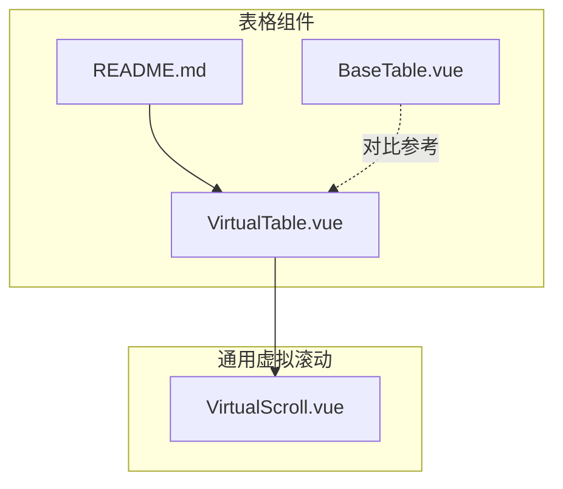
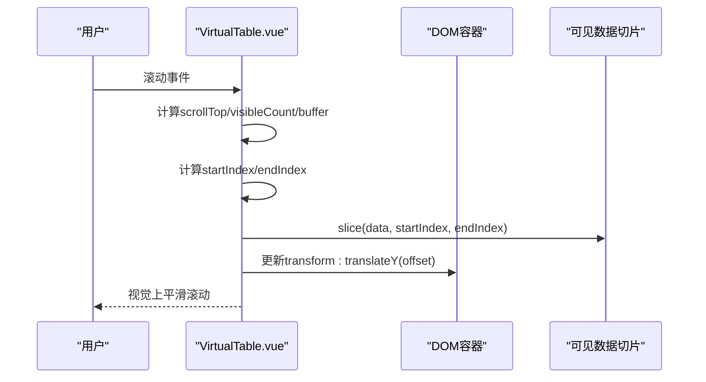
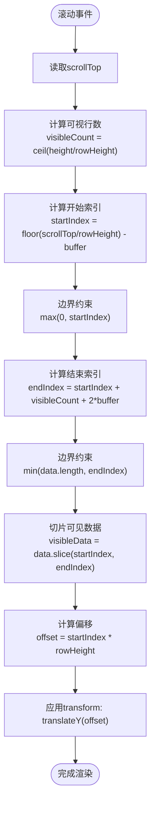
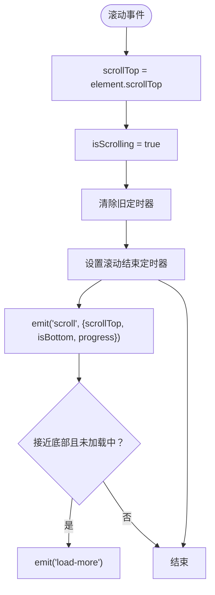
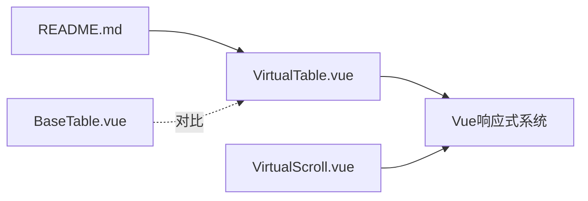

# 虚拟滚动表格

<cite>
**本文引用的文件**
- [VirtualTable.vue](file://07-frontend/src/components/common/tables/VirtualTable.vue)
- [VirtualScroll.vue](file://07-frontend/src/components/common/VirtualScroll.vue)
- [README.md](file://07-frontend/src/components/common/tables/README.md)
- [BaseTable.vue](file://07-frontend/src/components/common/tables/BaseTable.vue)
</cite>

## 目录
1. [简介](#简介)
2. [项目结构](#项目结构)
3. [核心组件](#核心组件)
4. [架构总览](#架构总览)
5. [详细组件分析](#详细组件分析)
6. [依赖关系分析](#依赖关系分析)
7. [性能考量](#性能考量)
8. [故障排查指南](#故障排查指南)
9. [结论](#结论)
10. [附录](#附录)

## 简介
本文件系统性阐述 VirtualTable 组件的性能优化原理与实现机制，重点解释虚拟滚动如何通过“仅渲染可视区域内的行”来高效处理大规模数据集；并深入分析滚动监听、位置计算、缓冲区管理等核心算法。同时，对比传统表格在大数据量下的性能差异，给出 rowHeight、buffer 等关键参数的调优建议，并结合仓库中的使用示例，说明在 10 万+ 数据量场景下的帧率表现与内存占用优势。

## 项目结构
VirtualTable 与 VirtualScroll 均位于前端组件目录下，分别面向表格与通用列表的虚拟滚动场景。README 中提供了 VirtualTable 的使用示例，展示了在 10 万条数据下的渲染能力。

**图示来源**
- [VirtualTable.vue](file://07-frontend/src/components/common/tables/VirtualTable.vue#L1-L272)
- [VirtualScroll.vue](file://07-frontend/src/components/common/VirtualScroll.vue#L1-L439)
- [README.md](file://07-frontend/src/components/common/tables/README.md#L183-L216)
- [BaseTable.vue](file://07-frontend/src/components/common/tables/BaseTable.vue#L1-L422)

**章节来源**
- [VirtualTable.vue](file://07-frontend/src/components/common/tables/VirtualTable.vue#L1-L272)
- [VirtualScroll.vue](file://07-frontend/src/components/common/VirtualScroll.vue#L1-L439)
- [README.md](file://07-frontend/src/components/common/tables/README.md#L183-L216)
- [BaseTable.vue](file://07-frontend/src/components/common/tables/BaseTable.vue#L1-L422)

## 核心组件
- VirtualTable：面向表格的虚拟滚动实现，通过固定行高与缓冲区策略，仅渲染可视区域内的行，显著降低 DOM 数量与重排开销。
- VirtualScroll：通用虚拟滚动容器，支持动态高度、无限滚动加载、性能监控等能力，为列表类组件提供基础能力。
- BaseTable：传统表格组件，基于 Element Plus Table，适合中小规模数据或需要完整表格功能的场景，但不适合超大规模数据的直接渲染。
- README 示例：包含 VirtualTable 在 10 万+ 数据量下的使用示例，便于验证性能表现。

**章节来源**
- [VirtualTable.vue](file://07-frontend/src/components/common/tables/VirtualTable.vue#L70-L194)
- [VirtualScroll.vue](file://07-frontend/src/components/common/VirtualScroll.vue#L84-L125)
- [README.md](file://07-frontend/src/components/common/tables/README.md#L183-L216)
- [BaseTable.vue](file://07-frontend/src/components/common/tables/BaseTable.vue#L1-L120)

## 架构总览
VirtualTable 的核心思想是“空间换时间”：通过一个占位容器撑起整个数据高度，再用 translateY 将可视内容定位到正确位置，从而只渲染可见行。滚动事件驱动 startIndex/endIndex 的计算，配合缓冲区避免滚动过程中的闪烁与抖动。

**图示来源**
- [VirtualTable.vue](file://07-frontend/src/components/common/tables/VirtualTable.vue#L118-L167)

**章节来源**
- [VirtualTable.vue](file://07-frontend/src/components/common/tables/VirtualTable.vue#L118-L167)

## 详细组件分析

### VirtualTable 组件分析
- 关键参数
  - data：原始数据数组
  - columns：列配置
  - height：容器高度
  - rowHeight：行高（固定）
  - buffer：缓冲行数（上下额外渲染的行数）
  - rowKey：行唯一标识或函数
  - showHeader：是否显示表头
- 核心算法
  - totalHeight：总高度 = 数据长度 × 行高
  - visibleCount：可视行数 = ceil(height / rowHeight)
  - startIndex：floor(scrollTop / rowHeight) - buffer，且不小于 0
  - endIndex：startIndex + visibleCount + buffer × 2，不超过数据长度
  - offset：startIndex × rowHeight
  - visibleData：slice(data, startIndex, endIndex)
  - 滚动监听：更新 scrollTop，向父级派发 scroll 事件
  - 行点击：向父级派发 row-click，并返回真实索引（+startIndex）
- 性能优化点
  - 仅渲染可见行，DOM 数量 ≈ 可视行数 + 2×buffer
  - 使用 transform: translateY 实现滚动定位，避免频繁重排
  - 使用缓冲区减少滚动边界处的重新渲染
  - 暴露 scrollTo/scrollToRow 以便快速跳转

**图示来源**
- [VirtualTable.vue](file://07-frontend/src/components/common/tables/VirtualTable.vue#L118-L167)

**章节来源**
- [VirtualTable.vue](file://07-frontend/src/components/common/tables/VirtualTable.vue#L70-L194)

### VirtualScroll 组件分析（通用虚拟滚动）
- 关键参数
  - items：数据列表
  - itemHeight：每项高度（固定）
  - containerHeight：容器高度
  - bufferSize：缓冲区大小
  - infiniteScroll：是否启用无限滚动
  - loading/noMore：加载状态与“无更多数据”
  - scrollThreshold：滚动到底部阈值
- 核心算法
  - totalHeight：items.length × itemHeight
  - visibleCount：ceil(containerHeight / itemHeight)
  - startIndex：floor(scrollTop / itemHeight) - bufferSize
  - endIndex：startIndex + visibleCount + 2 × bufferSize
  - offsetY：startIndex × itemHeight
  - visibleItems：slice(items, startIndex, endIndex)，并附加 index
  - 滚动处理：设置 isScrolling，防抖停止标记，派发 scroll 事件；当接近底部且满足条件时派发 load-more
  - 性能监控：使用 PerformanceObserver 与 mark/measure 记录渲染耗时
- 性能优化点
  - will-change: transform 与 transform: translateZ(0) 等硬件加速相关样式
  - 滚动节流/去抖：通过定时器控制滚动结束状态
  - 无限滚动：基于阈值判断触发加载

**图示来源**
- [VirtualScroll.vue](file://07-frontend/src/components/common/VirtualScroll.vue#L171-L211)

**章节来源**
- [VirtualScroll.vue](file://07-frontend/src/components/common/VirtualScroll.vue#L84-L125)
- [VirtualScroll.vue](file://07-frontend/src/components/common/VirtualScroll.vue#L140-L211)
- [VirtualScroll.vue](file://07-frontend/src/components/common/VirtualScroll.vue#L248-L280)

### 传统表格与虚拟滚动对比
- 传统表格（BaseTable）：直接渲染全部数据，DOM 数量与数据量线性相关，滚动时会触发大量重排与重绘，大数据量下卡顿明显。
- 虚拟滚动（VirtualTable）：仅渲染可视行 + 缓冲区，DOM 数量近似常数级，滚动性能稳定，适合 10 万+ 数据量场景。
- 适用场景
  - VirtualTable：纯展示、大数据量、对滚动流畅度要求高
  - BaseTable：中小数据量、需要完整表格功能（排序、分页、树形等）

**章节来源**
- [BaseTable.vue](file://07-frontend/src/components/common/tables/BaseTable.vue#L1-L120)
- [README.md](file://07-frontend/src/components/common/tables/README.md#L183-L216)

## 依赖关系分析
- VirtualTable 依赖 Vue 响应式系统（ref/computed/watch），通过计算属性维护 startIndex/endIndex/offset/visibleData，滚动事件驱动状态更新。
- VirtualScroll 同样依赖响应式系统，并引入 PerformanceObserver 进行渲染耗时测量。
- README 中的示例演示了 VirtualTable 在 10 万+ 数据量下的使用方式，作为性能验证的入口。

**图示来源**
- [VirtualTable.vue](file://07-frontend/src/components/common/tables/VirtualTable.vue#L70-L194)
- [VirtualScroll.vue](file://07-frontend/src/components/common/VirtualScroll.vue#L130-L211)
- [README.md](file://07-frontend/src/components/common/tables/README.md#L183-L216)
- [BaseTable.vue](file://07-frontend/src/components/common/tables/BaseTable.vue#L1-L120)

**章节来源**
- [VirtualTable.vue](file://07-frontend/src/components/common/tables/VirtualTable.vue#L70-L194)
- [VirtualScroll.vue](file://07-frontend/src/components/common/VirtualScroll.vue#L130-L211)
- [README.md](file://07-frontend/src/components/common/tables/README.md#L183-L216)
- [BaseTable.vue](file://07-frontend/src/components/common/tables/BaseTable.vue#L1-L120)

## 性能考量
- 虚拟滚动的核心收益
  - DOM 数量：O(visibleCount + 2×buffer)，而非 O(n)
  - 重排/重绘：通过 transform 定位，避免频繁布局与绘制
  - 滚动流畅度：滚动事件频率高，但每次仅更新少量元素
- 参数调优建议
  - rowHeight：尽量保持固定且合理，避免动态高度导致的计算与布局抖动
  - buffer：默认 5 行即可覆盖常见滚动速度；若滚动极快或动画较重，可适度增加
  - height：与容器高度一致，确保 visibleCount 准确
  - 列宽：固定列宽有助于减少布局计算
- 性能监控
  - VirtualScroll 提供 PerformanceObserver 与 mark/measure，可用于记录渲染耗时
  - VirtualTable 未内置性能监控，可在业务侧自行埋点或复用 VirtualScroll 的监控思路

**章节来源**
- [VirtualTable.vue](file://07-frontend/src/components/common/tables/VirtualTable.vue#L89-L108)
- [VirtualTable.vue](file://07-frontend/src/components/common/tables/VirtualTable.vue#L118-L167)
- [VirtualScroll.vue](file://07-frontend/src/components/common/VirtualScroll.vue#L248-L280)

## 故障排查指南
- 滚动卡顿或掉帧
  - 检查 rowHeight 是否被动态修改
  - 检查 columns 中是否存在复杂 formatter 或大量计算
  - 适当增大 buffer，减少滚动边界闪烁
- 滚动到指定位置异常
  - 使用暴露的 scrollTo/scrollToRow 方法，确保传入正确的 top 或 index
- 无限滚动未触发
  - 确认 infiniteScroll 已开启，且 scrollThreshold 合理
  - 确保 loading/noMore 状态正确，避免重复触发
- 内存占用过高
  - 控制 visibleCount 与 buffer 的乘积，避免过大
  - 避免在 visibleData 上做重型计算或缓存

**章节来源**
- [VirtualTable.vue](file://07-frontend/src/components/common/tables/VirtualTable.vue#L176-L194)
- [VirtualScroll.vue](file://07-frontend/src/components/common/VirtualScroll.vue#L171-L211)
- [VirtualScroll.vue](file://07-frontend/src/components/common/VirtualScroll.vue#L248-L280)

## 结论
VirtualTable 通过“固定行高 + 缓冲区 + transform 定位”的组合拳，在 10 万+ 数据量下仍能保持稳定的滚动帧率与较低的内存占用。相较传统表格的全量渲染模式，虚拟滚动在大数据场景具备决定性的性能优势。合理设置 rowHeight、buffer、height 等参数，并结合性能监控手段，可进一步提升用户体验与稳定性。

## 附录
- 使用示例（10 万+ 数据量）
  - 参考 README 中的 VirtualTable 示例，直接将数据源替换为 10 万条记录，即可验证性能表现
- 相关参数说明
  - VirtualTable
    - data：原始数据数组
    - columns：列配置
    - height：容器高度
    - rowHeight：行高（固定）
    - buffer：缓冲行数
    - rowKey：行唯一标识或函数
    - showHeader：是否显示表头
  - VirtualScroll
    - items：数据列表
    - itemHeight：每项高度（固定）
    - containerHeight：容器高度
    - bufferSize：缓冲区大小
    - infiniteScroll：是否启用无限滚动
    - loading/noMore：加载状态与“无更多数据”
    - scrollThreshold：滚动到底部阈值

**章节来源**
- [README.md](file://07-frontend/src/components/common/tables/README.md#L183-L216)
- [VirtualTable.vue](file://07-frontend/src/components/common/tables/VirtualTable.vue#L70-L108)
- [VirtualScroll.vue](file://07-frontend/src/components/common/VirtualScroll.vue#L84-L125)