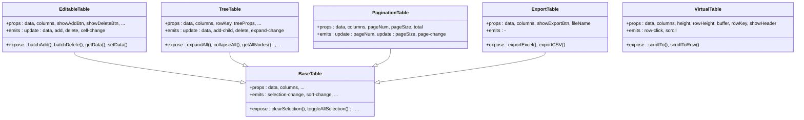

# 表格组件

<cite>
**本文引用的文件**
- [BaseTable.vue](file://07-frontend/src/components/common/tables/BaseTable.vue)
- [EditableTable.vue](file://07-frontend/src/components/common/tables/EditableTable.vue)
- [VirtualTable.vue](file://07-frontend/src/components/common/tables/VirtualTable.vue)
- [TreeTable.vue](file://07-frontend/src/components/common/tables/TreeTable.vue)
- [PaginationTable.vue](file://07-frontend/src/components/common/tables/PaginationTable.vue)
- [ExportTable.vue](file://07-frontend/src/components/common/tables/ExportTable.vue)
- [useColumnConfig.js](file://07-frontend/src/components/common/tables/enhanced/hooks/useColumnConfig.js)
- [useTableDrag.js](file://07-frontend/src/components/common/tables/enhanced/hooks/useTableDrag.js)
- [useTableSort.js](file://07-frontend/src/components/common/tables/enhanced/hooks/useTableSort.js)
- [README.md](file://07-frontend/src/components/common/tables/README.md)
- [VoucherTable.vue](file://07-frontend/src/pages/finance/general-ledger/components/VoucherTable.vue)
</cite>

## 目录
1. [简介](#简介)
2. [项目结构](#项目结构)
3. [核心组件](#核心组件)
4. [架构总览](#架构总览)
5. [详细组件分析](#详细组件分析)
6. [依赖关系分析](#依赖关系分析)
7. [性能考量](#性能考量)
8. [故障排查指南](#故障排查指南)
9. [结论](#结论)
10. [附录](#附录)

## 简介
本文件系统性解析前端表格组件体系，围绕基础表格（BaseTable）到高级功能扩展（EditableTable、VirtualTable、TreeTable、PaginationTable、ExportTable），重点阐释：
- 虚拟滚动（VirtualTable）在大数据量场景下的性能优化原理
- 可编辑表格的数据绑定与验证机制
- 树形表格的递归渲染策略
- 列配置、拖拽排序、多级表头等增强功能的实现方式
- 通过实际案例展示复杂表格的配置方法与最佳实践

## 项目结构
表格组件位于前端工程的通用组件目录中，采用“基础组件 + 增强Hook + 典型业务组合”的分层设计。基础组件提供统一能力，增强Hook提供可复用的功能扩展，典型业务页面展示如何组合使用。

图示来源
- [BaseTable.vue](file://07-frontend/src/components/common/tables/BaseTable.vue#L1-L120)
- [EditableTable.vue](file://07-frontend/src/components/common/tables/EditableTable.vue#L1-L120)
- [VirtualTable.vue](file://07-frontend/src/components/common/tables/VirtualTable.vue#L1-L120)
- [TreeTable.vue](file://07-frontend/src/components/common/tables/TreeTable.vue#L1-L120)
- [PaginationTable.vue](file://07-frontend/src/components/common/tables/PaginationTable.vue#L1-L40)
- [ExportTable.vue](file://07-frontend/src/components/common/tables/ExportTable.vue#L1-L40)
- [useColumnConfig.js](file://07-frontend/src/components/common/tables/enhanced/hooks/useColumnConfig.js#L1-L80)
- [useTableDrag.js](file://07-frontend/src/components/common/tables/enhanced/hooks/useTableDrag.js#L1-L39)
- [useTableSort.js](file://07-frontend/src/components/common/tables/enhanced/hooks/useTableSort.js#L1-L42)
- [VoucherTable.vue](file://07-frontend/src/pages/finance/general-ledger/components/VoucherTable.vue#L1-L120)

章节来源
- [README.md](file://07-frontend/src/components/common/tables/README.md#L1-L60)

## 核心组件
- BaseTable：统一的表格容器，封装 Element Plus Table 的常用能力，支持选择、序号、操作列、空数据、分页、树形数据等。
- EditableTable：在 BaseTable 基础上提供单元格编辑、行增删、编辑模式切换等能力。
- VirtualTable：纯 DOM 虚拟滚动实现，仅渲染可视区域，适合超大数据量。
- TreeTable：基于 BaseTable 的树形数据展示与管理，支持展开/收起、增删节点、懒加载等。
- PaginationTable：对 BaseTable 的分页包装，简化分页数据流。
- ExportTable：在 BaseTable 基础上增加导出 Excel/CSV 的按钮与逻辑。

章节来源
- [BaseTable.vue](file://07-frontend/src/components/common/tables/BaseTable.vue#L1-L120)
- [EditableTable.vue](file://07-frontend/src/components/common/tables/EditableTable.vue#L1-L120)
- [VirtualTable.vue](file://07-frontend/src/components/common/tables/VirtualTable.vue#L1-L120)
- [TreeTable.vue](file://07-frontend/src/components/common/tables/TreeTable.vue#L1-L120)
- [PaginationTable.vue](file://07-frontend/src/components/common/tables/PaginationTable.vue#L1-L40)
- [ExportTable.vue](file://07-frontend/src/components/common/tables/ExportTable.vue#L1-L40)

## 架构总览
表格组件采用“组件继承 + 组合 + Hook”的架构：
- 组件继承：EditableTable、TreeTable、PaginationTable、ExportTable 继承自 BaseTable，共享列渲染、事件透传、分页等能力。
- 组合扩展：通过插槽、动态列、formatter/render 等机制实现灵活定制。
- Hook 扩展：useColumnConfig、useTableDrag、useTableSort 提供列配置、拖拽、排序等可复用能力。

图示来源
- [BaseTable.vue](file://07-frontend/src/components/common/tables/BaseTable.vue#L120-L422)
- [EditableTable.vue](file://07-frontend/src/components/common/tables/EditableTable.vue#L120-L348)
- [TreeTable.vue](file://07-frontend/src/components/common/tables/TreeTable.vue#L120-L370)
- [PaginationTable.vue](file://07-frontend/src/components/common/tables/PaginationTable.vue#L1-L59)
- [ExportTable.vue](file://07-frontend/src/components/common/tables/ExportTable.vue#L1-L99)
- [VirtualTable.vue](file://07-frontend/src/components/common/tables/VirtualTable.vue#L1-L272)

## 详细组件分析

### BaseTable 组件
- 能力概览
  - 列渲染：动态列过滤、固定列、对齐、最小宽度、溢出提示、可调整列宽
  - 交互：选择、序号、操作列、空数据、排序、行点击/双击、当前行高亮
  - 数据：树形数据、分页参数透传、加载状态
- 关键点
  - 可见列计算：visibleColumns 过滤 hidden 列
  - 分页联动：pageNum/pageSize 双向响应式
  - 事件透传：selection-change、sort-change、row-click、current-change、action、page-change、size-change
  - 方法暴露：clearSelection、toggleAllSelection、toggleRowSelection、setCurrentRow、doLayout、sort

章节来源
- [BaseTable.vue](file://07-frontend/src/components/common/tables/BaseTable.vue#L1-L120)
- [BaseTable.vue](file://07-frontend/src/components/common/tables/BaseTable.vue#L120-L422)

### EditableTable 组件
- 能力概览
  - 单元格编辑：支持 input、number、select、date、datetime、switch、自定义组件
  - 行增删：添加新行、批量增删、删除确认
  - 编辑模式：双击编辑或点击编辑
  - 数据绑定：v-model:data，cell-change 事件，更新外部数据
- 关键点
  - 编辑状态管理：Set 存储 {rowKey_prop}，blur 时退出编辑并触发 cell-change
  - 列配置增强：editable=true 时为该列注入自定义插槽
  - 数据深拷贝：watch 中 JSON.parse(JSON.stringify(...)) 保证不污染外部数据源
  - 暴露方法：batchAdd、batchDelete、getData、setData

图示来源
- [EditableTable.vue](file://07-frontend/src/components/common/tables/EditableTable.vue#L1-L120)
- [EditableTable.vue](file://07-frontend/src/components/common/tables/EditableTable.vue#L120-L348)
- [BaseTable.vue](file://07-frontend/src/components/common/tables/BaseTable.vue#L1-L120)

章节来源
- [EditableTable.vue](file://07-frontend/src/components/common/tables/EditableTable.vue#L1-L120)
- [EditableTable.vue](file://07-frontend/src/components/common/tables/EditableTable.vue#L120-L348)

### VirtualTable 组件（虚拟滚动）
- 性能原理
  - 仅渲染可视区域：visibleCount = ceil(height/rowHeight)，startIndex/endIndex 由 scrollTop 和 buffer 计算
  - DOM 结构：外层容器固定高度，内部通过 translateY 实现内容区定位，总高度 totalHeight = data.length × rowHeight
  - 事件：滚动时 emit scroll，行点击时 emit row-click
- 关键点
  - 可见数据切片：visibleData = data.slice(startIndex, endIndex)
  - 偏移量计算：offset = startIndex × rowHeight
  - 行键策略：支持字符串 prop 或函数 rowKey
  - 暴露滚动 API：scrollTo、scrollToRow

图示来源
- [VirtualTable.vue](file://07-frontend/src/components/common/tables/VirtualTable.vue#L1-L120)
- [VirtualTable.vue](file://07-frontend/src/components/common/tables/VirtualTable.vue#L120-L272)

章节来源
- [VirtualTable.vue](file://07-frontend/src/components/common/tables/VirtualTable.vue#L1-L120)
- [VirtualTable.vue](file://07-frontend/src/components/common/tables/VirtualTable.vue#L120-L272)

### TreeTable 组件（树形表格）
- 能力概览
  - 树形渲染：基于 BaseTable 的 tree-props，支持默认展开、懒加载
  - 节点管理：添加子节点、删除节点（含递归删除）、展开/收起
  - 查询与路径：getAllNodes、findNode、getNodeByKey、getParentNode、getNodePath
- 关键点
  - 展开状态：Set 存储 expandedKeys，toggleExpand 切换
  - 递归删除：deleteNode 递归遍历 children
  - 暴露方法：expandAll、collapseAll、expandNode、collapseNode、getAllNodes、findNode、getNodeByKey、getParentNode、getNodePath

图示来源
- [TreeTable.vue](file://07-frontend/src/components/common/tables/TreeTable.vue#L1-L120)
- [TreeTable.vue](file://07-frontend/src/components/common/tables/TreeTable.vue#L120-L370)
- [BaseTable.vue](file://07-frontend/src/components/common/tables/BaseTable.vue#L1-L120)

章节来源
- [TreeTable.vue](file://07-frontend/src/components/common/tables/TreeTable.vue#L1-L120)
- [TreeTable.vue](file://07-frontend/src/components/common/tables/TreeTable.vue#L120-L370)

### PaginationTable 组件（分页表格）
- 能力概览
  - 包装 BaseTable，开启 show-pagination，双向绑定 pageNum/pageSize
  - 事件透传：page-change、size-change
- 关键点
  - 分页数据：computed 返回 props.data（实际分页通常由外部提供）
  - 事件转发：将页码/大小变化回写给父组件

章节来源
- [PaginationTable.vue](file://07-frontend/src/components/common/tables/PaginationTable.vue#L1-L59)
- [BaseTable.vue](file://07-frontend/src/components/common/tables/BaseTable.vue#L1-L120)

### ExportTable 组件（可导出表格）
- 能力概览
  - 在 BaseTable 基础上增加导出按钮，支持 Excel 和 CSV
  - 导出逻辑：过滤 hidden 列，生成 sheet，下载文件
- 关键点
  - Excel：使用 xlsx 库生成工作簿并下载
  - CSV：拼接表头与每行值，Blob 下载

章节来源
- [ExportTable.vue](file://07-frontend/src/components/common/tables/ExportTable.vue#L1-L99)
- [BaseTable.vue](file://07-frontend/src/components/common/tables/BaseTable.vue#L1-L120)

### 列配置、拖拽排序、多级表头等增强功能
- 列配置 Hook（useColumnConfig）
  - 功能：持久化列可见性、列宽、列顺序；支持重置与保存
  - 适用：与 BaseTable 的 columns 结合，动态控制 visibleColumns、columnWidths、columnOrder
- 拖拽 Hook（useTableDrag）
  - 功能：基于 sortablejs 实现拖拽排序，支持 ghost/chosen/drag 样式类
  - 适用：在 BaseTable 上启用列顺序拖拽
- 排序 Hook（useTableSort）
  - 功能：基于 sortProp/sortOrder 计算 sortedData，支持重置
  - 适用：与 BaseTable 的排序事件结合，实现本地排序

章节来源
- [useColumnConfig.js](file://07-frontend/src/components/common/tables/enhanced/hooks/useColumnConfig.js#L1-L80)
- [useTableDrag.js](file://07-frontend/src/components/common/tables/enhanced/hooks/useTableDrag.js#L1-L39)
- [useTableSort.js](file://07-frontend/src/components/common/tables/enhanced/hooks/useTableSort.js#L1-L42)

### 实际案例与最佳实践
- 可编辑表格（EditableTable）
  - 场景：表单页批量录入、快速修改
  - 最佳实践：使用 editMode='click' 与 click 编辑结合；为数值列配置 min/max/precision；使用 cell-change 同步校验
- 树形表格（TreeTable）
  - 场景：组织架构、菜单树、分类树
  - 最佳实践：合理设置 rowKey；懒加载时配合 load 回调；使用 expandAll/collapseAll 控制全量展开
- 虚拟滚动（VirtualTable）
  - 场景：超大数据量展示（如百万级日志）
  - 最佳实践：固定 rowHeight；设置 buffer；避免在 formatter 中做重计算；必要时使用 v-memo
- 分页表格（PaginationTable）
  - 场景：列表页分页加载
  - 最佳实践：服务端分页优先；合理 pageSizes；注意 total 与 data 长度一致性
- 导出表格（ExportTable）
  - 场景：报表导出
  - 最佳实践：隐藏列过滤；CSV 转义；Excel 大数据量建议服务端导出

章节来源
- [README.md](file://07-frontend/src/components/common/tables/README.md#L88-L181)
- [README.md](file://07-frontend/src/components/common/tables/README.md#L183-L214)
- [README.md](file://07-frontend/src/components/common/tables/README.md#L216-L261)
- [README.md](file://07-frontend/src/components/common/tables/README.md#L263-L382)

## 依赖关系分析
- 组件间依赖
  - EditableTable、TreeTable、PaginationTable、ExportTable 依赖 BaseTable
  - VirtualTable 为独立实现，不依赖 BaseTable
- 外部依赖
  - Element Plus：表格、分页、弹窗、消息等组件
  - xlsx：Excel 导出
  - sortablejs：拖拽排序
  - vue：响应式与生命周期

图示来源
- [BaseTable.vue](file://07-frontend/src/components/common/tables/BaseTable.vue#L1-L120)
- [EditableTable.vue](file://07-frontend/src/components/common/tables/EditableTable.vue#L1-L120)
- [TreeTable.vue](file://07-frontend/src/components/common/tables/TreeTable.vue#L1-L120)
- [PaginationTable.vue](file://07-frontend/src/components/common/tables/PaginationTable.vue#L1-L40)
- [ExportTable.vue](file://07-frontend/src/components/common/tables/ExportTable.vue#L1-L40)
- [VirtualTable.vue](file://07-frontend/src/components/common/tables/VirtualTable.vue#L1-L120)
- [useColumnConfig.js](file://07-frontend/src/components/common/tables/enhanced/hooks/useColumnConfig.js#L1-L80)
- [useTableDrag.js](file://07-frontend/src/components/common/tables/enhanced/hooks/useTableDrag.js#L1-L39)
- [useTableSort.js](file://07-frontend/src/components/common/tables/enhanced/hooks/useTableSort.js#L1-L42)

章节来源
- [README.md](file://07-frontend/src/components/common/tables/README.md#L326-L374)

## 性能考量
- 虚拟滚动（VirtualTable）
  - 仅渲染可见行，DOM 数量与可见行数线性相关
  - 通过 buffer 增加上下缓冲，减少滚动边界抖动
  - 建议固定 rowHeight，避免频繁重排
- 可编辑表格（EditableTable）
  - 使用 v-model 双向绑定，避免深层对象频繁变更导致的重渲染
  - 在 cell-change 中进行轻量校验，必要时使用防抖
- 树形表格（TreeTable）
  - 递归删除与路径查找为 O(N)，建议控制节点规模或使用懒加载
- BaseTable
  - formatter 中避免复杂计算；使用 slot/render 时注意组件实例化成本
  - 合理设置列宽，避免频繁计算

章节来源
- [VirtualTable.vue](file://07-frontend/src/components/common/tables/VirtualTable.vue#L120-L272)
- [EditableTable.vue](file://07-frontend/src/components/common/tables/EditableTable.vue#L120-L348)
- [TreeTable.vue](file://07-frontend/src/components/common/tables/TreeTable.vue#L120-L370)
- [README.md](file://07-frontend/src/components/common/tables/README.md#L351-L382)

## 故障排查指南
- 可编辑表格无法保存
  - 检查是否正确监听 cell-change 并更新外部数据
  - 确认编辑模式与列 editable 配置一致
- 树形表格删除异常
  - 确认 rowKey 正确且唯一；检查 children 键名与 treeProps.children 一致
  - 递归删除时注意父子关系与 Set 状态同步
- 虚拟滚动滚动错位
  - 检查 rowHeight 是否与实际一致；buffer 是否过小
  - 确保列宽总和与 totalWidth 一致
- 导出失败
  - 确认已安装 xlsx；hidden 列过滤逻辑是否正确
- 分页不生效
  - 确认 total 与 data 长度一致；pageNum/pageSize 双向绑定是否正确

章节来源
- [EditableTable.vue](file://07-frontend/src/components/common/tables/EditableTable.vue#L120-L348)
- [TreeTable.vue](file://07-frontend/src/components/common/tables/TreeTable.vue#L120-L370)
- [VirtualTable.vue](file://07-frontend/src/components/common/tables/VirtualTable.vue#L120-L272)
- [ExportTable.vue](file://07-frontend/src/components/common/tables/ExportTable.vue#L1-L99)
- [PaginationTable.vue](file://07-frontend/src/components/common/tables/PaginationTable.vue#L1-L59)

## 结论
该表格组件体系以 BaseTable 为核心，通过继承与组合实现了从基础展示到高级交互的完整覆盖。VirtualTable 在大数据量场景下提供了卓越的性能表现；EditableTable 提供了完善的可编辑体验；TreeTable 支撑了复杂的层级数据管理；PaginationTable 与 ExportTable 则满足了常见的分页与导出需求。配合 useColumnConfig、useTableDrag、useTableSort 等 Hook，可以快速构建可配置、可交互、可扩展的表格解决方案。

## 附录
- 列配置说明与示例参见组件文档
- 业务页面示例：凭证分录表格（VoucherTable.vue）展示了在真实业务中如何结合 Element Plus 原生能力实现复杂交互

章节来源
- [README.md](file://07-frontend/src/components/common/tables/README.md#L263-L382)
- [VoucherTable.vue](file://07-frontend/src/pages/finance/general-ledger/components/VoucherTable.vue#L1-L120)