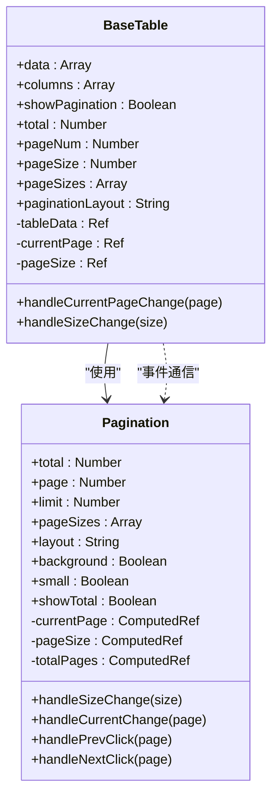
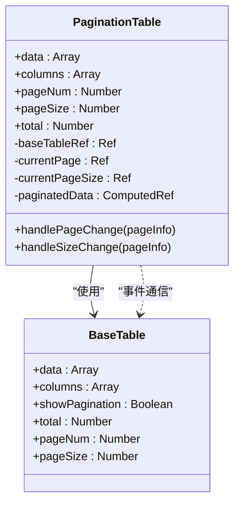
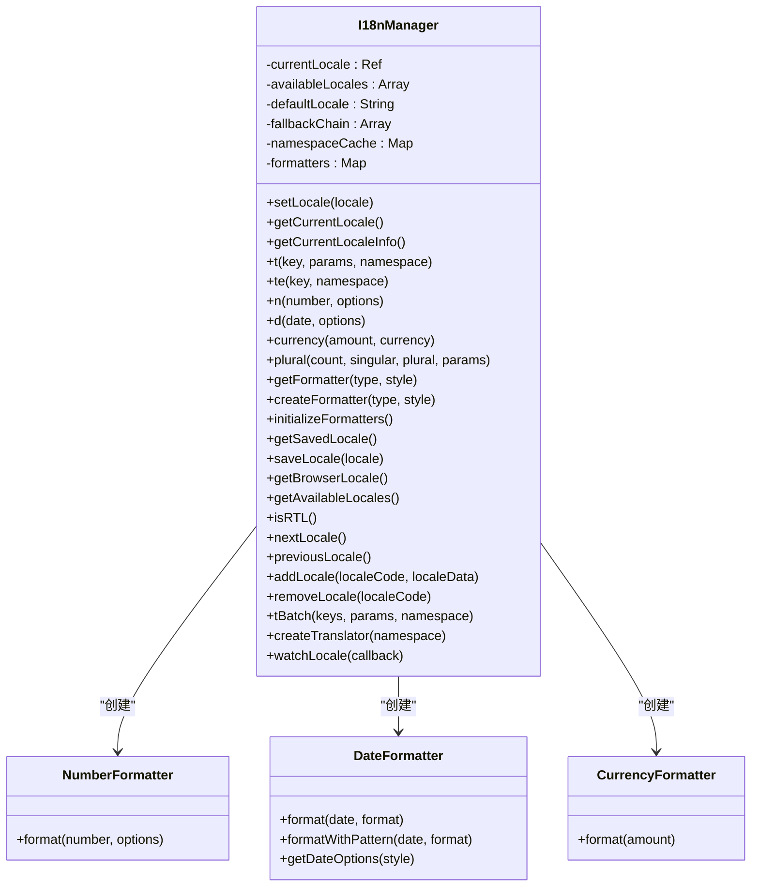
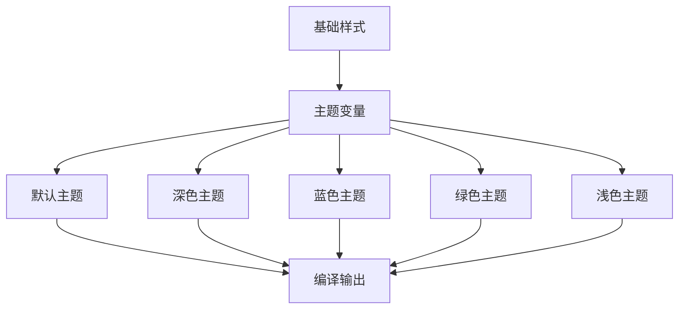

# 分页组件

<cite>
**本文档引用的文件**   
- [Pagination.vue](file://07-frontend/src/components/common/Pagination.vue)
- [BaseTable.vue](file://07-frontend/src/components/common/tables/BaseTable.vue)
- [PaginationTable.vue](file://07-frontend/src/components/common/tables/PaginationTable.vue)
- [AfterSalesList.vue](file://07-frontend/src/pages/after-sales/AfterSalesList.vue)
- [i18n.js](file://07-frontend/src/utils/i18n.js)
- [zh-CN.json](file://07-frontend/src/locales/zh-CN.json)
- [en-US.json](file://07-frontend/src/locales/en-US.json)
- [table-themes.scss](file://07-frontend/src/assets/styles/components/table-themes.scss)
</cite>

## 目录
1. [简介](#简介)
2. [核心功能特性](#核心功能特性)
3. [API接口说明](#api接口说明)
4. [实际应用方式](#实际应用方式)
5. [与后端接口的数据交互规范](#与后端接口的数据交互规范)
6. [与表格组件的联动机制](#与表格组件的联动机制)
7. [性能边界情况处理](#性能边界情况处理)
8. [国际化支持](#国际化支持)
9. [可访问性优化](#可访问性优化)
10. [自定义样式实现路径](#自定义样式实现路径)
11. [总结](#总结)

## 简介
分页组件是企业级应用中用于处理大量数据展示的核心UI组件。它通过将数据分割成多个页面，提升用户体验和系统性能。本组件基于Element Plus的el-pagination构建，提供了丰富的配置选项和灵活的集成方式，支持多种分页模式，可与表格组件无缝联动，并具备国际化、可访问性和样式定制等高级特性。

## 核心功能特性
分页组件支持多种分页模式，包括简单分页、带跳转功能、总数显示等。组件通过props接收分页参数，通过events与父组件通信，支持自定义布局和样式。在移动端适配方面，组件会自动调整布局以适应小屏幕设备。

**分页模式支持：**
- **简单分页**：仅显示上一页、下一页按钮
- **带跳转**：支持页码跳转输入框
- **总数显示**：显示总记录数和当前页码信息
- **每页条数选择**：支持切换每页显示的记录数量

**Section sources**
- [Pagination.vue](file://07-frontend/src/components/common/Pagination.vue#L1-L110)

## API接口说明
分页组件提供了一套完整的API接口，包括props、events和slots，便于开发者进行定制和集成。

### Props说明
分页组件的props定义了分页的基本配置和显示选项。

| 属性名 | 类型 | 默认值 | 说明 |
|--------|------|--------|------|
| total | number | 0 | 总记录数 |
| page | number | 1 | 当前页码 |
| limit | number | 10 | 每页显示条数 |
| pageSizes | number[] | [10, 20, 50, 100] | 每页条数选项 |
| layout | string | 'total, sizes, prev, pager, next, jumper' | 分页组件布局 |
| background | boolean | true | 是否为分页按钮添加背景色 |
| small | boolean | false | 是否使用小型分页样式 |
| showTotal | boolean | true | 是否显示总条数 |

### Events说明
分页组件通过events与父组件通信，通知分页状态的变化。

| 事件名 | 说明 | 回调参数 |
|--------|------|----------|
| update | 分页参数更新时触发 | page: 当前页码, limit: 每页条数 |
| update:page | 页码改变时触发 | page: 新的页码 |
| update:limit | 每页条数改变时触发 | limit: 新的每页条数 |

### Slots说明
分页组件目前未提供slots，但可以通过父组件的布局进行内容扩展。

**Section sources**
- [Pagination.vue](file://07-frontend/src/components/common/Pagination.vue#L25-L42)

## 实际应用方式
分页组件可以通过多种方式集成到业务列表中，以下是一些常见的使用场景和代码示例。

### 基本使用示例
```vue
<template>
  <Pagination
    :total="total"
    :page="currentPage"
    :limit="pageSize"
    @update:page="handlePageChange"
    @update:limit="handleSizeChange"
  />
</template>
```

### 与表格组件集成
分页组件常与表格组件配合使用，实现数据列表的分页展示。

```vue
<template>
  <div class="table-container">
    <el-table :data="tableData" />
    <Pagination
      :total="total"
      :page="currentPage"
      :limit="pageSize"
      @update="handlePaginationChange"
    />
  </div>
</template>
```

### 自定义布局
通过layout属性可以自定义分页组件的布局。

```vue
<template>
  <Pagination
    :total="total"
    :page="currentPage"
    :limit="pageSize"
    layout="prev, pager, next"
    @update="handlePaginationChange"
  />
</template>
```

**Section sources**
- [AfterSalesList.vue](file://07-frontend/src/pages/after-sales/AfterSalesList.vue#L124-L134)

## 与后端接口的数据交互规范
分页组件与后端接口的数据交互遵循RESTful规范，通过查询参数传递分页信息。

### 请求参数规范
分页组件通过以下参数与后端交互：
- `page`：当前页码（从1开始）
- `limit`：每页条数
- `offset`：偏移量（可选，由page和limit计算得出）

### 响应数据规范
后端应返回标准的分页响应格式：
```json
{
  "data": [...],
  "total": 100,
  "page": 1,
  "limit": 10,
  "totalPages": 10
}
```

### 错误处理
当分页请求出现错误时，组件应显示友好的错误提示，并提供重试机制。

**Section sources**
- [AfterSalesList.vue](file://07-frontend/src/pages/after-sales/AfterSalesList.vue#L379-L390)

## 与表格组件的联动机制
分页组件与表格组件通过props和events实现紧密联动，形成完整的数据展示解决方案。

### BaseTable组件中的集成
BaseTable组件内置了分页功能，通过showPagination属性控制分页显示。



**Diagram sources **
- [BaseTable.vue](file://07-frontend/src/components/common/tables/BaseTable.vue#L236-L270)
- [Pagination.vue](file://07-frontend/src/components/common/Pagination.vue#L25-L34)

### PaginationTable组件的封装
PaginationTable组件封装了BaseTable和分页逻辑，提供更简洁的API。



**Diagram sources **
- [PaginationTable.vue](file://07-frontend/src/components/common/tables/PaginationTable.vue#L26-L32)
- [BaseTable.vue](file://07-frontend/src/components/common/tables/BaseTable.vue#L129-L270)

## 性能边界情况处理
分页组件在处理大量数据时需要考虑性能优化，避免影响用户体验。

### 大数据量处理
当总记录数非常大时（如超过100万条），直接显示总页数会导致性能问题。建议采用以下策略：
- 限制最大显示页数（如最多显示到第1000页）
- 使用估算总数而非精确总数
- 实现懒加载分页，只在用户接近末尾时加载更多页码

### 高频操作优化
对于频繁的分页操作，组件通过以下方式优化性能：
- 使用computed属性缓存计算结果
- 使用watch监听props变化，避免不必要的重新渲染
- 在事件处理函数中使用防抖（debounce）技术

### 内存管理
组件通过ref和computed合理管理内存，避免内存泄漏：
- 使用composition API的响应式系统
- 在组件销毁时清理定时器和事件监听器
- 避免在闭包中持有大量数据引用

**Section sources**
- [Pagination.vue](file://07-frontend/src/components/common/Pagination.vue#L50-L64)
- [BaseTable.vue](file://07-frontend/src/components/common/tables/BaseTable.vue#L283-L304)

## 国际化支持
分页组件通过项目级的国际化系统支持多语言，确保在全球化应用中的一致性体验。

### 国际化配置
项目使用自定义的I18nManager类管理国际化，支持中英文切换。



**Diagram sources **
- [i18n.js](file://07-frontend/src/utils/i18n.js#L45-L625)
- [zh-CN.json](file://07-frontend/src/locales/zh-CN.json)
- [en-US.json](file://07-frontend/src/locales/en-US.json)

### 语言包结构
项目包含中英文语言包，分页相关的文本定义在product命名空间下。

```json
{
  "product": {
    "itemsPerPage": "Items per page",
    "total": "Total {total} items",
    "page": "Page {current} of {total}"
  }
}
```

### 动态语言切换
用户可以在运行时切换语言，组件会自动更新显示文本。

**Section sources**
- [i18n.js](file://07-frontend/src/utils/i18n.js#L87-L97)
- [zh-CN.json](file://07-frontend/src/locales/zh-CN.json)
- [en-US.json](file://07-frontend/src/locales/en-US.json)

## 可访问性优化
分页组件遵循WCAG 2.1标准，确保所有用户都能方便地使用。

### 键盘导航
组件支持完整的键盘导航：
- Tab键：在分页控件间移动焦点
- Enter键：激活当前聚焦的按钮
- 方向键：在页码间移动

### 屏幕阅读器支持
通过ARIA属性提供屏幕阅读器支持：
- `aria-label`：为分页控件提供描述性标签
- `aria-current`：标识当前页码
- `aria-disabled`：标识禁用状态的按钮

### 高对比度模式
组件支持高对比度模式，确保在低视力用户设备上的可读性。

### 焦点管理
组件合理管理焦点，确保键盘用户的操作流畅性。

**Section sources**
- [guide-service.js](file://07-frontend/src/services/guide-service.js#L552-L570)
- [tour-steps.js](file://07-frontend/src/utils/guide/tour-steps.js#L63-L263)

## 自定义样式实现路径
分页组件提供多种方式实现样式定制，满足不同项目的视觉需求。

### CSS变量定制
通过CSS变量实现主题化定制：

```scss
.pagination-container {
  --pagination-color: #409eff;
  --pagination-hover-color: #66b1ff;
  --pagination-active-color: #ffffff;
  --pagination-active-background: #409eff;
  --pagination-disabled-color: #c0c4cc;
  --pagination-disabled-background: #f4f4f5;
}
```

### 主题文件集成
组件样式与项目主题系统集成，支持多种预设主题。



**Diagram sources **
- [table-themes.scss](file://07-frontend/src/assets/styles/components/table-themes.scss#L283-L292)

### 响应式设计
组件支持响应式布局，在移动设备上自动调整显示方式。

```css
@media (max-width: 768px) {
  .pagination-container {
    flex-direction: column;
    gap: 12px;
  }
  
  .pagination-info {
    text-align: center;
  }
}
```

**Section sources**
- [Pagination.vue](file://07-frontend/src/components/common/Pagination.vue#L100-L109)
- [table-themes.scss](file://07-frontend/src/assets/styles/components/table-themes.scss#L412-L432)

## 总结
分页组件作为企业级应用的核心UI组件，提供了完整的分页功能解决方案。通过灵活的API设计、与表格组件的深度集成、完善的国际化支持和可访问性优化，组件能够满足各种复杂的业务需求。开发者可以根据具体场景选择合适的使用方式，并通过样式定制实现品牌一致性。组件的设计充分考虑了性能和用户体验，是构建高效数据列表的理想选择。