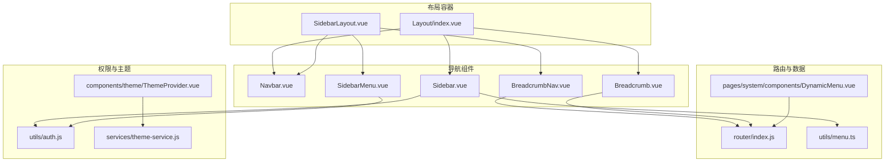
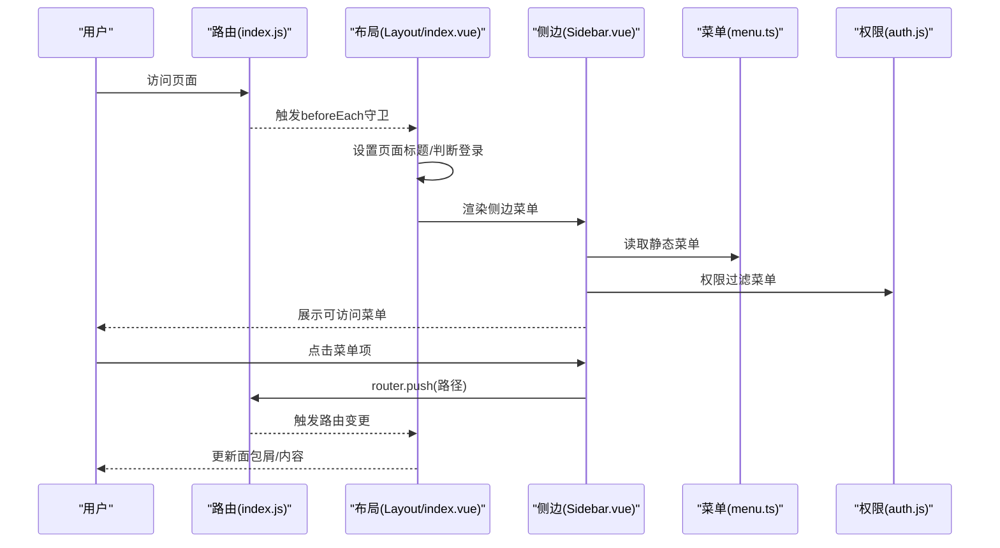
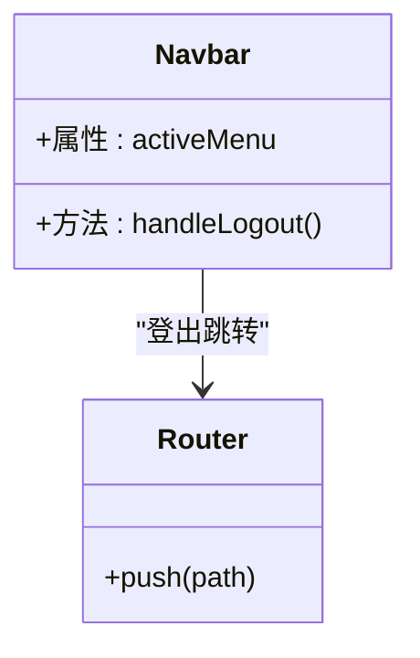
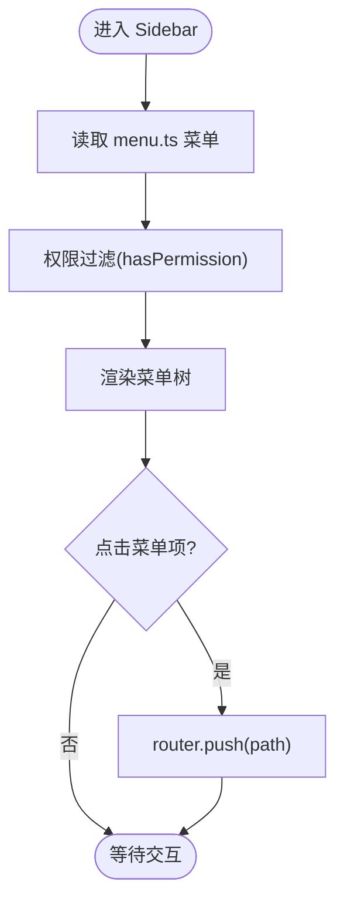
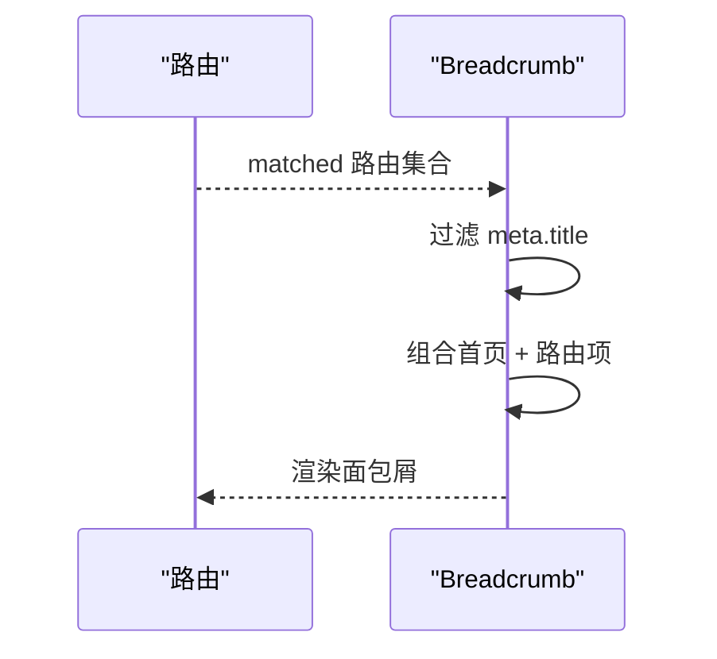
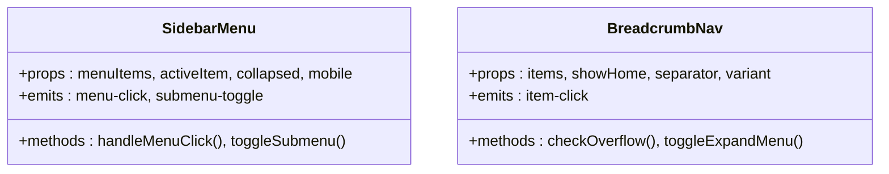
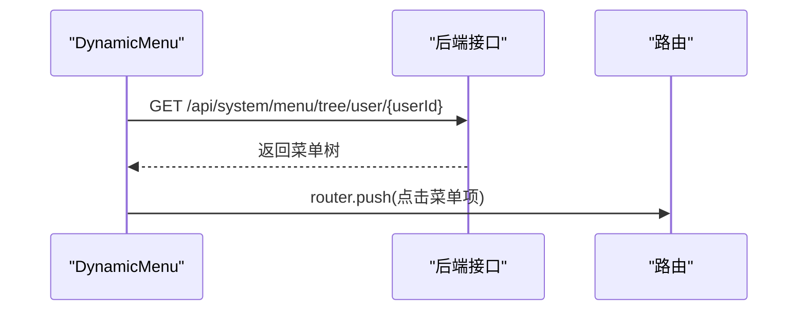
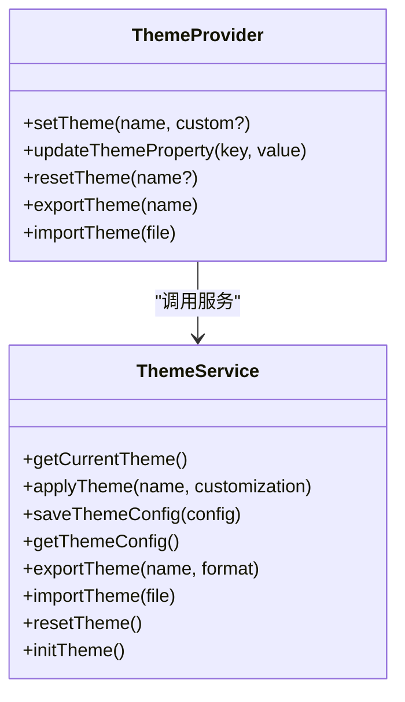
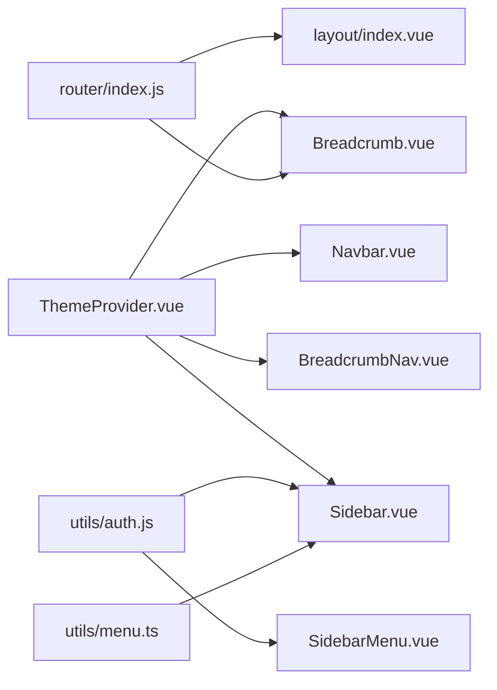

# 导航组件

<cite>
**本文引用的文件**
- [Breadcrumb.vue](file://07-frontend/src/components/common/Breadcrumb.vue)
- [Navbar.vue](file://07-frontend/src/components/common/Navbar.vue)
- [Sidebar.vue](file://07-frontend/src/components/common/Sidebar.vue)
- [index.js](file://07-frontend/src/router/index.js)
- [menu.ts](file://07-frontend/src/utils/menu.ts)
- [layout/index.vue](file://07-frontend/src/layout/index.vue)
- [SidebarLayout.vue](file://07-frontend/src/components/common/layout/SidebarLayout.vue)
- [HeaderNavigation.vue](file://07-frontend/src/components/common/layout/HeaderNavigation.vue)
- [BreadcrumbNav.vue](file://07-frontend/src/components/common/layout/BreadcrumbNav.vue)
- [SidebarMenu.vue](file://07-frontend/src/components/common/layout/SidebarMenu.vue)
- [DynamicMenu.vue](file://07-frontend/src/pages/system/components/DynamicMenu.vue)
- [auth.js](file://07-frontend/src/utils/auth.js)
- [ThemeProvider.vue](file://07-frontend/src/components/theme/ThemeProvider.vue)
- [theme-service.js](file://07-frontend/src/services/theme-service.js)
</cite>

## 目录
1. [引言](#引言)
2. [项目结构](#项目结构)
3. [核心组件](#核心组件)
4. [架构总览](#架构总览)
5. [详细组件分析](#详细组件分析)
6. [依赖关系分析](#依赖关系分析)
7. [性能考量](#性能考量)
8. [故障排查指南](#故障排查指南)
9. [结论](#结论)
10. [附录](#附录)

## 引言
本文件围绕导航类组件（Navbar、Sidebar、Breadcrumb）的实现原理与使用模式进行深入解析，覆盖全局导航与层级路径展示的职责划分、与 Vue Router 的集成机制、动态菜单数据绑定方式、权限控制支持、组件 API 详解、事件交互逻辑、自定义主题适配方案，并结合代码示例路径展示如何构建一致性的导航体验。同时包含响应式处理、无障碍访问支持以及常见导航状态异常的调试方法。

## 项目结构
导航体系由三类组件构成：
- 顶层导航：Navbar（顶部导航栏）
- 侧边导航：Sidebar（侧边菜单）与 SidebarMenu（通用菜单组件）
- 路径导航：Breadcrumb（面包屑）与 BreadcrumbNav（通用面包屑组件）

它们通过 Vue Router 的路由元信息驱动，配合菜单数据源与权限工具，形成统一的导航体验。

图表来源
- [layout/index.vue](file://07-frontend/src/layout/index.vue#L1-L120)
- [SidebarLayout.vue](file://07-frontend/src/components/common/layout/SidebarLayout.vue#L1-L120)
- [Navbar.vue](file://07-frontend/src/components/common/Navbar.vue#L1-L94)
- [Sidebar.vue](file://07-frontend/src/components/common/Sidebar.vue#L1-L136)
- [SidebarMenu.vue](file://07-frontend/src/components/common/layout/SidebarMenu.vue#L1-L120)
- [Breadcrumb.vue](file://07-frontend/src/components/common/Breadcrumb.vue#L1-L70)
- [BreadcrumbNav.vue](file://07-frontend/src/components/common/layout/BreadcrumbNav.vue#L1-L120)
- [index.js](file://07-frontend/src/router/index.js#L1-L120)
- [menu.ts](file://07-frontend/src/utils/menu.ts#L1-L84)
- [DynamicMenu.vue](file://07-frontend/src/pages/system/components/DynamicMenu.vue#L1-L71)
- [auth.js](file://07-frontend/src/utils/auth.js#L1-L110)
- [ThemeProvider.vue](file://07-frontend/src/components/theme/ThemeProvider.vue#L1-L120)
- [theme-service.js](file://07-frontend/src/services/theme-service.js#L1-L120)

章节来源
- [layout/index.vue](file://07-frontend/src/layout/index.vue#L1-L120)
- [SidebarLayout.vue](file://07-frontend/src/components/common/layout/SidebarLayout.vue#L1-L120)

## 核心组件
- Navbar：顶部导航栏，包含品牌标识、主导航菜单与用户下拉菜单；负责登出跳转与用户信息展示。
- Sidebar：侧边菜单，基于 Element Plus 菜单组件，支持折叠、图标解析、权限过滤与路由跳转。
- Breadcrumb：基于路由元信息的面包屑，自动根据 matched 路由生成层级路径。
- SidebarMenu：通用侧边菜单组件，支持分组、徽章、展开/收起、移动端与悬浮提示。
- BreadcrumbNav：通用面包屑组件，支持溢出折叠、展开菜单、多变体样式与响应式。
- DynamicMenu：动态菜单组件，按用户维度拉取菜单树并渲染 Element Plus 菜单。
- ThemeProvider：主题提供者，集中管理主题变量与切换；theme-service 提供服务化能力。

章节来源
- [Navbar.vue](file://07-frontend/src/components/common/Navbar.vue#L1-L94)
- [Sidebar.vue](file://07-frontend/src/components/common/Sidebar.vue#L1-L136)
- [Breadcrumb.vue](file://07-frontend/src/components/common/Breadcrumb.vue#L1-L70)
- [SidebarMenu.vue](file://07-frontend/src/components/common/layout/SidebarMenu.vue#L1-L120)
- [BreadcrumbNav.vue](file://07-frontend/src/components/common/layout/BreadcrumbNav.vue#L1-L120)
- [DynamicMenu.vue](file://07-frontend/src/pages/system/components/DynamicMenu.vue#L1-L71)
- [ThemeProvider.vue](file://07-frontend/src/components/theme/ThemeProvider.vue#L1-L120)
- [theme-service.js](file://07-frontend/src/services/theme-service.js#L1-L120)

## 架构总览
导航体系围绕“路由元信息 + 菜单数据 + 权限校验 + 主题适配”四要素协作：
- 路由元信息：用于面包屑标题与页面标题设置。
- 菜单数据：静态 menu.ts 或后端动态菜单树。
- 权限校验：基于用户权限过滤菜单项。
- 主题适配：通过 CSS 变量与主题服务统一风格。

图表来源
- [index.js](file://07-frontend/src/router/index.js#L190-L228)
- [layout/index.vue](file://07-frontend/src/layout/index.vue#L170-L210)
- [Sidebar.vue](file://07-frontend/src/components/common/Sidebar.vue#L60-L103)
- [menu.ts](file://07-frontend/src/utils/menu.ts#L1-L84)
- [auth.js](file://07-frontend/src/utils/auth.js#L69-L91)

## 详细组件分析

### Navbar 组件
- 职责：顶部导航栏，包含品牌区、主导航菜单、用户下拉菜单。
- 关键点：
  - 使用 Element Plus 的水平菜单与下拉组件。
  - 登出事件触发路由跳转至登录页。
  - 样式采用 scoped 并设置阴影与配色。
- 与路由集成：无直接路由绑定，但通过登出跳转影响全局导航状态。

图表来源
- [Navbar.vue](file://07-frontend/src/components/common/Navbar.vue#L43-L54)

章节来源
- [Navbar.vue](file://07-frontend/src/components/common/Navbar.vue#L1-L94)

### Sidebar 组件
- 职责：侧边菜单，支持折叠、图标解析、权限过滤与路由跳转。
- 关键点：
  - 使用 Element Plus 菜单组件，绑定当前路由为默认激活项。
  - 通过 menu.ts 动态渲染菜单树。
  - 权限过滤：hasPermission 递归过滤菜单，空子菜单会被清理。
  - 图标解析：resolveIcon 将字符串映射为 Element Plus 图标组件。
  - 路由跳转：goToPath 使用 router.push。
- 与路由集成：default-active 绑定当前路由，点击菜单项触发路由跳转。

图表来源
- [Sidebar.vue](file://07-frontend/src/components/common/Sidebar.vue#L60-L103)
- [menu.ts](file://07-frontend/src/utils/menu.ts#L1-L84)
- [auth.js](file://07-frontend/src/utils/auth.js#L69-L91)

章节来源
- [Sidebar.vue](file://07-frontend/src/components/common/Sidebar.vue#L1-L136)
- [menu.ts](file://07-frontend/src/utils/menu.ts#L1-L84)
- [auth.js](file://07-frontend/src/utils/auth.js#L69-L91)

### Breadcrumb 组件
- 职责：基于路由元信息生成面包屑，自动包含首页与当前层级。
- 关键点：
  - 通过 route.matched 过滤 meta.title 的路由项。
  - 首页固定为“首页”，路径指向“/dashboard”。
  - 支持图标与链接跳转。
- 与路由集成：依赖 Vue Router 的 useRoute 与 matched。

图表来源
- [Breadcrumb.vue](file://07-frontend/src/components/common/Breadcrumb.vue#L26-L44)
- [index.js](file://07-frontend/src/router/index.js#L1-L120)

章节来源
- [Breadcrumb.vue](file://07-frontend/src/components/common/Breadcrumb.vue#L1-L70)
- [index.js](file://07-frontend/src/router/index.js#L1-L120)

### SidebarMenu 与 BreadcrumbNav（通用组件）
- SidebarMenu：
  - 支持分组、徽章、展开/收起、移动端样式、悬浮提示。
  - 通过 emit 暴露 menu-click 与 submenu-toggle 事件。
  - 支持外部链接与内部路由跳转。
- BreadcrumbNav：
  - 支持溢出检测与展开菜单、多种变体样式、响应式处理。
  - 支持自定义插槽（suffix、extra）与键盘/点击外部关闭。

图表来源
- [SidebarMenu.vue](file://07-frontend/src/components/common/layout/SidebarMenu.vue#L193-L360)
- [BreadcrumbNav.vue](file://07-frontend/src/components/common/layout/BreadcrumbNav.vue#L142-L337)

章节来源
- [SidebarMenu.vue](file://07-frontend/src/components/common/layout/SidebarMenu.vue#L1-L405)
- [BreadcrumbNav.vue](file://07-frontend/src/components/common/layout/BreadcrumbNav.vue#L1-L337)

### 动态菜单与权限控制
- DynamicMenu：基于用户 ID 拉取后端菜单树，渲染 Element Plus 菜单，支持 router 模式。
- 权限工具：auth.js 提供 hasPermission、hasAnyPermission、hasAllPermissions、isAdmin 等方法，用于前端权限判断与过滤。

图表来源
- [DynamicMenu.vue](file://07-frontend/src/pages/system/components/DynamicMenu.vue#L24-L63)
- [auth.js](file://07-frontend/src/utils/auth.js#L69-L91)

章节来源
- [DynamicMenu.vue](file://07-frontend/src/pages/system/components/DynamicMenu.vue#L1-L71)
- [auth.js](file://07-frontend/src/utils/auth.js#L1-L110)

### 主题适配方案
- ThemeProvider：集中管理主题变量（颜色、字体、圆角、布局等），通过 CSS 变量注入，支持系统主题监听与切换。
- theme-service：提供主题获取、应用、保存、导出/导入、重置等服务化能力，直接操作 documentElement.style 设置 CSS 变量。

图表来源
- [ThemeProvider.vue](file://07-frontend/src/components/theme/ThemeProvider.vue#L192-L303)
- [theme-service.js](file://07-frontend/src/services/theme-service.js#L1-L171)

章节来源
- [ThemeProvider.vue](file://07-frontend/src/components/theme/ThemeProvider.vue#L1-L326)
- [theme-service.js](file://07-frontend/src/services/theme-service.js#L1-L310)

## 依赖关系分析
- 路由与导航：
  - index.js 定义路由与 beforeEach 守卫，设置页面标题与登录拦截。
  - Breadcrumb 依赖 route.matched 与 meta.title。
  - Sidebar 依赖 menu.ts 与 auth.js 权限。
- 组件耦合：
  - Sidebar 与 SidebarMenu 互补：Sidebar 偏向业务侧边栏，SidebarMenu 更通用。
  - Breadcrumb 与 BreadcrumbNav：前者轻量，后者功能丰富。
- 主题与导航：
  - ThemeProvider 与 theme-service 为导航组件提供统一风格，避免硬编码颜色与尺寸。

图表来源
- [index.js](file://07-frontend/src/router/index.js#L1-L120)
- [Breadcrumb.vue](file://07-frontend/src/components/common/Breadcrumb.vue#L26-L44)
- [layout/index.vue](file://07-frontend/src/layout/index.vue#L170-L210)
- [menu.ts](file://07-frontend/src/utils/menu.ts#L1-L84)
- [Sidebar.vue](file://07-frontend/src/components/common/Sidebar.vue#L60-L103)
- [auth.js](file://07-frontend/src/utils/auth.js#L69-L91)
- [ThemeProvider.vue](file://07-frontend/src/components/theme/ThemeProvider.vue#L192-L303)

章节来源
- [index.js](file://07-frontend/src/router/index.js#L1-L228)
- [Sidebar.vue](file://07-frontend/src/components/common/Sidebar.vue#L1-L136)
- [Breadcrumb.vue](file://07-frontend/src/components/common/Breadcrumb.vue#L1-L70)
- [ThemeProvider.vue](file://07-frontend/src/components/theme/ThemeProvider.vue#L1-L326)

## 性能考量
- 菜单渲染：
  - Sidebar 与 SidebarMenu 对菜单进行递归渲染，建议控制菜单层级深度与节点数量，避免过度嵌套。
  - 权限过滤在 computed 中执行，注意避免重复计算，必要时缓存中间结果。
- 面包屑：
  - BreadcrumbNav 的溢出检测使用 nextTick 与 resize 事件，建议在高频滚动场景下节流或防抖。
- 主题切换：
  - ThemeProvider 与 theme-service 通过 CSS 变量批量更新，避免频繁 DOM 重排；建议减少不必要的主题切换频率。

[本节为通用指导，不涉及具体文件分析]

## 故障排查指南
- 登录状态异常
  - 现象：访问受保护页面被重定向到登录页。
  - 排查：检查路由 beforeEach 守卫中的登录判断与重定向逻辑。
  - 参考路径：[index.js](file://07-frontend/src/router/index.js#L200-L228)
- 菜单不显示或空白
  - 现象：侧边菜单为空。
  - 排查：确认 menu.ts 是否正确导出；检查权限过滤逻辑；确认用户权限是否正确写入本地存储。
  - 参考路径：[menu.ts](file://07-frontend/src/utils/menu.ts#L1-L84)、[auth.js](file://07-frontend/src/utils/auth.js#L69-L91)
- 面包屑不更新
  - 现象：切换页面后面包屑未变化。
  - 排查：确认 matched 路由是否包含 meta.title；检查 Layout 中的面包屑更新逻辑。
  - 参考路径：[Breadcrumb.vue](file://07-frontend/src/components/common/Breadcrumb.vue#L26-L44)、[layout/index.vue](file://07-frontend/src/layout/index.vue#L366-L384)
- 主题切换无效
  - 现象：切换主题后样式未生效。
  - 排查：确认 CSS 变量是否正确写入 documentElement；检查 ThemeProvider 的 data-theme 属性与 theme-service 的 applyThemeToDOM。
  - 参考路径：[ThemeProvider.vue](file://07-frontend/src/components/theme/ThemeProvider.vue#L286-L303)、[theme-service.js](file://07-frontend/src/services/theme-service.js#L114-L151)

章节来源
- [index.js](file://07-frontend/src/router/index.js#L200-L228)
- [menu.ts](file://07-frontend/src/utils/menu.ts#L1-L84)
- [auth.js](file://07-frontend/src/utils/auth.js#L69-L91)
- [Breadcrumb.vue](file://07-frontend/src/components/common/Breadcrumb.vue#L26-L44)
- [layout/index.vue](file://07-frontend/src/layout/index.vue#L366-L384)
- [ThemeProvider.vue](file://07-frontend/src/components/theme/ThemeProvider.vue#L286-L303)
- [theme-service.js](file://07-frontend/src/services/theme-service.js#L114-L151)

## 结论
本导航体系以路由元信息为核心，结合静态菜单与动态菜单、权限过滤与主题服务，实现了统一、可扩展且具备一致性的导航体验。Sidebar 与 SidebarMenu 提供灵活的菜单渲染与交互，Breadcrumb 与 BreadcrumbNav 提供清晰的层级路径与响应式适配。通过 ThemeProvider 与 theme-service，导航组件风格可随主题自由切换。建议在实际项目中：
- 明确路由 meta.title 的规范，确保面包屑一致性。
- 将菜单与权限解耦，优先使用后端动态菜单树。
- 控制菜单层级与节点数量，优化渲染性能。
- 使用主题变量统一风格，避免硬编码样式。

[本节为总结性内容，不涉及具体文件分析]

## 附录

### 组件 API 一览（示例路径）
- Navbar
  - 事件：无（仅登出跳转）
  - 参考路径：[Navbar.vue](file://07-frontend/src/components/common/Navbar.vue#L43-L54)
- Sidebar
  - 属性：无（内部使用 router、route、menu.ts、auth.js）
  - 事件：无（内部使用 goToPath）
  - 参考路径：[Sidebar.vue](file://07-frontend/src/components/common/Sidebar.vue#L60-L103)
- Breadcrumb
  - 属性：无（内部使用 route.matched）
  - 参考路径：[Breadcrumb.vue](file://07-frontend/src/components/common/Breadcrumb.vue#L26-L44)
- SidebarMenu
  - 属性：menuItems、activeItem、collapsed、mobile、showIcons、expandOnHover、groupBy
  - 事件：menu-click、submenu-toggle
  - 参考路径：[SidebarMenu.vue](file://07-frontend/src/components/common/layout/SidebarMenu.vue#L193-L237)
- BreadcrumbNav
  - 属性：items、showHome、homeLabel、homePath、showHomeText、separator、variant、maxItems、showExpandButton、collapsible
  - 事件：item-click
  - 参考路径：[BreadcrumbNav.vue](file://07-frontend/src/components/common/layout/BreadcrumbNav.vue#L142-L180)
- DynamicMenu
  - 属性：userId（必填）
  - 事件：无（内部使用 router.push）
  - 参考路径：[DynamicMenu.vue](file://07-frontend/src/pages/system/components/DynamicMenu.vue#L24-L63)

### 与 Vue Router 的集成要点
- 路由守卫：在 beforeEach 中设置页面标题与登录拦截。
- 面包屑：通过 route.matched 与 meta.title 生成层级路径。
- 菜单：静态 menu.ts 或后端动态菜单树，结合权限过滤与图标解析。

章节来源
- [index.js](file://07-frontend/src/router/index.js#L190-L228)
- [Breadcrumb.vue](file://07-frontend/src/components/common/Breadcrumb.vue#L26-L44)
- [menu.ts](file://07-frontend/src/utils/menu.ts#L1-L84)
- [DynamicMenu.vue](file://07-frontend/src/pages/system/components/DynamicMenu.vue#L24-L63)

### 响应式与无障碍支持
- 响应式：
  - SidebarLayout 与 BreadcrumbNav 在小屏下隐藏或折叠，提供移动端遮罩层与展开菜单。
  - 参考路径：[SidebarLayout.vue](file://07-frontend/src/components/common/layout/SidebarLayout.vue#L193-L235)、[BreadcrumbNav.vue](file://07-frontend/src/components/common/layout/BreadcrumbNav.vue#L653-L732)
- 无障碍：
  - 提供 aria-label 与键盘事件（如 ESC 关闭展开菜单）。
  - 参考路径：[SidebarLayout.vue](file://07-frontend/src/components/common/layout/SidebarLayout.vue#L17-L31)、[BreadcrumbNav.vue](file://07-frontend/src/components/common/layout/BreadcrumbNav.vue#L312-L336)

### 权限控制最佳实践
- 前端权限：使用 auth.js 的 hasPermission/hasAnyPermission/hasAllPermissions。
- 后端权限：DynamicMenu 通过后端接口返回菜单树，确保权限一致性。
- 参考路径：[auth.js](file://07-frontend/src/utils/auth.js#L69-L91)、[DynamicMenu.vue](file://07-frontend/src/pages/system/components/DynamicMenu.vue#L24-L63)