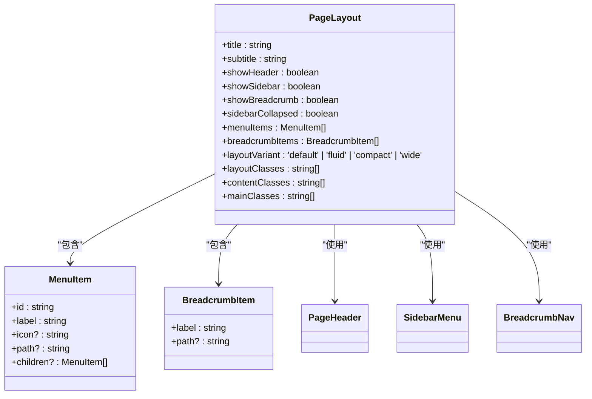
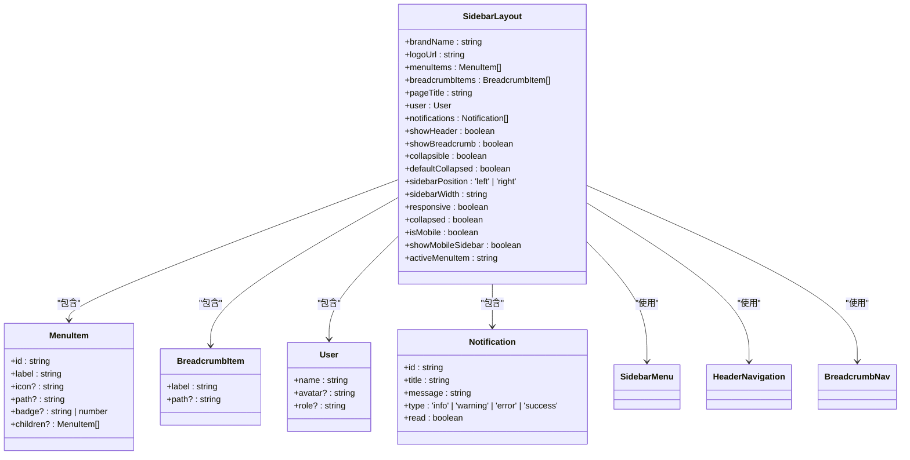
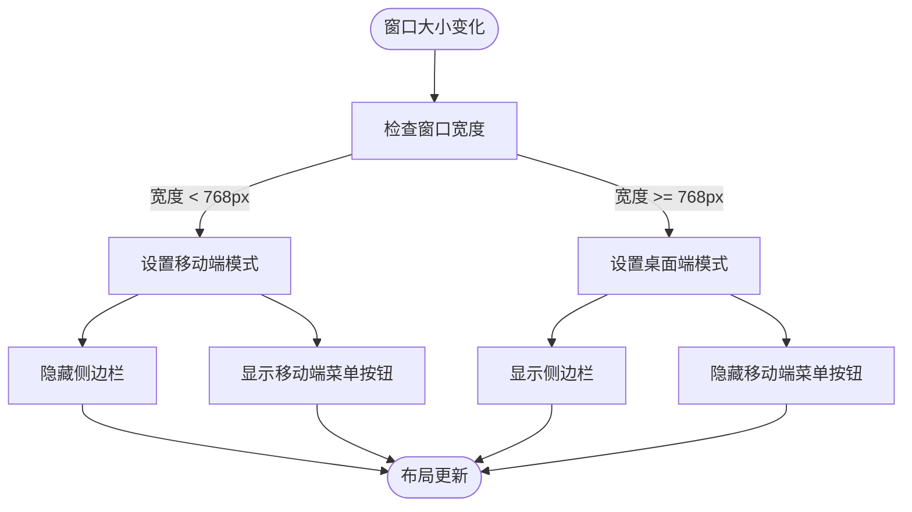
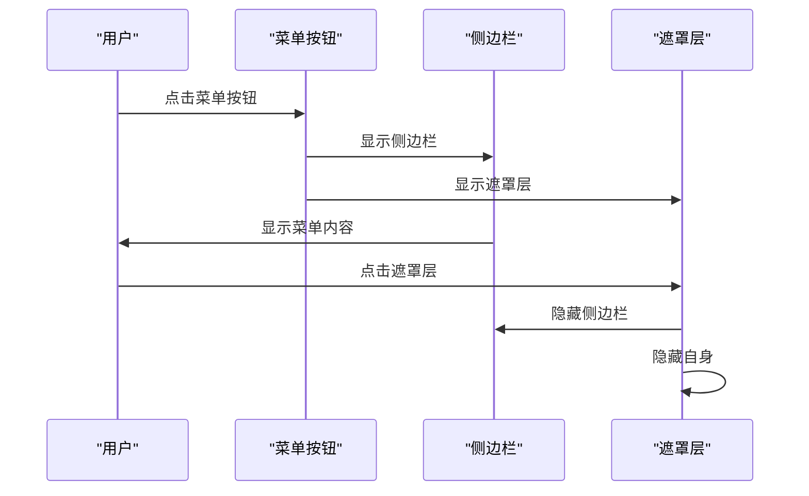
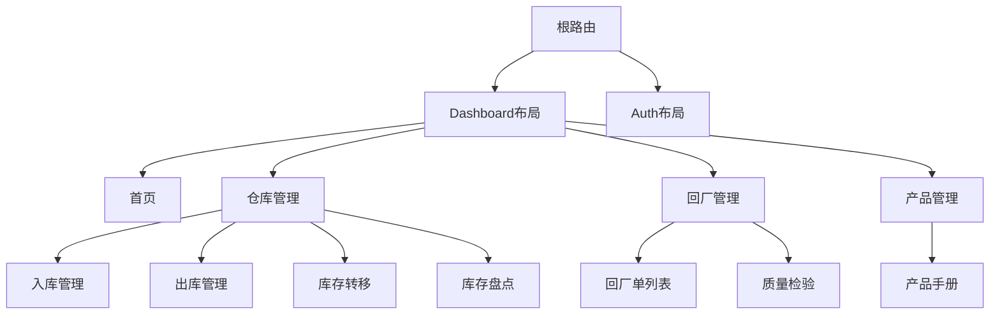
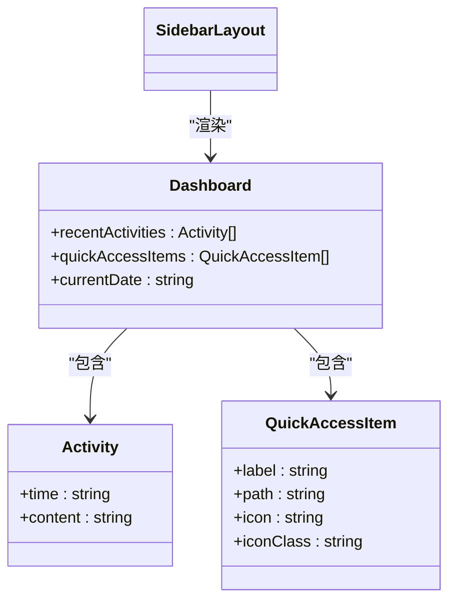
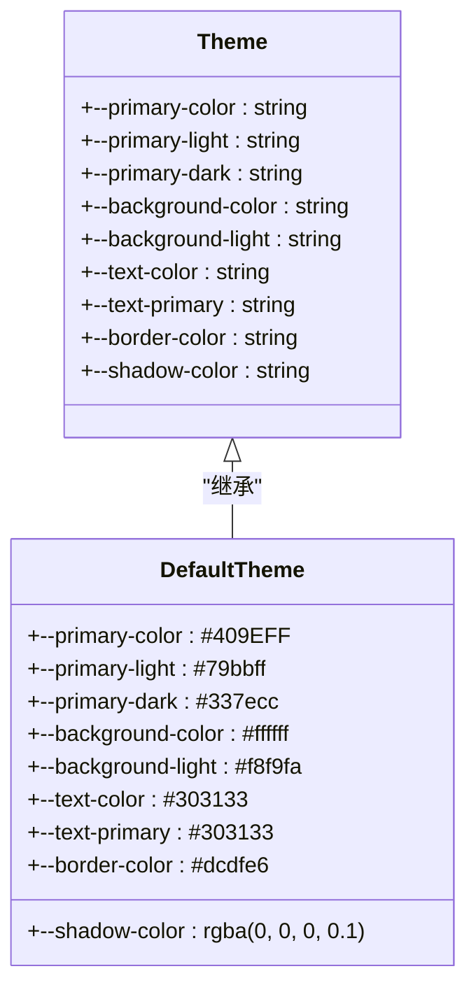

# 布局组件

<cite>
**本文档引用的文件**   
- [PageLayout.vue](file://07-frontend/src/components/common/layout/PageLayout.vue)
- [SidebarLayout.vue](file://07-frontend/src/components/common/layout/SidebarLayout.vue)
- [Sidebar.vue](file://07-frontend/src/components/common/Sidebar.vue)
- [index.vue](file://07-frontend/src/layout/index.vue)
- [Dashboard.vue](file://07-frontend/src/pages/system/Dashboard.vue)
- [sidebar-themes.scss](file://07-frontend/src/assets/styles/layout/sidebar-themes.scss)
- [default.scss](file://07-frontend/src/assets/styles/themes/default.scss)
- [HeaderNavigation.vue](file://07-frontend/src/components/common/layout/HeaderNavigation.vue)
- [BreadcrumbNav.vue](file://07-frontend/src/components/common/layout/BreadcrumbNav.vue)
</cite>

## 目录
1. [引言](#引言)
2. [核心布局组件设计](#核心布局组件设计)
3. [响应式布局机制](#响应式布局机制)
4. [插槽与属性集成](#插槽与属性集成)
5. [多层级路由嵌套应用](#多层级路由嵌套应用)
6. [主题切换与移动端适配](#主题切换与移动端适配)
7. [性能优化与问题排查](#性能优化与问题排查)
8. [总结](#总结)

## 引言
本文档详细阐述了企业智能管理系统中的布局类UI组件设计与实现，重点分析PageLayout和SidebarLayout的结构设计、响应式布局机制及与其它组件的集成方式。通过插槽（slot）和属性（props）实现灵活的内容区域划分与侧边栏控制，支持多层级路由嵌套场景下的页面布局管理。

## 核心布局组件设计

### PageLayout组件结构
PageLayout组件采用模块化设计，通过插槽机制实现灵活的内容组织。组件包含头部、侧边栏、面包屑导航和主内容区域，支持多种布局变体。



**Diagram sources**
- [PageLayout.vue](file://07-frontend/src/components/common/layout/PageLayout.vue#L35-L58)

**Section sources**
- [PageLayout.vue](file://07-frontend/src/components/common/layout/PageLayout.vue#L1-L194)

### SidebarLayout组件结构
SidebarLayout组件提供完整的侧边栏布局解决方案，支持左右侧边栏、折叠/展开、移动端适配等功能。组件通过响应式设计实现跨设备兼容。



**Diagram sources**
- [SidebarLayout.vue](file://07-frontend/src/components/common/layout/SidebarLayout.vue#L95-L138)

**Section sources**
- [SidebarLayout.vue](file://07-frontend/src/components/common/layout/SidebarLayout.vue#L1-L457)

## 响应式布局机制

### 断点检测与适配
布局组件通过监听窗口大小变化，动态调整布局结构。在移动端（<768px）自动隐藏侧边栏，通过滑动菜单访问。



**Diagram sources**
- [SidebarLayout.vue](file://07-frontend/src/components/common/layout/SidebarLayout.vue#L216-L234)

### 移动端交互流程
移动端通过滑动菜单实现导航，用户点击菜单按钮后显示侧边栏，点击遮罩层或关闭按钮隐藏。



**Diagram sources**
- [SidebarLayout.vue](file://07-frontend/src/components/common/layout/SidebarLayout.vue#L195-L206)

## 插槽与属性集成

### 插槽机制实现
布局组件通过命名插槽实现内容的灵活注入，支持头部、侧边栏、面包屑、页脚等区域的自定义。

```mermaid
classDiagram
class PageLayout {
+$slots : {
header : VNode[],
"header-actions" : VNode[],
sidebar : VNode[],
"breadcrumb" : VNode[],
default : VNode[]
}
}
class SidebarLayout {
+$slots : {
menu : VNode[],
sidebarFooter : VNode[],
header : VNode[],
"headerActions" : VNode[],
breadcrumb : VNode[],
default : VNode[]
}
}
PageLayout --> "插槽" : "定义"
SidebarLayout --> "插槽" : "定义"
```

**Diagram sources**
- [PageLayout.vue](file://07-frontend/src/components/common/layout/PageLayout.vue#L3-L25)
- [SidebarLayout.vue](file://07-frontend/src/components/common/layout/SidebarLayout.vue#L34-L47)

### 属性配置体系
通过props属性实现组件的可配置性，支持品牌名称、logo、菜单项、用户信息等的自定义。

| 属性名称 | 类型 | 默认值 | 描述 |
|---------|------|--------|------|
| brandName | string | 'Application' | 品牌名称 |
| logoUrl | string | undefined | logo图片URL |
| menuItems | MenuItem[] | [] | 菜单项数组 |
| breadcrumbItems | BreadcrumbItem[] | [] | 面包屑项数组 |
| pageTitle | string | undefined | 页面标题 |
| user | User | undefined | 用户信息 |
| notifications | Notification[] | [] | 通知列表 |
| showHeader | boolean | true | 是否显示头部 |
| showBreadcrumb | boolean | true | 是否显示面包屑 |
| collapsible | boolean | true | 是否可折叠 |
| defaultCollapsed | boolean | false | 默认折叠状态 |

**Diagram sources**
- [SidebarLayout.vue](file://07-frontend/src/components/common/layout/SidebarLayout.vue#L123-L151)

## 多层级路由嵌套应用

### 路由与布局集成
通过Vue Router与布局组件的结合，实现多层级路由的页面布局管理。



**Diagram sources**
- [index.js](file://07-frontend/src/router/index.js#L17-L192)

### 实际业务页面示例
以系统管理首页为例，展示布局组件的实际应用。



**Diagram sources**
- [Dashboard.vue](file://07-frontend/src/pages/system/Dashboard.vue#L127-L144)

**Section sources**
- [Dashboard.vue](file://07-frontend/src/pages/system/Dashboard.vue#L1-L378)

## 主题切换与移动端适配

### 主题系统实现
通过CSS变量和主题类实现主题切换功能，支持深色、浅色等主题。



**Diagram sources**
- [default.scss](file://07-frontend/src/assets/styles/themes/default.scss#L4-L37)

### 移动端适配策略
采用移动优先的设计策略，通过媒体查询实现不同设备的布局适配。

| 设备类型 | 断点 | 布局特点 |
|---------|------|---------|
| 移动端 | <768px | 侧边栏隐藏，通过滑动菜单访问 |
| 平板 | 768px-1024px | 侧边栏可折叠，紧凑布局 |
| 桌面端 | >1024px | 完整侧边栏，宽屏布局 |

**Diagram sources**
- [sidebar-themes.scss](file://07-frontend/src/assets/styles/layout/sidebar-themes.scss#L311-L338)

## 性能优化与问题排查

### 性能优化建议
1. **减少重绘重排**：使用CSS transform代替position属性实现动画
2. **虚拟滚动**：对于长列表使用虚拟滚动技术
3. **懒加载**：按需加载非关键组件
4. **事件委托**：减少事件监听器数量

### 常见布局问题排查
1. **侧边栏不显示**：检查`showSidebar`属性是否为true
2. **响应式失效**：确认是否正确引入了响应式CSS
3. **插槽内容不显示**：检查插槽名称是否正确
4. **主题切换无效**：验证CSS变量是否正确设置

## 总结
本文档详细分析了布局组件的设计与实现，包括PageLayout和SidebarLayout的结构设计、响应式布局机制、插槽与属性集成、多层级路由嵌套应用、主题切换与移动端适配等方面。通过合理的组件设计和配置体系，实现了灵活、可扩展的页面布局解决方案。