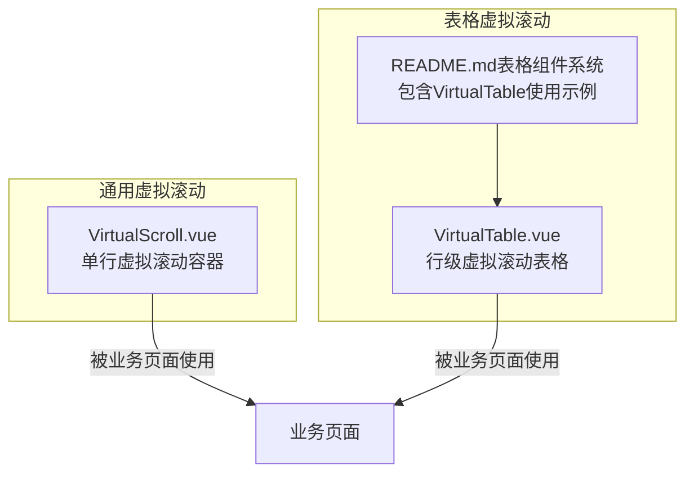
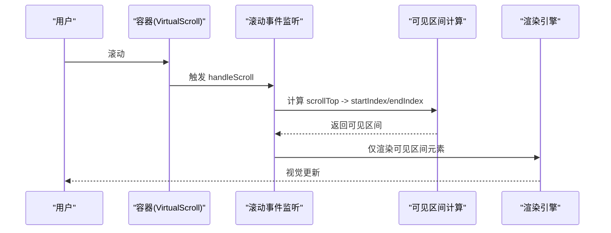
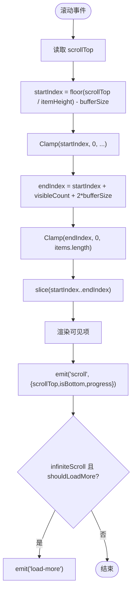
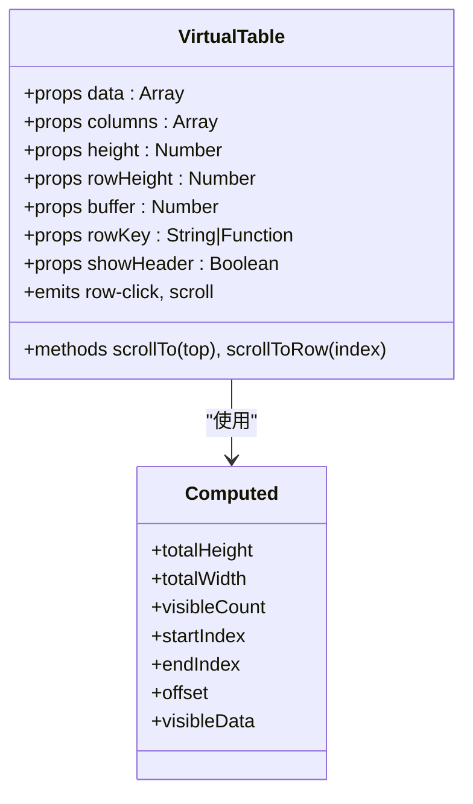
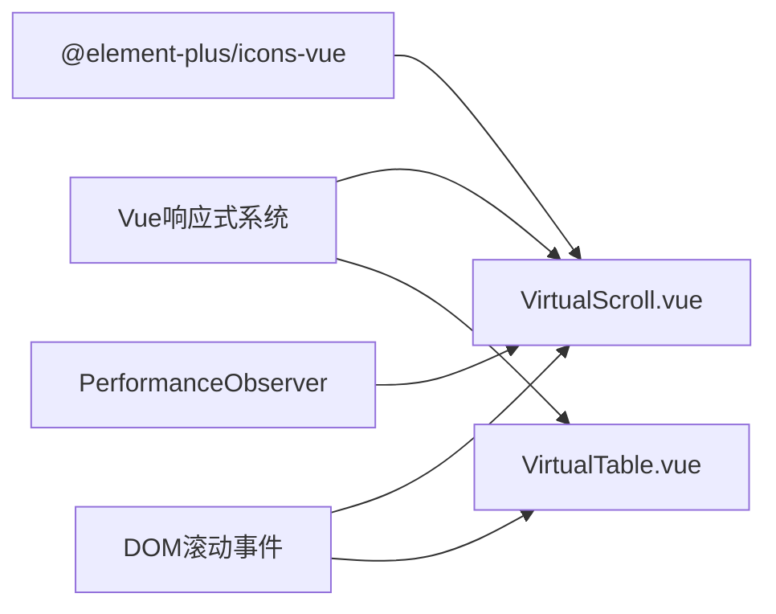

# 虚拟滚动组件

<cite>
**本文引用的文件**
- [VirtualScroll.vue](file://07-frontend/src/components/common/VirtualScroll.vue)
- [VirtualTable.vue](file://07-frontend/src/components/common/tables/VirtualTable.vue)
- [README.md（表格组件系统）](file://07-frontend/src/components/common/tables/README.md)
</cite>

## 目录
1. [简介](#简介)
2. [项目结构](#项目结构)
3. [核心组件](#核心组件)
4. [架构总览](#架构总览)
5. [详细组件分析](#详细组件分析)
6. [依赖关系分析](#依赖关系分析)
7. [性能考量](#性能考量)
8. [故障排查指南](#故障排查指南)
9. [结论](#结论)
10. [附录](#附录)

## 简介
本文件围绕前端仓库中的虚拟滚动组件进行深入技术剖析，重点覆盖以下方面：
- 可视区域计算与元素复用机制
- 滚动性能优化策略
- 如何通过虚拟渲染大幅提升长列表的加载效率与交互流畅度
- 组件配置参数、事件回调、动态高度支持与真实数据源绑定方式
- 大数据量场景下的使用案例、性能监控指标、内存占用优化建议与常见卡顿问题排查

## 项目结构
虚拟滚动能力在两个层面体现：
- 单行虚拟滚动容器：VirtualScroll.vue，适用于任意列表项的虚拟渲染
- 表格虚拟滚动：VirtualTable.vue，面向表格场景的行级虚拟渲染

图示来源
- [VirtualScroll.vue](file://07-frontend/src/components/common/VirtualScroll.vue#L1-L52)
- [VirtualTable.vue](file://07-frontend/src/components/common/tables/VirtualTable.vue#L1-L67)
- [README.md（表格组件系统）](file://07-frontend/src/components/common/tables/README.md#L183-L214)

章节来源
- [VirtualScroll.vue](file://07-frontend/src/components/common/VirtualScroll.vue#L1-L52)
- [VirtualTable.vue](file://07-frontend/src/components/common/tables/VirtualTable.vue#L1-L67)
- [README.md（表格组件系统）](file://07-frontend/src/components/common/tables/README.md#L183-L214)

## 核心组件
- VirtualScroll.vue：提供单行虚拟滚动容器，通过“占位高度 + 内容偏移 + 可见区间切片”的方式，仅渲染可视区域内的元素，同时支持无限滚动加载与性能监控。
- VirtualTable.vue：提供表格场景的虚拟滚动，按行渲染，支持列宽、固定列、格式化渲染与事件透传。

章节来源
- [VirtualScroll.vue](file://07-frontend/src/components/common/VirtualScroll.vue#L84-L125)
- [VirtualTable.vue](file://07-frontend/src/components/common/tables/VirtualTable.vue#L70-L109)

## 架构总览
虚拟滚动的核心思想是“只渲染可见区域”，并通过 transform 进行内容定位，从而避免 DOM 数量随数据规模线性增长。下图展示了 VirtualScroll 的关键流程。

图示来源
- [VirtualScroll.vue](file://07-frontend/src/components/common/VirtualScroll.vue#L171-L200)
- [VirtualScroll.vue](file://07-frontend/src/components/common/VirtualScroll.vue#L148-L156)

章节来源
- [VirtualScroll.vue](file://07-frontend/src/components/common/VirtualScroll.vue#L148-L156)
- [VirtualScroll.vue](file://07-frontend/src/components/common/VirtualScroll.vue#L171-L200)

## 详细组件分析

### VirtualScroll 组件分析
- 可视区域计算
  - 通过容器 scrollTop 与 itemHeight 计算 startIndex，并结合 bufferSize 与容器高度计算 endIndex，得到可见区间。
  - 使用 slice(startIndex, endIndex) 获取可见数据，并为每个数据项附加 index，便于上层使用。
- 元素复用机制
  - 采用“占位高度 + translateY 偏移”布局，内容区仅包含可见项，减少 DOM 数量。
  - 通过 v-for 渲染可见项，key 使用 item.data.id，保证列表项稳定复用。
- 滚动性能优化
  - 使用 will-change: transform 与 transform: translateZ(0) 等 CSS 优化，提升合成层与重绘性能。
  - 使用 PerformanceObserver 与 performance.mark/measurement 进行渲染耗时测量。
  - 使用节流式滚动结束标记（定时器），避免高频滚动事件对渲染造成压力。
- 无限滚动与加载提示
  - 提供 infiniteScroll、loading、noMore、scrollThreshold 等参数，结合 isScrollToBottom 与 shouldLoadMore 判断触发 load-more 事件。
- 事件与方法
  - 事件：scroll（携带 scrollTop、isBottom、progress）、load-more
  - 方法：scrollToIndex、scrollToTop、scrollToBottom、getScrollInfo
- 动态高度支持
  - 当前实现基于固定 itemHeight；若需动态高度，可在上层通过外部高度缓存与 offset 计算进行扩展（见“动态高度支持”章节）。

图示来源
- [VirtualScroll.vue](file://07-frontend/src/components/common/VirtualScroll.vue#L140-L156)
- [VirtualScroll.vue](file://07-frontend/src/components/common/VirtualScroll.vue#L171-L200)
- [VirtualScroll.vue](file://07-frontend/src/components/common/VirtualScroll.vue#L201-L210)

章节来源
- [VirtualScroll.vue](file://07-frontend/src/components/common/VirtualScroll.vue#L140-L156)
- [VirtualScroll.vue](file://07-frontend/src/components/common/VirtualScroll.vue#L171-L200)
- [VirtualScroll.vue](file://07-frontend/src/components/common/VirtualScroll.vue#L201-L210)
- [VirtualScroll.vue](file://07-frontend/src/components/common/VirtualScroll.vue#L248-L280)

### VirtualTable 组件分析
- 行级虚拟滚动
  - 与 VirtualScroll 类似，通过 scrollTop 与 rowHeight 计算 startIndex/endIndex，仅渲染可见行。
  - 通过 transform: translateY(offset) 定位内容区，offset = startIndex * rowHeight。
- 列渲染与格式化
  - 支持列配置 columns，包含 prop、label、width、align、formatter、slot 等，满足多样化的列渲染需求。
- 事件与暴露方法
  - 事件：row-click、scroll
  - 暴露方法：scrollTo、scrollToRow

图示来源
- [VirtualTable.vue](file://07-frontend/src/components/common/tables/VirtualTable.vue#L70-L109)
- [VirtualTable.vue](file://07-frontend/src/components/common/tables/VirtualTable.vue#L118-L152)
- [VirtualTable.vue](file://07-frontend/src/components/common/tables/VirtualTable.vue#L154-L188)

章节来源
- [VirtualTable.vue](file://07-frontend/src/components/common/tables/VirtualTable.vue#L70-L109)
- [VirtualTable.vue](file://07-frontend/src/components/common/tables/VirtualTable.vue#L118-L152)
- [VirtualTable.vue](file://07-frontend/src/components/common/tables/VirtualTable.vue#L154-L188)

### 配置参数与事件回调
- VirtualScroll 参数
  - items: 列表数据数组
  - itemHeight: 每项高度（默认值）
  - containerHeight: 容器高度（默认值）
  - bufferSize: 缓冲区大小（默认值）
  - infiniteScroll: 是否启用无限滚动（默认值）
  - loading: 是否正在加载（默认值）
  - noMore: 是否没有更多数据（默认值）
  - scrollThreshold: 滚动到底部阈值（默认值）
- VirtualScroll 事件
  - scroll: 携带 scrollTop、isBottom、progress
  - load-more: 无限滚动触发
- VirtualTable 参数
  - data、columns、height、rowHeight、buffer、rowKey、showHeader
- VirtualTable 事件
  - row-click、scroll

章节来源
- [VirtualScroll.vue](file://07-frontend/src/components/common/VirtualScroll.vue#L84-L125)
- [VirtualScroll.vue](file://07-frontend/src/components/common/VirtualScroll.vue#L126-L129)
- [VirtualTable.vue](file://07-frontend/src/components/common/tables/VirtualTable.vue#L70-L109)
- [VirtualTable.vue](file://07-frontend/src/components/common/tables/VirtualTable.vue#L111-L111)

### 动态高度支持
- 当前实现基于固定 itemHeight，适合统一行高的场景。
- 若需动态高度，建议在上层维护高度缓存（如 Map 或数组），并在计算 startIndex/endIndex 时累加高度确定 offset 与可见区间，再通过 translateY 定位内容区。该方案与现有 transform 偏移思路一致，可无缝复用。

章节来源
- [VirtualScroll.vue](file://07-frontend/src/components/common/VirtualScroll.vue#L140-L167)
- [VirtualScroll.vue](file://07-frontend/src/components/common/VirtualScroll.vue#L165-L167)

### 与真实数据源的绑定方式
- VirtualScroll
  - 将后端返回的数据直接赋给 items，组件内部通过可见区间切片渲染。
  - 通过 infiniteScroll 与 load-more 事件实现“滚动触底加载更多”，结合 loading/noMore 控制加载状态与边界。
- VirtualTable
  - 将后端返回的表格数据赋给 data，columns 描述列结构与渲染方式。
  - 可结合分页或虚拟滚动两种策略：大数据量优先虚拟滚动，小数据量可直接渲染。

章节来源
- [VirtualScroll.vue](file://07-frontend/src/components/common/VirtualScroll.vue#L126-L129)
- [VirtualTable.vue](file://07-frontend/src/components/common/tables/VirtualTable.vue#L70-L109)
- [README.md（表格组件系统）](file://07-frontend/src/components/common/tables/README.md#L190-L214)

## 依赖关系分析
- 组件依赖
  - Vue 响应式系统（ref、computed、watch、onMounted、onUnmounted）
  - Element Plus 图标 Loading（用于加载指示器）
- 外部接口
  - 浏览器 PerformanceObserver API（用于渲染耗时测量）
  - DOM 滚动事件与 scrollTop 属性
- 组件间关系
  - VirtualScroll 与 VirtualTable 均采用相同的“占位高度 + 偏移定位 + 可见区间切片”的虚拟渲染范式，差异在于行高与列渲染细节。

图示来源
- [VirtualScroll.vue](file://07-frontend/src/components/common/VirtualScroll.vue#L63-L65)
- [VirtualTable.vue](file://07-frontend/src/components/common/tables/VirtualTable.vue#L70-L71)

章节来源
- [VirtualScroll.vue](file://07-frontend/src/components/common/VirtualScroll.vue#L63-L65)
- [VirtualTable.vue](file://07-frontend/src/components/common/tables/VirtualTable.vue#L70-L71)

## 性能考量
- 渲染范围控制
  - 仅渲染可见区间，避免 DOM 数量随数据规模线性增长。
- 布局与合成层优化
  - 使用 transform 偏移定位，配合 will-change: transform 与 transform: translateZ(0)，提升合成层与重绘性能。
- 滚动事件节流
  - 通过定时器标记滚动结束，降低高频滚动事件对渲染的影响。
- 性能监控
  - 使用 PerformanceObserver 与 performance.mark/measurement 记录渲染耗时，便于定位瓶颈。
- 内存占用优化建议
  - 控制每项渲染复杂度，避免在插槽内执行昂贵计算。
  - 合理设置 bufferSize，平衡首屏渲染与滚动时渲染数量。
  - 对于动态高度场景，建议在上层维护高度缓存，避免重复计算。
  - 使用 key 稳定列表项，减少不必要的重排与重绘。
- 大数据量使用建议
  - VirtualTable：直接使用虚拟滚动处理百万级数据。
  - VirtualScroll：结合分页或无限滚动策略，避免一次性加载过多数据。

章节来源
- [VirtualScroll.vue](file://07-frontend/src/components/common/VirtualScroll.vue#L318-L324)
- [VirtualScroll.vue](file://07-frontend/src/components/common/VirtualScroll.vue#L413-L424)
- [VirtualScroll.vue](file://07-frontend/src/components/common/VirtualScroll.vue#L248-L280)
- [VirtualTable.vue](file://07-frontend/src/components/common/tables/VirtualTable.vue#L189-L193)
- [README.md（表格组件系统）](file://07-frontend/src/components/common/tables/README.md#L359-L366)

## 故障排查指南
- 滚动卡顿
  - 检查是否在插槽内执行昂贵计算或频繁 DOM 操作。
  - 适当增大 bufferSize，减少滚动过程中的渲染抖动。
  - 关注 PerformanceObserver 输出的渲染耗时，定位热点。
- 无限滚动不触发
  - 确认 infiniteScroll 为 true，且未设置 noMore。
  - 检查 scrollThreshold 是否过大导致提前判定为底部。
  - 确保滚动容器可滚动，且 scrollTop 与 scrollHeight 正常。
- 加载更多重复触发
  - 在父组件中确保在请求开始时设置 loading，在请求结束时清除 loading。
  - 请求完成后根据结果设置 noMore，避免重复触发。
- 指示器位置异常
  - 确认容器高度与 itemHeight 一致，避免因高度不匹配导致加载指示器错位。
- 滚动到指定位置无效
  - 确认容器引用已正确获取，且索引在有效范围内。

章节来源
- [VirtualScroll.vue](file://07-frontend/src/components/common/VirtualScroll.vue#L126-L129)
- [VirtualScroll.vue](file://07-frontend/src/components/common/VirtualScroll.vue#L201-L210)
- [VirtualScroll.vue](file://07-frontend/src/components/common/VirtualScroll.vue#L212-L231)
- [VirtualScroll.vue](file://07-frontend/src/components/common/VirtualScroll.vue#L248-L280)

## 结论
VirtualScroll 与 VirtualTable 通过“占位高度 + 偏移定位 + 可见区间切片”的虚拟渲染范式，显著降低了大数据量场景下的 DOM 数量与渲染成本，配合 transform 优化、滚动事件节流与性能监控，能够稳定支撑百万级数据的流畅滚动体验。对于动态高度与更复杂的表格场景，可在现有基础上扩展高度缓存与列渲染策略，进一步提升性能与灵活性。

## 附录
- 使用示例参考
  - VirtualTable 大数据量示例：参见表格组件系统文档中的使用示例。

章节来源
- [README.md（表格组件系统）](file://07-frontend/src/components/common/tables/README.md#L190-L214)