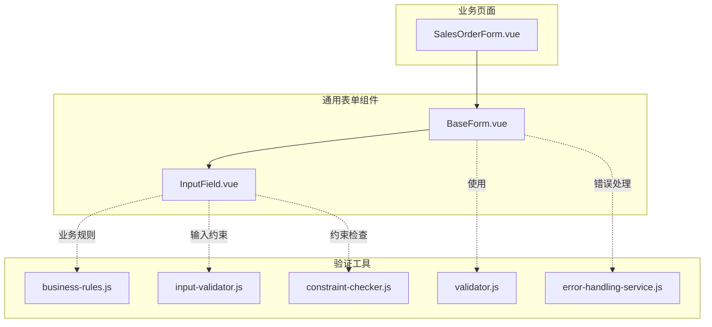
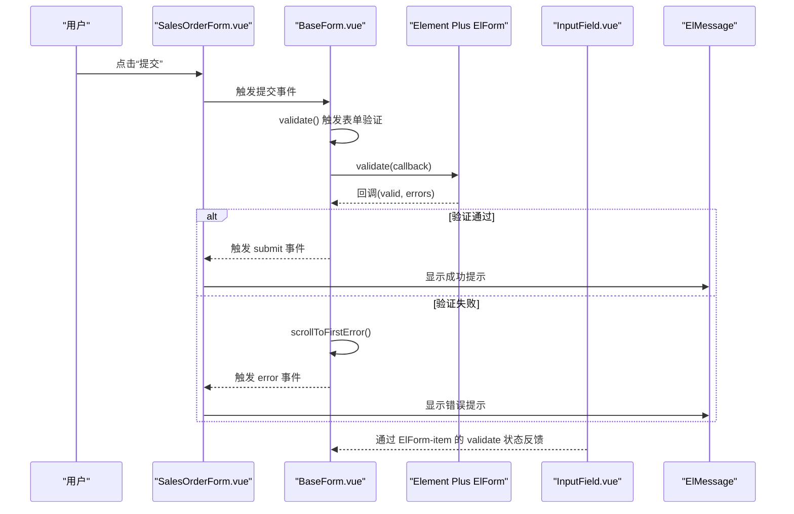
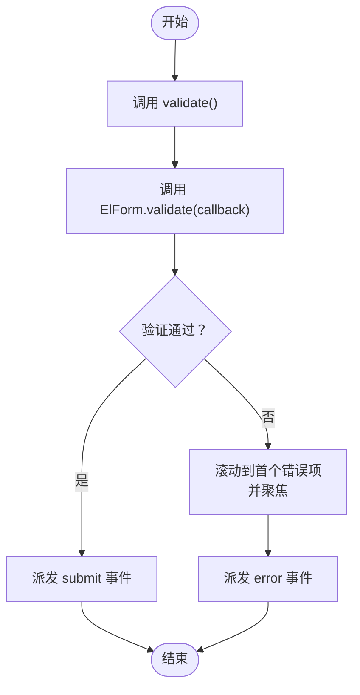
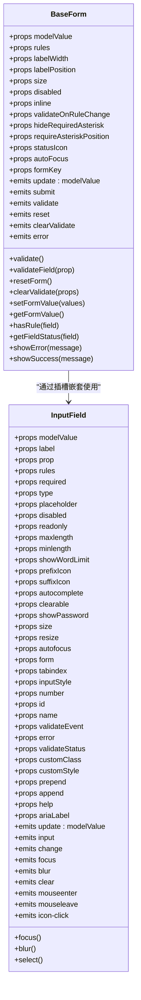
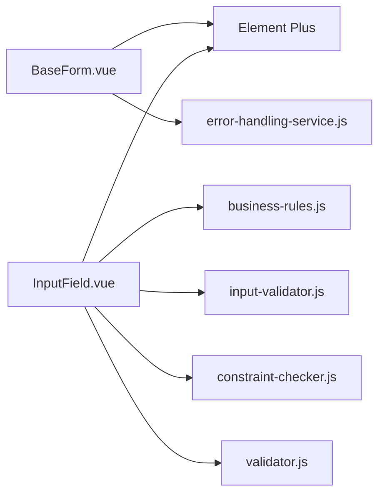

# 表单组件

<cite>
**本文引用的文件**
- [BaseForm.vue](file://07-frontend/src/components/common/forms/BaseForm.vue)
- [InputField.vue](file://07-frontend/src/components/common/forms/FormItems/InputField.vue)
- [SalesOrderForm.vue](file://07-frontend/src/pages/sales/orders/SalesOrderForm.vue)
- [business-rules.js](file://07-frontend/src/utils/validation/business-rules.js)
- [input-validator.js](file://07-frontend/src/utils/validation/input-validator.js)
- [constraint-checker.js](file://07-frontend/src/utils/validation/constraint-checker.js)
- [validator.js](file://07-frontend/src/services/utils/validator.js)
- [error-handling-service.js](file://07-frontend/src/services/error-handling-service.js)
</cite>

## 目录
1. [引言](#引言)
2. [项目结构](#项目结构)
3. [核心组件](#核心组件)
4. [架构总览](#架构总览)
5. [详细组件分析](#详细组件分析)
6. [依赖分析](#依赖分析)
7. [性能考量](#性能考量)
8. [故障排查指南](#故障排查指南)
9. [结论](#结论)
10. [附录](#附录)

## 引言
本文件系统性介绍前端表单基础组件 BaseForm 与 InputField 的设计架构与应用实践，重点阐述：
- BaseForm 如何封装表单验证、数据绑定与提交流程；
- InputField 如何实现输入控制与状态反馈；
- 组件支持的验证规则、错误提示机制与自定义校验函数集成方式；
- 结合实际业务表单场景（如销售订单）演示组合使用方法；
- 性能优化建议、异步验证处理策略及与其他 UI 库的兼容性注意事项。

## 项目结构
本项目采用“按功能域+按组件类型”的混合组织方式：表单基础组件位于通用组件目录，业务页面示例位于对应业务模块中；验证工具分布在 utils/validation 与 services 下，便于复用。

图表来源
- [BaseForm.vue](file://07-frontend/src/components/common/forms/BaseForm.vue#L1-L343)
- [InputField.vue](file://07-frontend/src/components/common/forms/FormItems/InputField.vue#L1-L359)
- [SalesOrderForm.vue](file://07-frontend/src/pages/sales/orders/SalesOrderForm.vue#L1-L151)
- [business-rules.js](file://07-frontend/src/utils/validation/business-rules.js#L1-L976)
- [input-validator.js](file://07-frontend/src/utils/validation/input-validator.js#L559-L802)
- [constraint-checker.js](file://07-frontend/src/utils/validation/constraint-checker.js#L1-L680)
- [validator.js](file://07-frontend/src/services/utils/validator.js#L61-L91)
- [error-handling-service.js](file://07-frontend/src/services/error-handling-service.js#L393-L433)

章节来源
- [BaseForm.vue](file://07-frontend/src/components/common/forms/BaseForm.vue#L1-L343)
- [InputField.vue](file://07-frontend/src/components/common/forms/FormItems/InputField.vue#L1-L359)
- [SalesOrderForm.vue](file://07-frontend/src/pages/sales/orders/SalesOrderForm.vue#L1-L151)

## 核心组件
- BaseForm：基于 Element Plus ElForm 的二次封装，提供统一的表单数据绑定、验证、提交、重置、清空验证、滚动定位、自动聚焦、状态暴露等能力，适配多尺寸、多布局与可访问性需求。
- InputField：基于 Element Plus ElFormItem/ElInput 的输入控件封装，提供 v-model 双向绑定、类型与长度控制、前后缀图标、清空、密码切换、只读/禁用、帮助文本、错误状态与验证状态透传、焦点/选择等公共方法。

章节来源
- [BaseForm.vue](file://07-frontend/src/components/common/forms/BaseForm.vue#L1-L343)
- [InputField.vue](file://07-frontend/src/components/common/forms/FormItems/InputField.vue#L1-L359)

## 架构总览
BaseForm 作为容器组件，负责：
- 统一管理表单数据模型与双向绑定；
- 将外部传入的验证规则与 Element Plus 表单规则对接；
- 封装提交流程，统一触发验证、错误提示与事件派发；
- 提供字段级验证、表单重置、清空验证、状态查询与辅助方法。

InputField 作为输入控件，负责：
- 透传 Element Plus 的输入能力与样式；
- 支持 v-model 类型转换（如 number）；
- 对外暴露聚焦/失焦/全选等常用操作；
- 支持错误与验证状态透传，便于 BaseForm 统一展示。

图表来源
- [BaseForm.vue](file://07-frontend/src/components/common/forms/BaseForm.vue#L164-L224)
- [SalesOrderForm.vue](file://07-frontend/src/pages/sales/orders/SalesOrderForm.vue#L131-L140)

## 详细组件分析

### BaseForm 组件分析
- 设计要点
  - 使用 Element Plus ElForm 作为底层表单容器，承接 Element Plus 的验证体系与交互语义。
  - 通过 props 接收 modelValue、rules、标签宽度/位置、尺寸、禁用、行内布局、验证时机、星号位置与状态图标等配置。
  - 通过 emits 暴露 update:modelValue、submit、validate、reset、clearValidate、error 等事件，便于上层业务监听与联动。
  - 通过 watch 同步外部 modelValue 与内部 formData，保证双向绑定一致性。
  - 提供 validate、validateField、resetForm、clearValidate、setFormValue、getFormValue、hasRule、getFieldStatus、showError、showSuccess 等公共方法，便于外部直接调用。
  - 在提交流程中，先执行 validate，再派发 submit；若验证失败，滚动到首个错误项并派发 error。
  - 支持 autoFocus 自动聚焦第一个可用输入框，提升可访问性与用户体验。

- 关键流程图（提交与验证）

图表来源
- [BaseForm.vue](file://07-frontend/src/components/common/forms/BaseForm.vue#L164-L224)

- 错误处理与提示
  - 提供 showError 与 showSuccess 方法，基于 Element Plus ElMessage 实现全局提示。
  - 提供 scrollToFirstError，自动定位并聚焦首个错误项，改善用户纠错体验。
  - 提供 error 事件，便于上层统一接入业务错误处理服务。

- 与业务页面的协作
  - SalesOrderForm.vue 直接使用 Element Plus ElForm，手动调用 validate 并处理回调，体现传统用法。
  - 若迁移到 BaseForm，则可复用其统一验证与提交流程，减少样板代码。

章节来源
- [BaseForm.vue](file://07-frontend/src/components/common/forms/BaseForm.vue#L1-L343)
- [SalesOrderForm.vue](file://07-frontend/src/pages/sales/orders/SalesOrderForm.vue#L1-L151)

### InputField 组件分析
- 设计要点
  - 作为 ElFormItem/ElInput 的轻量封装，提供丰富的 props 控制输入行为（类型、长度、前后缀、清空、密码切换、只读/禁用、尺寸、可调整大小、自动聚焦、验证事件等）。
  - 通过 v-model 实现双向绑定，并在 number 模式下进行数值转换，避免字符串参与计算。
  - 透传 Element Plus 的错误与验证状态（error、validateStatus），便于 BaseForm 统一展示。
  - 暴露 focus、blur、select 等公共方法，便于外部聚焦或选择文本。
  - 支持插槽（prepend/append/prefix/suffix/default/help），满足复杂输入场景。

- 类图（组件关系与方法）

图表来源
- [BaseForm.vue](file://07-frontend/src/components/common/forms/BaseForm.vue#L1-L343)
- [InputField.vue](file://07-frontend/src/components/common/forms/FormItems/InputField.vue#L1-L359)

- 验证规则与错误提示
  - 支持通过 rules 与 required 透传至 ElForm-item，结合 Element Plus 的验证引擎工作。
  - 支持 error 与 validateStatus 透传，便于统一错误提示与状态反馈。
  - 支持 validateEvent 控制是否在输入时触发表单验证，平衡实时反馈与性能。

- 与验证工具的集成
  - 业务规则：可通过业务规则工具对复杂业务约束进行统一校验，结果映射到表单字段的 error 或 validateStatus。
  - 输入约束：输入侧的长度、范围、格式等约束可由输入约束检查器统一处理。
  - 自定义校验：可在 BaseForm 的 rules 中使用自定义规则，或在 InputField 的 rules 中声明，结合 Element Plus 的规则机制。

章节来源
- [InputField.vue](file://07-frontend/src/components/common/forms/FormItems/InputField.vue#L1-L359)
- [business-rules.js](file://07-frontend/src/utils/validation/business-rules.js#L1-L976)
- [input-validator.js](file://07-frontend/src/utils/validation/input-validator.js#L559-L802)
- [constraint-checker.js](file://07-frontend/src/utils/validation/constraint-checker.js#L1-L680)

### 验证规则与错误提示机制
- Element Plus 规则
  - BaseForm 与 InputField 均透传 Element Plus 的规则与验证事件，支持 required、trigger、message 等标准配置。
  - BaseForm 提供 validate、validateField、clearValidate 等方法，便于细粒度控制验证。
- 自定义校验函数
  - 可在 rules 中直接声明自定义规则，结合 Element Plus 的异步校验机制实现远程校验（如唯一性检查）。
  - 也可通过业务规则工具与约束检查器，将复杂规则抽象为可复用的校验器，统一输出标准化的错误信息与建议。
- 错误提示与展示
  - BaseForm 提供 showError/showSuccess 与 error 事件，便于统一提示与错误处理。
  - InputField 透传 error/validateStatus，便于在字段级展示错误状态与帮助文本。

章节来源
- [BaseForm.vue](file://07-frontend/src/components/common/forms/BaseForm.vue#L164-L224)
- [InputField.vue](file://07-frontend/src/components/common/forms/FormItems/InputField.vue#L1-L359)
- [business-rules.js](file://07-frontend/src/utils/validation/business-rules.js#L1-L976)
- [input-validator.js](file://07-frontend/src/utils/validation/input-validator.js#L559-L802)
- [constraint-checker.js](file://07-frontend/src/utils/validation/constraint-checker.js#L1-L680)
- [validator.js](file://07-frontend/src/services/utils/validator.js#L61-L91)

### 业务场景组合使用示例（销售订单）
- 场景说明
  - 销售订单表单包含基本信息与明细表格，明细中使用 InputField 控件进行数量与单价输入。
  - 提交时需要整体验证，通过 BaseForm 统一封装验证与提交流程，减少重复逻辑。
- 使用要点
  - 在 BaseForm 中定义 modelValue 与 rules，将 InputField 作为表单项嵌套其中。
  - 通过 validate 与 submit 事件实现统一提交处理，结合 ElMessage 进行提示。
  - 对于复杂业务规则（如库存检查、价格范围、配送时间等），可使用业务规则工具进行校验，并将结果映射到表单字段。

章节来源
- [SalesOrderForm.vue](file://07-frontend/src/pages/sales/orders/SalesOrderForm.vue#L1-L151)
- [BaseForm.vue](file://07-frontend/src/components/common/forms/BaseForm.vue#L1-L343)
- [InputField.vue](file://07-frontend/src/components/common/forms/FormItems/InputField.vue#L1-L359)
- [business-rules.js](file://07-frontend/src/utils/validation/business-rules.js#L455-L581)

## 依赖分析
- 组件耦合
  - BaseForm 与 InputField 通过插槽与 props 低耦合协作，InputField 仅依赖 Element Plus 的输入组件，便于替换与升级。
- 外部依赖
  - Element Plus：ElForm、ElFormItem、ElInput、ElMessage 等，提供表单、输入与提示能力。
  - Vue：Composition API（ref/reactive/watch/onMounted/onBeforeUnmount/computed）支撑组件状态与生命周期。
- 工具依赖
  - 验证工具：business-rules、input-validator、constraint-checker、validator 等，提供业务规则、输入约束与通用校验能力。
  - 错误处理：error-handling-service，提供统一的表单错误处理与消息提示。

图表来源
- [BaseForm.vue](file://07-frontend/src/components/common/forms/BaseForm.vue#L1-L343)
- [InputField.vue](file://07-frontend/src/components/common/forms/FormItems/InputField.vue#L1-L359)
- [error-handling-service.js](file://07-frontend/src/services/error-handling-service.js#L393-L433)
- [business-rules.js](file://07-frontend/src/utils/validation/business-rules.js#L1-L976)
- [input-validator.js](file://07-frontend/src/utils/validation/input-validator.js#L559-L802)
- [constraint-checker.js](file://07-frontend/src/utils/validation/constraint-checker.js#L1-L680)
- [validator.js](file://07-frontend/src/services/utils/validator.js#L61-L91)

章节来源
- [BaseForm.vue](file://07-frontend/src/components/common/forms/BaseForm.vue#L1-L343)
- [InputField.vue](file://07-frontend/src/components/common/forms/FormItems/InputField.vue#L1-L359)
- [error-handling-service.js](file://07-frontend/src/services/error-handling-service.js#L393-L433)
- [business-rules.js](file://07-frontend/src/utils/validation/business-rules.js#L1-L976)
- [input-validator.js](file://07-frontend/src/utils/validation/input-validator.js#L559-L802)
- [constraint-checker.js](file://07-frontend/src/utils/validation/constraint-checker.js#L1-L680)
- [validator.js](file://07-frontend/src/services/utils/validator.js#L61-L91)

## 性能考量
- 验证触发策略
  - 合理设置 validateOnRuleChange 与 validateEvent，避免频繁触发导致性能抖动。
  - 对于长列表或复杂表单，优先使用字段级验证（validateField）而非整表验证。
- DOM 操作与滚动
  - scrollToFirstError 仅在验证失败时触发，避免不必要的滚动开销。
- 数据绑定
  - 使用 reactive 与 watch 深拷贝同步 modelValue，避免深层对象频繁变更引发的重渲染。
- UI 库版本
  - Element Plus 版本升级可能影响验证性能与行为，建议在升级前进行回归测试。

[本节为通用指导，不直接分析具体文件]

## 故障排查指南
- 表单提交未触发
  - 检查 BaseForm 的 submit 事件是否被正确监听与处理；确认 validate 返回值与错误分支。
- 验证失败但无错误提示
  - 检查 rules 配置与 trigger 设置；确认 InputField 的 error/validateStatus 是否正确透传。
- 错误定位不准确
  - 确认 scrollToFirstError 的目标元素存在且可见；检查样式覆盖是否影响定位。
- 业务规则未生效
  - 检查业务规则工具的调用时机与参数传递；确认错误映射到表单字段的 error 或 validateStatus。
- 统一错误处理
  - 使用 error-handling-service 的 handleValidationError 与 handleSubmitError，确保服务器端字段错误与本地错误一致呈现。

章节来源
- [BaseForm.vue](file://07-frontend/src/components/common/forms/BaseForm.vue#L164-L224)
- [error-handling-service.js](file://07-frontend/src/services/error-handling-service.js#L393-L433)

## 结论
BaseForm 与 InputField 通过 Element Plus 的强大生态，实现了统一的表单数据绑定、验证与提交流程，配合业务规则与输入约束工具，能够高效支撑复杂业务场景。通过合理的验证策略、错误处理与性能优化，可显著提升开发效率与用户体验。

[本节为总结，不直接分析具体文件]

## 附录
- 常用验证规则与建议
  - 必填项：required + trigger（blur/change）。
  - 长度与范围：minlength/maxlength 与 min/max。
  - 格式校验：pattern 正则或输入约束检查器。
  - 业务规则：使用 business-rules 工具进行跨字段与跨模块的复杂校验。
- 自定义校验函数集成
  - 在 rules 中声明异步规则，结合 Element Plus 的异步校验机制。
  - 对于远程校验（如唯一性），建议在 validateEvent=false 时按需触发，避免频繁请求。
- 与其他 UI 库的兼容性
  - BaseForm 与 InputField 以 Element Plus 为核心依赖，若需替换 UI 库，需同步替换 ElForm、ElFormItem、ElInput、ElMessage 等组件，并保持相同的 props/emits 约束。

[本节为通用指导，不直接分析具体文件]