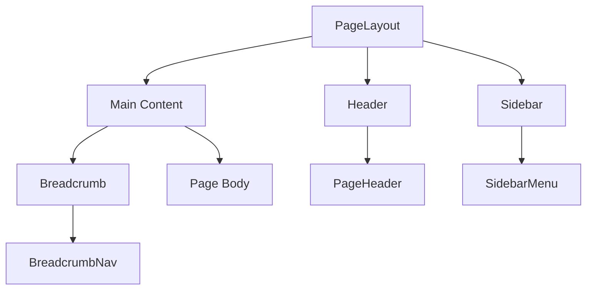
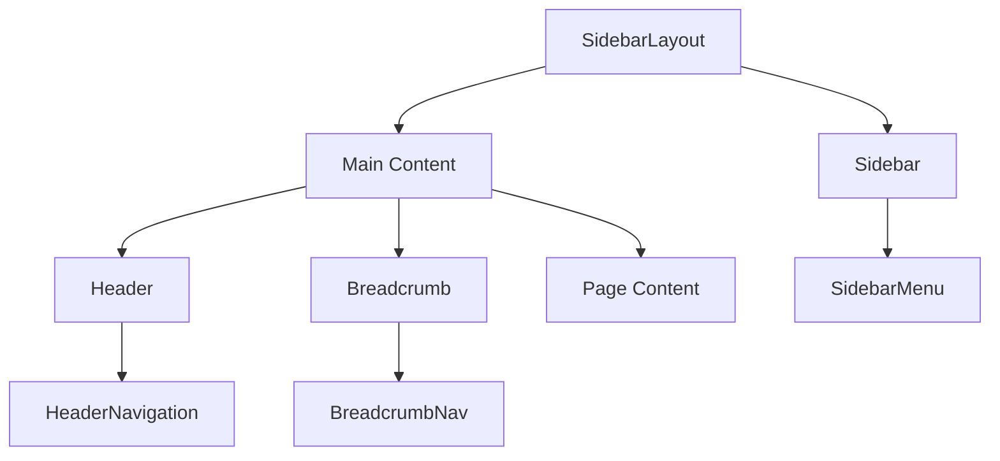
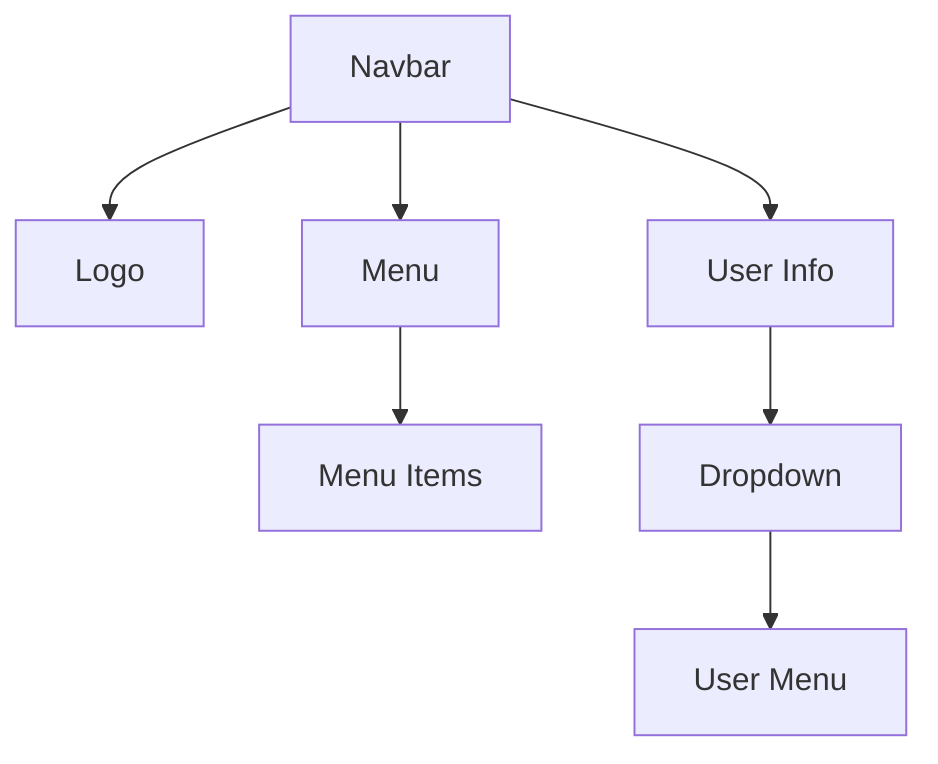
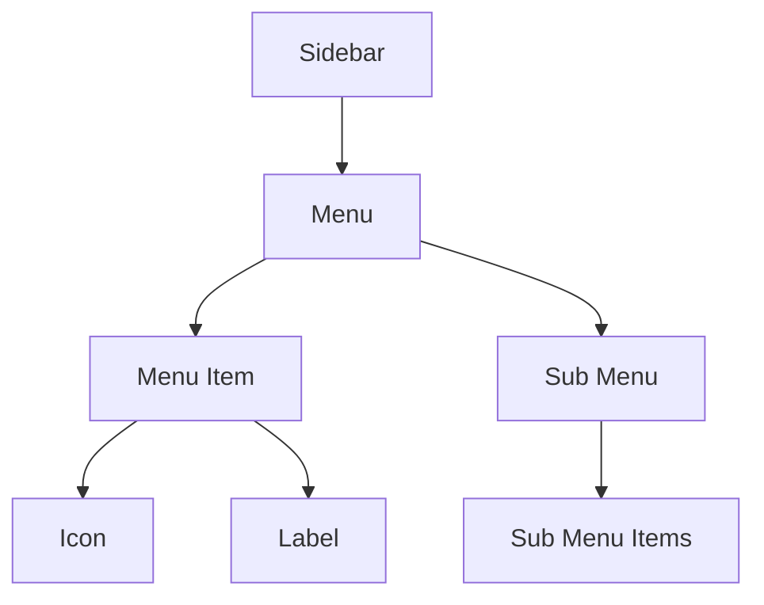
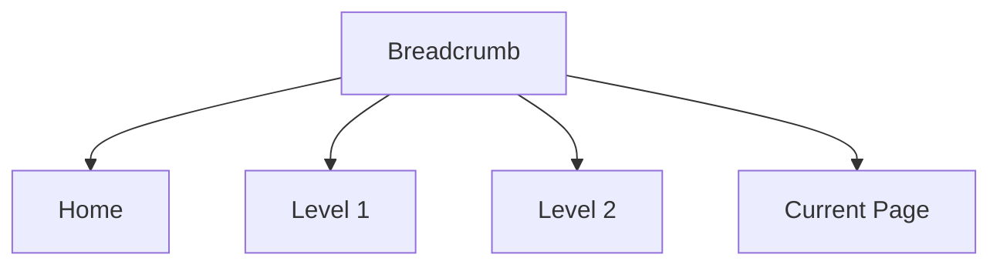
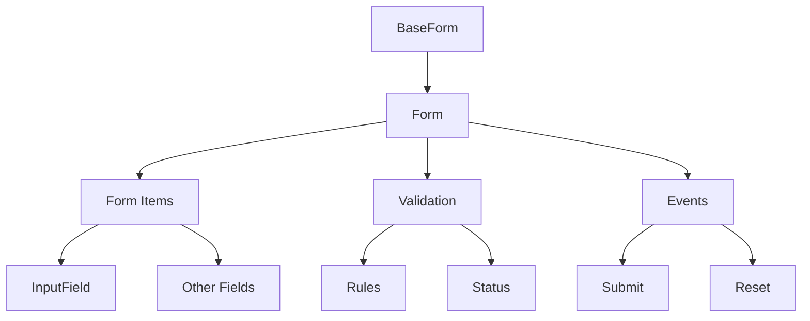
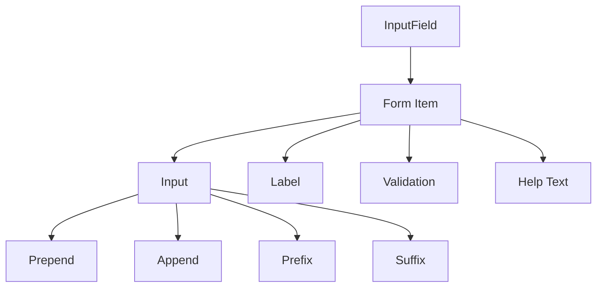
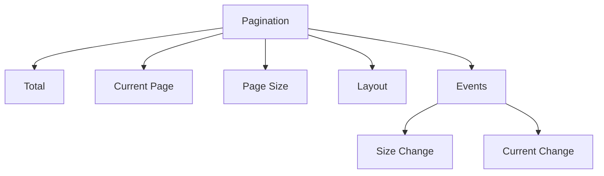
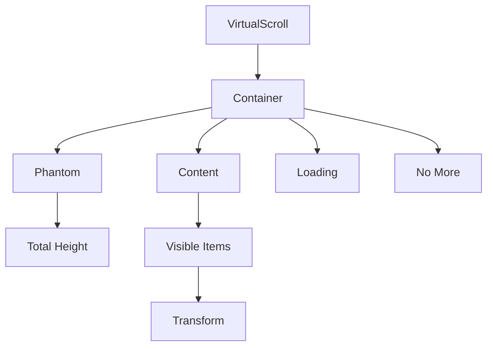
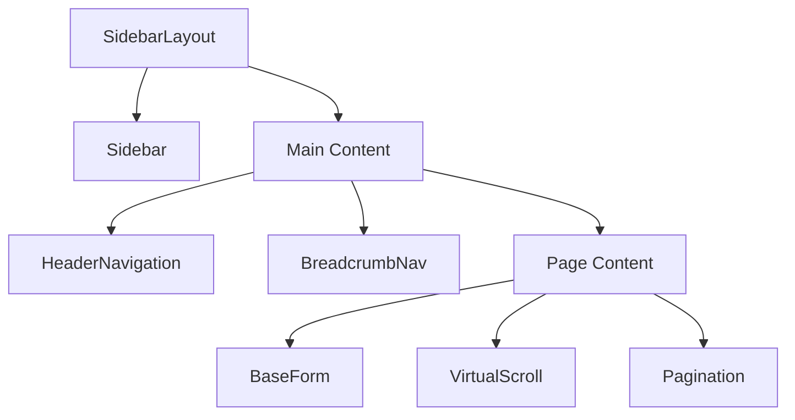

# 通用组件

<cite>
**本文档引用的文件**
- [PageLayout.vue](file://07-frontend/src/components/common/layout/PageLayout.vue)
- [SidebarLayout.vue](file://07-frontend/src/components/common/layout/SidebarLayout.vue)
- [Navbar.vue](file://07-frontend/src/components/common/Navbar.vue)
- [Sidebar.vue](file://07-frontend/src/components/common/Sidebar.vue)
- [Breadcrumb.vue](file://07-frontend/src/components/common/Breadcrumb.vue)
- [BaseForm.vue](file://07-frontend/src/components/common/forms/BaseForm.vue)
- [InputField.vue](file://07-frontend/src/components/common/forms/FormItems/InputField.vue)
- [Pagination.vue](file://07-frontend/src/components/common/Pagination.vue)
- [VirtualScroll.vue](file://07-frontend/src/components/common/VirtualScroll.vue)
- [PageHeader.vue](file://07-frontend/src/components/common/layout/PageHeader.vue)
- [SidebarMenu.vue](file://07-frontend/src/components/common/layout/SidebarMenu.vue)
- [HeaderNavigation.vue](file://07-frontend/src/components/common/layout/HeaderNavigation.vue)
- [BreadcrumbNav.vue](file://07-frontend/src/components/common/layout/BreadcrumbNav.vue)
</cite>

## 目录
1. [引言](#引言)
2. [布局类组件](#布局类组件)
3. [导航类组件](#导航类组件)
4. [表单基础组件](#表单基础组件)
5. [分页组件](#分页组件)
6. [性能优化组件](#性能优化组件)
7. [组件组合与最佳实践](#组件组合与最佳实践)
8. [常见问题与解决方案](#常见问题与解决方案)
9. [结论](#结论)

## 引言

本项目提供了一套完整的通用UI组件库，旨在为前端开发提供高效、一致且可复用的界面构建方案。这些组件覆盖了现代Web应用的核心需求，包括页面布局、导航系统、表单交互、数据展示和性能优化。通过精心设计的props、slots和events机制，这些组件实现了高度的灵活性和可配置性，能够适应各种业务场景。

组件库的设计遵循响应式原则，确保在不同设备上都能提供良好的用户体验。同时，组件内置了可访问性支持，符合现代Web标准。所有组件均采用Vue 3的Composition API进行开发，利用TypeScript提供完整的类型定义，增强了代码的可维护性和开发体验。

**本文档引用的文件**
- [PageLayout.vue](file://07-frontend/src/components/common/layout/PageLayout.vue)
- [SidebarLayout.vue](file://07-frontend/src/components/common/layout/SidebarLayout.vue)

## 布局类组件

布局类组件是整个应用的骨架，负责定义页面的整体结构和空间分配。`PageLayout`和`SidebarLayout`是两个核心的布局组件，它们通过不同的方式组织页面内容，满足多样化的界面需求。

### PageLayout 组件

`PageLayout`组件提供了一种灵活的页面布局方案，支持多种布局变体。它通过props控制各个区域的显示状态，包括头部、侧边栏和面包屑导航。组件使用CSS Grid进行布局，实现了响应式设计，在不同屏幕尺寸下自动调整布局。

**组件源码**
- [PageLayout.vue](file://07-frontend/src/components/common/layout/PageLayout.vue#L1-L194)
- [PageHeader.vue](file://07-frontend/src/components/common/layout/PageHeader.vue#L1-L800)
- [SidebarMenu.vue](file://07-frontend/src/components/common/layout/SidebarMenu.vue#L1-L800)
- [BreadcrumbNav.vue](file://07-frontend/src/components/common/layout/BreadcrumbNav.vue#L1-L732)

### SidebarLayout 组件

`SidebarLayout`组件提供了一种经典的侧边栏布局，支持左右两侧边栏、可折叠和响应式移动端适配。该组件特别适合管理后台类应用，能够有效组织复杂的导航结构。

**组件源码**
- [SidebarLayout.vue](file://07-frontend/src/components/common/layout/SidebarLayout.vue#L1-L457)
- [HeaderNavigation.vue](file://07-frontend/src/components/common/layout/HeaderNavigation.vue#L1-L1051)
- [SidebarMenu.vue](file://07-frontend/src/components/common/layout/SidebarMenu.vue#L1-L800)

## 导航类组件

导航类组件负责用户在应用中的路径导航和信息定位，包括`Navbar`、`Sidebar`和`Breadcrumb`三个核心组件。

### Navbar 组件

`Navbar`组件是应用的顶部导航栏，集成了品牌标识、主导航菜单和用户信息。它使用Element Plus的el-menu组件构建水平导航菜单，并通过el-dropdown实现用户菜单的下拉功能。

**组件源码**
- [Navbar.vue](file://07-frontend/src/components/common/Navbar.vue#L1-L94)

### Sidebar 组件

`Sidebar`组件是应用的侧边栏导航，支持多级菜单结构和权限过滤。它通过递归方式渲染菜单项，支持图标、徽章和子菜单的显示。组件还实现了菜单折叠功能，优化了窄屏下的用户体验。

**组件源码**
- [Sidebar.vue](file://07-frontend/src/components/common/Sidebar.vue#L1-L136)

### Breadcrumb 组件

`Breadcrumb`组件提供了一种直观的页面路径导航，帮助用户了解当前位置并快速返回上级页面。组件通过Vue Router的路由匹配信息自动生成面包屑，支持自定义图标和样式。

**组件源码**
- [Breadcrumb.vue](file://07-frontend/src/components/common/Breadcrumb.vue#L1-L70)

## 表单基础组件

表单基础组件是用户与应用交互的核心，包括`BaseForm`和`InputField`两个关键组件，提供了完整的表单处理能力。

### BaseForm 组件

`BaseForm`组件是对Element Plus表单组件的高级封装，提供了更丰富的功能和更好的开发体验。它支持表单数据的双向绑定、验证规则、自动聚焦和多种布局选项。

**组件源码**
- [BaseForm.vue](file://07-frontend/src/components/common/forms/BaseForm.vue#L1-L343)

### InputField 组件

`InputField`组件是对表单输入字段的封装，提供了统一的样式和行为。它支持多种输入类型、前置后置内容、帮助文本和验证状态显示，确保了表单字段的一致性。

**组件源码**
- [InputField.vue](file://07-frontend/src/components/common/forms/FormItems/InputField.vue#L1-L359)

## 分页组件

`Pagination`组件提供了数据分页功能，支持多种布局和交互方式。它通过props控制分页器的外观和行为，并通过events与父组件通信。

**组件源码**
- [Pagination.vue](file://07-frontend/src/components/common/Pagination.vue#L1-L110)

## 性能优化组件

`VirtualScroll`组件是为处理大数据量列表而设计的性能优化组件，通过虚拟滚动技术只渲染可见区域的项目，显著提升了渲染性能。

### VirtualScroll 组件

`VirtualScroll`组件实现了高效的虚拟滚动算法，支持动态高度、无限滚动和加载指示器。它通过计算可视区域和缓冲区，只渲染必要的项目，大大减少了DOM节点数量。

**组件源码**
- [VirtualScroll.vue](file://07-frontend/src/components/common/VirtualScroll.vue#L1-L439)

## 组件组合与最佳实践

### 页面结构构建

通过组合使用布局、导航和内容组件，可以构建出完整的页面结构。以下是一个典型的管理后台页面的构建示例：

### 最佳实践建议

1. **组件复用**：通过props和slots实现组件的高度可配置性，避免创建重复的组件。
2. **响应式设计**：充分利用组件内置的响应式特性，确保在不同设备上的一致体验。
3. **性能优化**：对于大数据量的列表，优先使用`VirtualScroll`组件。
4. **可访问性**：确保所有交互元素都有适当的aria标签和键盘支持。
5. **状态管理**：将组件状态与应用状态分离，便于测试和维护。

## 常见问题与解决方案

### 布局问题

**问题**：侧边栏在移动端无法正确显示
**解决方案**：确保`SidebarLayout`组件的`responsive`属性为true，并检查CSS媒体查询。

### 表单验证

**问题**：表单验证规则不生效
**解决方案**：检查`BaseForm`组件的`rules`prop是否正确传递，并确保表单字段的`prop`属性与数据模型匹配。

### 性能问题

**问题**：大数据列表滚动卡顿
**解决方案**：使用`VirtualScroll`组件替代普通列表渲染，并合理设置`bufferSize`参数。

## 结论

本项目提供的通用UI组件库通过精心的设计和实现，为前端开发提供了强大的支持。组件之间的良好协作和高度的可配置性，使得开发者能够快速构建出功能丰富、性能优良的应用界面。通过遵循本文档的最佳实践，可以充分发挥组件库的潜力，提高开发效率和用户体验。