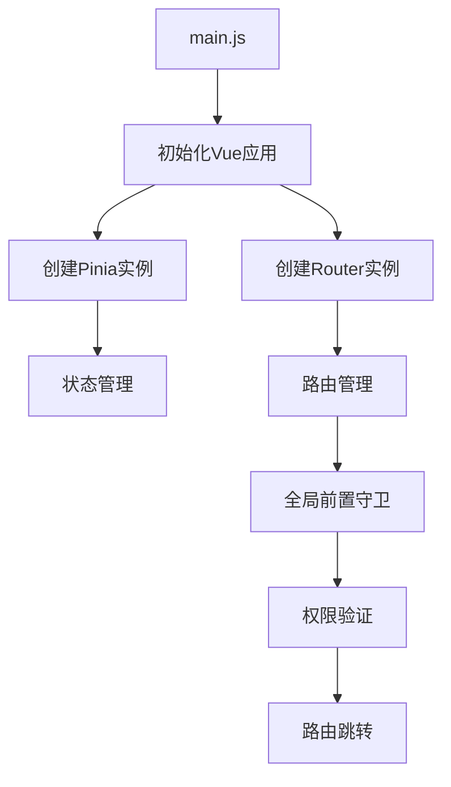
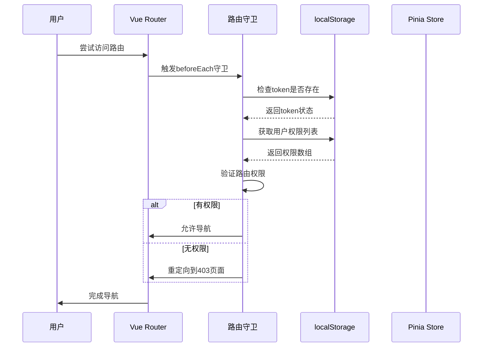
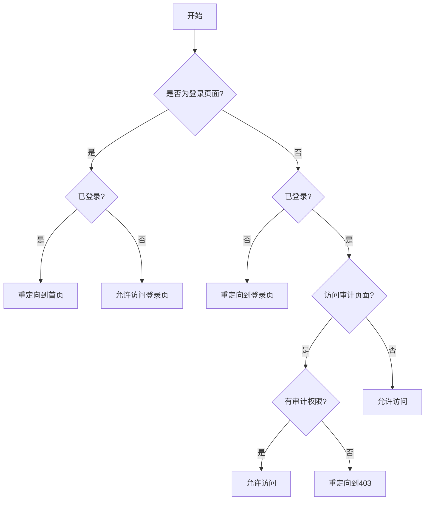
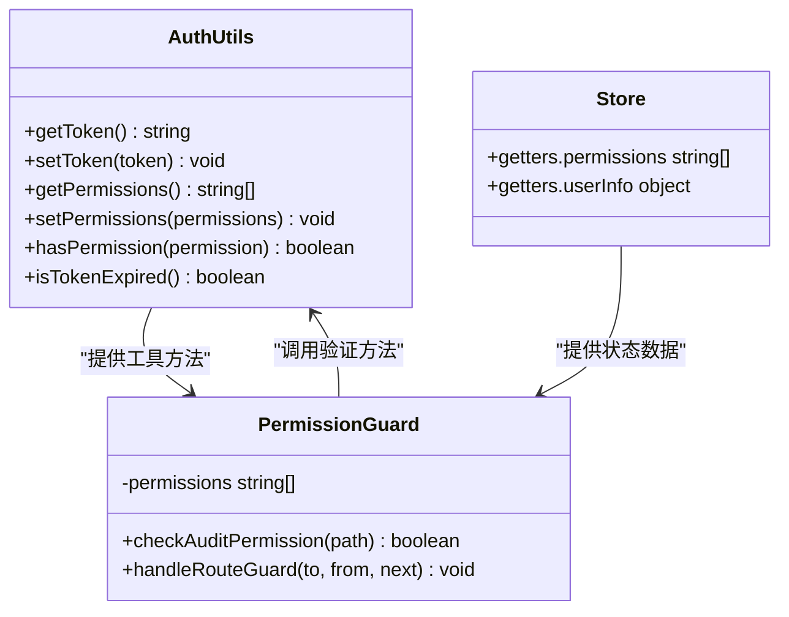
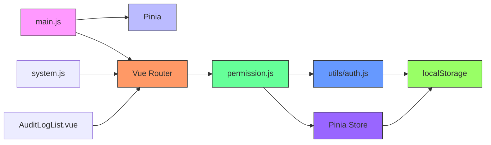

# 前端路由守卫

<cite>
**本文档引用文件**   
- [permission.js](file://07-frontend/src/permission.js)
- [router/index.js](file://07-frontend/src/router/index.js)
- [main.js](file://07-frontend/src/main.js)
- [utils/auth.js](file://07-frontend/src/utils/auth.js)
- [router/modules/system.js](file://07-frontend/src/router/modules/system.js)
- [pages/system/audit-management/AuditLogList.vue](file://07-frontend/src/pages/system/audit-management/AuditLogList.vue)
</cite>

## 目录
1. [引言](#引言)
2. [项目结构](#项目结构)
3. [核心组件](#核心组件)
4. [架构概述](#架构概述)
5. [详细组件分析](#详细组件分析)
6. [依赖分析](#依赖分析)
7. [性能考虑](#性能考虑)
8. [故障排除指南](#故障排除指南)
9. [结论](#结论)

## 引言
本文档深入解析前端路由守卫的实现机制，重点分析`permission.js`中`router.beforeEach`全局前置守卫的完整执行流程。说明如何通过Pinia状态管理获取用户权限列表，并基于路由路径进行细粒度的权限拦截。结合实际代码示例，展示对系统审计模块（/system/audit）等敏感页面的访问控制实现方式。解释当用户无权限访问特定路由时，如何通过`next({ path: '/403' })`进行安全重定向。同时阐述路由守卫与用户登录状态、token有效性校验的协同工作机制，确保前端导航的安全性与用户体验的平衡。

## 项目结构
本项目采用Vue 3 + Pinia + Vue Router的现代前端架构，实现了完整的权限控制系统。项目结构清晰，主要分为以下几个核心部分：

1. **src/main.js**: 应用入口文件，负责初始化Vue应用并挂载Pinia状态管理和Vue Router
2. **src/router/index.js**: 路由配置文件，定义了所有路由规则和全局前置守卫
3. **src/permission.js**: 权限控制核心文件，包含路由守卫的具体实现
4. **src/utils/auth.js**: 认证工具函数，负责token、用户信息、权限等的本地存储和验证
5. **src/router/modules/system.js**: 系统管理模块的路由配置，包含审计日志等敏感页面的权限定义

**图示来源**
- [main.js](file://07-frontend/src/main.js#L1-L26)
- [router/index.js](file://07-frontend/src/router/index.js#L1-L228)

**章节来源**
- [main.js](file://07-frontend/src/main.js#L1-L26)
- [router/index.js](file://07-frontend/src/router/index.js#L1-L228)

## 核心组件
前端路由守卫系统由多个核心组件构成，共同实现了完整的权限控制机制：

1. **Pinia状态管理**: 作为Vue 3的官方状态管理库，Pinia负责存储和管理用户权限信息
2. **Vue Router**: 提供了`beforeEach`全局前置守卫功能，实现了路由级别的权限控制
3. **本地存储**: 使用localStorage持久化存储用户token、权限列表等关键信息
4. **权限验证工具**: 提供了一系列工具函数，用于检查用户权限、角色和token有效性

这些组件协同工作，形成了一个完整的前端安全防护体系，确保只有经过授权的用户才能访问特定的系统功能。

**章节来源**
- [main.js](file://07-frontend/src/main.js#L7-L10)
- [permission.js](file://07-frontend/src/permission.js#L1-L13)
- [utils/auth.js](file://07-frontend/src/utils/auth.js#L1-L110)

## 架构概述
系统的权限控制架构采用了分层设计，从入口到具体实现形成了完整的安全链条：

**图示来源**
- [router/index.js](file://07-frontend/src/router/index.js#L199-L226)
- [permission.js](file://07-frontend/src/permission.js#L2-L11)
- [utils/auth.js](file://07-frontend/src/utils/auth.js#L7-L17)

## 详细组件分析
### 路由守卫机制分析
路由守卫是前端权限控制的核心，通过`router.beforeEach`全局前置守卫实现。当用户尝试导航到任何路由时，都会先经过守卫的验证。

#### 路由守卫执行流程

**图示来源**
- [permission.js](file://07-frontend/src/permission.js#L2-L11)
- [router/index.js](file://07-frontend/src/router/index.js#L200-L225)

**章节来源**
- [permission.js](file://07-frontend/src/permission.js#L1-L13)
- [router/index.js](file://07-frontend/src/router/index.js#L199-L226)

### 权限管理实现
系统通过Pinia状态管理和localStorage相结合的方式实现权限管理，确保权限信息的持久化和响应式更新。

#### 权限验证逻辑

**图示来源**
- [utils/auth.js](file://07-frontend/src/utils/auth.js#L1-L110)
- [permission.js](file://07-frontend/src/permission.js#L1-L13)

**章节来源**
- [utils/auth.js](file://07-frontend/src/utils/auth.js#L69-L96)
- [permission.js](file://07-frontend/src/permission.js#L4-L8)

## 依赖分析
系统各组件之间存在明确的依赖关系，形成了一个完整的权限控制链条：

**图示来源**
- [main.js](file://07-frontend/src/main.js#L1-L26)
- [router/index.js](file://07-frontend/src/router/index.js#L1-L228)
- [permission.js](file://07-frontend/src/permission.js#L1-L13)
- [utils/auth.js](file://07-frontend/src/utils/auth.js#L1-L110)

**章节来源**
- [main.js](file://07-frontend/src/main.js#L1-L26)
- [router/index.js](file://07-frontend/src/router/index.js#L1-L228)

## 性能考虑
在实现权限控制的同时，系统也充分考虑了性能优化：

1. **权限缓存**: 将用户权限存储在localStorage中，避免每次都需要从服务器获取
2. **同步验证**: 路由守卫中的权限验证是同步操作，确保导航决策的即时性
3. **最小化计算**: 权限检查采用简单的数组包含判断，时间复杂度为O(n)
4. **避免重复请求**: 登录状态和权限信息在会话期间保持，减少不必要的API调用

这些优化措施确保了权限验证过程的高效性，不会对用户体验造成明显影响。

## 故障排除指南
在使用路由守卫时可能遇到的常见问题及解决方案：

1. **无法访问审计页面**
   - 检查用户是否具有`system:audit`权限
   - 确认权限列表已正确存储在localStorage中
   - 验证token是否有效且未过期

2. **登录后仍被重定向到登录页**
   - 检查localStorage中的token是否正确设置
   - 确认`isLoggedIn`判断逻辑是否正常工作
   - 验证路由守卫的执行顺序

3. **权限更新后未生效**
   - 确保权限变更后刷新了localStorage中的权限数据
   - 检查Pinia store中的权限状态是否同步更新
   - 必要时重新加载页面以确保权限生效

**章节来源**
- [utils/auth.js](file://07-frontend/src/utils/auth.js#L98-L110)
- [permission.js](file://07-frontend/src/permission.js#L7-L8)
- [router/index.js](file://07-frontend/src/router/index.js#L205-L206)

## 结论
本文档详细解析了前端路由守卫的实现机制，展示了如何通过`permission.js`中的`router.beforeEach`全局前置守卫实现细粒度的权限控制。系统通过Pinia状态管理获取用户权限列表，并结合localStorage持久化存储，实现了高效的安全验证。对于敏感的系统审计模块（/system/audit），通过权限字符串匹配进行访问控制，当用户无权限时安全重定向到403页面。整个权限控制系统与用户登录状态和token有效性校验协同工作，在确保前端导航安全性的同时，也兼顾了用户体验的流畅性。