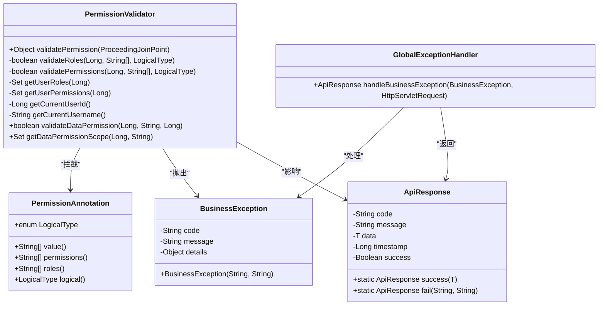
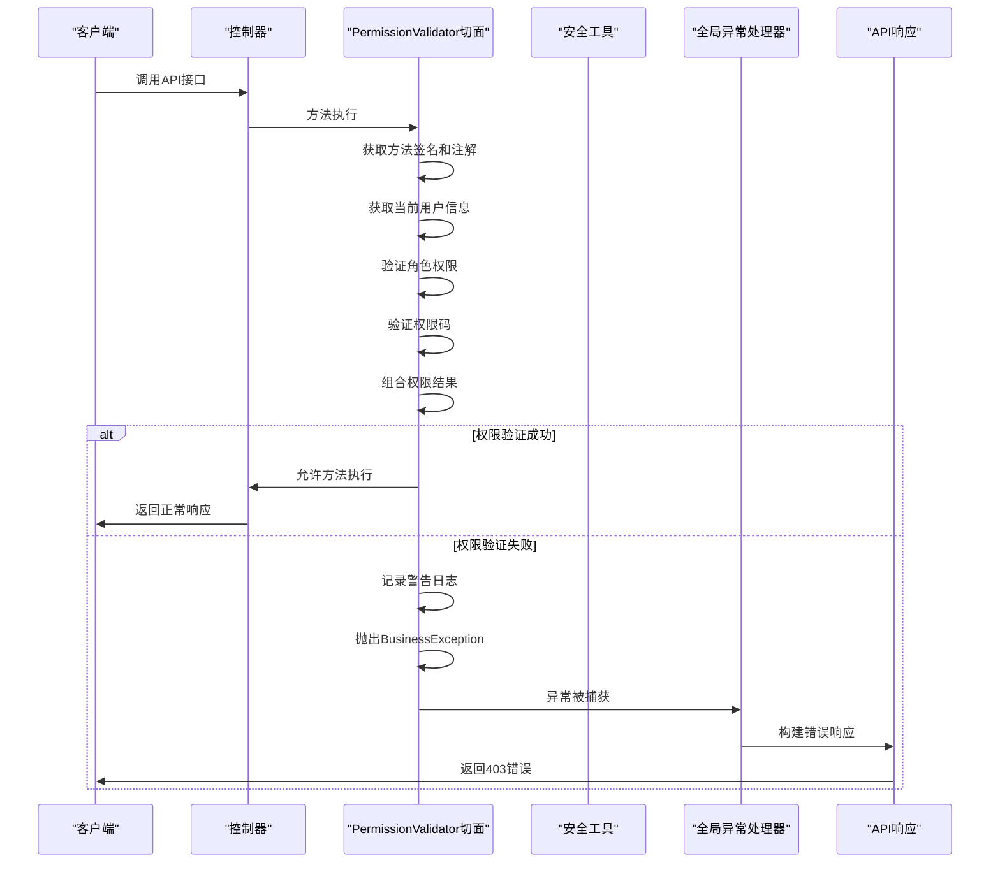
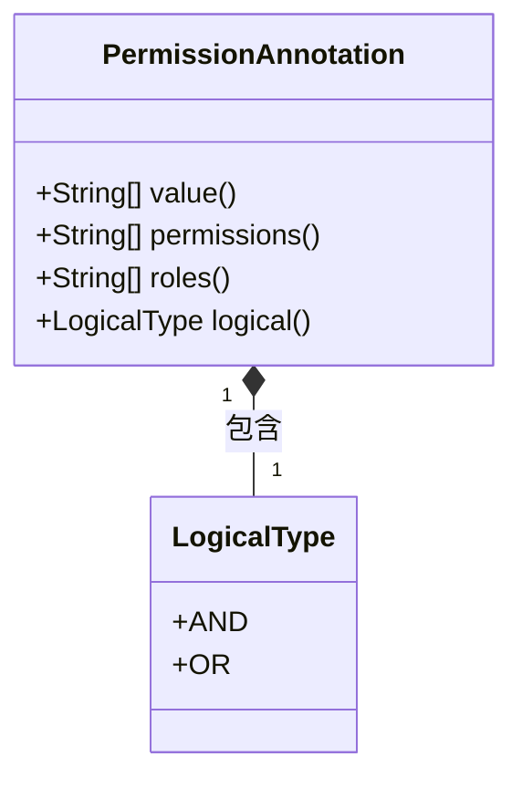
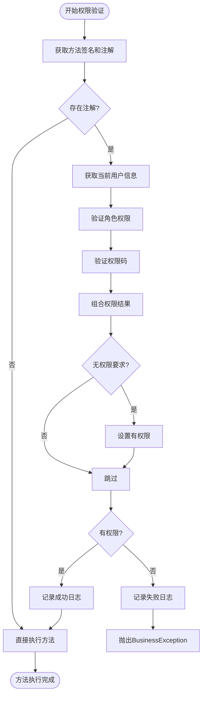
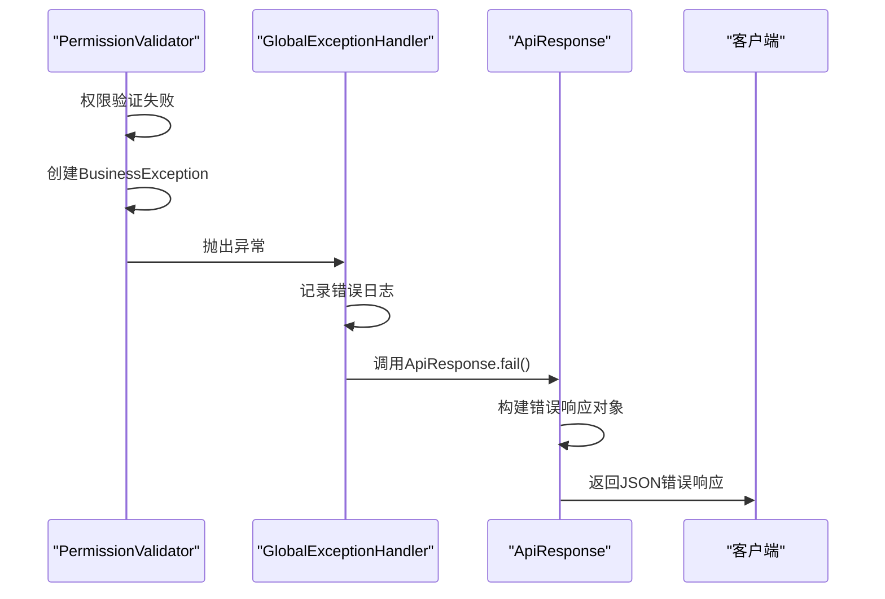
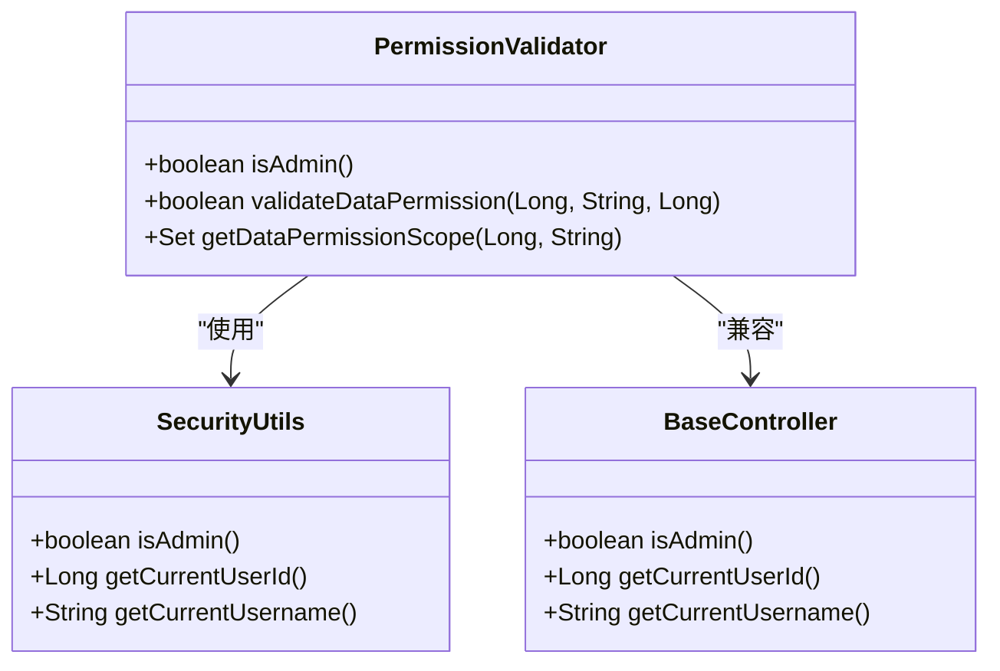

# 后端权限验证

<cite>
**本文档引用文件**  
- [PermissionValidator.java](file://08-backend/src/main/java/com/enterprise/brain/common/security/PermissionValidator.java)
- [PermissionAnnotation.java](file://08-backend/src/main/java/com/enterprise/brain/common/annotation/PermissionAnnotation.java)
- [BusinessException.java](file://08-backend/src/main/java/com/enterprise/brain/common/exception/BusinessException.java)
- [GlobalExceptionHandler.java](file://08-backend/src/main/java/com/enterprise/brain/common/exception/GlobalExceptionHandler.java)
- [ApiResponse.java](file://08-backend/src/main/java/com/enterprise/brain/common/response/ApiResponse.java)
- [SecurityUtils.java](file://08-backend/src/main/java/com/enterprise/brain/common/security/SecurityUtils.java)
- [BaseController.java](file://08-backend/src/main/java/com/enterprise/brain/common/base/BaseController.java)
- [application.yml](file://08-backend/src/main/resources/application.yml)
</cite>

## 目录
1. [引言](#引言)
2. [核心组件分析](#核心组件分析)
3. [权限验证流程](#权限验证流程)
4. [权限注解详解](#权限注解详解)
5. [权限验证切面实现](#权限验证切面实现)
6. [异常处理机制](#异常处理机制)
7. [高级功能实现](#高级功能实现)
8. [系统集成与配置](#系统集成与配置)
9. [结论](#结论)

## 引言
本文档详细解析基于Spring AOP的后端权限验证机制，重点剖析`PermissionValidator`切面类如何通过`@Around`环绕通知拦截带有`@PermissionAnnotation`注解的方法调用。说明权限注解中`roles`、`permissions`、`logical`等属性的作用及使用方式。结合`validatePermission`方法的执行流程，阐述系统如何获取当前用户信息并依次验证角色权限（AND/OR逻辑）和权限码匹配。通过代码示例展示管理员角色验证、数据权限范围检查等高级功能的实现原理，并说明当权限验证失败时`BusinessException`异常的抛出机制及其对API调用的影响。

## 核心组件分析

### 权限验证核心组件
系统权限验证机制由多个核心组件构成，包括权限注解、权限验证切面、业务异常类和全局异常处理器。这些组件协同工作，实现了基于注解的声明式权限控制。



**图示来源**
- [PermissionAnnotation.java](file://08-backend/src/main/java/com/enterprise/brain/common/annotation/PermissionAnnotation.java)
- [PermissionValidator.java](file://08-backend/src/main/java/com/enterprise/brain/common/security/PermissionValidator.java)
- [BusinessException.java](file://08-backend/src/main/java/com/enterprise/brain/common/exception/BusinessException.java)
- [GlobalExceptionHandler.java](file://08-backend/src/main/java/com/enterprise/brain/common/exception/GlobalExceptionHandler.java)
- [ApiResponse.java](file://08-backend/src/main/java/com/enterprise/brain/common/response/ApiResponse.java)

**本节来源**
- [PermissionAnnotation.java](file://08-backend/src/main/java/com/enterprise/brain/common/annotation/PermissionAnnotation.java#L1-L51)
- [PermissionValidator.java](file://08-backend/src/main/java/com/enterprise/brain/common/security/PermissionValidator.java#L1-L316)
- [BusinessException.java](file://08-backend/src/main/java/com/enterprise/brain/common/exception/BusinessException.java#L1-L69)

## 权限验证流程

### 权限验证执行流程
系统权限验证流程始于带有`@PermissionAnnotation`注解的方法调用，通过Spring AOP机制触发`PermissionValidator`切面的环绕通知，执行完整的权限验证逻辑。



**图示来源**
- [PermissionValidator.java](file://08-backend/src/main/java/com/enterprise/brain/common/security/PermissionValidator.java#L32-L85)
- [GlobalExceptionHandler.java](file://08-backend/src/main/java/com/enterprise/brain/common/exception/GlobalExceptionHandler.java#L32-L37)
- [ApiResponse.java](file://08-backend/src/main/java/com/enterprise/brain/common/response/ApiResponse.java#L77-L92)

**本节来源**
- [PermissionValidator.java](file://08-backend/src/main/java/com/enterprise/brain/common/security/PermissionValidator.java#L32-L85)
- [GlobalExceptionHandler.java](file://08-backend/src/main/java/com/enterprise/brain/common/exception/GlobalExceptionHandler.java#L32-L37)

## 权限注解详解

### 权限注解属性说明
`@PermissionAnnotation`注解提供了灵活的权限控制配置选项，支持角色验证、权限码验证和逻辑组合。



**属性说明表**

| 属性名称 | 类型 | 默认值 | 说明 |
|---------|------|--------|------|
| **value** | String[] | 空数组 | 权限码数组，作为permissions的别名 |
| **permissions** | String[] | 空数组 | 需要的权限码列表 |
| **roles** | String[] | 空数组 | 需要的角色列表 |
| **logical** | LogicalType | AND | 逻辑类型，AND表示所有权限都需要，OR表示任意一个权限即可 |

**逻辑类型说明**

- **AND逻辑**：用户必须同时拥有所有指定的角色和权限
- **OR逻辑**：用户只需拥有任意一个指定的角色或权限

**本节来源**
- [PermissionAnnotation.java](file://08-backend/src/main/java/com/enterprise/brain/common/annotation/PermissionAnnotation.java#L14-L51)

## 权限验证切面实现

### 切面类核心方法分析
`PermissionValidator`切面类通过`@Around`注解实现了环绕通知，拦截所有带有`@PermissionAnnotation`注解的方法调用。



**核心验证逻辑**

1. **注解获取**：通过反射获取方法上的`PermissionAnnotation`注解
2. **用户信息获取**：获取当前登录用户的ID和用户名
3. **角色验证**：根据`roles`属性和`logical`逻辑类型验证用户角色
4. **权限码验证**：根据`permissions`属性和`logical`逻辑类型验证用户权限
5. **结果组合**：将角色验证和权限码验证的结果进行逻辑组合
6. **权限决策**：根据最终结果决定是否允许方法执行

**本节来源**
- [PermissionValidator.java](file://08-backend/src/main/java/com/enterprise/brain/common/security/PermissionValidator.java#L32-L85)

## 异常处理机制

### 权限验证失败处理流程
当权限验证失败时，系统通过`BusinessException`异常和`GlobalExceptionHandler`全局异常处理器提供统一的错误响应。



**异常处理流程说明**

1. `PermissionValidator`在权限验证失败时创建并抛出`BusinessException`
2. `GlobalExceptionHandler`捕获`BusinessException`并记录错误日志
3. 使用`ApiResponse.fail()`方法构建统一的错误响应
4. 返回包含错误码和消息的JSON响应给客户端

**本节来源**
- [PermissionValidator.java](file://08-backend/src/main/java/com/enterprise/brain/common/security/PermissionValidator.java#L75-L82)
- [GlobalExceptionHandler.java](file://08-backend/src/main/java/com/enterprise/brain/common/exception/GlobalExceptionHandler.java#L32-L37)
- [ApiResponse.java](file://08-backend/src/main/java/com/enterprise/brain/common/response/ApiResponse.java#L77-L92)

## 高级功能实现

### 数据权限与管理员验证
系统提供了高级权限验证功能，包括数据权限范围检查和管理员角色验证。



**高级功能说明**

1. **管理员验证**：`isAdmin()`方法简化了管理员权限检查
2. **数据权限**：`validateDataPermission()`方法支持细粒度的数据访问控制
3. **权限范围**：`getDataPermissionScope()`方法返回用户可访问的数据范围

**本节来源**
- [PermissionValidator.java](file://08-backend/src/main/java/com/enterprise/brain/common/security/PermissionValidator.java#L225-L314)
- [SecurityUtils.java](file://08-backend/src/main/java/com/enterprise/brain/common/security/SecurityUtils.java#L65-L68)
- [BaseController.java](file://08-backend/src/main/java/com/enterprise/brain/common/base/BaseController.java#L86-L88)

## 系统集成与配置

### AOP与Spring集成
权限验证切面通过Spring AOP机制集成到系统中，确保在方法调用前执行权限验证。

```mermaid
graph TB
subgraph "Spring容器"
AOP[AOP代理]
Bean[PermissionValidator Bean]
Config[application.yml]
end
subgraph "权限验证"
Annotation[@PermissionAnnotation]
Validator[PermissionValidator]
Exception[BusinessException]
end
Client --> AOP
AOP --> Bean
Bean --> Validator
Validator --> Exception
Config --> AOP
Annotation --> Validator
```

**配置说明**

- **切面启用**：`@Aspect`和`@Component`注解使切面被Spring容器管理
- **拦截规则**：`@Around("@annotation(com.enterprise.brain.common.annotation.PermissionAnnotation)")`定义拦截规则
- **AOP代理**：Spring自动创建代理对象，织入切面逻辑

**本节来源**
- [PermissionValidator.java](file://08-backend/src/main/java/com/enterprise/brain/common/security/PermissionValidator.java#L25-L26)
- [application.yml](file://08-backend/src/main/resources/application.yml)

## 结论
本文档详细解析了基于Spring AOP的后端权限验证机制。系统通过`@PermissionAnnotation`注解和`PermissionValidator`切面实现了声明式的权限控制。权限验证流程包括获取用户信息、验证角色权限、验证权限码和组合验证结果。当权限验证失败时，系统抛出`BusinessException`异常，由`GlobalExceptionHandler`统一处理并返回标准化的错误响应。该机制提供了灵活的权限控制能力，支持AND/OR逻辑组合，同时提供了管理员验证和数据权限等高级功能，确保了系统的安全性和可维护性。