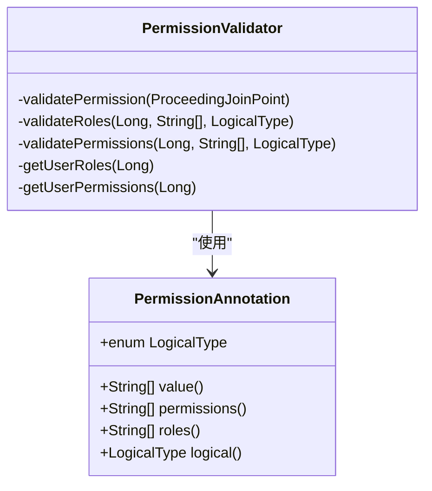
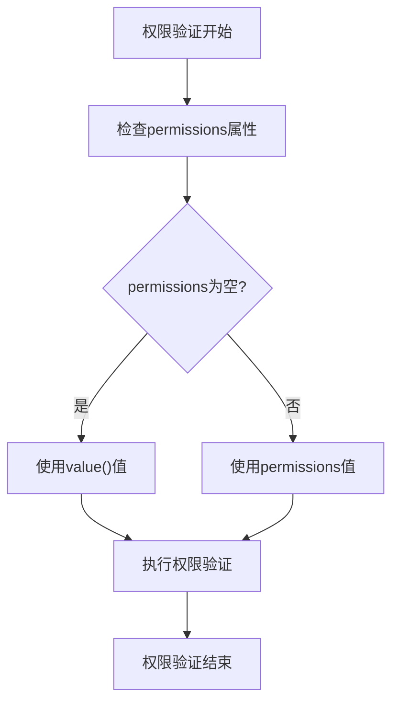
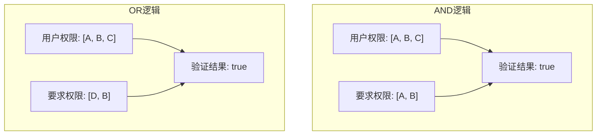
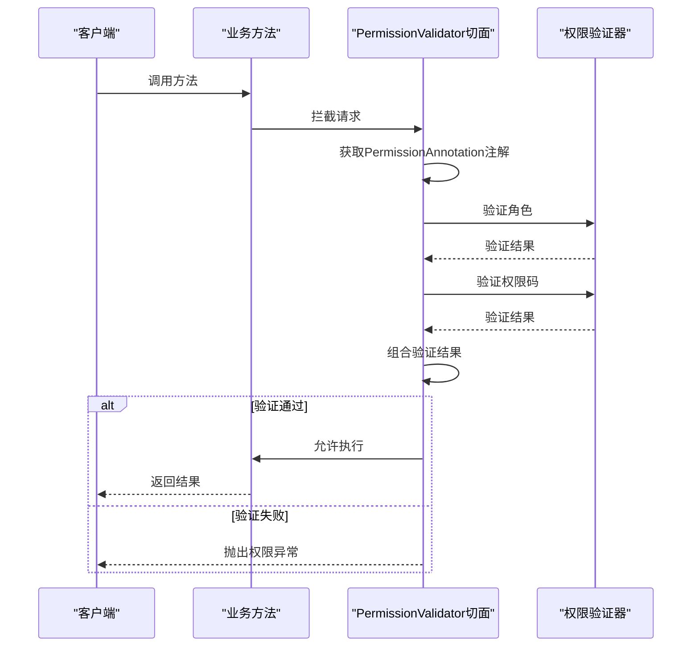

# 权限注解定义

<cite>
**本文档引用的文件**   
- [PermissionAnnotation.java](file://08-backend/src/main/java/com/enterprise/brain/common/annotation/PermissionAnnotation.java)
- [PermissionValidator.java](file://08-backend/src/main/java/com/enterprise/brain/common/security/PermissionValidator.java)
</cite>

## 目录
1. [权限注解设计与实现](#权限注解设计与实现)
2. [核心属性语义分析](#核心属性语义分析)
3. [逻辑类型工作机制](#逻辑类型工作机制)
4. [AOP切面协作关系](#aop切面协作关系)
5. [使用场景示例](#使用场景示例)

## 权限注解设计与实现

`PermissionAnnotation`注解是系统权限控制的核心组件，采用Java注解技术实现方法级和类级的权限校验。该注解通过`@Target({ElementType.METHOD, ElementType.TYPE})`声明，支持在方法和类级别上使用，提供了灵活的权限控制粒度。

当应用于类级别时，注解对类中所有公共方法生效，实现批量权限控制；当应用于方法级别时，注解仅对该特定方法生效，提供精细化的权限管理。这种双重支持机制使得开发者可以根据实际需求选择合适的权限控制粒度。

注解采用`@Retention(RetentionPolicy.RUNTIME)`运行时保留策略，这是实现AOP（面向切面编程）权限验证的关键。RUNTIME保留策略确保注解信息在程序运行时仍然可用，允许通过反射机制在运行时动态获取注解信息，从而实现基于注解的权限验证切面。

**图示来源**
- [PermissionAnnotation.java](file://08-backend/src/main/java/com/enterprise/brain/common/annotation/PermissionAnnotation.java#L11-L50)
- [PermissionValidator.java](file://08-backend/src/main/java/com/enterprise/brain/common/security/PermissionValidator.java#L24-L27)

**本节来源**
- [PermissionAnnotation.java](file://08-backend/src/main/java/com/enterprise/brain/common/annotation/PermissionAnnotation.java#L11-L14)

## 核心属性语义分析

`PermissionAnnotation`注解包含三个核心属性：`value()`、`permissions()`和`roles()`，它们在权限控制中扮演不同的角色并具有明确的语义差异。

`value()`属性作为基础权限码定义，主要用于简化常见场景下的注解使用。当只需要指定单一权限要求时，可以直接使用`value()`属性，无需显式声明`permissions`属性。该属性遵循Java注解的默认值约定，支持简洁的语法形式。

`permissions()`属性提供更明确的权限码数组定义，用于指定多个具体的权限要求。与`value()`相比，`permissions()`语义更加清晰，代码可读性更高，特别适用于需要明确表达"权限集合"概念的场景。当`permissions()`属性为空数组时，系统会自动回退到`value()`属性的值，这一设计实现了向后兼容性和使用便利性的平衡。

`roles()`属性用于基于角色的访问控制（RBAC），允许根据用户角色进行权限验证。角色通常代表用户在系统中的职能或职位，如"ADMIN"、"MANAGER"等。通过角色控制，可以实现基于组织架构的权限管理，简化权限分配过程。

**图示来源**
- [PermissionAnnotation.java](file://08-backend/src/main/java/com/enterprise/brain/common/annotation/PermissionAnnotation.java#L19-L29)
- [PermissionValidator.java](file://08-backend/src/main/java/com/enterprise/brain/common/security/PermissionValidator.java#L59-L62)

**本节来源**
- [PermissionAnnotation.java](file://08-backend/src/main/java/com/enterprise/brain/common/annotation/PermissionAnnotation.java#L16-L30)

## 逻辑类型工作机制

`LogicalType`枚举定义了AND和OR两种逻辑类型，为权限验证提供了灵活的组合策略。这两种逻辑类型在权限验证中发挥着关键作用，支持复杂的权限组合需求。

AND逻辑类型要求用户必须同时满足所有指定的权限或角色条件。这种严格的组合要求适用于需要多重验证的敏感操作，确保只有具备完整权限集的用户才能执行特定操作。例如，在财务系统的资金转账功能中，可能需要同时具备"资金操作"和"风险控制"双重权限，使用AND逻辑可以确保安全性。

OR逻辑类型则采用宽松的验证策略，只要用户满足任一指定的权限或角色条件即可通过验证。这种模式适用于多角色协作的场景，提高系统的可用性和灵活性。例如，系统管理任务可以由"系统管理员"或"运维主管"任一角色执行，使用OR逻辑能够支持这种并行权限模型。

在实现层面，`validateRoles`和`validatePermissions`方法根据`logical`参数的值选择相应的验证策略。对于AND逻辑，使用`containsAll`方法检查用户权限集是否包含所有必需权限；对于OR逻辑，则通过遍历检查是否存在任一匹配的权限。

**图示来源**
- [PermissionAnnotation.java](file://08-backend/src/main/java/com/enterprise/brain/common/annotation/PermissionAnnotation.java#L39-L48)
- [PermissionValidator.java](file://08-backend/src/main/java/com/enterprise/brain/common/security/PermissionValidator.java#L96-L110)

**本节来源**
- [PermissionAnnotation.java](file://08-backend/src/main/java/com/enterprise/brain/common/annotation/PermissionAnnotation.java#L31-L34)

## AOP切面协作关系

`PermissionAnnotation`注解与`PermissionValidator`切面通过AOP技术实现紧密协作，构建了声明式的权限验证机制。`PermissionValidator`类使用`@Aspect`注解标记为切面类，并通过`@Around("@annotation(com.enterprise.brain.common.annotation.PermissionAnnotation)")`定义切点，实现了对所有使用`PermissionAnnotation`注解的方法的拦截。

当被注解的方法被调用时，AOP框架会自动触发`validatePermission`环绕通知。该通知首先通过反射获取方法上的`PermissionAnnotation`注解实例，然后提取注解中的权限配置信息。接着，切面从安全上下文中获取当前用户的身份信息，并分别执行角色验证和权限码验证。

权限验证采用"或"逻辑组合：如果用户通过角色验证或权限码验证中的任一方式，则视为具有访问权限。这种设计支持基于角色和基于权限的混合访问控制模型。当用户未配置任何权限要求时，系统默认允许访问，确保注解的使用不会意外阻断正常业务流程。

**图示来源**
- [PermissionValidator.java](file://08-backend/src/main/java/com/enterprise/brain/common/security/PermissionValidator.java#L32-L85)
- [PermissionAnnotation.java](file://08-backend/src/main/java/com/enterprise/brain/common/annotation/PermissionAnnotation.java#L11-L14)

**本节来源**
- [PermissionValidator.java](file://08-backend/src/main/java/com/enterprise/brain/common/security/PermissionValidator.java#L25-L32)

## 使用场景示例

`PermissionAnnotation`注解在实际应用中支持多种权限控制模式。通过`roles`属性与`OR`逻辑类型的组合，可以实现多角色任一匹配的权限控制。例如，`@PermissionAnnotation(roles = {"ADMIN", "MANAGER"}, logical = LogicalType.OR)`表示用户只需具备"ADMIN"或"MANAGER"任一角色即可访问受保护的资源，适用于需要多角色协同管理的业务场景。

通过`permissions`属性与`AND`逻辑类型的组合，可以实现权限的严格组合要求。例如，`@PermissionAnnotation(permissions = {"system:user:add", "system:user:edit"}, logical = LogicalType.AND)`表示用户必须同时具备用户添加和用户编辑两项权限才能执行相关操作，适用于需要多重授权的安全敏感操作。

在实际应用中，开发者可以根据业务需求灵活组合这些属性。例如，在系统管理模块中，可以使用角色验证来控制整体访问权限，同时使用权限码验证来控制具体操作权限，实现分层的权限控制体系。这种灵活的组合能力使得`PermissionAnnotation`能够适应各种复杂的权限管理需求。

**本节来源**
- [PermissionAnnotation.java](file://08-backend/src/main/java/com/enterprise/brain/common/annotation/PermissionAnnotation.java#L24-L29)
- [PermissionValidator.java](file://08-backend/src/main/java/com/enterprise/brain/common/security/PermissionValidator.java#L53-L67)