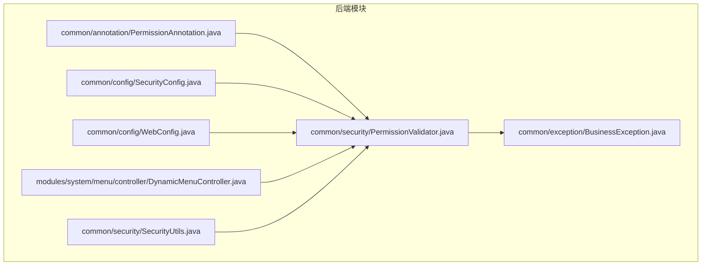
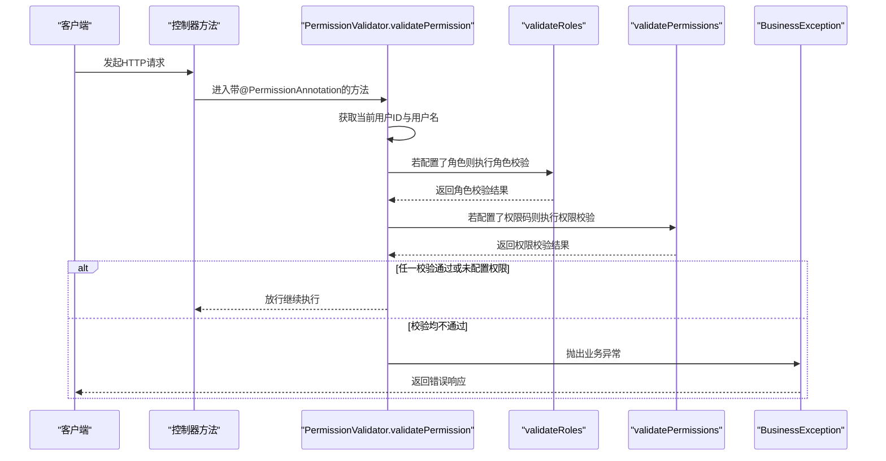
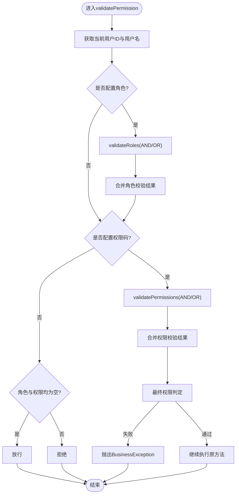
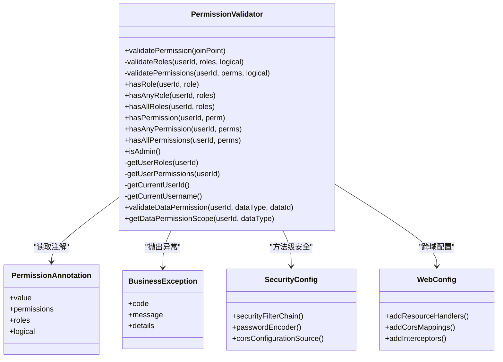

# 权限验证器实现

<cite>
**本文引用的文件**
- [PermissionValidator.java](file://08-backend/src/main/java/com/enterprise/brain/common/security/PermissionValidator.java)
- [PermissionAnnotation.java](file://08-backend/src/main/java/com/enterprise/brain/common/annotation/PermissionAnnotation.java)
- [BusinessException.java](file://08-backend/src/main/java/com/enterprise/brain/common/exception/BusinessException.java)
- [SecurityConfig.java](file://08-backend/src/main/java/com/enterprise/brain/common/config/SecurityConfig.java)
- [WebConfig.java](file://08-backend/src/main/java/com/enterprise/brain/common/config/WebConfig.java)
- [DynamicMenuController.java](file://08-backend/src/main/java/com/enterprise/brain/modules/system/menu/controller/DynamicMenuController.java)
- [SecurityUtils.java](file://08-backend/src/main/java/com/enterprise/brain/common/security/SecurityUtils.java)
</cite>

## 目录
1. [引言](#引言)
2. [项目结构](#项目结构)
3. [核心组件](#核心组件)
4. [架构总览](#架构总览)
5. [详细组件分析](#详细组件分析)
6. [依赖关系分析](#依赖关系分析)
7. [性能考量](#性能考量)
8. [故障排查指南](#故障排查指南)
9. [结论](#结论)

## 引言
本文件围绕PermissionValidator切面类的完整执行流程进行深入剖析，从@Around("@annotation(com.enterprise.brain.common.annotation.PermissionAnnotation)")切点表达式入手，系统阐述validatePermission方法如何拦截带有权限注解的方法调用。重点解析三阶段权限验证逻辑：上下文用户信息获取、角色验证与权限码验证的双重校验及AND/OR逻辑差异、以及验证失败时BusinessException异常的抛出与对调用链的影响。同时结合hasRole、hasPermission等辅助方法的使用说明，探讨validateDataPermission与getDataPermissionScope在数据级权限控制中的扩展思路。

## 项目结构
- 后端采用Spring Boot工程，权限验证通过AOP切面实现，注解驱动的权限控制位于common模块，控制器示例位于modules模块。
- 关键文件分布：
  - 切面与注解：common/security/PermissionValidator.java、common/annotation/PermissionAnnotation.java
  - 异常定义：common/exception/BusinessException.java
  - 安全配置：common/config/SecurityConfig.java、common/config/WebConfig.java
  - 控制器示例：modules/system/menu/controller/DynamicMenuController.java
  - 安全工具：common/security/SecurityUtils.java

图表来源
- [PermissionValidator.java](file://08-backend/src/main/java/com/enterprise/brain/common/security/PermissionValidator.java#L1-L316)
- [PermissionAnnotation.java](file://08-backend/src/main/java/com/enterprise/brain/common/annotation/PermissionAnnotation.java#L1-L51)
- [BusinessException.java](file://08-backend/src/main/java/com/enterprise/brain/common/exception/BusinessException.java#L1-L69)
- [SecurityConfig.java](file://08-backend/src/main/java/com/enterprise/brain/common/config/SecurityConfig.java#L1-L87)
- [WebConfig.java](file://08-backend/src/main/java/com/enterprise/brain/common/config/WebConfig.java#L1-L56)
- [DynamicMenuController.java](file://08-backend/src/main/java/com/enterprise/brain/modules/system/menu/controller/DynamicMenuController.java#L12-L106)
- [SecurityUtils.java](file://08-backend/src/main/java/com/enterprise/brain/common/security/SecurityUtils.java#L1-L74)

章节来源
- [PermissionValidator.java](file://08-backend/src/main/java/com/enterprise/brain/common/security/PermissionValidator.java#L1-L316)
- [PermissionAnnotation.java](file://08-backend/src/main/java/com/enterprise/brain/common/annotation/PermissionAnnotation.java#L1-L51)
- [BusinessException.java](file://08-backend/src/main/java/com/enterprise/brain/common/exception/BusinessException.java#L1-L69)
- [SecurityConfig.java](file://08-backend/src/main/java/com/enterprise/brain/common/config/SecurityConfig.java#L1-L87)
- [WebConfig.java](file://08-backend/src/main/java/com/enterprise/brain/common/config/WebConfig.java#L1-L56)
- [DynamicMenuController.java](file://08-backend/src/main/java/com/enterprise/brain/modules/system/menu/controller/DynamicMenuController.java#L12-L106)
- [SecurityUtils.java](file://08-backend/src/main/java/com/enterprise/brain/common/security/SecurityUtils.java#L1-L74)

## 核心组件
- PermissionValidator：基于注解的权限验证切面，负责拦截带PermissionAnnotation的方法并执行三阶段验证。
- PermissionAnnotation：声明式权限注解，支持roles、permissions、value、logical等字段。
- BusinessException：业务异常，用于在权限验证失败时向调用链抛出统一错误。
- SecurityConfig/WebConfig：Spring安全与Web配置，启用方法级安全与跨域配置。
- SecurityUtils：安全工具类，提供当前用户上下文获取（当前实现为占位，后续可接入Security Context）。
- DynamicMenuController：控制器示例，展示权限注解在实际接口上的使用方式（与@PreAuthorize配合）。

章节来源
- [PermissionValidator.java](file://08-backend/src/main/java/com/enterprise/brain/common/security/PermissionValidator.java#L1-L316)
- [PermissionAnnotation.java](file://08-backend/src/main/java/com/enterprise/brain/common/annotation/PermissionAnnotation.java#L1-L51)
- [BusinessException.java](file://08-backend/src/main/java/com/enterprise/brain/common/exception/BusinessException.java#L1-L69)
- [SecurityConfig.java](file://08-backend/src/main/java/com/enterprise/brain/common/config/SecurityConfig.java#L1-L87)
- [WebConfig.java](file://08-backend/src/main/java/com/enterprise/brain/common/config/WebConfig.java#L1-L56)
- [DynamicMenuController.java](file://08-backend/src/main/java/com/enterprise/brain/modules/system/menu/controller/DynamicMenuController.java#L12-L106)
- [SecurityUtils.java](file://08-backend/src/main/java/com/enterprise/brain/common/security/SecurityUtils.java#L1-L74)

## 架构总览
PermissionValidator通过AOP在方法执行前拦截，读取PermissionAnnotation注解，完成用户上下文获取、角色与权限码的双重校验，并在失败时抛出BusinessException。整体流程如下：

图表来源
- [PermissionValidator.java](file://08-backend/src/main/java/com/enterprise/brain/common/security/PermissionValidator.java#L31-L85)
- [PermissionAnnotation.java](file://08-backend/src/main/java/com/enterprise/brain/common/annotation/PermissionAnnotation.java#L10-L49)
- [BusinessException.java](file://08-backend/src/main/java/com/enterprise/brain/common/exception/BusinessException.java#L18-L68)

## 详细组件分析

### 切点与拦截流程
- 切点表达式：@Around("@annotation(com.enterprise.brain.common.annotation.PermissionAnnotation)")
- 执行入口：validatePermission(ProceedingJoinPoint)
- 流程要点：
  - 解析方法签名与注解实例
  - 获取当前用户ID与用户名
  - 三阶段验证：角色验证、权限码验证、空配置放行
  - 失败时记录告警日志并抛出BusinessException
  - 成功时继续执行原方法

章节来源
- [PermissionValidator.java](file://08-backend/src/main/java/com/enterprise/brain/common/security/PermissionValidator.java#L31-L85)

### 三阶段权限验证逻辑
- 第一阶段：上下文用户信息获取
  - getCurrentUserId()/getCurrentUsername()用于获取当前用户上下文
  - 当前实现为占位，建议后续接入Security Context
- 第二阶段：角色验证与权限码验证
  - 角色验证：validateRoles(userId, requiredRoles, logical)
  - 权限码验证：validatePermissions(userId, requiredPermissions, logical)
  - 逻辑类型：
    - AND：需同时满足所有角色或权限
    - OR：满足任一角色或权限即可
  - 权限码来源优先级：permissions > value（若permissions为空则回退到value）
- 第三阶段：空配置放行与异常抛出
  - 若未配置任何角色与权限码，默认放行
  - 任一阶段失败即抛出BusinessException，阻止继续执行

图表来源
- [PermissionValidator.java](file://08-backend/src/main/java/com/enterprise/brain/common/security/PermissionValidator.java#L31-L85)
- [PermissionAnnotation.java](file://08-backend/src/main/java/com/enterprise/brain/common/annotation/PermissionAnnotation.java#L10-L49)

章节来源
- [PermissionValidator.java](file://08-backend/src/main/java/com/enterprise/brain/common/security/PermissionValidator.java#L31-L85)
- [PermissionAnnotation.java](file://08-backend/src/main/java/com/enterprise/brain/common/annotation/PermissionAnnotation.java#L10-L49)

### AND/OR逻辑类型差异化处理
- 角色AND：用户角色集合需包含全部requiredRoles
- 角色OR：用户角色集合中存在任一requiredRoles即通过
- 权限AND：用户权限集合需包含全部requiredPermissions
- 权限OR：用户权限集合中存在任一requiredPermissions即通过

章节来源
- [PermissionValidator.java](file://08-backend/src/main/java/com/enterprise/brain/common/security/PermissionValidator.java#L95-L135)

### 辅助方法与使用说明
- hasRole(userId, role)：检查用户是否拥有指定角色
- hasAnyRole(userId, roles...)：检查用户是否拥有任一角色
- hasAllRoles(userId, roles...)：检查用户是否拥有全部角色
- hasPermission(userId, permission)：检查用户是否拥有指定权限
- hasAnyPermission(userId, permissions...)：检查用户是否拥有任一权限
- hasAllPermissions(userId, permissions...)：检查用户是否拥有全部权限
- isAdmin()：检查当前用户是否为管理员（基于hasRole）

这些方法便于在业务代码中直接进行细粒度权限判断，提升可读性与复用性。

章节来源
- [PermissionValidator.java](file://08-backend/src/main/java/com/enterprise/brain/common/security/PermissionValidator.java#L144-L218)

### 数据级权限控制扩展
- validateDataPermission(userId, dataType, dataId)：验证用户是否可访问某条具体数据
- getDataPermissionScope(userId, dataType)：获取用户在某数据类型下的权限范围（如部门ID、组织ID等集合）
- 应用场景：在查询/编辑/删除具体数据时，结合validateDataPermission与getDataPermissionScope限制数据可见范围

章节来源
- [PermissionValidator.java](file://08-backend/src/main/java/com/enterprise/brain/common/security/PermissionValidator.java#L286-L314)

### 异常处理与调用链影响
- 失败时抛出BusinessException，包含错误码与消息
- 切面层捕获异常并向上抛出，调用链收到统一业务异常，便于前端统一处理
- 日志记录：失败时记录告警日志，包含用户、方法名与要求的角色/权限

章节来源
- [PermissionValidator.java](file://08-backend/src/main/java/com/enterprise/brain/common/security/PermissionValidator.java#L74-L85)
- [BusinessException.java](file://08-backend/src/main/java/com/enterprise/brain/common/exception/BusinessException.java#L18-L68)

### 注解定义与使用要点
- PermissionAnnotation支持：
  - value/permissions：权限码数组
  - roles：角色数组
  - logical：AND/OR逻辑类型
- 控制器示例中常见与@PreAuthorize配合使用，前者做运行期注解权限校验，后者做URL级方法级安全

章节来源
- [PermissionAnnotation.java](file://08-backend/src/main/java/com/enterprise/brain/common/annotation/PermissionAnnotation.java#L10-L49)
- [DynamicMenuController.java](file://08-backend/src/main/java/com/enterprise/brain/modules/system/menu/controller/DynamicMenuController.java#L12-L106)

## 依赖关系分析
- PermissionValidator依赖：
  - PermissionAnnotation：读取注解元数据
  - BusinessException：异常抛出
  - SecurityUtils：当前用户上下文获取（当前为占位）
  - Spring AOP：@Around、ProceedingJoinPoint
- 配置依赖：
  - SecurityConfig启用@EnableMethodSecurity，确保方法级注解生效
  - WebConfig提供跨域配置，保障前后端交互

图表来源
- [PermissionValidator.java](file://08-backend/src/main/java/com/enterprise/brain/common/security/PermissionValidator.java#L1-L316)
- [PermissionAnnotation.java](file://08-backend/src/main/java/com/enterprise/brain/common/annotation/PermissionAnnotation.java#L10-L49)
- [BusinessException.java](file://08-backend/src/main/java/com/enterprise/brain/common/exception/BusinessException.java#L18-L68)
- [SecurityConfig.java](file://08-backend/src/main/java/com/enterprise/brain/common/config/SecurityConfig.java#L26-L87)
- [WebConfig.java](file://08-backend/src/main/java/com/enterprise/brain/common/config/WebConfig.java#L15-L56)

章节来源
- [PermissionValidator.java](file://08-backend/src/main/java/com/enterprise/brain/common/security/PermissionValidator.java#L1-L316)
- [PermissionAnnotation.java](file://08-backend/src/main/java/com/enterprise/brain/common/annotation/PermissionAnnotation.java#L10-L49)
- [BusinessException.java](file://08-backend/src/main/java/com/enterprise/brain/common/exception/BusinessException.java#L18-L68)
- [SecurityConfig.java](file://08-backend/src/main/java/com/enterprise/brain/common/config/SecurityConfig.java#L26-L87)
- [WebConfig.java](file://08-backend/src/main/java/com/enterprise/brain/common/config/WebConfig.java#L15-L56)

## 性能考量
- 切面执行开销：仅在带PermissionAnnotation的方法上生效，避免全局拦截带来的额外成本
- 集合操作复杂度：角色/权限集合包含判断为O(n)，建议在用户角色/权限较多时考虑缓存与索引优化
- 日志输出：调试日志在成功/失败时分别输出，建议在生产环境适当降低日志级别
- 上下文获取：getCurrentUserId/getCurrentUsername当前为占位，建议接入Security Context以减少不必要的计算

[本节为通用指导，无需特定文件来源]

## 故障排查指南
- 权限验证失败但未抛出异常
  - 检查是否正确配置@EnableMethodSecurity
  - 确认目标方法确实标注了PermissionAnnotation
- 业务异常未被统一处理
  - 检查全局异常处理器是否注册
  - 确认抛出的异常类型为BusinessException
- 用户上下文为空
  - 检查SecurityUtils.getCurrentUserId/Username实现，确保已接入Security Context
- 数据级权限未生效
  - 在业务层调用validateDataPermission与getDataPermissionScope进行二次校验
  - 确认数据查询SQL中已按权限范围过滤

章节来源
- [SecurityConfig.java](file://08-backend/src/main/java/com/enterprise/brain/common/config/SecurityConfig.java#L26-L87)
- [PermissionValidator.java](file://08-backend/src/main/java/com/enterprise/brain/common/security/PermissionValidator.java#L74-L85)
- [BusinessException.java](file://08-backend/src/main/java/com/enterprise/brain/common/exception/BusinessException.java#L18-L68)
- [SecurityUtils.java](file://08-backend/src/main/java/com/enterprise/brain/common/security/SecurityUtils.java#L40-L73)

## 结论
PermissionValidator通过注解驱动的方式实现了灵活且可扩展的权限控制，具备以下特点：
- 三阶段验证清晰：上下文获取、角色与权限双重校验、空配置放行
- AND/OR逻辑明确：支持灵活的权限组合策略
- 异常统一：BusinessException保证调用链一致性
- 可扩展性强：提供hasXxx系列辅助方法与数据级权限扩展点
- 建议完善：
  - 将用户上下文获取接入Security Context
  - 在生产环境完善白名单与权限规则
  - 对角色/权限集合进行缓存与索引优化

[本节为总结性内容，无需特定文件来源]