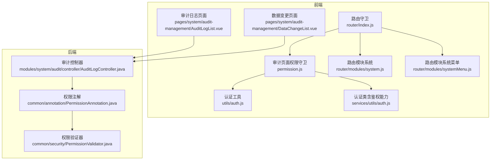
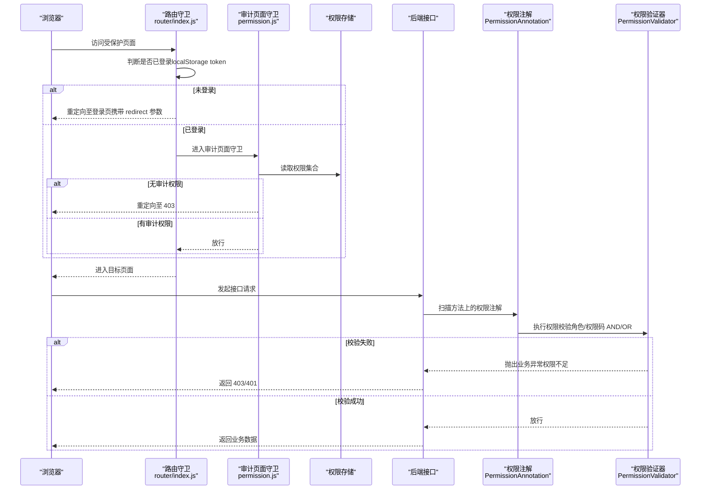
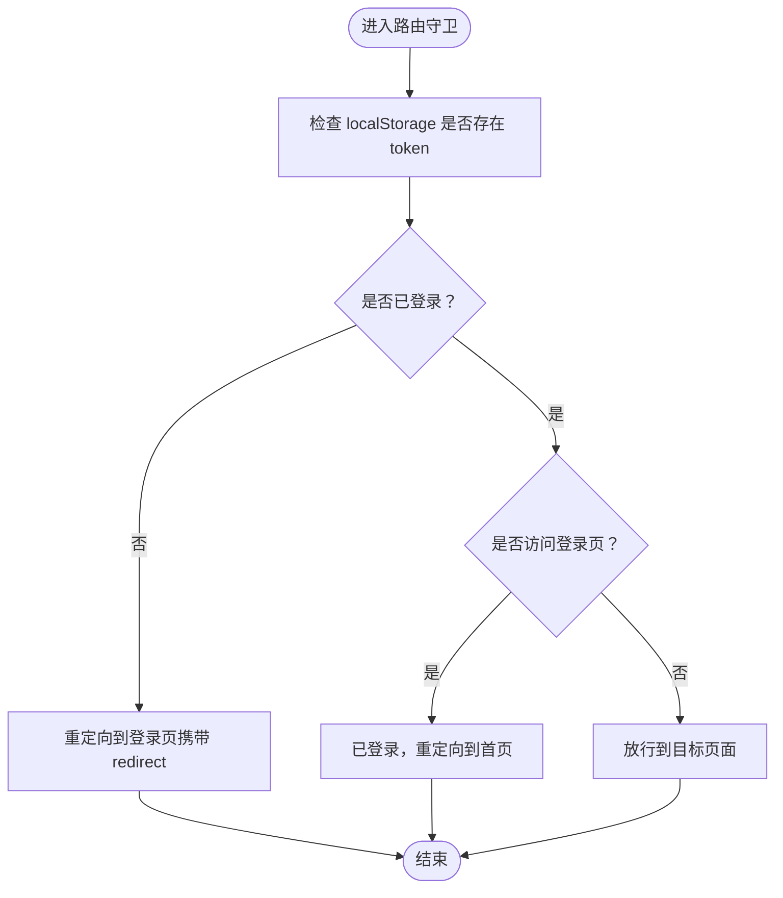
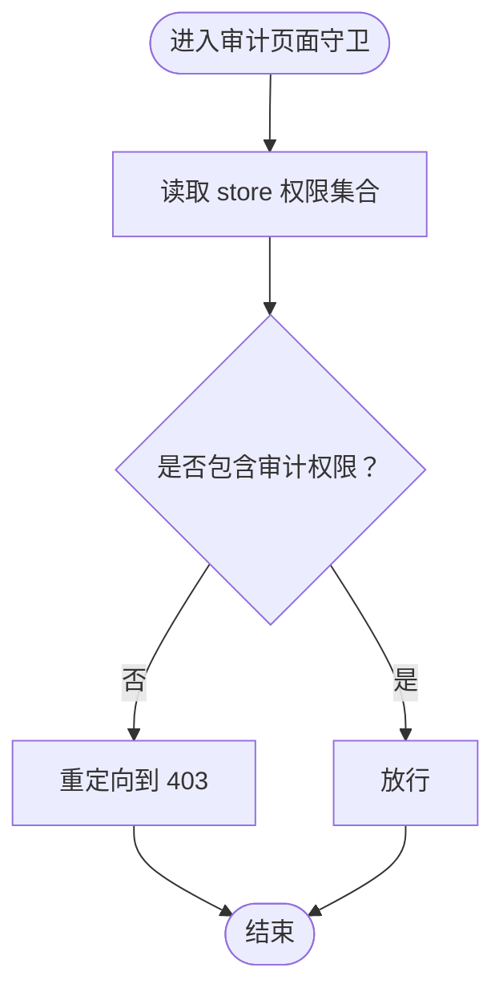
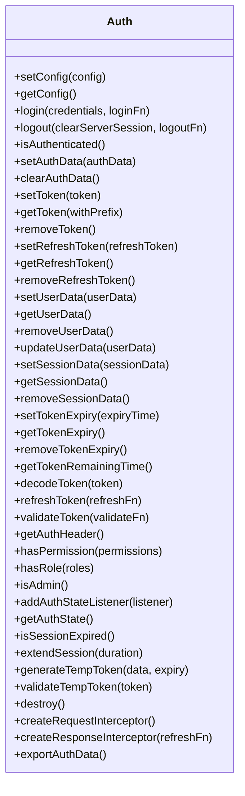
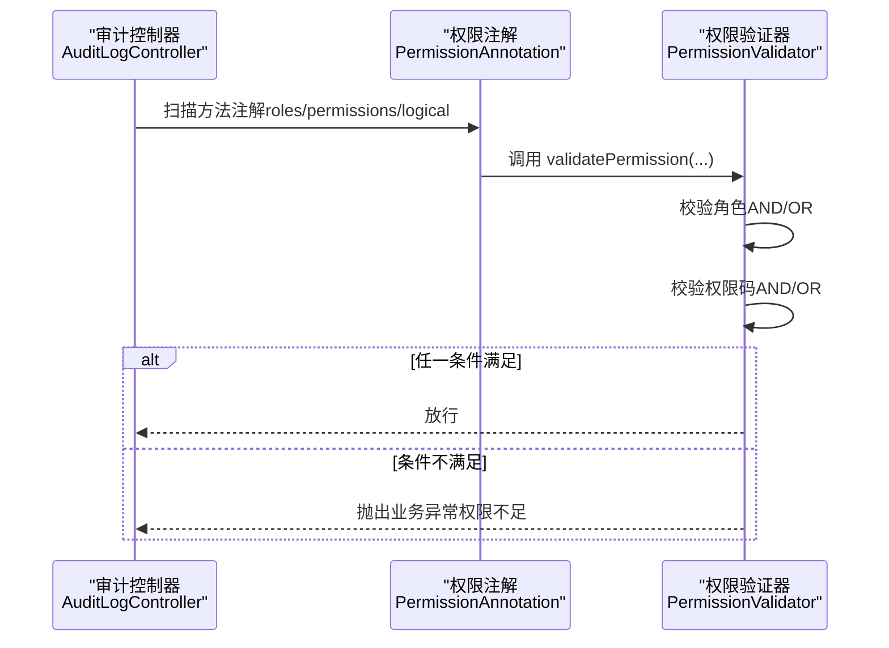
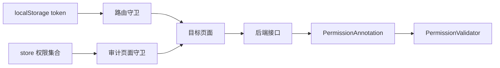

# 导航权限控制

<cite>
**本文引用的文件**
- [permission.js](file://07-frontend/src/permission.js)
- [index.js（路由）](file://07-frontend/src/router/index.js)
- [auth.js（前端工具）](file://07-frontend/src/utils/auth.js)
- [auth.js（认证类）](file://07-frontend/src/services/utils/auth.js)
- [main.js](file://07-frontend/src/main.js)
- [system.js（系统路由模块）](file://07-frontend/src/router/modules/system.js)
- [systemMenu.js（系统菜单路由模块）](file://07-frontend/src/router/modules/systemMenu.js)
- [AuditLogList.vue](file://07-frontend/src/pages/system/audit-management/AuditLogList.vue)
- [DataChangeList.vue](file://07-frontend/src/pages/system/audit-management/DataChangeList.vue)
- [PermissionAnnotation.java](file://08-backend/src/main/java/com/enterprise/brain/common/annotation/PermissionAnnotation.java)
- [PermissionValidator.java](file://08-backend/src/main/java/com/enterprise/brain/common/security/PermissionValidator.java)
- [AuditLogController.java](file://08-backend/src/main/java/com/enterprise/brain/modules/system/audit/controller/AuditLogController.java)
</cite>

## 目录
1. [简介](#简介)
2. [项目结构](#项目结构)
3. [核心组件](#核心组件)
4. [架构总览](#架构总览)
5. [详细组件分析](#详细组件分析)
6. [依赖关系分析](#依赖关系分析)
7. [性能考量](#性能考量)
8. [故障排查指南](#故障排查指南)
9. [结论](#结论)

## 简介
本文件围绕前端路由权限控制机制展开，重点解析 permission.js 中路由守卫的完整实现流程，说明如何通过 localStorage 中的 token 判断用户登录状态，并实现未授权访问的自动重定向。同时结合后端 PermissionAnnotation 注解与 PermissionValidator 权限验证服务，阐述前后端权限控制的协同工作机制。文档通过实际代码路径示例，展示权限校验的完整流程，包括角色验证、权限码匹配、数据权限范围检查等核心逻辑，帮助开发者理解安全导航系统的构建方法。

## 项目结构
前端权限控制主要分布在以下位置：
- 路由守卫与导航控制：07-frontend/src/router/index.js、07-frontend/src/permission.js
- 认证与权限工具：07-frontend/src/utils/auth.js、07-frontend/src/services/utils/auth.js
- 路由模块定义：07-frontend/src/router/modules/system.js、07-frontend/src/router/modules/systemMenu.js
- 审计页面示例：07-frontend/src/pages/system/audit-management/*.vue
- 后端权限注解与验证器：08-backend/src/main/java/com/enterprise/brain/common/annotation/PermissionAnnotation.java、08-backend/src/main/java/com/enterprise/brain/common/security/PermissionValidator.java
- 审计接口控制器：08-backend/src/main/java/com/enterprise/brain/modules/system/audit/controller/AuditLogController.java

图表来源
- [index.js（路由）](file://07-frontend/src/router/index.js#L1-L228)
- [permission.js](file://07-frontend/src/permission.js#L1-L13)
- [auth.js（前端工具）](file://07-frontend/src/utils/auth.js#L1-L110)
- [auth.js（认证类）](file://07-frontend/src/services/utils/auth.js#L1-L817)
- [system.js（系统路由模块）](file://07-frontend/src/router/modules/system.js#L1-L397)
- [systemMenu.js（系统菜单路由模块）](file://07-frontend/src/router/modules/systemMenu.js#L1-L56)
- [AuditLogList.vue](file://07-frontend/src/pages/system/audit-management/AuditLogList.vue#L1-L135)
- [DataChangeList.vue](file://07-frontend/src/pages/system/audit-management/DataChangeList.vue#L1-L164)
- [PermissionAnnotation.java](file://08-backend/src/main/java/com/enterprise/brain/common/annotation/PermissionAnnotation.java#L1-L51)
- [PermissionValidator.java](file://08-backend/src/main/java/com/enterprise/brain/common/security/PermissionValidator.java#L1-L316)
- [AuditLogController.java](file://08-backend/src/main/java/com/enterprise/brain/modules/system/audit/controller/AuditLogController.java#L1-L30)

章节来源
- [index.js（路由）](file://07-frontend/src/router/index.js#L1-L228)
- [permission.js](file://07-frontend/src/permission.js#L1-L13)
- [auth.js（前端工具）](file://07-frontend/src/utils/auth.js#L1-L110)
- [auth.js（认证类）](file://07-frontend/src/services/utils/auth.js#L1-L817)
- [system.js（系统路由模块）](file://07-frontend/src/router/modules/system.js#L1-L397)
- [systemMenu.js（系统菜单路由模块）](file://07-frontend/src/router/modules/systemMenu.js#L1-L56)
- [AuditLogList.vue](file://07-frontend/src/pages/system/audit-management/AuditLogList.vue#L1-L135)
- [DataChangeList.vue](file://07-frontend/src/pages/system/audit-management/DataChangeList.vue#L1-L164)
- [PermissionAnnotation.java](file://08-backend/src/main/java/com/enterprise/brain/common/annotation/PermissionAnnotation.java#L1-L51)
- [PermissionValidator.java](file://08-backend/src/main/java/com/enterprise/brain/common/security/PermissionValidator.java#L1-L316)
- [AuditLogController.java](file://08-backend/src/main/java/com/enterprise/brain/modules/system/audit/controller/AuditLogController.java#L1-L30)

## 核心组件
- 路由守卫（全局前置守卫）：负责登录态判断、未登录自动跳转、页面标题设置等。
- 审计页面权限守卫：基于 store 的权限集合，对审计相关页面进行细粒度权限控制。
- 认证工具与认证类：提供 token、用户信息、权限、角色的本地存储与读写，以及更完善的认证能力（如令牌刷新、过期检测、鉴权头生成等）。
- 路由模块：定义系统管理、菜单管理、审计等模块的路由元信息（包含权限码），用于前端侧菜单渲染与权限判断。
- 后端权限注解与验证器：基于注解的权限校验，支持角色与权限码的 AND/OR 逻辑，统一在切面中执行。

章节来源
- [index.js（路由）](file://07-frontend/src/router/index.js#L199-L226)
- [permission.js](file://07-frontend/src/permission.js#L1-L13)
- [auth.js（前端工具）](file://07-frontend/src/utils/auth.js#L1-L110)
- [auth.js（认证类）](file://07-frontend/src/services/utils/auth.js#L1-L817)
- [system.js（系统路由模块）](file://07-frontend/src/router/modules/system.js#L1-L397)
- [systemMenu.js（系统菜单路由模块）](file://07-frontend/src/router/modules/systemMenu.js#L1-L56)
- [PermissionAnnotation.java](file://08-backend/src/main/java/com/enterprise/brain/common/annotation/PermissionAnnotation.java#L1-L51)
- [PermissionValidator.java](file://08-backend/src/main/java/com/enterprise/brain/common/security/PermissionValidator.java#L1-L316)

## 架构总览
前端通过路由守卫在导航阶段进行登录态与权限校验；后端通过注解与切面在接口层进行权限校验。两者配合形成“前端导航安全 + 后端接口安全”的双重保障。

图表来源
- [index.js（路由）](file://07-frontend/src/router/index.js#L199-L226)
- [permission.js](file://07-frontend/src/permission.js#L1-L13)
- [PermissionAnnotation.java](file://08-backend/src/main/java/com/enterprise/brain/common/annotation/PermissionAnnotation.java#L1-L51)
- [PermissionValidator.java](file://08-backend/src/main/java/com/enterprise/brain/common/security/PermissionValidator.java#L1-L316)

## 详细组件分析

### 组件A：路由守卫（全局前置守卫）
- 登录态判断：通过 localStorage 中是否存在 token 决定是否已登录。
- 登录页特殊处理：若已登录再访问登录页，直接重定向到首页；若未登录则放行。
- 未登录重定向：对需要登录的页面，未登录时重定向到登录页并附带 redirect 参数，便于登录后回到原页面。
- 页面标题设置：根据路由元信息设置页面标题。

图表来源
- [index.js（路由）](file://07-frontend/src/router/index.js#L199-L226)

章节来源
- [index.js（路由）](file://07-frontend/src/router/index.js#L199-L226)

### 组件B：审计页面权限守卫
- 依据 store.getters.permissions 判断是否具备审计相关权限。
- 对包含特定路径片段的审计页面进行细粒度权限控制，无权限则重定向至 403。

图表来源
- [permission.js](file://07-frontend/src/permission.js#L1-L13)

章节来源
- [permission.js](file://07-frontend/src/permission.js#L1-L13)

### 组件C：认证工具与认证类
- 前端工具（utils/auth.js）：提供 token、用户信息、权限、角色的本地存储读写与基本权限判断（如 hasPermission、hasRole）。
- 认证类（services/utils/auth.js）：提供更完善的认证能力，包括：
  - 配置化存储（localStorage/sessionStorage/cookie）
  - 令牌过期检测与自动刷新
  - 令牌刷新队列与并发控制
  - 鉴权头生成、请求拦截器、响应拦截器（处理 401）
  - 用户权限与角色判断（hasPermission、hasRole、isAdmin）
  - 会话扩展与销毁

图表来源
- [auth.js（认证类）](file://07-frontend/src/services/utils/auth.js#L1-L817)

章节来源
- [auth.js（前端工具）](file://07-frontend/src/utils/auth.js#L1-L110)
- [auth.js（认证类）](file://07-frontend/src/services/utils/auth.js#L1-L817)

### 组件D：路由模块与权限元信息
- 系统管理模块（router/modules/system.js）与系统菜单模块（router/modules/systemMenu.js）在路由元信息中声明了权限码，用于前端侧菜单渲染与权限判断。
- 审计相关页面在系统模块中定义了对应的权限码，前端守卫据此进行控制。

章节来源
- [system.js（系统路由模块）](file://07-frontend/src/router/modules/system.js#L1-L397)
- [systemMenu.js（系统菜单路由模块）](file://07-frontend/src/router/modules/systemMenu.js#L1-L56)

### 组件E：后端权限注解与验证器
- PermissionAnnotation：支持在方法上声明所需角色与权限码，并指定 AND/OR 逻辑。
- PermissionValidator：基于注解扫描与切面执行权限校验，支持角色与权限码的 AND/OR 逻辑，未满足条件时抛出业务异常。
- 审计接口控制器（AuditLogController）：作为后端接口示例，配合注解与验证器实现权限控制。

图表来源
- [PermissionAnnotation.java](file://08-backend/src/main/java/com/enterprise/brain/common/annotation/PermissionAnnotation.java#L1-L51)
- [PermissionValidator.java](file://08-backend/src/main/java/com/enterprise/brain/common/security/PermissionValidator.java#L1-L316)
- [AuditLogController.java](file://08-backend/src/main/java/com/enterprise/brain/modules/system/audit/controller/AuditLogController.java#L1-L30)

章节来源
- [PermissionAnnotation.java](file://08-backend/src/main/java/com/enterprise/brain/common/annotation/PermissionAnnotation.java#L1-L51)
- [PermissionValidator.java](file://08-backend/src/main/java/com/enterprise/brain/common/security/PermissionValidator.java#L1-L316)
- [AuditLogController.java](file://08-backend/src/main/java/com/enterprise/brain/modules/system/audit/controller/AuditLogController.java#L1-L30)

### 组件F：审计页面示例（前端）
- 审计日志列表与数据变更列表页面通过 API 接口拉取数据，这些接口在后端受权限注解保护，前端需确保具备相应权限才能访问。

章节来源
- [AuditLogList.vue](file://07-frontend/src/pages/system/audit-management/AuditLogList.vue#L1-L135)
- [DataChangeList.vue](file://07-frontend/src/pages/system/audit-management/DataChangeList.vue#L1-L164)

## 依赖关系分析
- 前端依赖
  - 路由守卫依赖 localStorage token 判断登录态。
  - 审计页面守卫依赖 store 的权限集合。
  - 认证类提供更完善的鉴权能力，可与路由守卫配合使用。
- 后端依赖
  - 控制器方法通过 PermissionAnnotation 声明权限要求。
  - PermissionValidator 通过切面统一执行权限校验。

图表来源
- [index.js（路由）](file://07-frontend/src/router/index.js#L199-L226)
- [permission.js](file://07-frontend/src/permission.js#L1-L13)
- [PermissionAnnotation.java](file://08-backend/src/main/java/com/enterprise/brain/common/annotation/PermissionAnnotation.java#L1-L51)
- [PermissionValidator.java](file://08-backend/src/main/java/com/enterprise/brain/common/security/PermissionValidator.java#L1-L316)

章节来源
- [index.js（路由）](file://07-frontend/src/router/index.js#L199-L226)
- [permission.js](file://07-frontend/src/permission.js#L1-L13)
- [PermissionAnnotation.java](file://08-backend/src/main/java/com/enterprise/brain/common/annotation/PermissionAnnotation.java#L1-L51)
- [PermissionValidator.java](file://08-backend/src/main/java/com/enterprise/brain/common/security/PermissionValidator.java#L1-L316)

## 性能考量
- 前端
  - 路由守卫仅做轻量级判断（localStorage 读取、字符串匹配），开销极低。
  - 认证类的令牌过期检测采用定时器轮询，建议在不需要时关闭或合并检查频率。
  - 鉴权头生成与请求拦截器避免重复拼装，减少网络请求负担。
- 后端
  - 权限注解与切面在方法调用前执行，避免在业务逻辑中重复校验。
  - 角色与权限集合的获取建议缓存，降低数据库压力。

## 故障排查指南
- 未登录被重定向到登录页
  - 检查 localStorage 中是否存在 token；确认登录流程是否正确写入 token。
  - 若已登录仍被重定向，检查路由守卫中登录页的特殊处理逻辑。
- 审计页面访问被重定向到 403
  - 检查 store 中的权限集合是否包含审计相关权限；确认权限守卫逻辑。
- 后端接口返回权限不足
  - 检查控制器方法是否正确标注 PermissionAnnotation；
  - 确认 PermissionValidator 的角色/权限码逻辑与用户实际角色/权限一致；
  - 如使用 AND/OR 逻辑，注意权限集合是否满足条件。
- 令牌过期或刷新失败
  - 使用认证类的令牌刷新能力，确认刷新函数与刷新队列逻辑；
  - 检查响应拦截器对 401 的处理与登出流程。

章节来源
- [index.js（路由）](file://07-frontend/src/router/index.js#L199-L226)
- [permission.js](file://07-frontend/src/permission.js#L1-L13)
- [auth.js（认证类）](file://07-frontend/src/services/utils/auth.js#L1-L817)
- [PermissionValidator.java](file://08-backend/src/main/java/com/enterprise/brain/common/security/PermissionValidator.java#L1-L316)

## 结论
本项目的权限控制体系从前端导航与后端接口两个层面共同保障。前端通过路由守卫与审计页面守卫实现轻量级的安全导航，后端通过注解与切面实现统一的权限校验。两者配合，既保证了用户体验（无需每次请求都进行复杂校验），又确保了安全性（接口层严格把关）。开发者在扩展新页面或接口时，应遵循“前端导航 + 后端注解”的双轨策略，确保权限控制的一致性与完整性。