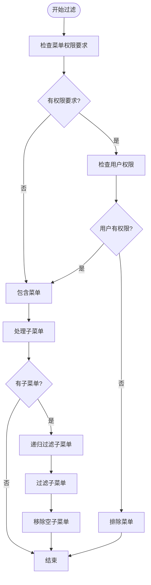

# 侧边栏实现

<cite>
**本文档引用的文件**
- [Sidebar.vue](file://07-frontend/src/components/common/Sidebar.vue)
- [sidebar-themes.scss](file://07-frontend/src/assets/styles/layout/sidebar-themes.scss)
- [menu.ts](file://07-frontend/src/utils/menu.ts)
- [DynamicMenu.vue](file://07-frontend/src/pages/system/components/DynamicMenu.vue)
- [index.js](file://07-frontend/src/router/index.js)
- [permission.js](file://07-frontend/src/permission.js)
</cite>

## 目录
1. [简介](#简介)
2. [项目结构](#项目结构)
3. [核心组件](#核心组件)
4. [架构概述](#架构概述)
5. [详细组件分析](#详细组件分析)
6. [依赖分析](#依赖分析)
7. [性能考虑](#性能考虑)
8. [故障排除指南](#故障排除指南)
9. [结论](#结论)
10. [附录](#附录)（如有必要）

## 简介
本文档深入分析了企业大脑系统中侧边栏组件的实现细节。侧边栏作为系统导航的核心组件，提供了折叠/展开状态管理、菜单搜索过滤、动态菜单渲染、权限控制等关键功能。通过分析相关代码文件，本文将详细阐述侧边栏的实现机制，包括其状态管理、CSS过渡动画、响应式设计以及权限控制策略。

## 项目结构
侧边栏相关组件分布在前端项目的多个目录中，主要集中在`components/common`目录下，样式文件位于`assets/styles/layout`目录，菜单数据结构定义在`utils`目录。


**图示来源**
- [Sidebar.vue](file://07-frontend/src/components/common/Sidebar.vue)
- [sidebar-themes.scss](file://07-frontend/src/assets/styles/layout/sidebar-themes.scss)
- [menu.ts](file://07-frontend/src/utils/menu.ts)
- [DynamicMenu.vue](file://07-frontend/src/pages/system/components/DynamicMenu.vue)

**节来源**
- [Sidebar.vue](file://07-frontend/src/components/common/Sidebar.vue)
- [sidebar-themes.scss](file://07-frontend/src/assets/styles/layout/sidebar-themes.scss)
- [menu.ts](file://07-frontend/src/utils/menu.ts)
- [DynamicMenu.vue](file://07-frontend/src/pages/system/components/DynamicMenu.vue)

## 核心组件
侧边栏的核心功能由`Sidebar.vue`组件实现，该组件使用Element Plus的`el-aside`和`el-menu`组件构建。菜单数据来源于`utils/menu.ts`文件，样式定义在`assets/styles/layout/sidebar-themes.scss`中。`DynamicMenu.vue`组件展示了另一种动态菜单的实现方式。

**节来源**
- [Sidebar.vue](file://07-frontend/src/components/common/Sidebar.vue#L1-L136)
- [menu.ts](file://07-frontend/src/utils/menu.ts#L1-L84)
- [sidebar-themes.scss](file://07-frontend/src/assets/styles/layout/sidebar-themes.scss#L1-L458)

## 架构概述
侧边栏组件采用Vue 3的组合式API（Composition API）实现，通过响应式数据管理折叠状态和菜单过滤。组件与路由系统紧密集成，通过`vue-router`获取当前路由并高亮对应菜单项。权限控制通过用户存储（store）中的权限列表实现。


**图示来源**
- [Sidebar.vue](file://07-frontend/src/components/common/Sidebar.vue#L48-L103)
- [menu.ts](file://07-frontend/src/utils/menu.ts#L1-L84)
- [permission.js](file://07-frontend/src/permission.js#L1-L13)

## 详细组件分析
### 侧边栏组件分析
`Sidebar.vue`组件实现了侧边栏的所有核心功能，包括折叠/展开、菜单渲染、权限过滤和路由导航。

#### 状态管理
侧边栏的折叠状态通过`ref`创建的`isCollapse`变量管理，该变量在`toggleCollapse`函数中被切换。折叠状态的变化会触发CSS宽度属性的改变，从而实现视觉上的折叠/展开效果。


**图示来源**
- [Sidebar.vue](file://07-frontend/src/components/common/Sidebar.vue#L59-L98)

#### 菜单搜索过滤
虽然当前实现中没有直接的搜索过滤功能，但通过`filteredMenuList`计算属性实现了基于权限的菜单过滤。该计算属性递归遍历菜单树，根据用户权限过滤出可访问的菜单项。



**图示来源**
- [Sidebar.vue](file://07-frontend/src/components/common/Sidebar.vue#L65-L87)

#### 动态菜单渲染
侧边栏通过`v-for`指令循环渲染`filteredMenuList`中的菜单项。对于没有子菜单的项，使用`el-menu-item`组件；对于有子菜单的项，使用`el-sub-menu`组件。这种结构化的渲染方式确保了菜单的层次结构清晰。

**节来源**
- [Sidebar.vue](file://07-frontend/src/components/common/Sidebar.vue#L14-L40)

### CSS过渡动画实现
侧边栏的宽度切换通过CSS的`transition`属性实现平滑的动画效果。当`isCollapse`状态改变时，`el-aside`组件的`width`属性从`200px`变为`64px`（或反之），CSS过渡动画使这一变化更加流畅。


**图示来源**
- [Sidebar.vue](file://07-frontend/src/components/common/Sidebar.vue#L3)
- [sidebar-themes.scss](file://07-frontend/src/assets/styles/layout/sidebar-themes.scss#L12)

### 移动端响应式处理
侧边栏在移动端采用抽屉式设计，通过媒体查询和CSS变换实现响应式布局。在小屏幕设备上，侧边栏默认隐藏，用户可以通过按钮将其滑出。


**图示来源**
- [sidebar-themes.scss](file://07-frontend/src/assets/styles/layout/sidebar-themes.scss#L311-L337)

## 依赖分析
侧边栏组件依赖于多个外部模块和内部服务，形成了一个复杂的依赖网络。

```mermaid
graph TD
A[Sidebar.vue] --> B[vue]
A --> C[vue-router]
A --> D[@element-plus/icons-vue]
A --> E[menu.ts]
A --> F[userStore]
E --> G[Element Plus图标]
F --> H[用户权限服务]
A --> I[sidebar-themes.scss]
I --> J[CSS变量]
J --> K[主题系统]
```

**图示来源**
- [Sidebar.vue](file://07-frontend/src/components/common/Sidebar.vue#L48-L54)
- [sidebar-themes.scss](file://07-frontend/src/assets/styles/layout/sidebar-themes.scss#L8)
- [menu.ts](file://07-frontend/src/utils/menu.ts#L2)

**节来源**
- [Sidebar.vue](file://07-frontend/src/components/common/Sidebar.vue#L48-L54)
- [sidebar-themes.scss](file://07-frontend/src/assets/styles/layout/sidebar-themes.scss#L1-L458)
- [menu.ts](file://07-frontend/src/utils/menu.ts#L1-L84)

## 性能考虑
侧边栏组件在性能方面做了多项优化：
1. 使用计算属性`filteredMenuList`缓存过滤结果，避免重复计算
2. 通过`unique-opened`属性限制只有一个子菜单可以展开，减少DOM操作
3. CSS过渡动画使用硬件加速，确保动画流畅
4. 图标组件按需解析，减少不必要的组件渲染

## 故障排除指南
### 菜单不显示
检查用户权限是否正确加载，确保`userStore.permissions`包含必要的权限码。

### 折叠功能失效
确认`isCollapse`状态是否正确绑定，检查CSS中`width`属性的过渡设置。

### 路由导航失败
验证路由配置是否正确，确保`menuList`中的路径与路由定义一致。

**节来源**
- [Sidebar.vue](file://07-frontend/src/components/common/Sidebar.vue#L100-L102)
- [permission.js](file://07-frontend/src/permission.js#L1-L13)

## 结论
侧边栏组件通过Vue 3的响应式系统和Element Plus组件库，实现了功能丰富且用户体验良好的导航界面。其模块化的设计使得功能扩展和维护更加容易。通过合理的状态管理、权限控制和性能优化，该组件为整个系统提供了稳定可靠的导航基础。

## 附录
### 菜单数据结构
```typescript
interface MenuItem {
  path: string;
  name: string;
  icon?: any;
  children?: MenuItem[];
  permission?: string;
}
```

### 权限码示例
- `system:audit`: 审计管理权限
- `QUALITY:MANAGE`: 质量管理权限
- `finance:view`: 财务查看权限