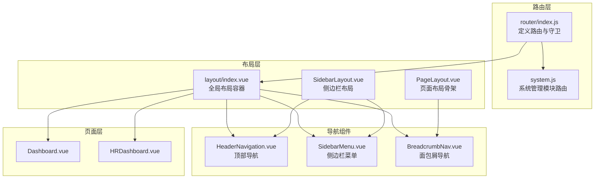
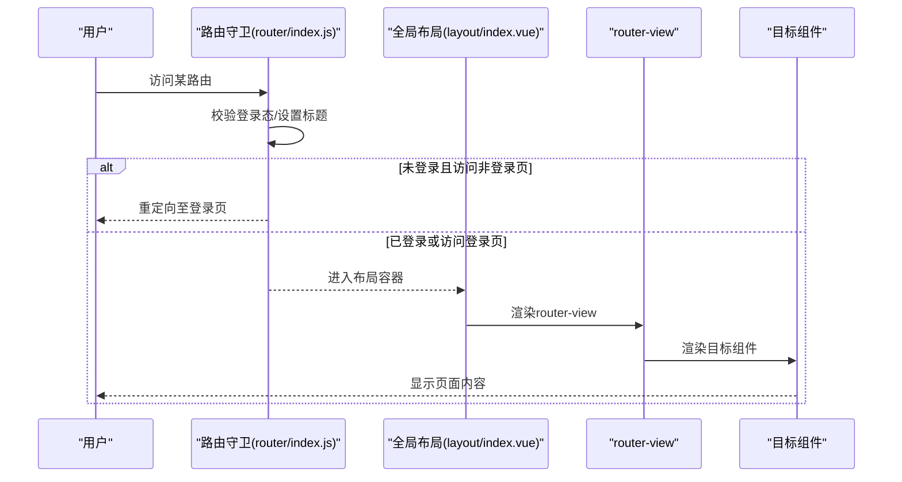
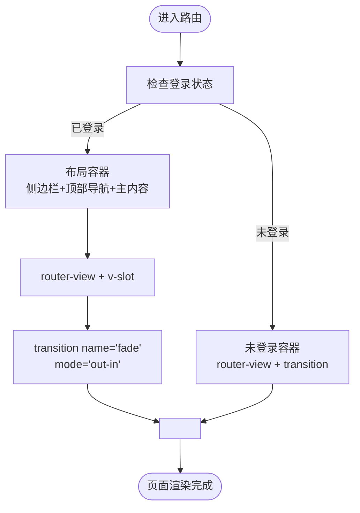
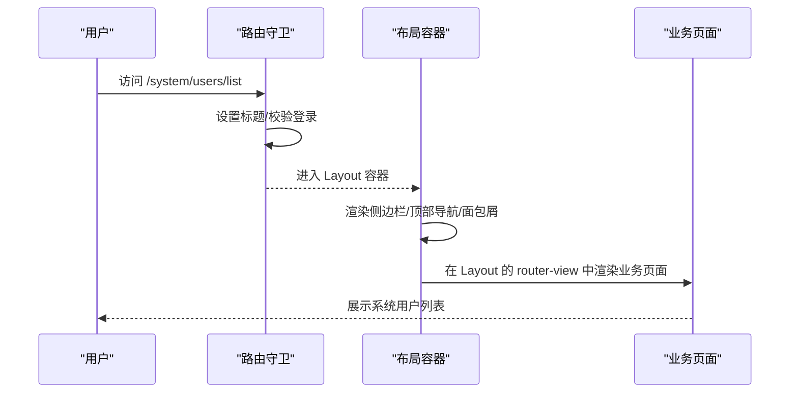
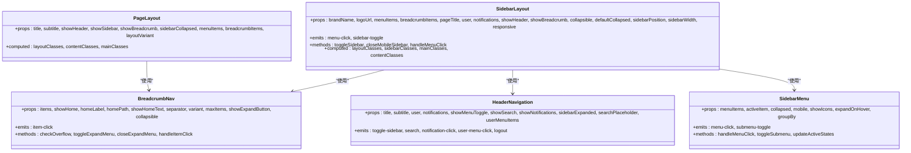
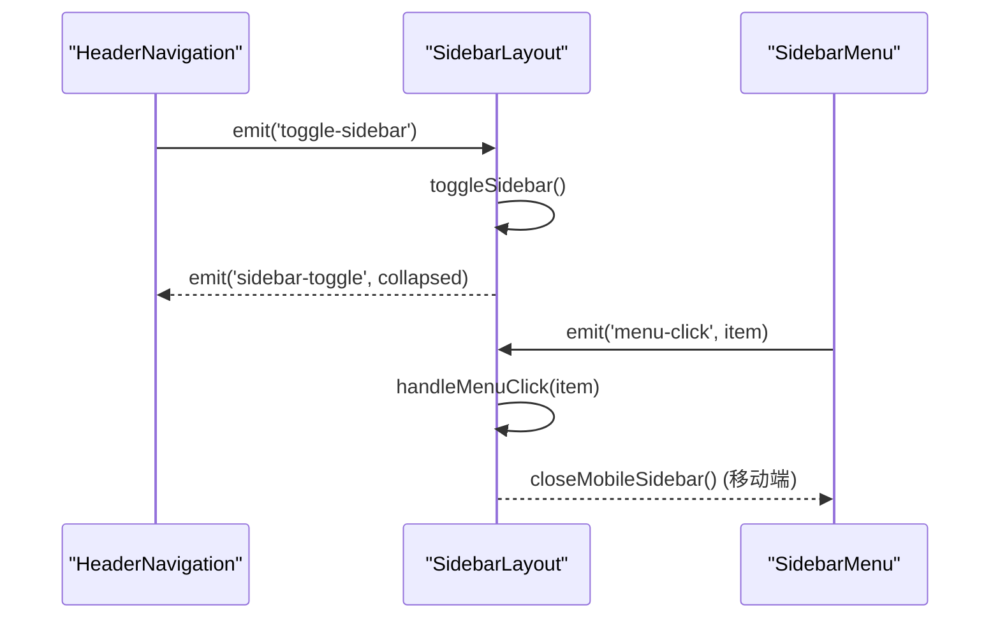
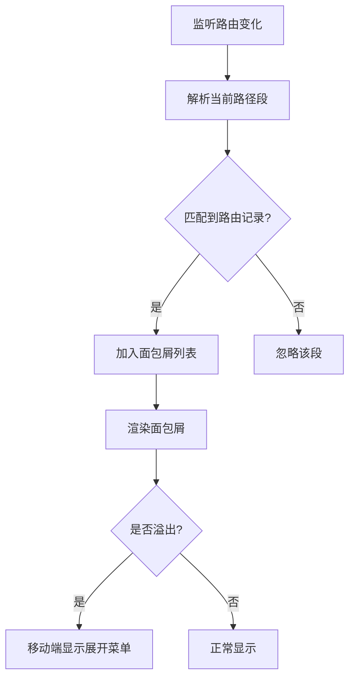
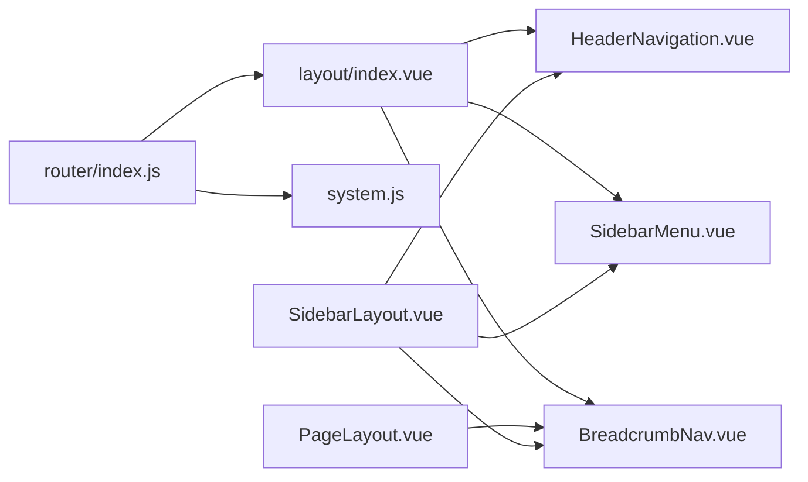

# 布局与导航集成

<cite>
**本文引用的文件**
- [layout/index.vue](file://07-frontend/src/layout/index.vue)
- [router/index.js](file://07-frontend/src/router/index.js)
- [App.vue](file://07-frontend/src/App.vue)
- [PageLayout.vue](file://07-frontend/src/components/common/layout/PageLayout.vue)
- [SidebarLayout.vue](file://07-frontend/src/components/common/layout/SidebarLayout.vue)
- [HeaderNavigation.vue](file://07-frontend/src/components/common/layout/HeaderNavigation.vue)
- [SidebarMenu.vue](file://07-frontend/src/components/common/layout/SidebarMenu.vue)
- [BreadcrumbNav.vue](file://07-frontend/src/components/common/layout/BreadcrumbNav.vue)
- [Dashboard.vue](file://07-frontend/src/pages/after-sales/Dashboard.vue)
- [HRDashboard.vue](file://07-frontend/src/pages/dashboard/HRDashboard.vue)
- [system.js](file://07-frontend/src/router/modules/system.js)
</cite>

## 目录
1. [引言](#引言)
2. [项目结构](#项目结构)
3. [核心组件](#核心组件)
4. [架构总览](#架构总览)
5. [详细组件分析](#详细组件分析)
6. [依赖关系分析](#依赖关系分析)
7. [性能考量](#性能考量)
8. [故障排查指南](#故障排查指南)
9. [结论](#结论)
10. [附录](#附录)

## 引言
本文件围绕前端布局组件与路由系统的集成机制进行全面解析，重点说明 layout/index.vue 如何通过 router-view 实现动态内容渲染；深入分析布局中的过渡动画配置、响应式设计实现，以及与侧边栏、顶部导航的协同工作机制；阐述 PageLayout 和 SidebarLayout 等通用布局组件的设计理念与使用场景，并提供在不同路由下应用不同布局方案、实现布局动态切换与状态保持的实践建议。

## 项目结构
- 布局容器：layout/index.vue 提供全局侧边栏、顶部导航与主内容区的统一容器，内部通过 router-view + transition 实现页面切换的过渡动画。
- 路由系统：router/index.js 定义了多级嵌套路由，其中大量路由以 Layout 作为父级容器，形成“布局 + 页面”的组合模式。
- 通用布局组件：
  - PageLayout.vue：提供带侧边栏、面包屑、标题等的页面布局骨架，适合内容型页面。
  - SidebarLayout.vue：提供可折叠侧边栏、顶部导航、面包屑的完整布局，适合后台管理类页面。
- 导航组件：
  - HeaderNavigation.vue：顶部导航栏，包含菜单切换、搜索、通知、用户菜单等。
  - SidebarMenu.vue：侧边栏菜单，支持分组、徽标、展开/收起、移动端适配。
  - BreadcrumbNav.vue：面包屑导航，支持溢出折叠与移动端展开菜单。
- 示例页面：Dashboard.vue、HRDashboard.vue 等展示了不同布局下的页面内容组织方式。

图表来源
- [router/index.js](file://07-frontend/src/router/index.js#L1-L228)
- [system.js](file://07-frontend/src/router/modules/system.js#L1-L397)
- [layout/index.vue](file://07-frontend/src/layout/index.vue#L1-L120)
- [PageLayout.vue](file://07-frontend/src/components/common/layout/PageLayout.vue#L1-L194)
- [SidebarLayout.vue](file://07-frontend/src/components/common/layout/SidebarLayout.vue#L1-L235)
- [HeaderNavigation.vue](file://07-frontend/src/components/common/layout/HeaderNavigation.vue#L1-L214)
- [SidebarMenu.vue](file://07-frontend/src/components/common/layout/SidebarMenu.vue#L1-L191)
- [BreadcrumbNav.vue](file://07-frontend/src/components/common/layout/BreadcrumbNav.vue#L1-L140)
- [Dashboard.vue](file://07-frontend/src/pages/after-sales/Dashboard.vue#L1-L80)
- [HRDashboard.vue](file://07-frontend/src/pages/dashboard/HRDashboard.vue#L1-L100)

章节来源
- [router/index.js](file://07-frontend/src/router/index.js#L1-L228)
- [layout/index.vue](file://07-frontend/src/layout/index.vue#L1-L120)

## 核心组件
- 全局布局容器 layout/index.vue
  - 通过 v-if/v-else 判断登录状态，分别渲染带布局或直接渲染路由组件。
  - 使用 router-view + transition 实现页面切换过渡动画。
  - 内置侧边栏、顶部导航、面包屑、用户信息与登出流程。
  - 支持菜单搜索、菜单加载、面包屑生成、权限校验等。
- 路由系统 router/index.js
  - 定义根路径重定向、登录页、仪表盘、系统管理、回厂管理、仓库管理等路由。
  - 使用 beforeEach 守卫设置页面标题、登录态校验与重定向。
  - 将多个业务模块路由按命名空间聚合，便于维护。
- 通用布局组件
  - PageLayout.vue：提供标题、侧边栏、面包屑、主体内容的布局骨架，支持变体与响应式。
  - SidebarLayout.vue：提供完整的侧边栏布局，包含顶部导航、面包屑、移动端遮罩与折叠控制。
  - HeaderNavigation.vue：顶部导航栏，支持菜单切换、搜索、通知、用户菜单。
  - SidebarMenu.vue：侧边栏菜单，支持分组、徽标、展开/收起、移动端适配、键盘导航。
  - BreadcrumbNav.vue：面包屑导航，支持溢出折叠、移动端展开菜单、键盘导航。

章节来源
- [layout/index.vue](file://07-frontend/src/layout/index.vue#L1-L120)
- [router/index.js](file://07-frontend/src/router/index.js#L1-L228)
- [PageLayout.vue](file://07-frontend/src/components/common/layout/PageLayout.vue#L1-L194)
- [SidebarLayout.vue](file://07-frontend/src/components/common/layout/SidebarLayout.vue#L1-L235)
- [HeaderNavigation.vue](file://07-frontend/src/components/common/layout/HeaderNavigation.vue#L1-L214)
- [SidebarMenu.vue](file://07-frontend/src/components/common/layout/SidebarMenu.vue#L1-L191)
- [BreadcrumbNav.vue](file://07-frontend/src/components/common/layout/BreadcrumbNav.vue#L1-L140)

## 架构总览
layout/index.vue 作为全局布局容器，承担以下职责：
- 登录态判断与菜单加载
- 侧边栏与顶部导航的统一渲染
- 面包屑生成与权限控制
- 通过 router-view + transition 实现页面切换过渡
- 未登录状态下直接渲染路由组件

路由系统通过 beforeEach 守卫统一处理登录态与页面标题，配合 layout/index.vue 的条件渲染，实现“登录页无需布局”、“业务页统一布局”的双通道渲染。

图表来源
- [router/index.js](file://07-frontend/src/router/index.js#L199-L228)
- [layout/index.vue](file://07-frontend/src/layout/index.vue#L1-L120)

章节来源
- [router/index.js](file://07-frontend/src/router/index.js#L199-L228)
- [layout/index.vue](file://07-frontend/src/layout/index.vue#L1-L120)

## 详细组件分析

### 全局布局容器 layout/index.vue 的动态渲染与过渡动画
- 动态内容渲染
  - 通过 v-if 判断登录状态，决定是否包裹在 Layout 容器内。
  - 在两种分支下均使用 router-view + v-slot 获取组件实例，并通过 <component :is="Component"> 动态渲染。
- 过渡动画配置
  - 使用 transition name="fade" mode="out-in" 实现淡入淡出的页面切换过渡。
  - App.vue 中也定义了全局的 fade 过渡样式，保证顶层组件的一致性。
- 响应式设计
  - 侧边栏宽度随折叠状态变化，主内容区 margin-left 自适应调整。
  - 移动端通过 transform 控制侧边栏显隐，隐藏面包屑以节省空间。
- 与导航的协同
  - 顶部导航包含侧边栏切换按钮、面包屑、用户信息下拉菜单。
  - 侧边栏菜单支持搜索、折叠、子菜单展开、权限控制。

图表来源
- [layout/index.vue](file://07-frontend/src/layout/index.vue#L1-L120)
- [App.vue](file://07-frontend/src/App.vue#L1-L16)

章节来源
- [layout/index.vue](file://07-frontend/src/layout/index.vue#L1-L120)
- [App.vue](file://07-frontend/src/App.vue#L1-L16)

### 路由系统与布局容器的集成
- 路由守卫
  - 设置页面标题：document.title = to.meta.title + “ - 系统名称”
  - 登录态校验：未登录访问受保护路由时重定向至登录页并携带 redirect 参数
  - 已登录访问登录页时重定向至首页
- 布局挂载
  - 多数业务路由以 Layout 作为父级容器，子路由渲染在 Layout 的 router-view 中
  - 系统管理模块路由集中在一个文件中，便于扩展与维护

图表来源
- [router/index.js](file://07-frontend/src/router/index.js#L199-L228)
- [system.js](file://07-frontend/src/router/modules/system.js#L1-L397)
- [layout/index.vue](file://07-frontend/src/layout/index.vue#L1-L120)

章节来源
- [router/index.js](file://07-frontend/src/router/index.js#L1-L228)
- [system.js](file://07-frontend/src/router/modules/system.js#L1-L397)

### 通用布局组件 PageLayout 与 SidebarLayout 的设计理念
- PageLayout.vue
  - 设计理念：以“页面骨架”为核心，提供标题、侧边栏、面包屑、主体内容区域的统一结构，适合内容型页面。
  - 关键特性：支持布局变体（default/fluid/compact/wide）、侧边栏折叠状态、响应式网格布局。
- SidebarLayout.vue
  - 设计理念：提供完整的后台管理布局，包含顶部导航、侧边栏、面包屑、移动端遮罩与折叠控制。
  - 关键特性：可配置品牌名/Logo、菜单项、面包屑项、用户信息、通知、响应式检测与移动端交互。

图表来源
- [PageLayout.vue](file://07-frontend/src/components/common/layout/PageLayout.vue#L1-L194)
- [SidebarLayout.vue](file://07-frontend/src/components/common/layout/SidebarLayout.vue#L1-L235)
- [HeaderNavigation.vue](file://07-frontend/src/components/common/layout/HeaderNavigation.vue#L1-L214)
- [SidebarMenu.vue](file://07-frontend/src/components/common/layout/SidebarMenu.vue#L1-L191)
- [BreadcrumbNav.vue](file://07-frontend/src/components/common/layout/BreadcrumbNav.vue#L1-L140)

章节来源
- [PageLayout.vue](file://07-frontend/src/components/common/layout/PageLayout.vue#L1-L194)
- [SidebarLayout.vue](file://07-frontend/src/components/common/layout/SidebarLayout.vue#L1-L235)
- [HeaderNavigation.vue](file://07-frontend/src/components/common/layout/HeaderNavigation.vue#L1-L214)
- [SidebarMenu.vue](file://07-frontend/src/components/common/layout/SidebarMenu.vue#L1-L191)
- [BreadcrumbNav.vue](file://07-frontend/src/components/common/layout/BreadcrumbNav.vue#L1-L140)

### 侧边栏与顶部导航的协同工作机制
- 侧边栏菜单 SidebarMenu.vue
  - 支持一级菜单与二级子菜单，自动展开激活项的父级菜单。
  - 支持徽标、禁用、外部链接、移动端适配与键盘导航。
- 顶部导航 HeaderNavigation.vue
  - 提供菜单切换按钮、搜索、通知、用户菜单等能力。
  - 与 SidebarLayout 的折叠状态联动，通过事件传递实现双向控制。
- 协同流程
  - 顶部导航触发 toggle-sidebar 事件，侧边栏布局组件接收并切换折叠状态。
  - 侧边栏菜单点击后，向父组件发出 menu-click 事件，父组件可执行路由跳转或状态更新。

图表来源
- [HeaderNavigation.vue](file://07-frontend/src/components/common/layout/HeaderNavigation.vue#L1-L214)
- [SidebarLayout.vue](file://07-frontend/src/components/common/layout/SidebarLayout.vue#L1-L235)
- [SidebarMenu.vue](file://07-frontend/src/components/common/layout/SidebarMenu.vue#L1-L191)

章节来源
- [HeaderNavigation.vue](file://07-frontend/src/components/common/layout/HeaderNavigation.vue#L1-L214)
- [SidebarLayout.vue](file://07-frontend/src/components/common/layout/SidebarLayout.vue#L1-L235)
- [SidebarMenu.vue](file://07-frontend/src/components/common/layout/SidebarMenu.vue#L1-L191)

### 面包屑导航的生成与响应式处理
- 生成策略
  - layout/index.vue 中通过 $router.resolve 逐段解析路径，生成面包屑链路。
  - BreadcrumbNav.vue 支持溢出检测与移动端展开菜单，提升长路径的可读性。
- 响应式处理
  - 移动端隐藏部分项并提供展开菜单，减少横向占用。
  - 支持多种分隔符与变体样式，满足不同页面风格需求。

图表来源
- [layout/index.vue](file://07-frontend/src/layout/index.vue#L366-L384)
- [BreadcrumbNav.vue](file://07-frontend/src/components/common/layout/BreadcrumbNav.vue#L226-L249)

章节来源
- [layout/index.vue](file://07-frontend/src/layout/index.vue#L366-L384)
- [BreadcrumbNav.vue](file://07-frontend/src/components/common/layout/BreadcrumbNav.vue#L226-L249)

### 不同路由下的布局方案与动态切换
- 方案一：全局布局容器
  - 适用于大多数业务页面，统一提供侧边栏、顶部导航与面包屑。
  - 通过 layout/index.vue 的条件渲染与过渡动画，实现一致的页面切换体验。
- 方案二：通用布局组件
  - PageLayout.vue：适合内容型页面，强调主体内容区域与可选侧边栏。
  - SidebarLayout.vue：适合后台管理页面，强调顶部导航、侧边栏与移动端适配。
- 动态切换与状态保持
  - 通过 props 传入菜单项、面包屑项、用户信息等，实现布局状态的动态注入。
  - 侧边栏折叠状态、移动端遮罩状态、搜索输入状态等通过响应式变量与事件机制保持。

章节来源
- [layout/index.vue](file://07-frontend/src/layout/index.vue#L1-L120)
- [PageLayout.vue](file://07-frontend/src/components/common/layout/PageLayout.vue#L1-L194)
- [SidebarLayout.vue](file://07-frontend/src/components/common/layout/SidebarLayout.vue#L1-L235)

## 依赖关系分析
- 组件耦合
  - layout/index.vue 依赖 HeaderNavigation、SidebarMenu、BreadcrumbNav 等导航组件。
  - 通用布局组件之间通过 props 与事件解耦，便于复用与替换。
- 路由依赖
  - 路由守卫依赖 localStorage 中的 token 与 userInfo，用于登录态判断与页面标题设置。
  - 业务模块路由集中管理，降低路由分散带来的维护成本。
- 外部依赖
  - Element Plus 组件库用于图标、按钮、卡片、面包屑等 UI 组件。
  - Vue Router 用于路由定义、守卫与导航。

图表来源
- [router/index.js](file://07-frontend/src/router/index.js#L1-L228)
- [system.js](file://07-frontend/src/router/modules/system.js#L1-L397)
- [layout/index.vue](file://07-frontend/src/layout/index.vue#L1-L120)
- [PageLayout.vue](file://07-frontend/src/components/common/layout/PageLayout.vue#L1-L194)
- [SidebarLayout.vue](file://07-frontend/src/components/common/layout/SidebarLayout.vue#L1-L235)
- [HeaderNavigation.vue](file://07-frontend/src/components/common/layout/HeaderNavigation.vue#L1-L214)
- [SidebarMenu.vue](file://07-frontend/src/components/common/layout/SidebarMenu.vue#L1-L191)
- [BreadcrumbNav.vue](file://07-frontend/src/components/common/layout/BreadcrumbNav.vue#L1-L140)

章节来源
- [router/index.js](file://07-frontend/src/router/index.js#L1-L228)
- [system.js](file://07-frontend/src/router/modules/system.js#L1-L397)
- [layout/index.vue](file://07-frontend/src/layout/index.vue#L1-L120)

## 性能考量
- 路由切换性能
  - 使用 transition name="fade" mode="out-in" 实现轻量过渡，避免复杂动画导致的卡顿。
  - 通过 v-if 判断登录状态，减少不必要的布局渲染。
- 导航组件性能
  - SidebarMenu.vue 对子菜单使用过渡动画，但仅在展开时生效，避免常驻开销。
  - BreadcrumbNav.vue 仅在溢出时启用展开菜单，减少 DOM 结构复杂度。
- 响应式性能
  - 侧边栏宽度与主内容区 margin-left 的切换采用 CSS 过渡，避免频繁重排。
  - 移动端通过 transform 控制侧边栏显隐，利用 GPU 加速提升流畅度。

[本节为通用指导，不涉及具体文件分析]

## 故障排查指南
- 登录态异常
  - 现象：访问受保护路由被重定向至登录页
  - 排查：检查 localStorage 中 token 是否存在；确认路由守卫逻辑与重定向参数
  - 参考
    - [router/index.js](file://07-frontend/src/router/index.js#L199-L228)
- 页面标题未更新
  - 现象：页面打开后标题未显示业务标题
  - 排查：确认路由 meta.title 是否设置；检查守卫中对 document.title 的赋值
  - 参考
    - [router/index.js](file://07-frontend/src/router/index.js#L199-L206)
- 侧边栏不显示或无法折叠
  - 现象：侧边栏宽度不变、折叠按钮无效
  - 排查：检查 layout/index.vue 中 toggleSidebar 与样式类的绑定；确认 SidebarMenu.vue 的 activeItem 与 expanded 状态
  - 参考
    - [layout/index.vue](file://07-frontend/src/layout/index.vue#L195-L209)
    - [SidebarMenu.vue](file://07-frontend/src/components/common/layout/SidebarMenu.vue#L308-L354)
- 面包屑不正确
  - 现象：面包屑层级错误或缺失
  - 排查：检查 layout/index.vue 中 updateBreadcrumb 的路径解析逻辑；确认路由定义的父子关系
  - 参考
    - [layout/index.vue](file://07-frontend/src/layout/index.vue#L366-L384)
- 移动端交互问题
  - 现象：移动端侧边栏遮罩不出现或点击无效
  - 排查：检查 SidebarLayout.vue 中移动端检测与遮罩显示逻辑；确认点击事件绑定
  - 参考
    - [SidebarLayout.vue](file://07-frontend/src/components/common/layout/SidebarLayout.vue#L193-L214)
    - [SidebarLayout.vue](file://07-frontend/src/components/common/layout/SidebarLayout.vue#L216-L234)

章节来源
- [router/index.js](file://07-frontend/src/router/index.js#L199-L228)
- [layout/index.vue](file://07-frontend/src/layout/index.vue#L195-L209)
- [layout/index.vue](file://07-frontend/src/layout/index.vue#L366-L384)
- [SidebarMenu.vue](file://07-frontend/src/components/common/layout/SidebarMenu.vue#L308-L354)
- [SidebarLayout.vue](file://07-frontend/src/components/common/layout/SidebarLayout.vue#L193-L234)

## 结论
本项目通过 layout/index.vue 与路由守卫的协作，实现了“登录页无需布局、业务页统一布局”的灵活渲染模式。全局布局容器结合侧边栏、顶部导航与面包屑组件，提供了统一的用户体验；PageLayout 与 SidebarLayout 等通用布局组件则进一步提升了页面结构的复用性与可维护性。通过 props 与事件机制，布局状态可在不同路由间动态切换并保持一致的交互体验。建议在后续迭代中继续完善权限校验、菜单动态加载与面包屑的深度解析，以进一步提升系统的安全性与易用性。

[本节为总结性内容，不涉及具体文件分析]

## 附录
- 示例页面对比
  - Dashboard.vue：展示仪表盘页面的基本结构与样式组织
  - HRDashboard.vue：展示后台管理页面的内容区域与卡片布局
- 模块化路由
  - system.js：系统管理模块路由集合，体现模块化拆分的优势

章节来源
- [Dashboard.vue](file://07-frontend/src/pages/after-sales/Dashboard.vue#L1-L80)
- [HRDashboard.vue](file://07-frontend/src/pages/dashboard/HRDashboard.vue#L1-L100)
- [system.js](file://07-frontend/src/router/modules/system.js#L1-L397)