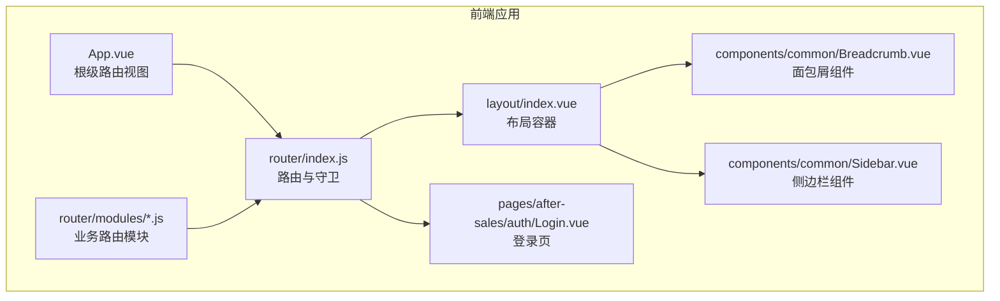
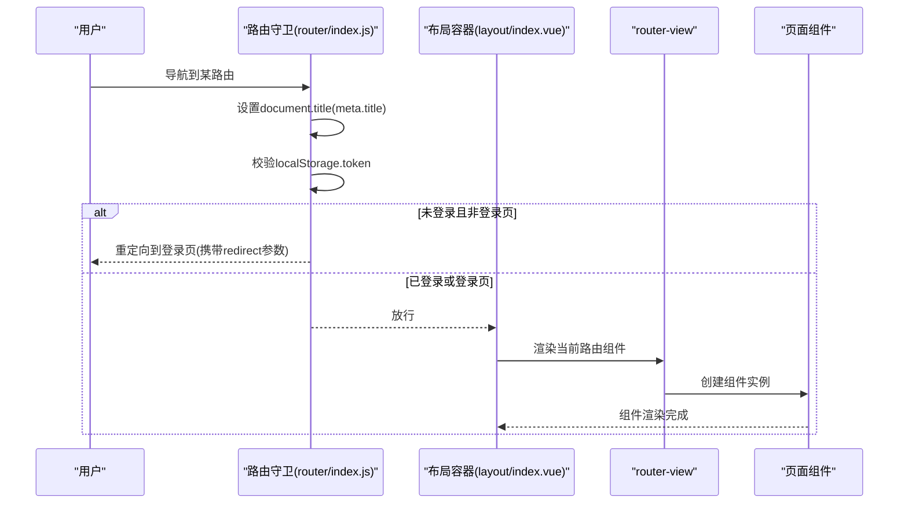
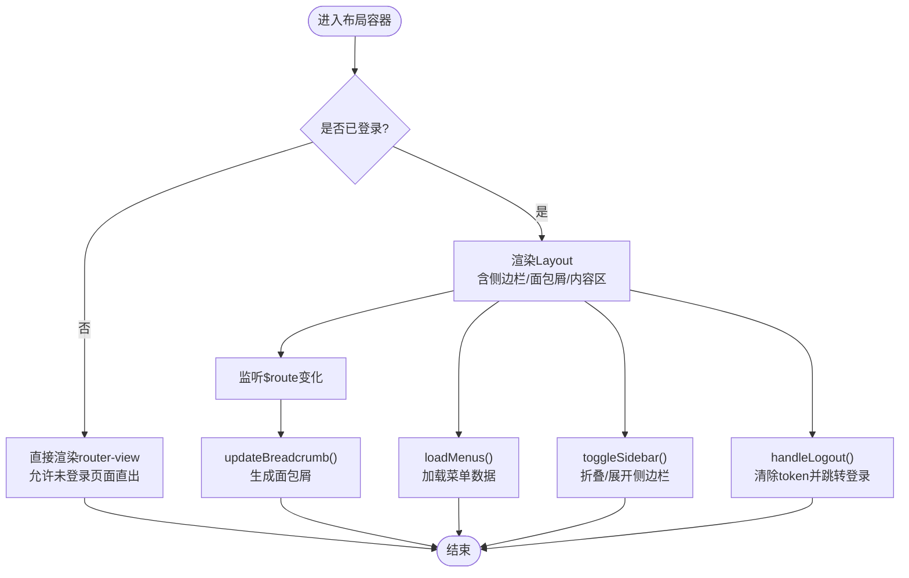
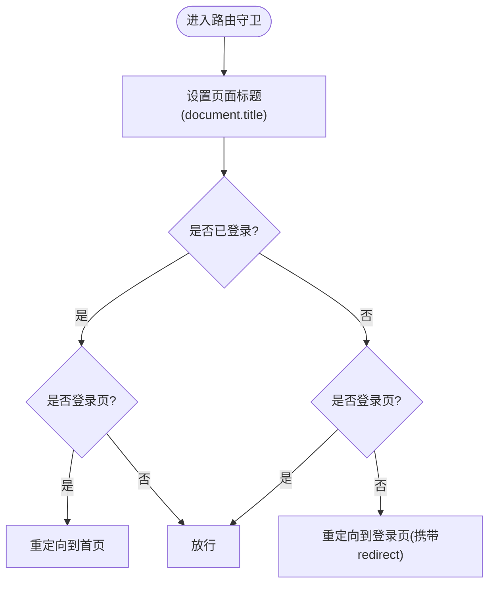
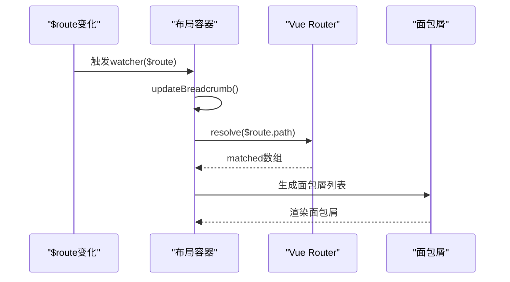
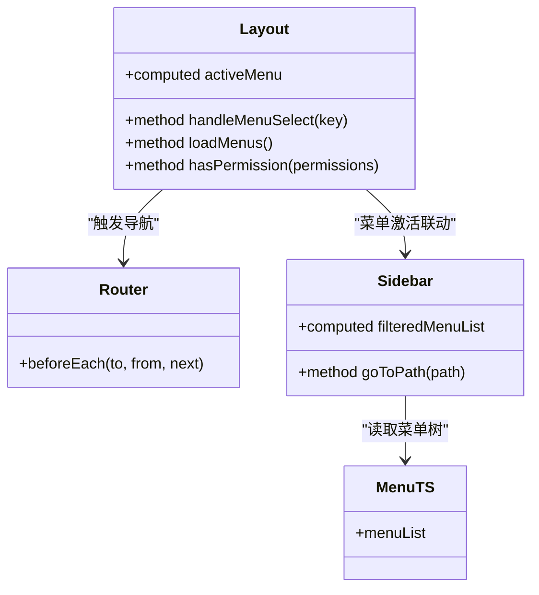
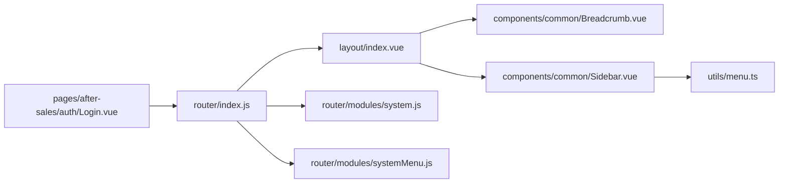

# 布局与路由集成机制

<cite>
**本文引用的文件**
- [layout/index.vue](file://07-frontend/src/layout/index.vue)
- [router/index.js](file://07-frontend/src/router/index.js)
- [App.vue](file://07-frontend/src/App.vue)
- [permission.js](file://07-frontend/src/permission.js)
- [router/modules/system.js](file://07-frontend/src/router/modules/system.js)
- [router/modules/systemMenu.js](file://07-frontend/src/router/modules/systemMenu.js)
- [utils/menu.ts](file://07-frontend/src/utils/menu.ts)
- [components/common/Breadcrumb.vue](file://07-frontend/src/components/common/Breadcrumb.vue)
- [components/common/Sidebar.vue](file://07-frontend/src/components/common/Sidebar.vue)
- [pages/after-sales/auth/Login.vue](file://07-frontend/src/pages/after-sales/auth/Login.vue)
</cite>

## 目录
1. [引言](#引言)
2. [项目结构](#项目结构)
3. [核心组件](#核心组件)
4. [架构总览](#架构总览)
5. [详细组件分析](#详细组件分析)
6. [依赖关系分析](#依赖关系分析)
7. [性能考量](#性能考量)
8. [故障排查指南](#故障排查指南)
9. [结论](#结论)

## 引言
本文件聚焦于前端布局容器与 Vue Router 的集成实现，围绕以下目标展开：
- 通过 router-view 实现“路由驱动”的内容渲染；
- 路由变化时布局状态的同步机制（菜单激活项、面包屑导航）；
- 路由守卫在布局渲染前的身份验证处理流程；
- 未登录状态下直接渲染路由内容的特殊处理逻辑；
- 路由元信息（meta）在布局配置中的应用（标题设置、权限控制等）。

## 项目结构
- 布局容器位于 layout/index.vue，负责整体页面骨架、侧边菜单、顶部导航、面包屑与内容区渲染；
- 路由定义集中在 router/index.js，并按业务模块拆分至 modules 目录；
- 路由守卫统一在 router/index.js 中实现，负责页面标题设置与登录校验；
- 面包屑组件与侧边栏组件分别提供独立的面包屑与菜单能力；
- 登录页用于演示未登录时的路由渲染与登录成功后的重定向。

图表来源
- [App.vue](file://07-frontend/src/App.vue#L1-L16)
- [layout/index.vue](file://07-frontend/src/layout/index.vue#L1-L122)
- [router/index.js](file://07-frontend/src/router/index.js#L1-L228)
- [router/modules/system.js](file://07-frontend/src/router/modules/system.js#L1-L397)
- [components/common/Breadcrumb.vue](file://07-frontend/src/components/common/Breadcrumb.vue#L1-L70)
- [components/common/Sidebar.vue](file://07-frontend/src/components/common/Sidebar.vue#L1-L136)
- [pages/after-sales/auth/Login.vue](file://07-frontend/src/pages/after-sales/auth/Login.vue#L1-L230)

章节来源
- [App.vue](file://07-frontend/src/App.vue#L1-L16)
- [router/index.js](file://07-frontend/src/router/index.js#L1-L228)

## 核心组件
- 布局容器（layout/index.vue）
  - 通过 v-if/v-else 控制“已登录”与“未登录”两种渲染分支；
  - 使用 router-view + <component :is="Component"> 实现路由驱动的内容渲染；
  - 监听 $route 与 isLoggedIn，同步面包屑与菜单；
  - 提供面包屑生成、菜单搜索、权限判断、登出等能力。
- 路由与守卫（router/index.js）
  - 统一设置页面标题（基于 meta.title）；
  - 前置守卫实现登录校验与重定向；
  - 将 Layout 作为多处业务路由的父级容器，形成“布局嵌套”。
- 面包屑组件（components/common/Breadcrumb.vue）
  - 基于 route.matched 生成面包屑，利用 meta.title 与可选 icon；
  - 与布局容器的面包屑逻辑互补。
- 侧边栏组件（components/common/Sidebar.vue）
  - 基于 utils/menu.ts 的菜单树渲染，支持权限过滤与图标解析；
  - 与布局容器的菜单逻辑互补。
- 登录页（pages/after-sales/auth/Login.vue）
  - 模拟登录成功后写入本地存储并重定向；
  - 展示未登录时直接渲染路由内容的场景。

章节来源
- [layout/index.vue](file://07-frontend/src/layout/index.vue#L1-L122)
- [router/index.js](file://07-frontend/src/router/index.js#L1-L228)
- [components/common/Breadcrumb.vue](file://07-frontend/src/components/common/Breadcrumb.vue#L1-L70)
- [components/common/Sidebar.vue](file://07-frontend/src/components/common/Sidebar.vue#L1-L136)
- [pages/after-sales/auth/Login.vue](file://07-frontend/src/pages/after-sales/auth/Login.vue#L1-L230)

## 架构总览
布局容器与路由的集成遵循“布局嵌套 + 路由守卫 + 内容渲染”的模式：
- 路由守卫在进入任何路由前执行，设置页面标题并进行身份校验；
- 布局容器根据登录状态决定渲染路径：已登录走 Layout，未登录直连具体页面（如登录页）；
- Layout 内部通过 router-view + 过渡动画渲染当前路由组件；
- 路由变化触发布局内的面包屑与菜单状态同步。

图表来源
- [router/index.js](file://07-frontend/src/router/index.js#L199-L226)
- [layout/index.vue](file://07-frontend/src/layout/index.vue#L103-L120)

## 详细组件分析

### 布局容器与 router-view 集成
- 分支渲染
  - 已登录：渲染 Layout，内部包含侧边菜单、顶部导航与主内容区；
  - 未登录：直接渲染 router-view，允许登录页等无需权限的页面直出。
- 路由驱动渲染
  - 使用 v-slot="{ Component }" 与 <component :is="Component"> 结合过渡动画实现平滑切换；
  - 保证无论登录与否，均通过同一入口渲染当前路由组件。
- 路由变化同步
  - 监听 $route，在每次路由变化时调用 updateBreadcrumb 同步面包屑；
  - 监听 isLoggedIn，在登录状态变化时重新加载菜单数据。

图表来源
- [layout/index.vue](file://07-frontend/src/layout/index.vue#L1-L122)
- [layout/index.vue](file://07-frontend/src/layout/index.vue#L175-L210)
- [layout/index.vue](file://07-frontend/src/layout/index.vue#L366-L417)

章节来源
- [layout/index.vue](file://07-frontend/src/layout/index.vue#L1-L122)
- [layout/index.vue](file://07-frontend/src/layout/index.vue#L175-L210)
- [layout/index.vue](file://07-frontend/src/layout/index.vue#L366-L417)

### 路由守卫与身份验证
- 页面标题设置
  - 基于 to.meta.title 动态设置 document.title，若无 meta.title 则使用默认标题。
- 登录校验与重定向
  - 若目标路由为登录页：已登录则重定向到首页；未登录则放行；
  - 其他路由：未登录则重定向到登录页并附带 redirect 参数，登录成功后回到原页面。
- 权限扩展
  - permission.js 展示了在守卫中对特定路径进行权限拦截的思路（如审计页面需要特定权限）。

图表来源
- [router/index.js](file://07-frontend/src/router/index.js#L199-L226)
- [permission.js](file://07-frontend/src/permission.js#L1-L13)

章节来源
- [router/index.js](file://07-frontend/src/router/index.js#L199-L226)
- [permission.js](file://07-frontend/src/permission.js#L1-L13)

### 面包屑导航的动态更新
- 布局容器内面包屑
  - updateBreadcrumb 通过 $router.resolve($route.path).matched[0] 获取当前路径对应的路由记录；
  - 遍历路径片段，收集 matched 中带有 meta.title 的路由项，生成面包屑列表。
- 独立面包屑组件
  - Breadcrumb.vue 基于 route.matched 过滤 meta.title，首项固定为“首页”，其余项来自 matched；
  - 与布局容器的面包屑逻辑互补，可按需选择使用。
- 侧边菜单与面包屑联动
  - 侧边菜单的 activeMenu 由 $route.path 决定，配合 el-menu 的 default-active 实现高亮；
  - 菜单项点击后通过 $router.push(key) 触发路由变化，进而触发面包屑更新。

图表来源
- [layout/index.vue](file://07-frontend/src/layout/index.vue#L175-L182)
- [layout/index.vue](file://07-frontend/src/layout/index.vue#L366-L384)
- [components/common/Breadcrumb.vue](file://07-frontend/src/components/common/Breadcrumb.vue#L1-L70)

章节来源
- [layout/index.vue](file://07-frontend/src/layout/index.vue#L175-L182)
- [layout/index.vue](file://07-frontend/src/layout/index.vue#L366-L384)
- [components/common/Breadcrumb.vue](file://07-frontend/src/components/common/Breadcrumb.vue#L1-L70)

### 菜单激活项与权限控制
- 菜单激活项
  - activeMenu 计算属性返回当前路由路径，用于 el-menu 的 default-active；
  - 侧边栏菜单项点击后通过 handleMenuSelect 调用 $router.push(key) 触发路由跳转。
- 权限控制
  - hasPermission 用于判断菜单项的权限，当前简化为返回 true；
  - utils/menu.ts 提供静态菜单树，配合 Sidebar.vue 的权限过滤逻辑；
  - 路由模块（如 system.js、systemMenu.js）在 meta 中声明权限标识，便于后续接入真实权限体系。

图表来源
- [layout/index.vue](file://07-frontend/src/layout/index.vue#L147-L150)
- [layout/index.vue](file://07-frontend/src/layout/index.vue#L205-L209)
- [layout/index.vue](file://07-frontend/src/layout/index.vue#L386-L391)
- [router/index.js](file://07-frontend/src/router/index.js#L199-L226)
- [components/common/Sidebar.vue](file://07-frontend/src/components/common/Sidebar.vue#L66-L88)
- [utils/menu.ts](file://07-frontend/src/utils/menu.ts#L1-L84)

章节来源
- [layout/index.vue](file://07-frontend/src/layout/index.vue#L147-L150)
- [layout/index.vue](file://07-frontend/src/layout/index.vue#L205-L209)
- [layout/index.vue](file://07-frontend/src/layout/index.vue#L386-L391)
- [components/common/Sidebar.vue](file://07-frontend/src/components/common/Sidebar.vue#L66-L88)
- [utils/menu.ts](file://07-frontend/src/utils/menu.ts#L1-L84)

### 路由元信息（meta）的应用
- 标题设置
  - 路由守卫根据 to.meta.title 设置页面标题；
  - 路由模块中大量使用 meta.title 与 meta.icon，用于菜单与面包屑展示。
- 权限控制
  - 路由模块在 meta 中声明 permission 或 permissions 字段；
  - 布局容器与侧边栏组件均可据此进行权限过滤与禁用；
  - permission.js 展示了在守卫中对特定路径进行权限拦截的扩展思路。
- 隐藏与图标
  - 路由模块中存在 hidden 字段，用于控制菜单是否显示；
  - meta.icon 用于菜单与面包屑的图标展示。

章节来源
- [router/index.js](file://07-frontend/src/router/index.js#L199-L226)
- [router/modules/system.js](file://07-frontend/src/router/modules/system.js#L1-L397)
- [router/modules/systemMenu.js](file://07-frontend/src/router/modules/systemMenu.js#L1-L56)
- [permission.js](file://07-frontend/src/permission.js#L1-L13)

### 未登录状态下直接渲染路由内容的特殊处理
- 布局容器在未登录时，直接渲染 router-view 并应用过渡动画；
- 登录页（pages/after-sales/auth/Login.vue）通过模拟登录成功后写入 token 与用户信息，并根据 redirect 参数重定向；
- 路由守卫在登录页命中时，若已登录则重定向到首页，避免重复登录。

章节来源
- [layout/index.vue](file://07-frontend/src/layout/index.vue#L113-L121)
- [pages/after-sales/auth/Login.vue](file://07-frontend/src/pages/after-sales/auth/Login.vue#L97-L119)
- [router/index.js](file://07-frontend/src/router/index.js#L208-L216)

## 依赖关系分析
- 布局容器依赖
  - Vue Router（$route、$router、$router.resolve）；
  - Element Plus（el-menu、el-breadcrumb、el-dropdown 等）；
  - 本地存储（localStorage）用于登录状态与用户信息。
- 路由模块依赖
  - Layout 作为父级容器，承载全局布局；
  - 各业务模块路由（如 system.js、systemMenu.js）复用 meta 标准化配置。
- 组件依赖
  - Breadcrumb.vue 与 Sidebar.vue 可独立使用，也可与布局容器配合；
  - utils/menu.ts 为静态菜单树，Sidebar.vue 可基于此做权限过滤。

图表来源
- [router/index.js](file://07-frontend/src/router/index.js#L1-L228)
- [layout/index.vue](file://07-frontend/src/layout/index.vue#L1-L122)
- [router/modules/system.js](file://07-frontend/src/router/modules/system.js#L1-L397)
- [router/modules/systemMenu.js](file://07-frontend/src/router/modules/systemMenu.js#L1-L56)
- [components/common/Breadcrumb.vue](file://07-frontend/src/components/common/Breadcrumb.vue#L1-L70)
- [components/common/Sidebar.vue](file://07-frontend/src/components/common/Sidebar.vue#L1-L136)
- [utils/menu.ts](file://07-frontend/src/utils/menu.ts#L1-L84)
- [pages/after-sales/auth/Login.vue](file://07-frontend/src/pages/after-sales/auth/Login.vue#L1-L230)

章节来源
- [router/index.js](file://07-frontend/src/router/index.js#L1-L228)
- [layout/index.vue](file://07-frontend/src/layout/index.vue#L1-L122)

## 性能考量
- 路由切换动画
  - 使用过渡组件实现 out-in 切换，减少视觉抖动；
  - 建议在复杂页面中启用 keep-alive 缓存以提升体验（当前布局未显式使用）。
- 菜单与面包屑计算
  - updateBreadcrumb 对路径进行逐段解析，建议在深层嵌套路由时关注性能；
  - 可考虑缓存 matched 结果或限制面包屑层级深度。
- 登录状态检测
  - 通过 localStorage 快速判断登录状态，避免频繁网络请求；
  - 建议在守卫中加入 token 有效性校验（当前简化为存在性判断）。

## 故障排查指南
- 页面标题未更新
  - 检查目标路由是否设置 meta.title；
  - 确认路由守卫是否执行。
- 未登录仍无法访问登录页
  - 检查登录页路由配置与守卫逻辑；
  - 确认已登录时是否被重定向到首页。
- 面包屑不显示或不正确
  - 检查路由是否设置 meta.title；
  - 确认 updateBreadcrumb 的路径解析逻辑是否覆盖到当前路由。
- 菜单不显示或不可点
  - 检查 hasPermission 返回值与 meta.permissions；
  - 确认 utils/menu.ts 与 Sidebar.vue 的权限过滤逻辑是否生效。
- 登录后未回到原页面
  - 检查登录页是否正确读取 redirect 查询参数并跳转。

章节来源
- [router/index.js](file://07-frontend/src/router/index.js#L199-L226)
- [layout/index.vue](file://07-frontend/src/layout/index.vue#L366-L384)
- [pages/after-sales/auth/Login.vue](file://07-frontend/src/pages/after-sales/auth/Login.vue#L97-L119)

## 结论
本项目通过“布局嵌套 + 路由守卫 + router-view”的组合，实现了：
- 路由驱动的内容渲染与平滑切换；
- 登录状态与路由状态的同步（菜单激活、面包屑更新）；
- 路由守卫在布局渲染前完成身份验证与标题设置；
- 未登录状态下直接渲染路由内容的灵活处理；
- 路由元信息（meta）在标题、权限、图标、隐藏等多方面的标准化应用。

建议后续增强方向：
- 在布局容器中引入 keep-alive 缓存；
- 在守卫中完善 token 校验与权限拦截；
- 将 hasPermission 与 utils/menu.ts 的权限过滤逻辑整合到路由模块，统一权限来源；
- 在面包屑生成中增加对 matched 数组的边界保护与层级限制。