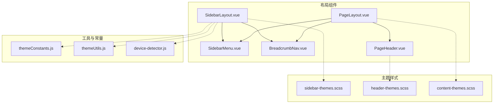
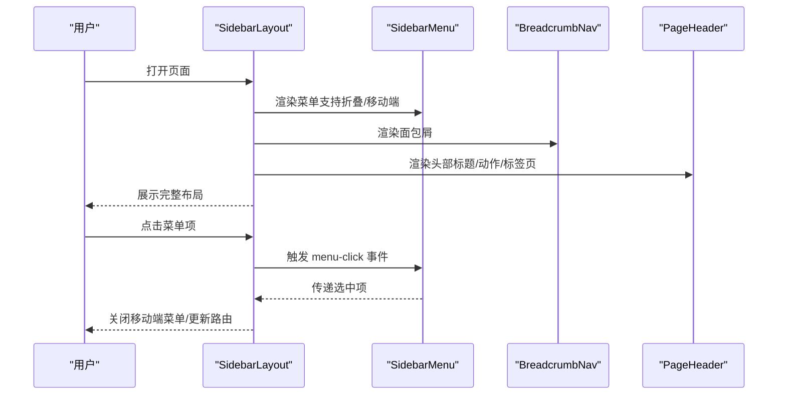
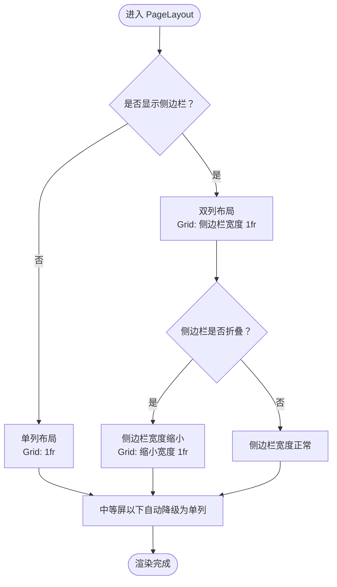
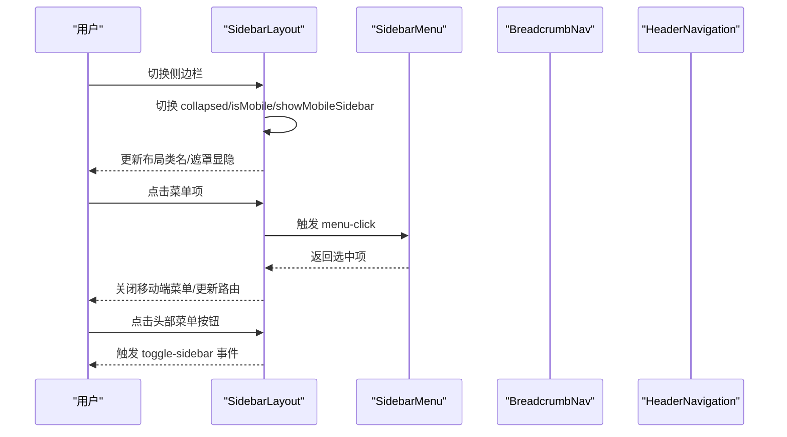
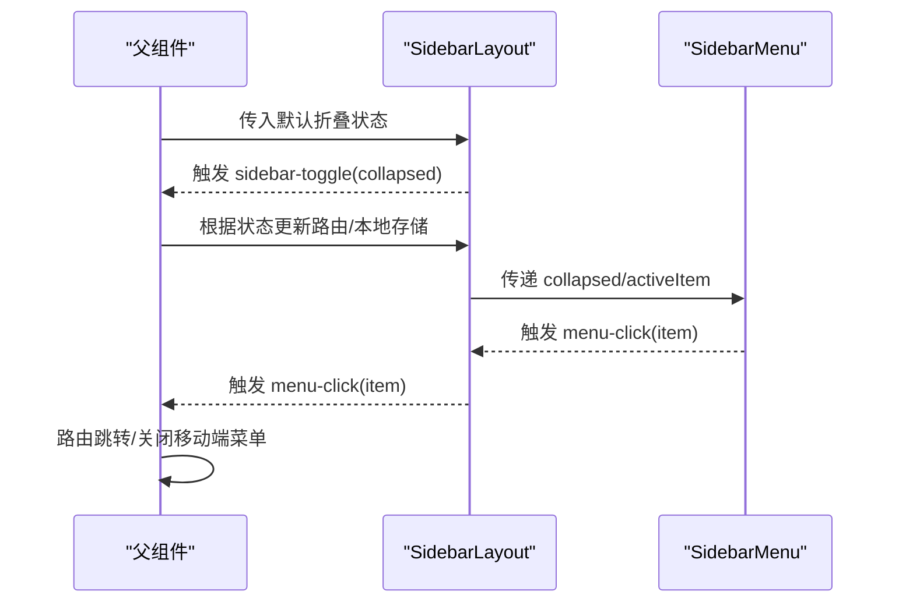
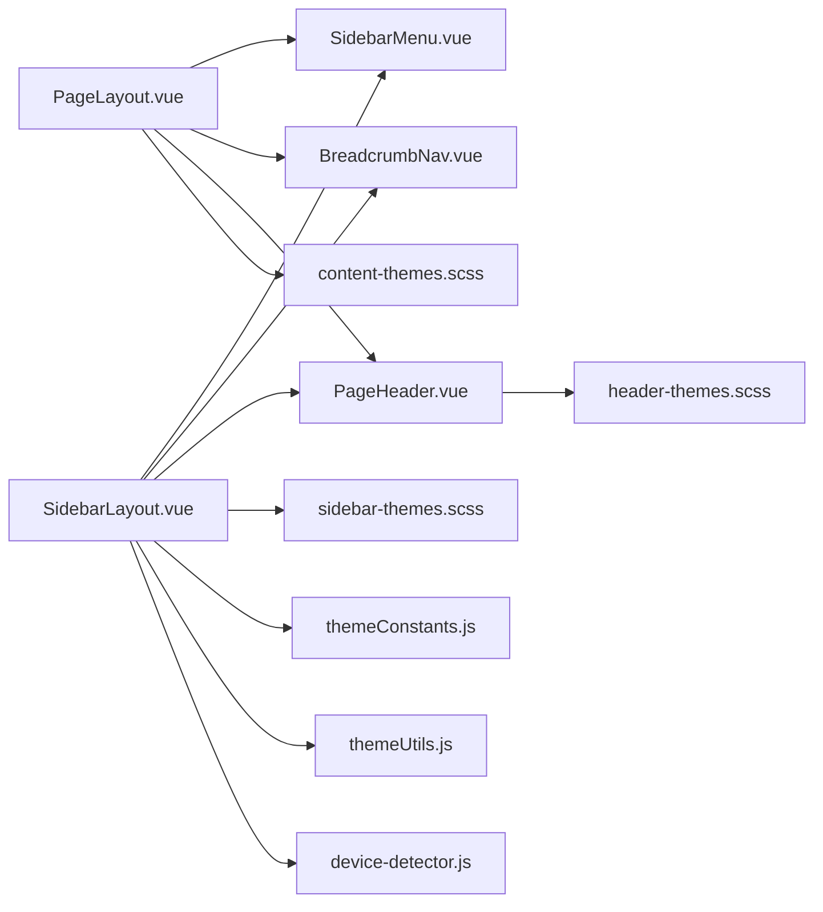

# 页面布局组件

<cite>
**本文引用的文件**
- [PageLayout.vue](file://07-frontend/src/components/common/layout/PageLayout.vue)
- [SidebarLayout.vue](file://07-frontend/src/components/common/layout/SidebarLayout.vue)
- [SidebarMenu.vue](file://07-frontend/src/components/common/layout/SidebarMenu.vue)
- [BreadcrumbNav.vue](file://07-frontend/src/components/common/layout/BreadcrumbNav.vue)
- [PageHeader.vue](file://07-frontend/src/components/common/layout/PageHeader.vue)
- [sidebar-themes.scss](file://07-frontend/src/assets/styles/layout/sidebar-themes.scss)
- [header-themes.scss](file://07-frontend/src/assets/styles/layout/header-themes.scss)
- [content-themes.scss](file://07-frontend/src/assets/styles/layout/content-themes.scss)
- [themeConstants.js](file://07-frontend/src/components/theme/constants/themeConstants.js)
- [themeUtils.js](file://07-frontend/src/components/theme/utils/themeUtils.js)
- [device-detector.js](file://07-frontend/src/utils/device-detector.js)
</cite>

## 目录
1. [引言](#引言)
2. [项目结构](#项目结构)
3. [核心组件](#核心组件)
4. [架构总览](#架构总览)
5. [详细组件分析](#详细组件分析)
6. [依赖关系分析](#依赖关系分析)
7. [性能考量](#性能考量)
8. [故障排查指南](#故障排查指南)
9. [结论](#结论)
10. [附录](#附录)

## 引言
本文件系统性介绍通用页面布局组件的设计与使用，重点覆盖：
- PageLayout 与 SidebarLayout 的差异化应用场景与职责边界
- 布局变体（default/fluid/compact/wide）的实现原理与 CSS 网格布局应用
- 响应式设计策略与断点适配
- 插槽（slot）机制如何定制化布局内容
- 布局状态（如侧边栏折叠）的父子组件通信实现

## 项目结构
页面布局相关的核心文件位于前端源码的通用布局组件目录中，并配套主题样式与工具类以支撑响应式与主题切换。

图表来源
- [PageLayout.vue](file://07-frontend/src/components/common/layout/PageLayout.vue#L1-L194)
- [SidebarLayout.vue](file://07-frontend/src/components/common/layout/SidebarLayout.vue#L1-L457)
- [SidebarMenu.vue](file://07-frontend/src/components/common/layout/SidebarMenu.vue#L1-L817)
- [BreadcrumbNav.vue](file://07-frontend/src/components/common/layout/BreadcrumbNav.vue#L1-L732)
- [PageHeader.vue](file://07-frontend/src/components/common/layout/PageHeader.vue#L1-L1174)
- [sidebar-themes.scss](file://07-frontend/src/assets/styles/layout/sidebar-themes.scss#L1-L458)
- [header-themes.scss](file://07-frontend/src/assets/styles/layout/header-themes.scss#L1-L653)
- [content-themes.scss](file://07-frontend/src/assets/styles/layout/content-themes.scss#L1-L419)
- [themeConstants.js](file://07-frontend/src/components/theme/constants/themeConstants.js#L57-L127)
- [themeUtils.js](file://07-frontend/src/components/theme/utils/themeUtils.js#L282-L355)
- [device-detector.js](file://07-frontend/src/utils/device-detector.js#L168-L546)

章节来源
- [PageLayout.vue](file://07-frontend/src/components/common/layout/PageLayout.vue#L1-L194)
- [SidebarLayout.vue](file://07-frontend/src/components/common/layout/SidebarLayout.vue#L1-L457)

## 核心组件
- PageLayout：提供“内容卡片 + 可选侧边栏”的两列布局，支持多种布局变体；适合在已有侧边栏或面包屑场景下快速搭建页面主体。
- SidebarLayout：提供完整的侧边栏 + 头部导航 + 面包屑 + 主内容区的全屏布局，支持折叠、移动端遮罩、左右位置切换等高级特性；适合后台管理类页面的整体框架。

章节来源
- [PageLayout.vue](file://07-frontend/src/components/common/layout/PageLayout.vue#L1-L194)
- [SidebarLayout.vue](file://07-frontend/src/components/common/layout/SidebarLayout.vue#L1-L457)

## 架构总览
PageLayout 与 SidebarLayout 在职责上互补：
- PageLayout 更轻量，聚焦“内容区域 + 可选侧边栏”，适合在现有页面中局部增强布局。
- SidebarLayout 提供完整框架，包含侧边栏、头部导航、面包屑、主内容区与移动端交互，适合作为整页骨架。

二者均通过插槽机制开放高度可定制化能力，并通过响应式断点与主题样式实现跨设备一致体验。

图表来源
- [SidebarLayout.vue](file://07-frontend/src/components/common/layout/SidebarLayout.vue#L1-L235)
- [SidebarMenu.vue](file://07-frontend/src/components/common/layout/SidebarMenu.vue#L1-L405)
- [BreadcrumbNav.vue](file://07-frontend/src/components/common/layout/BreadcrumbNav.vue#L1-L337)
- [PageHeader.vue](file://07-frontend/src/components/common/layout/PageHeader.vue#L1-L382)

## 详细组件分析

### PageLayout 组件
- 设计要点
  - 通过 props 控制是否显示头部、侧边栏、面包屑，以及侧边栏折叠状态。
  - 通过 layoutVariant 实现布局变体：default/fluid/compact/wide，分别对应不同的最大宽度与外边距。
  - 使用 CSS Grid 实现“侧边栏 + 主内容”双列布局，支持在小屏时自动降级为单列。
- 插槽机制
  - 支持自定义 header/header-actions、sidebar、breadcrumb、默认插槽（页面主体内容）。
- 响应式策略
  - 在中等屏以下自动切换为单列布局，减少侧边栏占用空间；在更小屏下进一步降低内边距与内边距，提升可读性。
- 状态通信
  - 通过 props 接收 sidebarCollapsed 状态，便于父组件控制折叠状态。

图表来源
- [PageLayout.vue](file://07-frontend/src/components/common/layout/PageLayout.vue#L1-L194)

章节来源
- [PageLayout.vue](file://07-frontend/src/components/common/layout/PageLayout.vue#L1-L194)

### SidebarLayout 组件
- 设计要点
  - 完整的侧边栏 + 头部导航 + 面包屑 + 主内容区布局，支持左右位置切换、折叠、移动端遮罩。
  - 通过 props 控制品牌名、菜单项、面包屑项、标题、用户信息、是否显示头部/面包屑等。
- 插槽机制
  - 支持自定义菜单、头部、头部动作、面包屑、侧边栏底部插槽与默认内容插槽。
- 响应式策略
  - 通过响应式检测在移动端隐藏侧边栏并通过遮罩层控制显隐；在小屏下调整内容区内边距与面包屑样式。
- 状态通信
  - 通过 emits 暴露 menu-click 与 sidebar-toggle 事件，父组件可监听并同步状态（如路由跳转、侧边栏折叠状态）。

图表来源
- [SidebarLayout.vue](file://07-frontend/src/components/common/layout/SidebarLayout.vue#L1-L235)
- [SidebarMenu.vue](file://07-frontend/src/components/common/layout/SidebarMenu.vue#L1-L405)
- [BreadcrumbNav.vue](file://07-frontend/src/components/common/layout/BreadcrumbNav.vue#L1-L337)
- [PageHeader.vue](file://07-frontend/src/components/common/layout/PageHeader.vue#L1-L382)

章节来源
- [SidebarLayout.vue](file://07-frontend/src/components/common/layout/SidebarLayout.vue#L1-L457)

### 布局变体与 CSS 网格布局
- PageLayout 的布局变体
  - default：最大宽度 1280px，居中显示
  - fluid：无最大宽度限制
  - compact：最大宽度 1200px
  - wide：最大宽度 1400px
- 网格布局应用
  - 未启用侧边栏时：Grid 单列
  - 启用侧边栏时：Grid 双列，侧边栏固定宽度，主内容自适应
  - 侧边栏折叠时：侧边栏宽度缩小，Gap 与内边距相应调整
- 响应式断点
  - 中等屏以下：双列降为单列，内边距与间距减小
  - 小屏以下：进一步降低内边距与圆角，保证可读性

章节来源
- [PageLayout.vue](file://07-frontend/src/components/common/layout/PageLayout.vue#L93-L194)

### 响应式设计策略
- 断点与检测
  - SidebarLayout 内部通过窗口宽度判断移动端状态，触发侧边栏遮罩与布局切换
  - 主题工具提供断点查询与窗口尺寸变化监听
  - 设备检测器提供更全面的屏幕信息与断点推导
- 样式适配
  - 侧边栏主题与头部主题在小屏下隐藏部分元素或调整布局
  - 内容区域主题在小屏下统一内边距与圆角，提升阅读体验

章节来源
- [SidebarLayout.vue](file://07-frontend/src/components/common/layout/SidebarLayout.vue#L216-L235)
- [themeUtils.js](file://07-frontend/src/components/theme/utils/themeUtils.js#L282-L355)
- [device-detector.js](file://07-frontend/src/utils/device-detector.js#L168-L546)
- [sidebar-themes.scss](file://07-frontend/src/assets/styles/layout/sidebar-themes.scss#L311-L338)
- [header-themes.scss](file://07-frontend/src/assets/styles/layout/header-themes.scss#L514-L563)
- [content-themes.scss](file://07-frontend/src/assets/styles/layout/content-themes.scss#L380-L419)

### 插槽机制与内容定制
- PageLayout
  - header/header-actions：自定义头部与操作区
  - sidebar：自定义侧边栏菜单
  - breadcrumb：自定义面包屑
  - 默认插槽：页面主体内容
- SidebarLayout
  - menu：自定义菜单（默认使用 SidebarMenu）
  - header/headerActions：自定义头部与操作区
  - breadcrumb：自定义面包屑
  - sidebarFooter：侧边栏底部插槽
  - 默认插槽：页面主体内容
- SidebarMenu
  - header/footer：菜单头部与底部插槽
  - 支持分组菜单、徽章、图标、子菜单展开/收起
- BreadcrumbNav
  - 支持自定义后缀与额外信息插槽，移动端溢出时提供展开菜单
- PageHeader
  - description/center/actions/extra：丰富头部内容与操作区

章节来源
- [PageLayout.vue](file://07-frontend/src/components/common/layout/PageLayout.vue#L1-L27)
- [SidebarLayout.vue](file://07-frontend/src/components/common/layout/SidebarLayout.vue#L1-L87)
- [SidebarMenu.vue](file://07-frontend/src/components/common/layout/SidebarMenu.vue#L1-L191)
- [BreadcrumbNav.vue](file://07-frontend/src/components/common/layout/BreadcrumbNav.vue#L1-L140)
- [PageHeader.vue](file://07-frontend/src/components/common/layout/PageHeader.vue#L1-L144)

### 布局状态与父子组件通信
- 侧边栏折叠状态
  - PageLayout：通过 props.sidebarCollapsed 接收折叠状态
  - SidebarLayout：通过 ref 管理 collapsed/isMobile/showMobileSidebar，并通过 emits.sidebar-toggle 通知父组件
- 菜单项点击
  - SidebarMenu 通过 emits.menu-click 传递选中项，SidebarLayout 监听后可执行路由跳转或关闭移动端菜单
- 头部导航与面包屑
  - HeaderNavigation 与 BreadcrumbNav 通过 emits 与路由集成，实现导航联动

图表来源
- [SidebarLayout.vue](file://07-frontend/src/components/common/layout/SidebarLayout.vue#L153-L215)
- [SidebarMenu.vue](file://07-frontend/src/components/common/layout/SidebarMenu.vue#L233-L336)

章节来源
- [SidebarLayout.vue](file://07-frontend/src/components/common/layout/SidebarLayout.vue#L153-L215)
- [SidebarMenu.vue](file://07-frontend/src/components/common/layout/SidebarMenu.vue#L233-L336)

## 依赖关系分析
- 组件耦合
  - PageLayout 与 SidebarLayout 均依赖 SidebarMenu、BreadcrumbNav、PageHeader 等子组件，形成清晰的组合关系
  - SidebarLayout 与 SidebarMenu 之间存在事件通信（menu-click），属于松耦合的发布订阅模式
- 主题与工具
  - 主题常量与工具提供断点与尺寸配置，布局组件通过 props 或响应式检测消费这些配置
- 样式依赖
  - 布局组件通过类名与媒体查询配合主题样式文件实现跨设备一致性

图表来源
- [SidebarLayout.vue](file://07-frontend/src/components/common/layout/SidebarLayout.vue#L1-L457)
- [PageLayout.vue](file://07-frontend/src/components/common/layout/PageLayout.vue#L1-L194)
- [SidebarMenu.vue](file://07-frontend/src/components/common/layout/SidebarMenu.vue#L1-L817)
- [BreadcrumbNav.vue](file://07-frontend/src/components/common/layout/BreadcrumbNav.vue#L1-L732)
- [PageHeader.vue](file://07-frontend/src/components/common/layout/PageHeader.vue#L1-L1174)
- [sidebar-themes.scss](file://07-frontend/src/assets/styles/layout/sidebar-themes.scss#L1-L458)
- [header-themes.scss](file://07-frontend/src/assets/styles/layout/header-themes.scss#L1-L653)
- [content-themes.scss](file://07-frontend/src/assets/styles/layout/content-themes.scss#L1-L419)
- [themeConstants.js](file://07-frontend/src/components/theme/constants/themeConstants.js#L57-L127)
- [themeUtils.js](file://07-frontend/src/components/theme/utils/themeUtils.js#L282-L355)
- [device-detector.js](file://07-frontend/src/utils/device-detector.js#L168-L546)

章节来源
- [SidebarLayout.vue](file://07-frontend/src/components/common/layout/SidebarLayout.vue#L1-L457)
- [PageLayout.vue](file://07-frontend/src/components/common/layout/PageLayout.vue#L1-L194)

## 性能考量
- 布局切换与动画
  - 侧边栏与内容区的过渡采用缓动曲线与较短持续时间，避免大范围重排
  - 折叠状态下仅改变宽度，不改变布局网格，减少重绘
- 响应式监听
  - SidebarLayout 在挂载时注册窗口 resize 监听，卸载时移除，避免内存泄漏
- 样式优化
  - 使用媒体查询按需隐藏/调整元素，减少移动端复杂布局
  - 主题样式通过变量与渐变背景减少重复计算

章节来源
- [SidebarLayout.vue](file://07-frontend/src/components/common/layout/SidebarLayout.vue#L223-L235)
- [PageLayout.vue](file://07-frontend/src/components/common/layout/PageLayout.vue#L120-L194)
- [sidebar-themes.scss](file://07-frontend/src/assets/styles/layout/sidebar-themes.scss#L311-L338)
- [header-themes.scss](file://07-frontend/src/assets/styles/layout/header-themes.scss#L514-L563)

## 故障排查指南
- 侧边栏无法折叠或遮罩不生效
  - 检查是否在移动端模式下，SidebarLayout 会优先使用移动端遮罩逻辑
  - 确认 sidebar-toggle 事件是否正确监听并更新父组件状态
- 面包屑溢出或移动端不可见
  - BreadcrumbNav 提供移动端展开菜单，确认容器宽度与溢出检测逻辑
- 布局变体无效
  - 确认 layoutVariant 是否正确传入（default/fluid/compact/wide）
  - 检查 CSS Grid 条件类名是否生效（是否有侧边栏）
- 响应式断点异常
  - 检查窗口尺寸变化监听是否注册成功
  - 若使用主题工具断点，请确认断点映射与设备检测器的一致性

章节来源
- [SidebarLayout.vue](file://07-frontend/src/components/common/layout/SidebarLayout.vue#L195-L235)
- [BreadcrumbNav.vue](file://07-frontend/src/components/common/layout/BreadcrumbNav.vue#L268-L337)
- [PageLayout.vue](file://07-frontend/src/components/common/layout/PageLayout.vue#L70-L91)
- [themeUtils.js](file://07-frontend/src/components/theme/utils/themeUtils.js#L282-L355)
- [device-detector.js](file://07-frontend/src/utils/device-detector.js#L168-L546)

## 结论
- PageLayout 适合在已有页面中快速引入“内容卡片 + 可选侧边栏”的布局，强调灵活性与轻量化
- SidebarLayout 适合构建后台管理类整页骨架，提供完整的侧边栏、头部导航、面包屑与移动端交互
- 通过插槽机制与主题样式，布局组件具备良好的可扩展性与跨设备一致性
- 建议在大型项目中统一使用 SidebarLayout 作为整页骨架，PageLayout 用于局部页面增强

## 附录
- 布局变体对照
  - default：最大宽度 1280px
  - fluid：无最大宽度
  - compact：最大宽度 1200px
  - wide：最大宽度 1400px
- 断点参考
  - 中等屏以下：双列降为单列
  - 小屏以下：降低内边距与圆角
- 主题常量与工具
  - 布局位置、内容宽度、头部样式、导航模式等常量
  - 断点查询、窗口尺寸监听、设备检测

章节来源
- [PageLayout.vue](file://07-frontend/src/components/common/layout/PageLayout.vue#L93-L194)
- [themeConstants.js](file://07-frontend/src/components/theme/constants/themeConstants.js#L57-L127)
- [themeUtils.js](file://07-frontend/src/components/theme/utils/themeUtils.js#L282-L355)
- [device-detector.js](file://07-frontend/src/utils/device-detector.js#L168-L546)