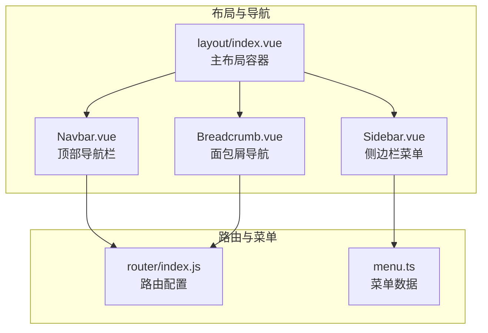
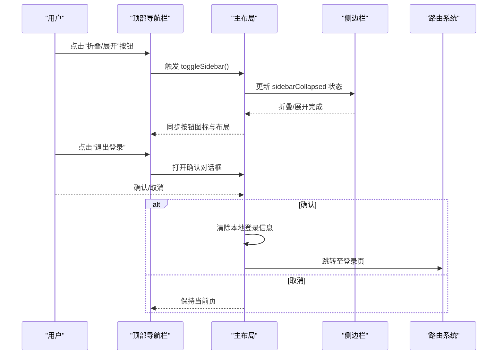
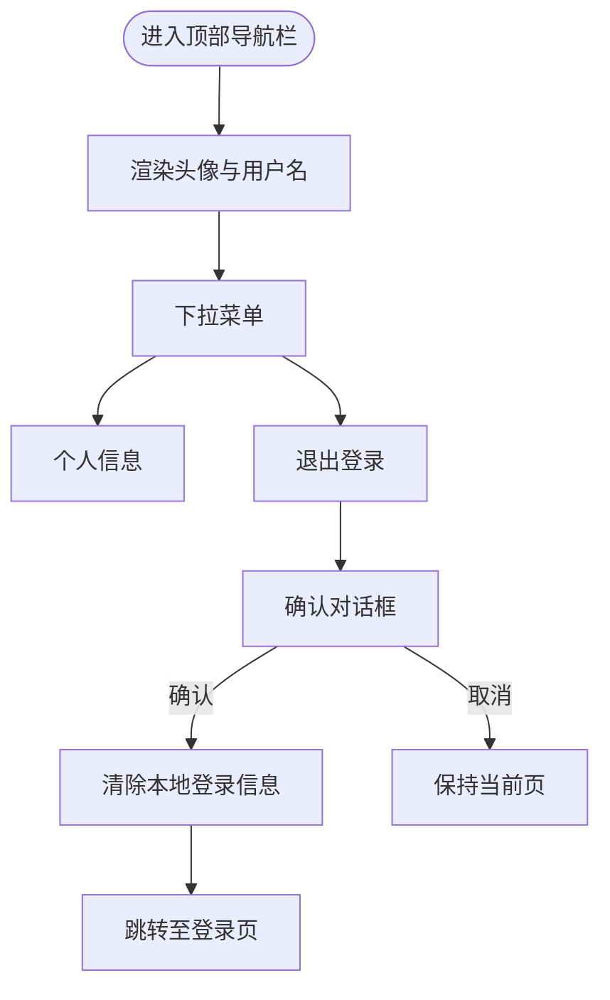
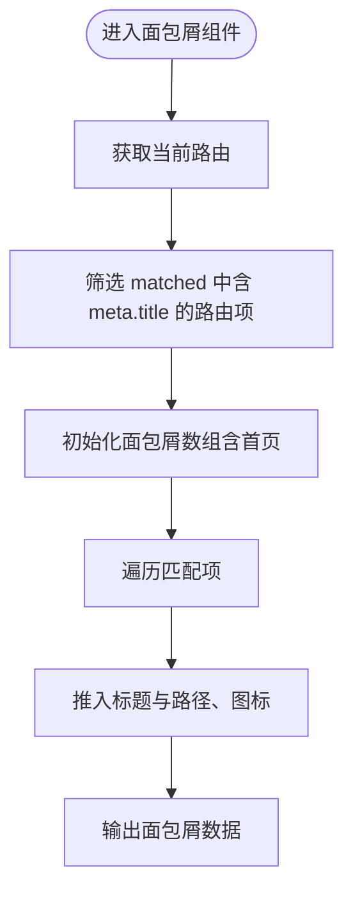
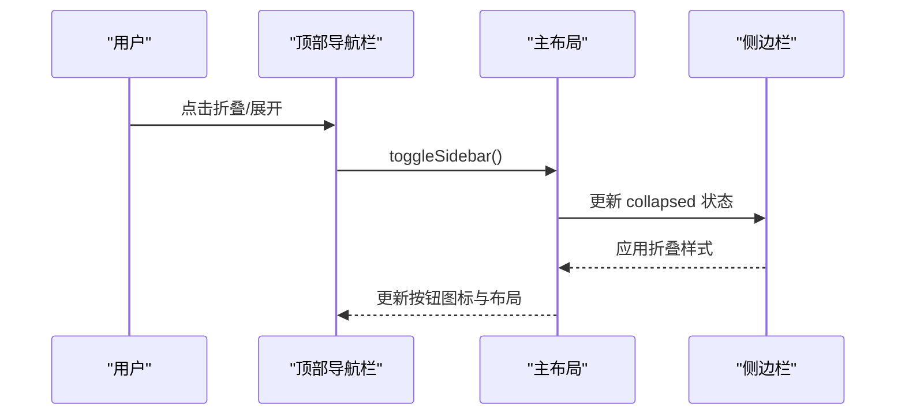
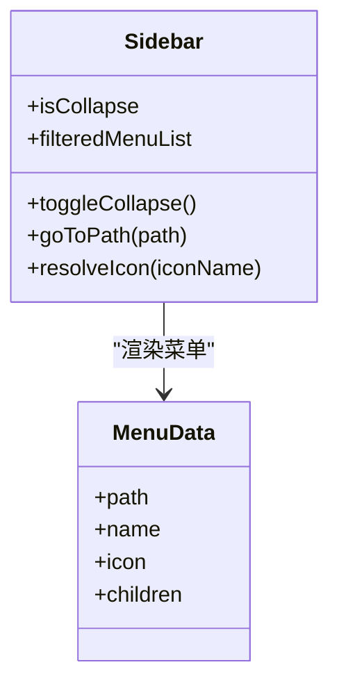
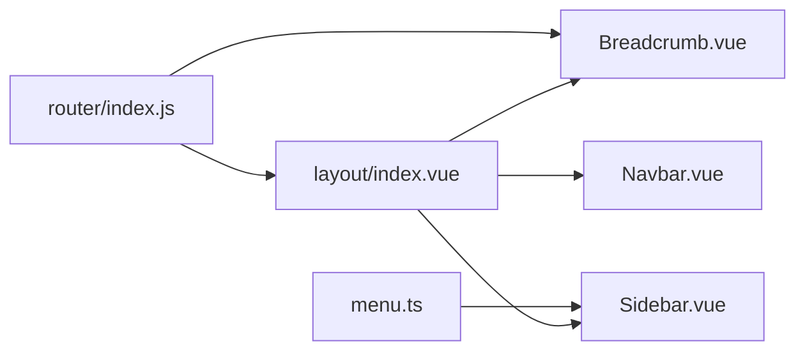

# 顶部导航栏

<cite>
**本文引用的文件**
- [layout/index.vue](file://07-frontend/src/layout/index.vue)
- [Navbar.vue](file://07-frontend/src/components/common/Navbar.vue)
- [Breadcrumb.vue](file://07-frontend/src/components/common/Breadcrumb.vue)
- [Sidebar.vue](file://07-frontend/src/components/common/Sidebar.vue)
- [router/index.js](file://07-frontend/src/router/index.js)
- [menu.ts](file://07-frontend/src/utils/menu.ts)
- [SidebarLayout.vue](file://07-frontend/src/components/common/layout/SidebarLayout.vue)
</cite>

## 目录
1. [简介](#简介)
2. [项目结构](#项目结构)
3. [核心组件](#核心组件)
4. [架构总览](#架构总览)
5. [详细组件分析](#详细组件分析)
6. [依赖关系分析](#依赖关系分析)
7. [性能考量](#性能考量)
8. [故障排查指南](#故障排查指南)
9. [结论](#结论)

## 简介
本章节聚焦于顶部导航栏的功能实现，涵盖以下方面：
- 用户信息展示：头像与用户名渲染
- 下拉菜单交互：个人信息与退出登录入口
- 面包屑导航生成逻辑：基于路由元信息的动态层级生成
- 顶部导航栏与侧边栏的联动机制：折叠按钮同步控制
- 退出登录确认对话框的实现方式与流程

## 项目结构
顶部导航栏位于主布局组件中，配合路由元信息与菜单配置，实现完整的导航体验。面包屑组件采用基于路由匹配的动态生成策略；侧边栏提供菜单导航与折叠控制；顶部导航栏中的用户下拉菜单提供用户信息与退出登录能力。

图表来源
- [layout/index.vue](file://07-frontend/src/layout/index.vue#L1-L120)
- [Navbar.vue](file://07-frontend/src/components/common/Navbar.vue#L1-L41)
- [Breadcrumb.vue](file://07-frontend/src/components/common/Breadcrumb.vue#L1-L44)
- [Sidebar.vue](file://07-frontend/src/components/common/Sidebar.vue#L1-L45)
- [router/index.js](file://07-frontend/src/router/index.js#L1-L60)
- [menu.ts](file://07-frontend/src/utils/menu.ts#L1-L40)

章节来源
- [layout/index.vue](file://07-frontend/src/layout/index.vue#L1-L120)
- [router/index.js](file://07-frontend/src/router/index.js#L1-L60)

## 核心组件
- 顶部导航栏（layout/index.vue 中的 header 区域）：包含侧边栏折叠按钮、面包屑容器、用户下拉菜单（头像、用户名、下拉项）。
- 面包屑导航（Breadcrumb.vue）：基于当前路由的 matched 元信息动态生成层级。
- 侧边栏（Sidebar.vue）：菜单渲染、折叠控制、图标解析、权限过滤。
- 顶部导航栏（Navbar.vue）：水平菜单、用户下拉、退出登录跳转。
- 路由与菜单（router/index.js、menu.ts）：提供面包屑标题与图标来源、菜单树结构。

章节来源
- [layout/index.vue](file://07-frontend/src/layout/index.vue#L66-L100)
- [Breadcrumb.vue](file://07-frontend/src/components/common/Breadcrumb.vue#L16-L44)
- [Sidebar.vue](file://07-frontend/src/components/common/Sidebar.vue#L1-L45)
- [Navbar.vue](file://07-frontend/src/components/common/Navbar.vue#L1-L41)
- [router/index.js](file://07-frontend/src/router/index.js#L1-L60)
- [menu.ts](file://07-frontend/src/utils/menu.ts#L1-L40)

## 架构总览
顶部导航栏与面包屑、侧边栏协同工作，形成统一的导航体系。路由元信息驱动面包屑标题与图标，侧边栏菜单与路由路径一一对应，顶部导航栏的折叠按钮与侧边栏状态保持一致。

图表来源
- [layout/index.vue](file://07-frontend/src/layout/index.vue#L195-L210)
- [layout/index.vue](file://07-frontend/src/layout/index.vue#L398-L417)

## 详细组件分析

### 顶部导航栏与用户信息展示
- 头像与用户名渲染：顶部导航栏使用头像组件与用户名文本展示当前用户信息，用户名来源于本地存储的用户信息对象。
- 用户下拉菜单：包含“个人信息”和“退出登录”两个入口，其中“退出登录”触发确认对话框。

图表来源
- [layout/index.vue](file://07-frontend/src/layout/index.vue#L66-L100)
- [layout/index.vue](file://07-frontend/src/layout/index.vue#L398-L417)

章节来源
- [layout/index.vue](file://07-frontend/src/layout/index.vue#L66-L100)
- [layout/index.vue](file://07-frontend/src/layout/index.vue#L398-L417)

### 面包屑导航生成逻辑
- 动态构建算法：面包屑组件基于当前路由的 matched 数组，筛选出具有元信息的路由项，首项固定为“首页”，后续项按匹配顺序追加。
- 元信息来源：路由配置中的 meta.title 与 meta.icon 决定面包屑项的标题与图标。
- 路由守卫：路由切换时，主布局监听路由变化，更新面包屑列表。

图表来源
- [Breadcrumb.vue](file://07-frontend/src/components/common/Breadcrumb.vue#L26-L44)
- [router/index.js](file://07-frontend/src/router/index.js#L1-L60)
- [layout/index.vue](file://07-frontend/src/layout/index.vue#L175-L193)

章节来源
- [Breadcrumb.vue](file://07-frontend/src/components/common/Breadcrumb.vue#L26-L44)
- [router/index.js](file://07-frontend/src/router/index.js#L1-L60)
- [layout/index.vue](file://07-frontend/src/layout/index.vue#L175-L193)

### 顶部导航栏与侧边栏联动机制
- 折叠按钮同步：顶部导航栏的折叠按钮与侧边栏状态保持一致，点击后通过主布局的数据双向控制侧边栏宽度与布局。
- 布局样式：侧边栏折叠时，主内容区的外边距相应调整，保证视觉一致性。

图表来源
- [layout/index.vue](file://07-frontend/src/layout/index.vue#L195-L210)
- [layout/index.vue](file://07-frontend/src/layout/index.vue#L539-L541)

章节来源
- [layout/index.vue](file://07-frontend/src/layout/index.vue#L195-L210)
- [layout/index.vue](file://07-frontend/src/layout/index.vue#L539-L541)

### 侧边栏菜单与图标解析
- 菜单渲染：侧边栏根据菜单数据渲染一级与二级菜单，支持图标组件解析与权限过滤。
- 折叠控制：提供折叠按钮，切换菜单项的图标与文字显示模式。
- 路由跳转：点击菜单项后通过路由 push 进行页面跳转。

图表来源
- [Sidebar.vue](file://07-frontend/src/components/common/Sidebar.vue#L48-L103)
- [menu.ts](file://07-frontend/src/utils/menu.ts#L1-L40)

章节来源
- [Sidebar.vue](file://07-frontend/src/components/common/Sidebar.vue#L48-L103)
- [menu.ts](file://07-frontend/src/utils/menu.ts#L1-L40)

### 顶部导航栏（替代组件）
- 水平菜单：提供首页、OA办公、企业简介等菜单项。
- 用户下拉：包含个人中心与退出登录入口，退出登录会跳转到登录页。

章节来源
- [Navbar.vue](file://07-frontend/src/components/common/Navbar.vue#L1-L41)

## 依赖关系分析
- 路由元信息驱动面包屑：面包屑组件依赖路由系统的 matched 与 meta.title/meta.icon。
- 菜单数据驱动侧边栏：侧边栏依赖菜单数据与权限过滤结果。
- 主布局协调导航：主布局负责折叠状态同步、面包屑更新与用户信息展示。
- 顶部导航栏与侧边栏共享折叠状态：两者通过主布局的状态进行联动。

图表来源
- [router/index.js](file://07-frontend/src/router/index.js#L1-L60)
- [Breadcrumb.vue](file://07-frontend/src/components/common/Breadcrumb.vue#L26-L44)
- [menu.ts](file://07-frontend/src/utils/menu.ts#L1-L40)
- [Sidebar.vue](file://07-frontend/src/components/common/Sidebar.vue#L48-L103)
- [layout/index.vue](file://07-frontend/src/layout/index.vue#L195-L210)

章节来源
- [router/index.js](file://07-frontend/src/router/index.js#L1-L60)
- [Breadcrumb.vue](file://07-frontend/src/components/common/Breadcrumb.vue#L26-L44)
- [menu.ts](file://07-frontend/src/utils/menu.ts#L1-L40)
- [Sidebar.vue](file://07-frontend/src/components/common/Sidebar.vue#L48-L103)
- [layout/index.vue](file://07-frontend/src/layout/index.vue#L195-L210)

## 性能考量
- 面包屑计算：基于当前路由的 matched 过滤，复杂度与路由层级线性相关，通常开销较小。
- 侧边栏渲染：菜单项数量较多时，建议启用权限过滤与懒加载，减少 DOM 节点数量。
- 折叠动画：侧边栏与主布局的过渡动画流畅，注意避免在低端设备上叠加过多重绘。
- 用户信息：用户名与头像来自本地存储，读取成本低，避免频繁刷新。

## 故障排查指南
- 面包屑不显示或显示异常
  - 检查路由 meta.title 是否正确设置
  - 确认路由匹配链中存在 meta.title 的路由项
  - 参考路径：[router/index.js](file://07-frontend/src/router/index.js#L1-L60)，[Breadcrumb.vue](file://07-frontend/src/components/common/Breadcrumb.vue#L26-L44)
- 退出登录无效或无法跳转
  - 确认本地存储 token 与用户信息存在
  - 检查确认对话框逻辑与路由跳转
  - 参考路径：[layout/index.vue](file://07-frontend/src/layout/index.vue#L398-L417)
- 侧边栏折叠不同步
  - 检查主布局 toggleSidebar 方法是否被调用
  - 确认样式类与布局外边距更新
  - 参考路径：[layout/index.vue](file://07-frontend/src/layout/index.vue#L195-L210)
- 用户头像与用户名为空
  - 检查本地存储中的用户信息键值
  - 参考路径：[layout/index.vue](file://07-frontend/src/layout/index.vue#L141-L145)

章节来源
- [router/index.js](file://07-frontend/src/router/index.js#L1-L60)
- [Breadcrumb.vue](file://07-frontend/src/components/common/Breadcrumb.vue#L26-L44)
- [layout/index.vue](file://07-frontend/src/layout/index.vue#L141-L145)
- [layout/index.vue](file://07-frontend/src/layout/index.vue#L195-L210)
- [layout/index.vue](file://07-frontend/src/layout/index.vue#L398-L417)

## 结论
顶部导航栏通过路由元信息与菜单数据实现了清晰的导航体验，结合面包屑与侧边栏的联动，提供了良好的用户体验。用户信息展示与退出登录确认对话框增强了安全性与易用性。建议在大型项目中进一步优化菜单懒加载与权限过滤，以提升性能与可维护性。