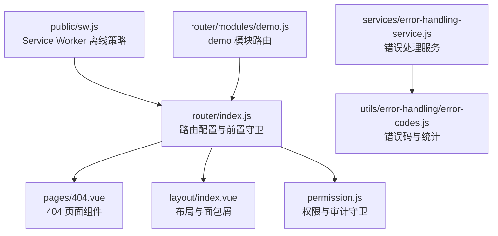
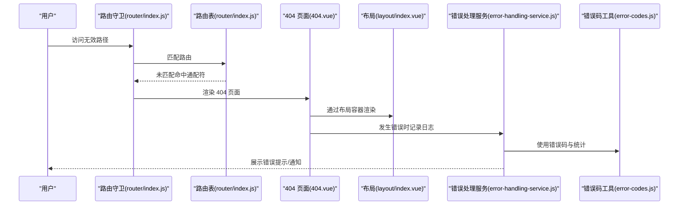
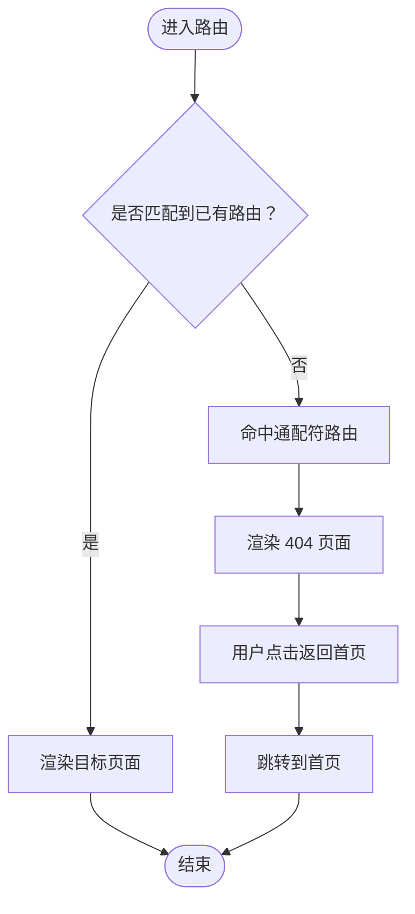
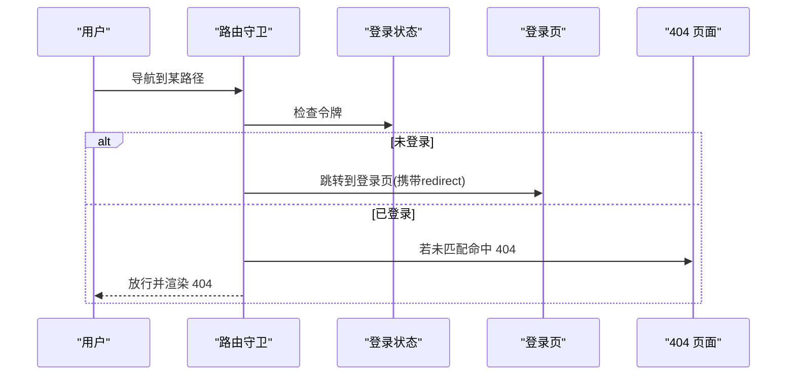
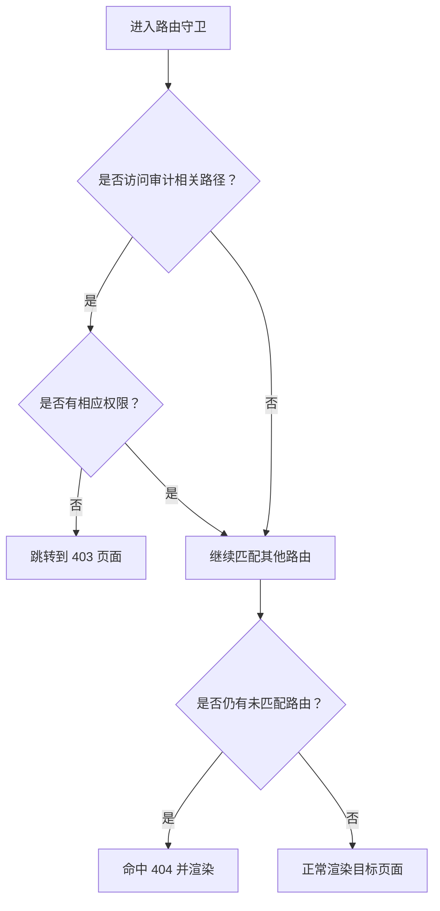
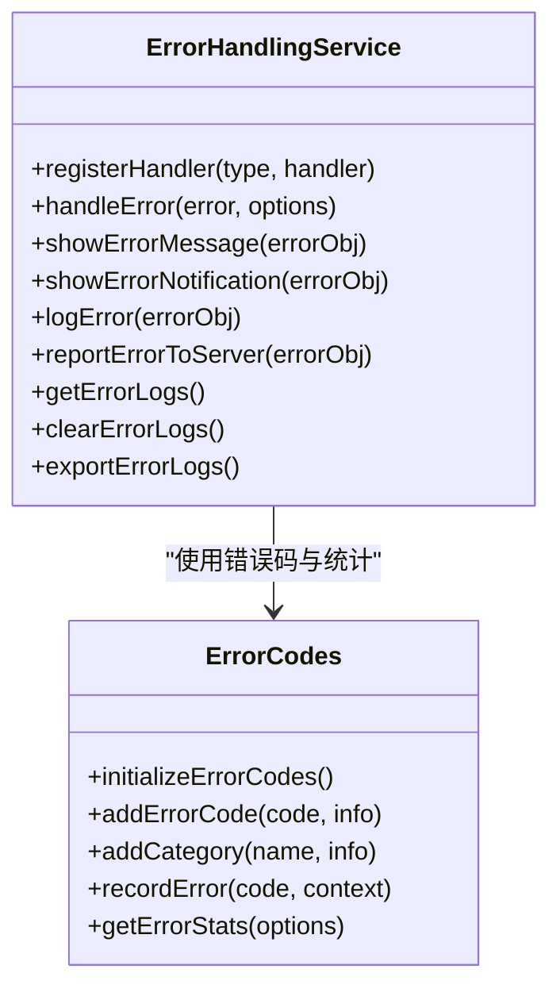
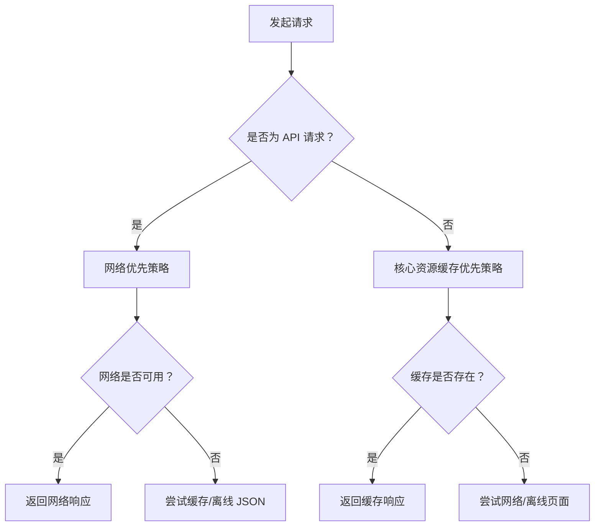
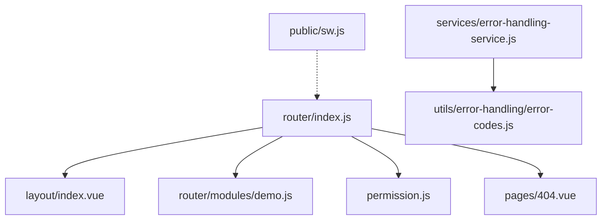

# 异常路由处理

<cite>
**本文引用的文件**
- [router/index.js](file://07-frontend/src/router/index.js)
- [404.vue](file://07-frontend/src/pages/404.vue)
- [demo.js](file://07-frontend/src/router/modules/demo.js)
- [layout/index.vue](file://07-frontend/src/layout/index.vue)
- [error-handling-service.js](file://07-frontend/src/services/error-handling-service.js)
- [error-codes.js](file://07-frontend/src/utils/error-handling/error-codes.js)
- [permission.js](file://07-frontend/src/permission.js)
- [sw.js](file://07-frontend/public/sw.js)
</cite>

## 目录
1. [简介](#简介)
2. [项目结构](#项目结构)
3. [核心组件](#核心组件)
4. [架构总览](#架构总览)
5. [详细组件分析](#详细组件分析)
6. [依赖关系分析](#依赖关系分析)
7. [性能考量](#性能考量)
8. [故障排查指南](#故障排查指南)
9. [结论](#结论)
10. [附录](#附录)

## 简介
本文件聚焦于前端异常路由处理策略，围绕 router/index.js 中通配符路由 “/:pathMatch(.*)*” 的实现原理进行深入解析，并结合 404 页面的展示逻辑与用户体验设计，说明错误提示信息、返回首页按钮、以及错误日志上报等机制。同时，结合 demo 模块的路由配置，阐述如何处理无效路径与不存在页面的请求，最后给出优化建议，包括路由白名单、智能重定向、记录错误访问日志等最佳实践。

## 项目结构
前端异常路由处理涉及的核心文件与职责如下：
- 路由配置与守卫：router/index.js
- 404 页面组件：pages/404.vue
- 布局与面包屑：layout/index.vue
- 权限与审计：permission.js
- 错误处理服务与错误码：services/error-handling-service.js、utils/error-handling/error-codes.js
- 离线与资源缓存：public/sw.js
- demo 模块路由：router/modules/demo.js

图表来源
- [router/index.js](file://07-frontend/src/router/index.js#L1-L228)
- [404.vue](file://07-frontend/src/pages/404.vue#L1-L23)
- [layout/index.vue](file://07-frontend/src/layout/index.vue#L1-L200)
- [permission.js](file://07-frontend/src/permission.js#L1-L13)
- [error-handling-service.js](file://07-frontend/src/services/error-handling-service.js#L1-L223)
- [error-codes.js](file://07-frontend/src/utils/error-handling/error-codes.js#L1-L200)
- [sw.js](file://07-frontend/public/sw.js#L153-L281)
- [demo.js](file://07-frontend/src/router/modules/demo.js#L1-L23)

章节来源
- [router/index.js](file://07-frontend/src/router/index.js#L1-L228)
- [404.vue](file://07-frontend/src/pages/404.vue#L1-L23)
- [layout/index.vue](file://07-frontend/src/layout/index.vue#L1-L200)
- [permission.js](file://07-frontend/src/permission.js#L1-L13)
- [error-handling-service.js](file://07-frontend/src/services/error-handling-service.js#L1-L223)
- [error-codes.js](file://07-frontend/src/utils/error-handling/error-codes.js#L1-L200)
- [sw.js](file://07-frontend/public/sw.js#L153-L281)
- [demo.js](file://07-frontend/src/router/modules/demo.js#L1-L23)

## 核心组件
- 通配符路由与 404 页面
  - 在路由配置中，通过 “/:pathMatch(.*)*” 捕获所有未匹配路径，统一交由 404 页面组件渲染，确保用户不会看到空白页或控制台报错。
  - 404 页面包含错误提示信息与“返回首页”按钮，点击后可快速回到应用主界面，提升用户体验。
- 路由前置守卫
  - 设置页面标题、处理登录态校验；对未登录用户强制跳转至登录页，并携带 redirect 参数以便登录后自动跳转。
- 布局与面包屑
  - 布局组件根据登录状态决定渲染方式；404 页面作为独立路由组件，不受菜单与面包屑影响。
- 权限与审计
  - 对特定路径（如审计模块）进行权限校验，若无权限则跳转至 403 页面，避免越权访问。
- 错误处理服务与错误码
  - 统一错误类型与级别，支持消息提示、通知、日志记录与上报；对 404 场景提供专门的处理分支。
- Service Worker 离线策略
  - 对 API 请求与核心资源采用不同缓存策略，网络失败时返回离线响应或降级页面，增强弱网与离线体验。

章节来源
- [router/index.js](file://07-frontend/src/router/index.js#L180-L228)
- [404.vue](file://07-frontend/src/pages/404.vue#L1-L23)
- [layout/index.vue](file://07-frontend/src/layout/index.vue#L1-L122)
- [permission.js](file://07-frontend/src/permission.js#L1-L13)
- [error-handling-service.js](file://07-frontend/src/services/error-handling-service.js#L1-L223)
- [error-codes.js](file://07-frontend/src/utils/error-handling/error-codes.js#L1-L200)
- [sw.js](file://07-frontend/public/sw.js#L153-L281)

## 架构总览
下图展示了异常路由处理的关键交互：用户访问无效路径时，路由守卫负责登录态与权限校验，随后由通配符路由将请求交由 404 页面组件渲染；同时，错误处理服务与错误码工具负责错误日志记录与上报；Service Worker 提供离线兜底能力。

图表来源
- [router/index.js](file://07-frontend/src/router/index.js#L180-L228)
- [404.vue](file://07-frontend/src/pages/404.vue#L1-L23)
- [layout/index.vue](file://07-frontend/src/layout/index.vue#L1-L122)
- [error-handling-service.js](file://07-frontend/src/services/error-handling-service.js#L1-L223)
- [error-codes.js](file://07-frontend/src/utils/error-handling/error-codes.js#L1-L200)

## 详细组件分析

### 通配符路由与 404 页面
- 实现原理
  - 在路由配置中，通配符路由 “/:pathMatch(.*)*” 使用 Vue Router 的路径匹配语法，能够捕获任意路径，从而将所有未显式声明的路径统一交由 404 页面组件处理。
  - 该通配符路由被标记为隐藏且带有元信息标题，确保其不会出现在菜单中，仅用于兜底。
- 404 页面展示逻辑
  - 页面包含错误提示信息与“返回首页”按钮；点击按钮后通过编程式导航回到首页，保证用户能快速回到可用功能。
  - 布局组件在未登录状态下会直接渲染路由内容（如登录页），而 404 页面作为独立路由组件，不受此逻辑影响。
- 用户体验设计
  - 页面居中展示，视觉上突出错误状态；提供明确的返回入口，降低用户迷失感。
  - 结合全局错误处理服务，可在 404 场景下记录日志并上报，便于后续分析与改进。

图表来源
- [router/index.js](file://07-frontend/src/router/index.js#L180-L191)
- [404.vue](file://07-frontend/src/pages/404.vue#L1-L23)
- [layout/index.vue](file://07-frontend/src/layout/index.vue#L101-L121)

章节来源
- [router/index.js](file://07-frontend/src/router/index.js#L180-L191)
- [404.vue](file://07-frontend/src/pages/404.vue#L1-L23)
- [layout/index.vue](file://07-frontend/src/layout/index.vue#L101-L121)

### 路由前置守卫与登录态校验
- 登录态校验
  - 守卫读取本地存储中的令牌，判断用户是否已登录；未登录时跳转至登录页，并携带 redirect 参数，登录成功后可自动回到原路径。
  - 已登录时直接放行，保证正常页面访问。
- 页面标题设置
  - 根据路由元信息动态设置页面标题，提升品牌一致性与可识别性。
- 与 404 的协作
  - 即使命中 404，守卫仍会执行登录态校验；若用户未登录，仍会先引导至登录页，再由 404 页面展示兜底。

图表来源
- [router/index.js](file://07-frontend/src/router/index.js#L200-L226)

章节来源
- [router/index.js](file://07-frontend/src/router/index.js#L200-L226)

### 权限与审计守卫
- 审计页面权限控制
  - 对包含特定路径片段的页面进行权限校验；若用户不具备所需权限，则跳转至 403 页面，避免越权访问。
- 与 404 的关系
  - 权限校验发生在路由守卫阶段，早于通配符匹配；因此当路径有效但权限不足时，会直接跳转至 403，而非 404。

图表来源
- [permission.js](file://07-frontend/src/permission.js#L1-L13)
- [router/index.js](file://07-frontend/src/router/index.js#L180-L191)

章节来源
- [permission.js](file://07-frontend/src/permission.js#L1-L13)
- [router/index.js](file://07-frontend/src/router/index.js#L180-L191)

### 错误处理服务与错误码
- 错误类型与级别
  - 统一定义错误类型（网络、API、验证、授权、业务、系统、未知）与级别（信息、警告、错误、严重），便于一致化处理。
- 日志记录与上报
  - 错误对象包含时间戳、URL、UA、堆栈等上下文信息；支持本地日志队列与服务端上报；全局错误捕获与未处理 Promise 拒绝也会触发上报。
- 404 场景处理
  - API 错误处理器包含 404 分支，向用户展示友好提示；同时错误处理服务可记录并上报该类错误，便于追踪无效访问与潜在攻击行为。
- 错误码与统计
  - 错误码工具提供分类、严重程度、HTTP 状态映射与统计功能；记录错误发生次数、首次与最近出现时间，并支持事件总线通知与安全相关错误处理。

图表来源
- [error-handling-service.js](file://07-frontend/src/services/error-handling-service.js#L1-L223)
- [error-codes.js](file://07-frontend/src/utils/error-handling/error-codes.js#L1-L200)
- [error-codes.js](file://07-frontend/src/utils/error-handling/error-codes.js#L462-L572)

章节来源
- [error-handling-service.js](file://07-frontend/src/services/error-handling-service.js#L1-L223)
- [error-codes.js](file://07-frontend/src/utils/error-handling/error-codes.js#L1-L200)
- [error-codes.js](file://07-frontend/src/utils/error-handling/error-codes.js#L462-L572)

### Service Worker 离线策略与 404
- 策略说明
  - 对 API 请求采用网络优先策略，失败时尝试缓存或返回离线 JSON；对核心资源采用缓存优先策略，失败时返回离线页面或默认文本。
- 与 404 的关系
  - 当用户处于离线或弱网环境时，SW 可能返回离线页面或降级响应；此时 404 页面仍可作为兜底，确保用户看到清晰的错误提示与返回入口。

图表来源
- [sw.js](file://07-frontend/public/sw.js#L153-L281)

章节来源
- [sw.js](file://07-frontend/public/sw.js#L153-L281)

### demo 模块路由与无效路径处理
- demo 模块路由
  - demo 模块定义了父级路由与子级页面，用户访问 demo 下的有效子路径时可正常渲染；若访问 demo 之外的无效路径，则命中通配符路由，交由 404 页面处理。
- 无效路径与不存在页面
  - 无效路径既可能是拼写错误，也可能是恶意探测；通过 404 页面统一展示，避免泄露内部路由结构；同时配合错误处理服务记录与上报，便于后续分析。

章节来源
- [demo.js](file://07-frontend/src/router/modules/demo.js#L1-L23)
- [router/index.js](file://07-frontend/src/router/index.js#L180-L191)

## 依赖关系分析
- 路由层依赖
  - router/index.js 依赖布局组件与各模块路由（含 demo），并通过前置守卫实现登录态与权限控制。
- 页面层依赖
  - 404 页面依赖 Element Plus 的按钮组件，通过编程式导航返回首页。
- 错误处理层依赖
  - 错误处理服务依赖 Element Plus 的消息与通知组件；错误码工具通过事件总线与服务通信，支持统计与告警。
- 离线层依赖
  - SW 与路由层解耦，通过浏览器 Fetch 事件拦截请求，提供离线兜底能力。

图表来源
- [router/index.js](file://07-frontend/src/router/index.js#L1-L228)
- [layout/index.vue](file://07-frontend/src/layout/index.vue#L1-L122)
- [demo.js](file://07-frontend/src/router/modules/demo.js#L1-L23)
- [permission.js](file://07-frontend/src/permission.js#L1-L13)
- [404.vue](file://07-frontend/src/pages/404.vue#L1-L23)
- [error-handling-service.js](file://07-frontend/src/services/error-handling-service.js#L1-L223)
- [error-codes.js](file://07-frontend/src/utils/error-handling/error-codes.js#L1-L200)
- [sw.js](file://07-frontend/public/sw.js#L153-L281)

章节来源
- [router/index.js](file://07-frontend/src/router/index.js#L1-L228)
- [layout/index.vue](file://07-frontend/src/layout/index.vue#L1-L122)
- [demo.js](file://07-frontend/src/router/modules/demo.js#L1-L23)
- [permission.js](file://07-frontend/src/permission.js#L1-L13)
- [404.vue](file://07-frontend/src/pages/404.vue#L1-L23)
- [error-handling-service.js](file://07-frontend/src/services/error-handling-service.js#L1-L223)
- [error-codes.js](file://07-frontend/src/utils/error-handling/error-codes.js#L1-L200)
- [sw.js](file://07-frontend/public/sw.js#L153-L281)

## 性能考量
- 路由匹配顺序
  - 将高频命中路由置于前面，减少通配符匹配开销；demo 等模块路由应尽量精确，避免与通配符冲突。
- 组件懒加载
  - 404 页面与各模块页面均采用异步导入，减少首屏体积与初次渲染时间。
- 错误上报异步化
  - 错误上报使用异步请求，失败时静默处理，避免阻塞主流程。
- 离线策略
  - SW 对 API 与核心资源采用不同策略，兼顾性能与稳定性；弱网环境下优先返回缓存或离线页面，降低失败率。

[本节为通用指导，无需列出具体文件来源]

## 故障排查指南
- 404 页面未显示
  - 检查路由配置中通配符路由是否位于末尾，确保不会被其他路由覆盖。
  - 确认 404 页面组件路径正确且可被正确导入。
- 登录态导致 404 无法访问
  - 若用户未登录，守卫会先跳转登录页；登录后再访问无效路径才会命中 404。
- 权限不足跳转 403
  - 审计等敏感页面需具备相应权限；若无权限将直接跳转 403，而非 404。
- 错误日志未上报
  - 检查错误处理服务的上报接口地址与网络连通性；确认全局错误捕获与未处理 Promise 拒绝监听已启用。
- 离线场景异常
  - 检查 SW 是否生效、缓存键是否正确、离线页面是否可用。

章节来源
- [router/index.js](file://07-frontend/src/router/index.js#L180-L228)
- [permission.js](file://07-frontend/src/permission.js#L1-L13)
- [error-handling-service.js](file://07-frontend/src/services/error-handling-service.js#L183-L199)
- [sw.js](file://07-frontend/public/sw.js#L153-L281)

## 结论
通过通配符路由 “/:pathMatch(.*)*” 与 404 页面的组合，前端实现了对无效路径的统一兜底；结合路由前置守卫的登录态与权限控制、错误处理服务的日志记录与上报、以及 Service Worker 的离线策略，整体形成了健壮的异常路由处理体系。demo 模块路由进一步验证了无效路径与不存在页面的处理流程。建议在生产环境中补充路由白名单、智能重定向与访问日志记录，以进一步提升安全性与可观测性。

[本节为总结性内容，无需列出具体文件来源]

## 附录
- 优化建议
  - 路由白名单：对公开可访问的路径建立白名单，仅允许白名单内的路径通过，其余一律 404 或 403。
  - 智能重定向：对常见无效路径（如历史旧链接）进行智能重定向，提升用户体验。
  - 访问日志记录：在路由守卫中记录无效访问的 URL、来源、UA、时间戳等，便于分析与防护。
  - 错误码分级：针对 404 场景引入专用错误码，区分“资源不存在”与“路径拼写错误”，便于统计与告警。
  - 离线体验：完善 SW 的离线页面与降级策略，确保在网络异常时仍能提供清晰的错误提示与返回入口。

[本节为通用指导，无需列出具体文件来源]